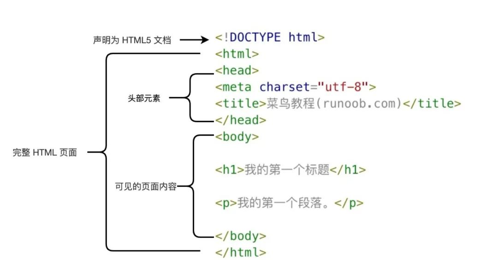

# 1. HTML简介

HTML中文名叫超文本标记语言（HyperText Markup Language）是一种用于创建网页的标准标记语言，注意这里HTML并不是编程语言。  

## 1.1 HTMl元素

HTML网页由HTML元素组成，HTML元素又叫HTML标签，常有单标签和双标签（开始标签和结束标签）两种类型。使用 HTML 可以用来建立自己的 WEB 站点，HTML 运行在浏览器上，由浏览器的渲染引擎（浏览器内核）来解析。（标签不区分大小写，但是建议使用小写。方便后期的维护和管理）

### 1.1.1. 基本组成

```html
示例1：<br>
示例2：<strong>测试加粗文字</strong>
```

- 标签由< > / 英文单词或者字母组成，并且<>包裹的内容称为标签名
- 单标签自成一体，无法包裹内容，如br、hr、img、input、audio、video
- 双标签由开始标签和结束标签组成，中间包裹内容 h、p、strong、em、a、ul、ol、dl、table、select、label、div、span
  区别单标签和双标签主要是看该标签是否还要嵌套东西，是否还要嵌套别的标签

### 1.1.2. HTML标签的属性

```html
示例：
```

- 标签的属性在开始标签内部
- 标签上可以存在多个属性
- 属性之间要以空格隔开
- 标签名和属性名之间必须以空格隔开
- 属性之间没有顺序之分
- 需要遵循属性名="属性名"为英文双括号 属性值为true时可以省略属性值或者属性名="属性名"，为false直接省略属性名即可

### 1.1.3. HTML标签的关系

- 父子（嵌套）关系

```html
<table>
    <cption></cption>
</table>
```

- 兄弟（并列）关系

```html
<h></h>
<p></p>
```

> web标准：就是让不同的浏览器按照相同的标准去显示结果，让展示的效果统一，分为以下三个构成：
>
> - HTML是网页内容的载体，内容就是网页制作者放在页面上想让用户浏览的信息，比如文字，图片，视屏等等，就是定义网页内容。（结构）
> - CSS是网页样式的表现，可以想象成网页的衣服，比如标题的变化，背景图片以及边框等等，就是定义我这个网页的布局是什么样的。（表现）
> - JavaScript是用来实现网页上的动态效果，控制网页行为，比如有什么样的动作，弹出消息之类的。（行为）
>   web标准要求网页中的结构、表现和行为实现三层分离

# 2. HTML骨架

html文件后缀为.html或者htm，通常有一个自己的骨架，vscode中输入英文感叹号加tab/enter即可出现

```html
<!DOCTYPE html>
<html lang="en">
<head>
    <meta charset="UTF-8">
    <meta http-equiv="X-UA-Compatible" content="IE=edge">
    <meta name="viewport" content="width=device-width, initial-scale=1.0">
    <title>测试标题</title>
</head>
<body>
    ......
</body>
</html>
```



- !DOCTYPE html 声明为 HTML5 文档
- html元素是 HTML 页面的根元素
- head元素包含了文档的元（meta）数据，如 <meta charset="utf-8"> 定义网页编码格式为 utf-8。
- title元素描述了文档的标题
- body元素包含了可见的页面内容
- h1 元素定义一个大标题
- p 元素定义一个段落

# 3. 排版标签

## 3.1. h标签

标题标签 h1-h6

- 文字加粗
- 文字逐渐变小
- 独占一行

```html
	<h1>一级标题</h1>
	<h2>二级标题</h2>
	<h3>三级标题</h3>
	<h4>四级标题</h4>
	<h5>五级标题</h5>
	<h6>六级标题</h6>
```

## 3.2. p标签

段落标签

- 段落之间存在间隙 上下都有空行
- 独占一行

```html
	<p>1111111</p>
	<p>2222222</p>
	<p>33333<br>333</p>
```

## 3.3. hr标签

水平分割线标签

```html
	12
<hr>
	34
```

## 3.4. br标签

换行标签，仅仅是另起一行，两个br可以空一行

```html
	12<br>34
```

> 使用空的段落标签p去插入一个空行是个坏习惯。用 `<br>` 标签代替它！

# 4. 文本格式化标签

```html
	<!-- 加粗 -->
	<b>加粗的文字</b><br>
	<strong>加粗的文字</strong><br>
	<!-- 下划线 -->
    <u>下划线文字</u><br>
    <ins>下划线文字</ins><br>
    <!-- 倾斜 -->
    <i>倾斜的文字</i><br>
    <em>倾斜的文字</em><br>
    <!-- 删除线 -->
    <s>删除线文字</s><br>
    <del>删除线文字</del><br>
```

记住strong加粗和em倾斜即可，表示强调语义的标签，用后面的完整单词 ，单词表达的语义更加得强烈

> 标签语义化：让标签有自己的含义，区别于后面的无语义化标签div与span

# 5. 媒体标签

## 5.1. img标签

图片标签 

```html

```

- src：必写属性，图片的路径来源
- alt：为图片无法加载的提示文字
- title：鼠标悬停时的提示文字，可以用于任意标签
- width：宽度
- height：高度（width和height只设置一个会实现图片等比例缩放，若同时设置图片可能会发生变形）
- border：边框宽度 
  先不用管以后在css中进行设置，不用在html中设置

## 5.2. 绝对路径和相对路径

网页需要找到资源，必须要有一个路径

### 5.2.1. 绝对路径（了解）

1. 指目录下的绝对位置，可直接到达目标位置，通常从盘符开始的路径

```html

```

2. 路径为网页url，特别依赖网络，可能会出现图片失效的情况

```html

```

网络地址必须联网以http:或者https:开头才可以 ，需要联网。

### 5.2.2. 相对路径（重要）

从当前文件出发找到目标文件的过程

1. 同级目录：当前文件和目标文件在同一目录中 

   直接写同级目录下的文件名称即可，或者vscode按./会自动查找当前目录下的文件(建议使用)
   方法一：目标文件名``
   方法二：./目标文件夹/目标文件名``

3. 上级目录：目标文件在上级目录中  

   vscode中输入../自动显示上级目录下的所有文件，在一层层选择即可，上两级：../../自动选择即可。实际开发过程中 一般很少出现上两级以上的 最多出现上一级。直接斜杠就是从那文件的根目录开始导航，一层层选择到目标文件
   上一级目录：../目标文件夹``
   上两级目录：../../目标文件夹``

## 5.3. audio标签

音频标签

```html
	<audio src="./素材/media/1.mp3" controls autoplay loop>音乐音乐</audio>
```

- src：播放音频的路径
- controls：显示播放音频的控件播放暂停按钮（属性值可以省略）因为audio无法自动播放所以没有这一属性无法播放
- autoplay：音频加载完毕后会自动播放 谷歌考虑用户的体验问题禁用了这一属性
- loop：音频结束后重新开始播放

> 音视频开始结束标签中间内容可加可不加，加了也不显示

## 5.4. video标签

视频标签

```html
 <video src="./素材/media/2.mp4" controls autoplay muted loop></video>
```

- src：播放音频的路径
- controls：显示播放视频的控件就是那些播放暂停按钮（属性值可以省略）
- autoplay：视频加载完毕后会自动播放 配合谷歌的muted会自动静音播放。只加autoplay无法自动播放加上muted才行（谷歌考虑用户体验禁用的单独的autoplay）
- loop：音频结束后重新开始播放

> 这里的音视频控件是谷歌提供的控件，不同的浏览器控件样式不同

# 6. a标签

链接标签，点击之后从一个页面跳转到另一个页面

```html
<a href="https://www.mi.com/">小米商城</a>
```

href：Hypertext Reference 超文本引用链接跳转的路径，必写属性 

- a标签从未点击过，显示的颜色为蓝色
- a标签点击过，显示的颜色为紫色，删除浏览器的查看记录后会恢复蓝色
- a标签默认为有下划线，后面用css修饰

## 6.1. 链接分类

1. 外部链接

```html
<a href="https://www.mi.com/">小米商城</a>
```

外部链接必须是以http、https开头的网页链接 

2. 内部链接

```html
    <a href="./03-视频标签.html">跳转到当前html或者某个文件</a>
```

内部链接可以跳转到文件资源内的某个html文件或者某个媒体资源

3. 网页元素链接

```html
    <a href="https://www.jd.com/"></a>

```

点击图片进行跳转，非常依赖网络 

4. 下载链接

```html
    <a href="../day00/VSCodeUserSetup-x64-1.47.0.exe">download</a>
```

- 下载链接文件名称必须以.exe .zip .rar结尾的文件名 
- 目前只能在自己的电脑上打开，平常都是部署在服务器上可以供用户下载

5. 空连接使用

```html
<a href="#">空连接</a>
```

不跳转到任何页面，或者实际开发中回到网页顶部，或者开发中不确定链接最终的位置，先用空连接占个位置

> 空连接不会跳转，屏幕不会闪动一下，跳转到本页面屏幕会跳动一下

## 6.2.target属性

网页的打开方式

```html
<a href="https://www.jd.com/" target="_self">京东商城</a>
<a href="https://www.jd.com/" target="_blank">京东商城</a>
```

`target="_self"`：在当前窗口打开，覆盖原始网页/窗口
`target="_blank"`：打开一个新的页面/窗口 

> 注意不加target属性，默认是覆盖当前页面

# 7. 列表标签

在网页中按照行展示关联性的内容，如：新闻列表、排行榜、账单等

## 7.1. 无序列表

无序列表：表示网页中无顺序之分的列表项，如新闻列表，重新排列顺序不影响用户的体验 (用的比较多一些)

```html
<h2>水果列表</h2>
    <ul>
        <li>榴莲</li>
        <li>苹果</li>
        <li><a href="#">百度</a></li>
    </ul>
```

- ul标签：无序列表的整体，只能包含li标签
- li标签：无序列表的每一项，可以包含任意内容，比如a标签img标签等
  无序列表默认前面有小圆点，后续有css处理

> 注意li标签只能在ul标签内

## 7.2. 有序列表

有序列表：用来表示带顺序的一组列表 如：排行榜

```html
<h2>人物列表</h2>	
	<ol>
        <li>小哥哥</li>
        <li>小姐姐</li>
        <li>小可爱</li>
        <li></li>
    </ol>
```

- ol标签：无序列表的整体，只能包含li标签
- li标签：无序列表的每一项，可以包含任意内容，比如a标签img标签等
  有序列表默认前面有数字标识，后续css处理样式

> 同时注意li标签只能在ol标签内部

## 7.3. 自定义列表

在网页的底部导航中通常会使用自定义列表实现

```html
	<dl>
        <dt>帮助中心</dt>
        <dd>账户管理</dd>
        <dd>购物指南</dd>
    </dl>
```

- dl：自定义列表整体，用于包裹dt/dd标签
- dt：自定义列表的主题（第一行）
- dd：自定义列表针对主题的每一项内容

> dl和dt、dd和父子关系，dt和dd是兄弟关系
> dd前面会默认缩进显示，后续用css处理
> dl标签只能包含dt和dd标签.dt/dd可以包含任意内容

# 8. 表格标签

在网页中以行+列的单元格的方式整齐展示和数据，如学生成绩表

```html
<table border="3" width="600" height="200" align="center" rules="all">
        <!-- width已经在table中全局定义了，在tr中设置width属性无效 -->
        <caption>
            <h1>学生成绩单</h1>
        </caption>
        <!-- 若发现标题和表格有一定空行需要caption中用到h标签 -->
        <thead>
            <tr align="center" height="50">
                <!-- 设置了一个tr的height属性，另外两个tr的height在table的基础上均分 -->
                <th>1</th>
                <th>20</th>
                <th>男</th>
                <th>100分</th>
            </tr>
        </thead>
        <tbody>
            <tr>
                <td>2</td>
                <td>30</td>
                <td>男</td>
                <td>80分</td>
            </tr>
        </tbody>
        <tfoot>
            <tr>
                <td>3</td>
                <td>60</td>
                <td>女</td>
                <td>90分</td>
            </tr>
        </tfoot>
        </table>>
```

table：表格整体 table>tr>td

- caption：表格大标题，默认在表格整体顶部居中位置显示，书写在table标签内部，caption与table和父子关系，与tr是兄弟关系
- th：表头单元格，表示一列小标题，通常用于表格第一行，默认内部文字加粗并居中显示 th标签写在tr标签内部（用于替换td标签）
- tr：表格的每一行
- td：每一个单元格 

> width已经在table中全局定义了，在tr中设置width属性无效

## 8.1. table属性

在table开始标签中设置

- border：设置表格边框
- width：设置宽度
- height：设置高度
- align：设置表格的对齐方式（对齐方式left|center|right）
- rules：all（细线表格）了解，后续会通过css设置

## 8.2. tr属性

- align：设置表格的对齐方式（left|center|right）
- height：设置高度

> width已经在table中全局定义了，在tr中设置width属性无效
> 设置了一个tr的height属性，另外两个tr的height在table的基础上均分

## 8.3. 表格的结构化标签

让表格的内容结构分组，突出表格的不同部分头部、主体、底部，使语义更加的清晰（了解即可）用来包裹tr标签，可以省略

- thead 头部
- tbody 主体
- tfoot 底部

## 8.4. 合并单元格

将水平或者垂直多个单元格合并成一个单元格

```html
<table border="3" rules="all" height="200" width="400" align="center"> 
            <!-- 后续关于table属性都会在css中设置 -->
            <caption>测试合并单元格</caption>
            <tr>
                <td></td>
                <td></td>
                <td></td>
                <td></td>
            </tr>
            <tr>
                <td rowspan="3"></td>
                <td></td>
                <td></td>
                <td></td>
            </tr>
            <tr>
                <!-- <td></td> -->
                <td></td>
                <td></td>
                <td></td>
            </tr>
            <tr>
                <!-- <td></td> -->
                <td></td>
                <td colspan="2"></td>
                <!-- <td></td> -->
            </tr>
        </table>
```

- rowspan="n" 跨行合并，将多行的单元格垂直合并
- colspan="n" 跨列合并，将多列的单元格垂直合并
  合并单元格的步骤：

1. 明确合并哪几个单元格
2. 通过左上原则，确定保留谁删除谁
   - 上下合并：只保留最上面的，删除其他的
   - 左右合并：只保留最左边的，删除其他的
3. 给保留的单元格设置属性：跨行（rowspan）跨列（colspan）属性值为合并的单元格的个数

> 合并单元格不能跨结构标签thead、tbody、tfoot进行合并

# 9. 表单标签

网页中表单标签用来收集用户信息，如注册页登记个人注册信息，input标签属于表单标签，名字是输入标签
如果需要实现按钮相关功能，必须在表单外面嵌套form表单域标签

```html
<form action="xx.php" method="get">
<input type="text"  placeholder="请输入用户名" name="username">
<input type="submit" value="免费注册">
......
</form>
```

form 表单域标签 
所有的表单控件必须包含在form标签里面，按钮才会有他的功能 即form在最外层 包裹所有的表单控件

- action是提交的地址
- method是提交的方式 有get、post 服务端编程会讲到 这里只做模拟提交，可自行百度进一步了解

## 9.1. input标签

网页中显示收集用户信息的表单效果。如登录页、注册页等
input标签通过type属性值的不同，展示不同效果`<input type="">`

### 9.1.1. input输入系列标签

| type属性值 | 含义       | 用途               | 备注                                                         |
| ---------- | ---------- | ------------------ | ------------------------------------------------------------ |
| text       | 文本框     | 用于输入单行文本   | 默认就是text                                                 |
| password   | 密码框     | 用于输入密码       |                                                              |
| radio      | 单选框     | 圆形，用于多选一   | 多选一必须设置相同的name值，checked：默认选中                |
| checkbox   | 多选框     | 方形，用于多选多   | 多选多必须加上相同的name值（传后台数据时需要），checked：默认选中 |
| file       | 文件选择   | 用于点击后上传文件 | multiple 属性为支持多文件上传                                |
| search     | 搜索框     | 用于搜索           |                                                              |
| number     | 数值输入框 | 只用于输入数字     |                                                              |

```html
昵称：<input type="text" name="" id="" placeholder="请输入用户名">
密码：<input type="password" name="" id="" placeholder="请输入密码">
性别：男<input type="radio" name="sex">女<input type="radio" name="sex">
<!-- 要实现多选一的效果，必须设置相同的name属性值 -->
爱好：<input type="checkbox" name="hobby" id="">敲代码
	 <input type="checkbox" name="hobby" id="">熬夜
	 <input type="checkbox" name="hobby" id="">掉头发
<!-- 要实现多选多的效果，也必须加上相同的name值，同单选框一样，checked为默认选中 -->
<!-- 虽然多选不设置name值 也可以每个都可以选中，但是涉及到后台服务器之后，一定要设置name-->
请上传文件：<input type="file" multiple>
搜索：<input type="search" name="" id="" placeholder="请开始搜索">
电话号码：<input type="number" name="" id="">
补充：
颜色：<input type="color" name="" id="">
时间：<input type="time" name="" id="">
日期：<input type="date" name="" id="">
<!--了解，以后很多插件比这个好看很多-->
```

- name属性最好不要用中文或者数字，就用属性的英文名称
- 直接检查中把password修改成text可以显示文本
- placeholder属性是占位符，提示用户将要输入的信息
- input的type还有很多，需要可以去w3c手册查找

### 9.1.2. input按钮系列标签

| 标签名 | type属性值 | 备注                                     |
| ------ | ---------- | ---------------------------------------- |
| input  | submit     | 提交按钮，用于提交                       |
| input  | reset      | 重置按钮，用于重置表单到初始状态         |
| input  | button     | 普通按钮，默认无功能，之后配合js添加功能 |

```html
<!-- 提交按钮 提交数据到后台 配合form设置属性action 和 method使用type="submit" 默认名字是提交-->
<input type="submit" value="免费注册">
<!-- 重置按钮 把表单恢复到初始状态 type="reset" 默认名字是重置-->
<input type="reset" value="重新填写">
<!-- 普通按钮 后续配合js一起使用 type="button" 没有默认名字 为一个空白的按钮-->
<input type="button" value="发送短信">
```

- input的name和id属性后续数据交互时会用到，这里简单了解
  - name：当前控件的含义，提交之后可以告诉后端发过去的数据是什么含义
  - id：类似于人的身份证号，用于唯一标识一个元素
- input的value属性是input元素的设定值，提交之后会发送给后台服务器
- 对于不同的输入类型，value 属性的用法也不同：
  - `type="button", "reset", "submit" `- 定义按钮上的显示的文本          
  - `type="text", "password", "hidden" `- 定义输入字段的初始值（hidden表示隐藏域，隐藏域的值在前端页面是看不到的，这就很方便我们把一些不希望被其他人看到的数据放进去，这也是隐藏域的另一个作用）
  - `type="checkbox", "radio", "image"` - 定义与输入相关联的值 与数据交互相关

> 了解：`<input type="checkbox">` 和 `<input type="radio">` 中必须设置 value 属性，与数据交互有关
> value 属性无法与 `<input type="file"> `一同使用。可自行百度。

## 9.2. button标签

网页中显示用户点击的按钮，type属性值同input按钮组系列，input的value属性是按钮上显示的，button开始结束标签包裹的内容是按钮上所显示的

```html
	<button type="submit">提交按钮</button>
    <button type="reset">重置按钮</button>
    <button type="button">普通按钮</button>
```

- submit：提交到后端服务器
- reset：点击后恢复到表单默认值
- button：普通按钮无功能，配合js添加功能

> 注意button按钮是双标签 便于包裹其他内容文字图片等
> 实际开发中不用写type值，配合js实现逻辑功能，谷歌默认为提交按钮,直接`<button>搜索</button>`
> button 的value属性必须设置但是要传给后端，需要绑定事件，在js后讲到

## 9.3. select标签

下拉菜单标签

```html
所在城市：<select >
        <option value="">上海</option>
        <option value="" selected>武汉</option>
        <!-- 这里的value值先不管 -->
        <option value="">北京</option>
    	</select>
```

- select：下拉菜单标签，为一个整体，用来包裹option标签
- option：下拉菜单的每一项 
- option标签属性 selected 默认选中

## 9.4. textarea标签

textarea标签在网页中提供可输入多行文本的表单控件

```html
留言：<br><textarea name="" id="" cols="30" rows="10" placeholder="请您留言"></textarea>
```

- rows 规定了可见行数
- cols 规定了可见宽度
- 实际开发都用css设置 直接忘掉这两个属性  右下角可以拖拽也可用css修饰

> input系列、button系列、select\textarea需要放在form表单域里面才可供提交等操作

## 9.5. label标签

lable标签常用于绑定内容与表单标签的关系，比如点击性别选中前面的单选框

```html
<label for="1">男</label>
        <input type="radio" name="sex" id="1">
        <!-- 文本内容放在input前后都可以 -->
        <label for="2">女</label>
        <input type="radio" name="sex" id="2">
```

使用方法一：

1. 使用lable标签把内容（如文本）包裹起来
2. 在表单标签上添加id属性
3. 在lable标签的for属性设置对应相同的id属性值

```html
<label>
           爱好 <input type="checkbox">敲代码
           <!-- lable里前后的文本都识别，把爱好放在lable外层，习惯是内容放在checkbox或者radio的后面 -->
        </label>
```

使用方法二（更简单常用）：

1. 直接使用lable把内容和表单标签一起包裹起来
2. 需要把lable标签的for属性删除

# 10. 语义化标签

## 10.1. 无语义化标签

实际开发中会大量频繁的使用没有语义化的div和span标签，div本身无任何语义，用作布局以及样式化标签

- div 一行只显示一个  一般是用到div加css布局 合理的语义化 p是段落标签
- span 一行显示多个，如果装不下自动换行，span只用数字的话换不了行
  块级元素在浏览器显示时，通常会以新行来开始（和结束），内联元素在显示时通常不会以新行开始 
- 块级/区块元素：h p ul table div
- 内联元素：b/strong td a img

## 10.2. 有语义化标签

```html
	<header>网页头部</header>
    <nav>网页导航</nav>	
    <footer>网页底部</footer>
    <aside>网页侧边栏</aside>
    <section>网页区块</section>
    <article>网页文章</article>
```

以上标签特点和div一致，只是必div多了不同的语义，供计算机更好的识别 在移动端布局会大量使用

## 10.3. div与语义化标签的区别

html5提供的语义化标签可以让让开发人员更加理解你的html结构及代码易读
语义化标签有利于搜索引擎收录，有利益浏览器渲染，可读性可维护性增强

# 11. 字符实体

## 11.1. html中空格的合并现象 

html中输入多个空格、换行、tab缩进时浏览器指挥解析成一个空格，需要多个需要用到字符实体

## 11.2. 字符实体用法

&英文; (结尾加上英文分号)

```html
我很想&nbsp;&nbsp;&nbsp;&nbsp;&nbsp;你
    <p>p标签长这个样子&lt;p&gt;</p>
```

| 意义   | 符号     |
| ------ | -------- |
| 空格   | `&nbsp;` |
| 大于号 | `&gt;`   |
| 小于号 | `&lt;`   |
| 双引号 | `&quot;` |
| ©      | `&copy;` |

以上三个为常用字符实体，别忘了后面的英文分号