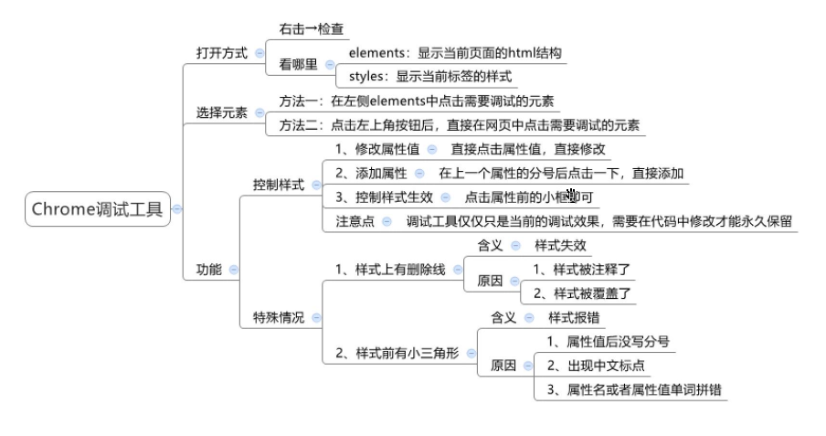
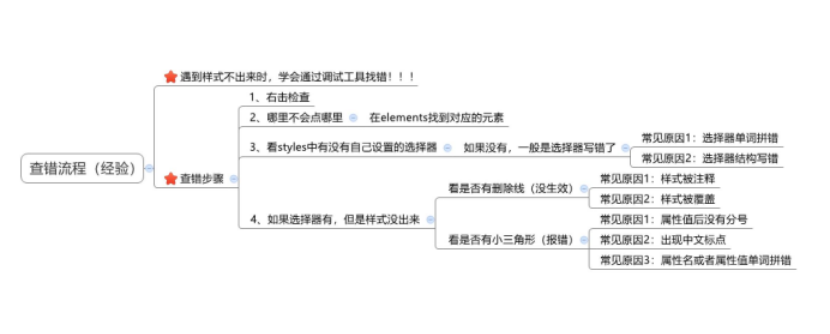
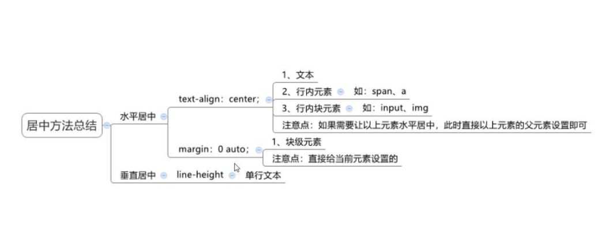

# 谷歌调试工具



注意点

- 如果出现了一大片黄色感叹号，极有可能是一对括号少打了一个括号
- 样式没有显示，大概率就是类名拼写错误，选择其中类名写成了标签名或者标签名写成了类名
- 样式出了问题，要去看谷歌的控制台，右侧有属性style的行数
- 被注释前面勾选框没有勾，被覆盖有勾



> 这里仅仅提供的是调试效果，想要真正的修改需要在代码中修改

# 元素显示模式

## 块级元素

`display:block;`（常用，元素显示模式转换时设置）
特点

1. 独占一行（一行只能显示一个）
2. 宽度默认是父元素的高度，高度默认由内容撑开
3. 可以设置宽高

代表标签：div、p、h、ul、li、dl、dt、dd、form、header、nav、footer...... 

> 上下两个块级元素之间没有间隙

## 行内元素

`display:inline;`（不常用，元素显示模式转换时设置）
特点

1. 一行可以显示多个，装不下的时候会自动换行
2. 宽度和高度默认由内容撑开，不能继承父元素的宽高
3. 不可以设置宽高

代表元素：a、span、b、u、i、s、strong、ins、em、del......

## 行内块元素

`display:inline-block;`（常用，元素显示模式转换时用到）

1. 一行显示多个
2. 可以设置宽高

代表元素：input、textarea、button、select、img......

在谷歌调试工具（F12或者鼠标右键检查）computed（计算样式）

> 特殊情况：img是行内块元素，但是在chrome调试工具中显示是inline
>
> 行内块元素和下面元素默认有一定间隙

## 元素显示模式转换

三种元素显示模式可以在属性中设置相互转换，转换主要是为了改变元素的显示特点，让元素符合布局要求。

主要应用：

- a链接设置宽高，增加触发范围，点击更加容易，增加用户体验
- 需要多个元素显示一行并且设置宽高需要转换成inline-block

```CSS
        span {
            /* 转换成块级元素（较多使用）
            独占一行，设置宽高 */
            display: block;
            width: 200px;
            height: 300px;
            background-color: pink;
        }
```

> 转换模式习惯写在属性的第一行，提高浏览器的渲染性能

# 拓展知识

## a标签相关

- a链接文字和背景点击了都有效，说明a外面没有盒子，只是转换了a标签为block或者inline-block，设置相应的宽高。
- 如果只点击文字有效，则文字外面必须嵌套一个div进行分别设置，用的较多的是li里面的套的a标签，如新闻列表，只点击文字有效
- 注意a标签的字体颜色和去除下划线样式需要选中到a标签，运用css的继承性无效

## 标签嵌套注意事项

1. 块级元素一般作为大容器，可以嵌套：文本、块级元素、行内元素、行内块元素等，不要用文字类型的标签去包含div，比如p不要去嵌套div、p、h等块级元素
2. a标签内部可以嵌套任意元素，行内元素可以嵌套行内元素，但是a标签不能嵌套a标签 
3. a标签可以嵌套块级元素，但是建议进行元素转换，a需要转换成block

## 居中方法总结



水平居中：text-align可以让以下元素居中:

- 文本
- span,a标签（行内元素）
- input标签,img标签（行内块元素）
- strong、em等文本格式标签（行内元素）

让以上元素水平居中直接给以上元素的父元素设置`test-align:center;`即可。常用a标签转换成行内块后，直接给a设置即可

块级元素，直接给当前元素设置margin:0 auto，即可让当前盒子在固定宽度的父容器里水平居中

# CSS三大特性

## 继承性

子元素有默认继承父元素某些样式的特点（子承父业）并不是所有的可以继承，控制文字的属性都能继承，不是控制文字的都不能继承 ，以下可以继承：

- color
- font-style、font-weight、font-size、font-family
- text-indent、text-align
- line-height

> 可以通过chrome调试工具判断样式是否可以继承，灰色的都是不能继承的属性，高亮的都是可以继承的（inherited from）

好处是在一定层度上减少代码，常见应用场景如下：

- 可以直接给ul设置`list-style:none;`属性，从而去除列表默认的小圆点样式
- 直接给body标签设置统一的font-size，从而统一不同浏览器默认文字大小

继承失败的情况：

- 给a标签父元素设置color，给a标签设置color必须选中a标签,`text-decoration:none;`不能继承，f12查看是灰色的
- h系列的标签的父元素设置font-size会失效，需要单独选中h标签设置
- div的高度不能继承，但是宽度有类似于继承的效果，div有独占一行的特性 ，不设置宽度都是继承父元素的宽度

> 其实都继承下来了，但是被浏览器默认设置的样式所覆盖了

```css
<!DOCTYPE html>
<html lang="en">

<head>
    <meta charset="UTF-8">
    <meta http-equiv="X-UA-Compatible" content="IE=edge">
    <meta name="viewport" content="width=device-width, initial-scale=1.0">
    <title>Document</title>
    <style>
        .father .son {
            color: orange;
        }
        .father {
            color: yellow;
        }
    </style>
</head>
<body>
    <div class="father">
        <p class="son">
            <span>文字</span>
        </p>
    </div>
</body>
</html>
```

以上需要考虑优先级的情况，两个选择器全是继承的情况，都是继承，离它近的优先级高，son的样式覆盖了他的父元素的样式，文字呈orange色

## 层叠性

相同的选择器设置相同的样式才会有重叠性

- 给同一个标签设置不同的样式，会层叠叠加
- 给同一个标签设置相同的样式，会覆盖，写在最后面的样式会生效

> 特别注意：当样式冲突时，只有当选择器优先级相同时，才能通过层叠性判断结果，优先级高的即使写在前面也会生效

## 优先级

当样式发生冲突时，不同的选择器有不同的优先级，优先级高的选择器样式会覆盖优先级低的选择器样式。

优先级公式：继承<通配符选择器<标签选择器<类选择器<id选择器<行内样式<!important

注意点：

- !important写在属性值的后面，分号的前面，没有逗号隔开
- !important不能提升继承的优先级，只要是继承，优先级一定是最低的
- 实际开发中不建议使用!important

### 权重叠加计算

选择器出现样式冲突了，才开始比较优先级看哪个生效，如果是复合选择器，此时需要通过权重叠加计算方法，判断最终哪个浏览器优先级最高会生效。行内样式个数、id选择器个数、类选择器个数、标签选择器个数可以记行内1000、id0100、 类0010、标签0001，每一级不存在进位
比较规则：

1. 先比较第一级数字，如果比较出来了，之后的统统不看
2. 如果第一级数字相同，表示第一级优先级相同，再去比较第二级数字，如果比较出来，后面的也不看了
3. 。。。。。。
4. 如果所有数字都相同，则优先级相同，层叠即可，即写在最下面的生效

权重计算步骤：

1. 先判断选择器是否能直接选中标签，不能选中的话就是继承，优先级最低
2. 通过计算公式，判断谁的权重比较高

> - 记住!important如果不是继承，天下第一，权重最高 
> - vscode中鼠标放在选择器上，会出现选择器的权重，虽然只有三个，但是脑海里要默认有行内样式存在为1或者不存在为0
> - 特别注意实际开发中选择标签要精准，尽量避免多个选择器同时选中一个标签的情况，不要自己为难自己