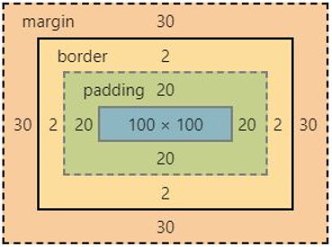

# 1. 盒子模型组成

我们所用到的所有标签都是盒子，通过盒子的视角可以更方便我们进行网页布局，浏览器在渲染网页时，会将网页中的元素都看作是一个个小的矩形区域，我们称之为盒子。
CSS中盒子由四部分组成：
内容区域（content）、内边距区域（padding）、边框区域（border）、外边距区域（margin）

# 2. 内容区域

利用width和height属性默认设置盒子内容区域的大小 ，语法是数字加px

# 3. 边框

边框粗细 border-weight 数字+px
边框样式 border-style 实线solid 虚线dashed 点线dotted
边框颜色 border-color 颜色取值

## 3.1. 边框属性连写

边框的连写（常用） 取值之间用空格隔开，如 `border:1px solid red;`。顺序没有要求，但是推荐weight style color 这样写更加规范，代码更易读，每一项都可以按需省略，省略了就是默认值，取值之间用空格隔开

## 3.2. 边框单方向

只给盒子的某个方向单独设置边框
语法是border-方位名词:连写的取值，如`border-top:5px solid yellow`
水平left和right，竖直top和bottom

## 3.3. 盒子实际大小初级计算

盒子实际大小初级计算公式（未设置内边距padding）

- 设置的width和height都是内容的宽高
- 设置的border会撑大盒子 
  解决：
- 计算多余大小，手动在内容中减去（较为麻烦）
- 自动减去（后面再说）一开发中用到的都是自动减去

# 4. 内边距

内边距padding就是边框border与内容区域之间的距离，调试工具中的computed计算样式中有盒子模型可以清楚地看到，属性值主要设置如下：

- 一个值：上右下左都一样
- 两个值：上下一样 左右一样
- 三个值 ：上 左右一样 下
- 四个值 ：上右下左都不一样

从上开始赋值，然后顺时针旋转。也可以其中的某三个设为0来实现单方向的需求

> 盒子有固定宽高时padding一般只用写一边，上下只写上，左右只写左，这样就可以定位盒子的位置，盒子高度不够时，文字内容会偏下，视觉效果仅上padding有效。盒子宽高未固定时，可以同时设置上下或左右padding。

## 4.1. 内边距单方向设置

单方向设置内边距： padding-left、padding-right、padding-top、padding-bottom ，`padding+方位名词:数字+px;`

## 4.2. 盒子模型终极计算公式

盒子实际大小终极计算公式

- 设置的width和height是内容区域的宽高 
- 设置border会撑大盒子
- 设置padding会撑大盒子

计算公式：

- 盒子宽度=左边框+左padding+内容宽度+右padding+右边框
- 盒子高度=上边框+上padding+内容高度+下padding+下边框

## 4.3. 自减盒子模型

手动内减即设置了border和padding后需要自己重新去修改内容区域的width和height，在工程中使用很麻烦，实际开发都是的自动内减，让浏览器自动帮我们执行，一般在style标签开始用通配符标签加上`box-sizing:border-box;`即可实现自动内减。

```css
{
	margin: 0;
    padding: 0;
    box-sizing: border-box;
}
```

> 自动内减在vscode中无法显示，但是在浏览器渲染过程中自动改变了width和height，自己在调试工具中改变大小后，盒子模型会有变化

## 4.4. 内边距应用

设置盒子的固定宽度后，块级元素div的文字超过了宽度会自动换行 ，这时可以取消固定width的设置，通过给盒子设置左右padding来撑大盒子，如导航页各个导航里的文字数目不同，不设置固定宽度。

> 浏览器有自己的最大宽度，未设置盒子的width就等于浏览器的最大宽度，块级、行内、行内块文字超过了父盒子的宽度都会自动换行

# 5. 外边距

margin设置边框以外，盒子与盒子之间的距离，调试工具中的computed计算样式中有盒子模型可以清楚地看到，属性值主要设置如下：

- 一个值：上右下左都一样
- 两个值：上下一样 左右一样
- 三个值 ：上 左右一样 下
- 四个值 ：上右下左都不一样

从上开始赋值，然后顺时针旋转。也可以其中的某三个设为0来实现单方向的需求

## 5.1. 外边距单方向设置

单方向设置外边距： margin-left、margin-right、margin-top、margin-bottom ，`margin+方位名词:数字+px;`

## 5.2. margin单方向设置的应用（重要）：

| 方向     | 属性          | 含义                 |
| -------- | ------------- | -------------------- |
| 水平方向 | margin-left   | 让当前盒子往右移动   |
| 水平方向 | margin-right  | 让右边的盒子往右移动 |
| 垂直方向 | margin-top    | 让当前盒子往下移动   |
| 垂直方向 | margin-bottom | 让下面的盒子往下移动 |

> 两个行内块在一行一般不会只给一个块设置margin-bottom，会同步设置margin-bottom，只设置一个浏览器渲染时会出现问题

## 5.3. 清除内外边距

很多标签有自带的内外边距，是浏览器自带的，为了更好地布局，需要在刚开始就清除掉某些标签自带的padding和margin，一般在style标签的开始就配置上

```css
* {
        padding: 0;
        margin: 0;
        box-sizing: border-box;
/* padding和border设置了之后会撑大盒子，这里让浏览器达到自动内减，不再撑大盒子 */
        }
```

# 6. 内外边距的特殊情况

## 6.1. padding不会撑大盒子的情况（块级元素）

1. 如果盒子没有设置宽度，此时宽度默认是父盒子的宽度，子盒子宽度等于父盒子的宽度，如果子盒子设置左右的padding或者左右的border，此时不会撑大子盒子
2. 上下padding父盒子有固定高度，子盒子未设置固定高度，设置padding也不会撑大，但会超出父盒子，视觉效果并没有撑大，因为高度并不默认等于父盒子高度开始为0，只有宽度是开始默认等于父盒子宽度，就是会撑大自身

## 6.2. margin和padding无效

- 行内元素设置时，水平方向有效，竖直方向无效，盒子模型中显示正常。如果需要的话需要进行元素显示模式的转换，转换成行内块或者块级元素
- 行内块和行内元素水平居中设置margin:auto时无效，需要转换成块级元素。

## 6.3. 行内元素和行内块元素出现多余的边距

行内块元素和行内元素默认和下面的盒子有一定的间隙，有两种方法

- 将inline和inline-block转换成block去掉间隙
- 在设置外面的大盒子font-size为0px，并且在用到文字的地方重新设置font-size进行覆盖（常用来解决文本因为代码换行出现的间距）

## 6.4. 外边距正常

水平布局的盒子，左右的margin正常，互不影响，最终两者距离为左右margin的和

## 6.5. 外边距折叠现象

### 6.5.1. 合并现象

垂直布局的块级元素，上下的margin会合并，最终两者距离为margin的最大值，这种情况在开发过程中要尽量避免，可以只给其中一个盒子设置margin。

### 6.5.2. 塌陷现象

互相嵌套的块级元素，本身父元素与上面盒子的距离是0，子元素的margin-top会作用在父元素上，结果就是导致父元素一起往下移动
解决方法：

- 给父元素设置border-top或者padding-top（分隔父子元素，让两个边距不要重合）
- 给父元素设置overflow：hidden（推荐使用，以后常用）
- 转换成行内块
- 设置浮动（浮动没有塌陷现象）

> 父子元素塌陷：
>
> - 父元素与子元素都设置了同方向的margin-top，两个属性之间没有其他内容进行隔离，导致两个属性相遇，发生margin塌陷，实际margin-top取大的值
> - 本身父元素与上一个盒子的距离为0，子元素设置了margin-top，会带着父元素一起掉下来
> - 类似塌陷margin-bottom 父子盒子下边距重合，子盒子的margin-bottom会影响到父盒子与下面的盒子产生边距（需要在父盒子和下面的盒子距离为0的基础上）

# 7. 版心

版心是网页的可视区域，版心盒子一定要有固定的宽度，由企业的UI来确定，一旦固定不会轻易更改，版心就是让页面在不同分别率的电脑屏幕上都能展示最好的效果，在页面居中。版心盒子常用container、w命名，就是外面最大的盒子。用`margin: 0 auto;`来表示。

> - 一般来说，父子关系使用padding，兄弟关系使用margin，有时候都两种属性可以实现效果
> - 必须设置了盒子的固定宽度才可以设置`margin:0 auto;`让盒子水平居中
> - 文字默认有行高1.1em-1.3em

# 8. 布局顺序

在进行网页布局的时候，脑海中一定要有一个大致的结构，有哪些盒子，然后一个盒子一个盒子来，先写出HTML结构，再加CSS样式

1. 从外往内。从上往下，先弄外面大盒子的样式，
   1. 宽高（通常需要测量）要包含border和padding，宽100%表继承父元素的宽
   2. 辅助的背景颜色
   3. 盒子模型的border、padding、margin...（要划清border或者padding是哪个盒子的）
   4. 其他样式：color、font-、text-...
2. 然后再是每一个盒子，最后去掉辅助的背景色

> 一定是边写边渲染看效果，调试工具一定一直开着，出不来的样式自己调试
> 高度一般从文字的最上方量到下行文字的最上方