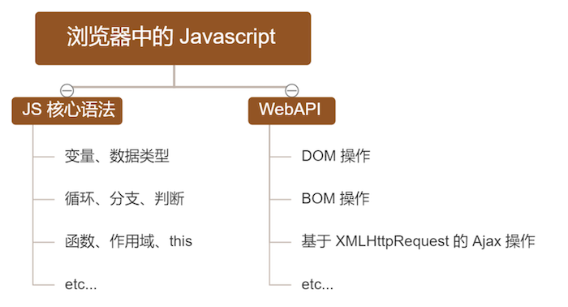
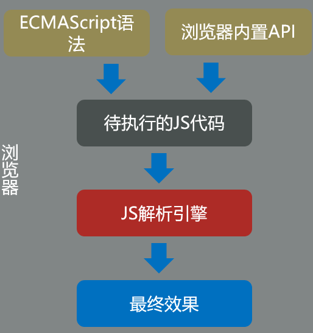
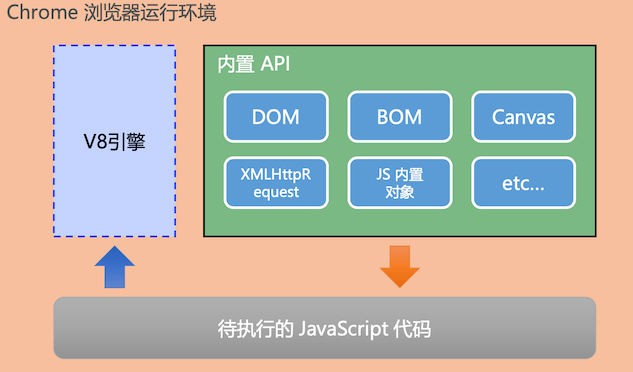
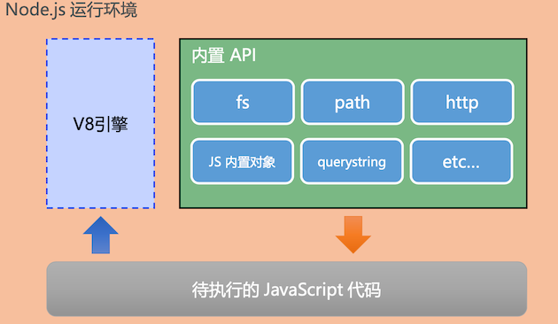
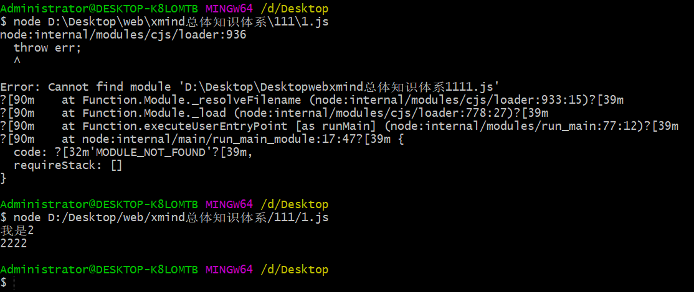

# 1. 浏览器中的js

## 1.1. 浏览器中的JavaScript的组成部分

**浏览器中的js由ECMAScript语法和WebAPI组成**



## 1.2. 为什么JavaScript 可以在浏览器中被执行



浏览器内核

* 浏览器内核 包括 CSS解析引擎，包括 JS解析引擎
* 目前，JS解析引擎基本上从内核中独立出来了
* 所以，平时所说的浏览器内核一般和CSS有关系

不同的浏览器使用不同的 JavaScript 解析引擎: 

* Chrome 浏览器 => V8 （性能最好）
* Firefox 浏览器=> OdinMonkey(奥丁猴)
* Safri 浏览器=> JSCore
* IE 浏览器=> Chakra(查克拉) 
* etc... 

## 1.3. 浏览器中的 JavaScript 运行环境



* **运行环境**指的是代码正常运行所需的必要条件。
* V8 引擎负责解析和执行 JavaScript 代码。
* 内置 API 是由运行环境提供的特殊接口，只能在所属的运行环境中被调用。

# 2. Node.js简介（node中的js）

## 2.1. nodejs可以做什么

> Node.js 的出现，使得JavaScript有了做后端开发的能力

Node.js 作为一个 JavaScript 的运行环境，仅仅提供了基础的功能和 API。然而，基于 Node.js 提供的这些基础功能，很多强大 的工具和框架可供我们使用。

* 基于 Express/Koa 框架(http://www.expressjs.com.cn/)，可以快速构建 Web 应用
* 基于 Electron 框架(https://electronjs.org/)，可以构建跨平台的桌面应用
* 基于 restify 框架(http://restify.com/)，可以快速构建 API 接口项目
* 读写和操作数据库、创建实用的命令行工具辅助前端开发
* etc...

## 2.2. 什么是nodejs

> `Node.js` `是`一个基于 Chrome V8 引擎的 `JavaScript` `运行环境`。 

node和浏览器都是js的运行环境，node摒弃了浏览器的内置api，增加了一些操作操作系统（后台）的api（内置模块）

最后都是交给浏览器解析引擎去解析

> node.js，也叫作node，或者nodejs，指的都是一个东西

nodejs实质是对Chrome V8引擎进行了封装。Node.js对一些特殊用例进行优化，提供替代的API，使得V8在非浏览器环境下运行得更好

nodejs的本质：不是一门新的编程语言，nodejs是javascript运行在服务端的运行环境，编程语言还是javascript

## 2.3. Node.js中的JavaScript运行环境



注意：

* 浏览器是 JavaScript 的`前端`运行环境。（浏览器是客户端安装的软件）
* Node.js 是 JavaScript 的`后端`运行环境。（正常情况下，Nodejs要安装到服务器上）
* Node.js 中无法调用 DOM 和 BOM 等 浏览器内置 API。

# 3. 浏览器中js和node中js的相同与不同

* 浏览器 和 Node，都是 JavaScript 的运行环境

* 具体来说，浏览器是客户端的JS环境；Node是服务端的JS运行环境

* 不同环境中，都可以运行 ECMAScript 核心代码

* WebAPI是浏览器特有的，只能在浏览器环境下使用；

* Node内置API（内置模块）是Node环境特有的，只能在Node环境中使用
* 浏览器基于浏览器解析引擎，node基于chrome v8引擎，用来解析js代码


# 3.node.js使用

## 3.1. 下载安装

推荐下载官网的LTS版本，LTS 为长期稳定版

下载完成后，打开终端（黑窗口，或者蓝窗口），在终端输入命令 `node –v` 后，按下回车键，即可查看已安装的 Node.js 的版本号，能够看见版本号，说明已经安装成功

## 3.2. 使用node

### 3.2.1. node两种模式

第一种模式（REPL），只适合执行少量的JS代码，或平时的代码练习用；比较像浏览器环境中的Console面板（黑窗口输入node回车 ctrl+C退出）（不推荐使用）

第二种模式（执行JS文件），开发中常用。这种模式，要注意路径。在指定路径的终端窗口中`node 文件名`（推荐使用）

两种模式不能混用，如果你用第一种模式呢，必须先退出，然后才能用第二种模式

> 常用的是vscode自带终端，可以用来执行git和node命令，对准目标文件的父文件夹，鼠标右键在集成终端中打开。第一次打开终端，建议：鼠标在文件上右键，选择“在集成终端中打开。后续，可以使用快捷键 Ctrl + ~ 切换终端


### 3.2.2. 使用时注意点

1. 执行文件用的语法：node 文件名
2. 注意黑窗口打开的路径位置（是不是项目文件夹或者目标文件的父文件夹）
   1. 系统自带cmd，可以在文件路径地址栏中输入`cmd`进入指定文件夹
   2. git自带命令行，直接在指定路径右键`git bash here`就行
3. 文件名前缀+tab键 自动补齐路径或者文件名 可以使用相对路径
4. 文件名如果有非法字符空格或者小括号之类的，一般会用" "包裹文件名
5. 快捷键：
   1. 键盘上下键可以调用历史命令
   2. clear/cls清除屏幕内容
   3. tab补齐路径/文件名
   4. esc可以删除所有内容（系统自带cmd完全·11支持）
   5. cmd中选中内容，鼠标右键点击就复制

> 终端中报错，找终端中的eror
>
> node只能执行js文件
>
> 最好不要有多个终端

# 4. 模块化
## 4.1. 模块化介绍
### 4.1.1. 什么是模块化

模块化，就是把一个大的文件拆分成若干小文件，而且还能把小文件通过特定的语法组合到一起的实现过程。

比如手机、电脑....等等几乎所有，都是模块化的设计，拿电脑来说，可以把电脑拆分成显示器、键盘、硬盘、内存等一个一个的小模块，当然也能够组装到一起。

### 4.1.2. 优点

模块化的优势：

* 更利于维护（比如电脑屏幕坏了，只换屏幕就可以了；比如想升级显卡，只换显卡就行了）；
* 更好的复用性（比如有一块移动硬盘或U盘，大家都能用）

Node中，规定每个JS文件都是一个小模块。一个项目由许许多多的小模块（JS文件）组合而成。

Node中模块化的优势：

* 更利于维护（比如，项目需要对登录模块升级，则不会影响其他模块）
* 更好的复用性（比如有一个公共的函数，封装起来。其他所有JS文件都能使用这个函数）


> * 避免全局变量的污染
> * 不用担心该模块需要引入什么js文件。只需要导入该模块即可
> * 不用担心前后顺序

### 4.1.3. 了解几种模块化规范

* AMD
* CMD
* CommonJS（Node中的模块化，使用的是这种方案）
* ES6

Node使用的是CommonJS规范。

### 4.1.4. 模块的分类

* 自定义模块
  * NodeJS中，创建的JS文件都是自定义模块。（也就是处处皆模块）
* [内置模块](http://nodejs.cn/api/)（核心模块）
  * 安装Node之后，自带了很多内置模块。我们可以直接加载使用他们。
* 第三方模块
  * 其他人编写的模块，发布到 [npm 网站](https://www.npmjs.com/) 上，我们可以下载使用。

加载模块的语法
1. 加载自定义模块
	* b 文件，必须通过 module.exports 共享（导出、暴露）当前模块中的变量`module.exports={num,str,fn}`
	* a 文件，需要通过 require() 加载（导入）。（b文件导出什么，a 文件就得到什么）`let obj=require('./03-b.js')`
	* 加载自定义模块时，必须要带路径 （相对路径、绝对路径都可以；但必须带路径，哪怕是 ./ 也不能省略）
	* 加载自定义模块时，可以省略后缀
2. 加载内置模块
	* 直接使用 require() 加载即可。
	* 加载模块时，无需带路径，比如 require('fs')
	* 加载内置模块，得到对象类型，对象中内置了很多API方法，const一个常量获取`const fs=require('fs')`
3. 加载第三方模块
	* 必须先下载（后续讲解）

## 4.2. 自定义模块
### 4.2.1. 自定义模块介绍
我们创建的每个JS文件都是一个自定义模块，并且具有模块作用域，也就是在一个模块中创建的变量、常量、函数等等一切，都只能在当前模块中使用

1. 模块共享（导出/暴露）内容给其他模块用，需要使用 `module.exports` 导出内容。
	* `module` 是Node中的一个全局对象，对象包含当前模块的详细信息。
	* `module.exports` 是模块的出口，通俗的说，就是导出内容用的，默认值是 `{}`
	* 比如，**03-b.js** 导出 num、str、fn 给其他模块用，可以 `module.exports = {num, str, fn}`


2. 其他模块，如果需要使用上述模块导出的内容，可以使用 `require()` **加载**（导入导出模块一般在同一目录下）
	* `let 结果 = require('模块路径')` ，`let obj = require('./03-b');`
	* 加载自定义模块，必须加路径，即使是 `./` 也必须加。但是可以省略后缀。
> `require('文件路径')`自定义的文件目录没有限制，这样是可以正确导入模块的，即使执行位置变到了桌面上，有一个注意点就是反斜杠记得要改成斜杠



### 4.2.2. 自定义模块示例

```js
// 自定义模块03-b模块  定义好变量导出
console.log('我是 03-b.js文件')

// 自定义模块中的变量，需要导出才能被使用
let num=123
let str='abc'
let fn=()=>console.log('我是函数fn')

// 导出方式1（点语法给exports对象赋值）（不推荐）
module.exports.num=num
module.exports.str=str
module.exports.fn=fn

// 导出方式2（解构赋值，直接覆盖原exports对象，exports也可以直接被函数赋值等等，通常用对象，可扩展）（推荐）
module.exports={num,str,fn}
```
```js
// 主模块03-a.js模块， 导入03-b.js模块
// 文件/模块（03-b.js）被导入，会立即执行
// 要想使用导出的变量，需要接受
let obj=require('./03-b.js')

// 没有被exports存储的变量，即没有被导出的变量，不能直接使用

// 导出后可以直接调用对象的成员
console.log(obj.num)
console.log(obj.str)
obj.fn()
```
> 一个模块导出什么，另一个模块加载后，就会得到什么。就比如，我给你三个苹果，你只能得到三个苹果，不可能得到其他的。
>
> 如上述示例03-a.js模块只得到03-b.js模块导出的num、str、fn

## 4.3. 内置模块

### 4.3.1. 内置模块定义
内置模块是Node.js 平台自带的一套基本的 API(功能模块)。也叫做核心模块

注意，**加载内置模块，不能写路径**，这是和加载自定义模块不一样的

fs模块和path模块是常见的内置模块
### 4.3.2. fs模块
fs，即 file system，文件系统，该模块可以实现对 文件、文件夹的操作
node中文文档传送门：[http://nodejs.cn/api/fs.html](http://nodejs.cn/api/fs.html)

  - 调用fs模块的方法，下面列举fs模块中的常用方法

    | API                                         | 作用              | 备注           |
    | ------------------------------------------- | ----------------- | -------------- |
    | fs.access(path, callback)                   | 判断路径是否存在  |                |
    | fs.appendFile(file, data, callback)         | 向文件中追加内容  |                |
    | fs.copyFile(src, callback)                  | 复制文件          |                |
    | fs.mkdir(path, callback)                    | 创建目录          |                |
    | fs.readDir(path, callback)                  | 读取目录列表      |                |
    | fs.rename(oldPath, newPath, callback)       | 重命名文件/目录   |                |
    | fs.rmdir(path, callback)                    | 删除目录          | 只能删除空目录 |
    | fs.stat(path, callback)                     | 获取文件/目录信息 |                |
    | fs.unlink(path, callback)                   | 删除文件          |                |
    | fs.watch(filename[, options]\[, listener])  | 监视文件/目录     |                |
    | fs.watchFile(filename[, options], listener) | 监视文件          |                |
    | ..... 一大堆                                |                   |                |

记住首先要先加载内置模块`const fs=require('fs')`

1. `fs.readFile(path[,options], callback)`方法，options这样写就是非必写的意思。用来读取文件内容

```js
// 导入 核心/内置模块 fs file system 文件系统
const fs=require('fs')

// 读取文件信息-这种方法是异步方法（回调函数）
// 图片、音视频不需要编码集(有的不加编码方式就是打印的二进制形式)   Node.js遵循错误优先原则
// fs.readFile(path[,options], callback)  options非必写
fs.readFile('./1.txt/1.txt','utf-8',(err,data)=>{
    // 读取文件错误（文件名或者路径错误等等），err是对象，读取对象成功err是null
    if(err!=null){
        // 每一个错误对象上面，都有两个属性：name和message
        return console.log(err.name,err.message)
    }
    // 成功
    console.log(data)
})

// 同步代码比异步代码优先执行
console.log('我是最后一行代码!')
```
2. ``fs.writeFile(file, data[, options], callback)``方法，options这样写就是非必写的意思。用来向文件中写入内容
```js
// 导入核心/内置模块 
const fs=require('fs')

// 写入内容 写入成功回调函数参数error就是null，写入失败error就是对象（有name和message两个属性来保留错误信息）
// 回调函数也是异步代码
fs.writeFile('./1.txt/1.txt','我是新加文件内容',error=>{
    if(error!=null){
       return console.log(error.name,error.message)
    }
    console.log('写入成功!')
})

// 同步代码比异步代码先执行
console.log('我是最后一行代码')

/* 注意事项：
    1. 如果文件存在，里面有内容，就会出现覆盖
    2. 如果文件不存在，新增一个文件并写入内容
    3. 如果文件夹都不存在，那么就会报错
    4. appendFile()可以在后面追加内容，用法同fs.writeFile() */
```

### 4.3.3. path模块

`path` 是 Node 本身提供的 API，专门用来处理路径。

nodejs中文文档传送门：[http://nodejs.cn/api/path.html](http://nodejs.cn/api/path.html)

- 调用path模块中的方法，来处理相应的问题，下面列举path模块中的几个方法

    | 方法                       | 作用                             |
    | -------------------------- | -------------------------------- |
    | path.basename(path[, ext]) | 返回 path 的最后一部分(文件名)   |
    | path.dirname(path)         | 返回目录名                       |
    | path.extname(path)         | 返回路径中文件的扩展名(包含.)    |
    | path.format(pathObject)    | 将一个对象格式化为一个路径字符串 |
    | path.join([...paths])      | 拼接路径                         |
    | path.parse(path)           | 把路径字符串解析成对象的格式     |
    | path.resolve([...paths])   | 基于当前工作目录拼接路径         |

记住首先要先加载内置模块`const path=require('path')`

1. `path.extname(url)、path.basename(url[,name])`basename里面的name为可选值。用来获取路径的后缀名或者基础名
```js
// 导入内置path模块
const path=require('path')

// 定义一个路径
let url='https://www.baidu.com/index.html'

// 1.path.extname() 获取后缀名
let name1=path.extname(url)
console.log(name1)//.html

// 2.path.basename()  获取基础路径
let name2=path.basename(url)
console.log(name2)//index.html

let name3=path.basename(url,name1)
console.log(name3)//index
```
2. `path.join(路径1，路径2)`用来拼接绝对路径
背景
```js
// 主要点：node.js中相对路径，是基于文件执行位置，而不是文件所在位置
const fs=require('fs')

// 意思就是说比如在桌面git bash 用这个绝对路径（记得反斜杠换成斜杠）node D:/Desktop/web/9. node.js/自己学习/day01/1.txt/1.txt
// node能够找到这个文件执行，但是找不到'./1.txt/1.txt'这个文件读取文件内容
fs.readFile('./1.txt/1.txt','utf8',(error,data)=>{
    // 判断是否读取成功
    if(error) return console.log(err.message)
    // 成功则输出结果
    console.log(data)
})
// 解决：readFile()里面的参数也用绝对路径。可以成功读取，但是代码的可移植性太差，换个电脑就不行了
```
Node中，有一个全局变量` __dirname` ，它表示当前 JS 文件所在的绝对路径

获取文件的位置有两个变量存储（注意是两个下划线）

* 当前文件所在文件夹的绝对路径 `console.log(__dirname)`'
* 当前文件所在的绝对路径 `console.log(__filename)`

`let url=__dirname+'/1.txt/1.txt'`
纯字符串拼接，这种方式对后面相对路径格式要求过高，不能有多余的点或斜线，也不能少必要的斜线

调用path模块的join()方法完美解决
```js
// 完美解决：调用path内置模块的join方法  可以自动识别 ./  ../   /   会自动帮忙加上或者减去多余或者少的点或者斜线（这里写相对路径就可以了），文件名不能出错
const path=require('path')
url=path.join(__dirname,'./1.txt/1.txt')
console.log(url)
```
> 以后node命令里面就不用相对路径了。用绝对路径，用`path.join(__dirname,'')`方法拼接绝对路径

# 5. 案例介绍
写一个js文件，调用内置模块，封装增删改查四个方法来修改同目录下的`data.json`文件
```js
// 封装增删改查四个方法

// 导入内置/核心模块
const fs=require('fs'),
path=require('path'),
url=path.join(__dirname,'/data.json')

// 1.查询
function getData(){
    // 调用fs模块的readFile方法
fs.readFile(url,'utf8',(error,data)=>{
    if(error) return console.log(error.message)
    // json文件里面虽然看起来像数组，但是数据类型还是json类型
    let arr=JSON.parse(data)
    // data是不能通过return返回的，首先这个是在内层函数返回，可以在外层getData作用域里定义一个变量接受这个返回值吗？答案是不能，回调函数是异步代码，会在最后执行
    console.log(arr)
})
}
// 测试
// getData()

// 2.添加
function addData(obj){
    // getData()没有复用性，因为是异步代码没有返回值，只能打印出一些数据
    // 需要重新查询
    fs.readFile(url,'utf8',(error,data)=>{
        // 判断读取内容是否有问题
        if(error) return console.log(error.message)
        // 查询成功，先转换成数组，再向其中添加对象，然后准换成json再write进去
        let arr=JSON.parse(data)
        // 添加id
        obj.id=arr[arr.length-1].id*1+1//乘以1是为了隐式转换成数字类型，避免字符串相加
        // push新数据
        arr.push(obj)
        // 再写入之前的文件中
        fs.writeFile(url,JSON.stringify(arr),error=>{
            if(error) return console.log(error.message)
            // 没有出错
            console.log('恭喜你，添加成功！')
        })
    })
}

// 测试
// addData({
//     bookname:"三体",author:"刘慈欣",publisher:'武汉人民出版社'
// })

// 3.删除
function delData(id){
    // 先查询数据
    fs.readFile(url,'utf8',(error,data)=>{
        if(error) return console.log(error.message)
        // 查询无误
        let arr =JSON.parse(data)
        // 数组中删除指定内容-根据id查询指定索引值，根据索引值删除内容
        // 数组中删除指定内容-直接应用数组的filter方法
        let newArr=arr.filter(item=>id!=item.id)
        // 重新写入原文件
        fs.writeFile(url,JSON.stringify(newArr),error=>{
            if(error) return console.log(error.message)
            // 无误
            console.log('恭喜你，删除成功！')
        })

    })
}

// 测试
// delData(4)

// 4.修改 -读取文件信息，修改数组中的内容，把数组写到文件中
function putData(obj){
    fs.readFile(url,'utf8',(error,data)=>{
        if(error) return console.log(error.message)
        let arr=JSON.parse(data)
        // 修改数组中内容-查看索引值，找到以后，用传递的obj，覆盖所有原有属性（太麻烦）
        // 修改数组中内容，找到索引值，先删除，再添加
        let index=arr.findIndex(item=>item.id==obj.id)
        // 应用数组的splice属性，不会返回值，在原数组修改类似于push、pop
        arr.splice(index,1,obj)
        // 重新写入原文件
        fs.writeFile(url,JSON.stringify(arr),error=>{
            if(error) return console.log(error.message)
            // 修改成功
            console.log('恭喜你！，修改成功！')
        })
    })
}

// 测试
// putData({
//     id:"3",
//     bookname:"红楼梦后传",
//     author:"曹雪芹",
//     publisher:"北京人民出版社"
// })

// 导出模块。提供给别人使用
module.exports={
    getData,addData,delData,putData
}
```