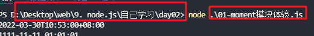
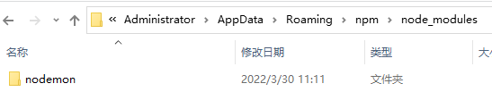
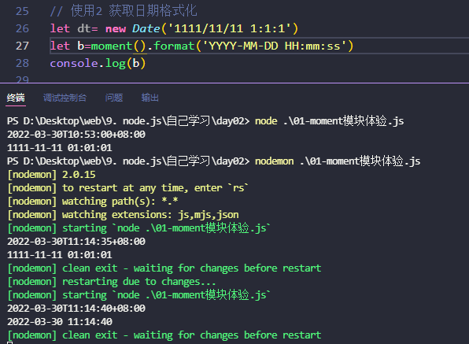
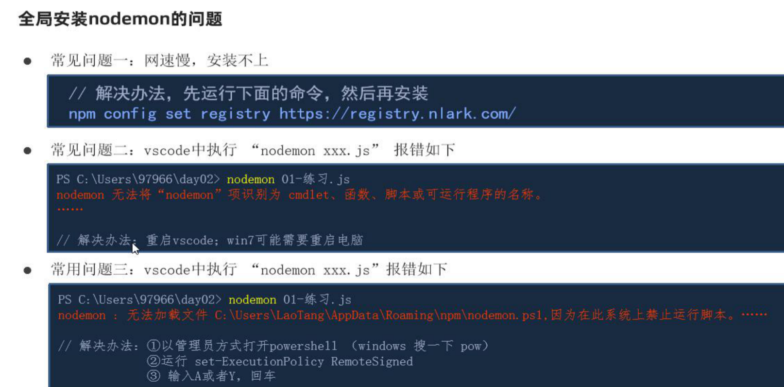
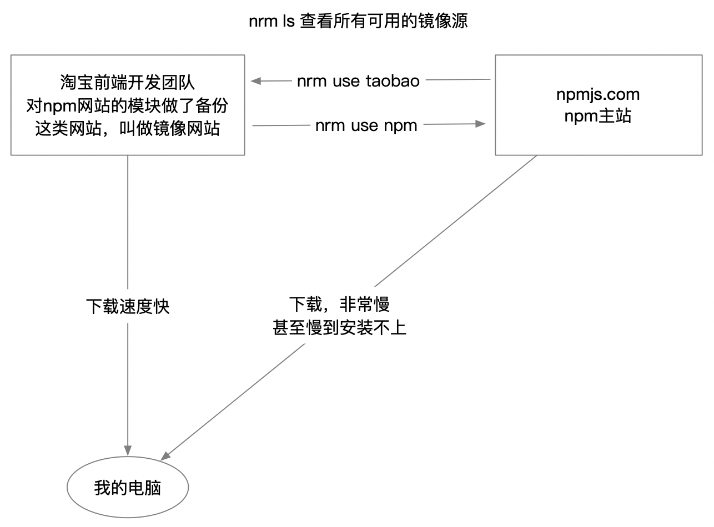
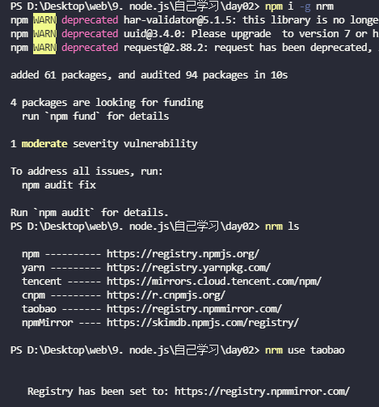
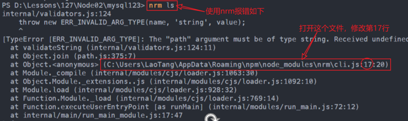
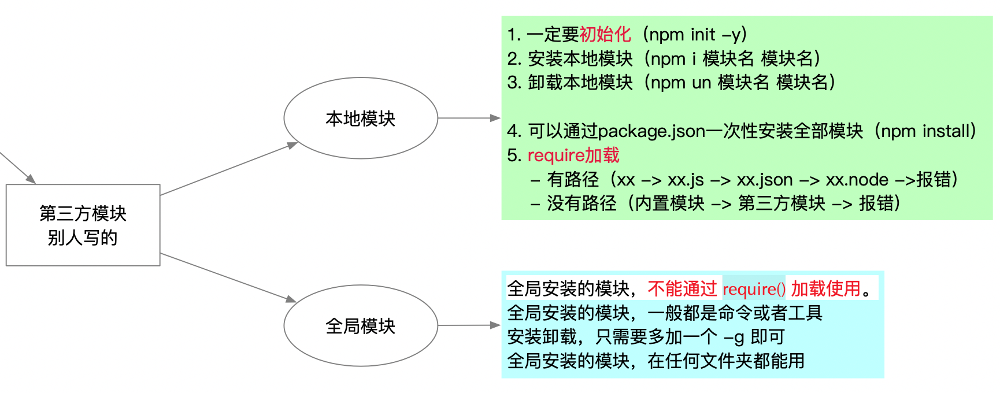
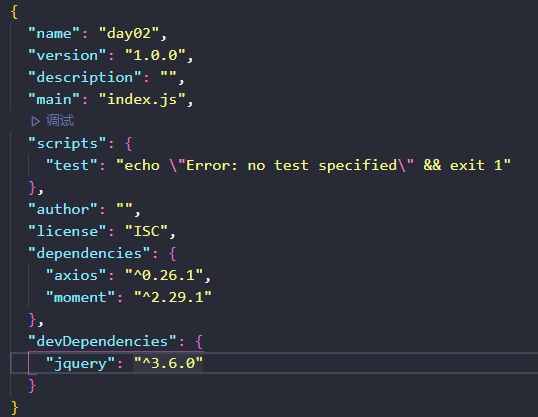
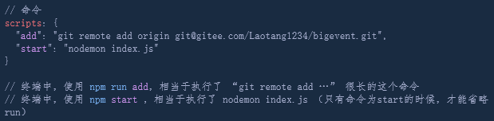

# 1. NPM介绍

## 1.1. 第三方模块

非node自带的模块（不是核心/内置模块）。也不是自定义的模块。

第三方模块是别人写的模块，然后发布到npm网站，我们可以使用npm工具来下载安装别人写的模块

目前，npm网站收录了超过 150 万个第三方模块

> 如果你想实现一个功能。那么请搜索第三方模块，没有做不到的事情，只有你搜不到

## 1.2. npm介绍

npm（node  package  manage）node 包 管理器。**是管理node包（第三方模块）的工具**

包是什么？包就是模块。

包约等于模块，但是一个包可以包括一个或多个模块（下的第三方包有时候还有别的依赖模块会一并下载）

npm这个工具，在安装 node 的时候，就已经安装到你的计算机中了

> 命令行中执行： `npm -v` ，如果看到版本号，说明安装成功了，其他的任何软件比如`git`、`node`也可以通过查看版本号来查看是否安装成功

# 2. 本地模块

`npm init`的文件夹名字不能有中文，可以有特殊符号`-`和`_`

## 2.1. 初始化并下载安装第三方模块
### 2.1.1. 初始化

安装本地模块，需要使用npm工具初始化。

```bash
npm init -y
# 或
npm init
# 然后一路回车
```

初始化之后，会在项目目录中生成 package.json 的文件（node包的一些基本配置和说明信息，不能删）

初始化后可以理解为才会被npm所管理（有了package.json文件就算被初始化），可以进行下载操作（和git一样，也需要指定文件夹）

> 如果git clone过来的项目文件夹里面有了package.json文件就不需要初始化了，直接开始安装即可

### 2.1.2. 安装卸载第三方模块的命令

初始化之后，就可以在当前文件夹中安装第三方模块了

```
建议在安装第三方模块之前，先执行如下命令。这是把npm的网站切换成淘宝的镜像源地址（服务器在国内，下载速度更快，后面通过nrm第三方模块实现也可以）

下面的命令只需要执行一次即可（不管以后重启vscode还是重启电脑，都不需要执行第二次）
npm config set registry https://registry.npm.taobao.org
```
安装第三方模块


```bash
# 正常的下载安装
npm install 模块名

# 简写install为i
npm i 模块名

# 一次性安装多个模块
npm i 模块名 模块名 模块名

#（实际开发常来指定版本号，可能某时刻更新了，使用方法可能有多余的配置）
# 下载指定版本的模块
npm i 模块名@版本号
```

> 注意实际开发中一般需要指定包的版本，不指定就是最新模块，可能某次更新某个模块需要有新的配置才能使用

卸载第三方模块

```bash
npm uninstall 模块名
npm un 模块名
npm un 模块名 模块名 模块名
```

## 2.2. 注意事项

初始化后会生成一个`package.json`文件用来记录node包基本配置信息以及我们下载了哪些模块（dependencies中）

下载安装好的模块，存放在当前文件夹的 `node_modules` （新生成）文件夹中，同时还会生成一个记录下载的文件 `package-lock.json`（package-lock.json是npm独有，里面有详细的信息，什么下载地址之类的，yarn就没有这个文件）

* 文件夹 不能有中文和特殊符号，文件夹名特殊符号支持中划线-和下划线_，建议使用中划线，比如  “练习”、“ajax&node” 都不可以。（yarn工具可以使用中文命名文件夹）
* 文件夹 不能 和 第三方模块同名
* 下载的第三方模块在当前文件夹中的 `node_modules` 目录中，目录中（还有一些多余的模块开发的文件附带着一起下载下来，也有可能有的模块需要别的第三方依赖会一并下载放在`node_modules`中），目标模块一般在dist文件夹中
* 下载的第三模块，只能在当前文件夹及其后代文件夹中使用
* 可以通过package.json文件，查看到我们下载了哪些模块

**node执行js文件时，是把前面后面的路径进行拼接的**，路径不要写错了（后面的文件名前缀`./`和后缀`.js`都可以省略，不同于导入模块的写法）



## 2.3. 使用第三方模块

* 和使用内置模块一样，需要使用 `require` 加载模块
* 调用模块提供的方法完成工作
* 不用担心不会用，好的第三方模块都会用使用文档或者官方网站的。
* 有些模块没有官网（一般npm官网会有相关说明），去 github 查找模块的使用文档，或者百度。

## 2.4. moment第三方模块的使用

moment是一个专门处理时间日期的模块

官网文档传送门：[http://momentjs.cn/](http://momentjs.cn/)

使用步骤：

1. 创建项目文件夹

2. 在指定项目文件夹里面初始化 npm init -y

3. 下载第三方模块 `npm i moment@2.29.1`

4. 导入第三方模块 `const moment=require('moment')`

```js
// 执行文件用node命令  下载文件用npm
const moment=require('moment')
//moment是一个函数，里面有很多成员（静态成员），可以传参

// 静态成员只能函数来调用，实例成员（存在原型里面的）调用不了

// 使用1 获取当前时间，并格式化
let a=moment().format()//在moment()的返回值上再调用format方法
console.log(a)

// 使用2 获取日期格式化
let dt= new Date('1111/11/11 1:1:1')
let b=moment(dt).format('YYYY-MM-DD HH:mm:ss')
console.log(b)
```

结果

```bash
2022-03-30T21:03:43+08:00
1111-11-11 01:01:01
```

## 2.5. jsonwebtoken模块的使用

jsonwebtoken模块的作用是生成token字符串

英文文档传送门：[https://github.com/auth0/node-jsonwebtoken](https://github.com/auth0/node-jsonwebtoken)

```js
// 加载模块
const jwt = require('jsonwebtoken');

// console.log(jwt.sign(必填, 必填, 可选, 可选));

// Bearer 不属于token的内容，只是表示token的格式。

// jwt.sign()
// 1. 参数1：对象，要在token保存的数据
// 2. 参数2：加密的字符串，类似于一个钥匙。随便填；后续解密token的时候，需要使用它
// 3. 参数3：对象，配置项，比如配置一下过期时间
// 4. 参数4：生成token后的回调函数

// console.log('Bearer ' + jwt.sign(
//   { id: 1, username: 'zs' },
//   'shhhhh',
//   { expiresIn: '2h' },
//   // (err, abc) => console.log(abc)
// ));


jwt.sign({ id: 1 }, 'sdfsdf', { expiresIn: '2h' }, (err, result) => {
  if (err) throw err;
  console.log('Bearer ' + result);
});
```

# 3. 全局模块

## 3.1. 全局模块介绍

全局模块（本质也是第三方模块） 不需要初始化，在系统文件夹中保存，

一般是下载的全局模块是多出某个命令，文件（本如axios模块）一般只用本地包用在某个项目中，因为axios并不是所有的文件都需要（require方法导入）



## 3.2. 全局模块安装卸载

全局模块在任何地方安装都可以，会生成在自己c盘的用户文件夹下

* 安装命令（多一个 `-g`）

  ```bash
  npm i 模块名 -g
  # 或
  npm i -g 模块名
  
  ### mac 系统如果安装不上，使用下面的命令提高权限
  sudo npm i -g 模块名
  ```

* 卸载命令（也是多一个 `-g`）

  ```bash
  npm un 模块名 -g
  ```

* 全局安装的模块，在系统盘（C盘）

  * 通过命令 `npm root -g` 可以查看全局安装路径

## 3.3. 全局nodemon模块

### 3.3.1. nodemon模块介绍

nodemon命令可以监听文件的变化自动执行js文件（需要开始执行一次nodemon 文件名）

* 代替node命令，启动服务的工具
* 当更改代码之后，nodemon会自动重启服务

> nodemon安装后，系统中多了一个命令 nodemon

### 3.3.2. 安装使用nodemon

安装命令：`npm i nodemon -g`

需要开始执行一次`nodemon 文件名`，后面会自动监听文件变化而自动重启node命令

使用ctrl+c  退出nodemon命令



### 3.3.3. 使用nodemon可能遇到的问题

管理员可能禁用了一个第三方的问价下载权限问题，用管理员身份运行



## 3.4. 全局nrm模块

### 3.4.1. nrm模块介绍

官方源：很多计算机大型项目的源在国外服务器上

镜像源：官方的源作为一个镜像，你可以在这下载软件。比如npm官方源在国外，下载软件可能会很慢，这时候就需要换成国内的镜像源（常用的是taobao镜像源）

> 镜像网站以前由一些教育机构来创建维护，近些年有一些大型互联网企业来创建维护，比如比较出名的taobao镜像源

已知有npm的镜像网站，比如淘宝的，那么该如何切换下载地址呢？

* 可以使用 全局模块 nrm 来切换镜像网站，还是使用npm命令下载只是使用nrm命令切换了下载地址（常用）
* 也可以安装 全局模块 cnpm 工具，直接从淘宝的镜像地址下载第三方模块，需要使用cnpm命令下载

**nrm 是作用就是切换镜像源，只需要执行一次nrm命令即可**



### 3.4.2. 安装使用nrm

全局安装

`npm i -g nrm`   （mac系统前面加 sudo）

使用nrm

`nrm ls`    --- 查看全部可用的镜像源
`nrm use taobao`  ---- 切换到淘宝镜像
`nrm use npm`  ---- 切换到npm主站

执行一次nrm命令修改了镜像源之后，后面再使用npm命令下载就是从国内镜像网站上面下载的速度更快




### 3.4.3. 使用nrm可能遇到的问题



修改为下面代码

`const NRMRC = path.join(process.env[(process.platform == 'win32') ? 'USERPROFILE' : 'HOME'], '.nrmrc')`

# 4. 本地模块和全局模块的对比

本地模块，在安装之前，必须先初始化（需要有package.json文件）；全局安装的模块不需要初始化

1. 本地模块

* 一定要初始化
* 安装：npm install 模块名 模块名 …
* 卸载：npm uninstall 模块名 模块名 …
* 安装的本地模块，只能在当前文件夹及其后代文件夹中使用
* 需要通过 require() 加载

2. 全局模块

* 全局模块，安装之前，不需要初始化
* 全局模块，不能通过 require() 加载
* 全局模块，一般都是命令或者工具
* 安装卸载，只需要多加一个  -g 
* 全局模块，在任何位置都可以使用



# 5. package.json文件

## 5.1. 介绍下软件的版本号

软件的版本号 jQuery@3.3.1`3.3.1`（下载时一般下载后面数字大的越稳定）

* 大版本.次要版本.小版本
* **小版本**：当项目在进行了局部修改或 bug 修正时，修正版本号加 1
* **次要版本**：当项目在原有的基础上增加了部分功能时，主版本号不变，子版本号加 1
* **大版本**：当项目在进行了重大修改或局部修正累积较多，而导致项目整体发生全局变化时，主版本号加 1

版本号前的 `~` 和 `^`

* **指定版本**：比如`1.2.2`，遵循“大版本.次要版本.小版本”的格式规定，安装时只安装指定版本。
* **波浪号（tilde）+指定版本**：比如`~1.2.2`，表示安装1.2.x的最新版本（不低于1.2.2），但是不安装1.3.x，也就是说安装时不改变大版本号和次要版本号。1.2.2是要求安装的最低版本
* **插入号（caret）+指定版本**：比如ˆ1.2.2，表示安装1.x.x的最新版本（不低于1.2.2），但是不安装2.x.x，也就是说安装时不改变大版本号，1.2.2是要求安装的最低版本。如果大版本号为0，则号的行为与波浪号相同，这是因为此时处于开发阶段，即使是次要版本号变动，也可能带来程序的不兼容

~ 会匹配最近的小版本依赖包，比如~1.2.3会匹配所有1.2.x版本，但是不包括1.3.0
 ^ 会匹配最新的大版本依赖包，比如^1.2.3会匹配所有1.x.x的包，包括1.3.0，但是不包括2.0.0

所以建议使用~来标记版本号，这样可以保证项目不会出现大的问题，也能保证包中的小bug可以得到修复，或者版本号写*，这意味着安装最新版本的依赖包，但缺点同上，可能会造成版本不兼容，慎用！

> 执行`yarn install`的时候会根据 package.json 里定义的版本区间去找依赖的**最新版**

## 5.2. package,json文件的组成

在初始化之后，会生成一个`package.json`文件，`package.json`是当前项目（或者包）的说明或配置文件

json文件是一种json数据格式的文件，用来存储数据



* name：项目或包的名字
  * 这个值，要和项目文件夹同名，全部小写，没有空格，可以使用下划线或者横线
  * 如果是自己开发的包，则它表示当前包的名字
  * 当文件夹修改了名字，也要及时修改它，让它保持和文件夹同名
* version：项目或包的版本
* main：项目或包的入口文件
  通过 `require() `加载包时，加载的就是main 字段指定的文件

* script：命令及简写形式
  * 通过 npm run xxx 来执行一个命令
  * 如果命令简写为 start，则可以省略run



* dependencies：项目依赖，生产环境的依赖包，依赖哪些其他模块
* devDependencies：开发依赖，开发环境的依赖包

> 当执行 `npm install xxx` 的时候，就会在依赖中记录我们安装的其他模块
>
> 如果把 node_modules 删掉，执行 `npm i`或者`npm install` ，即可把依赖中记录的模块全部安装

## 5.3. 项目依赖和开发依赖

具体哪个包是开发依赖还是项目依赖，其实npm官网中都有介绍

```js
// 项目依赖：项目想要正常运行。所必须第三方的模块（生产环境要用的）
// package.json中dependencies节点中的第三方模块，都是项目依赖
// 命令：npm i 包名 --save 或者 -S 或者不写
// npm i jquery --save
// npm i axios -S

// 开发依赖：开发期间需要使用的第三方模块，项目上线后，就不用了的模块
// devDependencies 节点中的第三方模块，都是开发依赖
// 命令：npm i 包名 --save-dev 或者-D
// npm i express@4.17.1 --save-dev
//npm i bootstrap -D
```


新安装下载的包会默认保存在node_modules文件夹中，如果下载的包所依赖的模块特别多的话，会一并下载保存在node_modules中

package.js中的依赖dependencies和devDependencies一般会写在package.json文件中，但是其中的node_modules在上传到远程仓库或者服务器时并不会留下，占用多余的额外空间，需要我们自己去下载依赖（只留下一个package.json文件，里面存有项目需要的依赖信息）

有一个新项目时，往往只会提供一个远程git仓库地址，这是我们需要做的

1. `git clone github@.... ` 下载远程仓库项目
	远程仓库中不会存有第三方模块，但是所需要第三方模块信息会存在package.json中的dependencies和devDependencies节点

2. `npm i`下载项目所需要的依赖模块（包括开发依赖和项目依赖）
	下载项目依赖包(运维人员跟我们无关) `npm i --production`（不会有只下载开发依赖包的命令）

# 6. require的加载机制

1. 判断缓存中有没有正在加载的模块，如果有，使用缓存中的内容，如果没有，那么表示第一次加载，加载完会缓存（多次后面的会使用缓存里面的内容）
	这样在一个下项目里面可以多次导入同一个模块，不用担心重新导入js文件会多次执行的问题，会使用缓存里面的内容

	比如一个文件中三次require('./01-moment模块体验')只会执行一次01-moment模块体验js文件（js文件导入会立即执行）

2. 判断模块名有没有带路径（./） 有的话为自定义模块

	a. 模块名中有路径，加载自定义模块（自己写的文件）const xx = require('./xx')（前缀名不能省略后缀名可以省略的原因）

	* 优先加载同名文件，加载一个叫做 xx 的文件
	* 再次加载js文件，加载 xx.js 文件（后缀名省略会自动加上后缀）
	* 再次加载json文件，加载 xx.json 文件
	* 如果上述文件都没有，则报错 “Cannot find module './xx'”
   
    b. 模块名没有路径，优先加载核心模块，如果没有核心模块，则加载第三方模块

3. 加载第三方模块的查找方式（保证项目中再深的文件都可以使用node_modules里面的模块）

	* 优先在当前文件夹的node_modules里面查找第三方模块
	* 在当前文件夹的上级目录的node_modules里面查找第三方模块
	* 继续向上层文件夹查找第三方模块

> 注意node命令后面的文件，前缀后缀其实都可以省略，前面的地址和后面的地址拼接
# 7. 上传属于自己的包（了解）

## 7.1. 包的规范

顶级目录文件夹名字一般是英文与package.hson里面的name相同，可以使用 ”@”、”-”、”/”符号

 必须三要素

* `package.json`  （package.json包的配置文件）

* ` index.js`      （入口文件）
* `README.md `    （说明文档）

一个规范的包结构，需要符合以下 3 点要求:

1. 包必须以单独的目录而存在
2. 包的顶级目录下要必须包含 package.json 这个包管理配置文件（建议使用npm init -y自动生成）
3. package.json 中必须包含 name，version，main 这三个属性，分别代表包的名字、版本号、包的入口。
   * name 包的名字，我们使用 require()加载模块的时候，使用的就是这个名字（name的名字只能是小写可以用中划线，文件夹名称写成大写，json文件里面的name也会自动转换成小写）
   * version 版本，1.2.18   
   * main 入口文件。默认是index.js 。如果不是，需要使用main指定

注意:以上 3 点要求是一个规范的包结构必须遵守的格式，关于更多的约束，可以参考如下网址:

https://yarnpkg.com/zh-Hans/docs/package-json

## 7.2. 开发属于自己的包

> 自己上传的包 可能还需要额外的第三方模块需要自己npm init 再npm i 下载别的第三方包

* 初始化 package.json

  **注意，JSON文件不能有注释，下面加注释，是为了理解**。

  ```json
  {
    "name": "sy123",  // 包（模块）的名字，和文件夹同名。别人加载我们的包，找的就是这个文件夹
    "version": "1.0.0",
    "description": "This is a package by Laotang",
    "main": "index.js", // 别人加载我们的模块用，require加载的就是这里指定的文件
    "scripts": {
      "test": "echo \"Error: no test specified\" && exit 1"
    },
    "keywords": [ // 在npm网站中，通过关键字可以搜索到我们的模块，按情况设置
      "laotang",
      "itcast",
      "test"
    ],
    "author": "Laotang", // 作者
    "license": "ISC" // 开源协议
  }
  ```

  > 关于更多 license 许可协议相关的内容，可参考 https://www.jianshu.com/p/23e61804d81e

* index.js 中定义功能方法

  ```js
  // 别人加载的就是我的 index.js 
  // 所以，必须在 index.js 中导出内容
  
  function a() {
    console.log('aaa')
  }
  
  function b() {
    console.log('bbb')
  }
  
  module.exports = { a, b }
  ```

* 编写包的说明文档

  包根目录中的 README.md 文件，是包的使用说明文档。通过它，我们可以事先把包的使用说明，以 markdown 的 格式写出来，方便用户参考。

  README 文件中具体写什么内容，没有强制性的要求;只要能够清晰地把包的作用、用法、注意事项等描述清楚即可。 

## 7.3. 注册npm账号

* 访问 https://www.npmjs.com/ 网站
* 点击 sign up 按钮，进入注册用户界面
* 填写账号相关的信息
* 点击 Create an Account 按钮，注册账号
* 注册完账号，需要到邮箱中认证一下

## 7.4. 发布自己的包


### 7.4.1. 发布
1. `终端中`，切换镜像源为npm（不能发布到淘宝，所以必须切换镜像源为npm主站）
  * nrm use npm
2. `终端中`，登录 npm 账号
  * 执行 `npm login` 命令
  * 输入账号
  * 输入密码（**输入的密码是看不见的，正常**）
  * 输入邮箱（还需要输入一次邮箱的验证码）

3. 发布
  * 注意，**执行命令的文件夹，必须是包的根目录**。
  * 运行 `npm publish` 命令，即可将包发布到 npm 上

常见错误：
1. 自己的模块名（文件夹名）不能和已存在的模块名同名，相似也不行
2. 没有切换镜像源，会提示如下错误。要发布到npm上，必须切换镜像源为npm
3. 24小时内不能重复发布
4. 新注册的账号，必须先邮箱（邮件可能是垃圾邮件）验证，然后才能发布
### 7.4.2. 删除发布
删除已发布的包
	运行 npm unpublish 包名 --force 命令，即可从 npm 删除已发布的包。
* 注意:
  * npm unpublish 命令只能删除 72 小时以内发布的包
  * npm unpublish 删除的包，在 24 小时内不允许重复发布
  * 发布包的时候要慎重，尽量不要往 npm 上发布没有意义的包!
> 更多关于npm的命令：https://www.npmjs.cn/
# 8. ES6模块化

一定记得在package.json中加上`"type"="module"`，就不能再使用commonJS规范了，require和module.exports不能再用了

ES6 模块的设计思想是尽量的静态化，使得编译时就能确定模块的依赖关系，以及输入和输出的变量。CommonJS 和 AMD 模块，都只能在运行时确定这些东西

注意：

CommonJS 模块就是对象，输入时必须查找对象属性

ES6 模块不是对象，而是通过`export`命令显式指定输出的代码，再通过`import`命令输入

## 8.1 CommonJS 规范

node.js 遵循了 CommonJS 的模块化规范。其中：

* 导入其它模块使用 require()方法
* 模块对外共享成员使用 module.exports 对象

```js
let { stat, exists, readfile } = require('fs');
```

上面代码的实质是整体加载`fs`模块（即加载`fs`的所有方法），生成一个对象（`_fs`），然后再从这个对象上面读取 3 个方法。这种加载称为“运行时加载”，因为只有运行时才能得到这个对象，导致完全没办法在编译时做“静态优化”。

```js
import { stat, exists, readFile } from 'fs';
```

上面代码的实质是从`fs`模块加载 3 个方法，其他方法不加载。这种加载称为“编译时加载”或者静态加载，即 ES6 可以在编译时就完成模块加载，效率要比 CommonJS 模块的加载方式高

## 8.2 模块化开发好处

模块化开发的好处有很多，其中：

* 实现了在JS文件中引用其他文件
* 避免命名冲突的问题
* 大家都遵守同样的模块化规范写代码，降低了沟通的成本，极大方便了各个模块之间的相互调用
* 只需关心当前模块本身的功能开发，需要其他模块的支持时，在模块内调用目标模块即可

## 8.3 模块化规范划分

在 ES6 模块化规范诞生之前，JavaScript 社区已经尝试并提出了 AMD 、 CMD 、 CommonJS  等模块化规范。
但是，这些由社区提出的模块化标准，还是存在一定的差异性与局限性、并不是浏览器与服务器通用的模块化标准

* AMD 和  CMD 适用于浏览器端的 Javascript 模块化
* CommonJS 适用于服务器端的 Javascript 

模块化太多的模块化规范给开发者增加了学习的难度与开发的成本。因此，官方的 ES6 模块化规范诞生了！

## 8.4 ES6模块化开发注意点

node.js 中默认仅支持 CommonJS 模块化规范，若想基于 node.js 体验与学习 ES6 的模块化语法，需要按照如下两个步骤进行配置：

* 确保安装了 v13.0.0 或更高版本的 node.js

* 在 package.json 的根节点中添加 "type": "module" 节点

* 配置之后，则只能使用ES6模块化语法，不能再使用CommonJS语法了

> import和export也是只能在node服务器端使用，后面使用webpack可以支持在浏览器端模块化

## 8.5. ES6模块化使用

### 8.5.1. import和export关键字

模块功能主要由两个命令构成：`export`和`import`。`export`命令用于规定模块的对外接口，`import`命令用于输入其他模块提供的功能

导出使用`export`关键字，导入使用`import xx from 文件名`

需要提前在`package.json`中设置`"type":"module"` 先`npm init`初始化

三种方式

主模块（导入模块）

```js
// 导入1：默认导入-不能解构，只能用一个变量接受（不需要结构，即不需要大括号）
// 文件路径后缀名.js可以省略
import obj from './02-子模块.js'
console.log(obj)

// 导入2：按需导入-必须解构（按需导入必须要加大括号）
// 按需导入时，可以使用 as 关键字进行重命名
import {a,b as c,fn} from './02-子模块.js'
console.log(a,c)
fn()

// 导入3：只导入文件，不需要接受（只执行里面的代码）
// 三种方式每次导入文件都会执行js文件里面的代码，但是ES6新语法也存在缓存的机制，所以仅是第一次会执行，然后存在缓存中，后面的导入是在缓存中调用
import './02-子模块.js'
```

子模块（导出模块）

```js
// 导出1：默认导出
//使用import命令的时候，用户需要知道所要加载的变量名或函数名，否则无法加载。为了给用户提供方便，让他们不用阅读导出文档就能加载模块，就要用到export default命令，为模块指定默认输出
// 导出什么类型都可以，一般是对象
// 每个模块中，只允许使用唯一的一次 export default 
export default {num:123,str:'abc'}

export default function fn(){}

// 导出2：按需导出 （导出1和导出2可以同时存在）
export let a=1
export const b ='xyc'
export function fn(){
    console.log('我是函数fn')
}//必须是具名函数
// 导出2推荐的写法，统一用对象导出，这样就可以在脚本尾部，一眼看清楚输出了哪些变量
//导出时，可以使用 as 关键字进行重命名，可以重命名多次{a,b as c,b as d,fn}，b可以使用不同的名字输出两次
export {a,b as c,fn}

// 导出3：不导出内容，只提供功能
for(let i = 0;i<3;i++){
    console.log(i)
}
```

注意点：

* 怎么导出的就得怎么导入，不能岔开了写，即导出1只能用导入1接收
* 每个模块中，只允许使用唯一的一次 export default ，其实此处相当于为要导出对象"male"起了一个系统默认的变量名**default**（`export default`命令的本质是将后面的值，赋给`default`变量，对外接口就是default），自然**default**只能有一个值，所以一个文件内不能有多个**export** **default**
* 文件路径不能省略后缀名，ES6规定，不加无法识别
* 按需导入（导入2）可以和默认导入（导入1）一起使用（常用）

> 设置了`"type":"module"`的package.json所在的文件夹里面的文件才可以使用ES6模块化，使用commonJS会报错

内置模块可以多次导入
`import fs from 'fs'`
`import path from 'path'`

### 8.5.2. export注意点

1. `export`命令规定的是对外的接口，必须与模块内部的变量建立一一对应关系。

```js
// 报错
export 1;

// 报错
var m = 1;
export m;
```

上面两种写法都会报错，因为没有提供对外的接口。第一种写法直接输出 1，第二种写法通过变量`m`，还是直接输出 1。`1`只是一个值，不是接口。正确的写法是下面这样：

```js
// 写法一
export var m = 1;

// 写法二
var m = 1;
export {m};

// 写法三
var n = 1;
export {n as m};
```

上面三种写法都是正确的，规定了对外的接口`m`。其他脚本可以通过这个接口，取到值`1`。它们的实质是，在接口名与模块内部变量之间，建立了一一对应的关系

同样的，`function`和`class`的输出，也必须遵守这样的写法

注意`export default`的用法

```javascript
// export-default.js
export default function foo() {
  console.log('foo');
}

// 或者写成

function foo() {
  console.log('foo');
}

export default foo;
```
上面代码中，foo函数的函数名foo，在模块外部是无效的。加载的时候，视同匿名函数加载。


2 另外，`export`语句输出的接口，与其对应的值是动态绑定关系，即通过该接口，可以取到模块内部实时的值（比如输出模块内部有计时器之类的）

```javascript
export var foo = 'bar';
setTimeout(() => foo = 'baz', 500);
```

上面代码输出变量`foo`，值为`bar`，500 毫秒之后变成`baz`（CommonJS 模块输出的是值的缓存，不存在动态更新）

3. `export`命令可以出现在模块的任何位置，只要处于模块顶层就可以。如果处于块级作用域内，就会报错，下一节的`import`命令也是如此。这是因为处于条件代码块之中，就没法做静态优化了，违背了 ES6 模块的设计初衷

```javascript
   function foo() {
     export default 'bar' // SyntaxError
   }
   foo()
```

上面代码中，`export`语句放在函数之中，结果报错

### 8.5.3. import注意点

使用`export`命令定义了模块的对外接口以后，其他 JS 文件就可以通过`import`命令加载这个模块

1. `import`命令接受一对大括号，里面指定要从其他模块导入的变量名。大括号里面的变量名，必须与被导入模块（`profile.js`）对外接口的名称相同。`import`命令要使用`as`关键字，将输入的变量重命名
2. `import`命令输入的变量都是只读的，因为它的本质是输入接口。也就是说，不允许在加载模块的脚本里面，改写接口

```javascript
import {a} from './xxx.js'

a = {}; // Syntax Error : 'a' is read-only;
```

但是如果a是对象，就不会报错。这种写法很难查错，建议凡是输入的变量，都当作完全只读，不要轻易改变它的属性

3. `import`命令具有提升效果，会提升到整个模块的头部，首先执行。这种行为的本质是，`import`命令是编译阶段执行（静态加载）的，在代码运行之前。
4. `import`按需导入时，别忘记了加大括号。

```javascript
import { foo } from 'my_module';
import { bar } from 'my_module';

// 等同于
import { foo, bar } from 'my_module';
```
5. 模块的整体加载（使用\*星号然后as重命名一个对象）
除了指定加载某个输出值，还可以使用整体加载，即用星号（*）指定一个对象，所有输出值都加载在这个对象上面
```js
// circle.js

export function area(radius) {
  return Math.PI * radius * radius;
}

export function circumference(radius) {
  return 2 * Math.PI * radius;
}
```
现在输入加载上面的输出接口，这个对象尚明的
```js
//按需加载
import { area, circumference } from './circle';

console.log('圆面积：' + area(4));
console.log('圆周长：' + circumference(14));

//整体加载（会忽略export default）
import * as circle from './circle';

console.log('圆面积：' + circle.area(4));
console.log('圆周长：' + circle.circumference(14));

```
6. 如果想在一条import语句中，同时输入默认方法和其他接口，可以写成下面这样。

```js
import obj, { each, forEach } from 'lodash';
```
### 8.5.4 export和import的复合写法

如果在一个模块之中，先输入后输出同一个模块，`import`语句可以与`export`语句写在一起

意思就是从我是b模块，需要导入a模块同时又要导出a模块

```javascript
export { foo, bar } from 'my_module';

// 可以简单理解为
import { foo, bar } from 'my_module';
export { foo, bar };
```
上面代码中，export和import语句可以结合在一起，写成一行。但需要注意的是，写成一行以后，foo和bar实际上并没有被导入当前模块，只是相当于对外转发了这两个接口，导致当前模块不能直接使用foo和bar

## 8.6. import()方法

`import`命令会被 JavaScript 引擎静态分析，先于模块内的其他语句执行

`import`和`export`命令只能在模块的顶层，不能在代码块之中（比如，在`if`代码块之中，或在函数之中）。

[ES2020提案](https://github.com/tc39/proposal-dynamic-import) 引入`import()`函数，支持动态加载模块。（和require()一样，运行时才知道是什么），`import`命令能够接受什么参数，`import()`函数就能接受什么参数，两者区别主要是后者为动态加载。

**`import()`返回一个 Promise 对象，用`.then(res=>{})`接受结果**

### 8.6.1. import()的使用场合

1. 按需加载
   `import()`方法放在`click`事件的监听函数之中，只有用户点击了按钮，才会加载这个模块。

2. 条件加载
   `import()`可以放在`if`代码块，根据不同的情况，加载不同的模块

3. 动态加载模块路径

   ```javascript
   import(f())
   .then(...);
   ```

上面代码中，根据函数`f`的返回结果，加载不同的模块

### 8.6.2. 注意点

`import()`加载模块成功以后，这个模块会作为一个Promise对象，当作`then`方法的参数。因此，可以使用对象解构赋值的语法，获取输出接口

```js
import('./myModule.js')
.then(({export1, export2}) => {
  // ...·
});
```

上面代码中，`export1`和`export2`都是`myModule.js`的输出接口，可以解构获得

如果模块有`default`输出接口，可以用参数直接获得。

```javascript
import('./myModule.js')
.then(myModule => {
  console.log(myModule.default);
});
```

上面的代码也可以使用具名输入的形式。

```javascript
import('./myModule.js')
.then(({default: theDefault}) => {
  console.log(theDefault);
});
```

如果想同时加载多个模块，可以采用下面的写法。

```javascript
Promise.all([
  import('./module1.js'),
  import('./module2.js'),
  import('./module3.js'),
])
.then(([module1, module2, module3]) => {
   ···
});
```
# 9. cnpm介绍

1. 两者之间只是 node 中包管理器的不同
2. npm是node官方的包管理器。cnpm是个中国版的npm，是淘宝定制的 [cnpm](https://github.com/cnpm/cnpm) (gzip 压缩支持) 命令行工具代替默认的 `npm`（yarn也是npm的升级版）
3. 如果因为网络原因无法使用npm下载，那cnpm这个就派上用场了（下载服务器在国内）

# 10. pnpm介绍

pnpm介绍[https://www.jianshu.com/p/d94604bab7a8](https://www.jianshu.com/p/d94604bab7a8)

monorepo介绍[https://www.jianshu.com/p/c10d0b8c5581](https://www.jianshu.com/p/c10d0b8c5581)

pnpm也是一个包管理工具，相比npm和yarn还是有一些优势的

* 超快的安装速度
* 更高效的利用磁盘空间
* 内置的 **monorepo**
* 避免 **phantom dependencies** (在代码中可以引用间接安装的包，eg. 项目里安装了A依赖，A依赖了B，项目里可以直接引用B)

# 11. npx介绍

npx是npm5.2之后发布的一个命令。官网说它是“execute npm package binaries”，就是执行npm依赖包的二进制文件，简而言之，就是我们可以使用npx来执行各种命令

想在项目中调用mocha测试工具

1. 使用`package.json`的scripts脚本，执行命令

   ```js
   //package.json
   "scripts": {
     "findmocha": "mocha --version",
   }
   ```

2. 在命令行中直接找到模块的二进制文件运行

3. 全局安装模块

4. 直接使用npx，我们可以直接在命令行执行我们要运行的命令

   ```js
   npm i -D mocha
   npx mocha --version
   ```

> 有很多命令，我们只需要执行一次的，但是却要全局安装一次，实在不科学，使用npx，可以在不全局安装依赖包的情况下，运行命令，而且运行后不会污染全局环境

npx的原理

1. 去`node_modules/.bin`路径检查npx后的命令是否存在，找到之后执行；

2. 找不到，就去环境变量`$PATH`里面，检查npx后的命令是否存在，找到之后执行;

3. 还是找不到，自动下载一个临时的依赖包最新版本在一个临时目录，然后再运行命令，运行完之后删除，不污染全局环境

