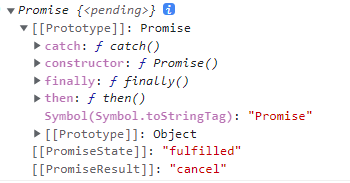

# 1. 以前异步事务的处理方式

异步事务：ajax、定时器、事件、文件操作（内置模块fs）、数据库操作

使用回调函数获取异步任务的结果，并且结果只能在回调函数里面进行处理 。因为不知道什么时候执行（函数不调用不执行），所以无法在异步任务外面处理结果，在外面属于同步代码，会优先执行

> 注意并不是所有的回调函数都是异步的，比如数组的方法`arr.map()`等就是同步执行的

## 1.1. 同步代码和异步代码

* 同步编程是指一个代码块中语句顺序执行，每个语句的执行结果在语句执行完毕后是可以马上得到预期的结果

* 异步编程是指虽然语句被顺序执行了，但是期望的实际执行结果并不能在当下得到

### 1.1.1. 异步代码示例1
```js
// 1.查询
function getData(){
    //let a
    //return a
    // 调用fs模块的readFile方法
fs.readFile(url,'utf8',(error,data)=>{
    if(error) return console.log(error.message)
    // json文件里面虽然看起来像数组，但是数据类型还是json类型
    let arr=JSON.parse(data)
    // data是不能通过return返回的，首先这个是在内层函数返回，可以在外层getData作用域里定义一个变量接受这个返回值吗？答案是不能，回调函数是异步代码，会在最后执行
    console.log(arr)
    //a=arr
})
}
```

里面的`fs.readFile()`属于异步事务，不知道什么执行，用回调函数（函数的参数是函数）接受处理异步事务的结果。回调函数里面return的值，并不能return到getData的作用域，并且如果在getData作用域最前面let一个变量a并让外层函数返回a，在回调里让`a=arr`，a会是undefined，还是异步函数最后执行的问题

这样导致`getData()`函数无法复用，只能打印或者执行一些功能，但是无法得到返回值

`p1.then(res=>{xxx return p2})`then方法的返回值为p2（底层原理不研究）

> 异步、异步操作、异步代码、异步编程、异步事务、异步方法基本是一个意思

### 1.1.2. 异步代码示例2
```js
// 依次写读取文件a、b、c，但是都是异步事务，不可能会一直按照代码顺序返回结果
fs.readFile('./txt/a','utf8',(error,data)=>{
    console.log(data)
})
fs.readFile('./txt/b','utf8',(error,data)=>{
    console.log(data)
})
fs.readFile('./txt/c','utf8',(error,data)=>{
    console.log(data)
})
```
因为异步代码执行顺序不知道，所以执行结果顺序并不确定
## 1.2. 回调函数处理

**重点：异步任务之间想要有执行顺序的话，需要在异步1的回调函数里面嵌套异步2，以此类推...**

上述代码在写入之前，需要先读出数据，但是getData()方法无法复用，需要在readFile方法里面嵌套writeFile方法，这样才会有先读后写，只有读的异步任务执行了，回调函数才会执行，然后处理写的异步任务

```js
function addData(obj){
    // getData()没有复用性，因为是异步代码没有返回值，只能打印出一些数据
    // 需要重新查询
    fs.readFile(url,'utf8',(error,data)=>{
        // 判断读取内容是否有问题
        if(error) return console.log(error.message)
        // 查询成功，先转换成数组，再向其中添加对象，然后准换成json再write进去
        let arr=JSON.parse(data)
        // 添加id
        obj.id=arr[arr.length-1].id*1+1//乘以1是为了隐式转换成数字类型，避免字符串相加
        // push新数据
        arr.push(obj)
        // 再写入之前的文件中
        fs.writeFile(url,JSON.stringify(arr),error=>{
            if(error) return console.log(error.message)
            // 没有出错
            console.log('恭喜你，添加成功！')
        })
    })
}
```

## 1.3. 回调地狱

这样如果嵌套的异步任务多了，就会形成横向金字塔，也叫**回调地狱**（3个以上），虽然可以解决异步代码的执行顺序但是代码不好维护，易读性也不强

```js
readFile('./txt/a','utf8',(err1,data)=>{
    console.log(data)
    readFile('./txt/b','utf8',(err2,data)=>{
        console.log(data)
        readFile('./txt/c','utf8',(err3,data)=>{
            console.log(data)
        })
    })
}) 
```


异步操作是 JavaScript 编程的麻烦事，麻烦到一直有人提出各种各样的方案，试图解决这个问题。早期使用回调函数处理异步编码，但存在回调地狱的问题。

ES6中，新增了Promise 对象，从此异步编程摆脱了回调函数的束缚

# 2. Promise

## 2.1. Promise介绍

**promise的回调函数里面仍然用函数处理异步执行代码，但是把执行结果抛出去了**

要点：先执行同步代码，执行过程中会产生微任务或宏任务，然后先执行微任务，再执行宏任务。（执行任意）

* then和catch方法里面最后一个都默认有一个`return Promise.resolve(undefined)`，都返回一个fulfilled的Promise
* resolve()产生一个微任务，产生并不执行，等同步代码值行完毕后执行微任务，then方法（微任务）执行完之后，又产生了一个微任务。resolve()导致then里面的res是一个undefined
* setTimeout是一个宏任务（异步事务分为宏任务和微任务）
* 宏任务和微任务都有任务队列，优先执行微任务
* script标签也是一个宏任务。一个html可以写多个script标签

> 这经常出笔试题，笔试题，需要列出所有的同步任务，宏任务，微任务，一步一步来

### 2.1.1. promise介绍

Promise 是异步编程的一种解决方案，里面可以编写异步程序的代码，代表了未来将要发生的事件（当然也可以放同步代码）。比传统的解决方案（回调函数和事件）更合理和更强大

从语法上说，Promise 是一个对象，ES6将其写进了语言标准，统一了用法，使用的使用需要 new

>某个框架调用某个方法返回值为一个promise对象时，叫作支持promise编程/开发，大部分框架都支持

实际catch的错误结果很少几乎没有，只关心then里面的结果就行

### 2.1.2. promise语法及其使用

注意点：

* Promise是一个构造函数，**需要new来创建实例**
* 必须传入一个函数作为Promise的参数，**这个函数在 new Promise的时候就会执行**

* 函数有 resolve 和 reject 两个形参（当然名字可以换，但是习惯规范是这两个名字）
* 函数就相当于一个容器，可以将异步任务放到这里（也可以放一些同步任务）
* 将异步任务成功的结果传给 resolve 函数；将失败的信息传给 reject 函数（抛出去）

```js
import fs from 'fs'
let p1=new Promise((resolve,reject)=>{
    //也可以在这里放一些同步代码，会在下面的readFile方法之前执行
fs.readFile('./txt/a','utf8',(err,data)=>{
    // 判断读取结果（异步任务）是否成功
    if(err==null){
        resolve(data)//err是nul，说明读取成功，由resolve()处理成功结果，抛出去
    }else{
        reject(err)//err是对象，说明读取失败，用reject()处理失败结果，抛出去
    }
    //也可以在这里放一些同步代码，会在下面的readFile方法之前执行
})
})
```

resolve函数和reject函数抛出来的代码用实例对象的then方法或者catch方法获取结果（then和catch放在Promise构造函数的原型对象中）

> Promise对象变为对象可以由reject()触发，也可以用throw关键字触发，`throw new Error('报错了')`error实例对象
>
> 

finally关键字表示成功与否都会执行的代码（里面也需要回调函数）

```js
// 用then方法里面的回调函数接受
// 处理1：成功失败在一个方法一起处理
p1.then(
result=>{
    console.log(result)
    console.log(p1)///Promise{'111'}
},//第一个函数处理成功（第一个resolve()执行了）
error=>console.log(error)//第二个函数处理失败（第二个reject()执行了）
)


// 处理2：成功失败各在一个方法（链式语法）
p1.then(result=>console.log(result))
.catch(error=>console.log(error.message))
.finally(()=>{console.log('测试finally')})
```

注意点:

* then方法接收一个函数类型的参数，只处理成功
* then方法接收两个函数类型的参数，分别用于接收 resolve 的值 和 reject 的值
* then方法也可以只接收一个参数，表示只接收 resolve 的值，失败的结果可以通过链式调用catch方法捕获

then和catch和finally都是存在Promise构造函数原型中的方法

### 2.1.3. promise对象的特点

1. 对象的状态不受外界影响。Promise 对象代表一个异步操作，有三种状态：

* pending: 初始状态，不是成功或失败状态。（待处理状态）
* resolved（又称fulfilled）: 意味着操作成功完成，此时Promise的结果为 传递给 resolve 函数的值。实际就是异步任务执行了为成功结果，看起来是resolve()抛出的值被then所接受以后的状态（在then里面log）。
* rejected: 意味着操作失败，此时 Promise的结果为 传递给 reject 函数的值。实际就是异步任务执行了为失败结果，吧看起来是reject()抛出的值被then或catch所接受以后的状态（then里面log）。

只有异步操作的结果，可以决定当前是哪一种状态，任何其他操作都无法改变这个状态。这也是 Promise 这个名字的由来，它的英语意思就是「承诺」，表示其他手段无法改变

2. 一旦状态改变，就不会再变，任何时候都可以得到这个结果。

   Promise 对象的状态改变，只有两种可能：从 Pending 变为 Resolved 和从 Pending 变为 Rejected

   只要这两种情况发生，状态就凝固了，不会再变了，会一直保持这个结果。就算改变已经发生了，你再对 Promise 对象添加回调函数，也会立即得到这个结果。这与事件（Event）完全不同，事件的特点是，如果你错过了它，再去监听，是得不到结果的

### 2.1.4. promise优缺点

有了 Promise 对象，就可以将异步操作以同步操作的流程表达出来，避免了层层嵌套的回调函数。此外，Promise 对象提供统一的接口，使得控制异步操作更加容易

* Promise最大的好处是在异步执行的流程中，把执行代码和处理结果的代码清晰地分离。
* Promise还可以做执行多个任务，比如，需要先做任务1，如果成功后再做任务2，任何任务失败则不再继续并执行错误处理函数（使用then方法的链式语法）

缺点：

* 无法取消 Promise，一旦新建它就会立即执行，无法中途取消
* 如果不设置回调函数，Promise 内部抛出的错误，不会反应到外部
* 当处于 Pending 状态时，无法得知目前进展到哪一个阶段（刚刚开始还是即将完成）

## 2.2. Promise解决回调地狱

调用Promise对象的then方法获取结果，如果前一个then返回一个 Promise 对象，则后一个 then 可以得到 Promise 对象成功状态的结果

```js
import fs from 'fs'

// 创建三个Promise对象
let p1=new Promise((resolve,reject)=>{
    fs.readFile('./txt/a','utf8',(err,data)=>{
        resolve(data)//不考虑失败
    })
})
let p2=new Promise((resolve,reject)=>{
    fs.readFile('./txt/b','utf8',(err,data)=>{
        resolve(data)//不考虑失败
    })
})
let p3=new Promise((resolve,reject)=>{
    fs.readFile('./txt/c','utf8',(err,data)=>{
        resolve(data)//不考虑失败
    })
})

/* p1.then(res=>{
    console.log(res)
    p2.then(res=>{
        console.log(res)
        p3.then(res=>{
            console.log(res)
        })
    })
}) */

// 顺序调用Promise对象中的then()，链式语法的方法解决了回调地狱的问题
p1.then(res=>{
    // 只有异步代码执行了，才会有then里面的回调函数，才会有res值和return返回值
    // 注意此时这里的then仍然是异步的（因为resolve方法是异步的，等待抛出值）
    /* then方法的返回值应该是里面回调函数的返回值，类似于 then(){ 
        return(res=>{})
    }*/
    console.log(res)
    return p2
}).then(res=>{
    console.log(res)
    return p3
}).then(res=>{
    console.log(res)
})//后面的then调用者就是前面then的返回值
```

## 2.3. Promise封装函数解决回调地狱（自己封装生成Promise对象）

上面代码Promise对象的创建可以用函数封装起来

```js
import fs, { readFile } from 'fs'

// 封装一个函数，获取一个promise对象
function getPromise(url){
    return new Promise((resolve,reject)=>{
        fs.readFile(url,'utf8',(err,data)=>{
            resolve(data)//不考虑失败
        })
    })
}

// 处理结果
getPromise('./txt/a').then(res=>{
    console.log(res)
    return getPromise('./txt/b')
}).then(res=>{
    console.log(res)
    return getPromise('./txt/c')
}).then(res=>{
    console.log(res)
})
```

## 2.4. then-fs解决回调地狱（调用核心模块生成Promise对象）

```js
// 先下载then-fs模块
import fs from 'fs'
import thenFs from 'then-fs'

// 演示fs和then-fs的返回值
// let a =fs.readFile('./txt/a','utf8',()=>{})
// let b=thenFs.readFile('./txt/a','utf8')
// console.log(a)
// console.log(b)

// 解决回调函数
thenFs.readFile('./txt/a','utf8').then(res=>{
    console.log(res)
    return thenFs.readFile('./txt/b','utf8')
}).then(res=>{
    console.log(res)
    return thenFs.readFile('./txt/c','utf8')
}).then(res=>{
    console.log(res)
})

// 从vue开始，所有的第三方模块，几乎全部支持Promise对象
// axios.js、then-fs.js .....
```

## 2.5. promise同步异步

new Promise 和 new 其他对象一样，是同步任务。获取结果时（调用 resolve 触发 then方法时）是异步的（resolve方法和then方法是异步的最后执行）

```js
console.log('1')

let p1=new Promise((resolve,reject)=>{
    console.log('2')
    resolve('abc')
    console.log('3')
})

p1.then(res=>{
    console.log('4')
    console.log(res)
    console.log('5')
})

console.log('6')
// 结果：1 2 3 6 4 abc 5
```

## 2.6. resolve()和reject()

resolve()和reject()前后的都是同步代码

`resolve`函数的作用是，将`Promise`对象的状态从“未完成”变为“成功”（即从 pending 变为 resolved），在异步操作成功时调用，并将异步操作的结果，作为参数传递出去；（resolved等同于fulfilled）

`reject`函数的作用是，将`Promise`对象的状态从“未完成”变为“失败”（即从 pending 变为 rejected），在异步操作失败时调用，并将异步操作报出的错误，作为参数传递出去。

`reject`函数的参数通常是`Error`对象的实例，表示抛出的错误；`resolve`函数的参数除了正常的值以外，还可能是另一个 Promise 实例

步骤：

`Promise`实例生成以后，可以用`then`方法分别指定`resolved`状态和`rejected`状态的回调函数。（即异步操作成功/失败->Promise对象状态为resolved/rejected->then方法回调函数调用）

> then或者catch回调函数里面的参数，它们都接受`Promise`对象传出的值（resolve和reject方法的参数）作为参数

注意没有resolve或者reject，promise一直没有结果，then方法一直不触发

```js
function fn() {
    return new Promise((resolve) => {
        setTimeout(()=>{
            console.log(1)
        })
        // resolve有没有参数，取决于await需不需要用变量接受结果
        // resolve()
    })
}

// await等待，等待后面的Promise成功（变为fulfilled），再执行后面的代码 await没有reject的情况
;(async () => {
    await fn()
    console.log(3)
})
// 因为这里Promise中没有resolve，promise一直处于pending的状态，后面的代码无法继续，结果就是1
```

## 2.7. Promise对象的简单示例

```javascript
function timeout(ms) {
  return new Promise((resolve, reject) => {
    setTimeout(resolve, ms, 'done');
  });
}

timeout(100).then((value) => {
  console.log(value);
});
```

上面代码中，`timeout`方法返回一个`Promise`实例，表示一段时间以后才会发生的结果。过了指定的时间（`ms`参数）以后，`resolve()`方法执行，`Promise`实例的状态变为`resolved`，就会触发`then`方法绑定的回调函数。

Promise 新建后（new之后）就会立即执行，里面的`resolve()`方法为异步代码，Promise构造函数回调函数里面也可以写同步代码，先执行

## 2.8. promise对象使用时的注意点

1. `resolve`函数的参数除了正常的值以外，还可能是另一个 Promise 实例，比如像下面这样。

   ```javascript
   const p1 = new Promise(function (resolve, reject) {
     // ...
   });
   
   const p2 = new Promise(function (resolve, reject) {
     // ...
     resolve(p1);
   })
   ```

   上面代码中，`p1`和`p2`都是 Promise 的实例，但是`p2`的`resolve`方法将`p1`作为参数，即一个异步操作的结果是返回另一个异步操作。

   注意，这时`p1`的状态就会传递给`p2`，也就是说，`p1`的状态决定了`p2`的状态。如果`p1`的状态是`pending`，那么`p2`的回调函数就会等待`p1`的状态改变；如果`p1`的状态已经是`resolved`或者`rejected`，那么`p2`的回调函数将会立刻执行。

2. 一般来说，调用`resolve`或`reject`以后，Promise 的使命就完成了，后继操作应该放到`then`方法里面，而不应该直接写在`resolve`或`reject`的后面。所以，最好在它们前面加上`return`语句，这样就不会有意外。

   ```javascript
   new Promise((resolve, reject) => {
     return resolve(1);
     // 后面的语句不会执行
     console.log(2);
   })
   ```

3. 采用链式的`then`，可以指定一组按照次序调用的回调函数。这时，前一个回调函数，有可能返回的还是一个`Promise`对象（即有异步操作），这时后一个回调函数，就会等待该`Promise`对象的状态发生变化，才会被调用

   ```js
   reqDeleteCart([id]).then(()=>{
       return context.dispatch('asyncUpdateCart')
   }).then(()=>{
       //...
       resolve()
   })
   ```

> 箭头函数`()=>{}`中{}省略的话，`()=>语句`语句默认为return的值，因为大括号省略的前提是只能有一句话，并且一定要省略return

4. 一般总是建议，Promise 对象后面要跟`catch()`方法，这样可以处理 Promise 内部发生的错误。`then()`方法返回的是Promise对象，`catch()`方法返回的还是一个 Promise 对象，因此后面还可以接着调用`then()`方法。catch方法还可以捕获then方法里面的错误，catch可以写在前面，没有错误会跳过

## 2.9. Promise.resolve()和Promise.reject()

### 2.9.1.  Promise.resolve()

有时需要将现有对象转为 Promise 对象，`Promise.resolve()`方法就起到这个作用

四种情况

* 参数是一个 Promise 实例，不做任何修改、原封不动地返回这个实例
* 参数是一个`thenable`对象（具有then方法）会将这个对象转为 Promise 对象，然后就立即执行`thenable`对象的`then()`方法
* 参数不是具有then()方法的对象，或根本就不是对象，返回一个新的 Promise 对象，状态为`resolved`。`Promise.resolve()`方法的参数，会同时传给then的回调函数
* 不带有任何参数，直接返回一个`resolved`状态的 Promise 对象

### 2.9.2.  Promise.reject()

`Promise.reject(reason)`方法也会返回一个新的 Promise 实例，该实例的状态为`rejected`，then方法的回调函数会立即执行。`Promise.reject()`方法的参数，会原封不动地作为`reject`的理由，变成后续方法（`catch()`）的参数

## 2.10. Promise.all()、Promise.race()和Promise.any()

### 2.10.1. Promise.all()

Promise.all 方法用于将多个 Promise 实例，包装成一个新的 Promise 实例

参数，接受一个数组，且数组元素 都是promise实例，也可以不是数组，如果参数有不是promise实例，会先自动调用Promise.resolve()转换为promise对象

```js
const p = Promise.all([p1, p2, p3]);
```

`p`的状态由`p1`、`p2`、`p3`决定，分成两种情况。

（1）只有`p1`、`p2`、`p3`的状态都变成`fulfilled`，`p`的状态才会变成`fulfilled`（异步的都有结果了，p才会有结果），此时`p1`、`p2`、`p3`的返回值组成一个数组，传递给`p`的回调函数（then）。

（2）只要`p1`、`p2`、`p3`之中有一个被`rejected`，`p`的状态就变成`rejected`，此时第一个被`reject`的实例的返回值，会传递给`p`的回调函数（catch）。

特殊点：如果作为参数的 Promise 实例，自己定义了`catch`方法，那么它一旦被`rejected`，并不会触发`Promise.all()`的`catch`方法

原因：catch是then的语法糖，所以then和catch都会返回一个新的promise对象，并且状态为fulfilled（resolved）

```js
const p1 = new Promise((resolve, reject) => {
  resolve('hello');
})
.then(result => result)
.catch(e => e);
console.log(p1)// Promise(fulfilled)

const p2 = new Promise((resolve, reject) => {
  throw new Error('报错了');
// reject('err')
})
.then(result => result)
.catch(e => e);
console.log(p2)// Promise(fulfilled)

Promise.all([p1, p2])
.then(result => console.log(result))
.catch(e => console.log(e));
// ["hello", Error: 报错了]
```

另外：Promise.all可以让一组异步程序并行执行，并且不影响顺序

```js
function fn1 () {
    return new Promise(resolve => {
        setTimeout(()=>{
            resolve(3)
        }, 1000)
    })
}

function fn2 () {
    return new Promise(resolve => {
        setTimeout(()=>{
            resolve(5)
        }, 500)
    })
}

function fn3 () {
    return new Promise(resolve => {
        setTimeout(()=>{
            resolve(8)
        }, 2000)
    })
}

;(async () => {
  // 【串行】，可以发请求，拿到结果的顺序也是可以保证的
  /* console.log(await fn1()) // 3
  console.log(await fn2()) // 7
  console.log(await fn3()) // 8 */
  // 【并行】发请求，并且拿到的顺序也希望有保证（先写第一个请求，拿到的第一个一定是第一个请求的结果）
  Promise.all([fn1(), fn2(), fn3(3)]).then((r) => {
    console.log(r)
  })
})()// [ 3, 5, 8 ]
```

### 2.10.2. Promise.race()

`Promise.race()`方法同样是将多个 Promise 实例，包装成一个新的 Promise 实例

```js
const p = Promise.race([p1, p2, p3])
```

上面代码中，只要`p1`、`p2`、`p3`之中有一个实例率先改变状态，`p`的状态就跟着改变。那个率先改变的 Promise 实例的返回值，就传递给`p`的回调

即Promise.race总是返回第一个结果值（resolve/reject）

和Promise.all()参数一样，如果参数有不是promise实例，会先自动调用Promise.resolve()转换为promise对象

### 2.10.3. Pomise.any()

Promise.any()返回的是第一个成功的 值。这个方法将会忽略掉所有被拒绝的 `promise`，直到第一个 `promise` 成功。参数是一个[可迭代](https://developer.mozilla.org/zh-CN/docs/Web/JavaScript/Reference/Iteration_protocols#the_iterable_protocol)的对象，例如 [Array](https://developer.mozilla.org/zh-CN/docs/Web/JavaScript/Reference/Global_Objects/Array)。

这个方法和 `Promise.all()` 是相反的

三者比较

* Promise.all，一组完成了返回一个数组，所有的完成值，有一个reject就返回reject
* Promise.race，有一个有了结果，reject或resolve都返回
* Promise.any，不关心reject，只返回第一个resolve的值

# 3. async和await关键字

async 和 await 是 ES2017 中提出来的，lasync 和 await 两个关键字的出现，简化的Promise 的使用，就是Promise对象的一个语法糖

Promise对象一共三点：new resolve then

async+return简化了new和resolve await简化了then（async和await无法捕捉到异步任务失败的情况）

## 3.1. async

* async 用于修饰一个 function，async 修饰的函数，总是返回一个 Promise 对象
* 函数的返回值，将自动包装在 resolve 的 promise 中（就是resolve方法的参数，Promise对象的抛出值）
*  async只考虑成功的情况，没有reject失败的情况

```js
// 1.async 修饰的函数，总是返回一个Promise对象
async function fn(){
    return 123
}

console.log(fn())//Promise(123)

// 2.函数的返回值，将自动包装在resolve的promise中
// async只考虑成功的情况，没有reject失败的情况
fn().then(res=>{
    console.log(res)// 123
})
```

注意async是异步的意思，但是它并不能让函数异步执行。真正的含义是：函数前面的`async`关键字，表明该函数内部有异步操作（当然也可以不写异步操作）

> async修饰的函数记得调用，本质还是函数，函数不执行不调用
>
> 注意async 修饰的函数执行完毕后，promise的状态自动变成了fulfilled（resolved），相当于new Promise中的resolve函数执行后的效果。async修饰的函数return的值等于resolve抛出的值
>
> ```js
> // async函数后面一定有一个隐藏的
> Promise.resolve(undefined)
> 
> asyncInsertCart(context, goods) {
>       return new Promise((resolve) => {
>           resolve()
>         } else {
>           resolve()
>         }
>       })
>     }
> // resolve()统一写在if-else的外面也可以    
>     
> // 等同于
> async asyncInsertCart(){
>     // 就不用写new Promise和里面的resolve了
> }
> ```

## 3.2. await

> await语法糖获取的返回值就是promise对象，.then是第一个回调函数中的第一个参数，无法捕获异常，捕获异常必须使用try-catch，用catch处理

await关键字后面针对所跟不同表达式的处理方式：

* Promise 对象：await 会暂停执行，等待 Promise 对象 resolve，然后恢复 async 函数的执行并返回解析值。
* 非 Promise 对象：直接返回对应的值。

1. await只能出现在async修饰的函数中

2. await后面跟随的是一个promise对象

3. await能停止代码执行，让包裹await的async函数外面的后面的同步代码，先执行

4. await返回的是: Promise对象中的then()中的回调函数中的参数res（用一个变量接收）即resolve()方法的参数

await关键字后面的Promise对象可以是：

* async+funciton返回的
* new Promise()
* 第三方库，如thenFs.readFile()返回的Promise对象

```js
// 定义一个async修饰的函数，用于获取一个Promise对象

async function getPromise(){
    return "我是getPromise()的返回值"
}


async function fn(){
    console.log('1')
    // await只能出现在async修饰的函数中
    // await后面跟随的是一个promise对象
    let str =await getPromise()//也可以用new代替new Promise((resolve,reject)=>{resolve(123)})
    //await能停止代码执行，让async函数外面后面的同步代码，先执行
    //await返回的是: Promise对象中的then()中的回调函数中的参数res即resolve()方法的参数
    console.log(str)
    console.log('2')
}

// 调用方法
fn()
console.log('我是最后一行代码')

// 执行结果：1 我是最后一行代码 我是getPromise()的返回值 2
```

示例

```js
async function abc() {
    let a = await myReadFile('./a.txt');
    let b = await myReadFile('./b.txt');
    let c = await myReadFile('./c.txt');
    console.log(a);
    console.log(b);
    console.log(c);
}

abc();
```

await可以等待异步代码执行完之后再执行下面的代码，想被卡住的代码放在函数里面，不想卡的就是同步代码放在async函数外面

实际开发，可能需要用到await的地方没有async需要自己手动加一个async匿名函数也可以）

```js
form.addEventListener('submit',async ()=>{
    e.preventDefault()
    let {data:res}=await axios()
    if(res.code==0) return console.log(err)
    // ...
})
```

> 如果只注重代码执行的顺序，直接await xx。如果需要拿到异步操作的结果，需要用一个变量接收一下const res = await  xx

## 3.3. 注意事项

1. async关键字返回promise对象，是为了多异步事件的执行顺序

```js
// 1.获取
export async function getData(){
    let str=await thenFs.readFile('./data.json','utf8')
    let arr=JSON.parse(str)
    return arr
}

//2.添加
export async function addData(obj){
// 查询
let arr=await getData()
//...
}
```

2. 使用了async和await就不要和回调函数处理异步任务混为一谈，以后的异步任务都会找支持promise开发的模块（异步代码会返回一个promise对象，直接用await获取）

```js
//不会用下面这种
async function fn() {
    fs.readFile('', 'utf8', (err, data) => {
        return data
    })
}

//会找一些支持promise开发的
async function fn() {
    let str = await thenFs.readFile('', 'utf8')
    return str
}
```

3. async关键字很少搭配匿名函数，为了返回promise对象，都使用具名函数

## 3.4. 补充示例一

>`const res = await fn()`await下一句是微任务
>

* 同步任务比异步任务先执行
* 微任务比宏任务先执行

```js
// 宏任务微任务
// async + await 执行机制
async function async1() {
  console.log('async1 start')
  await async2()
  console.log('async1 end')
}

async function async2() {
  console.log('async2')
}

console.log('script start')

setTimeout(function() {
  console.log('setTimeout')
}, 0)

async1()

// new Promise 执行的是同步代码
new Promise(function(resolve) {
  console.log('promise1')
  resolve()
}).then(function() {
  console.log('promise2')
})

console.log('script end')

// script start
// async1 start
// async2      
// promise1    
// script end  
// async1 end  
// promise2    
// setTimeout
```

## 3.5. 补充示例二

下面钩子中的同步代码仍然不会等待上面await的异步结果


# 4. try-catch和finally关键字

## 4.1. try-catch用来捕获异步事务的错误

错误捕获了之后就不再控制台爆红了，如果出现爆红会阻塞程序的执行

* `try{}catch(){}`组合用来捕获错误结果，catch捕获一个promise对象，`Promise.reject(new Error('错误信息'))`可以被catch捕获到

* `finally{}`关键字表示无论结果成功与否都要执行的部分

语法结构：`try{}catch(err){}finally{}`。不再使用回调函数了

```js
import thenFs from 'then-fs'

async function fn(){
try{
    // 放在一个try里面的时候b文件读取错误就不会再读取c文件，想要检测三个有没有问题，可以分别放在三个try-catch中

     // 先读取a文件
     let str1=await thenFs.readFile('./txt/a','utf8')
     console.log(str1)
     // 再读取b文件
     let str2=await thenFs.readFile('./txt/b','utf8')
     console.log(str2)
     // 先读取c文件
     let str3=await thenFs.readFile('./2txt/c','utf8')
     console.log(str3)
}catch(err){
    console.log(err)
}finally{
    console.log('文件操作完毕！')
}
   
}
// 函数声明了要记得调用
fn()
```

## 4.2. try-catch的优化

此部分涉及一些框架的知识，可以后面学了再过来回顾

`try()catch(){}`可以捕获异步事务的错误

但是由于需要嵌套不太优雅，借助async+await来优化



以elemenui的`$confirm`方法为例

```js
// 优化 $confirm promise 语法
// $confirm 的结果是 promise 对象, 所以才可以 .then  .catch(并且可以多次.then 多次.catch来链式调用)
// 当用户点击确定时, confirm 组件会进入成功的回调，点击失败，进入失败的回调
// resolved 成功的  ==>  成功的回调, 用户点确定会执行这个
// rejected 失败的  ==>  失败的回调, 用户点取消会执行这个
```

原来做法（在外面$confirm的时候.then.catch一次，删除发请求的时候又try-catch一次，看来嵌套很繁琐）：

> 小细节：.then.catch中是传一个回调.catch(e=>{xx})，try-catch中catch中是一个函数catch(e){xx}

```js
      this.$confirm('确定删除该角色吗?', '提示', {
        type: 'warning'
      })
        .then(async() => {
          try {
            // 2. 用户确定后, 发请求删除
            const res = await delRoleById(id)
            // 3. 删除完毕后根据结果提醒用户
            this.$message.success(res.message)
            // 4. 重新发请求获取数据
            this.loadRoles()
          } catch (e) {
            this.$message.error(e.message)
          }
        })
        .catch(e => {})
```

await代替了.then，try-catch代替了.catch

现在采用取消try-catch只使用await代替

难点：如果进入了catch，如果进这里相当于后面默认有一个then()，catch的返回值作为了这个then的实参，然后这个隐藏then的实参又被await捕获了，最终传到res中

```js
 const result = await this.$confirm('确定删除该角色吗?', '提示', {
        type: 'warning'
      })
      // .then(res => {res}) // res 是 confirm，这里被await代替了
        .catch(e => e) // 返回值是 e, e 是 cancel
      // 在 promise 的串行任务中, 每一次回调函数(包括 .then 和 .catch)中返回的结果, 会作为下一个 .then 的参数。
      // console.log(result)
      // 1.用户点击取消就直接 return
      if (result !== 'confirm') return

	 // 表示用户点确定
      // 2. 用户确定后, 发请求删除
      const res = await delRoleById(id).catch(e => e)
      if(！res.success) return this.$message.error(e.message)//没有就是undefined
      // 这里$message返回的是message实例对象，捕获错误需要和后端约定一个字段，比如success为true表示操作成功（或者是约定一个操作成功的code），不能直接在catch中$message
      // 3. 删除完毕后根据结果提醒用户
      this.$message.success(res.message)
```

注意$confirm进入catch的`if (result !== 'confirm') return`什么也不做

```js
const result = await this.$confirm('确定要删除吗','提示',{ type:'warning' }).catch(e=>e)
      if(result!=='confirm') return
```

同理，el-form表单兜底校验时，也是catch到错误（返回false）什么也不做

```js
const validateRes = await this.$refs.form.validate().catch((e) => e)
      if (!validateRes) return
```

但是发请求进入catch需要提示用户`if(！res.success) return this.$message.error(e.message)`一般后台传过来的数据会有一个data属性，一个code（业务状态码）或者success字段表示操作成功与否，message用来表示此次请求的提示消息

```js
const res = await addPermission(this.formData).catch((e) => e)
      if (!res.success) return this.$message.error(res.message)
      this.$message.success(res.message)
```


> await xx().catch()与try-catch没什么区别，就是try-catch需要多嵌套一层。要说其实也有，就是try-catch可以捕获到更多的代码异常，await+.catch只能捕获Promise的异常，
>
> 一般情况下只有异步代码会写成回调函数，同步的话就会直接通过返回值通知你
>
> js控制台报错，程序不再往下执行了，catch把错误捕获了，进去之后，后面代码仍然执行
>

示例：同时进入try和catch的示例

发请求对了，但是res.data没有message属性，这句错了又进入到了catch中。try捕获的范围为它的大括号里面的


# 5. 操作文件增删改查

```js
// 利用async、await、then-fs完成案例
import thenFs from 'then-fs'

// 有的函数需要返回值，有的函数则不需要，只需要一个执行结果就可以

// 1.获取
export async function getData(){
    let str=await thenFs.readFile('./data.json','utf8')
    let arr=JSON.parse(str)
    return arr
}
// 测试 要求使用Promise对象中的then，更方便一点
// getData()返回的是Promise对象
/* getData().then(res=>{
    console.log(res)
}) */

// 2.添加
export async function addData(obj){
// 查询
let arr=await getData()
obj.id=arr[arr.length-1].id*1+1
arr.push(obj)
// 用try-catch 判断是否写入成功
try {
    await thenFs.writeFile('./data.json',JSON.stringify(arr))
    // await一下，等待添加的操作执行完了之后再执行下面的代码，
    return console.log('添加成功！')
}catch(err){
    // return console.log(err.message)
    return console.log('添加失败')
}
}
// 测试
/* addData({
    bookname:"三体2",
    author:"我",
    publisher:"武汉人民出版社"
}) */

// 3.删除
export async function delData(id){
// 查询
let arr = await getData()
let newArr=arr.filter(item=>id!=item.id)
// 把数组写入到文件中，判断是否写入成功，使用try-catch
try{
    await thenFs.writeFile('./data.json',JSON.stringify(newArr))
    return "删除成功！"
}catch(err){
    return "删除失败！"
}
}

// 测试
/* delData(3).then(res=>{
    console.log(res)
}) */

// 4.修改
export async function editData(obj){
    // 查询
    let arr =await getData()
    // 数组中修改指定内容
    let index=arr.findIndex(item=>item.id==obj.id)
    arr.splice(index,1,obj)
    // 数组写入文件中，判断是否写入成功，需要使用try-catch
    try{
        await thenFs.writeFile('./data.json',JSON.stringify(arr))
        return console.log('修改成功！')
    }catch(e){
        console.log('修改失败！')
    }
}
// 测试
editData({
    id:4,bookname:"三体3",author:"刘",publisher:"北京人民出版社"
})


// 默认导出
export default{
    getData,addData,delData,editData
}
```

# 6. js任务和事件循环

设计模式：底层的东西需要抠一些，越轻量越好，往上去，页面才可以有一些浪费，性能不会受太大影响

## 6.1. JS执行机制（事件循环）

### 6.1.1. 名词介绍

**JavaScript是单线程的**，也就是说，同一个时刻，JavaScript只能执行一个任务，其他任务只能等待（浏览器是多线程的）

* 同步任务：同步任务不需要进行等待可立即看到执行结果，比如console
* 异步任务：异步任务需要等待一定的时候才能看到结果，比如setTimeout、网络请求

**事件循环（Event Loop）**：是一个在  JavaScript 引擎等待任务、执行任务、进入休眠状态、等待更多任务这几个状态之间转换的无限循环

**任务队列（task queue）**：

* 一个 Event Loop 中，可以有一个或者多个任务队列(task queue)，一个任务队列便是一系列有序任务(task)的集合
* 每个任务都有一个任务源(task source)，源自同一个任务源的 task 必须放到同一个任务队列，从不同源来的则被添加到不同队列
* 只要异步任务有了运行结果，就在任务队列之中放置一个事件（一个callback）

> 宏任务依次执行，每个宏任务中可能会有微任务，这时候就会加在宏任务的后面加上微任务，宏任务执行完之后，再执行微任务，然后在执行事件任务队列里面的异步事件。执行完之后再执行下一个宏任务（注意在一个作用域里面）

虽然说主线程执行栈中的也是宏任务，但是回答就这么回答，异步任务分为宏任务和微任务（图中描述确实有点不太准确）。异步任务放到主线程执行栈中就是宏任务


### 6.1.2. 执行流程


1. js代码开始执行后，主线程执行栈中会把任务分为两类.
2.  一类是同步任务, 一类是异步任务; 主线程执行栈优先执行同步任务
3. 异步任务会被放入特定的处理程序中，满足条件（有执行结果）后，被放到消息(任务/事件)队列中（队列满足FIFO先进先出规则）
4. 主线程执行栈中所有的同步任务执行完毕之后，通过事件循环去消息(任务/事件)队列中挑选优先满足条件的程序，放入主线程执行栈中执行。事件循环，周而复始，一直执行


## 6.2. 宏任务与微任务

### 6.2.1. 介绍

1. 宏任务(macro)task，可以理解是每次执行栈执行的代码就是一个宏任务（包括每次从事件队列中获取一个事件回调并放到执行栈中执行）。

对标面试-->异步任务分为宏任务和微任务

浏览器为了能够使得JS内部(macro)task与DOM任务能够有序的执行，会在一个(macro)task执行结束后，在下一个(macro)task 执行开始前，对页面进行重新渲染`macrotask-->渲染-->macrotask`

宏任务包含

```html
script(整体代码)
setTimeout
setInterval
I/O
UI交互事件
postMessage
MessageChannel
setImmediate(Node.js 环境)
```

2. 微任务（属于宏任务的一部分）

微任务microtask,可以理解是在当前(macro)task 执行结束后立即执行的任务。也就是说，在当前task任务后，下一个task之前，在渲染之前`macrotask-->microtask-->渲染-->macrotask`

所以它的响应速度相比setTimeout（setTimeout是macrotask）会更快，因为无需等渲染。也就是说，在某一个macrotask执行完后，就会将在它执行期间产生的所有microtask都执行完毕（在渲染前）

微任务包括

```html
Promise.then
Object.observe
MutationObserver
process.nextTick(Node.js 环境)
```

### 6.2.2. 执行机制

JS优先执行同步任务，然后执行微任务，最后执行宏任务。

**总结：Promise中的then()比大部分异步代码，优先执行！**

在事件循环中，每进行一次循环操作称为 tick，每一次 tick 的任务处理模型是比较复杂的，但关键步骤如下：

* 执行主线程中的宏任务（可能是一系列的同步事务）（栈中没有就从事件队列中获取）
* 执行过程中如果遇到微任务，就将它添加到微任务的任务队列中
* 宏任务执行完毕后，立即执行当前微任务队列中的所有微任务（依次执行）
* 当前宏任务执行完毕，开始检查渲染，然后GUI线程接管渲染
* 渲染完毕后，JS线程继续接管，开始下一个宏任务（从事件队列中获取）

Tick会触发浏览器渲染（执行一次新的宏任务），Promise不会触发（then方法执行微任务），所以更加轻量级，多使用

在ES3 以及以前的版本中，JavaScript本身没有发起异步请求的能力，也就没有微任务的存在。在ES5之后，JavaScript引入了Promise，这样，不需要浏览器，JavaScript引擎自身也能够发起异步任务了


微任务是指向完当前主线程任务后就要马上执行的任务，宏任务则是要放到下一次的事件循环中的主线程中的任务

### 6.2.3. 执行顺序示例一

执行顺序：同步-->微任务-->宏任务（先执行完同步代码，有微任务先执行微任务，然后最后再执行宏任务，注意每一个过程又可能产生新的同步代码，微任务或者宏任务，遵循执行顺序就可以了）

注意同步代码遇到直接就执行，而宏任务和微任务产生了是先加入到各自的事件队列中

代码先分块，从上往下执行下来

注意await async2()是先执行async2然后再产生一个微任务

```js
//1. 异步-宏任务
setTimeout(() => {
    //执行后 回调一个宏事件
    console.log('1')
}, 0)
//2.同步-宏任务
console.log('2');

//3.同步-宏任务
//new Promise是同步代码
new Promise((resolve) => {
    console.log('3');
    resolve()
}).then(() => {
    //4.异步-微任务
    console.log('4');
}).then(()=>{
    //5.异步-微任务
    console.log('5')
})
//6-同步-宏任务
console.log('6')

//结果顺序是：2 3 6 4 5 1
```

### 6.2.4. 执行顺序示例二

```js
setTimeout(() => {
    // #1
    new Promise(resolve => {
        resolve();
    }).then(() => {
        // #7
        console.log('test');
    });
    // #8
    console.log(4);
});

new Promise(resolve => {
    resolve();
    console.log(1)
}).then(() => {
    // #2
    console.log(3);
    Promise.resolve().then(() => {
        // #4
        console.log('before timeout');
        // return Promise.resolve(undefined); // 默认会返回这么一句话
    }).then(() => {
        // #5
        Promise.resolve().then(() => {
            // #6
            console.log('also before timeout')
        })
    })
})
console.log(2);
// #3
/* 
result: 2 3 before timeout also before timeout 4 test

同
3 √ 
8 √

微
2 √
4 √
5 √
6 √
7 √

宏
1 √

*/
```

### 6.2.5. 执行顺序示例三

```js
setTimeout(function() {
  // #1
    console.log(0);
});


new Promise((resolve, reject) => {
  // #2
    console.log(1);
    resolve();
}).then(() => {
  // #3
    // 执行此微的时候又会产生两个微
    console.log(2);
    new Promise((resolve, reject) => {
      // #6
        console.log(3);
        resolve();
    }).then(() => {
      // #7
        console.log(4);
    }).then(() => {
      // #9
        console.log(5);
    });
}).then(() => {
  // #8
    console.log(6);
});

new Promise((resolve, reject) => {
  // #4
    console.log(7);
    resolve();
}).then(() => {
  // #5
    console.log(8);
});
/* result：1 7 2 3 8 4 6 5 0

同
2 √
4 √
6 √

微
3 √
5 √
7 √
8 √
9 √

宏
1 √

*/
```

### 6.2.6. 执行顺序示例四

```js
function func(num) {
  return function () {
        console.log(num)
    };
}
// #1
setTimeout(func(1));

async function async3() {
    await async4();
    // #3
    console.log(8);
}
async function async4() {
    // #2
    console.log(5)
}
async3();
function func2() {
    // #10
    console.log(2);
    async function async1() {
        await async2();
        // #12
        console.log(9) 
    }
    async function async2() {
        // #11
        console.log(5)
    }
    async1();
    // #13
    setTimeout(func(4))
}
// #4
setTimeout(func2);

// #5
setTimeout(func(3));

new Promise(resolve => {
    // #6
    console.log('Promise');
    resolve()
})
    .then(
        // #7
    () => console.log(6)) 
    .then(
        // #9
    () => console.log(7)); 
    // #8
console.log(0);
/* result：5 Promise 0 8 6 7 1 2 5 9 3 4

同
2 √
6 √
8 √
10 √
11 √


微
3 √
7 √
9 √
12 √

宏
1 √
4 √
5 √
13 √

*/
```

