# 1. 网络通讯概述

## 1.1. 网络通讯三大要素

网络通信三大要素：协议、域名（解析成ip）、端口号

通过ip找到计算机，再通过端口找到应用程序，符合规则就可进行数据传输

* 传输协议：规定数据传输的规则，http或https或file；前端目前只接触这三项
  网络通讯的格式;   请求报文/响应报文;

* 域名或 IP：电子设备（计算机，服务器）在网络中的唯一标识
  localhost代表本机地址;   127.0.0.1代表本机地址; 

* 端口：应用程序在计算机中的唯一标识。0~65535之间，0~1023的端口可能被系统占用
  80是 http 默认，443是 https 默认；

## 1.2. 传输过程

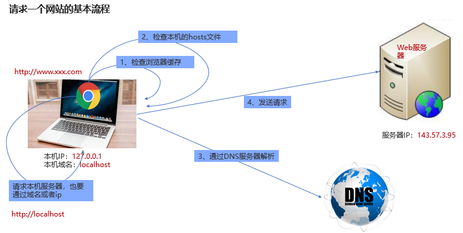

1. 浏览器输入地址，回车；（或发送一个Ajax请求）

2. 如果使用的是域名，则查找域名对应的 IP 地址（因为 IP 地址像人的身份证一样，是独一无二的）

   * 检查浏览器缓存

   * 检查本机的hosts文件
   * 通过DNS服务器查询

3. 得到服务器的 IP 地址后，通过http/https协议发送请求服务器，指定端口后，建立连接可以进行数据交换

   * 发送请求

   * 接收响应

**浏览器缓存**：

* 浏览器缓存就是把一个已经请求过的web资源（如html页面，图片，JS，数据）拷贝一份放在浏览器中。

* 缓存会根据进来的请求保存输入内容的副本。当下一个请求到来的时候，如果是相同的URL，浏览器会根据缓存机制决定是直接使用副本响应访问请求还是向源服务器再次发起请求

# 2. express框架

## 2.1. express是什么

* express 是一个第三方模块，用于快速搭建服务器（替代http模块）

* express 是一个基于 Node.js 平台，快速、开放、极简的 **web** **开发框架**。
* express保留了http模块的基本API，使用express的时候，也能使用http的API，比如 res.end()、req.url
* express还额外封装了一些新方法，能让我们更方便的搭建服务器
* express提供了中间件功能，其他很多强大的第三方模块都是基于express开发的

[Express 官网](http://expressjs.com/)

[Express 中文文档（非官方）](http://www.expressjs.com.cn/)

## 2.1. 安装并初步体验express

使用前准备：项目文件夹（名字不能是模块名或中文和特殊符号）中，

1. npm初始化 `npm int`
2. 安装express模块`npm i express@4.17.1`
3. 设置es6模块化`"type":"module"`

使用步骤：

1. 加载express模块（其实导入的是构造函数）
2. 创建express实例app对象（不用new）
3. 编写接口（回调函数是一个异步事务）
4. 指定端口，启动服务

第三步可以放到最后，除了**编写接口**这一步比较灵活，其他几步写法基本固定

```js
// 1.加载express模块
import express from 'express'

// 2.创建express实例
const app = express() //官网的这个对象的名字叫：Application

// 3.编写接口（异步）
	//3.1.get请求
app.get('/api/getbooks', (req, res) => {
    // req->request 请求对象，请求相关的在这个对象中（请求行 请求头 请求体）
    // res->response 响应对象，响应相关的在这个对象中（响应行 响应头 响应体）

    // 利用res响应前端数据，用最原始的http对象方法（end是http对象的方法）
    res.end('hello world' + '获取图书成功') //只接受字符串
})
	// 3.2.post请求
	//编写接口-地址栏只能测试get请求，不能测试post请求（异步）
app.post('/api/addbook', (req, res) => {
    res.end('添加图书成功') //汉字会乱码。修改代码后要重启服务，之前的启动是之前的环境状态打开的
})

// 4. 启动服务
app.listen(8888, () => {
    console.log('服务器启动成功，请访问：http://localhost:8888') //端口号 0-65535 6666 7777 好像被某些程序占用了
})
```

> 地址栏 a 只能发get请求   参数加在url的后面  post请求体参数不能用地址栏测试
>
> 实际响应数据都会去操作数据库了

现在多使用express模块提供的`res.send()`代替原生http模块的`res.end()`方法

* send方法会自动将对象转成JSON格式

* send方法会根据响应体，自动设置 Content-Type 响应头
* 注意send方法 不能响应数字

常见问题：

1. 两次发送 end方法调用后又调用了send方法  
   `Error [ERR_HTTP_HEADERS_SENT]: Cannot set headers after they are sent to the client`

2. 服务两次开启：端口已占用的错误  
   `Error: listen EADDRINUSE: address already in use :::3000`

## 2.3. 响应头设置

```js
	//设置响应状态码（响应行	
	res.status(201) 
	//设置响应头
    res.set({
        "content-type": "text/plain;charset=utf-8"
    })
```

## 2.4. postman接口测试软件

postman软件可以代替ajax向服务器发送请求，以测试接口是否能够正常响应

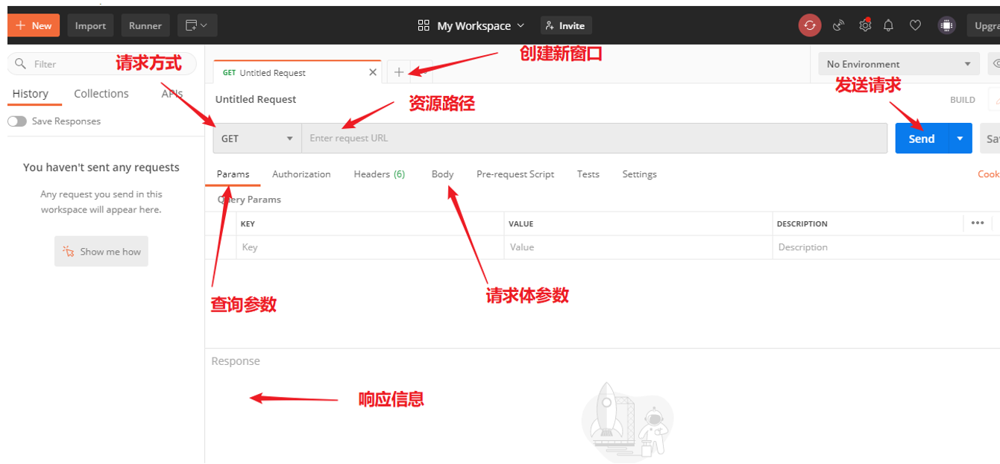

## 2.5. 获取请求数据

express可以获取请求方法，url，请求参数，注意是发送了请求之后才会在这里回调函数里面获取到，并且由`res.send()`方法返回响应信息

### 2.5.1. 获取请求方法和url

```js
app.get('/api/getbooks', (req, res) => {
    // req是请求对象，里面有和请求有关的数据
    console.log(req.method)
    console.log(req.url)
    res.send({
        code: 200,
        msg: "获取图书列表成功",
        data: ['三国', '水浒', '西游记']
    })
})

```

### 2.5.2. 获取请求参数

前端传递参数方式有两种

1. 参数写在地址中（常见get、delete请求）

  * query查询参数`api/getbooks?aa=aa&bb=ss`可以写在axios的params中
  * 动态路径参数（路由参数，也叫url参数）`/student/list/:id`

  get请求里面一般不规定content-type，params里面最后底层还是会拼接到url的后面，一般写成对象类型（为查询参数），路由参数统一写在url的后面

2. 参数写到请求体中（常用post、put、patch请求）有三种content-tye的区别

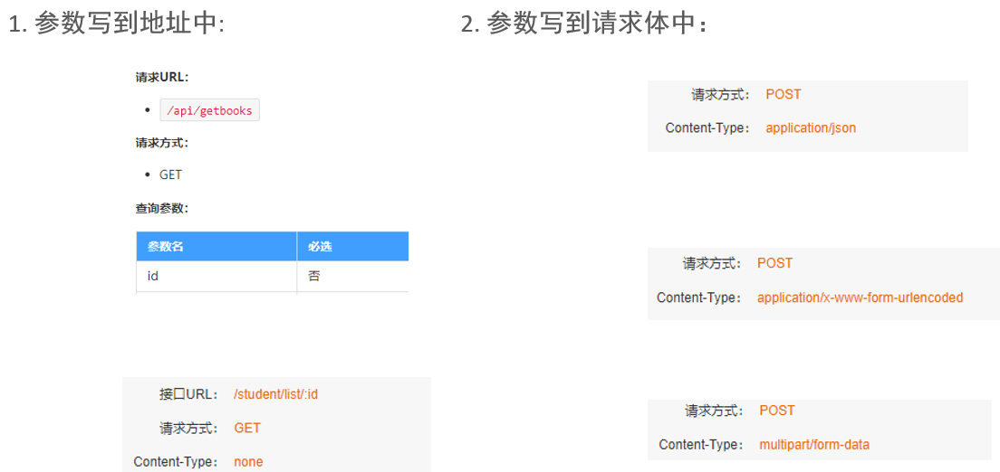

1. **请求路径中的参数，根据所在位置不同有两种获取方式**（接受的是一个对象）

```js
// 1.查询query参数，客户端写到路径的最末尾用?分隔（客户端发出url?a=xx&b=xx），不需要额外定义
    console.log(req.query) //req.url只获取路径
// 2.动态路径参数/路由/url参数，定义需要app.get('/api/getbooks:username/:password')，客户端写到路径的?前面
    console.log(req.params)
```

2. **请求体参数获取方式只有一种，但是传递参数的类型常见的有三种**

```js
// 请求体参数
    console.log(req.body)
```

获取不同的类型需要提前配置（在app.post的上面配置）,帮助我们解码，接收数据，转换成对象

* `app.use( express.urlencode({extended: true}) )`对应  `content-type: application/x-www-form-urlencoded`
  接受a=1&b=2&c=3类型
* `app.use( express.json() )`  对应  `content-type: application/json`
  接收  json  类型

* `const upload = multer({ dest: 'uploads/' })`   (需要下载)
  `app.use( upload.single('avatar') )`  对应  `multipart/form-data`     (了解)
  接收  FormData 类型，需要下载后使用

> req.query获取的如果只有一个参数，获取的一定是一个对象，通过点语法取出查询参数

```js
app.use(express.urlencoded({
    extended: true
}))
// 想要请求体能够接受application/json类型参数，需要如下设置
app.use(express.json())
// 想要让请求体能够接受 multipart/form-data 类型参数 需要如下设置
// npm i multer@1.4.2  下载之后需要启动服务
import multer from 'multer'
const upload = multer({
    dest: "./uploads" //destination
})
// 设置中间件 解码，接受数据等
app.use(upload.single('avatar'))

app.post('/api/addbook', (req, res) => {
    // 请求体参数
    console.log(req.body)
    // 对于文件上传，使用req.file获取文件信息（multer模块特殊设置）
    console.log(req.file)
    res.send({
        code: 200,
        msg: '添加图书成功'
    })
})
```


1.1. query参数

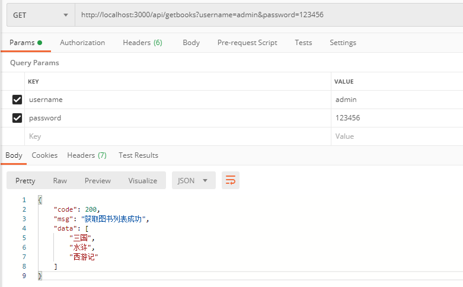

1.2. 动态路径参数

地址栏中加上冒号才可以看见path variables（但是习惯一般都不加）

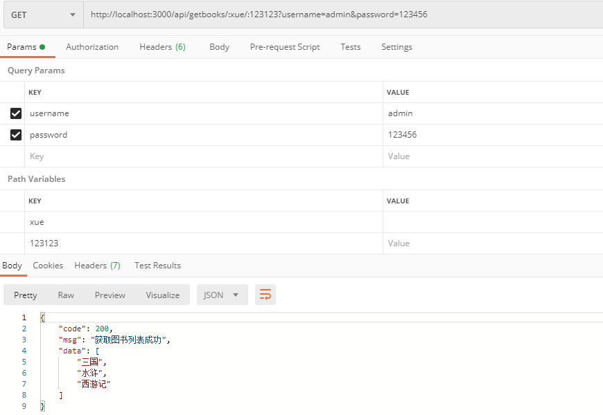

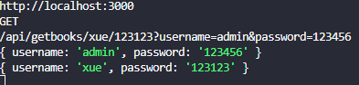

2.1. 请求体参数 application/x-www-form-urlencoded类型参数，app.use(express.urlencoded({extended: true}))

底层一定是username=waaa&pwd=1111的形式（不会拼接到地址中）

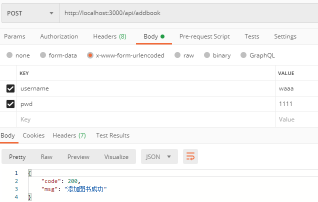

2.2. 请求体参数application/json类型参数，postman请求里面需要写json数据。请求里面发请求需要设置app.use(express.json())

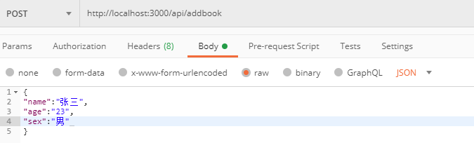

2.3. 请求体参数form-data 文件上传
需要另外下载第三方模块multer

可以通过查看req.file来查看上传文件的信息

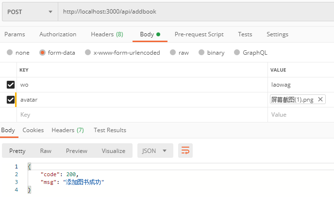

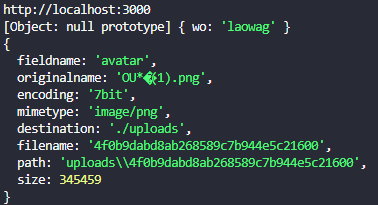

## 2.6. 开发静态资源

想要把某些html/css/js，图片，音频，视频等静态资源发送给客户端，只需要设置一句express的内置中间件即可

```js
app.use(express.static(路径));
```

# 3. 前端调用express定制接口案例

```js
// 1.下载express模块
// 2.添加package.json中的"type":"module"
// 3.导入模块
import express from 'express'

// 这样其实也可以，但是需要一层层去找到该文件，就不用下载了，这个属于我们自己定义的自定义模块，还需要下载相应的依赖，第三方模块不能管它用了什么模块
/* import tool from '../../day03/11-操作文件增删改查'

async function fn() {
    console.log(await tool.getData())
}
fn() */

// 4.导入tools.js模块

import tools from './tools.js' //es6不能省略后缀名
// 5.创建express实例
const app = express()


// 跨域问题由服务端解决，线上地址没问题是因为服务端解决了
// 前后端分离开发
// CORS跨域配置，要写到所有接口之前
// npm i cors@2.8.5
import cors from 'cors'

// 配置中间件
app.use(cors())

// 开放静态资源，不再通过本地文件打开，而是把页面放到服务器中，通过请求后台资源打开，这时候就不需要跨域处理了,book文件夹被开放出去了，可以直接访问里面的文件http://localhost:80/index.html(不要加book/)
app.use(express.static('./book'))


// 6.1.编写接口-获取图书
app.get('/api/getbooks', async (req, res) => {
    // 拓展一：根据id/bookname/author/publisher获取图书信息
    /* if (req.query.id || req.query.bookname || req.query.author || req.query.publisher) {
        // 根据传递的参数，获取图书信息
        return res.send({
            code: 200,
            msg: '获取图书信息成功',
            data: {}
        })
    } */
    // 拓展二：下面的代码，最好通过try...catch...进行异步错误捕获
    // 成功响应200，失败响应501
    // 实际中后端需要考虑的东西特别特别多，有一个很清晰的逻辑

    // 调用tools中的获取图书列表方法
    // getData()返回的是Promise对象，剥离数据使用await，必须把所在函数用async修饰

    // res.set({
    //     "Access-Control-Allow-Origin": "*"
    // })
    let arr = await tools.getData()
    res.send({
        code: 200,
        msg: '获取图书列表成功！',
        data: arr
    })
})

// 6.2.编写接口-添加图书
// 接收请求体参数，配置中间件
app.use(express.urlencoded())
app.use(express.json())
app.post('/api/addbook', async (req, res) => {
    console.log(req.body)
    // 前端错误其实也可以在后端校验，错误信息可以放在响应报文里发给前端
    if (!req.body.bookname) return res.send({
        code: 401,
        msg: "图书名不能为空"
    }, )
    if (!req.body.author) return res.send({
        code: 401,
        msg: "作者不能为空"
    }, )
    if (!req.body.publisher) return res.send({
        code: 401,
        msg: "出版社不能为空"
    }, )

    // 调用tools中的方法，向文件中添加数据
    let str = await tools.addData(req.body)
    if (str == '添加成功') {
        res.send({
            code: 201,
            msg: '添加图书成功'
        })
    } else {
        res.send({
            code: 501,
            msg: "添加图书失败"
        })
    }

})

// 6.3.编写接口-删除图书
app.delete('/api/delbook', async (req, res) => {
    // 获取查询参数
    console.log(req.query)
    // 判断，id不能为空，id为1 2 3 不能删除
    if (!req.query.id) return res.send({
        code: 401,
        msg: 'id不能为空'
    })
    if (req.query.id < 4) return res.send({
        code: 401,
        msg: 'id为1，2，3不能被删除'
    })

    // 利用tools中的方法，删除图书
    let str = await tools.delData(req.query.id)
    if (str == '删除成功') {
        res.send({
            code: 200,
            msg: "删除图书成功"
        })
    } else {
        res.send({
            code: 201,
            msg: "删除图书失败"
        })
    }
})


// 7.启动服务
app.listen(80, () => {
    console.log('http://localhost')
})
```

# 4. 中间件简介

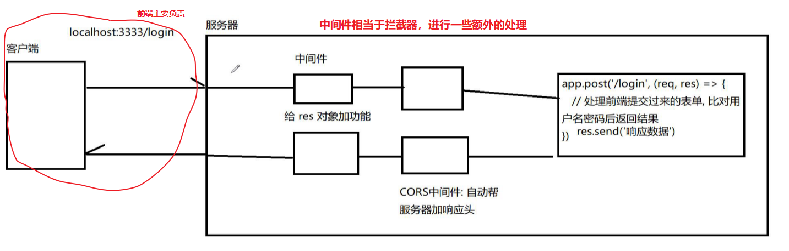

