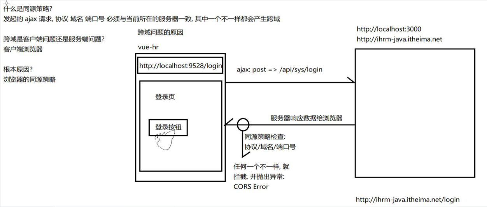
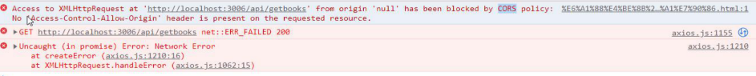
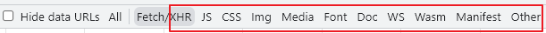
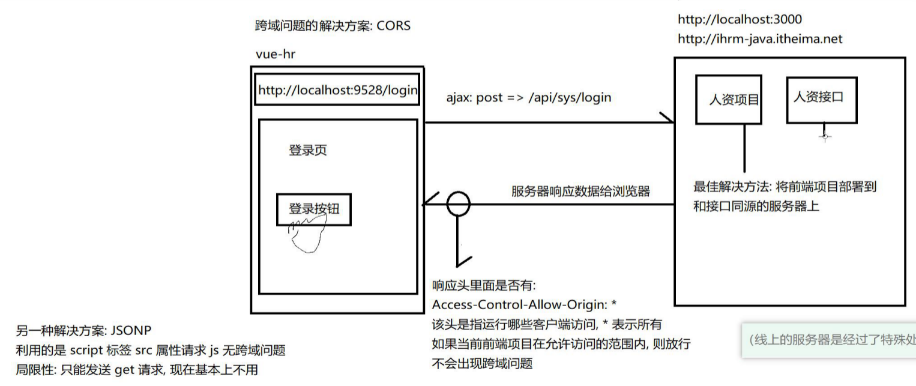

# 1. 跨域

## 1.1. 同源策略

源（origin），由协议、主机地址、端口组成（可以说就是一个url地址）

如果两个url的协议、主机地址、端口都相同，那么这两个url是同源的，否则就是非同源（至少有一个不同）

如果非同源，那么以下三种行为会受到限制：

* Cookie 无法操作
* DOM 无法操作
* **Ajax请求无效**（请求可以发送，服务器也会处理这次请求，但是响应结果会被浏览器拦截）

违反了同源策略的请求，叫做**跨域请求**



> **同源策略是客户端（手机端没有跨域）浏览器的自我保护机制**



只有ajax请求才会有跨域报错问题。

标签的src也算请求，比如请求js代码，图片资源等，下图的其他都是请求，xhr是ajax请求


> 跨域本身就不该解决，是客户端的安全策略（保护机制）很有必要，不然我们的资源谁都可以请求。**协议、域名、端口**全部一样，后面的资源路径可以不一样，就可以正常访问。
>
> 开发过程中，一定得处理跨域问题（不可能写一段代码就部署一下），上线之后项目部署了可以不解决跨域，但是如果项目不是部署到和接口同源的服务器，还是需要解决跨域

> **最佳解决方案：将前端项目部署到和接口同源的服务器上**

## 1.2. 解决跨域问题



主流的方案有两种：分别是JSONP和CORS

cors叫跨域资源共享

跨域机制是浏览器端的，正常请求，正常响应，但是拒绝接受。一般设置响应头的信息就可以让浏览器允许接受跨域请求的响应信息，但是接口太多，不可能每个都设置，推荐使用CORS第三方模块解决（在头部设置）

### 1.2.1. CORS（括斯或者直接读C-O-R-S）

MDN传送门：[https://developer.mozilla.org/zh-CN/docs/Web/HTTP/CORS](https://developer.mozilla.org/zh-CN/docs/Web/HTTP/CORS)

浏览器升级后开始支持CORS方案，从IE10开始支持，chrome大部分支持CORS

CORS方案，就是通过服务器设置响应头来实现跨域

> CORS（Cross-Origin Resource Sharing），跨域资源共享，它的特点是不需要在客户端做任何特殊的操作，完全在服务器中进行处理，支持 get 和 post 请求。才是解决跨域的真正解决方案

前端正常发送请求，由后端在服务器端加上**响应头**或者使用第三方**cors模块**（原理也是设置响应头）

1. 直接加上响应头

```js
res.set({"Access-Control-Allow-Origin":"*"})
```

2. 使用cors第三方模块（原理也是设置一个响应头）

```js
import cors from 'cors'
app.use(cors())
```

### 1.2.2. JSONP

jsonp是程序员被迫想出来的解决跨域的方案

* JSONP方案和Ajax没有任何关系
* JSONP方案只支持GET请求
* JSONP没有浏览器兼容问题，任何浏览器都支持

原理

* 客户端利用 script 标签的 src 属性，去请求一个接口，因为src属性不受跨域影响。
* 服务端响应一个字符串
* 客户端接收到字符串，然后把它当做JS代码运行

**核心原理：script标签的src属性可以引入网络js，并且会把引入的js代码执行一遍**

示例：

前端

```html
<script>
// 需要定义全局函数
        function fn(res) {
            console.log(res)
        }
</script>
<!-- fn需要是一个全局变量，script标签src属性可以向src地址发一次请求并且只能是get请求，这样就不会有跨域的问题了，收到后端的数据后（一般是字符串）会当作js代码执行一遍，收到后端后就执行前端的全局函数（相当于之前的axios全局函数）-->
<script src="http://localhost:3000/jsonp?callback=fn"></script>
```

后端j接口

```js
import express from 'express'

const app = express()

app.get('/jsonp', (req, res) => {
    // res.send('OK')
    // jsonp请求需要后端的配合
    // 后端传到前端的东西，字符串直接当作命令来执行（一般是一个执行函数），用参数传递前端的函数名
    let fnName = req.query.callback
    res.send(`${fnName}({code:200,msg:'获取数据成功'})`)

})

app.listen(3000, () => {
    console.log('http://localhost:3000')
})
```

jsonp需要后端配合前端代码，当前端代码变了，后端代码也要变，实际开发并不使用

cors是由开发期间后台人员在服务器端配置，项目上线后需要去掉cors设置的响应头，由于已经静态资源共享了就不会出现跨域的问题了

### 1.2.3. 拓展：封装JSONP函数来模拟AXIOS（运用jsonp原理）

```js
// 封装一个jsonp函数来模拟axios（运用jsonp原理）
        jsonp({
            method: 'get',
            url: 'http://localhost:3000/jsonp',
            success: function (res) {
                console.log(res)
            }
        })

        function jsonp(obj) {
            // 用script标签来发请求
            let script = document.createElement('script')
            // 定义一个变量，赋随机初始值
            let fnName = "xxx" + Math.random().toString().slice(2)
            // 定义一个全局变量，匿名函数的名字，收到后端传来的数据之后立刻执行fnName()
            //
            window.fnName = obj.success
            script.src = `${obj.url}?callback=fnName`
            document.head.appendChild(script)
            script.onload = function () {
                // 每次jsonp请求后页面会多出一个script标签，移除掉自己
                this.remove()
                // delete关键字移除全局变量
                delete fnName
            }
        }
```

### 1.2.3. 小结

方案|前端|后端
-|-|-
cors|正常发请求|设置响应头
jsonp|1. 准备一个全局函数；2. 使用script的src发送请求|响应函数调用

# 2. 递归

## 2.1. 递归介绍

编程语言中，函数直接或间接调用函数本身，则该函数称为递归函数

因为是自己调用自己，所以容易出现死循环，所以使用递归的时候一般会注意两个控制条件

1. 设置调用条件，满足条件，则函数自己调用自己。（if语句）

2. 设置跳出条件，满足条件，则跳出函数的调用。（用return关键字）

```js
// 计数器思想：会定义一个全局计数变量来保存次数

//条件1
/* let i = 0
function fn() {
    // 1. 设置调用条件，满足条件，则函数自己调用自己。（if语句）
    if (i < 3) {
        console.log('递归函数')
        i++
        fn()
    }
}
// 函数不执行不调用
fn()
*/

//条件2
let i = 0
function fn() {
    // 2. 设置跳出条件，满足条件，则跳出函数的调用。（用return关键字）
    if (i >= 3) return
    console.log('递归函数')
    i++
    fn()
}
fn()
```

## 2.2. 递归简单案例

```js
// 1. 递归求1-n的和
let i = 1

function getSum(n) {
    if (n == 1) return 1
    return n + getSum(n - 1)
}


// 2. 求等差数列的和（第n项目的值：首项+（n-1）*公差）
// 与1-n求和差不多，从后往前算

// 首项，公差，第n项
function fn(f, d, n) {
    if (n == 1) return f
    return f + (n - 1) * d + fn(f, d, n - 1)
}


// 3. 求数组中所有项目的和（公式：开始值和结束值一样大就结束了）
// 变量:数组，数组，从哪个索引值开始
function fn(arr, index) {
    // 判断，从哪个索引值开始，如果这个索引值等于最大索引值了，那么就应该退出
    if (index == arr.length - 1) return arr[index]
    // 第一项   +   第二项到最后一项的和
    return arr[index] + fn(arr, ++index) //++在前，先自增，然后在作为参数运算，如果是一个单独的表达式，++i和i++是一样的
}
```


