# 1. yarn

中文官网地址: https://yarn.bootcss.com/

下载地址:  https://yarn.bootcss.com/docs/install/#windows-stable 

yarn是基于npm（可以下载npm库里的所有模块），只是修改了一些下载地址什么的下载更快，yarn需要安装包安装，npm是node自带全局命令

## 1.1. yarn使用

 ```bash
# 1. 初始化, 得到package.json文件(终端路径所在文件夹下)
yarn init
# 类似: npm init

# 2. 添加依赖(下包)
# 语法: yarn add [package] 多个模块用空格隔开
# 语法: yarn add [package]@[version]
yarn add jquery
yarn add jquery@3.5.1
# 类似: npm install jquery

# 3. 移除包
# 语法: yarn remove [package]
yarn remove jquery
# 类似: npm remove jquery

# 4. 安装项目全部依赖(一般拿到别人的项目时, 缺少node_modules)          
yarn
# 会根据当前项目package.json记录的包名和版本, 全部下载到当前工程中
# 类似: npm i

# 5. 全局
# 安装: yarn global add [package]
# 卸载: yarn global remove [package]
# 注意: global一定在add左边
yarn global add @vue/cli
# 如何使用, 为明天学习vue做铺垫
# 类似: npm install -g @vue/cli 

# 6. 执行scripts里面的自定义命令/脚本
# 语法：yarn build
# 类似：npm run build（npm只有start可以省略run  npm start）
 ```

## 1.2. yarn与npm的区别

1. yarn安装done后还会发送一个请求来验证看是否装对，其实下载比npm速度快很多，会显示进度条，和npm交替使用，但是最好不要混起来用
2. 在项目文件夹中使用yarn命令（package.json所在的文件夹），yarn中的package少了很多不必要的代码（空的都删了），按需添加
3. 产生错误时会产生一个错误日志文件yarn-error.log
4. yarn.lock和之前的package-lock.json差不多用来记录下载的信息

> yarn.lock 是自动生成的，**你不应该去手动的修改**。比如我们的常规操作，都会自动更新 package.json 和 yarn.lock，下载依赖yarn add或者更新依赖yarn update（更新慎用，可能出现不兼容的问题）。
>
> 此文件会锁定你安装的每个依赖项的版本，这可以确保你不会意外获得不良依赖，并且会避免由于开发人员意外更改或则更新版本，而导致糟糕的情况。顶级yarn.lock文件包含Yarn需要锁定整个依赖关系树中所有包的版本的所有内容。
>
> yarn.lock 里能看到安装库文件的实际版本号（package.json里面只是给了一个包版本区间），并且需要上传到git，以保证其他人在yarn install时大家的依赖能保证一致
>
> 如果版本被锁定了：
>
> 1. 修改 yarn.lock 文件，把 upath 的版本改成最新版本，再 yarn 一遍。
> 2. 删掉 yarn.lock 文件里面关于 upath@1.0.4 的信息，再 yarn 一遍。
> 3. 直接删掉 yarn.lock 文件，再 yarn 一遍

## 1.3. 使用yarn可能遇到的问题

如果报错参考报错文档: https://lidongxuwork.gitee.io/error/#811

# 2. webpack概念

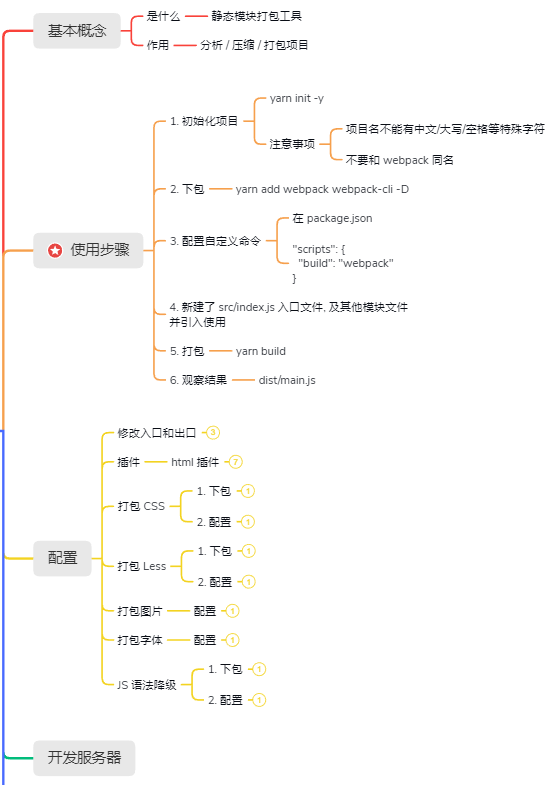

## 2.1. 什么是webpack

webpack中文文档：[https://webpack.docschina.org/](https://webpack.docschina.org/)

1. 我们为什么要学习webpack？
   1. 减少文件数量
   2. 缩减代码体积
   3. 提高浏览器打开的速度
2. 什么是webpack？作用是？目的是？
   1. 它是一个Node的第三方模块
   2. 作用是识别代码，翻译，压缩，整合打包
   3. 提高打开网站的速度

webpack是现代 javascript 应用程序的 **静态模块打包器 (module bundler)**，静态是文件资源，模块是需要在node环境中执行，引入文件，遵守模块化语法

开发完项目, 可以用node+webpack来**分析**, **翻译**, **压缩**, **打包**，减少文件数量，缩减代码体积，加快浏览器页面的打开速度，提高用户体验

> * npm和yarn是依赖/模块管理工具（有时也叫包管理），用来下载包
>
> * webpack和包管理工具，用来管理包运行需要基于node环境，node的规范是CommonJS规范，用require获取模块（其他所有的业务js都是用ES6语法）

**webpack默认只支持打包js代码（不改变出入口不需要设置额外的配置信息），但是可以通过下载额外的第三方包来支持打包css、less文件，图片和字体图标在最新版的webpack中内置了有资源模块asset，语法降级需要使用babel模块来提高兼容性，但是都需要在`webpack.config.js`中设置相关配置信息**

小技巧

1. 注意是新建文件，直接自动把外层文件夹自动建立

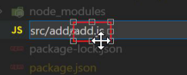

2. src文件夹下面只有一个add文件夹不会展开，点击src或者add下面出现下划线，表示选中哪一个文件根目录。左键选中，或者直接右键新建都可以

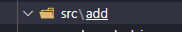

# 3. webpack使用

## 3.1. 使用前准备

需要准备：

1. node环境
2. npm或yarn模块管理器，初始化得到一个`package.json`文件
```bash
yarn init
```
3. 项目文件夹和相应的npm包 (npm包名 不能有大写字母 或者包名或者中文字符和特殊字符)
```bash
yarn add webpack@5.31.2 webpack-cli@4.6.0 -D
```
4. 下载webpack并配置命令（webpack不能使用全局命令，希望webpack包版本与自己的项目绑定，需要装本地包）需要放在package.json的scripts中，使用npm run来执行webpack命令，常用约定俗成的’build’键名

```json
scripts: {
	"build": "webpack"
}
```

> 下载的webpack和webpack-cli一定都是开发依赖（项目上线后不需要了），严格的说和webpack打包用关的全都是开发依赖，以后一定会融合到出口js文件中，项目执行的是出口文件，与如何打包无关

## 3.2. 使用

### 3.2.1. 注意事项

webpack  不需要加type:module，webpack会识别es6语法，把文件融合导入。运行的是打包后的js文件，使用ES6模块化，最终会整合到出口文件中，就没有模块化的概念了

> * es6中使用`export fn`一定要用对象`import  {fn} from xxx`
>
> * `export default {}` 用一个对象`import obj from xxxx`

dist是distribution 分开 发行 发行版的意思，dist文件中的文件名不能手动随便更改，可以通过修改`webpack.config.js`文件来定制打包后的文件名和路径

### 3.2.2. 使用步骤

1. 先下载安装webpack, 配置打包命令
2. 默认入口src/index.js-要被打包的文件, 要引入到这里使用
3. 输入yarn build打包命令(实际是项目环境webpack命令)
4. 输出代码到dist/main.js中


1. 新建src/add/add.js - 定义求和函数导出

```js
export const addFn = (a, b) => a + b
```

2. 新建src/index.js导入使用

```js
// webpack打包的入口
import { addFn } from './add/add'
console.log(addFn(5, 2));
```

3. 运行打包命令

```bash
yarn build
```

**效果**

1. src同级目录下, 生成dist目录和其下的main.js文件
2. 查看main.js文件, 是打包压缩后的代码

```js
(()=>{"use strict";console.log(7)})();
```

3. 打包关系图

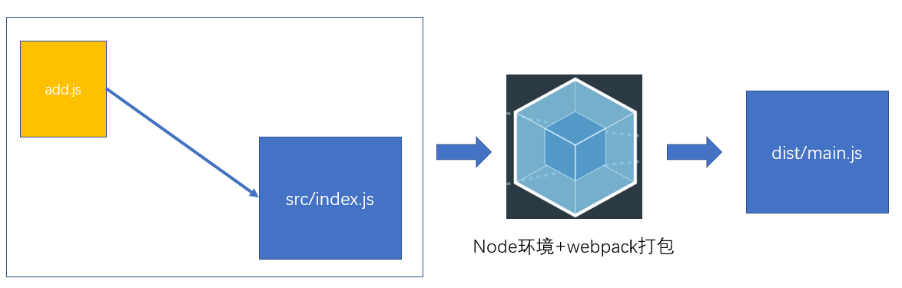

## 3.3. 更新打的包

修改了代码之后需要重新打包，新增的模块代码需要被引入到入口处，打包之后会覆盖原来dist里面的main.js

1. 新建src/tool/tool.js - 导出数组求和方法

```js
export const getArrSum = arr => arr.reduce((sum, val) => sum += val, 0)
```

2. src/index.js - 导入使用

```js
import { addFn } from './add/add'
import { getArrSum } from './tool/tool'

console.log(addFn(5, 2));
console.log(getArrSum([5, 6, 9, 10]));
```

3. 重新打包

```bash
yarn build
```

### 效果

1. 自动覆盖原dist,  结果压缩极致，比如函数未调用会删掉，或者函数没有复用的话会计算出函数的执行结果并删掉函数

```js
(()=>{"use strict";console.log(7),console.log([5,6,9,10].reduce(((o,e)=>o+e),0))})();
```

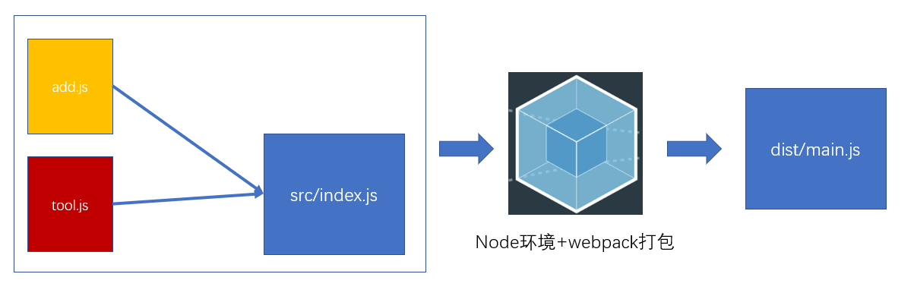

> * `yarn build`命令要在项目文件夹根目录下的终端窗口执行

## 3.4. webpack打包流程图

运行`yarn build`之后发生了什么

1. 敲击命令, 代码执行过程

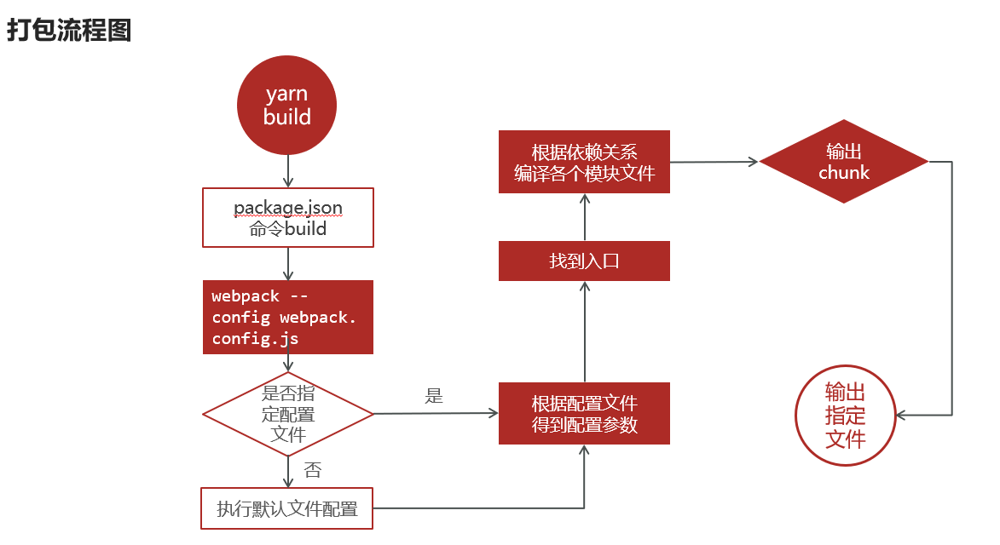

> webpack打包工具会把之前用各种依赖的文件错从复杂的，变成一个一个的文件

2. 代码源文件和webpack之间关系图

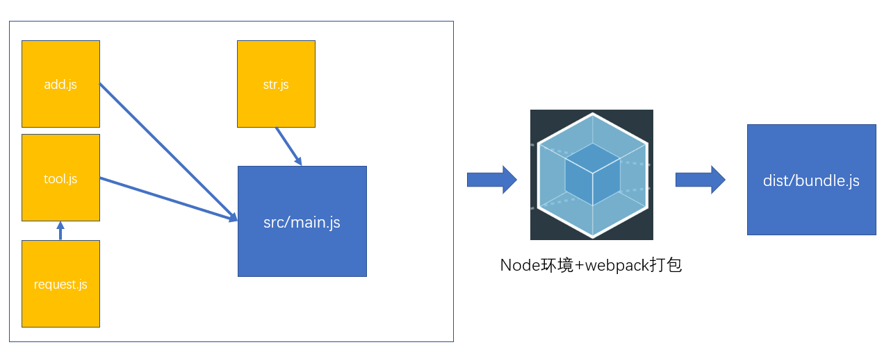

> **webpack打包的文件需要和src/index.js入口文件有直接或间接的引入关系**

简述下打包流程：

1. 执行局部webpack命令(前提项目中下载了webpack包)
2. 有webpack.config.js则使用, 否则用内置默认
3. 根据入口建立引入关系
4. 编译翻译整合打包输出到指定位置

# 4. webpack应用示例

目标：使用webpack打包项目，下载axios到项目中使用（这里默认已经修改了默认src/index.js入口文件为main.js，并把导出文件命名为dist下的bundle.js）

0.装包yarn add axios

 1.引入到main.js

// 平时写的代码（src目录）都是使用ES6的模块化语法，只有webpack配置文件使用CommonJS模块规范，webpack打包工具，会将这些第三方库代码整合到dist/bundle.js中，相当于自动识别这些es6的导入导出语法（相当于降级），那些文件并不执行，真正执行的只有dist/bundle.js（已经压缩整合好的）

1. 回顾从0准备环境

* 初始化包环境
* 下载依赖包
* 配置自定义打包命令

2. 下载axios

```bash
yarn add axios
```

3. 新建public/index.html - 前端首页
4. 新建src/main.js - webpack打包入口文件

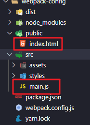

5. 配置main.js文件

```js
// 第三方的包写模块模块标识符即可，自动到node_modules中去
import axios from 'axios'

// 实现业务功能
axios.get('http://123.57.109.30:3006/api/getbooks')
    .then(res => {
        console.log(res)
    })
```

6. 执行yarn打包命令 yarn build

会将main.js中的代码打包输出到dist/bundle.js，此时还需要一个html引入js后才可运行

7. 准备public/index.html，将其复制到dist目录下，在dist/index.html中引入bundle.js（这以后不用复制html文件用webpack插件html-webpack-plugin实现）
8. 打开dist/index.html并在浏览器环境运行，以后页面运行的就是这个文件，执行的只有bundle.js里面的js代码

# 5. webpack配置（修改出口和入口）

## 5.1. webpack默认的入口和出口文件

默认入口文件：

* src/index.js（默认不能修改别的名字）
* 所有代码都需要直接或者间接引入到入口文件内（css和less文件也可以当做模块）

默认出口文件：

* dist/main.js（dist中的文件名不能手动修改）
* 页面只执行出口文件中的js代码，所有代码都被整合打包到出口文件中

> 项目文件夹中不和出口文件无关的不会被打包

## 5.2. 配置webpack配置文件（出入口）

在项目根目录下（和package.js平级）新建一个`webpack.config.js`文件用来配置webpack来定制化webpack的打包

注意：webpack里面用的es5的语法，因为webpack是基于npm的，npm是运行在node环境中，node环境默认是CommonJS规范（使用require导入，module.exports导出）

补充：

```js
// 点语法是往exports和module.exports指向的共同对象里加入一个成员
// exports={} 是一个新对象，而node只识别module.exports的对象，所以exports={}无效
// exports.a = '1'

// 开发常用
module.exports = {}
// exports和module.exports是指向的一个对象
```

具体实现

```js
const path = require('path')
module.exports = {
    // 入口：可以是相对路径（习惯使用相对路径），规律：能用相对路径的地方一般都可以使用绝对路径，但用绝对路径的地方，大多不支持相对路径
    entry: './src/main.js',
    // 出口：output必须是一个绝对路径
    output: {
        // 绝对路径拼接
        path: path.join(__dirname, './dist'),
        filename: 'bundle.js'
    }
}
```

## 5.3. package.json中入口文件

指定模块的入口文件，就是require模块时node中模块查找规则

1. 去node_modules中找axios包
2. 看package.json文件的main属性对应的入口
3. 将其引过来

第三方模块才会有这个用，index.js中这一行代码的意思就是先导入再导出，相当于一个中转站

const axios=require ('axios')

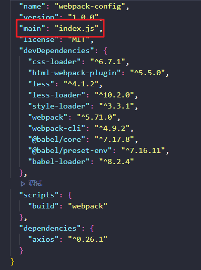

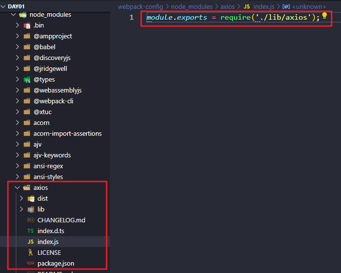

# 6. webpack插件（自动复制html文件）

之前的public/index.html需要手动复制到dist目录下，并且手动导入出口文件bundle.js，很麻烦

可以调用webpack相关的第三方包`html-webpack-plugin`来实现自动化

```js
// 引入的插件是一个构造函数
const htmlWebpackPlugin = require('html-webpack-plugin')

module.exports = {
    //可以设置出口和入口
    
    // 插件的使用
    // 1.下包：yarn add html-webpack-plugin -D
    // 2.在webpack配置文件中引入
    // 3.在配置文件中plugin节点中配置
    plugins: [
        new htmlWebpackPlugin({
            // 指定html文件的路径，插件会自动将这个html文件复制到dist中（出口文件），并且会自动加上一个script标签（配上defer属性，在页面内容加载完毕后再执行js代码，类似于onload事件）导入业务js代码
            template: './public/index.html'
        })
    ],
```

配置了之后重新`yarn build`就会自动复制html文件并且自动加上script标签导入js代码

# 7. webpack加载器loader

webpack默认不进行任何配置的话只支持打包js文件

loader帮助webpack读取各种文件，css和less需要下载第三方loader模块，图片和字体图标使用内置asset资源模块，语法降级需要下载第三方包。

通过loader加载器, 打包更多类型文件

> 注意无论怎么处理，最终都是通过js文件动态引入到html

## 7.1. 处理css文件

webpack能通过引入第三方包并进行相关配置来帮助打包css文件。

步骤：

1. 新建 - src/css/index.css

2. 编写去除li圆点样式代码

```css
li{
    list-style: none;
}
```

3. 在main.js引入index.css

导入css模块，直接导入文件,import '路径' 只导入，不接受任何导出的东西，一般只需要执行目标文件代码，不用导入内部成员

> 一定要引入到入口才会被webpack打包

```js
import "./css/index.css"
```

4. 执行打包yarn build命令观察效果

> 错误解释: 你可能需要一个loader来支持这种类型文件, 解析css代码（非常只能帮助提示了）
>
> 原因: webpack默认只识别js文件

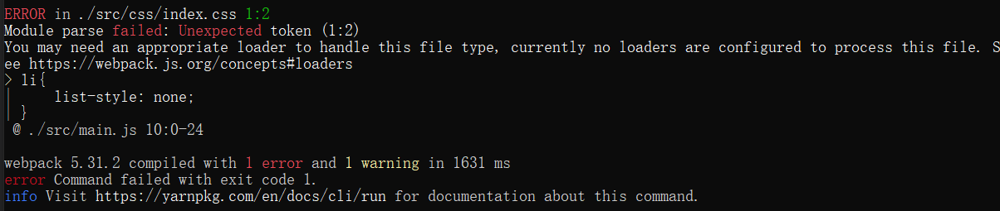

[style-loader文档](https://webpack.docschina.org/loaders/style-loader/)

[css-loader文档](https://webpack.docschina.org/loaders/css-loader/)

正确步骤

1. 新建 - src/css/index.css并写好样式
2. 将css文件引入到入口文件中
3. 安装loader依赖（**loader依赖在下载了后不需要在配置文件中引入**）

```bash
yarn add css-loader@5.2.1 style-loader@2.0.0  -D
```

4. webpack.config.js 配置

```js
module.exports = {
    // ...其他代码
    module: { // 如何处理项目中不同模块文件
        rules: [ // 规则
          {
            test: /\.css$/, // 匹配所有的css文件
            // use数组里从右向左运行
            // 先用 css-loader 让webpack能够识别 css 文件的内容并打包
            // 再用 style-loader 将样式, 把css插入到dom中
            use: [ 'style-loader', 'css-loader']
          }
        ]
    }
}
```

5. 执行yarn build打包（最后的样式在出口的js中）

使用loader处理，从右到左的使用，由css-loader负责读取到css文件后，处理完毕后交给style-loader把js内样式插入到dom上，底层原理实际就是动态创建了一个style标签，把样式插进去了**（这一段js代码打包进出口文件中了，即css代码被打包进了dist/bundle.js中）**

最后css样式在js代码中，由js动态创建style标签加到html页面中，这里是内联样式。不用link标签减少了发请求的次数，不用行内样式，是因为优先级太高了

记得要在main.js入口文件中导入css模块

### 效果

1. css代码被打包进了dist/bundle.js中
2. 运行时, css代码插入到html的style标签中

## 7.2. 处理less文件

以前的less转css是用的less插件，现在webpack可以帮助我们把less转换为css，需要删掉这个插件，不然可能会出现覆盖的情况

[less-loader文档](https://webpack.docschina.org/loaders/less-loader/)

1. 新建src/less/index.less  - 设置li字体大小24px

```less
@size:24px;

ul, li{
    font-size: @size
}
```

2. 引入到main.js中

```js
import "./less/index.less"
```

3. 下载依赖包（less-loader只帮忙读less文件，解析的活有less来做）

```bash
yarn add less@4.1.1 less-loader@8.1.0 -D
```

4. webpack.config.js 配置

```js
module: {
  rules: [ 
    // ...省略其他
    {
    	test: /\.less$/, // 匹配.less结尾文件
    	// 使用less-loader, 让webpack处理less文件, 内置还会用less模块, 翻译less代码成css代码
        use: [ "style-loader", "css-loader", 'less-loader']
    }
  ]
}
```

> 总结: 只要找到对应的loader加载器, 就能让webpack处理不同类型文件

要点：

* 下载less和less-loader2个包
* less-loader识别less文件   
* less是翻译less代码到css代码

less翻译后，还需要：（在use中配置三个loader）

* 还要用css-loader把css代码进js中
* style-loader, 把css代码插入到DOM上

> 不一次性转换成功，就更加体现了模块化的概念，各自做各自的事件

## 7.3. 处理图片文件

减少src发送的请求次数，img的src或link的src，请求本地资源和请求网络资源

### 7.3.1. 处理

步骤：

1. 准备assets文件夹下2个图文件
2. 在css/less/index.less - 把**小图片**用做背景图

```less
body{
    background: url(../assets/logo_small.png) no-repeat center;
}
```

3. 在src/main.js - 把**大图**插入到创建的img标签上, 添加body上显示

```js
// 引入图片-使用
import imgUrl from './assets/1.gif'
// 在webpack中使用图片，可以将图片当做模块导入进来
// file:///D:/Desktop/web/10.%20vue/myNode/day01/webpack-config/dist/37ece4fa2c916b8e9170.gif
// http://127.0.0.1:5500/dist/37ece4fa2c916b8e9170.gif
// 图片被导入到js文件中就是URL（绝对路径或者live.server的url）

// 设置两种类型的值
// 1.URL 2.BASE64（data URI 数据连接）
const theImg = document.createElement("img")
theImg.src = imgUrl
document.body.appendChild(theImg)
```

webpack5内置处理方案, 不需要下包，只需要填入配置即可，[asset module资源模块文档](https://webpack.docschina.org/guides/asset-modules/)

4.配置webpack.config.js文件

```js
module:{
    rules:[
        {
            test:/\.(jpg|png|gif|jpeg)$///匹配图片文件
            type：'asset'//在导出一个data uri 和复制一个单独的文件之间自动选择
            //设置为asset/resource表示不转成base64直接打包到dist中，asset表示自动选择
            //也可以设置generator来定制打包路径
        }
    ]
}
```

> 图片和字体图标一样可以自定义打包路径通过设置module:{rules:[{generator:{filename:xxx}}]}

### 7.3.2. 处理区别

*  小于8kb的, 转成data URI(图片转成base64字符串打包进js中)较少网络请求次数

字符串在网页的任何地方都可以直接使用

* 大于8kb的, 直接复制文件到dist目录下(因为转base64会体积增30%)

这样也是通过js文件动态引入到html中

## 7.4. 处理字体图标

**步骤**

1. 素材文件夹/字体库fonts文件夹
2. 在main.js引入iconfont.css（不需要下包）

```js
// 引入字体图标文件
import './assets/fonts/iconfont.css'
```

3. 在public/index.html使用字体图标样式

```html
<i class="iconfont icon-weixin"></i>
```

4. 配置webpack

```js
{
    test:/\.(eot|svg|ttf|woff|woff2)$/,
    type:"asset/resource",//不转换成base64,直接打包到dist文件夹中
    generator:{
	// 通过filename手动指定文件名
	// 希望能保留原来的后缀名，需要使用webpack的内置变量
	// font表示新建dist下面的文件夹
	// [name]：以前的文件名
	// [hash]:生成一段20位的哈希值
	// [ext]:以前的后缀名 包含. 
        filename:'font/[name]_[hash:6][ext]'
	}
}
```

不自定义generator，webpack会根据文件内容算出来每个文件的20位哈希值作为文件名，哈希值是为了保证文件不重名，统一放在dist文件夹下，显示比较杂乱无章

# 8. js语法降级

ES语法降级处理，主要是为了兼容性，只支持低版本的浏览器仍然可以享受便捷的新语法

babel编译器=> 用于处理高版本 js语法 的兼容性  [babel官网](https://www.babeljs.cn/)

webpack配合babel-loader 对js语法做处理 [babel-loader文档](https://webpack.docschina.org/loaders/babel-loader/)

**步骤**

1. src/main.js - 编写箭头函数（不调用，为了让webpack打包函数，调用的话打包后，可能函数会被删掉）

```js
const fn = () => { // 高级语法
  console.log("你好babel");
}
console.log(fn) // 一定打印函数, 才会被webpack把"函数体"打包起来
```

2. 安装包

```bash
yarn add -D babel-loader@8.2.2 @babel/core@7.13.15 @babel/preset-env@7.13.15
```

3. webpack.config.js 配置规则（这一段最好不要自己写）

```js
{
                test: /\.js$/, // 匹配js结尾文件
                exclude: /(node_modules|bower_components)/, // 不转换这2个文件夹里的js
                use: {
                    loader: 'babel-loader', // 使用加载器-处理
                    options: {
                        presets: ['@babel/preset-env'] // 预设:转码规则(用bable开发环境本来预设的)
                        // babel-loader加载器帮webpack读js代码
                        // @babel/preset-env babel预设,根据浏览器来设置降级规则,看降到什么版本
                        // @babel/core js编译器，来分析代码
                    }
                }
            }
```

4. 重新打包，发现bundle.js文件自动转换成了funciton

# 9. 小结

一般流程是：引入相关资源模块（可以直接使用）-->下包-->配置webpack-->重新打包-->打开index.html看效果

图片和字体图标不需要下包使用内置module asset资源模块，

* 入口和出口设置（需要导入path模块）

```js
const path = require('path')

module_exports={
    entry: './src/main.js',
    // 出口：output必须是一个绝对路径
	output: {
        // 绝对路径拼接
        path: path.join(__dirname, './dist'),
        filename: 'bundle.js'
    }
}
```

* html是插件配置在`plugins:[]`中（需要额外导入构造函数模块）

```js
const htmlWebpackPlugin = require('html-webpack-plugin')
module.exports={
    plugins: [
        new htmlWebpackPlugin({
            // 指定html文件的路径，插件会自动将这个html文件复制到dist中（出口文件），并且会自动加上一个script标签（配上defer属性）导入业务js代码
            template: './public/index.html'
        })
    ],
}
```

defer是一个布尔值，script标签只写defer表示defer=true，同defer="defer"也是ture

* 以下需要导入到入口文件中（导入外部资源文件）

```js
//bundle.js
import './styles/index.css'
import './styles/index.less'
import imgUrl from './assets/images/1.gif'//es6 export default {}
import './assets/fonts/iconfont.css'
```

css、less、图片、字体图标、babel降级都配置在`module:{rules:[{test:xxx,use:xxx}]}`中

```js
// 所谓的配置文件就是对外暴露一个js对象
module.exports = {
    // 一般带s的是数组，单数的为对象
    // loader加载器在下载了之后不需要在配置文件中引入
    module: {
        rules: [{
                // 1.css
                test: /\.css$/i,
                use: ['style-loader', 'css-loader']
            },
                
            // 2.less
            {
                test: /\.less$/i, 
                use: ['style-loader', 'css-loader', 'less-loader']

            },
                
            // 3.图片（内置模块不用下加载器包）
            {
                test: /\.(png|jpg|gif|jpeg)$/i,
                type: 'asset' 
            },
                
            // 4.字体图标（使用内置资源模块asset）
            {
                test: /\.(eot|svg|ttf|woff|woff2)$/,
                type: 'asset/resource', 
                generator: {
                    filename: 'fonts/[name]_[hash:6][ext]'
                }
            },
                
            // 5.babel语法降级（使用更加高级的语法，来兼容更低级的浏览器）
            {
                test: /\.js$/,
                exclude: /(node_modules|bower_components)/, 
                use: {
                    loader: 'babel-loader', 
                    options: {
                        presets: ['@babel/preset-env'] 
                    }
                }
            }

        ]
    }

}
```

# 10. webpack开发服务器

## 10.1. 以前打包出现的问题

每次修改代码, 重新打包, 才能看到最新的效果，实际工作中, 打包非常费时 (10-30s) 之间, 影响开发

每次重新打包流程：

1. 再次找到入口并开始构建依赖关系图

2. 磁盘读取对应文件到内存

3. webpack用配置好的loader和plugin翻译和处理文件（压缩，转译，混淆代码）

4. 再将处理后内容, 写入到磁盘出口位置

5. 代码再变化，重复1~4步

这样的话：因为webpack每次打包很久, 甚至只改几行代码, 也要从0打包

## 10.2. 介绍webpack开发服务器

[webpack-dev-server文档](https://webpack.docschina.org/configuration/dev-server/)

### 10.2.1. 服务器开启之后的打包流程 

1. 构建入口和所有模块依赖关系图
2. 磁盘读取对应的文件到内存, 才能加载  
3. 用对应的 loader 进行处理和翻译  
4. 将处理完的内容, 输出到**内存里而非磁盘上**
5. 以后代码变化, **自动更新打包变化的代码**（并不是页面整体刷新）, 显示到浏览器上

>  从磁盘中读取文件，把文件处理了后放在内存中，并没有放到出口文件处（即打包并不会出现dist文件夹）

### 10.2.2. 模块热更新

每次修改代码后，服务器帮助自动打包，并且此次打包很快，只会打包修改部分的代码，页面并不会整体刷新，测试：控制台之前报的错误并不会自动清除，需要手动刷新才会清除，应用热替换。

**模块热替换**也叫热更新，而无需进行完全刷新重新加载整个页面

* 保留在完全重新加载页面时丢失的应用程序的状态
* 只更新改变的内容，以节省开发时间
* 调整样式更加快速，几乎等同于就在浏览器调试器中更改样式

>  补充：public下面的html是没有加各种css和js文件的，webpack打包才会加入生成到dist中，开发服务器，不会生成dist文件夹

### 10.2.3. 开启wepack开发服务器

1. 下载包

   ```bash
   yarn add webpack-dev-server@3.11.2 -D
   ```

2. 配置自定义命令serve

   ```js
   scripts: {
   	"build": "webpack",
   	"serve": "webpack serve"
   }
   ```

3. 运行命令-启动webpack开发服务器（未设置配置中的port可以重复开启服务器，设置了devserver会提示会提示端口被占用，vue也可以）

   ```bash
   yarn serve
   #或者 npm run serve
   ```

4. 启动一个web服务器和端口, 在浏览器访问查看（webpack-dev-server给我们一个地址+端口默认是8080, 供浏览器访问查看index.html页面和打包后的js和css等）

> 效果: 以后改src下的代码, 自动打包更新到浏览器上

注意：scripts中加一个serve而不是取代build，最后项目上线的时候需要build一下，需要将文件存到硬盘中（生成dist文件夹和其他的出口文件）

### 10.2.4. 改变端口号并自动唤起浏览器

配置webpack

```js
module.exports = {
    // ...其他配置
    mode: 'development'，
    // 模式：可选值只有development和production（默认值）
    // development：开发环境，进行打包时，不会压缩混淆代码，不删除注释，打包速度更快（虽然不生成dist但是还是会打包，保存在内存中）
    // production：生产环境，进行打包时，会压缩混淆代码，会删除注释，打包速度更慢（不设置默认是这个），并屏蔽掉所有的log日志
    // 结论：平时开发时使用development，项目上线时使用production
    devServer: {
      port: 3000, // 端口号
      open: true // 启动后自动打开浏览器
    }
}
```

配置了之后需要重启服务器

上线的时候，改成production，yarn build一下生成dist文件，然后把整个dist丢给后代后者运维

mode中development 开发模式，开发时使用，打包不会压缩（去掉所有空格）混淆（变量名都改成单个字母）代码并去掉所有注释。

### 10.2.5. webpack项目打包上线

0. webpack配置文件中的`mode:'development'`修改成`mode:'production'`

1. 执行之前的yarn build产生dist目录

   > 所有代码, 被整合打包

2. 把dist目录交给后台/运维, 部署给客户使用即可

   > 开发环境的代码不用发

3. 准备一个后端web服务, 把dist放进去, 暴露成静态资源目录供别人访问

   ```js
   // 准备一个node+express的web服务, 可以部署和启动在一个接入外网的电脑上, 别人都可以访问
   
   const express = require('express')
   const app = express()
   
   // . 当前文件所在文件夹
   // / 打开文件夹
   // ./当前当前文件夹(也可以省略)
   app.use(express.static('./dist'))
   
   app.listen(4005)
   ```
   项目分为线上和线下2个环境

   * 线上也叫"生产环境"/"部署", 英文"production"
   * 线下也叫"开发环境"/写代码, 英文"development"

# 今日总结

> 最少要学会这些, 支撑后面

* [ ] yarn命令的使用

  ```js
  // 拿到新项目, 缺少node_modules, 执行命令下包, 根据package.json记录的哪些包下载
  yarn
  
  // 安装某个包
  yarn add 包名
  ```

* [ ] 说出webpack的作用, 加载器和插件的作用即可

  > webpack在node环境下使用
  >
  > 可以对任何模块, 分析, 压缩, 打包
  >
  > 加载器给webpack带来识别功能类型文件的能力
  >
  > 插件是给webpack带来更多的功能

* [ ] 前端为何能用yarn下的包?

  > 因为webpack翻译后输出到js（第三方包所有代码输出到出口文件）, 再插入到html中运行

* [ ] babel是什么?

  > babel是一个插件, 也是编译器
  >
  > 可以把你的高版本js代码, 转换成低版本的js代码

* [ ] 以后开发时, 使用webpack还是webpack-dev-server? 为什么?

  使用webpack-dev-server启动的服务器, 只打包更新的代码, 还提供地址让浏览器访问打包后代码

# 面试题

### 1、什么是webpack（必会）

1. webpack是一个javascript的静态模块打包工具
2. webpack里一切文件皆模块，通过loader转换文件，通过plugin注入钩子
3. 最后输出由多个模块组合成的文件，webpack专注构建模块化项目

### 2、webpack的优点是什么？（必会）

1. 专注于处理模块化的项目，能做到开箱即用，一步到位
2. 通过plugin扩展，完整好用又不失灵活
3. 通过loaders扩展, 可以让webpack把所有类型的文件都解析打包
4. 社区庞大活跃，经常引入紧跟时代发展的新特性，能为大多数场景找到已有的开源扩展

### 3、webpack的构建流程是什么?从读取配置到输出文件这个过程尽量说全（必会）

​    webpack 的运行流程是一个串行的过程，从启动到结束会依次执行以下流程：

1. 初始化参数：从配置文件读取与合并参数，得出最终的参数
2. 开始编译：用上一步得到的参数初始化 Compiler 对象，加载所有配置的插件，开始执行编译
3. 确定入口：根据配置中的 entry 找出所有的入口文件
4. 编译模块：从入口文件出发，调用所有配置的 Loader 对模块进行翻译，再找出该模块依赖的模块，再递归本步骤直到所有入口依赖的文件都经过了本步骤的处理
5. 完成模块编译：在经过第4步使用 Loader 翻译完所有模块后，得到了每个模块被翻译后的最终内容以及它们之间的依赖关系
6. 输出资源：根据入口和模块之间的依赖关系，组装成一个个包含多个模块的 Chunk，再把每个 Chunk 转换成一个单独的文件加入到输出列表，这步是可以修改输出内容的最后机会
7. 输出完成：在确定好输出内容后，根据配置确定输出的路径和文件名，把文件内容写入到文件系统。

在以上过程中，webpack 会在特定的时间点广播出特定的事件，插件在监听到感兴趣的事件后会执行特定的逻辑，并且插件可以调用 webpack 提供的 API 改变 webpack 的运行结果

### 4、说一下 webpack 的热更新原理(必会)

​	webpack 的热更新又称热替换（Hot Module Replacement），缩写为 HMR。这个机制可以做到不用刷新浏览器而将新变更的模块替换掉旧的模块。

​    	HMR的核心就是客户端从服务端拉去更新后的文件，准确的说是 chunk diff (chunk 需要更新的部分)，实际上 WDS(webpack-dev-server) 与浏览器之间维护了一个 Websocket，当本地资源发生变化时，WDS 会向浏览器推送更新，并带上构建时的 hash，让客户端与上一次资源进行对比。客户端对比出差异后会向 WDS 发请求来获取更改内容(文件列表、hash)，这样客户端就可以再借助这些信息继续向 WDS 发起 jsonp 请求获取该chunk的增量更新。

​    后续的部分(拿到增量更新之后如何处理？哪些状态该保留？哪些又需要更新？)由 HotModulePlugin 来完成，提供了相关 API 以供开发者针对自身场景进行处理，像react-hot-loader 和 vue-loader 都是借助这些 API 实现 HMR。

### 5、webpack与grunt、gulp的不同？（必会）

​    **1)** **三者之间的区别**

​       三者都是前端构建工具，grunt和gulp在早期比较流行，现在webpack相对来说比较主流，不过一些轻量化的任务还是会用gulp来处理，比如单独打包CSS文件等。

​       grunt和gulp是基于任务和流（Task、Stream）的。类似jQuery，找到一个（或一类）文件，对其做一系列链式操作，更新流上的数据， 整条链式操作构成了一个任务，多个任务就构成了整个web的构建流程。

​       webpack是基于入口的。webpack会自动地递归解析入口所需要加载的所有资源文件，然后用不同的Loader来处理不同的文件，用Plugin来扩展webpack功能。

​    **2)** **从构建思路来说**

​       gulp和grunt需要开发者将整个前端构建过程拆分成多个`Task`，并合理控制所有`Task`的调用关系 webpack需要开发者找到入口，并需要清楚对于不同的资源应该使用什么Loader做何种解析和加工

​    **3)** **对于知识背景来说**

​       gulp更像后端开发者的思路，需要对于整个流程了如指掌 webpack更倾向于前端开发者的思路

### 6、有哪些常见的Loader？他们是解决什么问题的？（必会）

1、  file-loader：把文件输出到一个文件夹中，在代码中通过相对 URL 去引用输出的文件

2、  url-loader：和 file-loader 类似，但是能在文件很小的情况下以 base64 的方式把文件内容注入到代码中去

3、  source-map-loader：加载额外的 Source Map 文件，以方便断点调试

4、  image-loader：加载并且压缩图片文件

5、  babel-loader：把 ES6 转换成 ES5

6、  css-loader：加载 CSS，支持模块化、压缩、文件导入等特性

7、  style-loader：把 CSS 代码注入到 JavaScript 中，通过 DOM 操作去加载 CSS。

8、  eslint-loader：通过 ESLint 检查 JavaScript 代码

### 7、Loader和Plugin的不同？（必会）

**1)** **不同的作用**

​       loader直译为"加载器"。webpack将一切文件视为模块，但是webpack原生是只能解析js文件，如果想将其他文件也打包的话，就会用到loader。 所以loader的作用是让webpack拥有了加载和解析非JavaScript文件的能力。

​    Plugin直译为"插件"。Plugin可以扩展webpack的功能，让webpack具有更多的灵活性。 在 webpack 运行的生命周期中会广播出许多事件，Plugin 可以监听这些事件，在合适的时机通过 webpack 提供的 API 改变输出结果。

**2)** **不同的用法**

​    Loader在module.rules中配置，也就是说他作为模块的解析规则而存在。 类型为数组，每一项都是一个Object，里面描述了对于什么类型的文件（test），使用什么加载(loader)和使用的参数（options）

​    Plugin在plugins中单独配置。 类型为数组，每一项是一个plugin的实例，参数都通过构造函数传入。


