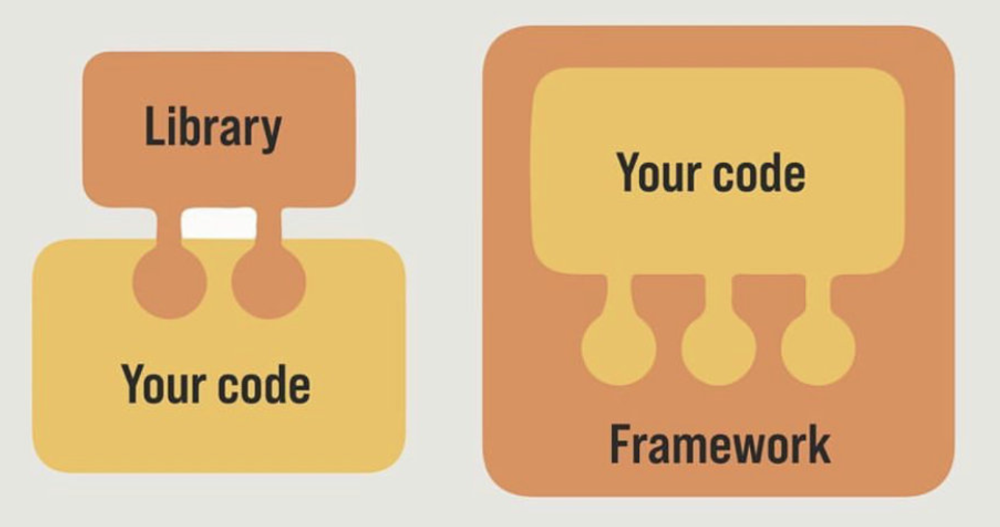
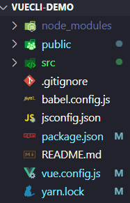
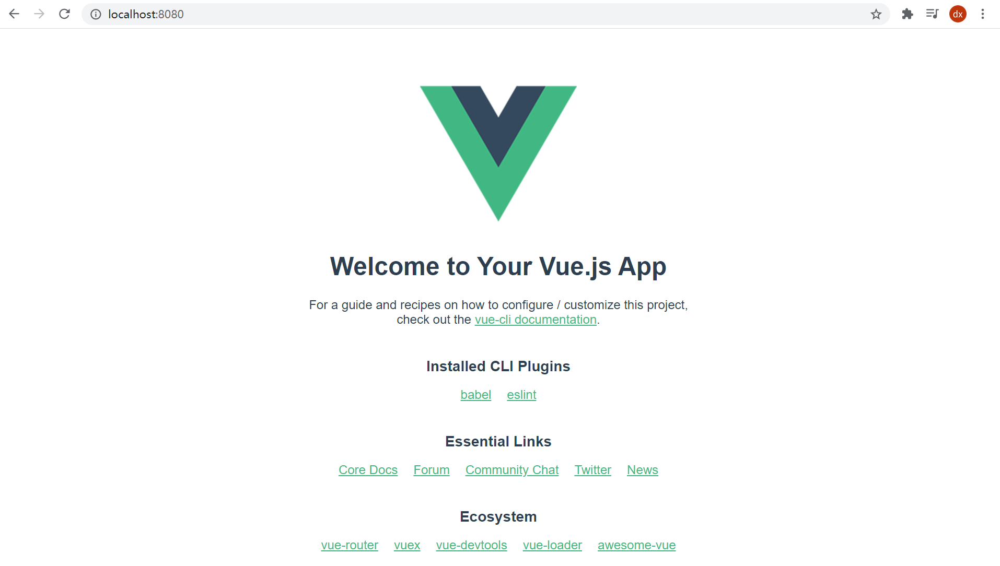
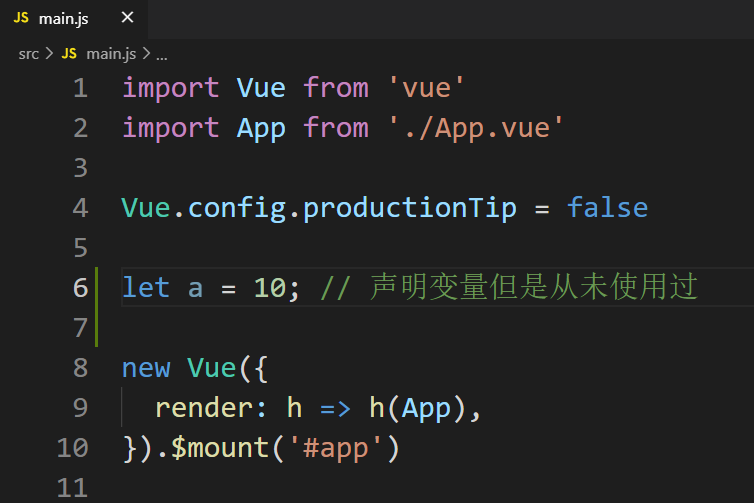

# 1. vue介绍


## 1.1. Vue是什么

Vue（读音view）是**渐进式**javacript**框架**, 一套拥有自己规则的语法

渐进式：逐渐进步，想用什么就用什么，不必全部使用。就是按需，逐渐集成功能

可以帮助我们用更少的时间干更多的活

官方网站：[https://cn.vuejs.org/](https://cn.vuejs.org/)（作者：尤雨溪）

> 使用Vue框架开发让我们的代码更加简洁，并大幅度提高我们的开发效率，并且代码易于维护。虽然vue写起来很爽,，但是一定不要忘记,，vue的底层原理还是原生js

## 1.2. 库和框架的区别

原生js-->jQuery-->Vue 写代码速度越来越快，jQuery封装了很多属性和方法，Vue省去了大量的dom操作

* 库（也叫插件，library）就是工具，可用可不用。封装了很多属性或方法，调用实现功能（比如jquery、axios）

* 框架（framework）：框架约束了你的代码。框架有自己的语法和规则，比库强大的多（比如Vue、React、Angular）



## 1.3. 开发模式

1. 传统开发模式：基于html/css/js文件开发Vue
   
2. **工程化(脚手架)开发方式**：在webpack环境中开发Vue，这是最推荐, 企业常用的方式
   

webpack提供了webpack开发服务器，让我们能够不能重复查看html页面，能自动热更新（存在缓存中），并且能够帮我们自动打包所有的文件到入口文件中，最后统一导入页面唯一的public/index.html中

修改了配置，下载了和webpack相关的（比如less 和less-loader）需要重启服务器，下载第三方包不需要重启

# 2. vue/cli脚手架

cli就是提供了一系列的命令，vue/cli脚手架又叫vue脚手架


> 注意点：git仓库拉下来不会有node_modules的依赖包，需要手动装包`yarn`命令就行，然后yarn serve启动服务器

## 2.1. 什么是vue脚手架

脚手架是为了保证各施工过程顺利进行而搭设的工作平台


以前：webpack自己配置环境繁琐，需要下载各种包，同时自己配置webpack.config.js文件

现在：官方提供**脚手架**, 快速搭建项目基础结构

vue脚手架就是一套固定标准的**文件夹+文件+webpack配置**

好处：开箱即用，webpack零配置，基于它快速搭建项目基本开发环境（帮我们配置好了封装在底层，比如封装了可以打包css文件的配置，封装了自动复制html到dist并且生成js文件插入到html中）

* babel支持
* css, less支持
* webpack开发服务器支持

## 2.2. 脚手架准备-安装@vue/cli

1. 全局安装@vue/cli模块包

```bash
yarn global add @vue/cli
# OR
npm install -g @vue/cli
```

注意: 如果半天没动静(95%都是网速问题), 可以ctrl c 

* 停止重新来
* 换一个网继续重来

2. 查看`Vue`命令版本

```bash
vue -V
```

> 总结: 如果出现版本号就安装成功, 否则失败

vue/cli是一个全局模块。多出一个vue命令

补充：

命令都在bin目录下一个cmd文件 里面存储了一系列命令（命令的大小写都是不固定的，没有规律）

* git --version

* vue -V

* yarn -v

如果出现”vue不是外部或内部命令”需要检查是否配置了环境变量，这些命令都是基于环境变量里的Path来查找的。`yarn global bin`查看yarn安装的全局包bin路径，有可能安装的时候自动在用户变量里面的Path里面配置了

> 老版本的脚手架用的老版本的webpack版本，最新版本的@vue/cli

## 2.3. 脚手架-创建项目并启动服务

用Vue命令, 创建一个脚手架项目, 并启动webpack开发服务器

vue create 项目名, 得到一套标准文件夹+文件+webpack环境

1. 创建项目（git bash不支持  创建脚手架不能使用这个终端，可以使用vscode、powershell、vscode）

   **注意: 项目名不能带大写字母, 中文和特殊符号**

```bash
# vue和create是命令, vuecli-demo是自己的文件夹名
vue create vuecli-demo
```

2. 选择模板

   可以上下箭头选择, 回车确定, 弄错了ctrl+c从第1步来
   

3. 选择包管理器（优先使用yarn）（yarn下不下来，可以用npm 在c盘用户目录中找到.vuec文件修改为npm即可）
   

4. 等待下载脚手架项目, 需要的依赖包
   

5. **终端切换脚手架项目下**,  启动内置的webpack热更新开发服务器（一定别忘了进入内层项目文件）

   ```bash
   cd vue-demo
   
   yarn serve
   #或者 npm run serve
   ```

6. 看到绿色的，说明项目启动成功
      

7. 浏览器中输入上述地址，可以打开html页面
   


> 项目名可以修改，记得把package.json中的文件名修改一下
>
> dev server热更新，不会刷新后台服务器，只会刷新修改的代码，即报错代码不会自动清除

## 2.4. 脚手架-生成初始目录分析


主要文件及其含义

```bash
node_modules      – 第三方依赖包
public/index.html – 浏览器运行的网页/网页入口文件
src/main.js       – webpack打包的入口文件
src/App.vue       – Vue入口页面/又叫根组件
package.json      – 依赖包列表文件和自定义命令
```

## 2..5. 脚手架-代码和结构分析

项目入口和文件的关系，从main.js开始，到index.html结束

流向：App.vue-->main.js-->index/html（实际mian.js会生成一个出口文件bundle.js）


main.js文件

```js
// 导入Vue构造函数
import Vue from 'vue'
// .vue文件都是组件，一个组件也一定是一个.vue文件
// 导入App组件对象
import App from './App.vue'

// 配置代码：项目上线后把警告日志全部关闭（关闭后用户体验更佳）
Vue.config.productionTip = false

// 创建Vue实例对象
new Vue({ //配置对象，创建一个对象里面加一个对象里面是配置对象
  // 将App组件"渲染"
  render: h => h(App),
}).$mount('#app') //渲染到id为app的容器中（html中，js动态引入）.
```

index.html（只是一个空壳）

```html
<div id="app">
    <!-- 放在这里,不是appendChild，而是将整个div替换掉 -->
  </div>
```

注意导入`import App from './App.vue'`必须要加前面的`./`加了才认为是自定义组件或模块，不加会识别成第三方的。后缀`.vue`这里可以省略，es6虽然不加后缀无法识别，但是这里是用了babel降级处理，但是最好不要省略

## 2.6. 脚手架-单Vue文件

Vue推荐使用.vue文件来开发项目

一个vue文件就是一个组件

注意事项

* template里只能有一个**根**标签（这样是以后组件复用时好分清组件）
* vue文件是一个独立的模块，作用域互不影响（不用担心变量重名的情况）
* style配合scoped属性,，保证样式只针对当前template内标签生效
* vue文件配合webpack，把他们打包起来插入到index.html

```vue
<!-- template必须, 只能有一个根标签, 影响渲染到页面的标签结构 -->
<template>
  <div>欢迎使用vue</div>
</template>

<!-- js相关 -->
<script>
export default {
  name: 'App'
}
</script>

<!-- 当前组件的样式, 设置scoped, 可以保证样式只对当前页面有效 -->
<style scoped>
</style>
```

## 2.7. 脚手架-自定义配置（vue.config.js）

脚手架建立的文件  没有webpack.config.js，一些基本功能已经封装集成到底层了，帮我们配置好了之前需要配置的插件，比如自动复制html并生成script标签导入js

> 但是一些包并没有下载   loader比如less和less-loader（和webpack打包相关）装了之后一定要记得重启服务器，css-loader和style-loader脚手架创建项目时已经装了，babel和html-webpack-plugin插件也已经装了
>
> 第三方的包如axios装了后不需要重启服务器，只有和webpack打包相关的或者修改了vue.config.js才需要重启webpack开发服务器

脚手架内置的webpack其他功能配置，如何修改?

Vue脚手架提供了`vue.config.js`文件供我们修改webpack配置，和之前的配置一样，对外暴露一个对象，用CommonJS语法

```js
module.exports={
    devserver:{
    port:3000,//修改端口号为3000
    open:true//服务器开启后自动打开浏览器
}
```

建议不改端口号，用默认的8080，配置和之前的webpack配置一样，可以同时开启多个服务器，一个项目可以开多个（不会报错），端口号在8080的基础上自动加一

## 2.8. 脚手架-eslint了解

eslint代码检查工具  是是用来统一JavaScript代码风格的工具，不包含css、html等，vue脚手架会内置eslint。不符合eslint规范的项目会报错，vscode中eslint插件可以帮助在保存时自动修复代码，并且不符合eslint爆红提示开发者

> eslint内置在脚手架项目里配置好了，项目运行时检查你的代码风格，不符合eslint规范就会报错，当然eslint也可以自定义配置，在`.eslintrc.js`中配置

示例

1. 声明一个变量，但是不要使用



2. 保存后，后台webpack开发服务器热更新，发现，终端和页面都报错了
   这样的错误，证明eslint发现你代码不严谨


解决：

1. 手动解决，以后会讲解如何自动解决
2. 暂时关闭eslint，配置后重启
   

未关闭时报错

```js
Component name "index" should always be multi-word.eslintvue/multi-word-component-names
```

原因：新手在组件命名的时候不够规范，根据官方风格指南，除了根组件（App.vue）外，自定义组件名称应该由多单词组成，防止和html标签冲突

解决：

1. 修改组件名为多个单词，使用大驼峰命名方式或者用“-”连接单词。但是有时候因为个别原因不能改名，此方案不好使
2. 在根目录下找到*vue.config.js*文件
   关闭eslint，`lintOnSave:false`，此方案治标不治本，只是编译时不报错，如果使用vscode+eslint 会在文件头标红提示，强迫症根本忍受不了，并且官方并不建议直接关闭校验，所以推荐使用方案三
3. 在根目录下找到`.eslintrc.js `文件（文件前面有个点），同样如果没有则新建一个
   添加`"vue/multi-word-component-names":"off"`

## 2.9. 脚手架-清除欢迎界面

清除脚手架自带的欢迎界面文件，编写我们自己的代码

* src/App.vue默认有很多内容, 可以全部删除留下template、script和style的框

  ```vue
  <template>
    <div></div>
  </template>
  
  <script>
  export default {
  
  }
  </script>
  
  <style>
  
  </style>
  ```

* src下面的assets 和 components 文件夹下的一切删除掉 (不要logo和HelloWorld页面)
  src这里放置的都是我们自己写的代码

## 2.10. 自定义脚手架

**注意当我们使用vue2的脚手架时，使用的vue-router和vuex的版本也会比最新的低一个版本**

### 2.10.1. 之前的做法

输入`vue create 项目名`来创建脚手架，之前选择的是vue2版本，然后vue-router和vuex需要自己额外下载，并且没有Eslint的配置文件和其他一些额外的配置

### 2.10.2. 自定义脚手架


例如需要使用vuex

1. 情况1：在老项目中使用。 先额外安装vuex包，然后在配置。
2. 情况2：在新项目中使用。 在配置vue-cli中创建项目时，就可以直接选中vuex项，这样就不用做任何配置了（脚手架会自动帮我们完成的）。具体如下图示：

在选择了自定义配置之后，就不需要在另外下载vue-router和vuex了，脚手架会自动帮我们把它们抽离出两个独立的模块，这样就让我们少写了很多基本配置代码


创建之后目录结构如下，App.vue和main.js文件都在src文件夹中


# 3. vue语法-插值表达式

## 3.1. Vue变量

vue文件中定义在script中data函数中的变量称为Vue变量，简称变量

可以是单独变量、数组、对象、函数（不能是匿名函数）

```js
//定义对象里面的方法，ES5出来的（推荐使用）

obj={
	fn(){
		}
	}

//等价于
obj={
    fn:function(){}
}
```

注意这里data是个函数，为es5的简写，等价于`function data(){}`，同时vue变量需要放在`return{}`里面

```vue
<script>
export default {
  data() {
    return {
      // 相当于let msg="我在中国"，只是一个初值，后续可以改变
      msg: "我在中国",
      obj: {
        name: "张三",
        age: "18",
        fn() {
          console.log("我是 fn ");
          return "这是obj的fn";
        },
      },
    };
  },
};
</script>
```

声明的Vue变量：data函数内, return的对象, 对象内的key就是变量名

## 3.2. 补充回顾：什么是表达式？

表达式：有结果的式子 表达式的值可以赋给一个变量，或者直接打印

注意表达式和语句的区别，语句是执行某个功能

```vue
	msg       是
    obj.fn()  是
    fn()      是
    123       是
    a>b       是
    a>b?10:20 是
    1+10      是
    if(){}    不是 流程控制语句 条件语句
    for(){}   不是 流程控制语句 循环语句
    true      是
    const a=[] 声明变量并赋值 赋值语句
```

函数一定要有返回值，不然就是undefined

## 3.2. 插值表达式介绍

插值表达式：将Vue变量渲染到dom标签内，又称为

* 声明式渲染
* 文本插值
* 大胡子语法

语法：{{  表达式 }}

先定义vue变量，后使用插值表达式进行渲染

能写vue变量的地方都能写表达式，三元或者关系等，插值表达式可以用Vue变量（也叫表达式）、表达式、函数调用（需要有返回值）

```vue
<template>
  <div>
    <h1>{{ msg }}</h1>
    <h2>{{ obj.name }}</h2>
    <h3>{{ obj.age > 18 ? '成年' : '未成年' }}</h3>
     <!-- 插值表达式可以使用对象的方法，即执行函数又使用返回值 -->
    <p>{{ obj.fn() }}</p>
  </div>
</template>

<script>
export default {
  data() { // 格式固定, 定义vue数据之处
    return {  // key相当于变量名
      msg: "hello, vue",
      obj: {
        name: "小vue",
        age: 5,
          fn(){
              return '我是fn'
          }
      }
    }
  }
}
</script>
```

# 4. vue基础-MVVM设计模式

## 4.1. 设计模式

设计模式：是一套被反复使用的、多数人知晓的、经过分类编目的、代码设计经验的总结。(代码分层, 架构设计)

设计模式是对代码分层，引入一种架构的概念

vue用到的MVVM设计模式是基础设计模式MVC的优化改良版

经典设计模式传送门：[https://www.runoob.com/design-pattern/mvc-pattern.html](https://www.runoob.com/design-pattern/mvc-pattern.html)

## 4.2. MVVM设计模式

Vue设计模式，转换自己编程思想

以前：都是直接操作dom，既费时又费力

现在：Vue帮助我们减少了大量的dom操作，直接操作数据就可以改变视图

MVVM，一种软件架构模式，决定了写代码的思想和层次（模型，视图，视图模型双向关联的一种设计模式）

* M：   model数据模型          (data里定义)	
* V：    view视图                   （页面标签）
* VM： ViewModel视图模型  (vue.js源码)


MVVM通过`数据双向绑定`让数据自动地双向同步  **不再需要操作DOM**

* V （修改视图） -> M（数据自动同步）
* M（修改数据） -> V （视图自动同步）

经典的就是使用`v-model`指令双向绑定表单元素

**最重要：**

**1. 在vue中，不推荐直接手动操作DOM！！！**  

**2. 在vue中，通过数据驱动视图，不要在想着怎么操作DOM，而是想着如何操作数据！！**(思想转变)

# 5. vue指令

以v-开头的标签属性, 叫指令, 给标签添加额外功能，实质上就是特殊的 html 标签属性

* v-bind
* v-on和修饰符
* v-model和修饰符
* v-html
* v-show和v-if以及v-else
* v-for

指令都是`xxx="yyy"`写在标签里面的


## 5.1. v-bind动态属性

作用：给标签属性设置Vue变量的值

语法：`v-bind:属性名="Vue变量"`

简写（推荐使用）：`:属性名="属性值"`用冒号就行

```vue
<template>
  <div>
    <a v-bind:href="url">点我跳转</a>
    
  </div>
</template>  
<script>
export default {
  data() {
    return {
      url: "http://www.baidu.com",
      imgSrc:
        "https://img1.baidu.com/it/u=1055292963,704550004&fm=253&fmt=auto&app=138&f=JPEG?w=889&h=500",
    };
  },
};
</script>
```

修改了Vue的值，对应标签的属性值也会发生改变

注意用了v-bind后面就必须要使用vue变量什么的，不能再使用静态的


## 5.2. v-on事件绑定

### 5.2.1. v-on基本介绍

作用：给便签绑定事件

语法：`v-on:事件类型/事件名="事件处理函数"`

简写（推荐使用）：`@事件类型/事件名="事件处理函数"`

> 注意标签绑定的就是`xx="xx"`的样式，这里事件处理函数要用引号包起来

事件处理函数需要定义在核心成员metods中，是一个对象

```vue
<template>
  <div>
    <p>你要购买的商品数量为{{ count }}</p>
    <button v-on:click="add"></button>
    <!-- 传统认知：函数名()表示调用该函数 -->
    <!-- 但是只有这一个情况下比较特殊，使用v-on时加小括号表示传参，vue里面的事件传参是一个非常便捷的事,原生js里面的可以传事件对象参数，其他的不支持 -->
  </div>
</template>

<script>
export default {
    
  // data和methods这些关键字都是vue约定的，不能随意更改，属于vue核心成员
  data() {
    return {
      count: 0,
    };
  },
    
  methods: {
    add() {
      // 希望让count+1
      // 在前面加上一个this就可以访问data中定义的变量
      this.count++;
    },
  },
    
};
</script>
```

### 5.2.2. v-on事件传参

v-on绑定事件有一个很特殊的用法，就是事件传参。使用v-on时事件处理函数加小括号表示事件传参

语法：`@事件类型="事件处理函数(参数)"`

相当于事件触发了就执行一个普通的带参数的函数，但是原生js里面的事件函数不带自定义的参数（可以传事件对象等参数，由浏览器帮我们传入实参）

```vue
<template>
  <div>
    <p>你要购买的商品数量为{{ count }}</p>
    <button v-on:click="addNum(5)">点我加5</button>
    <button v-on:click="addNum(10)">点我加10</button>
    <button @click="addNum(15)">点我加15</button>
    <button @click="addNum(20)">点我加20</button>
  </div>
</template>

<script>
export default {
  // data和methods这些关键字都是vue约定的，不能随意更改
  data() {
    return {
      count: 0,
    };
  },
  methods: {
    addNum(num) {
      this.count += num;
    },
  },
};
</script>
```

### 5.2.3. v-on事件对象

获取事件对象

获取方法

1. 无传参 第一个形参就是事件对象
2. 有传参 需要手动传入$event是vue提供的事件对象

上面事件处理函数中写的就是传的普通的参数，而事件对象需要在下面的methods中定义

```vue
<template>
  <div>
    <a @click="toBaidu" href="http://www.baidu.com">去百度</a>
    <a @click="toXiaomi($event, 10)" href="https://xiaomi.com">去小米</a>
  </div>
</template>

<script>
export default {
  data() {
    return {};
  },
  methods: {
    toBaidu(e) {
      console.log("我被点了");
      e.preventDefault();
    },
    // 既然是参数的传递，e和num的位置可以换
    toXiaomi(e, num) {
      console.log(num);
      e.preventDefault();
    },
  },
};
</script>
```

### 5.2.4. v-on事件修饰符

事件修饰符：可以让事件具备更强大的功能，例如阻止事件冒泡

语法：`@事件名/事件类型.事件修饰符="事件处理函数"`

下面是鼠标事件的修饰符

* `.prevent`阻止默认跳转，主要是表单和a标签的默认跳转
* `.stop`阻止事件冒泡（严格说是阻止事件流）

注意事件修饰符可以链式调用，前后顺序不影响`@click.stop.prevent=""`

```vue
<div @click="fatherCilck">
    <a
      @click.prevent="toBaidu"
      href="http://www.baidu.com"
    >去百度</a>
    <a
      @click.stop.prevent="toXiaomi($event, 10)"
      href="https://xiaomi.com"
    >去小米</a>
  </div>
```

这样就不需要在methods中的函数中传入事件对象阻止了

### 5.2.5. v-on按键修饰符

给键盘事件，绑定修饰符

复习一下键盘事件有：

keydown、keyup、focus、blur、input
input事件监听的键盘输入事件，就是表单里面要有东西输入才能正常执行事件，enter和esc监听不到，
keydown是键盘按下，一直按住不送一直多次触发，keyup是键盘松起，松开键盘触发
绑定enter和esc修饰符的最多是keyup，其次是keydown

* `@键盘事件.enter`检测回车按键
  模拟之前的if(e.key=='') xxxx 现在是直接enter才能触发事件-
* `@键盘事件.esc`检测esc按键

```vue
<template>
  <div>
    <input v-on:keydown="doKey" type="text" />
    <!-- keydown 长按就一直触发，没有自动防抖 -->
    <input @keydown.enter="doKeydown" type="text" />
  </div>
</template>

<script>
export default {
  data() {
    return {};
  },

  methods: {
    doKey() {
      console.log("我被按下了");
    },
    doKeydown() {
      console.log("测试键盘按下修饰符");
    },
  },
};
</script>

<style scoped>
</style>
```

>  vue是数据变化视图自动更新，减少操作DOM时间,，提高开发效率

### 5.2.6. .native修饰符

vue3中已经干掉了这个修饰符，vue3中给组件写@click相当于自动加上了.native修饰符

给组件添加点击事件，并不是给根标签添加点击事件

一般给组件绑定点击事件（或者其他的原生事件），默认可以直接绑定触发的，会是下面的逻辑（比如elementui帮助我们封装好的el-button可以直接绑定原生点击事件，在内部一定是下面这样处理了）

```js
// App.vue
<Son @click="xxx"></Son>

// Son
<template>
<div @click="this.$emit('click')">
</div>
</template>
```

如果有的组件没有这样处理（比如elemntui的el-drop组件并没有这样处理），就需要手动在事件名后面加上`.native`修饰符，其作用是将click绑定给子组件的根标签

```js
<el-dropdown-item divided @click.native="logout">
```

结论：给组件绑定原生事件（click、mousedown等）后，如果没有触发就加`.native`

## 5.3. v-model双向绑定

### 5.3.1. v-model介绍

> v-model也可以给组件设置，实现父子传的value值双向绑定，在子组件修改value值，父组件同步修改（不触发单向数据流）。用法同`.sync`

v-model 双向绑定数据，目前只能用于**表单元素**，后期还有别的用法

语法：`v-model="Vue变量"`

双向数据绑定

* Vue变量变化-->视图自动同步
* 视图变化-->变量自动同步

原理是把**Vue数据变量和表单元素的value值绑定在一起**，当用户在表单中输入内容时，会同步给Vue变量

>前置知识：所有表单元素的value属性的值都是为了传给后端
>
>v-model双向绑定是和表单元素的value值绑定的，value值一般用英文，前后台通过接口来约束，不能随便写，看接口参数

重点是**下拉框**和**复（多）选框**

注意点：

* 下拉框绑定在select标签上，值为选中（selected属性为true）的option的value值

* 单选是绑定同一个Vue变量（需要设置同一个name值），值为选中的单选表单的value值
* 复选框绑定的Vue变量
  * 数组：绑定同一个Vue变量，数组里面存的是选中的value值，应用：收集勾选的值
  * 布尔值：每个多选表单各自绑定一个vue变量，值为checked属性的值，应用：收集勾选状态

```vue
<template>
  <div>
    <!-- 一、文本框 -->
    <!-- 绑定的是value值 -->
    用户名：<input v-model="username" type="text" /> 密码：<input
      v-model="password"
      type="text"
    />

    <!-- 二、下拉框 -->
    <!-- 前置知识：所有表单元素的value都是为了传给后端 -->

    <!-- 1.v-model 要写在select标签上
        2.当用户选择对应项时，会将用户选择的option的值设置给Vue变量 -->
    <select v-model="city" name="" id="">
      <option value="wh">武汉</option>
      <option value="bj">北京</option>
      <option value="sh">上海</option>
    </select>

    <!-- 三、多选框 -->
    <!-- 重点：复选框双向绑定
      v-model绑定复选框分两种情况，由Vue变量的类型决定 
      1.数组 绑定的是value值 
        将复选框的value放到数组中
      2.非数组 绑定的是checked值 最终都会住哪成boolean
        变量会收到一个boolean值本质就是checked属性-->

    <!-- 数组 -->
    <input v-model="hobby" type="checkbox" name="" id="" value="smoke" />抽烟
    <input v-model="hobby" type="checkbox" name="" id="" value="drink" />喝酒
    <input v-model="hobby" type="checkbox" name="" id="" value="hair" />烫头

    <!-- 布尔值 -->
    <!-- 需要给各自绑定三个不同的Vue变量，来标识checked的true或false -->
    <input v-model="name1" type="checkbox" name="" id="" value="zhang" />张三
    <input v-model="name2" type="checkbox" name="" id="" value="li" />李四
    <input v-model="name3" type="checkbox" name="" id="" value="wang" />王五

    <br />
    <!-- 四、单选框 -->
    <!-- 单选框要设置相同的name值 -->
    <!-- v-model绑定的是value值 -->
    <input v-model="gender" type="radio" name="gender" value="male" />男
    <input v-model="gender" type="radio" name="gender" value="female" />女
  </div>
</template>
<script>
export default {
  data() {
    return {
      username: "", //初始值一般设置为空字符串
      password: "",
      city: "wh",
      hobby: [],
      name1: false,
      name2: false,
      name3: true,
      gender: "",
    };
  },
};
</script>
```

使用v-model双向绑定了之后，Vue变量的初始值会影响表单的默认状态，因为双向绑定，互相影响

### 5.3.2. v-model修饰符

注意：v-model修饰符是由**视图->传向Vue变量单向生效**

* `.lazy` 双向绑定同步数据的时机默认是input事件（边输入边同步视图和Vue变量的数据），lazy就是改为了change事件 失去焦点并改变后才同步
  input事件 是获取焦点并改变 实时同步触发，change事件 是失去焦点并改变

* ```vue
  <textarea v-model.lazy="intro" name="" id="" cols="30" rows="10"></textarea>
  ```

* `.number`修饰符会将数据转成number类型后赋值给Vue变量，原理;l以parseFloat转成数字类型
  默认无论输入什么都是字符串类型，数字也是字符串
  补充：parseFloat() 函数可解析一个字符串，并返回一个浮点数
  注意：字符串中只返回第一个数字，开头和结尾的空格是允许的，如果字符串的第一个字符不能被转换为数字，那么 parseFloat() 会返回 NaN

  ```vue
  <input v-model.number="salary" type="text" />
  ```

* `.trim`自动调用trim方法（去掉首尾空白）赋值给变量

  ```vue
  <input v-model.trim="motto" type="text" />
  ```

### 5.3.3. v-model双向绑定原理

v-model 双向绑定一个value属性

v-model实际上实现的，可能不同的实现逻辑不同

1. 向标签绑定动态属性`:value=count`
2. 给标签绑定input事件，并把收到的值，赋予给vue变量`count`

v-model有两种使用情况

1. 表单元素中与表单元素的value值双向绑定（最常用！原理不用掌握）

   ```html
   <input v-model="city" type="text">
   
   <!-- 原理 -->
   <input :value="city" type="text" @input="city=$event.target.value">
   ```

2. 组件标签双向绑定父子组件（只能传名字为value的数据，父组件的自定义事件只能用input名字）（面试时原理就讲出这一个就可以了）
   App.vue

   ```vue
   	<h1>v-model的本质</h1>
   	<!-- v-model做了两件事 -->
       <p>count的值：{{count}}</p>
       <AddBtn :value="count" @input="val=>count=val"></AddBtn>
   
   	<!-- 直接使用v-model-->
   	<AddBtn v-model="count"></AddBtn>
   ```

   AddBtn.vue（第三方封装的组件可能帮我们封装好了，我们直接使用v-model即可）

   ```vue
   <button @click="$emit('input',value+10)">点我加10</button>
   <!-- 这里不能使用value++ 这样给value加1，会触发单向数据流 -->
       <p>value的值：{{value}}</p>
   
   props: {
       value: Number,
     },
   ```

### 5.3.4. .sync修饰符

原理和v-model极其类似

实际只做了一件事，就是给子组件添加了一个自定义事件`@update:x=""`

```js
// 父组件
<Panel :a="count" @update:a= "val =>count = val"></Panel>
<Panel :a.sync="count"></Panel>

// 子组件 Panel.vue
props:{
    a:String,
    required:true
}
<buttton @click="this.$emit('update:a',this.a + 1)"></button>
```

> 事件函数名是可以加冒号的，加冒号是因为多个update事件名，防止重复

elemntui子组件已经封装好了，我们使用直接`.aync`就可以了


v-model和.sync的区别

1. .sync可以绑定多个，v-model一个组件只能绑定一个
2. .sync可以用别的变量名进行父子传值，v-model只能绑定value（子组件中props需要使用value接收）
3. .sync父组件的子组件标签绑定的自定义事件名是`update:变量名`，v-model父组件的子组件标签绑定的是自定义input事件

## 5.4. v-html

v-html 的作用: 同 innerHTML，把值当做标签进行解析

另外：v-text同innerText，把值当做普通字符串

**注意：这两个指令会覆盖插值表达式（如果同时写的话）**原因是内部解析插值表达式的解析优先级更高一些，后解析的v-html覆盖前面的

```vue
<template>
  <div>
    <div v-html="str">{{ msg }}</div>
  </div>
</template>

<script>
export default {
  data() {
    return {
      str: '<h1>测试一下</h1>',
      msg: '这是消息',
    }
  },
}
</script>

<style scoped>
</style>
```

## 5.5. v-show和v-if

都是让元素隐藏

`v-show`：原理是设置`display:none`

语法：`v-show="布尔值"`布尔值可以写一个Vue变量（严格说变量也是表达式）或者表达式

`v-if`：原理是从dom树上移除

语法：`v-if="布尔值"`布尔值可以写一个Vue变量（严格说变量也是表达式）或者表达式

区别：

1. v-show是脱标，v-if直接从dom树移除
2. v-show 有较大的初始渲染开销，v-if 有较大的切换渲染开销

应用场景：
 	1. 频繁切换显示隐藏应该用 v-show
 	2. 如果元素可以一直不显示，应该用 v-if

另外v-if可以配v-else使用，v-if显示则v-else不显示，反正是取相反的效果，注意**v-else必须紧贴着v-if书写，中间不能间隔其他标签**

```vue
<template>
  <div>
    <h1 v-show="isShow">我是h1</h1>
    <h2 v-if="isShow">我是h2</h2>
    <!-- v-else注意事项。它必须紧贴着v-if书写，中间不能间隔其他标签 -->
    <!-- v-else和v-if相反的效果 -->
    <h3 v-else>我是h3</h3>

    <!-- 在vue的v-on中，如果只写一行代码，可以不用改绑定事件处理函数，直接放在@click="js代码" -->

    <!-- template中访问Vue变量不用this -->
    <button @click="isShow = !isShow">点我切换显示隐藏</button>
  </div>
</template>

<script>
export default {
  data() {
    return {
      isShow: false,
    };
  },

  methods: {
    change() {},
  },
};
</script>

<style lang="scss" scoped>
</style>
```

> 在vue的v-on中，如果只写一行代码，可以不用改绑定事件处理函数，直接放在`@click="js代码"`，和html标签中原生的`onclick="js代码"`一样，补充原生用法`onclick="go()"`

另外注意：

在template中访问Vue变量不用加this，而在script中访问变量需要加this才能访问data中的Vue变量

> 一定要转变思维。在Vue变量插入到dom标签中后，一定要想着怎么操作数据！数据驱动视图！

## 5.6. v-for循环创建结构

v-for 用来循环创建结构，即用数据循环来生成标签，可以遍历数组 / 对象 / 数字 / 字符串

**列表渲染所在标签结构，按照数据数量，循环生成，比如生成一系列的li或者tr**

效果相当于之前的数组map方法来渲染页面，**v-for指令写在谁身上，就循环创建谁**

语法：`v-for="(循环变量,循环索引) in 目标结构" :key="index"`**小括号里面顺序不能变**

要记得用v-bind绑定后面的动态属性key，index未使用的话可以省略，同时一个变量也可以省略小括号，没有使用到的写了vue中会报错

注意：

* v-for的临时变量名不能用到v-for范围外（块级作用域）
* 同级标签的key值不能重复（key可以取item，index，id）一般取唯一的值，有id取id，无id取索引
* in两边必须要有空格

```vue
<template>
  <div>
    <ul>
      <li v-for="(item, index) in arr1" :key="index">{{ item }}</li>
    </ul>
    <table>
      <thead>
        <tr>
          <th>序号</th>
          <th>姓名</th>
          <th>年龄</th>
          <th>性别</th>
        </tr>
      </thead>
      <tbody>
        <tr v-for="(item, index) in arr2" :key="index">
          <td>{{ index + 1 }}</td>
          <td>{{ item.name }}</td>
          <td>{{ item.age }}</td>
          <td>{{ item.gender }}</td>
        </tr>
      </tbody>
    </table>
  </div>
</template>

<script>
export default {
  data() {
    return {
      arr1: ["张三", "李四", "王五", "赵六"],
      arr2: [
        {
          name: "张三",
          age: 18,
          gender: "男",
        },
        {
          name: "李四",
          age: 28,
          gender: "女",
        },
        {
          name: "王五",
          age: 21,
          gender: "男",
        },
      ],
    };
  },

  methods: {},
};
</script>

<style scoped>
</style>
```

# 今日总结

* [ ] @vue/cli, 安装, 创建脚手架项目, 启动项目等命令
* [ ] 插值表达式
* [ ] 能说出MVVM设计模式
* [ ] v-bind作用
* [ ] v-on作用和事件对象以及修饰符使用
* [ ] v-model的作用以及双向数据绑定解释
* [ ] v-html作用
* [ ] v-if和v-show的区别和本质
* [ ] v-for的作用和使用
* [ ] vue的特点
  * 渐进式
  * 声明式渲染
  * 数据驱动视图 (响应式)
  * 极少的去写DOM操作相关代码
  * 双向绑定
  * 组件系统
  * 不兼容IE8及以下浏览器

# 面试题

### 1. Vue的最大优势是什么?

​	简单易学, 轻量级整个源码js文件不大, 双向数据绑定, 数据驱动视图, 组件化, 数据和视图分离, 

​	Vue负责关联视图和数据, 作者中国人(尤雨溪), 文档都是中文的, 入门教程非常多, 上手简单. 

​	相比传统网页, Vue是单页面可以只刷新某一部分

### 2. Vue和jQuery区别是什么?

​	jQuery应该算是一个插件, 里面封装了各种易用的方法, 方便你使用更少的代码来操作dom标签

​	Vue是一套框架, 有自己的规则和体系与语法, 特别是设计思想MVVM, 让数据和视频关联绑定, 省略了很多DOM操作. 然后指令还给标签注入了更多的功能

### 3. MVVM和MVC区别是什么?

​	MVC: 也是一种设计模式, 组织代码的结构, 是model数据模型, view视图, Controller控制器, 在控制器这层里编写js代码, 来控制数据和视图关联

​	MVVM: 即Model-View-ViewModel的简写。即模型-视图-视图模型, VM是这个设计模式的核心, 连接v和m的桥梁, 内部会监听DOM事件, 监听数据对象变化来影响对方. 我们称之为数据绑定

### 4. Vue常用修饰符有哪些?

.prevent: 提交事件不再重载页面；

.stop: 阻止单击事件冒泡；

.once: 只执行一次这个事件

### 5. Vue2.x兼容IE哪个版本以上

​	不支持ie8及以下，部分兼容ie9 ，完全兼容10以上， 因为Vue的响应式原理是基于es5的Object.defineProperty(),而这个方法不支持ie8及以下。

### 6. 对Vue渐进式的理解

​	渐进式代表的含义是：主张最少, 自底向上, 增量开发, 组件集合, 便于复用

### 7. v-show和v-if的区别

​	v-show和v-if的区别? 分别说明其使用场景?

​	v-show 和v-if都是true的时候显示，false的时候隐藏

​	但是：false的情况下，

​	v-show是采用的display:none   

​	v-if采用惰性加载

​	如果需要频繁切换显示隐藏需要使用v-show

### 8. 说出至少4个Vue指令及作用

​	v-for 根据数组的个数, 循环数组元素的同时还生成所在的标签

​	v-show 显示内容

​	v-if    显示与隐藏  

​	v-else  必须和v-if连用  不能单独使用  否则报错  

​	v-bind  动态绑定  作用： 及时对页面的数据进行更改, 可以简写成:分号

​	v-on  给标签绑定函数，可以缩写为@，例如绑定一个点击函数  函数必须写在methods里面

​	v-text  解析文本

​	v-html   解析html标签

### 9. 为什么避免v-for和v-if在一起使用

​	Vue 处理指令时，v-for 比 v-if 具有更高的优先级, 虽然用起来也没报错好使, 但是性能不高, 如果你有5个元素被v-for循环, v-if也会分别执行5次.