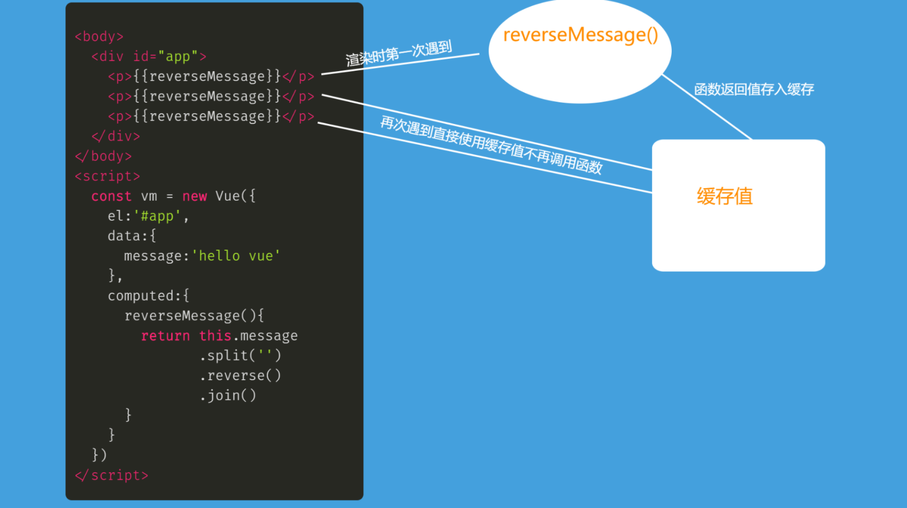

# 1. v-for补充

## 1.1. v-for更新监测

v-for的更新监测，指的数据变化后会不会更新页面

v-for搭配**简单数组**或者**对象数组**来循环生成标签

什么时候会更新：**只有原数组的数据更改了v-for生成的页面才会更新**

不会改变数组的方法，想让页面更新，解决方案：

* 拿返回的新数组，直接替换原数组
* this.$set方法来更新某个值（vue2的版本缺陷）

```vue
<template>
  <div>
    <ul>
      <li v-for="(item, index) in arr" :key="index">{{ item }}</li>
    </ul>

    <button @click="doRev">翻转</button>
    <button @click="doSub">截取</button>
    <button @click="doUpdate">更新值</button>
  </div>
</template>

<script>
export default {
  // 不会更新原数组的方法
  // 遍历方法：forEach、map等
  // concat、join、slice

  // 会更新原数组的方法
  // push()
  // pop()
  // shift()
  // unshift()
  // splice():碾接，砍掉再连接
  // sort()
  // reverse()

  data() {
    return {
      arr: ["老大", "老二", "老三"],
    };
  },

  methods: {
    doRev() {
      this.arr.reverse();
    },
    doSub() {
      // slice方法数组和字符串都适用，推荐
      this.arr = this.arr.slice(1, 2);
    },
    doUpdate() {
      // this.arr[0] = "新来的"; //这样修改了之后数据是变了，但是页面并没有成功渲染，可以看成vue2版本bug
      // 只有 Vue 2 才有这个问题, 到 Vue 3 后就更新了
      // 如果需要这样修改数据, 可以使用 this.$set 方法来修改
      this.$set(this.arr, 0, "新来的");

      // 将来用的不多，因为大多数是数组对象
      // this.arr[0].name='xx' 这样可以监测到变化，即页面会渲染，不会有上面的问题
    },
  },
};
</script>

<style scoped>
</style>
```

> 写vue代码一定是写一步看一下页面，一直要留意控制台右上角的报错提示，不要一直停留在vue调试工具的界面

## 1.2. v-for数据变化页面渲染方式（就地更新和key的作用）

知识点回顾

* 重绘：元素的颜色/透明度发生变化
* 回流/重排：元素的几何（宽高/位置）信息发生变化，页面布局发生变化

注意点

* 回流是把结构重新画出来，重绘就是给你上色
* 回流一定会触发重绘，但重绘不一定会引起回流

### ==1.2.1. 虚拟dom==

dom（文档对象类型）和bom（浏览器对象类型）是浏览器提供给我们的接口，让我们操作页面和窗口

dom出现的目的是为了让程序员能够很方便的操作网页，可以用对象去操作它的属性，不然要操作一整个字符串

* 频繁操作dom性能损失太大，应该尽量减小dom的操作

* 真实dom的属性太多了（有的属性虽然没写在标签上，但是系统仍然默认在节点对象存了属性，只是值为空），操作起来效率太低了
  

真实dom树（浏览器解析引擎把字符串解析成一个dom树）


介绍虚拟dom

> 三大框架的vue react angular 的性能都比原生js写的高出了很多

`.vue`文件中的`template`里写的标签，都是模板，都要被vue处理成**虚拟DOM对象**保存在内存中，再生成真实DOM片段，才会渲染显示到真实DOM页面上

虚拟dom，本质是保存节点信息属性和内容的一个JS对象

1. **内存**中生成一样的虚拟DOM结构

   因为真实的DOM属性好几百个，没办法快速的知道哪个属性改变了

   比如template里标签结构

   ```vue
   <template>
       <div id="box">
           <p class="my_p">123</p>
       </div>
   </template>
   ```

   对应的虚拟DOM结构

   ```js
   const dom = {
       type: 'div',
       attributes: [{id: 'box'}],
       children: {
           type: 'p',
           attributes: [{class: 'my_p'}],
           text: '123'
       }
   }
   ```

2. 以后vue数据更新

   * 生成新的虚拟DOM结构
   * 和旧的虚拟DOM结构对比（运用diff算法）
   * 找不不同，只更新变化的部分(重绘/回流)到页面 - 也叫打补丁


好处

* 虚拟DOM只包含必要的属性（没有真实DOM上百个属性）

* 提高了更新DOM的性能（不用把页面全删除重新渲染）

### 1.2.2. v-for就地更新

那么v-for的数组改变后，页面是如何渲染的？

**v-for 的默认行为会尝试原地修改节点而不是移动它们**，从变化节点往后，会依次变化，这种 DOM对比方式，可以提高性能，但是还不够高（后面用key提高）


原理：**一层层的比较节点有不同的就更新，相同的不变，即相同的就地复用原来的节点**

### ==1.2.3. v-for以key值为基准进行更新==

**就地更新：标签存在就复用此标签更新内容，如果不存在就直接建立一个新的**

好处：可以极大地提高v-for更新的性能

```vue
<li v-for="item in arr" :key="item.id">
        {{ item.name }}
        <input type="text" />
      </li>
```

* 无key：==就地更新==
* 有key，以key为基准，进行新旧虚拟dom树对比
  * key为索引index，与无key效果一样，就地更新
  * key为id（唯一标识），无则创建或删除，更新效率大大提高

key为索引，还是就地更新


**key为id，key值唯一不重复的字符串或数字**（l给每个数据换成对象，准备id，把id的值作为key），发现就地复用的效率更高（红色为修改的内容）


> key用id的技巧：有id用id  无id用索引（至少不会重复） 提高更新的性能

完整对比步骤：

* 新DOM里数据的key存在，去旧的虚拟DOM结构里找到key标记的标签，复用标签

* 新DOM里数据的key存在，去旧的虚拟DOM结构里没有找到key标签的标签，创建

* 旧DOM结构的key，在新的DOM结构里没有了，则移除key所在的标签

html中模拟这种效果

就地更新


key为id


# 2. vue中css样式（动态class和动态style）

用v-bind给标签class设置动态的值，即不写死了，可以用变量（有赋值的话实际也是表达式）或者表达式

## 2.1. 动态class

### 2.1.1. 对象语法

语法：`:class="{类名1：boolean值,类名2：boolean值...}"`

布尔值可以是一个Vue变量，但是左边的类名不能是变量

用布尔值来控制该元素是否应用指定的类名，这里可以是表达式（包括一个变量）

```vue
<template>
  <div>
    <p :class="{ red: true }">我是p</p> 
    <p :class="{ red: flag }">我是p</p>
  </div>
</template>

<script>
export default {
  data() {
    return {
      flag: true,
    }
  },

  methods: {},
}
</script>

<style scoped>
.red {
  color: red;
}
</style>
```

不能下面这样写，引号里面必须是一个对象，**按照Vue的规定来写**，


用了v-bind必须要写动态属性，用上Vue变量


### 2.1.2. 数组语法

可以传入一个数组

```js
// 数组元素不加引号表示变量
<div v-bind:class="[activeClass, errorClass]"></div>

// 数组元素加了引号就直接表示字符串，有类型的
<div v-bind:class="['isActive', 'disabled']"></div>
```

数组中可以使用表达式

```js
<div v-bind:class="[isActive ? activeClass : '', errorClass]"></div>
```

有多个条件 class 时这样写有些繁琐。所以在数组语法中也可以使用对象语法

```js
<div v-bind:class="[{ active: isActive }, errorClass]"></div>
```

## 2.2. 动态style

用v-bind给标签动态设置style的值

语法：`:style="{css属性名1:css属性值1,css属性名2:css属性值2}"`

> 注意这样设置的是行内样式

属性值可以是vue变量，但左边的属性名不能是变量（而且要把css中的名字转换成小驼峰）

* 动态class：一类，可以供多个标签复用

* 动态style：单个标签使用

```vue
<template>
  <div>
    <!-- 可以使用解构赋值 -->
    <p :style="{ backgroundColor }">我是p</p>
  </div>
</template>

<script>
export default {
  data() {
    return {
      backgroundColor: "red",
    };
  },
};
</script>

<style scoped>
</style>
```

对象里面只有一个样式时，且属性名和属性值一致，推荐使用ES6解构赋值


# 3. vue计算属性-computed


背景：

```js
	  let a=20,
      b=10,
      c=a+b

      a=20
      //num的值并不会变化
```

需要重新执行一遍c=a+b才能得到最新的结果

## 3.1. vue计算属性介绍

什么时候用计算属性：一个数据，是依赖另外一些数据的结果计算而来

计算属性定义在vue核心成员computed中，计算属性函数内变量变化，会自动重新计算结果返回

计算属性函数一定要有一个返回值

```vue
<template>
  <div>
    <p>数量：{{ count }}</p>
    <p>单价：{{ price }}</p>
    <!-- 下面这种也可以，太多时就影响性能，要算三遍 -->
    总价格：{{ count * price }}
    总价格：{{ count * price }}
    总价格：{{ count * price }}
    <br />
    <!-- 计算属性，原理上可以完整用函数实现，但是函数每次都需要算一遍 -->
    <!-- 计算属性-带缓存的，多次使用只有在第一次的时候会计算，极大的提高了性能 -->
    总价格：{{ funGetTotal() }} 总价格：{{ funGetTotal() }} 总价格：{{
      funGetTotal()
    }}
    <br />
    总价格：{{ totalPrice }} 总价格：{{ totalPrice }} 总价格：{{ totalPrice }}
  </div>
</template>
<script>
export default {
  data() {
    return {
      // 碰到计算符号乘号自动隐式转换，.number是v-model的修饰符
      count: '12',
      price: '555',
    }
  },
  methods: {
    funGetTotal() {
      console.log('我是函数')
      return this.count * this.price
    },
  },
  computed: {
    totalPrice() {
      // 仍然是属性，只是以函数的形式来使用，template中也只能写计算属性名，不能加小括号，这里比较特殊，记住就好

      // 函数会执行，但写用在template的时候只写一个函数名就是计算属性
      console.log('我是计算属性')
      // 一定要有返回值
      return this.count * this.price //依赖其他数据计算得来的结果
    },
  },
}
</script>
<style scoped>
</style>
```

> 计算属性也是vue数据变量，所以不要和data里重名，用法和data相同

再一次验证了框架怎么要求我们就怎么去写代码，一切以框架的语法来

## 3.2. vue计算属性-缓存特性

看3.1中的代码，依赖别人的结果计算而来，可以使用表达式或者函数来完成同样的效果

**vue计算属性有缓存的特性，多次使用只有在第一次的时候会计算，极大的提高了性能**

计算属性对应函数第一次执行后, 会把return值缓存起来，后来再准备执行这个计算属性函数之前，以下情况：

* 依赖项不变，多次调用都是从缓存取值
* 依赖项值-变化，函数会"自动"重新执行并缓存新的值



控制台中可以看出来，computed中计算属性函数只执行了一次


## 3.3. vue计算属性完整写法

计算属性也是变量，只是依赖其他变量计算而来，当用v-model双向绑定了表单元素即`v-model="计算属性"`时，修改表单元素的值即修改计算属性的值会发生什么？

修改表单元素的值会报错，提示没有setter


加入`set()`和`get()`函数，注意计算属性由函数变成了对象

注意点：

`set()`函数在计算属性被赋值时调用，`get()`就是原本简单写法的函数，return计算属性的值

一般set()函数会接受一个参数为计算属性被修改的值，而get()函数不接受参数

```vue
<template>
  <div>
    姓名：<input v-model="name" type="text" /> 年龄：<input
      v-model.number="age"
      type="text"
    />
  </div>
</template>

<script>
export default {
  data() {
    return {
      name: "",
      womanAge: -3,
      meimei: 18,
    };
  },

  methods: {},
  computed: {
    // 简单写法
    /* age(){
      return 18
    } */

    // 完整写法
    age: {
      set(val) {
        console.log("我是set", val);
        // 当计算属性被赋值时执行
        // 会将赋的值传递过来
        this.meimei = val;
      },
      get() {
        console.log("我是get");
        // get 必须要有返回值
        // get方法就是简单写法的函数
        return this.womanAge + this.meimei;
      },
    },
  },
};
</script>

<style lang="scss" scoped>
</style>
```

流程：先根据依赖项执行`get()`函数，得到计算属性的值，然后修改表单内容（即修改了计算属性的值），`set()`函数执行，改变的值作为函数实参传进来，这里面可以写一些修改依赖项的值的代码，然后依赖项变了，`get()`函数再执行

计算属性中，获取视图的数据需要使用完整写法

v-model  数据影响视图（页面刷新），视图影响数据（输入表单赋值给 计算属性）

## 3.4. 案例-全选复选反选框

```vue
<template>
  <div>
    <span>全选:</span>
    <input v-model="isAll" type="checkbox" />
    <button @click="btn">反选</button>
    <ul>
      <li v-for="(item, index) in arr" :key="index">
        <input v-model="item.c" type="checkbox" />
        <span>{{ item.name }}</span>
      </li>
    </ul>
  </div>
</template>

<script>
export default {
  /* 目标1：小选影响全选
  1.1.渲染数据（小选 v-model 双向绑定 item.c）
  1.2.定义计算属性，通过小选框的状态决定全选框的状态
  1.3.将计算属性设置给全选框 */

  /* 目标2：全选应影响小选
  2.1.改造计算属性为完整写法
  2.2.在set方法中获取到全选框的状态同步给所有小选框 */

  /* 目标3：小选框反选
  3.1.遍历所有对象, 把对象的c属性取相反值赋予回去即可 */
    
  //复选框v-model绑定  非数组，不能给每个（本来就是v-for出来的）绑定一个变量，需要每一个都是不一样的变量，可以放在对象数组中
  data() {
    return {
      arr: [
        {
          name: "猪八戒",
          c: false,
        },
        {
          name: "孙悟空",
          c: false,
        },
        {
          name: "唐僧",
          c: false,
        },
        {
          name: "白龙马",
          c: false,
        },
      ],
    };
  },

  // 给全选框绑定计算属性
  computed: {
    isAll: {
      // 全选影响小选，计算属性赋值的情况
      // 复选框绑定的非数组
      set(val) {
        this.arr.forEach((item) => (item.c = val));
      },

      // 小选影响全选
      get() {
        // every方法，看是否全部满足，所有的都为true 返回true，有一个为false返回false
        // some方法，看是否有一些满足 是否有false的 有则返回true，不符合需求，用every完美契合
        return this.arr.every((item) => item.c);
      },
    },
  },

  methods: {
    btn() {
      // 让数组里对象的c属性取反再赋予回去
      this.arr.forEach((item) => (item.c = !item.c));
    },
  },
};
</script>
```

# 4. vue侦听器-watch


## 4.1. vue侦听器介绍

vue的侦听器可以可以侦听data/computed属性值改变，都是Vue变量

需要在核心成员里面放入一个函数，注意这里的函数名即被侦听的属性名必须是已经定义的Vue变量（data中的和computed中的）

语法：

```js
watch: {
	"被侦听的属性名" (newVal, oldVal){
	
    }
}
```

参数1：newVal 改变后的值

参数2：oldVal 改变前的值

**关键：被侦听的变量值发生变化时，watch中对应的函数就会执行**

侦听某个值变化：使用watch配置项，key是要侦听的data/计算属性名

简单侦听可以直接监听复杂数据里面的属性


## 4.2. vue侦听器-深度侦听

深度侦听多个属性同时变化，只执行一次，多个属性不同时间变化多次，watch触发多次

4.1的写法只能侦听到简单数据类型的变化，需要侦听复杂数据类型（数组，对象，函数），需要用到深度侦听

语法：

```js
watch: {
    "要侦听的属性名": {
        deep: true, // 深度侦听复杂类型内变化
        handler (newVal, oldVal) {
            
        }
    }
}
```
注意点：
* 侦听表单数据元素变化，给v-model加上`.lazy`修饰符最佳，免得输入一个字符就watch一次
```vue
<template>
  <div>
    用户名: <input
      v-model="username"
      type="text"
    /> 年龄:
    <input
      v-model.lazy="obj.age"
      type="text"
    />
  </div>
</template>

<script>
export default {
  data() {
    return {
      username: '',
      obj: {
        age: 18,
      },
    }
  },
  watch: {
    username(newVal, oldVal) {
      console.log('username 发生变化了', newVal, oldVal)
    },
    //下面这种普通监听无法监听对象这种复杂数据类型的变化
    // obj(newVal, oldVal) {
    //   console.log('obj 发生变化了', newVal, oldVal)
    // }
    obj: {
      // 需要侦听复杂数据类型，需要用到深度侦听
      deep: true,
      handler(newVal, oldVal) {
        // Vue 2 的另一个官方 Bug：获取不到旧数据，newVal和oldVal都是newVal为最新的数据
        // 这个 Bug 不影响我们开发
        console.log('obj 发生变化了', newVal.age, oldVal.age)
        // 一般不会用到旧数据，我们只需要新数据，直接拿就行，不需要传参就可以，关键想要触发数据变化这个事件
        console.log(this.obj.age)
      },
    },
  },
}
</script>

<style lang="scss" scoped>
</style>
```

开发中常见写法：

```js
watch: {
   obj: {
        deep: true, 
        handler () {
            console.log(this.obj.age)
        }
    }
}
```

> 关键想要触发数据变化这个事件，在数据发生变化时做一些事情，比如存入localStorage实现数据持久化（刷新页面时，不要从源代码的data中获取数据（可能加了一些值））

> 如果是复杂数据类型，没有加上depp:true，侦听的是地址。加上了深度侦听，复杂属性内部的属性值也会被监听（改变时也会触发watch）。

## 4.3. vue侦听器-深度侦听之立即执行

一般情况下，侦听是修改才会触发watch

`immediate:true`是立即执行handle一声明就执行一次，

* 如果侦听的是简单数据类型（字符串或数字），不加立即执行，第一传递的时候默认是赋值不执行watch中的handler，如果加了立即执行，首次赋值就会监听到，执行一次watch中的handler
* 如果侦听的是复杂数据类型（对象或数组），不加立即执行，第一传递的时候默认是赋值不执行watch中的handler，如果加了立即执行，首次赋值就会监听到，执行一次watch中的handler。有一点不同就是，watch中的值记得前后的是同一个引用，但是log出不同的值，log代码执行的时机不同

`immediate:true`深度和简单监听（需要使用对象的写法）都可以使用

```js
// 简单监听立即执行
watch: {
		carts: {
		   handler(val, oldVal) {
		       console.log('new: %s, old: %s', val, oldVal)
		   },
		   immediate: true
		}
}

```

立即执行handle方法（首次加载，首次算赋值watch不执行、刷新）都会执行（不佳立即执行，只有数据改变会执行）

```js
// 深度侦听立即执行
watch: {
   obj: {
        deep: true, 
        handler () {
            console.log(this.obj.age)
        },
       immediate:true
    }
}
```

> 一般如果需要监听初次赋值的情况（默认为赋值不监听），必须要加上立即执行。（监听props中的值需要使用立即执行来拿到首次传过来的值，立即执行加在watch data中的数据时，handler在刚开始时会触发一次）刚开始watch触发一次，newValue是初始值，oldValue是空（第一次为赋值）
>
> props的传递虽然是异步的，但是会在组件created钩子之前执行

监听data中的数据（比如表单数组对象formData）,不加立即执行（immediate:true），只有后面发请求，重新赋值时触发一次watch。

如果加了，刚开始就会执行一次watch中的handler（此时的值是初始值），后面发请求，重新赋值时再触发一次watch


案例：立即执行，handle中的log打印了两次，打印不同的值

第一次：传递的是父组件中的初始值

第二次：父组件发请求拿到数据后，传递到子组件


# 5. 案例-品牌管理

**目标1：渲染数据**

1. 静态页面

2. 下载bootstrap并将css引入到main.js

3. 使用v-for渲染数据

4. 使用动态class让价格动态变红（price>100）

**目标2：添加数据**

1. 给添加资产按钮绑定点击事件，并阻止默认行为

2. 使用v-model双向绑定名称和价格

3. 判断用户输入的数据是否符合规范（非空判断）

4. 如果符合规范，添加到数组中，数组变化页面更新

5. 清空表单内容，设置name和price变量为空

**目标3：删除数据**

1. 给删除按钮绑定点击事件

2. 传递id给事件处理函数（事件传参）

3. 根据id找索引，根据索引删数据

4. 使用v-show让tfoot动态显示

5. 当数据全部删除后，添加时id会有bug，需要修复，做一个判断

**目标4：时间格式化**

1. 下包

2. 引入moment到App.vue

3. 定义formDate函数并在插值表达式中调用

4. 将传入的时间格式化后返回

**目标5：求总价和均价**

1. 加一个静态的tr并合并单元格

2. 定义两个计算属性，求出总价和均价

3. 插值表达式渲染计算

**目标6：数据缓存**

1. 定义一个侦听器，侦听list变化（深度侦听）

2. 只要发生变化就存入localStorage

3. list初始值从localStorage中取出

注意点：

* 下的包在vue文件中引入则只在这个vue文件作用域里生效，如果引入到main.js文件则在全局生效，css文件（第三方库）  全局样式可以在main.js中引入，js库需要在哪里用就在哪里引入

* 作用域链访问规则 js中 先在当前的函数作用域（局部作用域），找不到再往上级，最后再往全局找

  ES6之后新加入了let 和const让js有了块级作用域  for(){块级}  if(){块级} while(){块级}

* Vue核心成员  data  methods computed watch

* 一般三元可以和|| 可以互换，逻辑中断

* 小数运算 都会出现精度丢失，是由于二进制的运算导致的，使用数字类型的`.toFixed(小数位数)`方法来保留几位小数，四舍五入保留几位小数，少会补零，后为0会是0.00，最好做一个判断（是0的时候就不调用这个方法）
  
* NaN||0的值是0，但是NaN/NaN || 0的结果是NaN

```vue
<template>
  <div id="app">
    <div class="container">
      <!-- 顶部框模块 -->
      <div class="form-group">
        <div class="input-group">
          <h4>品牌管理</h4>
        </div>
      </div>

      <!-- 数据表格 -->
      <table class="table table-bordered table-hover mt-2">
        <thead>
          <tr>
            <th>编号</th>
            <th>资产名称</th>
            <th>价格</th>
            <th>创建时间</th>
            <th>操作</th>
          </tr>
        </thead>
        <tbody>
          <tr
            v-for="item in list"
            :key="item.id"
          >
            <td>{{ item.id }}</td>
            <td>{{ item.name }}</td>

            <!-- 如果价格超过100，就有red这个类 -->
            <td :class="{ red: item.price > 100 }">{{ item.price }}</td>
            <td>{{ formatDate(item.time) }}</td>
            <td><a
                @click.prevent="del(item.id)"
                href="#"
              >删除</a></td>
          </tr>
          <tr>
            <td>统计</td>
            <td colspan="2">总价{{ totalPrice }}</td>
            <td colspan="2">均价{{ avgPrice }}</td>
          </tr>
        </tbody>

        <tfoot v-show="!list.length">
          <tr>
            <td
              colspan="5"
              style="text-align: center"
            >暂无数据</td>
          </tr>
        </tfoot>
      </table>

      <!-- 添加资产 -->
      <form class="form-inline">
        <div class="form-group">
          <div class="input-group">
            <input
              v-model.trim="name"
              type="text"
              class="form-control"
              placeholder="资产名称"
            />
          </div>
        </div>
        &nbsp;&nbsp;&nbsp;&nbsp;
        <div class="form-group">
          <div class="input-group">
            <input
              v-model.trim="price"
              type="text"
              class="form-control"
              placeholder="价格"
            />
          </div>
        </div>
        &nbsp;&nbsp;&nbsp;&nbsp;
        <!-- 阻止表单提交 -->
        <button
          @click.prevent="addAssets"
          class="btn btn-primary"
        >
          添加资产
        </button>
      </form>
    </div>
  </div>
</template>

<script>
// 导入moment包
import moment from 'moment'

export default {
  data() {
    return {
      name: '', // 名称
      price: 0, // 价格
      /* list: [
        { id: 100, name: "外套", price: 199, time: new Date("2010-08-12") },
        { id: 101, name: "裤子", price: 34, time: new Date("2013-09-01") },
        { id: 102, name: "鞋", price: 25.4, time: new Date("2018-11-22") },
        { id: 103, name: "头发", price: 19900, time: new Date("2020-12-12") },
      ], */
      list: JSON.parse(localStorage.getItem('list') || '[]'),
    }
  },
  methods: {
    addAssets() {
      // 非空判断
      if (this.name == '' || this.price == 0)
        return alert('资产名称和资产价格不能为空')

      // 处理默认id
      let id = this.length > 0 ? this.list[this.list.length - 1].id + 1 : 100
      // 添加数据
      this.list.push({
        id,
        name: this.name,
        price: this.price,
        time: new Date(),
      })

      // 清空表单
      this.name = ''
      this.price = ''
    },
    // 删除数据
    del(id) {
      let index = this.list.findIndex((item) => item.id == id)
      // 删除数组数据
      this.list.splice(index, 1)
    },

    // 日期格式化
    formatDate(time) {
      return moment(time).format('YYYY-MM-DD')
    },
  },
  // 计算属性
  computed: {
    totalPrice() {
      return this.list.reduce((sum, item) => sum + item.price, 0)
    },

    // 用this访问隔壁计算属性的值
    avgPrice() {
      return (this.totalPrice / this.list.length || 0).toFixed(2)
    },
  },

  // 侦听器侦听list变化
  watch: {
    list: {
      deep: true,
      // 处理器
      handler() {
        localStorage.setItem('list', JSON.stringify(this.list))
      },
    },
  },
}
</script>

<style >
.red {
  color: red;
}
</style>
```

# 今日总结

* [ ] v-for能监测到哪些数组方法变化, 更新页面
* [ ] key的作用是什么
* [ ] 动态设置class或style
* [ ] vue计算属性作用
* [ ] vue侦听器的作用

# 面试题

### 1. Vue中:key作用, 为什么不能用索引

​	:key是给v-for循环生成标签颁发唯一标识的, 用于性能的优化

​	因为v-for数据项的顺序改变，Vue 也不会移动 DOM 元素来匹配数据项的顺序，而是就地更新每个元素

​	:key如果是索引, 因为索引是连续的, 如果删除其中某一个, 会导致最后一个被删除

​	当我们再删除的时候, :key再根据数据来把新旧的dom对比时, 删除:key不存在的对应的标签(添加也是一样的插入到指定位置, 别的都不会动)

### 2. 数组更新有的时候v-for不渲染

​	因为vue内部只能监测到数组顺序/位置的改变/数量的改变, 但是值被重新赋予监测不到变更, 可以用 Vue.set() / vm.$set()