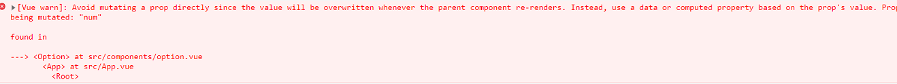

# 1. 组件介绍


## 1.0. 为什么需要组件

需求：现在想要多个收起展开的部分

解决方案：复制多份这个功能模块代码 

缺点：代码重复冗余，不利于维护

问题：收起展开是用的v-show，布尔值绑定的是一个Vue变量，这样折叠展开变化一起变化（解决：不同的部分, 用不同的isShow变量）


这样代码就显得非常的冗余和复杂，所以可以采用vue单文件的组件化开发

遇到重复的标签（一个大盒子包含一个功能，对应template中的根标签）想复用，就封装成组件

组件的好处：各自独立有独立作用域，便于复用，并且代码易于维护

## 1.1. 组件概念

组件是可复用的Vue 实例，封装标签，样式和JS代码

一个vue文件就是一个组件，一个组件就是一个实例，就是一个对象（实例）

组件化：封装的思想，把页面上**可重用的部分**封装为**组件**，从而方便项目的 开发 和 维护

**一个页面，可以拆分成一个个组件，一个组件就是一个整体，每个组件可以有自己独立的 结构 样式 和 行为(html, css和js)**


> 大多数情况下，即使未复用也要划分为组件进行开发，这样开发的代码易于维护

## 1.2. 组件基本使用

每个组件都是一个独立的个体，代码里体现为一个独立的.vue文件

封装的子组件统一放在src的components文件夹下

使用组件（需要在vue文件中嵌入该组件，父组件可以嵌入子组件，子组件1也可以嵌入子组件2）有以下三个步骤

1. 创建组件，封装要复用的标签、样式、js代码`components/Pannel.vue`

2. **导入并注册组件（先导入组件再注册）**

* 全局注册-`main.js`中，需要在在`new Vue()`之上注册，在项目的所有的vue文件中的template中都可以使用

```js
     //1.导入组件对象
     import Panel from './components/Panel.vue'
     // 2.注册组件
     Vue.component('Panel', Panel)//（组件名，组件对象）

	Vue.config.productionTip = false

	 new Vue({
     render: h => h(App),
	 }).$mount('#app')
```

* 局部注册-`某vue文件`中，只能在该vue文件中使用

```js
     //1.导入组件对象
     import Product from './components/MyProduct'
     //2.注册组件
     export default {
         components:{
             //组件名：组件对象
             Product
         }
     }
```
> * import导入时`./`不能省略，省略了识别为第三方模块，后缀可以省略
> * 组件名对应着使用时的标签名

3. 使用组件，用html标签的形式复用
   单双标签都可以或者小写加-形式，运行后，会把这个自定义标签当做组件解析，使用组件里封装的标签替换到这个位置，即把一整个组件中template标签中的根标签及里面的html全部拿过来
```vue
<template>
	<div>
		<组件名></组件名>
		<组件名></组件名>
         <组件名/>
        //单标签后面这个斜杠不能省略，虽然html中可以省略，这里省略了报错
	</div>
</template>
```

> 组件名推荐和组件对象名（组件的文件名）一样，这样在局部注册可以使用解构赋值
>
> 大驼峰 才支持中划线连接 转小写  组件名：`MyPanel `--> `<my-panel></my-panel>`
>
> 大驼峰小驼峰没有绝对的规定，按规范来，一般变量为小驼峰，构造函数为大驼峰，组件名用大驼峰，组件文件名用大驼峰（好看一些）

## 1.3. 组件中style标签的scoped属性

### 1.3.1. 介绍scoped的作用

vue文件中style标签的scoped属性是为了解决多个组件样式名相同，冲突问题

加了scoped表示style标签里面的样式就只对这一个vue文件生效（推荐使用）

没加scoped表示为全部样式，对最终页面的所有标签生效

```vue
<style scoped>
</style>
```

### 1.3.2. scoped的原理

scoped属性让每个vue文件都算出一个hash值，取出前几位，唯一性特别高

* 在style上加入scoped属性，就会在此组件的**所有标签**上加上一个随机生成的`data-v-hash值`开头的属性

* css选择器都被添加 `[data-v-hash值]` 的属性选择器，构成交集选择器来只对改vue文件生效


原理：会自动给所有标签添加`data-v-hash值`属性, 所有css选择器都为带有属性选择器的交集选择器
> 学什么知识之前一定要问个为什么，这个知识点有什么用

## 1.4. 组件分类

### 1.4.1. 动态组件

有的时候需要在两个组件之间来回切换，这个就需要借助vue提供的`component`组件和`is`属性来实现

`component`组件是一种用于渲染动态组件或元素的“元组件”

```js
<!-- currentTab 改变时组件也改变 -->
<component :is="currentTab"></component>
```

is属性后面的值：

* 注册的组件名（加引号）
* 导入的组件对象（也需要加引号）

说明一下`:is="comName"`comName可以直接使组实例对象，comName是`myComponent`这种直接import的（不能注册），comName是`'myComponentName'`是这种组件名称字符串（需要注册）

> 这样直接切换会导致组件被多次重复的创建销毁，可以使用`<keep-alive></keep-alive>`组件来实现组件缓存

:exclamation:虽然同于v-if和v-else但是当动态需要加载的组件有很多时，优势就体现出来了

例子

```js
<!-- 标题 -->
    <nav class="tab">
      <a
        href="javascript:;"
        :class="{ active: comName === 'CallbackBind' }"
        @click="comName = 'CallbackBind'"
      >
        <i class="iconfont icon-bind" />
        <span>已有小兔鲜账号，请绑定手机</span>
      </a>
      <a
        href="javascript:;"
        :class="{ active: comName === 'CallbackPatch' }"
        @click="comName = 'CallbackPatch'"
      >
        <i class="iconfont icon-edit" />
        <span>没有小兔鲜账号，请完善资料</span>
      </a>
    </nav>
    <!-- 切换的组件-内容 -->
    <div class="tab-content">
      <!-- is后面需要跟上组件实例对象或者注册的组件名，不是组件的name -->
      <component :is="comName"></component>
      <!-- 可以使用v-if和v-else实现 -->
      <!-- <CallbackBind v-if="comName === 'CallbackBind'" /> -->
      <!-- <CallbackPatch v-else /> -->

import CallbackBind from './components/callback-bind.vue'
import CallbackPatch from './components/callback-patch.vue'

components: { CallbackBind, CallbackPatch },
```

vue3中支持绑定原生元素

只需要`is` attribute 的值中加上 `vue:` 前缀，这样 Vue 就会把该元素渲染为 Vue 组件

```js
<table>
  <tr is="vue:my-row-component"></tr>
</table>
```

### 1.4.2. 异步组件

不用直接在初始代码执行的时候导入该组件，Vue 只有在这个组件需要被渲染的时候才会触发该工厂函数，且会把结果缓存起来供未来重渲染

类似于路由的懒加载，更加节省性能，提高首页渲染速度

使用`import()`方法来实现

```js
// 全局注册
Vue.component(
  'async-webpack-example',
  // 这个动态导入会返回一个 `Promise` 对象。
  () => import('./my-async-component')
)

// 局部注册
new Vue({
  // ...
  components: {
    'my-component': () => import('./my-async-component')
  }
})
```

### 1.4.3. 函数式组件

无状态无实例的组件

参考：[https://www.jianshu.com/p/0d5906cdaf27](https://www.jianshu.com/p/0d5906cdaf27)

# 2. 组件通信

从一个组件向另外一个组件传值，叫作组件通信，组件通信先暂时关注父传子, 子传父

* 父：需要嵌入其他组件的vue文件
* 子：被引入的文件（嵌入到父组件中）

例如: `App.vue` 是父组件，`MyProduct.vue`是子组件

## 2.1. 父向子传数据-props的使用

子组件需要多次复用，但是复用的时候里面的数据不能都一样，可以由借助`props`由父组件传入数据到子组件

父子贴的很近（不隔代），才会用props传值，如果跨多个组件要传递，可以用Vue2 的EventBus技术，Vue3已经淘汰，现在都用Vuex技术，实现数据共享

### 2.1.1. props基本使用

> 写在前面，porps以后不会用数组的形式，会写成对象形式，来限制传入数据的类型、默认值、是否必传

`props`是vue的又一个核心成员，为`properties`属性的简写，为一个数组，且里面的元素（记住！）

子组件内定义变量（**不要和data和computed中的变量同名**），准备接受数据

```vue
<template>
  <div class="my-product">
    <h3>标题: {{ title }}</h3>
    <p>价格: {{ price }}元</p>
    <p>{{ intro }}</p>
  </div>
</template>

<script>
export default {
  // 1.子组件通过props来定义变量
  // 2.可以随意的使用变量，用法同data。但是这里要用引号引起来，是字符串的形式
  props: ['title', 'price', 'intro', 'index'],
}
```

父组件中通过组件标签的自定义属性来传值到子组件

```vue
<template>
	<div>
        <Product title="周黑鸭" price="45" intro="开业大酬宾"></Product>    
	</div>
</template>
```

**完整使用步骤（结合使用组件三部曲）：**

1. 创建子组件`components/MyProduct.vue`，写好html、css和js代码，在子组件中定义好props准备接受数据
2. 在父组件中引入子组件，并注册好组件
3. 在父组件中使用组件标签，并在标签的自定义属性中定义，将数据传入到子组件

步骤(口诀):

1. 子组件 - props - 变量 (准备接收)，在子组件中使用变量

2. 父组件 - 使用子组件，用自定义属性，给props变量传值

> data、computed、props中都是vue变量，不能重名


### 2.1.2. 配合v-for使用

多次复用组件，使用v-for循环创建结构，把父组件里的数据循环分别传入给子组件内显示

父组件（一般为一个对象数组），每次循环的obj和创建的组件都是新的、独立的

```vue
<template>
  <div>
     <!--3.父组件中使用子组件 传递值到子组件 -->
    <Product
      v-for="(item,index) in list"
      :key="index"
      :title="item.proname"
      :price="item.proprice"
      :intro="item.info"
    ></Product>
  </div>
</template>

<script>
// 1. 创建子组件 (.vue文件)，定义props，并使用其中的变量
// 2. 父组件中引入并注册组件
// 2.1. 引入组件
import Product from './components/MyProduct'
export default {
  data() {
    return {
      list: [
        {
          id: 1,
          proname: '超级好吃的棒棒糖',
          proprice: 18.8,
          info: '开业大酬宾, 全场8折',
        },
        {
          id: 2,
          proname: '超级好吃的大鸡腿',
          proprice: 34.2,
          info: '好吃不腻, 快来买啊',
        },
        {
          id: 3,
          proname: '超级无敌的冰激凌',
          proprice: 14.2,
          info: '炎热的夏天, 来个冰激凌了',
        },
      ],
    }
  },
// 2.2. 注册组件
  components: {
    // Product: Product // key和value变量名同名 - 简写
    Product,
  },

  methods: {
    bargainFn(ind, pri) {
      console.log(ind, pri)
      this.list[ind].proprice -= pri
    },
  },
}
</script>

<style>
</style>
```

子组件

```vue
<template>
  <div class="my-product">
    <h3>标题: {{ title }}</h3>
    <p>价格: {{ price }}元</p>
    <p>{{ intro }}</p>
  </div>
</template>

<script>
export default {
  // 1.子组件通过props来定义变量
  // 2.可以随意的使用变量，用法同data。但是这里要用引号引起来，是字符串的形式
  props: ['title', 'price', 'intro', 'index'],

  },
}
</script>

<style scoped>
.my-product {
  width: 400px;
  padding: 20px;
  border: 2px solid #000;
  border-radius: 5px;
  margin: 10px;
}
</style>
```

### 2.1.3. props的完整写法（约束传入的数据类型）

```js
props: {
    background: String, // 只设置类型，用的挺多，外部插入此变量的值, 必须是字符串类型, 否则报错，也可以不插入
    color: {
      type: String,
      default: '#fff', //color变量默认值(外部不给 我color传值, 使用默认值)
    },
    title: {
      type: String,
      required: true, // 必须传入此变量的值
      // 很明显，required和default是互斥的
    },
  },
```

总结:  

* `props: []` - 只能声明变量和接收, 不能类型校验（开发中不用）

* `props: {}` - 声明变量和校验类型规则 - 外部传入值不对则报错

props传递的是数组或者对象时，设置default需要使用函数返回的形式

```js
props: {
    goods: {
      type: Object,
      default () {
        return {}
      }
    }
  }
```

不需要设置default和required时，建议下面这样写

```js
modelValue: {
      type: Number
    }
```

### 2.1.4. props的大小写

HTML 中的 attribute 名是大小写不敏感的，所以浏览器会把所有大写字符解释为小写字符。

这意味着当你使用 DOM 中的模板时，camelCase (驼峰命名法) 的 prop 名需要使用其等价的 kebab-case (短横线分隔命名) 命名

如果就一个单词父子组件可以直接同名，多个单词就要遵循上述规则

简单地说：子组件中prop名字: postTitle => 父组件上的Dom中使用就(:post-title="value")传值才可以

```js
// 父组件
<Panel panel-title='xxx'></Panel>

// Panel子组件
props:{
    panelTitle:{
        type:String,
        required:true
    }
}
```

## 2.2. 单向数据流

### 2.2.1. 单向数据流介绍

子组件修改了，但是不通知父组件，造成数据不一致，是因为数据单向流动，并且这样会报错


在vue中需要遵循单向数据流原则

1. 父组件的数据发生了改变，子组件会自动跟着变
2. **子组件不能直接修改父组件传递过来的props里面的变量的值，props是只读的**

原因：父组件中同一份数据在子组件用到，其中一个修改了，可以通知父组件同步修改，然后其他应用这份数据的子组件同步修改，这样看起来可以，但是如果有多层子组件，最深层的子组件修改了根组件传过来的数据，还得一层层找上去，数据流向不清晰

vue设计单向数据流就是为了避免数据流向不清晰

数据更新的流向是单向的，只能由父到子，子组件如果修改了props的数据，父组件不会收到更新，并且会报错（注意右上角的报错信息，不要就停在vue 的devtools中）

报错：`Avoid mutating a prop directly since the value will be overwritten whenever the parent component re-renders. Instead, use a data or computed property based on the prop's value`



### ==2.2.2. 单向数据流特性==

单向数据流约束的是props传过来的数据的地址

* 如果是单变量存在栈中（字符串或者数字变量，简单数据类型），修改需要子传父，不然报错
* 如果是复杂数据类型，变量名存在栈中，内容存在堆中（栈中存放是堆中的地址），修改子组件数据（由父组件传过来的），只要不是修改传过来的原数据的地址，比如`this.list=[]`这样就把父组件的原数据给修改了，会报错。不修改原数据的地址的情况下，可以直接在子组件中修改数据

应用：这样一来，在不修改原数据地址的情况下，就省略了大部分的子传父的操作，但是vue官方并不推荐这样做

只有父传子了数据并且为引用类型（`[]`、`{}`、`[{}，{}]`），子需要传父时，可以直接修改。如果父需要子传数据过去（父之前并没有传递数据到子组件），仍然需要子传父


## 2.3. 子向父传数据

vue设计的是数据单向流动，想要从子组件把值传给父组件，需要使用vue提供的一系列流程

前置知识：给v-for子组件绑定index动态属性，并在子组件中用props接受，用来区分哪个子组件

语法：

* 父组件：给组件标签`@自定义事件名="父methods事件处理函数"`
* 子组件：恰当时机（绑定一个事件）触发子事件处理函数中`this.$emit('父组件自定义事件名',传值)`-->父组件执行metods里面的父事件处理函数

示例：子组件点击实现随机砍价-1功能


步骤（这之前已经父传子配置完毕）：

1. 子组件props中加上`index`变量，来区分自己是第几个子组件，同时绑定点击事件，定义事件处理函数，函数中执行`this.$emit('bargain',this.index,1)`

   ```vue
   //Product.vue
   <template>
     <div class="my-product">
       <h3>标题: {{ title }}</h3>
       <p>价格: {{ price }}元</p>
       <p>{{ intro }}</p>
       <button @click="sub">点我砍价</button>
     </div>
   </template>
   
   <script>
   export default {
     // 1.子组件通过props来定义变量
     // 2.可以随意的使用变量，用法同data。但是这里要用引号引起来，是字符串的形式
     props: ['title', 'price', 'intro', 'index'],
   
     // 点击砍价
     methods: {
       sub() {
         // 将随机数传递给父组件
         // 使用this.$emit()触发父组件绑定的自定义事件
         // 参数1：自定义事件名，参数2~参数n 要传递的数据
         // 注意：需要传递index来标识哪一个组件，和要砍的价格
         this.$emit('bargain', this.index, 1)
       },
     },
   }
   </script>
   ```

2. 父组件中在组件标签中自定义事件`@*bargain*="bargainFn"`，并在methods中自定义事件处理函数`bargainFn`，参数为子组件传入的两个值index和price，函数中执行`this.list[index].proprice-=price`

   ```vue
   <template>
     <div>
       <Product
         v-for="(item,index) in list"
         :index="index"
         :key="index"
         :title="item.proname"
         :price="item.proprice"
         :intro="item.info"
         @bargain="bargainFn"
       ></Product>
     </div>
   </template>
   
   <script>
   // 1. 创建组件 (.vue文件)
   // 2. 引入组件
   import Product from './components/MyProduct'
   export default {
     data() {
       return {
         list: [
           {
             id: 1,
             proname: '超级好吃的棒棒糖',
             proprice: 18.8,
             info: '开业大酬宾, 全场8折',
           },
           {
             id: 2,
             proname: '超级好吃的大鸡腿',
             proprice: 34.2,
             info: '好吃不腻, 快来买啊',
           },
           {
             id: 3,
             proname: '超级无敌的冰激凌',
             proprice: 14.2,
             info: '炎热的夏天, 来个冰激凌了',
           },
         ],
       }
     },
     // 3. 注册组件
     components: {
       // Product: Product // key和value变量名同名 - 简写
       Product,
     },
   
     methods: {
       bargainFn(index, price) {
         console.log(index, price)
         this.list[index].proprice -= price
       },
     },
   }
   </script>
   
   <style>
   </style>
   ```

> * 父子之间的传递目前都要通过组件标签来实现
>
> * **子传父的实质就是子组件需要改变数据的过程，交给父组件来做，这样就修改了父组件数据，表面上看起来是子传父**


组件里面的数据由外部决定的，服务器中的，一般放在App.vue中，子组件是用来复用的里面的数据由父组件传入，不是写死的，当然也有写死的数据，存在子组件中的

# 3. todolist案例

拿到项目需求，需要做些什么

* 新建项目-下载需要的包
* 分析, 拆分, 创建组件
* 准备静态标签
* 组件使用到页面

完整效果演示


> **数据一般放在父组件`App.vue`中，中央集权，多个地方需要用到**

## 3.1. 创建工程和组件

* 需求1: 创建新工程
* 需求2: 分组件创建 – 准备标签和样式(从.md笔记复制)

步骤分析

1. 初始化vue脚手架项目，并做好初始配置（修改lintOnSave，删除assets，清空欢迎界面，并重启服务器）
2. 创建3个组件和里面代码（html结构和css样式都复制得来）`TodoHeader.vue`、`TodoMain.vue`、`TodoFooter.vue`并在父组件`App.vue`中引入并注册，最后使用
3. 把style的样式文件准备好
4. `App.vue`的template里面的根标签的类名为`todoapp`


components/TodoHeader.vue - 复制标签和类名

```vue
<template>
  <header class="header">
    <h1>todos</h1>
    <input id="toggle-all" class="toggle-all" type="checkbox" >
    <label for="toggle-all"></label>
    <input
      class="new-todo"
      placeholder="输入任务名称-回车确认"
      autofocus
    />
  </header>
</template>

<script>
export default {
 
}
</script>
```

components/TodoMain.vue - 复制标签和类名

```vue
<template>
  <ul class="todo-list">
    <!-- completed: 完成的类名 -->
    <li class="completed" >
      <div class="view">
        <input class="toggle" type="checkbox" />
        <label>任务名</label>
        <button class="destroy"></button>
      </div>
    </li>
  </ul>
  
</template>

<script>
export default {
}
</script>
```

components/TodoFooter.vue - 复制标签和类名

```vue
<template>
  <footer class="footer">
    <span class="todo-count">剩余<strong>数量值</strong></span>
    <ul class="filters">
      <li>
        <a class="selected" href="javascript:;" >全部</a>
      </li>
      <li>
        <a href="javascript:;">未完成</a>
      </li>
      <li>
        <a href="javascript:;" >已完成</a>
      </li>
    </ul>
    <button class="clear-completed" >清除已完成</button>
  </footer>
</template>

<script>
export default {

}
</script>
```

App.vue中引入和使用

```vue
<template>
  <section class="todoapp">
    <!-- 除了驼峰, 还可以使用-转换链接 -->
    <TodoHeader></TodoHeader>
    <TodoMain></TodoMain>
    <TodoFooter></TodoFooter>
  </section>
</template>

<script>
// 1.0 样式引入
import "./styles/base.css"
import "./styles/index.css"
    
import TodoHeader from "./components/TodoHeader";
import TodoMain from "./components/TodoMain";
import TodoFooter from "./components/TodoFooter";


export default {
  components: {
    TodoHeader,
    TodoMain,
    TodoFooter,
  },
};
</script>
```

**技术点：组件的三部曲：创建组件，引入并注册组件，使用组件**

## 3.2. 渲染待办任务

需求：把待办任务的数据渲染到`TodoMain.vue`组件上

注意点：

* 数据存储在 `App.vue `组件中, 因为该数据很多子组件都需要使用
* 每个复选框都需要有一个v-model绑定的布尔变量来标记选中状态，不可能每个都设置一个变量，放在对象数组的每个对象中

步骤：

1. 在 App.vue 定义数据, 将数据传递给 TodoMain.vue
2. 使用 v-for 循环渲染数据
3. 使用 v-model 双向绑定复选框
4. 使用动态 class 设置样式（文字选中就位划掉状态）

**流程：数据在父组件`App.vue`中，需要父传子，渲染数据在`TodoMain.vue`中完成**

App.vue组件

```js
<TodoMain :list="list"></TodoMain>

export default {
  data() {
    return {
      list: [
        { id: 100, name: "吃饭", isDone: true },
        { id: 201, name: "睡觉", isDone: false },
        { id: 103, name: "打豆豆", isDone: true },
      ],
    };
  }
};
```

TodoMain组件

```js
<template>
  <ul class="todo-list">
    //completed: 完成的类名，绑定动态样式
    <li :class="{completed:item.isDone}" v-for="item in list" :key="item.id">
      <div class="view">
          //双向绑定勾选状态
        <input v-model="item.isDone" class="toggle" type="checkbox"/>
        <label>{{item.name}}</label>
        <button class="destroy"></button>
      </div>
    </li>
  </ul>
</template>
<script>
export default {
//接受床底过来的数据
  props: ['list'],
}
</script>
```

**技术点：父传子、v-for、v-model、动态class**

## 3.3. 添加任务

需求：输入回车能把表单数据添加到待办任务中

注意点：

* 不能用input事件绑定回车按键修饰符，需要使用keyup事件
* 新增数据在子组件TodoMain.vue中，需要子传父技术
* 表单为空记得做非空判断，新增之后记得清除表单

步骤：

1. 在 TodoHeader.vue 中使用 v-model 双向绑定用户输入的任务名
2. 再绑定键盘回车按下事件,，将用户输入的内容传递给 App.vue，事件处理函数为`this.$emit('父组件自定义事件名',数据1，数据2...)`
3. App.vue 收到任务名后将其加入到 list 数组中
4. 细节优化: 添加后清空 taskname，添加前非空校验

**流程：数据在子组件`TodoHeader.vue`中，需要子传父，在父组件中添加数据**

TodoHeader.vue

```js
<template>
  <header class="header">
    <h1>todos</h1>
    <input id="toggle-all" class="toggle-all" type="checkbox">
     //label标签绑定用来做全选小选 
    <label for="toggle-all"></label>
	//恰当时机触发父组件的自定义事件。v-model双向绑定表单value
    <input @keyup.enter="add" v-model.trim="content" class="new-todo"placeholder="输入任务名称-回车确认" autofocus/>
  </header>
</template>
<script>
export default {
  data() {
    return {
      content: '',
    }
  },
  methods: {
    add() {
      // 非空校验
      if (!this.content) return alert('请输入表单数据！')
      // 触发父组件自定义事件
      this.$emit('addTask', content)
      // 清空表单
      this.content = ''
    },
  },
}
</script>
```

App.vue

```js
<TodoHeader @addTask="doAddTask"></TodoHeader>

methods: {
    doAddTask(name) {
      let id =
        this.list.length > 0 ? this.list[this.list.length - 1].id + 1 : 100
      this.list.push({
        id,
        name,
        isDone: false,
      })
    },
  },
```

**技术点：键盘事件修饰符、子传父**

## 3.4. 删除任务

需求：点击待办事项最右边的小×能够删除对应的任务

注意点：

* 巧妙地应用事件传参，用id来标识自己是哪一个任务

步骤：

1. 在 TodoMain.vue 中给删除按钮绑定点击事件, 传入 id
2. 当用户点击删除按钮时将 id 子传父传给 App.vue
3. App.vue 收到数据后根据 id 删除元素
4. 细节优化：数据全部删除完毕后, 添加数据时需要处理 id 的问题

**流程：数据在`TodoMain.vue`子组件中，需要传给父组件`App.vue`，在父组件中删除list中数据**

App.vue - 传入自定义事件等待接收要被删除的序号

```js
<TodoMain @delTask="doDelTask" :list="list"></TodoMain>

methods:{
    doDelTask(id) {
      let ind = this.list.findIndex((item) => item.id == id)
      this.list.splice(ind, 1)
    },
}
```

TodoMain.vue - 把id传回去实现删除(想好数据在哪里, 就在哪里删除)

```js
<button @click="del(item.id)" class="destroy"></button>

methods: {
    del(id) {
      // 触发父组件的自定义事件，并把对象数组的id唯一标识符传过去
      this.$emit('delTask', id)
    },
  },
```

**技术点：事件传参、子传父、数组splice删除元素、修改原数据后v-for数据更新**

## 3.5. 底部数量统计

需求：统计当前的任务数的数量

步骤：

1. 在 App.vue 中将 list 传递给 TodoFooter.vue
2. 将 list.length 渲染到页面

**流程：数据在父组件`App.vue`中，需要传给子组件`TodoFooter.vue`，在子组件中操作数据**

TodoFooter.vue - 接收list统计直接显示

```js
<span class="todo-count">剩余<strong>{{list.length}}</strong></span>
    
export default {
  props: ['list'],
}
```

App.vue - 传入数据

```js
<TodoFooter :list="list"></TodoFooter>
```

**技术点：父传子、数据影响视图（数据更新所有用到该数据的地方都受到影响）**

## 3.6. 数据切换

需求1：点击底部的全部、已完成、未完成进行样式高亮切换

需求2：点击底部的全部、已完成、未完成进行数据筛选显示

注意点：

1. 状态较多（多余true或false两个状态）可以用字符串或者数字来标识，定义一个全局的标记变量，来标识点击的是哪一个。v-for时可以用index来标识，然后给每一个标签设置动态样式来实现点击高亮切换
2. 数据切换不能直接去修改原数据，想到数组的filter方法，这里用函数其实也可以实现，但是考虑到这过滤后的数据要传到`TodoMain.vue`和`TodoFooter.vue`，考虑使用计算属性

> 状态多于两个时，可以用阿拉伯数字或者字符串来标识，注释里面要说清楚标识什么（每个都要用重复的操作，后面重复的都可以用循环来解决，三个li可以用一个li配上v-for）
>
> **三部曲：定义状态，根据状态判断谁应该应用类名，点击切换状态（先静再动）**

需求1步骤：

1. 定义 isAll变量, 可选值是 all / yes / no 三个状态
2. 给所有 a 标签绑定点击事件, 修改当前的状态
3. 使用动态 class 来判断到底哪个 a 标签需要应用 selected 类名

需求2步骤：

1. 在 TodoFooter.vue 中将 isAll 传递给 App.vue
2. App.vue 中存储 isSel 的状态到 data 中，定义一个全局变量 isAll
3. 使用计算属性根据 isAll 的状态筛选出数据放入新数组并返回
4. 将所有以前用到 list 数据的地方改为计算属性 filterList

**流程：数据在`App.vue`和`TodoFooter.vue`中，需要在父组件和子组件中操作数据，子组件的标记变量isAll需要传到父组件中，然后父组件根据标记变量看怎么操作list**

App.vue

```js
<TodoMain @delTask="doDelTask" :list="filterList"></TodoMain>
<TodoFooter @filterTask="doFilterTask" :list="filterList"></TodoFooter>

data(){
    return{
        // 定义一个全局变量来存储子组件Todofooter.vue传过来的isAll值，供计算属性调用，不然不在一个作用域无法使用
        isAll:'all',
    }
}
computed: {
    // 计算属性来筛选数组
    filterList() {
      if (this.isAll == 'yes') {// 已完成
        return this.list.filter((item) => item.isDone)
      } else if (this.isAll == 'no') {// 未完成
        return this.list.filter((item) => !item.isDone)
      } else {//全部，一般写在最后面，这是经验以及习惯
        return this.list
      }
    },
  },
methods:{
    doFilterTask(isAll) {
      // 将传过来isAll数据放在全局变量中存起来，供计算属性调用
      this.isAll = isAll
    },
  }
```

TodoFooter.vue

```js
<li><a @click="isAll='all'" :class="{selected:isAll=='all'}" href="javascript:;">全部</a>
</li>
<li><a @click="isAll='no'" :class="{selected:isAll=='no'}" href="javascript:;">未完成</a>
</li>
<li><a @click="isAll='yes'" :class="{selected:isAll=='yes'}" href="javascript:;">已完成</a>
</li>

data() {
    return {
      // 用一个标记变量，来标记自己点的哪一个
      //all全部（默认）、yes已完成、no未完成
      isAll: 'all',
    }
  },
```

**技术点：动态class、子传父、计算属性、数组filter方法**


## 3.7. 清空已完成

需求：点击最右下角的清除已完成，能够删除已完成的任务

注意点：

* 清除指令需要由子组件告诉父组件，但是不需要传任何数据，直接在事件处理函数里面写上一行代码即可`@*click*="$emit('clearTask')"`用来触发父组件的自定义事件
* 转换思维：清除已完成的就是留下未完成的

步骤：

1. 在 TodoFooter.vue 中给清除已完成按钮绑定点击事件, 触发父组件的自定义事件
2. 父组件中筛选所有未完成的数据, 覆盖设置给 list 即可

**流程：数据在父组件`App.vue`中，需在由子组件`TodoFooter.vue`发出指令触发父组件的自定义事件，在父组件中操作list**

App.vue - 先传入一个自定义事件-因为得接收TodoFooter.vue里的点击事件

```js
<TodoFooter @filterTask="doFilterTask" @clearTask="doClearTask" :list="filterList"></TodoFooter>

methods:{
    doClearTask() {
      // 转换思维：过滤留下未完成的覆盖即可
      this.list = this.list.filter((item) => !item.isDone)
    },
}
```

TodoFooter.vue

```js
<button @click="$emit('clearTask')" class="clear-completed">清除已完成</button>
```

**技术点：子传父、数组filter方法**

## 3.8. 数据缓存

需求：新增/修改勾选状态/删除 后, 马上把数据同步到浏览器本地存储

注意点：

* 用watch侦听原数组list的变化然后存在本地存储中就可以，记得转换为json字符串，取出来同样记得解析json字符串
* 取出来时可能会是空字符串，用`JSON.parse()`方法解析时会出现问题，所以可以用逻辑运算符或一个`[]`，空字符串或者null都不好，最好是和原数据类型相同

步骤：

1. App.vue – 侦听list数组改变 – 深度
2. 覆盖式存入到本地 – 注意本地只能存入JSON字符串
3. 刷新页面 – list应该默认从本地取值 – 要考虑无数据情况空数组

**流程：数据在父组件`App.uve`中，操作父组件中的list即可**

App.vue

```js
data() {
    return {
      /* list: [
        { id: 100, name: '吃饭', isDone: true },
        { id: 201, name: '睡觉', isDone: false },
        { id: 103, name: '打豆豆', isDone: true },
      ], */
      list: JSON.parse(localStorage.getItem('list') || '[]'),
      isAll: 'all',
    }
  },

watch: {
    list: {
      deep: true,
      handler() {
        localStorage.setItem('list', JSON.stringify(this.list))
      },
    },
  },
```

**技术点：watch深度侦听、localStorage本地缓存、JSON序列化和反序列化**

## 3.9. 全选小选功能

需求1：点击全选，小选收到影响

需求2：点击小选，全选框收到影响，小选全部选中，全选才选中

小选和全选都是复选框的类型

注意点：

* 这里虽然涉及到了三方`App.vue`、`TodoHeader.vue`、`TodoMain.vue`的数据交互，但是小选框的勾选状态是由`App.vue`决定，修改小选框的勾选也只是修改了父组件`App.vue`中的数据，所以这里可以简单看成两方`App.vue`和`TodoHeader.vue`之间的组件通信。
* 简单做法是由父组件`App.vue`传list到子组件`TodoHeader.vue`中，子组件`TodoHeader.vue`影响父组件时直接计算属性`set()`方法中修改父组件传来的list数据，因为这里是引用类型对象数组，没有触发单向数据流，原数据list数据也会改变，注意`get()`方法需要有返回值

步骤：

1. TodoHeader.vue – 计算属性 - isAll
2. App.vue – 传入数组list – 在isAll的set里影响小选框
3. isAll的get里统计小选框最后状态, 影响isAll – 影响全选状态
4. 考虑无数据情况空数组 – 全选不应该勾选

App.vue

```js
<TodoHeader @addTask="doAddTask" :list="filterList"></TodoHeader>
```

TodoHeader.vue

```js
// 绑定计算属性
<input v-model="isAll" id="toggle-all" class="toggle-all" type="checkbox">
    
props: ['list'],  
computed: {
    isAll: {
      set(bool) {
        // 全选影响小选
        this.list.forEach((item) => (item.isDone = bool))
      },
      get() {
        // 小选影响全选，注意数组长度为0的时候不应该全选
        return this.list.length != 0 && this.list.every((item) => item.isDone)
      },
    },
  },
```

**技术点：计算属性完整写法、数组every遍历方法**

# 4. 组建通信-EventBus（拓展 vue3中删除）

常用于跨组件通信时使用，两个组件的关系非常的复杂，通过父子组件通讯是非常麻烦的。这时候可以使用通用的组件通讯方案：事件总线（event-bus)（发布/订阅，消息的发布和订阅）


> 注意vue3中删掉了，因为是兄弟间传值，导致数据流向不清晰，一旦出错，不好溯源，另外就是vue3都是按需导入，追求体积最小化，删掉使体积更小，vue3可以使用官方推荐的第三方包[https://v3.cn.vuejs.org/guide/migration/events-api.html#%E6%A0%B9%E7%BB%84%E4%BB%B6%E4%BA%8B%E4%BB%B6](https://v3.cn.vuejs.org/guide/migration/events-api.html#%E6%A0%B9%E7%BB%84%E4%BB%B6%E4%BA%8B%E4%BB%B6)
>
> 注意一定要$bus.$on()存在才能够$bus.$emit

核心语法

EventBus/index.js- 定义事件总线bus对象

```js
import Vue from 'vue'
// 导出空白vue对象
export default new Vue()

// 常用的是往Vue.prototype上挂载，然后this.$bus.$on()  this.$bus.$emit()
Vue.prototype.$bus = new Vue()
```

List.vue注册事件 - 等待接收要砍价的值 (==直接复制==) - 准备兄弟页面

```vue
<template>
  <ul class="my-product">
      <li v-for="(item, index) in arr" :key="index">
          <span>{{ item.proname }}</span>
          <span>{{ item.proprice }}</span>
      </li>
  </ul>
</template>

<script>
export default {
  props: ['arr'],
}
</script>

<style>
.my-product {
  width: 400px;
  padding: 20px;
  border: 2px solid #000;
  border-radius: 5px;
  margin: 10px;
}
</style>
```

components/MyProduct_sub.vue(==主要写触发eventBus身上事件==)

```vue
<template>
  <div class="my-product">
    <h3>标题: {{ title }}</h3>
    <p>价格: {{ price }}元</p>
    <p>{{ intro }}</p>
    <button @click="subFn">宝刀-砍1元</button>
  </div>
</template>

<script>
import eventBus from '../EventBus'
export default {
  props: ['index', 'title', 'price', 'intro'],
  methods: {
    subFn(){
      this.$emit('subprice', this.index, 1) // 子向父
      eventBus.$emit("send", this.index, 1) // 跨组件
    }
  }
}
</script>

<style>
.my-product {
  width: 400px;
  padding: 20px;
  border: 2px solid #000;
  border-radius: 5px;
  margin: 10px;
}
</style>
```

List.vue正确代码(==EventBus接收方==)

```vue
<template>
  <ul class="my-product">
    <li v-for="(item, index) in arr" :key="index">
      <span>{{ item.proname }}</span>
      <span>{{ item.proprice }}</span>
    </li>
  </ul>
</template>

<script>
// 目标: 跨组件传值
// 1. 引入空白vue对象(EventBus)
// 2. 接收方 - $on监听事件
import eventBus from "../EventBus";
export default {
  props: ["arr"],
  // 3. 组件创建完毕, 监听send事件
  created() {
    eventBus.$on("send", (index, price) => {
      this.arr[index].proprice > 1 &&
        (this.arr[index].proprice = (this.arr[index].proprice - price).toFixed(2));
    });
  },
};
</script>

<style>
.my-product {
  width: 400px;
  padding: 20px;
  border: 2px solid #000;
  border-radius: 5px;
  margin: 10px;
}
</style>
```

> 总结: 空的Vue对象, 只负责$on注册事件, $emit触发事件, 一定要确保$on先执行

# 今日总结

* [ ] 组件概念和作用以及创建和使用方式

* [ ] 掌握组件通信包括父向子, 子向父传值

* [ ] 跟随老师的视频完成todo案例的全部功能

# 面试题

### 1. 请说下封装 vue 组件的过程

​    首先，组件可以提升整个项目的开发效率。能够把页面抽象成多个相对独立的模块，解决了我们传统项目开发：效率低、难维护、复用性等问题。

* 分析需求：确定业务需求，把页面中可以复用的结构，样式以及功能，单独抽离成一个组件，实现复用
* 具体步骤：Vue.component 或者在new Vue配置项components中, 定义组件名, 可以在props中接受给组件传的参数和值，子组件修改好数据后，想把数据传递给父组件。可以采用$emit方法。

### 2. Vue组件如何进行传值的

父向子 -> props定义变量 -> 父在使用组件用属性给props变量传值

子向父 -> $emit触发父的事件 -> 父在使用组件用@自定义事件名=父的方法 (子把值带出来)

### 3. Vue 组件 data 为什么必须是函数

每个组件都是 Vue 的实例, 为了独立作用域, 不让变量污染别人的变量

### 4. 讲一下组件的命名规范

​    给组件命名有两种方式(在Vue.Component/components时)，一种是使用链式命名"my-component"，一种是使用大驼峰命名"MyComponent"，

​	因为要遵循W3C规范中的自定义组件名 (字母全小写且必须包含一个连字符)，避免和当前以及未来的 HTML 元素相冲突


