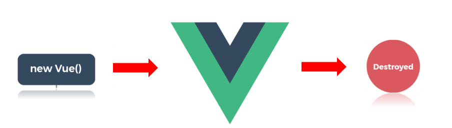
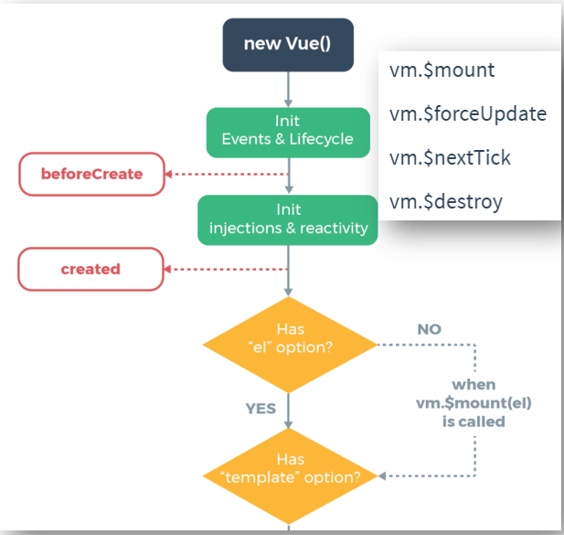
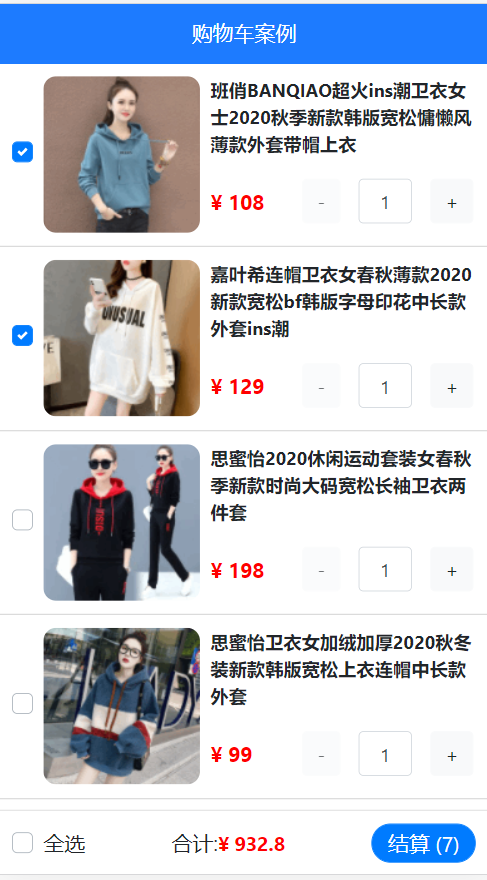

# 1. 生命周期


## 1.1. 什么是Vue生命周期

周期：事物在运动、变化过程中，某些特征多次重复出现，其第一次开始至结束的这段时间就称为“周期"

人的生命周期：一个人从出生到死去的这一过程


Vue官网生命周期传送门：[https://cn.vuejs.org/v2/guide/instance.html](https://cn.vuejs.org/v2/guide/instance.html)

**Vue生命周期：一个组件从创建到销毁的整个过程就是生命周期**



## 1.2. Vue钩子函数

Vue钩子函数（Hooks）是**Vue** 框架内置函数，随着组件的生命周期阶段，自动执行（很多框架或者开发语言都有自己的钩子函数）

### 1.2.1. 前置知识

* 在计算机编程中，钩子函数主要用于通过拦截在软件组件之间传递的函数调用或消息或事件来改变或增强操作系统，应用程序或其他软件组件的行为。

* 处理这种截获的函数调用，事件或消息的代码称为钩子，它的本质就是用以处理系统消息的程序，通过系统调用，把它挂入系统。

* 钩子函数可用于许多目的，包括调试和扩展功能，常见的前端有Vue钩子、React钩子

这个周期是系统自动执行的，那么这个周期怎样让人为干预他的进程


钩子函数（Hooks）特点

1. 是个函数，函数名为框架或者开发语言规定，在系统消息触发时被系统调用
2. 函数名不是由用户自己定义，但是函数声明需要自己写
3. 使用时直接编写函数体就可以，到了特定的阶段，对应的钩子函数会自动执行

### 1.2.2. Vue钩子函数介绍

如何知道Vue生命周期到达哪个阶段了

作用：在生命周期的特定时间点，执行特定的操作

生命周期函数也叫钩子函数

应用场景：

* 组件创建完毕后，可以在created钩子汇总发起ajax请求，从而获取后台数据（有可能请求参数需要data中的数据）
* mounted钩子中才可以获取到真实dom对象（后面的也可以拿到，但一般就在这拿）

**注意点：钩子函数和核心成员同级，不要写在methods中了** 

| **阶段** | **方法名**    | **方法名** |
| -------- | ------------- | ---------- |
| 初始化   | beforeCreate  | created    |
| 挂载     | beforeMount   | mounted    |
| 更新     | beforeUpdate  | updated    |
| 销毁     | beforeDestroy | destroyed  |

下图是Vue官网提供的实例对象的生命周期图


> 钩子函数中的this都是指向的当前的Vue实例对象，但是钩子函数并不是存在Vue构造函数或者Vue实例对象中。这里是Vue底层做了处理，将钩子函数中的this指向了当前组件对象（this指向是可以改变的）。感兴趣可以去查看Vue2源码中关于组件构建的介绍。

## 1.3. 初始化阶段

每个组件都会通过 new Vue()出来  可复用的vue实例对象




含义讲解:

1. `new Vue()` – Vue实例化(组件也是一个小的Vue实例)

2. `Init Events & Lifecycle` – 初始化事件和生命周期函数（钩子函数）

3. `beforeCreate` – 生命周期钩子函数被执行

4. `Init injections&reactivity` – Vue内部添加data和methods等（注入&响应式）
   注入：把核心成员data、computed、methods中的属性挂载到当前组件对象中（新增属性可以通过`this.属性名`访问）
   响应式：一旦变量数据发生变化，所有用到的都会变化

5. `created` – 生命周期钩子函数被执行, 组件实例对象被创建，组件keep-alive缓存后不会执行这个函数及以后的钩子
   钩子函数名字不能写错，能访问data最早的钩子是created（最常见的钩子），并不能获取真实dom

6. 接下来是编译模板阶段 –开始分析

7. `Has el option?` – 是否有el选项 – 检查要挂到哪里
   有el  ===无el+$mount()被调用   option就是配置对象（new Vue()小括号中的对象）

​	没有. 调用`$mount()`方法

​	有, 继续检查`template`选项

Vue实例从创建到编译模板（还未编译）执行了beforeCreate / created两个钩子

components/Life.vue - 创建一个文件

```js
<script>
export default {
    data(){
        return {
            msg: "hello, Vue"
        }
    },
    // 一. 初始化
    // new Vue()以后, vue内部给实例对象添加了一些属性和方法, data和methods初始化"之前"
    beforeCreate(){
        console.log("beforeCreate -- 执行");
        console.log(this.msg); // undefined
    },
    // data和methods初始化以后
    // 场景: 网络请求, 注册全局事件
    created(){
        console.log("created -- 执行");
        console.log(this.msg); // hello, Vue

        this.timer = setInterval(() => {
            console.log("哈哈哈");
        }, 1000)
    }
}
</script>
```

App.vue - 引入使用

```js
<template>
  <div>
    <h1>1. 生命周期</h1>
 	<Life></Life>
  </div>
</template>

<script>
import Life from './components/Life'
export default {
  components: {
    Life
  }
}
</script>
```

> created钩子中可以通过 $nextTick 来访问 DOM

## 1.4. 挂载阶段


### 1.4.1. 编译器介绍

编译器：把代码翻译成机器能读懂的机器码

前端常提起的编译模板：将虚拟dom转成真实dom能识别的字符串，complie template

### 1.4.2. 脚手架中main.js文件解析

```js
import Vue from 'vue'
import App from './App.vue'

Vue.config.productionTip = false

// 有没有el options 有没有el选项
new Vue({
  // 根据App.vue文件中的template模板创建虚拟dom
  render: h => h(App),
  /*  render(h){
     return h(App)
   } */
    
  /* render: function (h) {
     return h(App)
  } */
    
  /* render: function (createElement) {
    // 根据App.vue文件中的template模板创建虚拟dom
    return createElement(App)
  } */

  // el:'#app'
}).$mount('#app') //挂载：将制定的组件挂载到#app处

// el选项完全等同于 .$mount()调用

// 区别:$mount()调用更加地灵活，可以在挂载组件之前干点别的

/* let vm = new Vue({
  render: h => h(App)
})

console.log('在挂载之前干点别的')

vm.$mount('#app') */
```

`el:'<p></p>'`el后面可以写标签但是，不这样写，template写在vue文件中，只根据vue文件中的template创建虚拟dom

### 1.4.3. 挂载阶段介绍

含义讲解

1. template选项检查

   有 - 编译App中对应的template到render函数渲染
   无 – 编译el选项对应标签作为template(要渲染的模板)

拓展：因为Vue脚手架环境使用webpack+vue-template-compiler包, 进行模板编译转换后运行, 所以vue.js里只有运行时的代码, 所以这么写在脚手架环境会报错，需要借助render函数
```js
new Vue({
  template: `<div>我是div啊</div>`
}).$mount('#app')
```

2. 虚拟DOM挂载成真实DOM之前
3. `beforeMount` – 生命周期钩子函数被执行
4. `Create …` – 把虚拟DOM和渲染的数据一并挂到真实DOM上
5. 真实DOM挂载完毕
6. `mounted` – 生命周期钩子函数被执行

不可能不完全不操作真实dom，只能在mounted钩子（或者以后的钩子）中使用。但是能不操作就不要操作。比如echarts中创建echarts实例就需要写在mounted钩子中

项目跑起来，只需要执行到钩子函数mounted就行，后面就是一些更新阶段  vdom-virtual dom 虚拟dom

components/Life.vue - 创建一个文件

```js
<template>
  <div>
      <p>学习生命周期 - 看控制台打印</p>
      <p id="myP">{{ msg }}</p>
  </div>
</template>

<script>
export default {
    // ...省略其他代码
    
    // 二. 挂载
    // 真实DOM挂载之前
    // 场景: 预处理data, 不会触发updated钩子函数
    beforeMount(){
        console.log("beforeMount -- 执行");
        console.log(document.getElementById("myP")); // null

        this.msg = "重新值"
    },
    // 真实DOM挂载以后
    // 场景: 挂载后真实DOM
    mounted(){
        console.log("mounted -- 执行");
        console.log(document.getElementById("myP")); // p
    }
}
</script>
```

Vue实例从创建到显示到页面上执行了beforeCreate、created、beforeMount和mounted四个钩子函数

## 1.5. 更新阶段

beforeUpdate和updated这两个钩子开发中用的很少


含义讲解:

1. 当data里数据改变, 更新DOM之前

2. `beforeUpdate` – 生命周期钩子函数被执行（这个时候可以获取到最新的数据，但是不能获取到最新的真实dom）

3. `Virtual DOM……` – **虚拟DOM重新渲染, 打补丁到真实DOM**（注意这个阶段已经更新真实dom了即页面已经更新了）

4. `updated` – 生命周期钩子函数被执行

5. 当有data数据改变 – 重复这个循环

> 前提: data数据改变才执行这两个钩子

components/Life.vue - 创建一个文件（准备ul+li循环, 按钮添加元素, 触发data改变->导致更新周期开始）
```js
<template>
  <div>
      <p>学习生命周期 - 看控制台打印</p>
      <p id="myP">{{ msg }}</p>
      <ul id="myUL">
          <li v-for="(val, index) in arr" :key="index">
              {{ val }}
          </li>
      </ul>
      <button @click="arr.push(1000)">点击末尾加值</button>
  </div>
</template>

<script>
export default {
    data(){
        return {
            msg: "hello, Vue",
            arr: [5, 8, 2, 1]
        }
    },
    // ...省略其他代码

    // 三. 更新
    // 前提: data数据改变才执行
    // 更新之前
    beforeUpdate(){
        console.log("beforeUpdate -- 执行");
        console.log(document.querySelectorAll("#myUL>li")[4]); // undefined
    },
    // 更新之后
    // 场景: 获取更新后的真实DOM
    updated(){
        console.log("updated -- 执行");
        console.log(document.querySelectorAll("#myUL>li")[4]); // li
    }
}
</script>
```

## 1.6. 销毁阶段

destroy应用的非常少，全局定时器的清除，全局事件的清除（定义在created钩子中）不可能都执行完了定时器，记得清除，有利于提高性能


组件标签上写v-if可以创建或者销毁vue实例对象  v-if设置为false，vm.$destroy()函数被调用，teardown 拆毁

含义讲解:

1. 当`$destroy()`被调用 – 比如组件DOM被移除(例v-if)

2. `beforeDestroy` – 生命周期钩子函数被执行

3. 拆卸数据监视器、子组件和事件侦听器

4. 实例销毁后, 最后触发一个钩子函数

5. `destroyed` – 生命周期钩子函数被执行

components/Life.vue - 准备生命周期方法(Life组件即将要被删除)

```js
<script>
export default {
    // ...省略其他代码
    
    // 四. 销毁
    // 前提: v-if="false" 销毁Vue实例
    // 场景: 移除全局事件, 移除当前组件, 计时器, 定时器, eventBus移除事件$off方法
    beforeDestroy(){
        // console.log('beforeDestroy -- 执行');
        clearInterval(this.timer)
    },
    destroyed(){
        // console.log("destroyed -- 执行");
    }
}
</script>
```

主要: App.vue - 点击按钮让Life组件从DOM上移除 -> 导致Life组件进入销毁阶段

```js
<Life v-if="show"></Life>
<button @click="show = false">销毁组件</button>

<script>
    data(){
        return {
            show: true
        }
    },
</script>
```

一般在beforeDestroy/destroyed里手动消除计时器/定时器/全局事件

## 1.7. Vue 的父组件和子组件生命周期钩子函数执行顺序


父子组件的生命周期的执行顺序


* 加载渲染过程：

  父 beforeCreate -> 父 created -> 父 beforeMount -> 子 beforeCreate -> 子 created -> 子 beforeMount -> 子 mounted -> 父 mounted

* 子组件更新过程：
  父 beforeUpdate -> 子 beforeUpdate -> 子 updated -> 父 updated

* 父组件更新过程：
  父 beforeUpdate -> 父 updated

* 销毁过程：
  父 beforeDestroy -> 子 beforeDestroy -> 子 destroyed -> 父 destroyed

总结：

1. 子的生命周期都会被先结束，父的才结束。先由父到子，再从子到父
2. 生命周期遵从“从外到内，再从内到外，mixins先于组件”的原则

从创建到挂载，是从外到内，再从内到外，且mixins的钩子函数总是在当前组件之前执行

# 2. axios

axios官方文档：[http://www.axios-js.com](http://www.axios-js.com)

axios看云中文文档：[https://www.kancloud.cn/yunye/axios](https://www.kancloud.cn/yunye/axios)

## 2.1. axios简单介绍

1. ajax是一种前端异步请求后端的技术
2. ajax的原理是浏览器window接口的XMLHttpRequest
3. axios是基于原生ajax+Promise技术封装通用于前后端的请求库

特点

* 支持客户端发送Ajax请求
* 支持服务端Node.js发送请求
* 支持Promise相关用法
* 支持请求和响应的拦截器功能
* 自动转换JSON数据
* axios 底层还是原生js实现, 内部通过Promise封装的

> axios.get、axios.post 用的多一些，去复习前面ajax（前端异步请求后端）的知识

## 2.2. axios在Vue组件中使用

### 2.2.1. 在局部单Vue组件中使用

components/UseAxios.vue

```js
<template>
  <div>
    <p>1. 获取所有图书信息</p>
    <button @click="getAllFn">点击-查看控制台</button>
  </div>
</template>

<script>
// 目标1: 获取所有图书信息
// 1. 下载axios yarn add axios
// 2. 引入axios
// 3. 发起axios请求
import axios from "axios";
export default {
  methods: {
    getAllFn() {
      axios({
        url: "http://123.57.109.30:3006/api/getbooks",
        method: "GET", // 默认就是GET方式请求, 可以省略不写
      }).then((res) => {
        console.log(res);
      });
      // axios()-原地得到Promise对象
    },
  }
};
</script>
```

axios的get请求中params配置项会把对象中的成员按照xxx=xxx自动拼接到到url?后面

### 2.2.2. 在main.js中全局配置

main.js

```js
// 1.配置axios基地址
axios.defaults.baseURL = "http://123.57.109.30:3006"

// 2.下包 yarn add axios
// 3.导包
import axios from 'axios'

// 注意这里各个Vue组件之间的独立性，需要把axios方法管再到构造函数Vue的原型对象上
// 加$符号是为了和自己定义的方法区分开，其他组件可以直接this.$axios()调用axios库
Vue.prototype.$axios=axios

//以下是测试代码
axios({
    xxx
})//小括号中的为配置对象
new Vue({
    render:h=>h(App)
})//小括号中的为配置对象
```

# 3. Vue和VueComponent的关系

**组件是可复用的Vue实例**，且带有一个名字。也是Vue实例，其实vue实例和vue组件本质都是一个组件，声明周期是对于组件来说，也可以说是对于Vue实例来说

```js
// 组件可以像Vue实例一样配置
Vue.component("counter",{    //1.组件名为"conter"; 2.data 写函数; 3.template 写组件的内容（元素和触发的事件）
    // data必须是一个返回值的函数
	data:function(){
			return {count:0}
			},
 
//template 是模板的意思，在 html 里面是一个可以同时控制多个子元素的父元素。在这里定义了组件的内容
	template:'<button v-on:click="count++">点击计算点击次数：{{count}}次</button>'
})
```

Vue.component和Vue.extend，都用来创建组件，Vue.component实际上还是调用了Vue.extend

区别：Vue.extend()需要执行new运算创建组件，而Vue.component则是在$mount阶段自动执行new运算的

## 3.1. 区别

* VueComponent实例对象，简称：vc（ 或：组件实例对象 ）
* Vue实例对象，简称：vm（ViewModel）

vm上有的功能，vc几乎都有，除了el定义所属容器，接受相同的选项，data、computed、watch、methods、以及生命周期钩子函数，el是vm实例特有的选项，vue实例会比vue组件多出el和router、store属性

**在vm中，data可以用函数式和对象式，但是在vc中data只能用函数式？**

1. 组件被复用时，会创建多个实例，而每个实例，data如果是对象，就相当于赋值的操作，指向同一个地址空间，造成数据污染
2. 如果是return一个对象，`{}`相当于new了一个新的对象，这样保证组件被复用时，数据是独立的，互不影响

vm中可以是对象，是因为Vue实例只有一个，可以数据共享

通过`console.dir(document.querySelector('.one').__vue__)`App.vue根标签的`_vue_`就是Vue根实例


## 3.2. 联系

整个Vue应用只能有一个根实例，就是Vue实例，而可以有多个组件，**VueComponent组件实例就是可复用的Vue实例**

VueComponent的实例对象，以后简称vc（也可称之为：组件实例对象）。Vue的实例对象，以后简称vm。vm管理着vc

一个vm（vue实例对象）管理一个app然后app管理众多子组件

组件的本质就是指VueComponent()，一个构造函数，创建一个组件，底层Vue在解析模板时，用Vue.extend()帮忙创建（返回）一个构造函数VueComponent()，

每个组件创建的都是全新的VueComponent()（不是同一个构造函数），得到的是一个全新的对象Sub 

Vue每次解析模板时（需要先注册组件， div容器使用的组件标签`<person></person>` ），Vue就会去帮忙创建对应的组件（先底层调用Vue.extend()创建一个全新的构造函数），然后再调用构造函数VueComponent()，生成一个VueComponent组件实例对象，怎么调用的？`new VueComponent( { options配置选项 } )`


## 3.3. 一个重要的原型关系


VueCompent组件实例对象可以访问Vue实例对象原型上的方法

一个重要的关系：`VueComponent.prototype._proto_===Vue.prototype`，让组件实例对象vc可以访问到Vue构造函数原型上的属性、方法


> 最靠近构造函数的是顶层原型，下面其他的叫作子类对象

```js
//因为最终所有的组件都要经过一个vm的管理（ 根组件 ），由vm中的el决定服务哪个容器

new Vue({
  render: h => h(App),//配置option是App根组件
}).$mount('#app')//等同于 el:'#app'
```

关于this的指向问题
* 在组件（单Vue文件）配置中：
data函数、methods函数、watch中的函数、computed中的函数，它们的this均是【VueComponent实例对象】
* 在new Vue（）配置中
data函数、methods函数、watch中的函数、computed中的函数，它们的this均是【vue实例对象，即：前面玩的vm 】

> 真实开发中只有一个Vue实例，Vue实例和Vue容器是一一对应的（一个Vue实例只能对应一个Vue容器）

# 4. 案例-购物车

**拿到项目需求怎么做？**

1. 新建项目-下载需要的包并引入，可能还需要挂载到Vue原型上等
2. 分析, 拆分, 创建组件
3. 准备静态标签，找插件库，写出静态页面
4. 组件引入注册并使用到页面’
5. 开始编写单vue文件

注意点：

* 计算属性和侦听器的区别：侦听器可以在数据变化时添加一些额外的代码来控制些什么，比如数据变化后用数据做些什么，而计算属性则做不到
* 父传子传值的时候属性不加冒号就是常量，加了冒号就是动态属性，需要使用变量
* 因为可能自己封装的组件要给别人使用，数组类型别人不知道传什么，所以需要给props限制类型（用完整写法）
* $开头的是方法，优先访问官方约定的$开头的方法，下划线开头的很多都是属性，$开头的就是挂载到原型上的方法
* 父组件中使用子组件就是把原来子组件的东西搬过来。原来子组件最外面的盒子有定位，引入过来在App.vue中也有定位
* data中的数据初始值不要设置为null，或者''，或者undefined什么的，要看网络请求的数据是格式，因为这里的list可能以后还会用在别的地方，数组就写[]空数组，养成习惯
* 逻辑运算符 逻辑中断（&与||）==>常用来只有if没有else，而三元运算符，常用来代替if-else语句（只有一行）

完整效果



**目标1：自定义头部**

1. 通过props定义变量

2. 给props加类型限制

3. 在子组件中使用传递过来的数据

4. 在父组件中传递具体的数据

**目标2：使用axios向后台请求数据**

1. 下载axios并引入到main.js

2. 配置基地址

3. 挂载到Vue原型上

4. 在App.vue的created钩子中发送请求获取结果

**目标3：渲染数据**

1. 将获取到的数据存入data

2. 使用v-for循环创建组件

3. 将循环的数据传入组件内

4. 组件内根据传入的数据渲染显示

**目标4：选中状态**

1. 给input双向绑定 goods_states

2. 给input和label分别绑定id和for

**目标5：数量控制**

1. 将goods传递到MyCount.vue

2. 使用v-model双向绑定数量

3. 处理+ - 的点击事件和边界处理

4. 使用侦听器监视数据变化，只要小于1就强行赋值为1

**目标6：全选功能**

1. 将list传入MyFooter.vue

2. 在MyFooter.vue中定义计算属性

3. 使用v-model关联计算属性

4. 在计算属性的set方法修改所有小选框的状态

5. 在get方法统计所有小选框的状态并返回

**目标7.计算总价和总数量**

1. 需要借助数组的filter和reduce方法，链式调用，先过滤出已选中的数据，然后再求和

## 4.1. 项目初始化

创建脚手架并且下载需要的包（注意下的第三方包很多都是需要引入的）

```bash
vue create shopcar
yarn add bootstrap
yarn add less less-loader@5.0.0 -D
yarn add axios
```

在main.js中引入全局boostrap样式，并且引入全局axios模块

* 这里bootstrap只需要css样式，直接导入css文件即可，不要用什么接收，直接写bootstrap会当成第三方包，去node_modules文件夹中去寻找，如果需要使用bootstrap中的js文件，则需要import bootstrap from 'bootstrap'即可
* 因为VueComponnent的原型指向了Vue的原型对象，所以Vue.prototype的所有属性和方法都可以被所有组件访问，所以选择把axios挂在Vue的实例对象上

```js
import Vue from 'vue'
import App from './App.vue'

Vue.config.productionTip = false

import 'bootstrap/dist/css/bootstrap.min.css'
import axios from 'axios'

axios.defaults.baseURL = "https://www.escook.cn"
Vue.prototype.$axios = axios
new Vue({
  render: h => h(App),
}).$mount('#app')
```

按照需求：把项目页面拆分成几个组件

在App.vue中注册并使用组件

```vue
<template>
  <div style="margin-top:45px;">
    <Header></Header>
    <GoodsItem></GoodsItem>
    <Footer></Footer>
  </div>
</template>

<script>
import Header from './components/Header'
import GoodsItem from './components/GoodsItem'
import Footer from './components/Footer'

export default {
  components: {
    Header,
    GoodsItem,
    Footer,
  },
}
</script>
```

在GoodsItem中注册并使用计数Count组件

```vue
<span>
    <Count></Count>
</span>

<script>
import Count from './Count.vue'
export default {
  components: {
    Count,
  },
</script>
```

以下是各组件的静态页面

Header.vue

```vue
<template>
  <div class="my-header">购物车案例</div>
</template>

<script>
export default {

}
</script>

<style lang="less" scoped>
  .my-header {
    height: 45px;
    line-height: 45px;
    text-align: center;
    background-color: #1d7bff;
    color: #fff;
    position: fixed;
    top: 0;
    left: 0;
    width: 100%;
    z-index: 2;
  }
</style>
```

GoodsItems.vue

```vue
<template>
  <div class="my-goods-item">
    <div class="left">
      <div class="custom-control custom-checkbox">
        <input type="checkbox" class="custom-control-input" id="input"
        >
        <label class="custom-control-label" for="input">
          
        </label>
      </div>
    </div>
    <div class="right">
      <div class="top">商品名字</div>
      <div class="bottom">
        <span class="price">¥ 100</span>
        <span>
            数量组件
        </span>
      </div>
    </div>
  </div>
</template>

<script>
export default {

}
</script>

<style lang="less" scoped>
.my-goods-item {
  display: flex;
  padding: 10px;
  border-bottom: 1px solid #ccc;
  .left {
    img {
      width: 120px;
      height: 120px;
      margin-right: 8px;
      border-radius: 10px;
    }
    .custom-control-label::before,
    .custom-control-label::after {
      top: 50px;
    }
  }
  .right {
    flex: 1;
    display: flex;
    flex-direction: column;
    justify-content: space-between;
    .top{
        font-size: 14px;
        font-weight: 700;
    }
    .bottom {
      display: flex;
      justify-content: space-between;
      padding: 5px 0;
      align-items: center;
      .price {
        color: red;
        font-weight: bold;
      }
    }
  }
}

</style>
```

components/Count.vue

```vue
<template>
  <div class="my-counter">
    <button type="button" class="btn btn-light" >-</button>
    <input type="number" class="form-control inp" >
    <button type="button" class="btn btn-light">+</button>
  </div>
</template>

<script>
export default {
}
</script>

<style lang="less" scoped>
.my-counter {
  display: flex;
  .inp {
    width: 45px;
    text-align: center;
    margin: 0 10px;
  }
  .btn, .inp{
    transform: scale(0.9);
  }
}
</style>
```

components/Footer.vue

```vue
<template>
  <!-- 底部 -->
  <div class="my-footer">
    <!-- 全选 -->
    <div class="custom-control custom-checkbox">
      <input type="checkbox" class="custom-control-input" id="footerCheck">
      <label class="custom-control-label" for="footerCheck">全选</label>
    </div>
    <!-- 合计 -->
    <div>
      <span>合计:</span>
      <span class="price">¥ 0</span>
    </div>
    <!-- 按钮 -->
    <button type="button" class="footer-btn btn btn-primary">结算 ( 0 )</button>
  </div>
</template>

<script>
export default {
  
}
</script>

<style lang="less" scoped>
.my-footer {
  position: fixed;
  z-index: 2;
  bottom: 0;
  width: 100%;
  height: 50px;
  border-top: 1px solid #ccc;
  display: flex;
  justify-content: space-between;
  align-items: center;
  padding: 0 10px;
  background: #fff;

  .price {
    color: red;
    font-weight: bold;
    font-size: 15px;
  }
  .footer-btn {
    min-width: 80px;
    height: 30px;
    line-height: 30px;
    border-radius: 25px;
    padding: 0;
  }
}
</style>
```

## 4.2. 头部自定义

需求：头部的标题，颜色，背景色可以随便修改，props类型的校验（完整写法）

步骤：

1. 在Header.vue中使用props接受App.vue传来的数据，然后使用
2. 在使用Header.vue组件时, 传入相应的值 (color和backgroundColor)

**流程：数据由`App.vue`传到子组件`Header.vue`，在子组件中`header.vue`使用数据**

App.vue

```vue
<Header background="yellow" color="red" title="测试大标题"></Header>
```

Header.vue

```vue
<template>
  <div class="my-header" :style="{background,color}">{{title}}</div>
</template>

<script>
export default {
  props: {
    background: String,
    color: String,
    title: String,
  },
}
</script>
```

**`props: {}` - 声明变量和校验类型规则 - 不对则报错，完整写法参考04.组件通信文章**

```js
props: {
    background: String, // 外部插入此变量的值, 必须是字符串类型, 否则报错,也可以不插入
    color: {
      type: String,
      default: '#fff', //color变量默认值(外部不给 我color传值, 使用默认值)
    },
    title: {
      type: String,
      required: true, // 必须传入此变量的值
      //default和required是互斥关系，不能同时出现
    },
  },
```

## 4.3. 请求数据

使用axios把数据请求回来

数据地址: https://www.escook.cn/api/cart  (get方式)

**流程：数据在后台服务器，在`App.vue`的created钩子中请求，并挂到data的全局变量list中**

一般发请求都在created的钩子中，这个时候数据已经挂载到组件实例对象中，可能需要参数可以从data中取到，业内都习惯在这里发请求

```js
async created() {
    const { data: res } = await this.$axios.get('/api/cart')
    console.log(res)
    this.list = res.list
  }
```

**注意axios全局方法需要挂载到Vue的原型上，$axios的$是为了与自定义的方法区分开**

## 4..4. 数据渲染

把请求的后台数据，渲染到组件中

这里采用的是v-for循环创建子组件，需要每次把每次的item传到子组件中，在子组件的所有标签中都可以使用，因为这里使用的子组件就相当于一个占位符，最后解析是把子组件的template里根标签及孩子全部拿过来

另一种方法：只用一个Goods组件，在组件中循环创建li，两种都可以，这种只需要传一个list对象数组过去子组件即可

```vue
<GoodsItem :item="item" v-for="item in list" :key="item.id"></GoodsItem>

<template>
  <div class="my-goods-item">
    <div class="left">
      <div class="custom-control custom-checkbox">
        <input v-model="item.goods_state" type="checkbox" class="custom-control-input" :id="item.id">
        <label class="custom-control-label" :for="item.id">
          
        </label>
      </div>
    </div>
    <div class="right">
      <div class="top">{{item.goods_name}}</div>
      <div class="bottom">
        <span class="price">¥ {{item.goods_price}}</span>
        <span>
          <Count :item="item"></Count>
        </span>
      </div>
    </div>
  </div>
</template>

<script>
import Count from './Count.vue'
export default {
  components: {
    Count,
  },
  props: {
    item: Object,
  },
}
</script>
```

拿到数据如何渲染到页面：

1. 分析数据需要在什么标签中使用
2. 数据在哪，需要传到哪，然后传入数据，在组件中使用

## 4.5. 商品选中

点击发现总是第一个被选中

原来循环创建的input表单的id和label标签的for都是"input"，但是id是唯一的啊，只有页面中第一个id生效了

解决：用数据的id来作为标签的id，分别独立，为了兼容label点击图片也能选中的效果

```html
<input v-model="item.goods_state" type="checkbox" class="custom-control-input" :id="item.id">
<label class="custom-control-label" :for="item.id">
	
</label>
```

**lable的for值对应input的id，点击label就能让对应input处于激活，另外更简单的方法就是用label标签把input标签包裹起来，去掉for属性**

## 4.6. 数量控制

需求：点击+和-或者直接修改输入框的值影响商品购买的数量

传值传的是对象，只要不修改对象的堆内存地址，可以直接修改属性或者方法，这样就不会触发单向数据流

因为数量控制要通过对象"互相引用的关系"来影响外面对象里的数量值, 所以最好传 对象进来，传count进来修改了就会触发单向数据流的限制，同时省去了繁琐的子传父

```html
<button :disable="item.goods_count==1" @click="item.goods_count <= 1 || item.goods_count--" type="button"
      class="btn btn-light">-</button>
<input v-model="item.goods_count" type="number" class="form-control inp">
<button @click="item.goods_count++" type="button" class="btn btn-light">+</button>
```

## 4.7. 全选功能

需求：实现全选小选功能

步骤：

1. 将数据list传到Footer.vue中
2. 给全选框v-model双向绑定计算属性isAll（依赖小选框的state选中状态）
3. 小选影响全选计算属性isAll的值在get()方法中return，全选影响小选在set()方法中设置（形参传入计算属性isAll修改后的值）

App.vue

```vue
<Footer :list="list"></Footer>
```

Footer.vue

```vue
<input v-model="isAll" type="checkbox" class="custom-control-input" id="footerCheck">

<script>
export default {
  props: {
    list: Array,
  },
computed: {
    isAll: {
      set(isAll) {
        this.list.forEach(item => (item.goods_state = isAll))
      },
      get() {
        return this.list.every(item => item.goods_state)
      },
    }
}
</scipt>
```

**全选的v-model的值, 使用计算属性完整写法**

## 4.8. 总价和总数量

需求：完成底部组件, 显示选中的商品的总数量

**流程：数据由`App.vue`传入子组件`Footer.vue`中，在子组件`Footer.vue`中操作数据**

Footer.vue

```vue
<span class="price">¥ {{totalPrice}}</span>
<button type="button" class="footer-btn btn btn-primary">结算 ( {{totalCount}} )</button>

<script>
export default {
  props: {
    list: Array,
  },
totalPrice() {
      return this.list
        .filter(item => item.goods_state)
        .reduce((sum, item) => sum + item.goods_price * item.goods_count, 0)
    },
    totalCount() {
       /* return this.list.reduce((sum, item) => {
        if (item.goods_state) {
          // reduce方法里面每次返回当前item操作的值给sum，如果if不成立，return后面没有值，则返回undefined，无法求总次数
          // 所以每次所以未选中需要返回上次的sum
          return sum + item.goods_count
        } else {
          return sum
        }
      }, 0) */
      return this.list
        .filter(item => item.goods_state)
        .reduce((sum, item) => sum + item.goods_count, 0)
    },
}
</script>
```

很好的利用了数组的链式调用关系

# 今日总结

* Vue的生命周期哪4个阶段, 哪8个方法

* axios是什么, 底层是什么, 具体如何使用

* axios返回的是什么, 如何接收结果

# 面试题

### 1、vue生命周期总共分为几个阶段？（必会）

   Vue 实例从创建到销毁的过程，就是生命周期。也就是从开始创建、初始化数据、编译模板、挂载Dom→渲染、更新→渲染、卸载等一系列过程，我们称这是 Vue 的生命周期。

**1. beforeCreate**

​    在实例初始化之后，数据观测 (data observer) 和 event/watcher 事件配置之前被调用。

**2. created**

​    在实例创建完成后被立即调用。在这一步，实例已完成以下的配置：数据观测 (data observer)， 属性和方法的运算，watch/event 事件回调。然而，挂载阶段还没开始，$el 属性目前不可见。

**3. beforeMount**

​    在挂载开始之前被调用：相关的 render 函数首次被调用。

**4. mounted**

​    el 被新创建的 vm.$el 替换，并挂载到实例上去之后调用该钩子。如果 root 实例挂载了一个文档内元素，当 mounted 被调用时 vm.$el 也在文档内。

**5. beforeUpdate**

​    数据更新时调用，发生在虚拟 DOM 打补丁之前。这里适合在更新之前访问现有的 DOM，比如手动移除已添加的事件监听器。该钩子在服务器端渲染期间不被调用，因为只有初次渲染会在服务端进行。

**6. updated**

​    由于数据更改导致的虚拟 DOM 重新渲染和打补丁，在这之后会调用该钩子。

**7. activated**

​    keep-alive 组件激活时调用。该钩子在服务器端渲染期间不被调用。

**8. deactivated**

​    keep-alive 组件停用时调用。该钩子在服务器端渲染期间不被调用。

**9. beforeDestroy**

​    实例销毁之前调用。在这一步，实例仍然完全可用。该钩子在服务器端渲染期间不被调用。

**10. destroyed**

​    Vue 实例销毁后调用。调用后，Vue 实例指示的所有东西都会解绑定，所有的事件监听器会被移除，所有的子实例也会被销毁。该钩子在服务器端渲染期间不被调用。

**11. errorCaptured（2.5.0+ 新增）**

​    当捕获一个来自子孙组件的错误时被调用。此钩子会收到三个参数：错误对象、发生错误的组件实例以及一个包含错误来源信息的字符串。此钩子可以返回 false 以阻止该错误继续向上传播。

### 2、第一次加载页面会触发哪几个钩子函数？（必会）

   当页面第一次页面加载时会触发 beforeCreate, created, beforeMount, mounted 这几个钩子函数

# 接口文档-图书相关

> axios请求接口使用

根域名: http://123.57.109.30:3006

#### 获取

* 请求方式:  GET
* 请求地址: 根域名/api/getbooks
* 请求参数: 

不传参获取所有默认书籍, 也可以选择传递下面任意1-多个参数, 获取指定的相关书籍信息

| 参数名称  | 参数类型 | 是否必选 | 参数说明 |
| --------- | -------- | -------- | -------- |
| id        | Number   | 否       | 图书Id   |
| bookname  | String   | 否       | 图书名称 |
| author    | String   | 否       | 作者     |
| publisher | String   | 否       | 出版社   |
| appkey    | String   | 否       | 个人ID   |

* 返回示例:

```json
{
  "status": 200, // 状态码200都代表完全成功 - 无任何意义随便写, 只是方便前端写判断条件
  "msg": "获取图书列表成功", // 后台返回的提示消息, 随便写, 只是方便前端直接打印提示消息
  "data": [ // 后台返回的数据
    { "id": 1, "bookname": "西游记", "author": "吴承恩", "publisher": "北京图书出版社" },
    { "id": 2, "bookname": "红楼梦", "author": "曹雪芹", "publisher": "上海图书出版社" },
    { "id": 3, "bookname": "三国演义", "author": "罗贯中", "publisher": "北京图书出版社" }
  ]
}

```

#### 添加

* 请求方式: POST
* 请求地址: 根域名/api/addbook
* 请求参数:

| 参数名称  | 参数类型 | 是否必选 | 参数说明                                          |
| --------- | -------- | -------- | ------------------------------------------------- |
| bookname  | String   | 是       | 图书名称                                          |
| author    | String   | 是       | 作者                                              |
| publisher | String   | 是       | 出版社                                            |
| appkey    | String   | 是       | 个人ID - 用'7250d3eb-18e1-41bc-8bb2-11483665535a' |

* 返回示例:

```js
{
    "status": 201, // 后台返回数据逻辑层的状态码, 201代表后台已经新增加了一个资源
    "data": {
        "author": "施大神"
        "bookname": "水浒传2"
        "id": 41
        "publisher": "未来出版社"
    }
    "msg": "添加图书成功"
}
```

# 拓展

### 组件name属性使用

> 目标: 可以用组件的name属性值, 来注册组件名字

问题: 组件名不是可以随便写的?

答案: 我们封装的组件-可以自己定义name属性组件名-让使用者有个统一的前缀风格

主要是调试工具里面好看一些，同时路由中用来匹配缓存使用，不要与模块名混淆，模块名是vuex中分模块的is文件

components/Com.vue

```vue
<template>
  <div>
      <p>我是一个Com组件</p>
  </div>
</template>

<script>
export default {
    name: "ComNameHaHa" // 注册时可以定义自己的名字
}
</script>
```

App.vue - 注册和使用

```vue
<template>
  <div>
    <h1>1. 生命周期</h1>
    <Life v-if="show"></Life>
    <button @click="show = false">销毁组件</button>
    <hr>
    <h1>2. axios使用</h1>
    <UseAxios></UseAxios>
    <hr>
    <h1>3. $refs的使用</h1>
    <More></More>
    <hr>
    <h1>4. $nextTick使用场景</h1>
    <Tick></Tick>
    <hr>
    <h1>5. 组件对象里name属性</h1>
    <ComNameHaHa></ComNameHaHa>
  </div>
</template>

<script>
import Life from './components/Life'
import UseAxios from './components/UseAxios'
import More from './components/More'
import Tick from './components/Tick'
import Com from './components/Com'
export default {
  data(){
    return {
      show: true
    }
  },
  components: {
    Life,
    UseAxios,
    More,
    Tick,
    [Com.name]: Com // 对象里的key是变量的话[]属性名表达式
    // "ComNameHaHa": Com
  }
}
</script>
```