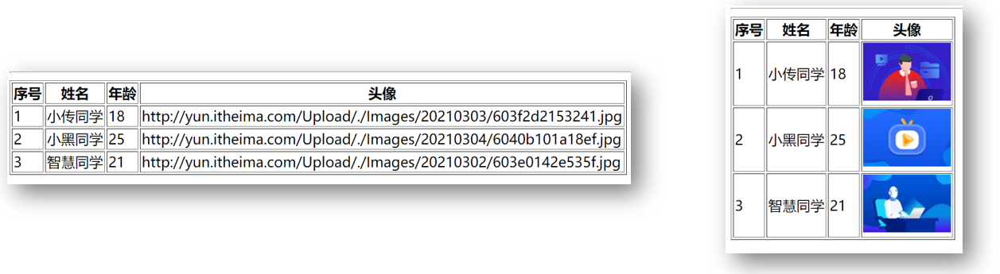
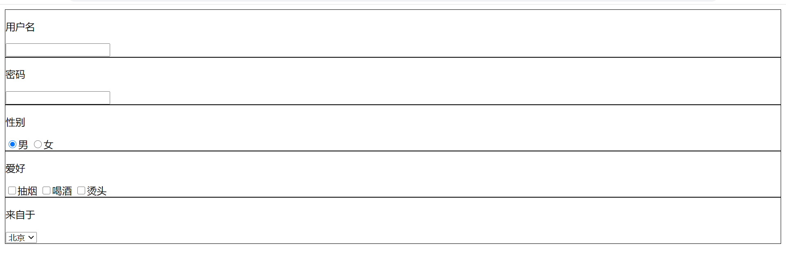

# 1. 组件插槽


**插槽是开发中最常用的功能，着重锻炼，很重要！！！**

**slot插槽其实不影响数据的通信，不看slot该怎么传数据就怎么传，v-for时需要使用作用域插槽就使用，顺理成章，弄清楚是因为操作数据时碰到slot才需要作用域插槽**

可以说slot就是一个插槽，或者说用插槽占位，或者用slot占位，也可以叫父组件中即将替换slot的标签是一个插槽

子组件数据不确定  父组件可以通过属性父传子，但是不能改变标签

如果子组件的标签也不确定，则需要使用到vue插槽来实现，用slot在子组件中占一个位置，然后父组件传入的html标签内容写在组件标签的里面就可以

App.vue

```vue
<Panel>
      <template v-slot:title>
        <h4>芙蓉楼送辛渐</h4>
      </template>

      <template v-slot:content>
        <p>寒雨连江夜入吴，</p>
        <p>平明送客楚山孤。</p>
        <p>洛阳亲友如相问，</p>
        <p>一片冰心在玉壶。</p>
      </template>
    </Panel>
```

Panel.vue

```vue
<template>
  <div>
    <div class="title">
      <slot>
      </slot>
   </div>
    </div>
</template>
```

slot不是原生的html标签，就是一个组件，slot就是vue内置组件，就是一个占位符，最后解析会把父组件组件里面包裹的内容全部替换过来

> **往往组件封装是由第三方去封装，里面会由别人去写slot标签，我们要做的就是看别人的文档去使用这个插槽**

vue提供组件插槽能力, 允许开发者在封装组件时，把不确定的部分（一部分html内容）定义为插槽，然后父组件使用该组件时把组件标签闭合标签中间的填充内容，传给子组件，替换slot组件

口诀：

1. Panel组件内用`<slot></slot>`占位
2. App.vue使用组件时`<Pannel></Pannel>`夹着的地方, 传入标签替换slot组件显示

**尽管插槽最后需要替换子组件的slot标签，但是插槽里面的事件还是需要定义在当前vue组件页面里，同时可以使用当前vue页面的数据**

## 1.1. 插槽默认内容

如果外面不传入标签，可以给slot设置一个默认显示内容

口诀：`<slot></slot>`内放置内容，作为默认显示内容，如果不给插槽slot传东西，则使用`<slot></slot>`夹着的内容在原地显示（也可以跟平常一样写入自己想写的标签，加上自己相加的样式）

```vue
<slot>默认内容</slot>
```

注意：slot标签不是html标签，就是一个占位符，不能通过标签选择器或者class类名选中（slot也不能设置行内样式），写样式可以通过slot外层的div盒子选中默认内容盒子

> 有传入值的时候slot的默认内容会被替换
>
> 默认插槽也可以使用`<template #default>xxx</template>`包起来，不写也可以

## 1.2. 具名插槽

当一个组件内有2处以上需要外部传入标签的地方，可以给每个插槽取名字

只有一个插槽时可以不使用具名插槽

**给不同的slot分发不同的内容**

使用步骤：

1. 子组件中，给slot标签添加一个name属性，起名字
2. 父组件在使用组件时，通过template配合v-slot指定对应的名字**（注意是冒号连接，等号是作用域插槽的传值）**

​    最终运行的结果：将template指定名字的标签插入到对应slot占位的地方

注意点：

* 因为slot只能设置在template上
* template只是起到包裹区分代码块的作用，没有什么限制，可以放很多根元素，template不会被渲染到页面上（不同于组件中的template中只能有一个根标签）

简写：`v-slot:title`可以简写成`#title`

> v-bind可以省略成:    v-on: 可以省略成@   v-slot: 可以简化成#

App.vue

```vue
   <Panel>
      <template v-slot:title>
        <h4>我是title</h4>
      </template>
      <template v-slot:content>
        <h4>我是content</h4>
      </template>
    </Panel>
```

Panel.vue

```vue
	<!-- 具名插槽 -->
    <slot name="title">
        <h1>默认的title</h1>
    </slot>

	<slot name="content">
        <h1>默认的content</h1>
	</slot>
```

**误区：使用具名插槽的时候一定分清楚组件，一定要每个组件分开分析**

比如下面这种组件复用的情况

App.vue

```vue
<Panel>
      <template v-slot:title>
        <h4>我是传过来的title</h4>
      </template>
    </Panel>
    <Panel>
      <template v-slot:content>
        <h4>我是传过来的content</h4>
      </template>
    </Panel>
```

Panel.vue

```vue
<slot name="title">
      <h1>我是不传title默认值</h1>
</slot>
<slot name="content">
      <h1>我是不传content默认值</h1>
</slot>
```

这上面是服用了Panel子组件，分开看，一个Panel一个Panel看，不要混为一谈，比如上面这个，先看第一个Panel找到name为title的slot，替换，第一个Panel中name为content的slot没有传入，显示默认值

## 1.3. 作用域插槽

子组件里值，在给插槽赋值时在父组件环境下（标签由父组件传来）使用

slot在子组件中使用--占位，由父组件中传入标签，父组件需要使用子组件中的数据，很多情况下不能使用子传父（是父传子的数据，子组件修改了，需要同步告诉父组件修改），虽然原数据本来就在父组件中data有，但是slot在循环结构中时不知道是哪一个item

**记住：插槽并不影响组件的通信，在渲染页面时，往下，碰到slot，替换，发现数据需要来自子组件，则就用上了作用域插槽**

> 循环创建slot，每次父组件传向子组件时，如果此次的数据不想相同，就想着从子组件传过来，就有了作用域插槽

### 1.3.1. 作用域插槽介绍

作用域插槽中也是有子传父的作用，但是如果是在子（v-for）传父中，需要把每次的item传向父组件，则必须是用slot作用域插槽传递（slot被循环创建）

另外同样的 地方的就是，子组件Panel用v-for循环创建，父组件中把item传给子组件（购物车），每次的item在子组件中使用

使用步骤：

1. 子组件, 在slot上绑定属性和子组件内的值
2. 使用组件, 传入自定义标签, 用template和v-slot="自定义变量名" **（注意插槽传值是等号）**
3. scope变量名自动绑定slot上所有属性和值

语法：slot标签上的属性`属性名=属性值`可以使用v-bind动态属性

注意：组件替换插槽的内容可以正常使用该组件data中的数据，同时插槽传过来的数据只能在该插槽作用域内使用

> 如果需要同时使用具名插槽，又需要传值，则直接`v-slot:插槽名="scope"`

示例：没有用slot的循环，可以$emit子传父过去，也可以使用slot作用域插槽代替$emit实现子传父

Panel.vue

```vue
	  <!-- 1.往插槽上绑定数据 -->
      <!-- row是自定义变量，业内一般习惯用row obj是Panel.vue中data里的数据 -->
	<!-- 如果需要传两个值，直接在slot属性中加就可以，有冒号要传变量，没有冒号传常量-->
	<!-- scope中就是scope={ row:obj, col:'tilte'} -->
      <slot :row="obj" col="tilte">
        <h1>{{obj.name1}}</h1>
      </slot>-->
```

App.vue

```vue
<Panel>
      <!-- 接受数据 -->
      <!-- scope是自定义变量名，业内习惯使用scope -->
      <!-- 注意这里是等号，具名函数是冒号 v-slot:xx 冒号后面就没有引号，等号后面就是引号 简写为# -->
      <!-- 会将插槽上绑定的所有数据收集到scope对象中 -->
      <!-- scope={ row:obj } scop.row == obj -->
    <template v-slot="scope">
        <h1>{{scope.row.name2}}</h1>
      </template>
</Panel>
```

作用域插槽什么时候用：使用组件插槽技术时，需要用到子组件内变量

使用口诀：

1. 子组件在slot身上添加属性和子组件的值 
2. 使用组件处template配合v-slot=“变量名”（收集slot身上的所有属性和值，放在一个对象中）

### 1.3.2. 作用域插槽应用场景



MyTable组件上图中两种使用情况，需要复用，封装成组件

而MyTable组件中，tr中的最后一个td不知道是什么标签，用slot占位，然后父组件中传入，而tr是v-for循环创建，从而slot每次使用的数据也是循环而来，父组件中使用数据有以下两种情况：

* 直接使用父组件中的list数据，slot是循环创建，每次使用的item数据都不一样，行不通
* 使用$emit技术，子传父，同样，每次使用的item数据都不一样，不能传一个数据过来（而且本来父组件中就有list-->在父传子的数据需要修改，可以使用$emit，如果是引用数据可以直接修改，互相引用）

从来只能使用作用域插槽，将v-for循环的每次item传到父组件使用

MyTable.vue

```vue
<template>
  <div>
    <table border="1">
      <thead>
        <tr>
          <th>序号</th>
          <th>姓名</th>
          <th>年龄</th>
          <th>头像</th>
        </tr>
      </thead>
      <tbody>
        <tr
          v-for="(item,index) in list"
          :key="index"
        >
          <td>{{item.index+1}}</td>
          <td>{{item.name}}</td>
          <td>{{item.age}}</td>
          <td>
            <slot :row="item"></slot>
          </td>
        </tr>
      </tbody>
    </table>
  </div>
</template>

<script>
export default {
  props: {
    list: {
      type: Array,
      required: true,
    },
  },
}
</script>
```

App.vue

```vue
<template>
  <div>
    <MyTable :list="list">
      <template v-slot="scope">
        <a :href="scope.row.headImgUrl">{{scope.row.headImgUrl}}</a>
      </template>
    </MyTable>
    <MyTable :list="list">
      <template v-slot="scope">
        
      </template>
    </MyTable>
  </div>
</template>

<script>
import MyTable from './components/MyTable.vue'
export default {
  components: {
    MyTable,
  },
  data() {
    return {
      list: [
        {
          name: '小传同学',
          age: 18,
          headImgUrl:
            'http://yun.itheima.com/Upload/./Images/20210303/603f2d2153241.jpg',
        },
        {
          name: '小黑同学',
          age: 25,
          headImgUrl:
            'http://yun.itheima.com/Upload/./Images/20210304/6040b101a18ef.jpg',
        },
        {
          name: '智慧同学',
          age: 21,
          headImgUrl:
            'http://yun.itheima.com/Upload/./Images/20210302/603e0142e535f.jpg',
        },
      ],
    }
  },
}
</script>

<style lang="scss" scoped>
</style>
```

### 1.3.3. 组件通信传数据总结

**最简单的传递：**

1. 父向子属性传递，子用props接受
2. 子向父传递
   * 不是引用类型，合适的时机调用$emit方法触发父组件的自定义事件，交给父组件去修改源数据
   * 引用类型（数组或对象），只要不修改原数据的地址，可以直接修改成员，互相引用

3. 用插槽来实现子传父，子用`:row="变量名"`（可以多个），父用template+属性`v-slot="scope"`（等号是传值，冒号是具名插槽，同时使用`v-slot:scope="插槽名"`）最后父组件插槽作用域内得到`scope={ row:变量名 }`，并且只能在该插槽作用域内使用

**较为复杂的传递：**

只要加入了v-for循环的就较为复杂，需要考虑每次的item不一致，不能简单使用父子props传递

1. 父向子传递时：子组件标签v-for循环创建，需要把每次的item传给子组件，在子组件中使用item
2. 作用域插槽传递：插槽slot循环，需要把每次的item传到父组件中使用，这样才能循环创建的slot数据不同

# 2. 自定义指令


除了核心功能默认内置的指令 (`v-model` 和 `v-show`)，Vue 也允许注册自定义指令。使用的时候直接在标签中加上属性 `v-自定义指令名`即可  

好处：获取标签，扩展额外的功能

应用场景：vue不推荐自己获取dom，可以使用自定义指令来帮忙实现，一般会用全局注册，可以复用

> 全局注册不是指在App.vue中注册，是指在main.js中调用Vue构造函数中的静态方法注册，注册组件也是，App.vue也是组件
>
> 局部注册是指在组件中注册

## 2.1. 全局注册

全局注册后在素有组件中都可以使用

main.js

```js
Vue.directive('指令名',{
    //指令名需要引号
    inserted(el){
        // 可以对el标签扩展额外功能
    }
})

Vue.directive('doFocus', {
  inserted(el) {
    el.focus() // 触发标签的事件方法
  }
})
```

el标签就是绑定这条自定义指令的真实dom元素，可以对el使用dom语法

## 2.2. 局部注册

在某一个组件中注册

App.vue

```vue
<input v-f type="text">

<script>
export default {
directives: {
    /* 
  语法：
  指令名:{
    inserted(){}
  }
  */
    f: {
      // 这个函数在当前指令绑定的元素被插入到dom树时执行
      // 参数1：el为原生dom对象，当前指令所绑定的元素
      inserted(el) {
        el.focus()
      },
    },
  },
}
</script>
```

页面多个元素自动获取焦点，只有html结构从上往下顺序的最后一个标签生效

> 注意全局注册directive是单数，局部注册核心成员directives是复数

自定义指令这个函数在当前指令绑定的元素被插入到dom树时立即执行

## 2.3. 自定义指令传参

inserted函数中第二个参数可以传进来

注意：

* 自定义指令调用，需要使用`v-指令名`
* v-xx后面引号里面需要跟一个变量，加字符串，需要在双引号里面使用单引号

```js
<input v-focus="'这是自定义指令'">

// 注册自定义指令
Vue.directive('focus', {
  // 当指令绑定的元素被插入到Dom树上时执行
  // 当前指令绑定的那个dom元素
  inserted(el, binding) {
    console.log(el, binding)
    el.focus()
  }
})
```


# 3. $refs介绍

this.$refs.ref属性名，可以在恰当的时机（mounted钩子或者其他地方也可以，比如事件处理中，既然都可以绑定事件了，说明真实dom已存在）获取原生dom或者组件对象

将来使用第三方组件，可以获取到第三方组件中的方法或属性

## 3.1. $refs获取真实dom元素

vue中不推荐使用原生js`document.queryselector('选择器')`或者`document.getElementById('id名')`来获取dom元素

推荐使用 ref 和 $refs 来获取 dom 元素（要在恰当时机，mounted钩子中可以获取到，真实dom已经加载完毕）

使用步骤：

1. 给标签加上属性`ref="名字"`名字随意，如`<h1 id="hh" ref="myH1">获取原生dom元素</h1>`
2. 恰当时机，比如mouted钩子中，通过`this.$refs.MyH1`获取该dom元素

```vue
<template>
  <div>
      <p>1. 获取原生DOM元素</p>
      <h1 id="h" ref="myH1">我是一个孤独可怜又能吃的h1</h1>
  </div>
</template>

<script>
// 目标: 获取dom对象
// 1. 标签起加上属性ref，随意起一个名字
// 2. 恰当时机, mounted钩子中获取dom对象
export default {
    mounted(){
        console.log(document.getElementById("h")); // h1
        console.log(this.$refs.myH1); // h1
    }
}
</script>
```

## 3.2. refs获取组件对象

同上,组件标签中加上ref属性可以获取到组件对象，这样可以获取当该组件中所有的data、computed、methods

使用步骤：

1. 给组件标签加上属性`ref="名字"`名字随意，如`<Panel ref="dd"></Panel>`
2. 恰当时机，比如mouted钩子中，通过`this.$refs.dd`获取该组件对象

Demo.vue

```vue
<template>
  <div>
      <p>我是Demo组件</p>
  </div>
</template>

<script>
export default {
    methods: {
        fn(){
            console.log("demo组件内的方法被调用了");
        }
    }
}
</script>
```

More.vue - 获取组件对象 - 调用组件方法

```vue
<template>
  <div>
      <p>1. 获取原生DOM元素</p>
      <h1 id="h" ref="myH">我是一个孤独可怜又能吃的h1</h1>
      <p>2. 获取组件对象 - 可调用组件内一切</p>
      <Demo ref="dd"></Demo>
  </div>
</template>

<script>
// 目标: 获取组件对象
// 1. 创建组件/引入组件/注册组件/使用组件
// 2. 组件起别名ref
// 3. 恰当时机, 获取组件对象
import Demo from './Child/Demo'
export default {
    mounted(){
        console.log(document.getElementById("h")); // h1
        console.log(this.$refs.myH); // h1

        let demoObj = this.$refs.dd;
        demoObj.fn()
    },
    components: {
        Demo
    }
}
</script>
```

如何获取组件对象：

1. 目标组件添加ref属性
2. this.$refs.名字获取组件对象（其他地方也可以，比如事件处理中，既然都可以绑定事件了，说明真实dom已存在，或者mounted钩子中）

拿到组件对象后，可以调用组件里的属性和方法

# 4. $nextTick介绍

```js
methods: {
    change() {
      // 修改完数据后，立即获取到更新后的dom，挂载真实dom是一个异步操作
      this.msg = '丑p'
      console.log(this.$refs.cuteP.innerHTML) //可爱的p
      // this.$nextTick()传入一个回调函数，该回调函数在下一次dom更新结束后触发
      // 此处必须使用箭头函数，因为this指向问题
      this.$nextTick(() => {
        console.log(this.$refs.cuteP.innerHTML) //丑p
      })
    },
```

背景：修改数据后立即获取真实dom，发现获取不到，无法拿到新值

原因：**vue更新真实dom是异步操作**

这样设计：所有用到此数据的地方都会更新dom，Vue中响应式，在数据更新后，dom更新时异步操作，必须等同步任务执行后再更新，是为了提高性能，假设很多地方的数据都修改了，需要操作很多次dom，或者一个数据先增了后减了，就可以减少这次dom操作。更新多次dom，和一次更新多个dom。显然后面的性能要高很多

## 4.1. $nextTick用法

应用场景：修改完数据后，立即获取更新后的dom

好处：用$nextTick防止业务逻辑割裂，不用去updated钩子中拿（修改在methods中修改，拿要去updated钩子中）

用法：`this.$nextTick()`传入一个回调函数，该回调函数在下一次dom更新结束后触发，这也是个异步操作，可以在回调函数里面获取最新dom（用回调函数接受异步操作的结果）

注意：`this.$nextTick()`返回一个Promise对象，支持Promise开发

```js
async showText() {
      this.isShow = true
      // 点击按钮出现输入框然后自动获取焦点
  	// 用法1：回调函数  
      /* this.$nextTick(() => {
        this.$refs.inp.focus()
      }) */

     // 用法2：使用Promise
      // this.$nextTick()返回一个Promise对象，用then方法获取异步事务的结果
      /* this.$nextTick().then(() => {
        this.$refs.inp.focus()
      })
 */
      // axios.get().then(res => {})
      // const res = await axios.get()

      // this.$nextTick()并没有返回结果，await不需要变量接受结果
      await this.$nextTick()
      this.$refs.inp.focus()
    },
```

## 4.2. $nextTick使用场景

 点击搜索按钮，弹出输入框，按钮消失，并自动获取输入框焦点（一定用v-if让dom消失）

v-show就是简单的css操作，dom元素一直在，一直可以获取到，操作dom是同步事件

```vue
<template>
  <div>
      <input ref="myInp" type="text" placeholder="这是一个输入框" v-if="isShow">
      <button v-else @click="btn">点击我进行搜索</button>
  </div>
</template>

<script>
// 目标: 点按钮(消失) - 输入框出现并聚焦
// 1. 获取到输入框
// 2. 输入框调用事件方法focus()达到聚焦行为
export default {
    data(){
        return {
            isShow: false
        }
    },
    methods: {
        async btn(){
            this.isShow = true;
            // this.$refs.myInp.focus()
            // 原因: data变化更新DOM是异步的
            // 输入框还没有挂载到真实DOM上
            // 解决:
            // this.$nextTick(() => {
            //     this.$refs.myInp.focus()
            // })
            // 扩展: await取代回调函数
            // $nextTick()原地返回Promise对象
            await this.$nextTick()
            this.$refs.myInp.focus()
        }
    }
}
</script>
```

# 5. v-model的本质

v-model实际上实现的，可能不同的实现逻辑不同

1. 向标签绑定动态属性`:value=count`
2. 给标签绑定input事件，并把收到的值，赋予给vue变量`count`

v-model有两种使用情况

1. 表单元素中与表单元素的value值双向绑定（最常用！）

   ```html
   <input v-model="city" type="text">
   
   <!-- 原理 -->
   <input :value="city" type="text" @input="city=$event.target.value">
   ```

2. 组件标签双向绑定父子组件（只能传名字为value的数据，父组件的自定义事件只能用input名字）
   App.vue

   ```vue
   	<h1>v-model的本质</h1>
   	<!-- v-model做了两件事 -->
       <p>count的值：{{count}}</p>
       <AddBtn :value="count" @input="val=>count=val"></AddBtn>
   
   	<!-- 直接使用v-model-->
   	<AddBtn v-model="count"></AddBtn>
   ```

   AddBtn.vue

   ```vue
   <button @click="$emit('input',value+10)">点我加10</button>
   <!-- 这里不能使用value++ 这样给value加1，会触发单向数据流 -->
       <p>value的值：{{value}}</p>
   
   props: {
       value: Number,
     },
   ```

# 6. 案例-商品列表

> 认识了**页面组件**，新建在views文件夹下的，当有导航栏tab-bar（首页-资讯-购物车-我的）的时候，切换的是页面组件，多页面组件--为路由做铺垫，App.vue>页面组件（views）>可复用组件（components）

注意点：

* components文件夹放可复用的组件，views文件夹放也页面组件
* 一些状态没有存（比如循环创建的input勾选状态，每个都不一样，v-model绑定不同的变量），购物车的状态一定会存储，可以自己手动加`this.list.forEach（item => item.inputState=false）`点语法直接对象加属性。开发中可能后台给的数据没有存需要自己手动存

下面这个案例来强化一下插槽的使用

完整效果


**目标1: 渲染数据**

1. 在 MyGoodsList 的 created 中发请求获取数据
2. 将数据存到 data 中
3. 将数据传入 MyTable 并进行渲染
4. 添加删除按钮的类样式

**目标2: 使用插槽**

1. 在 MyTable 中将表头和标题改成 slot 占位 (具名插槽和作用域插槽)
2. 在 MyGoodsList 中传入表头和标题

**目标3: 渲染 tags**

1. 使用 v-for 循环渲染 tags
2. 去 bootstrap 官网复制徽章样式

**目标4: 删除数据**

1. 给删除按钮绑定点击事件, 传入 id (从作用域插槽中来)

2. 根据 id 找索引, 根据索引删除**数据**

**目标5：点击+tags输入回车添加tag**

1. 给按钮添加点击事件，点击出现input表单输入框
2. 自定义指令，input框一出现，自动聚焦
3. 绑定blur事件，焦点失去，input框消失，按钮出现
4. 给input输入框绑定keyup事件并设置修饰符enter，事件处理函数需要做非空判断，有数据就push到item.tags数组中，然后清空表单

> 注意一个小细节：点击click事件是mousedown然后mouseup后才触发，当mousedown和mouseup的落点不在一个点，click无法触发，比如点击后按钮向右移动了鼠标松开的时候的时候不在原地，就无法触发点击事件
>
> 平时我们点击按钮点击长按滑到别处松开也无法触发点击事件

## 6.1. 初始化项目

基本流程：**下包-->导包-->分组件并新建使用组件-->axios请求数据（一般在父组件中）**

组件拆分（一般是可以多次复用的）：

* Header--可以复用之前的
* Table--封装表格组件

页面组件（导航栏切换）

GoodsList-商品页

新建工程:

```bash
vue create goodsList-demo
yarn add less less-loader@5.0.0 -D
yarn add bootstrap axios
```

在main.js中引入bootStrap.css和axios

```js
import "bootstrap/dist/css/bootstrap.css"

import axios from 'axios'
axios.defaults.baseURL = 'https://www.escook.cn'
Vue.prototype.$axios = axios
```

文件结构为：


表格决定封装成一个组件，可能会被多处复用，可以少写很多公共样式和公共标签，其他的可以用slot占位由父组件传入因为表格有tr的循环和外面table的结构是固定的，表格的thead里面的tr里的td和和tbody里面tr里的td都不确定

Table.vue

```vue
<template>
  <table class="table table-bordered table-stripped">
    <!-- 表格标题区域 -->
    <thead>
      <tr>
        <th>#</th>
        <th>商品名称</th>
        <th>价格</th>
        <th>标签</th>
        <th>操作</th>
      </tr>
    </thead>
    <!-- 表格主体区域 -->
    <tbody>
      <tr >
        <td>1</td>
        <td>商品</td>
        <td>998</td>
        <td>xxx</td>
        <td>xxx</td>
      </tr>
    </tbody>
  </table>
</template>

<script>
export default {
  name: 'MyTable'
}
</script>


<style scoped lang="less">
.my-goods-list {
  .badge {
    margin-right: 5px;
  }
}
</style>
```

App.vue

```vue
<GoodsList></GoodsList>
<script>
import GoodsList from './views/GoodsList.vue'
export default {
  components: {
    GoodsList,
  },
}
</script>
```

GoodsList.vue

```vue
<script>
import Header from '@/components/Header.vue'
import Table from '@/components/Table.vue'
export default {
  name: 'Goodslist',
  components: {
    Header,
    Table,
  },
<Header></Header>
<Table></Table>
}
</script>
```

## 6.2. 渲染数据

步骤：

1. 封装MyTable.vue – 准备标签和样式

2.  axios在MyGoodsList.vue请求数据回来

3. 传入MyTable.vue中循环数据显示，需要用到作用域插槽

4. 给删除按钮添加bootstrap的样式: btn btn-danger btn-sm

**流程：数据在`GoodsList.vue`中，传入`Table.vue`中，在`Table.vue`中操作数据，遇到slot，数据传过去**

先在页面组件GoodsList.vue中请求后台数据

```js
async created() {
    const { data: res } = await this.$axios.get('/api/goods')
    console.log(res)
    this.list = res.data
    //存入data中
  },
```

Table.vue

```vue
<template>
  <table class="table table-bordered table-stripped">
    <!-- 表格标题区域 -->
    <thead>
      <tr>
        <slot name="head"></slot>
      </tr>
    </thead>
    <!-- 表格主体区域 -->
    <tbody>
      <tr v-for="item in list" :key="item.id">
        <slot :row="item" name="body"></slot>
      </tr>
    </tbody>
  </table>
</template>

<script>
export default {
  name: 'Table',
  props: {
    list: Array,
  },
}
</script>

<style scoped lang="less">
.my-goods-list {
  .badge {
    margin-right: 5px;
  }
}
</style>
```

GoodsList.vue

```vue
<Table :list="list">
      <template #head>
        <th>id</th>
        <th>商品名称</th>
        <th>价格</th>
        <th>标签</th>
        <th>操作</th>
      </template>
    <!-- 具名插槽和作用域插槽合用 -->
      <template v-slot:body="scope">
        <td>{{scope.row.id}}</td>
        <td>{{scope.row.goods_name}}</td>
        <td>{{scope.row.goods_price}}</td>
        <td>{{scope.row.tags}}</td>
        <td><button class="btn btn-warning btn-sm">删除</button></td>
      </template>
</Table>
```

## 6.3. 商品表格-插槽

在渲染数据上已经使用了插槽

 **使用插槽技术，具名插槽，和作用域插槽技术, 给Table.vue组件，自定义列标题，自定义表格内容**

步骤:

1. 提高组件==复用性和灵活性==, 把表格列标题thead部分预留`<slot>`标签，设置name属性
2. 使用`Table.vue`时，传入列标题标签
3. 表格内容td部分也可以让组件使用者自定义，也给tbody下tr内留好`<slot>`标签和name属性名
4. 使用插槽需要用到插槽内的obj对象上的数据（遇到v-for），使用作用域插槽技术

**具名插槽**：给不同的slot分发不同的内容

**作用域插槽**：在使用插槽时，使用子组件内的数据（在slot上绑定的属性）

## 6.4. 商品表格-tags徽标

**需求：点击+tags出现输入框，输入后回车添加tag，失去焦点输入框消失**

1. 给按钮添加点击事件，点击出现input表单输入框
2. 自定义指令，input框一出现，自动聚焦
3. 绑定blur事件，焦点失去，input框消失，按钮出现
4. 给input输入框绑定keyup事件并设置修饰符enter，事件处理函数需要做非空判断，有数据就push到item.tags数组中，然后清空表单，监听input按esc取消，清空表单内容

> 每个输入框的input需要绑定一个不同的变量，同时每个input框的显示隐藏状态也需要绑定不同的变量
>
> 和之前的多选框一样，v-model绑定的是变量，每个框的状态应该不同，需要绑定不同的变量

```html
	<td>
          <input 
          @keyup.enter="add(scope.row)" 
          v-f 
          @blur="scope.row.inputVisible=false" 
          v-model.trim="scope.row.inputValue" 
          type="text" 
          v-if="scope.row.inputVisible" placeholder="请输入标签名">
          <button 
          @click="scope.row.inputVisible=true" 
          v-else 
          class="btn btn-primary btn-sm">+tag</button>
          <br>
          <span 
          style="margin-right:5px" 
          class="badge bg-warning text-dark" 
          v-for="(item,index) in scope.row.tags" 
          :key="index">{{item}}</span>
	</td>

	add(row) {
      if (!row.inputValue) return alert('请输入tag')
      row.tags.push(row.inputValue)
      row.inputValue = ''
    },
```

回车执行add函数，传进来的row就是数组的每一个item

> 利用好**事件传参**的技术

**拿到复杂的需求怎么办：先一小步一小步使用和尝试, 然后马上记录需要完成的效果**

## 6.5. 商品表格-删除功能

需求：点击删除对应这条数据

步骤：

1. 删除按钮绑定点击事件

2. 作用域插槽绑定id值出来

3. 传给删除方法, 删除GoodsList.vue里数组里数据

**循环生成的删除按钮，都可以在点击的时候将id传过来**

```vue
<button @click="del(scope.row.id)" class="btn btn-warning btn-sm">删除</button>

del(id) {
      const index = this.list.findIndex(item => item.id === id)
      this.list.splice(index, 1)
    },
```

# 今日总结

1. 组件插槽默认使用
2. 插槽默认显示的内容
3. 多个插槽时, 具名插槽如何使用
4. 作用域插槽如何使用以及目的
5. 自定义命令如何使用
6. $refs和$nextTick的作用
7. 知道v-model的本质是什么
8. 会给自定义组件使用v-model
9. 跟随视频完成商品列表案例

# 面试题

### 1、Vue 的 nextTick 的原理是什么? （高薪常问）

1. 为什么需要 nextTick ，Vue 是异步修改 DOM 的并且不鼓励开发者直接接触 DOM，但有时候业务需要必须对数据更改--刷新后的 DOM 做相应的处理，这时候就可以使用 Vue.nextTick(callback)这个 api 了。

2. 理解原理前的准备 首先需要知道事件循环中宏任务和微任务这两个概念,常见的宏任务有 script, setTimeout, setInterval, setImmediate, I/O, UI rendering 常见的微任务有 process.nextTick(Nodejs),Promise.then(), MutationObserver;

3. 理解 nextTick 的原理正是 vue 通过异步队列控制 DOM 更新和 nextTick 回调函数先后执行的方式。如果大家看过这部分的源码，会发现其中做了很多 isNative()的判断，因为这里还存在兼容性优雅降级的问题。可见 Vue 开发团队的深思熟虑，对性能的良苦用心。

### 2. vue中solt的使用方式，以及solt作用域插槽的用法

* 使用方式：当组件当做标签进行使用的时候，用slot可以用来接受组件标签包裹的内容，当给solt标签添加name属性的 时候，可以调换响应的位置
* (高级用法) 插槽作用域： 当传递的不是单一的标签, 例如需要循环时, 把要循环的标签传入, 组件内使用v-for在slot标签上, 内部可以v-bind:把值传出来, 再外面把值赋予进去, 看示例

```js
<current-user>
  <template v-slot:default="slotProps">
    {{ slotProps.user.firstName }}
  </template>
</current-user>

// current-user组件, user属性和值, 绑定给slotProps上
<span>
  <slot v-bind:user="user">
    {{ user.lastName }}
  </slot>
</span>
```
> 扩展阅读: https://cn.vuejs.org/v2/guide/components-slots.html (了解即可, 一般用不上)

### 3. 自定义指令(v-check、v-focus)的方法有哪些?它有哪些钩子函数?还有哪些钩子函数参数?（必会）

​    全局定义指令：在vue对象的directive方法里面有两个参数，一个是指令名称，另外一个是函数。组件内定义指令：directives

​    钩子函数：bind(绑定事件触发)、inserted(节点插入的时候触发)、update(组件内相关更新)

​    钩子函数参数：el、binding

### 4. is这个特性你有用过吗？主要用在哪些方面？（高薪常问）

**1. 动态组件**

​    `<component :is="componentName"></component>`， componentName可以是在本页面已经注册的局部组件名和全局组件名,也可以是一个组件的选项对象。 当控制componentName改变时就可以动态切换选择组件。

**2. is的用法**

有些HTML元素，诸如 `<ul>`、`<ol>`、`<table>`和`<select>`，对于哪些元素可以出现在其内部是有严格限制的。

 而有些HTML元素，诸如 `<li>`、`<tr>` 和 `option>`，只能出现在其它某些特定的元素内部。

```html
<ul>
      <card-list></card-list>
</ul>
```

所以上面`<card-list></card-list>`会被作为无效的内容提升到外部，并导致最终渲染结果出错。应该这么写：

```html
<ul>
	<li is="cardList"></li>
</ul>
```

# 扩展

### 1.组件进阶-动态组件

> 目标: 多个组件使用同一个挂载点，并动态切换，这就是动态组件

需求: 完成一个注册功能页面, 2个按钮切换, 一个填写注册信息, 一个填写用户简介信息

效果如下:


1. 准备被切换的 - UserName.vue / UserInfo.vue 2个组件
2. 引入到UseDynamic.vue注册
3. 准备变量来承载要显示的"组件名"
4. 设置挂载点<component>, 使用is属性来设置要显示哪个组件
5. 点击按钮 – 修改comName变量里的"组件名"

```vue
<template>
  <div>
      <button @click="comName = 'UserName'">账号密码填写</button>
      <button @click="comName = 'UserInfo'">个人信息填写</button>

      <p>下面显示注册组件-动态切换:</p>
      <div style="border: 1px solid red;">
          <component :is="comName"></component>
      </div>
  </div>
</template>

<script>
// 目标: 动态组件 - 切换组件显示
// 场景: 同一个挂载点要切换 不同组件 显示
// 1. 创建要被切换的组件 - 标签+样式
// 2. 引入到要展示的vue文件内, 注册
// 3. 变量-承载要显示的组件名
// 4. 设置挂载点<component :is="变量"></component>
// 5. 点击按钮-切换comName的值为要显示的组件名

import UserName from '../components/01/UserName'
import UserInfo from '../components/01/UserInfo'
export default {
    data(){
        return {
            comName: "UserName"
        }
    },
    components: {
        UserName,
        UserInfo
    }
}
</script>
```

在App.vue - 引入01_UseDynamic.vue并使用显示

> 总结: vue内置component组件, 配合is属性, 设置要显示的组件名字

### 2.组件进阶-组件缓存

> 目标: 组件切换会导致组件被频繁销毁和重新创建, 性能不高

使用Vue内置的keep-alive组件, 可以让包裹的组件保存在内存中不被销毁

演示1: 可以先给UserName.vue和UserInfo.vue 注册created和destroyed生命周期事件, 观察创建和销毁过程

演示2: 使用keep-alive内置的vue组件, 让动态组件缓存而不是销毁

语法:

​		Vue内置的keep-alive组件 包起来要频繁切换的组件

02_UseDynamic.vue

```vue
<div style="border: 1px solid red;">
    <!-- Vue内置keep-alive组件, 把包起来的组件缓存起来 -->
    <keep-alive>
        <component :is="comName"></component>
    </keep-alive>
</div>
```

补充生命周期:

* activated - 激活
* deactivated - 失去激活状态

> 总结: keep-alive可以提高组件的性能, 内部包裹的标签不会被销毁和重新创建, 触发激活和非激活的生命周期方法

### 3.组件进阶-激活和非激活

> 目标: 被缓存的组件不再创建和销毁, 而是激活和非激活

补充2个钩子方法名:

​	activated – 激活时触发

​	deactivated – 失去激活状态触发

### 练习_1.注册组件复用

目的: 封装一个复用的组件, 可以动态的插入标签, 来作为注册页的一块项

图示:



正确代码:

```html
<div id="app">
    <child-com :title="'姓名'">
        <input type='text'/>
    </child-com>
    <child-com :title="'密码'">
        <input type='password' />
    </child-com>
    <child-com :title="'性别'">
        <input type='radio' name="sex" value="男"/>男
        <input type='radio' name="sex" value="女"/>女
    </child-com>
    <child-com :title="'爱好'">
        <input type='checkbox' value="抽烟" />抽烟
        <input type='checkbox' value="喝酒" />喝酒
        <input type='checkbox' value="烫头" />烫头
    </child-com>
    <child-com :title="'来自于'">
        <select>
            <option value="北京">北京</option>
            <option value="天津">天津</option>
            <option value="南京">南京</option>
        </select>
    </child-com>

</div>
<script src="https://cdn.jsdelivr.net/npm/vue/dist/vue.js"></script>
<script>
    new Vue({
        el: "#app",
        components: {
            childCom: { // 组件名字
                props: {
                    title: {
                        type: String
                    }
                },
                template: `<div style="border: 1px solid black;">
<p>{{title}}</p>
<slot></slot>
    </div>`
            }
        }
    })
</script>
```

