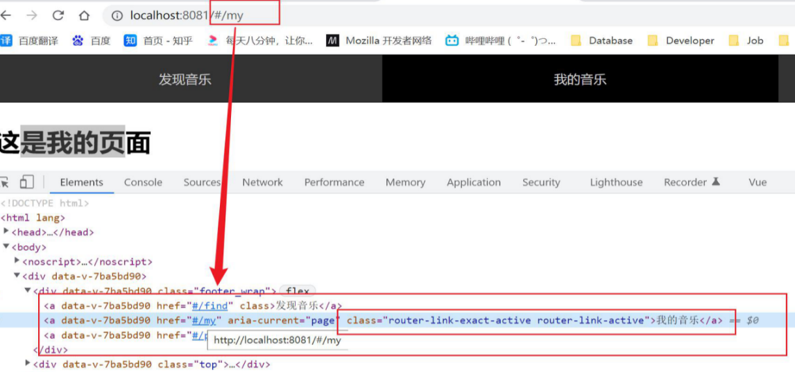

**router实例对象和vuex实例对象一样都可以抽离出来一个模块（一个js文件，export default router，需要导入Vue模块，调用Vue.use()）中，全部写在main.js中太冗余了，最后在main.js中导入，配置在Vue实例中。可以让自定义脚手架帮我们完成这一过程**


**通过切换路由而切换页面组件，相当于刷新，会自动加载当前页面data的数据，如果设置的是空就加载空，需要持久化，则需要使用vuex中的数据（需要借助vuex-persistedstate插件让vuex数据持久化）**


# 1. 什么是路由

**总的来说：路由就是一种映射关系**

1. 设备和ip的映射关系

   

2. 接口与服务的映射关系
   

3. 路径与组件的映射关系
   

> vue路由指定的就是路径和组件的映射关系

# 2. 为什么用路由

在一个页面内频繁的切换业务场景，切换不同的组件，靠什么技术来支持（依赖路由来支持）

具体使用示例: 网易云音乐 https://music.163.com/

单页应用SPA singular page Application（所有的业务都在一个页面编写, 只有一个html） 的好处

* 页面不刷新没有加载的过程 用路由去映射 用户体验更好

* 不同的html传参，比较复杂，应用路由，数据传递容易, 开发效率高

缺点：

* 首次加载会比较慢一点（需要加载所有的组件）。不利于seo（网站搜索权重）
* 需要学习专门的知识

# 3. 组件分类

单vue文件本质无区别，但是为了方便学习、理解和使用，前人总结的经验

按照用途可以分为两类，一类是页面组件，一类是复用组件

* 页面组件：`src/views(或pages)`文件夹，用于页面展示，配合路由用
* 复用组件：`src/components`文件夹，展示数据，常用于复用，在页面组件中使用（复用组件就是重复渲染结构一样的标签）

页面组件可以让我们少写很多公共样式，比如外面的大框架（写在App.vue中）

一般是App.vue>页面组件>复用组件


# 4. vue-router介绍和初始配置使用

## 4.1. vue-router介绍

**vue-router是vue官方提供的核心插件，与Vue.js深度集成，属于vue全家桶的一员**

vue-router官方文档传送门：[https://router.vuejs.org/zh/](https://router.vuejs.org/zh/)

vue-router本质：第三方包, 下载后集成到vue项目中

## 4.2. vue-router初始配置使用（七步曲）

> 注意：配套的插件全家桶跟随着vue版本的升级而升级，默认是vue3 ，如果使用的vue2，vue-router的版本要低一些  自己去官网或者npm查询  vue2对应的vue-router最新版本是3.5.3

前提：在App.vue中有a标签跳转，a标签跳转，地址栏为`localhost:8080/#/find`
```html
	  <a href="#/find">发现音乐</a>
      <a href="#/my">我的音乐</a>
      <a href="#/part">朋友</a>
```

1. 装包：vue2需要搭配vue-router@3.5.3的版本才可以运行（项目上线后依然需要路由）

   ```bash
   yarn add vue-router@3.5.3
   ```

2. 引入VueRouter（构造函数）

   ```js
   import VueRouter from 'vue-router'
   ```

3. 安装核心组件
   会在全局注册两个组件：`router-view`、`router-link`

   ```js
   Vue.use(VueRouter)
   ```

4. **创建路由规则数组（名字可以自定义，业内都用routes），需要提前导入页面组件（重点）**

   ```js
   // 引入组件
   import NotFound from './views/NotFound.vue'
   import Find from './views/Find.vue'
   import My from './views/My.vue'
   import Part from './views/Part.vue'
   
   const routes = [
     // 一个对象表示一条路由规则
     // 路由规则：规则+组件（都是属性）属性名path和component是vue官方规定
       
      // 顺序不重要，a标签是根据path去查找
     {
       path: "/find",
       component: Find
      // 如果没有提前导入Find模块，可以使用import()函数导入（不常用）
      // component:()=>import(@/views/Find.vue)   
     },
     {
       path: "/my",
       component: My
     },
     {
       path: "/part",
       component: Part
     }
   ]
   ```
   **路由匹配不会按顺序匹配，而是匹配的到就算匹配，最后才会去匹配通配符，带参的和不带参的优先匹配带参的**

5. 通过规则创建路由对象（名字可以自定义，业内都叫router）

   ```js
   const router = new VueRouter({
     // 第四步的名字导致这里可以解构
     routes,
   })
   ```

6. 将路由对象挂到Vue实例中（注入）options就是配置对象，创建对象里面需要传一个对象

   ```js
   new Vue({
     render: h => h(App),
     // 第五步的名字导致这里可以解构
     router,
   }).$mount('#app')
   ```

7. **用router-view作为挂载点，切换不同的路由页面组件（一般是在App.vue中注入）（需要自己找合适的挂载点把页面组件渲染到挂载点）**

注意事项：

* 第四步和第七步需要自己写，其他的都是固定的格式（不用记住）
* 第七步：路由的出口，指定一块位置作为路由的挂载点，在页面哪个位置渲染，即用`router-view`占个位，切换到哪个路由，就用哪个页面组件替换

占位--> 直接替换原占位符 **1.组件标签**、**2.slot插槽**、**3.路由挂载router-view**（无需注册组件）

> 一切以也地址栏中url的hash值为准，这里利用了a标签的锚点跳转，页面不刷新，在本页面内跳转，`<a href='#/Path'>点我跳转</a>`，href的地址加上地址url的后面

vue-router的本质：第三方包, 下载后集成到vue项目中

vue-router如何使用：下包/引入/注册/规则/路由对象/注入/挂载点

路由规则如何生效：切换url上hash值，开始匹配规则，对应组件展示到router-view位置

## 4.3. 易错点

易错点1：第四步路由规则数组中，组件名写错了保存，会自动帮你加import，没有这个组件就会报错


易错点2：七步中可能有一步写错了就会导致出不来，但是页面不会报错

# 5. vue路由-声明式导航

## 5.1. 声明式导航-跳转

### 5.1.1. router-link介绍

**可用全局组件router-link来替代a标签，a标签必须带上#号**

利用router-link来替代a标签，不用加#号，但是底层原理就是原来的a标签，会加上两个类名

router-link是按照地址中路由加类名（直接给该类名加高亮的样式就可以了），而点击高亮（点击加高亮样式）在页面刷新后就没了（刷新页面，基于该地址栏中的url进行刷新）

小结：

* vue-router提供了一个全局组件 router-link来替代a标签
* router-link实质上最终会渲染成a链接，to属性等价于提供 href属性(to无需#)（**必须传入to属性, 指定路由路径值**）
* router-link提供了声明式导航高亮的功能（自带类名，直接给类名加高亮样式就可以）

```html
<div class="footer_wrap">
      <!-- <a href="#/find">发现音乐</a>
      <a href="#/my">我的音乐</a>
      <a href="#/part">朋友</a> -->

      <router-link to="/find">发现音乐</router-link>
      <router-link to="/my?name=张三&age=18">我的音乐</router-link>
      <router-link to="/part/李四/20">朋友</router-link>
</div>
<div class="top">
      <!-- 7.使用router-view占位，作为路由的挂载点 -->
      <router-view></router-view>
</div>
```

### 5.1.2. 跳转控制台展示

`localhost:8080/#/find`，默认就有`/`表示根标签只是不显示，所以`localhost:8080`和`localhost:8080/`是一个地址

下面是router-link跳转，发现还是渲染成了a标签，并加上了类名



> router-link和router-view在一个组件App.vue中（整个根标签直接替换过来）
>
> 路由跳转流程：根据router-link地址去路由规则数组中去匹配组件，然后在挂载点router-view全部替换

### 5.1.3. 小结

router-link是VueRouter在全局注册的组件，本质就是a标签

router-link怎么用：当标签使用，必须传入to属性，指定路由路径值（提前配好路由规则数组）

router-link的好处：自带激活时的类名, 可以做高亮

## 5.2. 声明式导航-传参

传参的意义


在跳转路由时, 可以给路由对应的组件内传值（点击router-link跳转到某一个页面组件可以携带参数）

语法（在router-link上的to属性传值）路径一定要带上前面的`/`：

* 查询字符串：`/path?参数名=值`
* 动态路径参数：`/path/值`--需要在第四步路由规则数组中提前配置 `path: '/path/参数名'`

```vue
	  <!-- 不传参 -->
      <router-link to="/find">发现音乐</router-link>
      <!-- 查询字符串传参 -->
      <router-link to="/my?name=张三&age=18">我的音乐</router-link>
      <!-- 动态路径参数 -->
      <router-link to="/part/李四/20">朋友</router-link>
```

> to的后面可以和编程式导航一样，写一个对象`to="{ path:xx, query:{}}"`也是path+query，name+params 

**查询字符串不需要别的额外设置，直接在router-link中传，动态路径参数需要在main.js中额外设置**

```js
  // query查询参数传参不需要设置，直接在router-link上传就行
  // 动态路径传参需要提前在，路由数组规则中的配置对象中提前配置（函数式编程不用配置）
  // path:'./xxx:参数名1：参数名2'一般只传一个为id值
  // 动态路径传参不要少了冒号前面的/

  // 一般只写带参的或者不带参的，不会都写，都写了优先匹配带参的
  {
    path: '/part/:name/:age',
    component: Part, //没有s
  },
```

页面组件如何接受传过来的参数

* 查询字符串用`$route.query`接收  `{ "name": "张三", "age": "18" }`
* 动态路径参数用`$route.params`接收`{ "name": "李四", "age": "20" }`

**如果对应的写叉了就获取到一个空对象**

`$route`是存在当前**组件实例对象**中的方法，data、computed、methods、created通过`this.$route`访问，template中访问不加this，用$route.query和$route.params接受的参数都是**对象**

> $route 和 $router的区别
>
> * $route是路由信息对象，用于接受路由参数、path等
> * $router是路由对象（就是new的那个路由对象），用于做路由导航，进行跳转的（注意这里是新创建的router实例（index.js向外暴露的router对象，加了路由规则数组routes的），并不是直接从第三方模块导入的）
>
> routes是在main.js中定义的路由规则数组，用来配置路径和组件的映射关系


import router from ”vue-router” 里面的router就是this.$router，可以调用beforeEach


这个和发ajax时，后台的url参数不同，页面中地址栏中的参数一般是路由router-link传过来的，当前页面拿到之后需要通过该参数向后台发请求

**前端路由不会发请求**

前端路由传参和发ajax请求后台的数据形式相同，但都没有什么联系

## 5.3. 声明式导航-类名区别

这一节需要掌握路由嵌套的知识

将来用的更多的就是模糊匹配 router-link-active，有多级路由，使用模糊匹配，可以知道子组件在哪个页面

观察路由嵌套导航的样式

* `router-link-exact-active`  （精确匹配） url中hash值路径，与href属性值完全相同，设置此类名
* `router-link-active`（模糊匹配） url中hash值,    **包含**href属性值这个路径

下图中此时路径为二级路由`/#/find/recommend`，一级路由的组件的类名只有`router-link-active`，而二级路由的类名则是两个都有


# 6. vue路由-重定向

重定向：匹配path后, 强制切换到目标path上

网页打开url默认hash值是/路径

url的哈希值是URL 的锚部分（从 # 号开始的部分）如` http://www.runoob.com/test.htm＃PART2`的hash是`#PART2`

```js
const routes=[
    // 重定向匹配，页面一加载默认加载的页面
  // 网页url的默认hash值是/路径（根路径），所以网址后面加上/跟不加是一样的
  {
    path: '/',
    // component: Find, //这里不要写组件对象，虽然可以跳转，但是没有高亮那两个类名，是根据地址栏的url加的类名，重定向希望根据path找到组件
    redirect: '/find',// 浏览器url中#后的路径被改变成/find-重新匹配数组规则
  },
]
```

`/`是根路径，页面一进来刚加载会去匹配这个根路径，设置重定向后，会根据重定向的路由地址，重新来数组里匹配一次路由规则

**未设置router路由对象中的mode为history会在地址栏中一直有`/#`**

> 网页一进来没有任何后缀，就访问的首页，不是重定向，刚开始并没有router-active那两个高亮类名，刚开始是用的根组件`/`匹配的某个组件，不是重定向，没有router-active那两个类名，但是会给初始页面组件加和router-active一样的样式，已假乱真，看起来是路由重定向（其实不是）。

# 7. vue路由-404页面

如果路由hash值，没有和数组里规则匹配`localhost:8080/#/path`,默认给一个404页面

404页面，找不到组件的路径url不会向后端发请求，由前端处理，前端路由不会发请求（用户看起来像是向后端发了请求）

语法：路由最后，path匹配*(任意路径) – 前面不匹配就命中最后这个，显示对应组件页面，一般写在最后，但是路由匹配并不是按照数组的书写书序去匹配，而是尽可能地匹配

一般会另外创建一个404页面组件，传入一幅图之类的

1. 创建NotFound页面

   ```vue
   <template>
     
   </template>
   
   <script>
   export default {
   
   }
   </script>
   
   <style scoped>
       img{
           width: 100%;
       }
   </style>
   ```

2. 在main.js - 修改路由配置（需要提前导入该404页面组件）

   ```js
   import NotFound from '@/views/NotFound'
   
   const routes = [
     // ...省略了其他配置
     // 404在最后(规则是从前往后逐个比较path)
     {
       path: "*",
       component: NotFound
     }
   ]
   ```

# 8. vue路由-模式设置

修改路由在地址栏的模式，有两种模式

* hash路由例如： `http://localhost:8080/#/home`

* history路由例如： `http://localhost:8080/home`  (以后上线需要服务器端支持, 否则找的是文件夹)

路由模式官方文档介绍：[https://router.vuejs.org/zh/api/#mode](https://router.vuejs.org/zh/api/#mode)

history路由，需要后端提供额外的配置，项目需要在线上服务器中，而我们开发项目是运行在devServer上，由脚手架自动帮我们配置了

我们在基于脚手架开发时只需要配置router路由对象的options即可

```js
const router = new VueRouter({
  routes,
  mode: "history" // 打包上线后需要后台支持, 模式是hash
})
```

设置后，地址栏中就会去掉`/#`

> 开发时使用hash模式，在项目上线时才会考虑要不要使用history模式

# 9. vue路由-编程式导航

## 9.1. 编程式导航-跳转

用JS代码来进行跳转，并不是点击router-link来跳转，就跟`location.href`跳转和a标签跳转的关系一样

可以使用path或者name跳转（**也还是需要去main.js中的路由规则数组中去匹配**）

**path可以直接写代码跳转，name需要额外给每条路由取一个名字**

语法：

* `this.$router.push({path: "路由路径"})`
  简写（常用）：`this.$router.push('路由路径')`
* `this.$router.push({name: "路由名"})`
  简写（常用）：`this.$router.push('路由名')`

1. 在main.js中配置路由数组

```js
{
    path: "/find",
    name: "Find",
    component: Find
},
{
    path: "/my",
    name: "My",
    component: My
},
{
    path: "/part",
    name: "Part",
    component: Part
},
```

2. App.vue - 换成span 配合js的编程式导航跳转

```html
<!-- 点击事件，实现编程式跳转 -->
<div class="footer_wrap">
      <span @click="goto('/find','find')">发现音乐</span>
      <span @click="goto('/my','my')">我的音乐</span>
      <span @click="goto('/part','part')">朋友</span>
</div>
<div class="top">
    <!-- 路由挂载点，占位 -->
      <router-view></router-view>
</div>

<script>
export default {
  methods: {
    goto(path, name) {
      // 编程式导航跳转
      // this.$router.push()
      // 参数1：可传入对象
      // { path,name } 二选一进行跳转
      /* 
      解构赋值
      this.$router.push({
        path
      })
       */
      // 可以简写：this.$router.push(path)//this.$router.push('/path')
      // 通过名跳转，需要提前在路由对象中配置name
      this.$router.push({
        name,
      })
      //简写：this.$router.push(name)

      // 可以简写直接传入一个名字或者路径字符串
    },
  },
}
</script>
```

> this.$router拿到路由对象

注意点：

* 编程时导航在find页面中再跳转find页面会报错，以后再项目中解决

* 编程式导航没有高亮，即不会加类名

## 9.2. 编程式导航跳转的实际应用场景

无效路由匹配404页面，在404组件中-404正在跳转到首页，或者登录页（用编程式导航实现）

```vue
<template>
  <div class="box">
    <p> {{ countDown }} 秒后自动跳转至发现页</p>
    <h1>这是一个 404 页面</h1>
    
  </div>
</template>

<script>
export default {
  data() {
    return {
      countDown: 3
    };
  },

  created() {
    let timerId = setInterval(() => {
      this.countDown--
      if (this.countDown === 0) {
        // 编程式导航跳转至 /find
        this.$router.push('/find')
        clearInterval(timerId)
      }
    }, 1000)
  },
};
</script>

<style scoped>
.box {
  display: flex;
  flex-direction: column;
  justify-content: center;
  align-items: center;
}
</style>
```

## 9.3. 编程式导航-传参

传参：参数在地址栏中  query参数页面刷新仍然存在，params参数页面刷新参数不存在了

不需要像声明式导航那么配置routes对象，参数没有到地址中，（隐蔽性比较高，比如购物车的信息），所以页面刷新参数不存在

**注意点：使用path跳转时会忽略params，推荐用法：path+query / name+params**

传参数就不能简写，路由路径记得加`/`如`''/path'`，路由名不用加`'part'`注意都是字符串需要加引号，**动态路径传参不需要另外设置，参数也不会显示在地址栏中**

```js
// query传参页面刷新，参数仍然在
      this.$router.push({
        path,
        query: {
          name: '张三',
          age: 21,
        },
      })

// 注意params参数是不在地址栏中显示的，所以可以传一些比较隐蔽性的参数，页面刷新也没有参数，不需要在路由规则数组中有额外的配置
	this.$router.push({
        name,
        params: {
          name: '李四',
        },
      })
```

页面组件如何接受传过来的参数（同声明式导航一样）

* 查询字符串用`$route.query`接收  `{ "name": "张三", "age": "21" }`
* 动态路径参数用`$route.params`接收`{ "name": "李四"}`

> $route 和 $router的区别
>
> * $route是路由参数对象，用于接受路由参数
> *  $router是路由对象，用于做路由导航，进行跳转的
> *  routes是在main.js中定义的路由规则数组，用来配置路径和组件的映射关系

**编程式导航也支持查询字符串和动态路径传参，用法同声明式导航，取也是用$route.query和$route.params**

```js
{
      path: 'detail/:id',
      component: () => import('@/views/employees/empDetail'),
      name: 'employeesDetail',
      meta: { title: '员工详情', icon: 'people' },
      hidden: true
}

$router.push('/employees/detail?id='+scope.row.id)

// 取值
this.$route.query.id

$router.push(`employees/detail/${row.id}`)
$router.push({
    path:`employees/detail/${row.id}`
})

// 取值
this.$route.params.id
```

**传参用什么方法要看应用场景**

## 9.4. 注意点

声明式导航和编程式导航的共同点

* 都需要使用router-view占位
* 都需要去路由规则数组中去匹配组件

# 10. vue路由-路由嵌套

## 10.1. 二级路由嵌套

在现有的一级路由下, 再嵌套二级路由，还可以继续往下嵌套，原理都是一样的

[二级路由示例-网易云音乐-发现音乐下](https://music.163.com/)

> 一个 js 文件或者一个 vue 文件都可以叫一个模块，es6导入时可以省略文件后缀名

二级路由的页面组件需要在views的文件夹下新建一个二级路由文件夹


二级路由示意图


1. 创建所需要的组件

2. main.js– 继续配置2级路由（或者在抽离出的router模块中配置）**二级路由也需要导入**

   ```js
   // 二级路由也需要导入
   import SongList from './views/second/SongList.vue'
   import Recommend from './views/second/Recommend.vue'
   import Ranking from './views/second/Ranking.vue'
   
   {
       // 路径
       path: '/find',
       // 组件
       component: Find,
       // 路由名
       name: 'find',
       /* 路由嵌套
       1.新建三个views下的二级子组件文件（排行榜/歌单/规则），修改Find.vue的静态页面
       2.在main.js配置路由规则：children（数组，类似于routes的配置方法）
       3.在Find.vue中配置view-link的跳转，并且使用router-view设置子路由挂载点，占个位
       */
       children: [{
           // 同外面的结构一样，套娃就行
           // 一个对象表示一条子路由规则
           // 注意事项:子路由的path不要以/开头，用户访问时要匹配父级路由path/子路由path，加了/表示根路径虽然也可以跳转，这样写给用户的感觉就表示一级路由了
           // 例如：/find/songlist
           path: 'songlist',
           component: SongList,
         },
         {
           path: 'ranking',
           component: Ranking,
         },
         {
           path: 'recommend',
           component: Recommend,
         },
         {
           // 二级重定向，不能加/，加了表示根路径
           path: '',
           redirect: 'recommend'
         }
       ]
   ```

   > **子路由的path不要以/开头，用户访问时要匹配父级路由path/子路由path**

3. 在Find页面组件中配置router-link跳转，并且使用router-view占位

   ```js
   	<div class="nav_main">
          //跳转时路径要从/开始写全，要写上一级路由的名称
         <router-link to="/find/recommend">推荐</router-link>
         <router-link to="/find/ranking">排行榜</router-link>
         <router-link to="/find/songlist">歌单</router-link>
       </div>
   
       <div style="1px solid red;">
         <router-view></router-view>
       </div>
   ```

   **router-link 的to属性不用加#号**

   页面组件用来路由切换，components组件用来复用，比如Header.vue、Footer.vue

> Vue 路由中的 `<router-view/>` 是用来承载当前级别下的子级路由的一个视图标签，此标签的作用就是显示当前路由级别下一级的页面
>
> 当页面中有多个roter-view时，怎么挂在哪？
>
> 答：`router-view`组件去承载容器（父路由）的子路由
>
> * App,vue中的router-view是一级路由
> * find/ranking二级路由中，承载Ranking组件的router-view应该放在Find组件中，二级路由的router-view放在当前children的父组件里面
> * 三级嵌套时，怎么判断驱动哪个router-view变化，路由push时驱动哪个view变化是看你自己在创建路由时的路由结构，可能是**先匹配到父路由，然后把子路由挂载到当前父路由下的router-view**

## 10.2. 注意点

* **多级路由嵌套常用声明式导航**
* 当然编程式导航和声明式导航可以混着使用，二级路由的path是`"/find/recommend"`也可以像一级路由一样传参，编程式导航的二级路由也可以用name跳转，不传参的话（路由名称都会在地址url中）
* 避免混着使用，把自己绕晕了，编程是导航传参，query+path使用，参数名会显示在地址栏中，name+params使用，参数名不会显示在地址栏
* 一级路由和二级路由都可以传参，二级路由的参数会覆盖一级路由的参数

>  **无论哪种格式，声明式和编程式都是通用的，保证路径和参数格式正确就ok**

# 11. vue路由-全局前置守卫

用的最多的就是前置守卫（登录功能-->判断有没有token）

路由跳转之前，先执行一次前置守卫函数，判断是否可以正常跳转

beforeEach是路由对象router上的方法

语法：`router.beforeEach((to, from, next) => {})`传入一个回调函数接受异步事务的结果，在每一次路由跳转之前时执行（有点像axios拦截器）

参数1：to 到哪里去
参数2：from 从哪里来
参数3：next是否放行，也可以控制跳转的路径

* `next()`放行，跳到to.path的组件
* `next(false)`留在原地不跳转
* `next('part')`跳转到其他指定页

如果注册了前置守卫，**必须要调用next方法**，否则路由系统就瘫痪了，一直卡在前置守卫这里

> beforeEach是在router路由对象上面的方法，第一个参数是to，先看你到哪去，取一个非法的地方立即拦截

应用场景：在跳转路由前，判断用户登陆了才能去<我的音乐>页面，未登录弹窗提示回到发现音乐页面

```js
// 模拟登录状态，token
let isLogin = true
// 注册全局前置守卫（用来做权限控制，页面权限，能不能进这个页面）

router.beforeEach((to, from, next) => {
  console.log(to.path, from.path)
  // to和from和两个对象，里面用到的就是path路径即可，是带斜杆的路由，路由对象规则数组中的路径一样
  if (to.path === '/my' && !isLogin) {
    alert('请先登录')
    // 拦截，不允许登录
    // return next(false)
    // 跳转到朋友页（其他页，不是由点击路由决定，相当于函数js跳转）
    return next('part')
  }
  // 每一次路由跳转，此次函数都会执行
  // 必须在此处调用next() 正常方形，跳到to.path的组件
  next()
})

```

路由前置守卫：路由在真正跳转前，会执行一次beforeEach函数，next调用则跳转，也可以强制修改要跳转的路由

# 12. vue路由-组件缓存

组件缓存在频繁创建销毁组件，`created()` 钩子执行了可以来表示组件创建了（所有代码重新执行），`destroy()`钩子执行了可以表示组件销毁了
keep-alive组件可以帮助，只有在第一次切换到组件时才创建，然后存在缓存里

keep-alive只对SPA页面有用，传统的多页面不起作用（只有不同的路由进入了统一组件，比如携带参数的，foo/1与foo/2，vue会默认为组件复用，created钩子不执行，相同的路由进入同一组件还是正常销毁创建）

## 12.1. 介绍组件缓存

使用keep-alive,组件，实现组件缓存效果

背景：频繁地路由切换组件时，会导致组件频繁的创建销毁，导致重复渲染dom极大地影响性能

使用：给router-view外面包裹Vue自带的keep-alive这个内置组件即可，这样可以只在组件第一次切换时，创建组件，然后把相关信息存储在**内存**中，会缓存不活动的组件实例，而不是销毁它们（需要给每个组件设置name选项）

> 多个组件使用同一个挂载点，并动态切换，这就是动态组件

可以让组件达到持久化，这里的持久化不是简单的数据持久化，而是整个组件（包括数据和视图）的持久化，即路由切换，数据不重新加载

```js
<keep-alive>
        <router-view></router-view>
</keep-alive>
```

可以理解为spa（singular page application）一次性加载了所有的静态资源（组件），而组件并没有被创建，在渲染到组件标签时组件才被`VueComponent()`所创建

## 12.2. 匹配缓存

组件的name属性

1. 在调试工具里面看名字，很重要
2. **匹配缓存**

需要提前给组件设置name字段和值

```js
<script>
    export default {
        name: '组件名'
    }
</script>
```

在keep-alive的时候, 使用include/exclude区分即可

注意：include(包含的组件缓存生效) 与 exclude(排除的组件不缓存，**exclude优先级大于include**)

* include  包含哪些组件名需要缓存

  ```vue
  <keep-alive include="Find">
      <router-view></router-view>
  </keep-alive>
  ```

* exclude 不缓存哪些名字的组件

  > 千万注意: exclude后面字符串逗号后面不能有空格

  ```vue
  <keep-alive exclude="My,Part">
      <router-view></router-view>
  </keep-alive>
  ```

## 12.3. 新钩子函数

使用keep-alive后, 新增了2个钩子函数

背景：新钩子的作用 ，使用了组件缓存之后，created钩子不会执行，无法发ajax获取到新数据，需要在组件被激活时把axios写在activited钩子里，重新请求新数据，没使用组件缓存的还是写在created中

组件不执行**销毁**/**初始化创建**，即created和destroy钩子不执行了, 如何知道组件被**失去激活**/**激活**呢?（可以在dev-tools调试工具汇总查看动态组件激活状态）

1. activated     --- 组件被**激活**状态
2. deactivated --- 组件被**失去激活**状态

```js
activated () {
    console.log("发现音乐-组件激活");
},
deactivated () {
	console.log("发现音乐-组件失去激活");
}
```

## 12.4. 应用场景

keep-alive 是 Vue 内置的一个组件，可以使被包含的组件保留状态，或避免DOM重新渲染 。也就是所谓的组件缓存

开启keep-alive之后页面生命周期钩子函数执行顺序：页面第一次进入created—mounted—activated，退出时触发deactivated。当再次进入时，只触发activated

# 13. 解决编程式导航向同一地址跳转时报错的情况

例如：位于login，向同一页面login跳转（这个需求是因为，判断没有token不能跳向别的页面）

```js
router.beforeEach((to, from, next) => {
  // 1.没有token
  // 2.进入的页面不是登录或注册
  if (!store.state.user.token && to.path !== '/login' && to.path !== '/reg') {
  // 友好提示一下
    Vue.prototype.$message.error('您还没登录')
    return next('/login')
  }
  // 否则放行
  next()
})
```

报错


解决：在router的index.js中添加

```js
//防止路由报错的问题，防止 vue-router 重复调用 push 函数跳转到同一个路由地址时，实际就是重新定义了一下push方法，push返回一个Promise对象，用catch方法接受错误结果（什么都不处理）
const originalPush = VueRouter.prototype.push
VueRouter.prototype.push = function push (location) {
  return originalPush.call(this, location).catch(err => err)
}
```

拓展：**Vue Router中 router.push、router.replace、router.go 的区别**

```js
router.push(location) //相当于 window.history.pushState
//想要导航到不同的 URL，则使用 router.push 方法。这个方法会向 history 栈添加一个新的记录，所以，当用户点击浏览器后退按钮时，则回到之前的 URL。

router.replace(location) //相当于 window.history.replaceState
//跟 router.push 很像，区别：它不会向 history 添加新记录，而是替换掉当前的 history 记录，点击返回会跳转到上上个页面。

router.go(n) //相当于 window.history.go
//向前或者向后跳转n个页面，n可为正整数或负整数。可以通过 window.history.length 得到历史记录栈中一共有多少页。

```

# 14. 在组件里面使用的钩子

> 记得if中要next()，else中也必须next()，不然会被阻塞

你可以在路由组件内直接定义路由导航守卫(传递给路由配置的)

beforeRouteEnter 钩子确实在 vue 实例创建前执行，但是其 next 函数中 vm 回调不是同步执行，而是等到 mounted 执行完之后，才执行，顺序如下

beforeRouteEnter start

beforeCreate start

mounted start

vm start

* `beforeRouteEnter`
* `beforeRouteUpdate`
* `beforeRouteLeave`

```js
  beforeRouteEnter(to, from) {
    // 在渲染该组件的对应路由被验证前调用
    // 不能获取组件实例 `this` ！
    // 因为当守卫执行时，组件实例还没被创建！
  },
  beforeRouteUpdate(to, from) {
    // 在当前路由改变，但是该组件被复用时调用
    // 举例来说，对于一个带有动态参数的路径 `/users/:id`，在 `/users/1` 和 `/users/2` 之间跳转的时候，
    // 由于会渲染同样的 `UserDetails` 组件，因此组件实例会被复用。而这个钩子就会在这个情况下被调用。
    // 因为在这种情况发生的时候，组件已经挂载好了，导航守卫可以访问组件实例 `this`
  },
  beforeRouteLeave(to, from) {
    // 在导航离开渲染该组件的对应路由时调用
    // 与 `beforeRouteUpdate` 一样，它可以访问组件实例 `this`
  },
```

beforeRouteEnter可以传递next来访问当前的组件实例。可以来获取上一个路由路径，在路由即将跳转之前就会触发

```js
beforeRouteEnter(to, from, next) {
          next(vm=>{    
            console.log(to)
            console.log(from)
})
```

to和from就是路由信息对象，`this.$route`也是`this.$router.currentPath`


这个 **离开守卫** 通常用来预防用户在还未保存修改前突然离开。该导航可以通过返回 `false` 来取消

```js
beforeRouteLeave (to, from) {
  const answer = window.confirm('Do you really want to leave? you have unsaved changes!')
  if (!answer) return false
}
```

# 15. 监听路由的变化

[https://blog.csdn.net/qq_37600506/article/details/122219051](https://blog.csdn.net/qq_37600506/article/details/122219051)

* 使用watch监听

* 通过钩子函数beforeRouteEnter、beforeRouteUpdate、beforeRouteLeave监听
* 全局路由前置守卫监听this.$router.beforeEach(to,from,next)

1. watch

```js
// 方式1、监听路由 $route 变化
export default{
    watch: {
        $route(to, from){
            console.log('路由变化了')
            console.log('当前页面路由：' + to);
            console.log('上一个路由：' + from);
        },
    }
}

// 方式2、监听路由 $route 变化, 使用handler函数
export default{
    watch: {
        '$route': { // $route可以用引号，也可以不用引号
            handler(to, from){
            console.log('路由变化了')
            console.log('当前页面路由：' + to);
            console.log('上一个路由：' + from);
            },
            deep: true, // 深度监听
            immediate: true, // 第一次初始化渲染就可以监听到
        }
    }
}

// 方式3、监听路由 $route 变化,触发methods里的方法
export default{
    watch: {
        '$route': 'initData'
    },
    methods: {
        initData(){
            console.log('路由变化了')
        }
    }
}

// 方式4、监听路由的 path 变化
export default{
    watch: {
        '$route.path'(toPath, fromPath){
            console.log('路由变化了')
            console.log('当前页面路由地址：' + toPath)
            console.log('上一个路由地址：' + fromPath)
         },
    }
}

// 方式5、监听路由的 path 变化, 使用handler函数
export default{
    watch: {
        '$route.path': {
            handler(toPath, fromPath){
                console.log('路由变化了')
                console.log('当前页面路由地址：' + toPath)
                console.log('上一个路由地址：' + fromPath)
            },
            deep: true, // 深度监听
            immediate: true, // 第一次初始化渲染就可以监听到
        }
    }
}

// 方式6、监听路由的 path 变化,触发methods里的方法
export default{
    watch: {
        '$route.path': 'initData'
    },
    methods: {
        initData(){
            console.log('路由变化了')
        }
    }
}

```

2. 路由钩子函数

```js
export default{
    beforeRouteEnter(to, from, next){
        // 渲染该组件前调用这个钩子，因此组件还未被创建，不能获取this
        console.log(this) // 结果为：undefined
        console.log('beforeRouteEnter')
        next()
    },
    beforeRouteUpdate(to, from, next){
        //这个组件是被复用的时候调用，比如带有动态参数的路由跳转：/foo/11 跳转到 /foo/12
        console.log(this) // 可以访问this
        console.log('beforeRouteUpdate')
        next()
    },
    beforeRouteLeave(to, from, next){
        // 导航离开当前路由的时候被调用，this可以被访问到
        console.log(this) // 可以访问this
        console.log('beforeRouteLeave')
        next()
    },
}

```

3. 组件里面或者main.js使用前置守卫

```js
// 方式1、在App.vue的create中进行全局路由监听
export default  {
    name:  'App',
    created() {
        this.$router.beforeEach((to, from, next) => {
            console.log(to);
            console.log(from);
            next()
        })
    }
}

// 方式2、在路由文件（/router/index.js）中进行全局路由监听
import Vue from 'vue'
import Router from 'vue-router'
Vue.use(Router)

let routes = [
     {
       path: '/login',
       component: resolve => require(['@/views/login'], resolve),
     },
]

let router = new Router({
    mode: 'history', // 去掉 url 中的 #
    scrollBehavior: () => ({ y: 0 }),
    base: process.env.VUE_APP_BASE_DOMAIN,
    routes,
})

router.beforeEach((to, from, next) => {
    console.log(to);
    console.log(from);
    next()
})

export {
    routes
    router
}
```

# 16. 路由回跳

返回上一页，返回上一个路由

* $router.back()
* $router.go()

使用$router.back()和$router.go(-1)都可以返回上一个页面，但是如果上一个页面存在路由参数，则会丢失

使用$router.back(-1)返回原页面路由参数仍存在

# 总结

* [ ] 了解什么是单页面应用, 以及优缺点
* [ ] 了解组件分为哪2类
* [ ] 路由的本质是什么, 就是改变url的hash值, 让js监听到, 根据配置好的映射规则, 显示不同的DOM
* [ ] 声明式导航router-link是vue-router封装注册的全局组件, 比a标签好处是封装了高亮类名等
* [ ] 编程式导航, 用Vue内置的方法改变浏览器url,  this.$router.push() 
* [ ] 路由跳转传参总结

| 跳转方法                                                  | 传参位置        | 路由规则             | 接收                                                         |
| --------------------------------------------------------- | --------------- | -------------------- | ------------------------------------------------------------ |
| `<router-link to="/path?key=value"></router-link>`        | /path?key=value | 无特殊               | $route.query.key                                             |
| `<router-link to="/path/值"></router-link>`               | /path/值        | /path/:key           | $route.params.key                                            |
| `this.$router.push({path: "/path", query: {key: value}})` | query的对象     | 无特殊               | $route.query.key                                             |
| `this.$router.push({name: "rank", params: {key: value})`  | params的对象    | 路由规则需要name属性 | $route.params.key(注意,这种在内存中保存)，地址栏中不显示，传参比较隐蔽 |

>  **无论哪种格式，声明式和编程式都是通用的，保证路径和参数格式正确就ok**

* [ ] 路由重定向, 在配置项上使用redirect到目标路由路径
* [ ] 嵌套路由就是在某个一级页面中, 在嵌套一套路由切换系统
  * 在路由规则里找到一级路由, 写children: []  注意: 除了第一层一级路由path写/, 子的开头都无需/
  * 跳转时, 要去的路由路径从一级开始写
  * 心中要做到 浏览器url 路由值  和路由规则里的path 对上即可
* [ ] 全局路由前置守卫 - 可以在跳转路由前进行一些权限判断

# 面试题

### 1. 路由之间是怎么跳转的？有哪些方式

1. <router-link to="需要跳转到页面的路径">

2. this.$router.push()跳转到指定的url，并在history中添加记录，点击回退返回到上一个页面

3. this.$router.replace()跳转到指定的url，但是history中不会添加记录，点击回退到上上个页面

4. this.$touter.go(n)向前或者后跳转n个页面，n可以是正数也可以是负数

### 2. vue-router怎么配置路由

在vue中配置路由分为5个步骤，分别是：

1. 引入vue-router.js
2. 配置路由path和组件, 和生成路由对象
3. 把路由对象配置到new Vue中router选项下
4. 页面使用<router-view></router-view> 承载路由
5. <router-link to="要跳转的路径"></router-link> 设置路由导航(声明式导航方式/编程式跳转)

### 3. vue-router的钩子函数都有哪些

关于vue-router中的钩子函数主要分为3类

1. 全局钩子函数要包含beforeEach
   beforeEach函数有三个参数,分别是:
   * to:router即将进入的路由对象
   * from:当前导航即将离开的路由
   * next:function,进行管道中的一个钩子，如果执行完了,则导航的状态就是 confirmed （确认的）否则为false,终止导航

2. 单独路由独享组件

   beforeEnter

3. 组件内钩子

   beforeRouterEnter，
   beforeRouterUpdate,
   beforeRouterLeave

### 4. 路由传值的方式有哪几种

Vue-router传参可以分为两大类，分别是声明式的导航和编程式的导航

1. 声明式导航

​      字符串 <router-link to="news"></router-link>

​      命名路由 <router-link :to="{name:'news',params:{userid:1111}}"></route-link>

​	  还可以to="/path/值" - 需要提前在路由 规则里值 /path/:key

​      查询参数 <router-link :to="{path:'/news',query:{userId:1111}}"></router-link>

​	   还可以to="/path?key=value

2. 编程式导航：router.push

   字符串：直接传递路由地址，但是不能传递参数

   ​	this.$router.push("home")

    对象：

   命名路由  这种方式传递参数，目标页面刷新会报错 - name+params

   ​	this.$router.push({name:"news",params:{userId:123})

   查询参数  和path配对的是query

   ​	this.$router.push({path:"/news',query:{uersId:123}) 

   接收参数  this.$route.query

### 5. 怎么定义vue-router的动态路由?怎么获取传过来的动态参数?

   动态路由指的就是path路径上传智, 前提需要路由规则了提前配置/path/:key名, 可以写多个用/隔开, 获取使用$route.params.key名来提取对应用路径传过来的值

### 6. Vue的路由实现模式：hash模式和history模式（必会）

hash模式：在浏览器中符号“#”，#以及#后面的字符称之为hash，用 window.location.hash 读取。特点：hash虽然在URL中，但不被包括在HTTP请求中；用来指导浏览器动作，对服务端安全无用，hash不会重加载页面。

history模式：history采用HTML5的新特性；且提供了两个新方法： pushState()， replaceState()可以对浏览器历史记录栈进行修改，以及popState事件的监听到状态变更

### 7. 请说出路由配置项常用的属性及作用（必会）

​    路由配置参数：  

​      path : 跳转路径
​      component : 路径相对于的组件
​     name:命名路由
​     children:子路由的配置参数(路由嵌套)
​     props:路由解耦
​     redirect : 重定向路由

### 8. 编程式导航使用的方法以及常用的方法（必会）

​    路由跳转 ： this.$router.push()
​    路由替换 : this.$router.replace()
​    后退： this.$router.back()
​    前进 ：this.$router.forward()

### 9. Vue如何去除URL中的#（必会）

​    vue-router 默认使用 hash 模式，所以在路由加载的时候，项目中的 URL 会自带 “#”。如果不想使用 “#”， 可以使用 vue-router 的另一种模式 history：new Router ({ mode : 'history', routes: [ ]})

​    需要注意的是，当我们启用 history 模式的时候，由于我们的项目是一个单页面应用，所以在路由跳转的时候，就会出现访问不到静态资源而出现 “404” 的情况，这时候就需要服务端增加一个覆盖所有情况的候选资源：如果 URL 匹配不到任何静态资源，则应该返回同一个 “index.html” 页面。

### 10. 说一下你在vue中踩过的坑（必会）

​    1、第一个是给对象添加属性的时候，直接通过给data里面的对象添加属性然后赋值，新添加的属性不是响应式的

​    【解决办法】通过Vue.set(对象，属性，值)这种方式就可以达到，对象新添加的属性是响应式的

2、 在created操作dom的时候，是报错的，获取不到dom，这个时候实例vue实例没有挂载

​    【解决办法】通过：Vue.nextTick(回调函数进行获取)

### 11. **$route和$router的区别？**

$route是路由信息对象，包括‘path，hash，query，fullPath，matched，name’等路由信息参数；
$router是路由实例对象，包括了路由的跳转方法，实例对象等

### 12. 跟keep-alive有关的生命周期是哪些？（必会）

1. 前言：在开发Vue项目的时候，大部分组件是没必要多次渲染的，所以Vue提供了一个内置组件keep-alive来缓存组件内部状态，避免重新渲染，在开发Vue项目的时候，大部分组件是没必要多次渲染的，所以Vue提供了一个内置组件keep-alive来缓存组件内部状态，避免重新渲染

2. 生命周期函数：**在被keep-alive包含的组件/路由中，会多出两个生命周期的钩子:activated 与 deactivated。

	1. activated钩子：**在在组件第一次渲染时会被调用，之后在每次缓存组件被激活时调用。
	Activated钩子调用时机：** 第一次进入缓存路由/组件，在mounted后面，beforeRouteEnter守卫传给 next 的回调函数之前调用，并且给因为组件被缓存了，再次进入缓存路由、组件时，不会触发这些钩子函数，beforeCreate created beforeMount mounted 都不会触发

	2. deactivated钩子：**组件被停用（离开路由）时调用。
	deactivated钩子调用时机**：使用keep-alive就不会调用beforeDestroy(组件销毁前钩子)和destroyed(组件销毁)，因为组件没被销毁，被缓存起来了，这个钩子可以看作beforeDestroy的替代，如果你缓存了组件，要在组件销毁的的时候做一些事情，可以放在这个钩子里，组件内的离开当前路由钩子beforeRouteLeave => 路由前置守卫 beforeEach =>全局后置钩子afterEach => deactivated 离开缓存组件 => activated 进入缓存组件(如果你进入的也是缓存路由)