**router实例对象和vuex实例对象一样都可以抽离出来一个模块（一个js文件，export default store，需要导入Vue模块，调用Vue.use()）中，全部写在main.js中太冗余了，最后在main.js中导入，配置在Vue实例中。可以让自定义脚手架帮我们完成这一过程**

vue-router和vuex中的很多配置，就是左边或者的名字是固定的，然后对象中只写一个（解构赋值）

* `modules: { 子模块名: 子模块 }`-->`modules: { user }`
* `new Vue({ router: 路由对象 })`-->`new Vue({ router, store })`、

vuex中的数据刷新之后就会丢失，因为刷新后main.js中的代码会重新跑一遍，借助插件vuex-persistedState插件进行vuex数据持久化，需要配置new Vuex.Store()中的plugins选项

# 1. vuex介绍

## 1.1. 回顾之前的组件通信

组件之间的关系

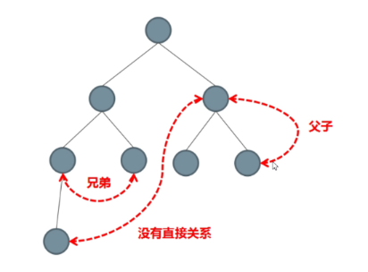

| 序号  | 组件关系       | 数据通信                       |
| ----- | -------------- | ------------------------------ |
| 1     | 父子关系       | 子传父：props ； 父传子：$emit |
| 2     | 非父子关系     | eventBus:   $on  +  $emit      |
| **3** | **非父子关系** | **vuex**                       |

和父子通信和兄弟通信类似，vuex也是一种组件通信解决方案

## 1.2. vuex是什么

[Vuex](https://vuex.vuejs.org/zh/) 是一个专为 Vue.js 应用程序开发的**状态管理模式**， 采用**集中式存储**管理应用的所有组件的状态，解决多组件数据通信

和vue-router一样，vuex与vue.js高度集成，属于vue的核心插件，用法过程是差不多的，都能都在dev-tools中调试

一句话：**Vuex 是 vue 项目中实现大范围数据共享的技术方案**

作用：能够方便、高效地实现组件之间的**数据共享**

好处：

1. 数据的存取一步到位，不需层层传递
2. 数据的流动非常清晰
3. 存储在 Vuex 中的数据都是响应式的

> localstorage中存的就是一个字符串，存和取需要json字符串的转换与解析。vuex是响应式（数据一变化，所有用到这个数据的地方就会会更新）的，可以和localStorage配合使用来实现数据缓存

**@表示src的绝对路径 @/component/... 不用一级一级去上级找**

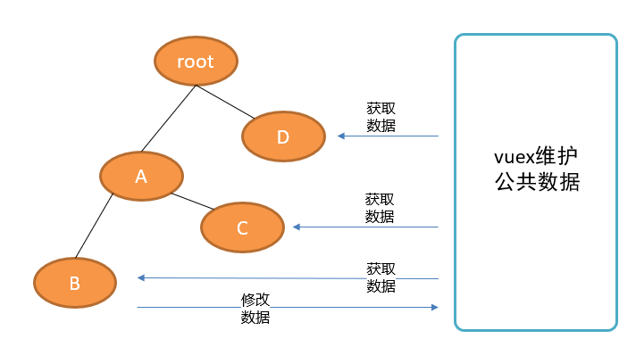

vuex是vue官方提供的独立于组件体系之外的，管理公共数据的工具

**大型项目必须使用vuex来集中管理数据！！！**

## 1.3. vuex的组成

vuex中有5个内容需要学习：

1. **state**： 统一定义公共数据（类似于data(){return {a:1, b:2，xxxxxx}}）
2. **mutations** ： 使用它来修改数据(类似于methods)
3. getters： 类似于computed(计算属性，对现有的状态进行计算得到新的数据-------派生  )
4. actions： 发起异步请求
5. modules： 模块拆分

其中最为重要的内容是state和mutations

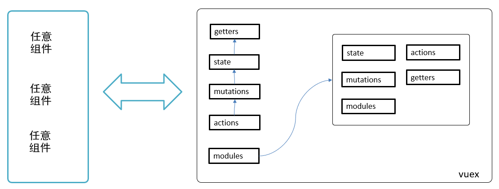

俗称：getters中每一个计算属性称为一个getter，mutations和actions类似

# 2. 在vue项目中使用vuex

完全相同

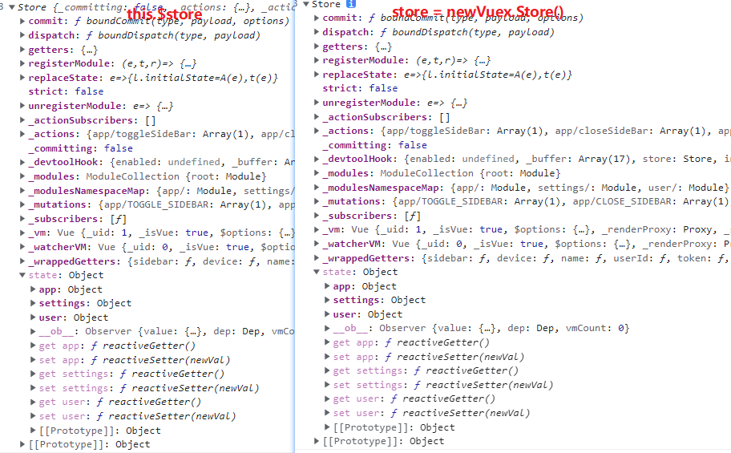

## 2.1. store对象控制台截图（VueComponent组件实例对象）

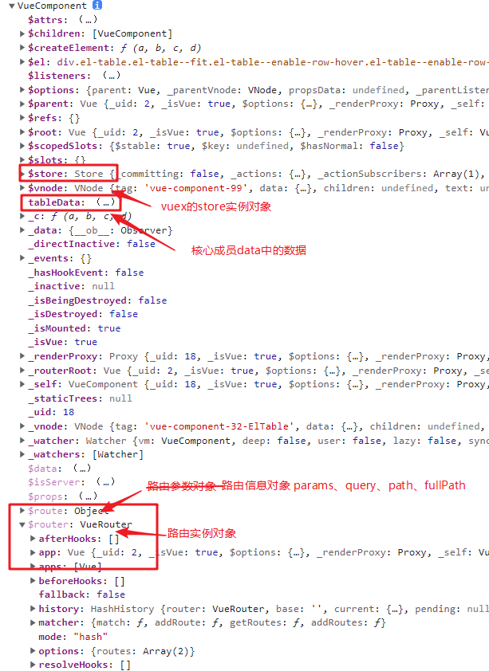

**store对象中**

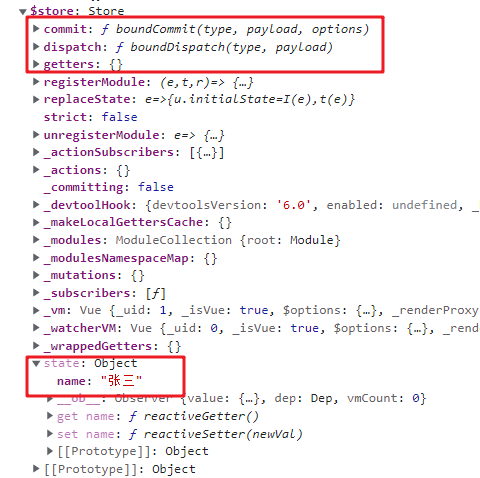

## 2.2. vuex的使用步骤（在旧项目中使用）

vuex有没有安装可以看package.json中的依赖有没有vuex，安好后可以查看浏览器dev-tools中的vuex是否存在

**以后项目开发都适用自定义脚手架，不需要这么麻烦**

第三方的vuex包，可以使用默认导入，也可以使用按需导入（导入辅助函数）

1. 下包（vue2只能下vuex第三版，最新版3.6.2）

   ```
   yarn add vuex@3.6.2
   ```

2. 封装store模块 新建src/store/index.js文件

   ```js
   // index.js
   // 1.下包yarn add vuex@3.6.2
   // 2.导入 vuex 和 Vue
   import Vuex from 'vuex' //Vuex它实际上是一个对象,里面包含了Store这一构造函数,
   import Vue from 'vue' //构造函数 
   
   // 3.安装插件
   Vue.use(Vuex)
   
   
   // 4.创建Store对象
   const store = new Vuex.Store({
   //这里写state、mutations、actions、getters、modules的配置信息
   })
   
   // 5.导出store对象
   export default store
   ```

3. main.js中，把store实例挂载到Vue实例上

   ```js
   // 1.引入store对象
   // 引入的是一个目录，则默认查找index.js的文件 建议vuex和vue-router都要分模块写，不然main.js里面的代码太多了
   import store from './store'
   
   // 2.挂到Vue对象上
   new Vue({
     render: h => h(App),
     store,//运用了对象的解构赋值
   }).$mount('#app')
   ```


> vue-router的使用也只是多了一个第四步路由规则数组，和第七步路由挂载

## 2.3. 附：vue-router的使用步骤（在旧项目中使用）

1. 装包

   ```bsh
   yarn add vue-router@3.5.3
   ```

2. 封装router模块 新建src/router/index.js文件

   ```js
   // 1.下包 yarn add vue-router@3.5.3
   // 2.导入vue和vue-router模块
   import Vue from 'vue'
   import VueRouter from 'vue-router'
   //这里需要提前导入页面组件，在路由规则数组中使用
   import HomeView from '../views/HomeView.vue'
   import About from '@/views/About.vue'
   
   // 3.安装核心插件（会在全局注册router-view和router-link两个组件）
   Vue.use(VueRouter)
   
   // 4.创建路由规则数组
   const routes = [
     {
       path: '/',
       name: 'home',
       component: HomeView
     },
     {
       path: '/about',
       name: 'about',
       component: About
     }
   ]
   
   // 5.创建路由实例对象，并把陆游对则数组配置在里面
   const router = new VueRouter({
     routes
   })
   
   // 6.导出路由对象router
   export default router
   
   ```

3. main.js中，把router实例挂载到Vue实例上

   ```js
   // 1.引入router对象
   // 引入的是一个目录，则默认查找index.js的文件 建议vuex和vue-router都要分模块写，不然main.js里面的代码太多了
   import router from './router'
   
   // 2.挂到Vue对象上
   new Vue({
     render: h => h(App),
     router,
   }).$mount('#app')
   ```

4. 在组件中（一般是使用router-link或者编程式导航的组件，项目内所有组件都可以，会自动去路由规则数组中去匹配）使用`<router-view></router-view>`作为路由挂载点，看渲染到哪里去

   ```html
   	<div class="nav_main">
         <router-link to="/find/recommend?name=张三&age=18">推荐</router-link>
         <router-link to="/find/ranking">排行榜</router-link>
         <!-- <router-link to="/find/songlist">歌单</router-link> -->
         <span @click="goto('/find/songlist','songlist')">二级编程跳转</span>
       </div>
   
   	<!-- 路由挂载点-->
       <div style="1px solid red;">
         <router-view></router-view>
       </div>
   ```

# 3. state-保存公共数据

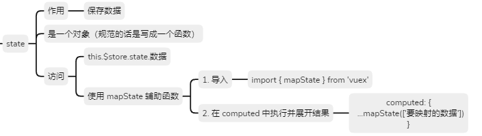

vuex用核心成员state来保存公共数据，用来存储全局共享的数据

* 在创建store对象的配置对象中设置即可
* 本质上是一个对象（里面的属性用点语法访问）
* 定义数据在对象中声明属性即可

> 组件的方法methods不存在vuex中，不具有复用性，vuex只存一些共享的数据（存在state中）（通用的计算属性存在getters中）

> vuex中的state数据，表单的双向绑定不能直接绑定vuex的数据，需要将vuex中的state深拷贝过来（一级对象直接展开运算符），然后表单数据userForm提交到后台，最后调用一下actions中方法，更新vuex最新的数据（本来vuex中state数据是从后台拿来的）

## 3.1. 定义state

state常见三种写法，一般就写成对象就可以了

```js
  // 子模块中的 state 规范是一个函数

// 1.function函数
  state：function(){
    return{
      cart: [
        { id: 1, name: '好吃的牛皮糖', price: 5 },
        { id: 2, name: '好吃的麦芽糖', price: 6 },
      ]
    }
  },
// 2.ES6简写，需要和data一样，return一个对象
  state(){
    return{
      cart: [
        { id: 1, name: '好吃的牛皮糖', price: 5 },
        { id: 2, name: '好吃的麦芽糖', price: 6 },
      ]
    }
  },
// 3. 箭头函数，外面用小括号包起来，免得对象的{}误认为了函数的{}，需要返回一个对象
  state: () => ({
    cart: [
      { id: 1, name: '好吃的牛皮糖', price: 5 },
      { id: 2, name: '好吃的麦芽糖', price: 6 },
    ]
  }),
// 4.常见写法，直接写成对象
  // state: {
  //   cart: [
  //     { id: 1, name: '好吃的牛皮糖', price: 3.5 }
  //   ]
  // },
```

语法：

```js
new Vuex.store({
  state: {
   属性名： 属性值 
  }
})
```

示例

```js
const store = new Vuex.Store({
    state: {
        count: 0,
        username: '张三',
        list: [{
            name: '1',
            isDone: false,
        }, {
            name: '2',
            isDone: false,
        }, {
            name: '3',
            isDone: true,
        }],
    },
}
```

## 3.2. 直接访问state中数据

* 模板template中：则可以省略`this`而直接写成： `{{$store.state.属性名}}`
* 组件script中：使用`this.$store.state.属性名`来访问

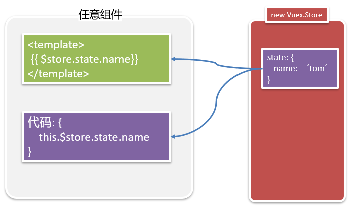

## 3.3. 使用辅助函数mapState访问state中数据

使用辅助函数mapState，将state中的变量映射到当前的组件中使用

当访问某个数据项嵌套太深了，用mapState把公共数据（vuex.store） 映射 到本组件内部的**计算属性**中，访问时就不需要访问store对象了

`...`展开运算符，将对象的属性展开放到computed对象中

使用步骤（**在任意页面组件使用都可以**）

```js
// 1. 导入辅助函数mapState，它是在vuex中定义的一个工具函数。
//  es6 按需导入 import { mapState } from 'vuex' 
import { mapState } from 'vuex'

computed: {
   // 说明1： ...对象 是把对象展开，合并到computed
   // 说明2： mapState是一个函数 
   //  ['数据项1'， '数据项2']
   // 说明3：是展开mapState函数调用的结果，而mapState函数调用的结果是包含函数的对象
   // xxx是全局state中的属性名
   ...mapState(['xxx'])，
   ...mapState({'新名字': 'xxx'})
}
```

返回结果截图

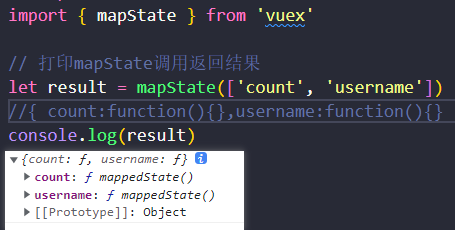

使用

* 模板template中：则可以省略`this`而直接写成： `{{属性名}}`

* 组件script中：使用`this.属性名`来访问

> 辅助函数mapState，适用于用的数据较多的情况，一个两个可以使用$this.store.state

**在vuex中的数据与本组件中的vue变量名重名时，可以对mapState返回的数据重命名**

语法：

```js
...mapState({'新名字1': 'xxx','新名字2': 'yyy',})
```

## 3.4. 在dev-tools中查看state

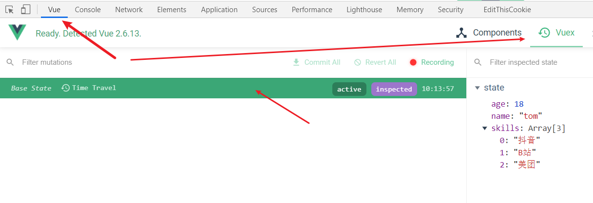

# 4. mutations-修改公共数据

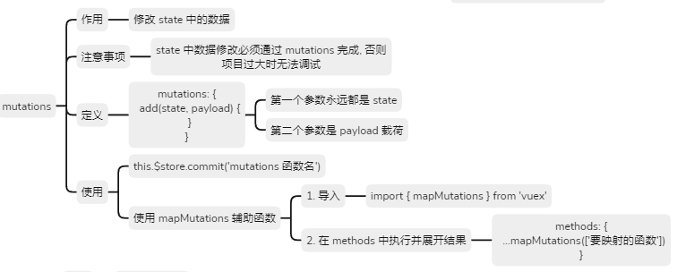

mutations变更、变异，它是Vuex中用来**修改公共数据**的唯一入口

> 可以使用this.$store.state.count去修改但是Vuex不推荐，强烈禁止！
>
> 需要知道是谁改的，mapState映射的数据在计算属性中是个函数也不能修改，推荐使用mutations修改，将来监听mutations，数据修改来源唯一性，调式很方便，可以在dev-tools中清楚看到数据的修改

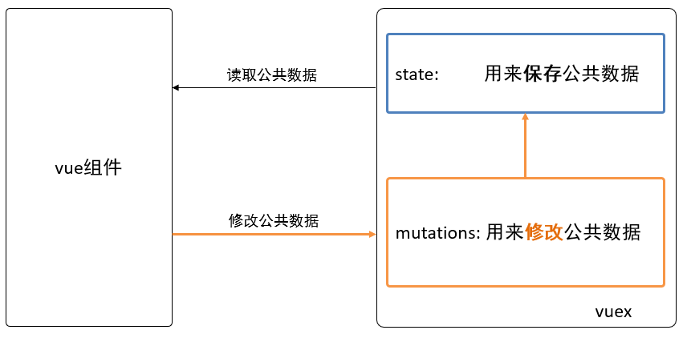


## 4.1. 定义mutations

每一个mutation方法的参数

* 形参1：必须是state（当然名字可以改，习惯就用state）由系统帮我们传入实参（需要操作state）

* 形参2：可选，表示载荷，常用名payload，如果传入多个值，需要定义为一个对象

后面定义的形参无效，如果不小心定义了则统一为undefined

语法：

```js
new Vue.store({
  // 省略其他...
  mutations：{
    // 每一项都是一个函数，可以声明两个形参，第二个参数payload是可选，只能有一个载荷
  	mutation名1：function(state [, 载荷]) {
  
    },
    // 常用ES6简写函数形式
    mutation名1(state [, 载荷]) {
  
    },
    mutation名2：function(state [, 载荷]) {
  
    },
	}
})
```

示例：

```js
mutations: {
        add(state, payload, more) {
            // more无法接收到数据，因为payload只能有一个，如果需要传递多个数据，需要定义成对象，并不会报错，形参未传值就是undefined
            // state、payload 是函数形参，名字可以随便取，但是习惯就是这样取名
            //state.count += payload
            state.count += payload.num

            // console.log(more)
        }
    },
```

## 4.2. 直接调用mutations中方法

* 模板template中：则可以省略`this`而直接写成： `$store.commit('mutation名', 实参)`
* 组件script中：使用`this.$store.commit('mutation名', 实参)`来访问

如果实参是多个，需要定义成对象传进去，`{ name: '张三', age: 24 }`

这里的commit是固定的方法

Vuex 中的 mutation 非常类似于事件：每个 mutation 都有一个字符串的 **事件类型 (type)** 和 一个 **回调函数 (handler)**。这个回调函数就是我们实际进行状态更改的地方，并且它会接受 state 作为第一个参数 `this.$store.comit({type: 'mutations的名字'})`用得不多

## 4.3. 使用辅助函数mapMutations调用mutations中方法

使用mapMutations辅助函数，将mutations中的mutation映射到当前的组件中使用

mapState辅助函数，就是让我们简单去使用，封装了我们需要写的一些东西，mapMutations内部就是帮忙调用了commit方法，但是远不是把原来mutations中的函数搬过来，因为不知道怎么拿到state对象 

用法同mapState

使用步骤（在任意vue组件可以使用，**注意在methods中定义**）

```js
// 1. 导入辅助函数mapMutations，它是在vuex中定义的一个工具函数。
//  es6 按需导入 import { mapMutations } from 'vuex' 
import { mapMutations } from 'vuex'

methods: {
   //  ['数据项1'， '数据项2']
   ...mapMutations(['add']), //一般写在最前面，和mapState的原理一样
}
```

注意使用的时候直接`add(实参)`这里的实参就是mutations中add的形参的payload，state由系统帮我们调用了，相当于内部调用了commit方法

## 4.4. mutation调用另一个mutation方法

modules中的mutation中的this指向的是外面一整个大的store实例，即$store，直接this.comiit(xx)，和在外面组件中调用mutation一样，当然也可以调用actions

actions中的方法中的this也是store实例

> mutation中的payload一般会用具体的形参名，比如goods

# 5. actions-执行异步函数

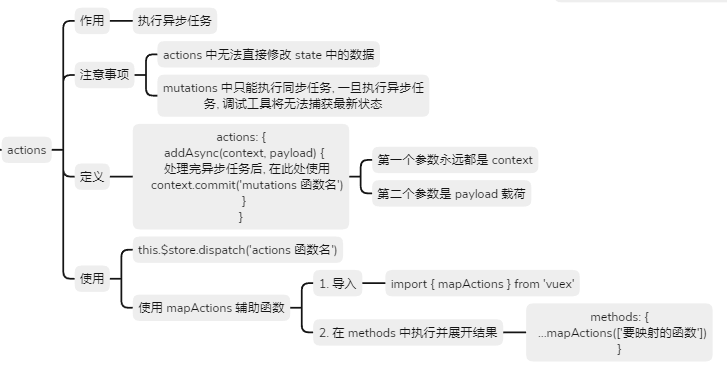

**现在操作数据一定要弄清楚数据是不是存在vuex中作为共享数据，或者放在具体的组件中作为私有数据，异步请求后台的数据需要封装方法放在actions中，调用的话一般首次使用该vuex数据的created钩子中（首页页面组件）**

在项目开发中，为了保证Store中状态的每一次变化都是可追踪的，Vuex 规定：Mutation必须是同步函数。否则，vue-devtools 将无法正常追踪Store中数据的变化，这对大型项目的开发调试是灾难性的！

mutations必须是同步函数，不然devtools监视不到数据的实时变化，state中的数据一定有数据是异步请求来的 发ajax得到的（**记住所有数据的修改都要经过mutations成员！！**）

actions负责拿到数据，拿到后就是同步操作了，再交给mutations来操作state的数据


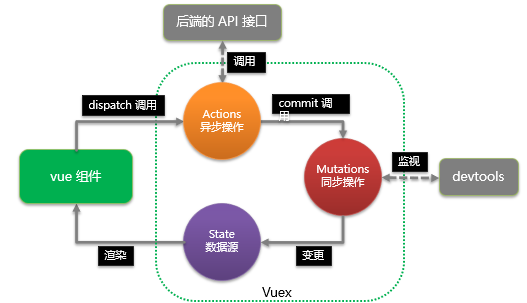

## 5.1.定义actions

语法：

* 参数1：store实例对象（要调用mutations），名字常用`context`
* 参数2：载荷，名字常用`payload`，多个值用对象定义

用法和mutations一样，多的一步是需要触发mutations中的方法（**通常需要自己额外定义一个**）

```js
new Vuex.store({
  // 省略其他...
  actions: {
    // context对象会自动传入，类似于store实例，可以调用相关的方法和属性
    action的名字: function(context, 载荷) {
      // 1. 发异步请求, 请求数据
      
      // 2. commit调用mutation来修改数据
      
      // context.commit('mutation名', 载荷)
    }
  }
})
```

**context可以解构 `getInfo({ commit },payload)`**

**context对象**

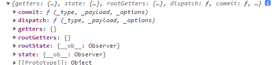

actions对象中，拿不到mutations的方法，vue帮忙传了当前new出来的store实例对象（用方法的形参传过来，和mutations中传state差不多），context：上下文对象  就是store实例和this.$store拿到的对象一样

> 子模块中actions中中的函数中context访问state直接`context.state.变量名`（其他访问子模块中的数据`this.$store.state.子模块名.变量名`），访问mutations中的方法，直接`context.commit('mutation名',实参)`在同一个模块中

示例：

```js
mutations: {
        add(state, payload, more) {
            // more无法接收到数据，因为payload只能有一个，如果需要传递多个数据，需要定义成对象，并不会报错，形参未传值就是undefined
            // state.count += payload.num
            state.count += payload
            // console.log(more)
        }
    },
actions: {
        // 1.定义actions函数
        // 可以传递payload 和mutations的用法一模一样
        asyncAdd(context, result) {
            // 2.开启异步任务
            setTimeout(() => {
                // let result = 1
                // 3.获取到结果后交给mutations去操作state
                // 这里的commit跟之前点击按钮直接调用mutation的方法相同

                // 这里参数相当于传了两次，先从组件传过来给result再传给mutation中add方法的payload
                context.commit('add', result)
            }, 1000);

            // actions中的asyncAdd方法的触发需要用dispatch方法来调用（比如点击事件的事件处理函数$store.dispatch('asyncAdd')）--> 或者借助mapActions
        }
    },
```

> 需要额外定义一个action来放异步函数，同时需要设置一个mutation来操作数据到state

## 5.2. 直接调用actions中的方法

* 模板template中：则可以省略`this`而直接写成： `$store.dispatch('action名', 实参)`
* 组件script中：使用`this.$store.dispatch('action名', 实参)`来访问

如果实参是多个，需要定义成对象传进去，`{ name: '张三', age: 24 }`

> actions中的函数触发一般是在主页面的created钩子中触发

## 5.3. 使用辅助函数mapActions调用Actions中方法

使用mapActions辅助函数，将actions中的action映射到当前的组件中使用

使用步骤（定义在methods中）：

```js
// 1. 导入辅助函数mapActions，它是在vuex中定义的一个工具函数。
//  es6 按需导入 import { mapActions } from 'vuex' 
import { mapActions } from 'vuex'

methods: {
   //  ['数据项1'， '数据项2']
   ...mapActions(['asyncAdd']), //一般写在最前面，和mapState、mapMutations的原理一样
}
```

注意使用的时候直接`asyncAdd(实参)`这里的实参就是actions中asyncAdd的形参的payload，context由系统帮我们调用了，相当于内部调用了commit方法

> action中的payload一般会用具体的形参名，比如goods

# 6. getters-全局计算属性

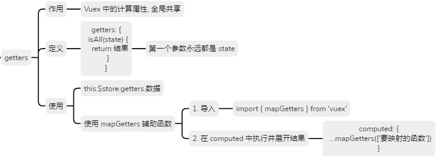

getters是一个对象，里面的成员叫getter，一个getter就是一个全局的计算属性

问题：组件中的计算属性复用性比较低，如果有多个组件需要用到此计算属性，我们需要在多个组件之间复制、粘贴这个函数

Getter 本质上是 JavaScript 函数

作用：它是 Vuex 中的计算属性，当 Store 数据源发生变化时，Getter 的返回值会自动更新

在state中的数据的基础上，进一步对数据进行加工得到新数据。(与组件中computed一样)

> getters虽然类似于计算属性，但是没有set()的用法，就只有简单写法，记得一定要return一个值

## 6.1. 定义getters

语法：

参数1：state，变量名常用state，由vuex帮我们调用

参数2：getters，当前模块的getters，是一个由当前module的所有getter组成的对象，可以用来当前getter访问另一个getter

```js
new Vuex.store({
  // 省略其他...
  getters: {
    // state 就是上边定义的公共数据state
    getter的名字1: function(state) {
      return 要返回的值
    }
  }
})
```

示例：

```js
getters: {
        // 拿不到state的值系统传一个state进来
        isAllDone(state) {
            // 计算属性都必须有返回值
            return state.list.every(item => item.isDone)
        }
    }
```

## 6.2. 直接调用getters中的方法

* 模板template中：则可以省略`this`而直接写成： `{{$store.getters.getter名}}`
* 组件script中：使用`this.$store.getters.getter名`来访问

## 6.3. 使用辅助函数mapGetters调用getters中的方法

使用mapGetters辅助函数，将getters中的getter映射到当前的组件中使用

使用步骤（在任意vue组件中可以使用）

```js
// 1. 导入辅助函数mapGetters，它是在vuex中定义的一个工具函数。
//  es6 按需导入 import { mapGetters } from 'vuex' 
import { mapGetters } from 'vuex'

computed: {
   //  ['数据项1'， '数据项2']
   ...mapGetters(['isAllDone']), //一般写在最前面，和mapState、mapMutations、mapGetters的原理一样
}
```

## 6.4. 使用全局getters来映射模块里的state数据

通常使用全局getters来映射modules里面state的数据，来简化代码，达到快捷访问

```js
// 或者新建一个全局getters文件夹，里面用index.js
// 快捷访问
export default {
  token: (state) => state.user.profile.token
  //token(state){
  //    return state.user.profile.token
  //}

```

# 7. 使用vuex-persistedstate插件来使vuex中state数据持久化

背景：vuex中如果初始是空字符串，其中操作state的数据只能是临时存储，数据一刷新就没有了

以前使用localStorage的setItem和getItem方法来本地存储持久化

缺点：每次存都要转换成字符串，取出来也来解析，太麻烦

现在使用vuex-persistedstate插件来使state数据持久化

**好处：自动将vuex中的所有数据存储到localStorage，页面加载时自动读取，数据更新自动同步到localStorage**

> 插件适合于vue2，目前已不再维护，下载时不用指定版本最新存在npm中的包版本就是适配vue2的最新版本，vue3中已经废弃，有更好的替代品

步骤（在store的index.js中配置）：

1. 下包

   ```js
   yarn add vuex-persistedstate
   ```

2. 导入（一个函数）

   ```js
   import createPersistedState from 'vuex-persistedstate'
   ```

3. 安装插件

   ```js
   export default new Vuex.Store({
     // 3.安装插件
     plugins: [createPersistedState()],
     state: {
     },
     modules: {
       user
     }
   })
   ```

# 8. modules-来拆分复杂业务

还有一些rootState、rootGetters、this也要知道

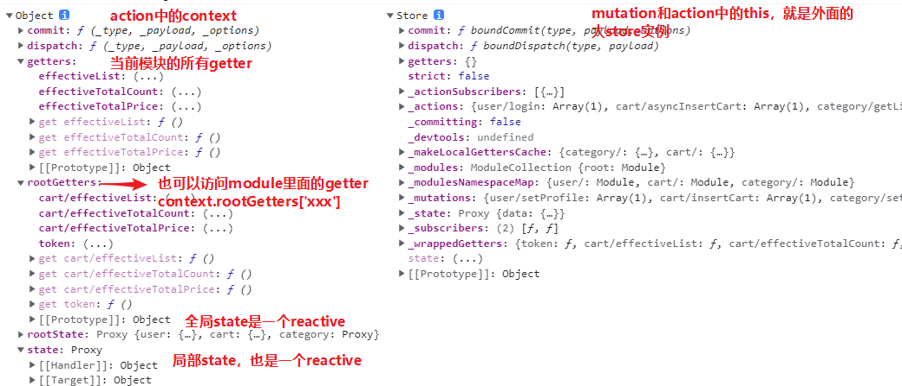

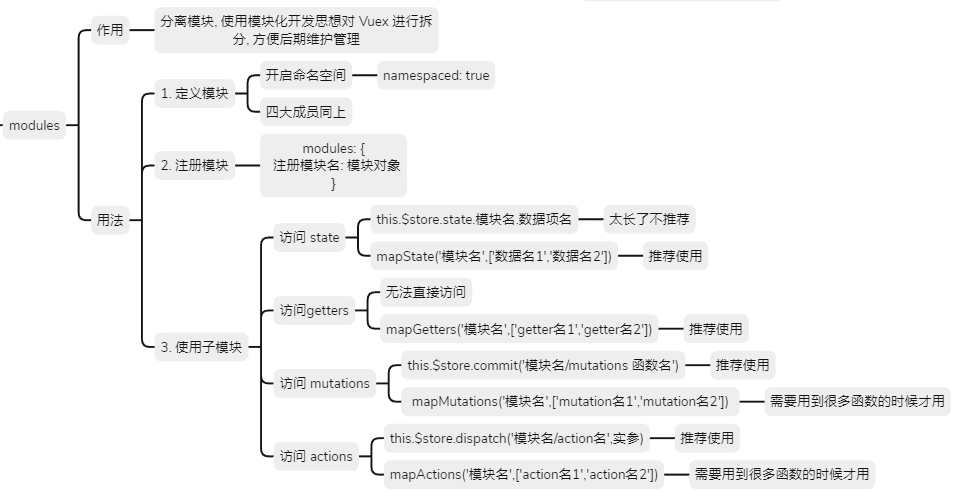

随着项目越来越大，需要放在vuex中的数据越来越多，整个store/index.js中代码会越来越长，怎么办呢？，都定义在了`new Vuex.Store({xxx})`的配置对象中

所有的全局数据、方法都集中在了一起，导致Vuex 的结构混乱，不利于现阶段的开发和后期的维护

> **分的模块的这四个核心成员最后还是都集成到了new Vuex.Store({xx})的配置对象中**

语法：

```js
export default new Vuex.Store({
  // state: 用来保存所有的公共数据
  state: {},
  getters: {},
  mutations: {},
  actions: {},
  modules: {
  	模块名1： {
    		// namespaced为true，则在使用mutations时，就必须要加上模块名
      	namespaced: true, 
  		  state: {},
  			getters: {},
  			mutations: {},
  			actions: {},
  			modules: {}
  	}，
    模块名2： {
        // namespaced不写，默认为false，则在使用mutations时，不需要加模块名
  		  state: {},
  			getters: {},
  			mutations: {},
  			actions: {},
         modules: {}
  	}  
  }
})

```

不加namespaced，调用mutation不加模块名的话会匹配到所有的mutation，造成混乱。

## 8.1. 定义modules

modules对象里面的模块名称很重要（开启命名空间是使用`模块名/方法名`调用），子模块不能定义在index.js文件中，这样所有的子模块都定义在其中的话，导致index.js这个文件很大，新建文件就可以，所以开发常用抽离出一个js文件

进一步对文件进行划分

```bash
|--store /
|------- index.js # 引入模块
|------- modules
|-------------- / mod1.js # 模块1
|-------------- / mod2.js # 模块2
```

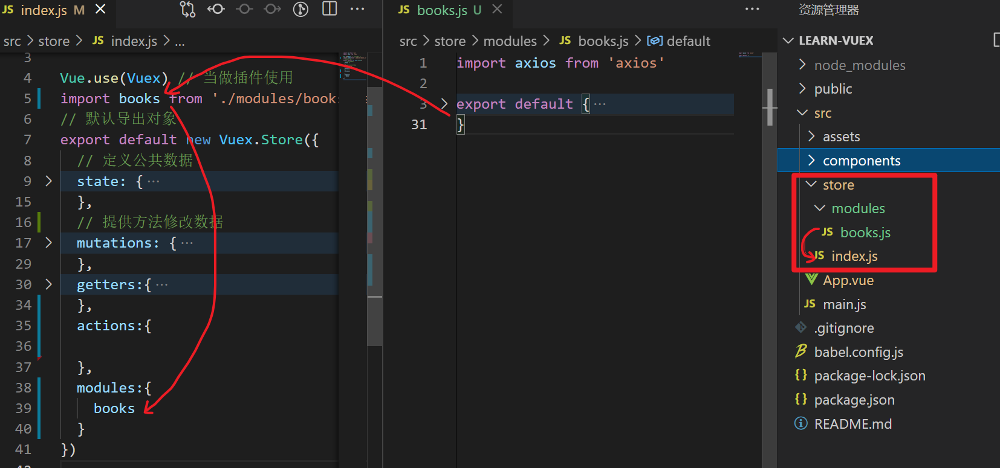

子模块mod1.js需要使用默认导出

```js
export default {
    // 开启命名空间
    // 作用：为了让每个子模块之间互不干扰
    // 建议开启
    namespaced: true,

    // 子模块中的state规范上是一个函数，但是这里写对象也可以（建议写成对象方便些同其他成员保持一致，具体还是看研发团队的要求）

    state: {},
    mutations: {},
    actions: {},
    getters: {}
}
```

store下的index.js需要引入mod1.js

```js
// 1.下包yarn add vuex@3.6.2
// 2.导入vuex
import Vuex from 'vuex' //Vuex它实际上是一个对象,里面包含了Store这一构造函数,
import Vue from 'vue' //构造函数 

// 3.安装插件
Vue.use(Vuex)

// 导入子模块
import shopcar from './modules/mod1.js'

// 4.创建Store对象
const store = new Vuex.Store({
    // 注册子模块
    modules: {
        // 模块名：模块对象
        mod1
    }
})

// 5.导出store对象
export default store
```

> Vue>store>mod1（App.vue中抽离出来store文件夹下的index.js文件，再从index.js中文件中抽离出子模块，记得相应的导入导出）

$store.commit('test')会调用所有子模块中的mutations中的test方法，没有隔离子模块。使用命名空间解决，namespaced（命名空间）可以解决不同模块之间成员名称冲突的问题。

**在实际项目开发中，建议为每个Module模块都开启命名空间！**`namespaced:true`，

## 8.2. 访问子模块

开启了命名空间后，此时，模块内的成员需要通过模块的注册名称才可以访问到

1. 访问子模块的state
   * 直接访问（太长了不适合开发）` this.$store.state.模块名.数据项名`
     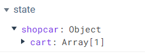
   * 辅助函数访问（推荐使用）  `computed:{ ...mapState('模块名',['数据名1','数据名2']) }`，然后映射过来的数据和本vue文件的vue变量使用方法一样，直接`this.数据名`用就行
2. 访问子模块的mutations
   * 直接访问（推荐使用） `this.$store.commit('模块名/mutations名',实参)`实参就是payload
   * 辅助函数访问 `methods:{ ...mapMutations('模块名',['mutation名1','mutation名2']) }`然后映射过来的数据和本vue文件的vue变量使用方法一样，直接`this.mutation名(实参)`用就行，这里的实参就是payload，内部帮忙调用了commit
3. 访问子模块的actions
   * 直接访问（推荐使用）`this.$store.dispatch('模块名/action名',实参)`实参就是payload
   * 辅助函数访问 `methods:{ ...mapActions('模块名',['action名1','action名2'])}`然后映射过来的数据和本vue文件的vue变量使用方法一样，直接`this.action名(实参)`用就行，这里的实参就是payload，内部帮忙调用了dispatch
4. 访问子模块的getters
   * 直接访问，不能通过`$store.getters.shopcar.isAll`访问
	 可以访问`store.getters['module名/getter名']`
   
    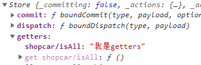
   * 辅助函数访问（目前只能通过辅助函数访问子模块中的getters，另一种方法比较复杂）`computed:{...mapGetters('模块名',['getter名1','getter名2'])}`然后映射过来的数据和本vue文件的vue变量使用方法一样，直接`this.getter名`用就行，这里的实参就是payload，内部帮忙调用了dispatch

不划分子模块和划分子模块的用法，就是多了一个模块名，其他各种使用都需要加上子模块名

# 9. 小结


## 9.1. 划分子模块的意义

为什么要使用 modules 来分子模块?

如果不分子模块, 后期业务量大了之后, 所有的数据都要放到全局 state 中存储, 所有的 state 都有配套的 mutations / actions / getters, 维护起来难度太大

划分子模块后, 每个模块都可以把自己的数据放到其中, 配套的 mutations 等都可以独立在自己模块内, 方便后期维护

**在中大型项目中一定会分子模块！**

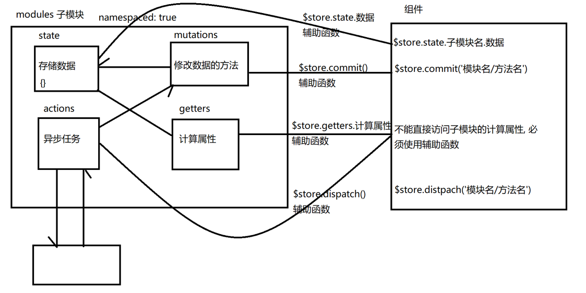

```js
// 1. 按需导入 mapState, mapMutations, mapActions, mapGetters 辅助函数
import { mapState, mapMutations, mapActions, mapGetters } from 'vuex'

export default {
  name: 'Left',
  // 2. 在计算属性中, 调用 mapState 并将其结果展开
  computed: {
    // ...mapState() 展开的是 mapState 调用的结果
    ...mapState(['count', 'username']),
    ...mapGetters(['isAllDone'])
  },
  methods: {
    // 2. 在 methods 中调用 mapMutations 和 mapActions 并将其结果展开
    // mapMutations 调用得到的结果: 
    // { add: function() {} }
    ...mapMutations(['add']),
    ...mapActions(['asyncAdd']),
    btnClick() {
      // 用户点击按钮, 调用 mutations 中的 add 方法
      // 实现 count 自增
      this.$store.commit('add', 1)

      // 不要直接修改 state 中的数据
      // this.$store.state.count++
    }
  }
}
```

> 在子模块的actions中访问本子模块的mutations中的函数，不需要使用子模块名了，`context.commit('mutation名',payload)`

如何划分子模块?

1. 定义子模块 -> 创建一个对象, 对象中有四个核心成员(state, mutations, actions, getters)

2. 注册子模块 -> 在全局的 modules 节点下配置, 模块名: 子模块对象

## 9.2. 直接访问

开启命名空间:在子模块中 `namespaced: true`

注意事项: 开启命名空间后, 无法直接访问 getters 的内容

state: `$store.state.子模块名称.子模块数据项`

mutations:` $store.commit('子模块名称/子模块 mutations 函数名')`

actions: `$store.dispatch('子模块名称/子模块 actions 函数名')`

> * mutation因为要修改state中数据，所以第一个参数是state（可以直接修改state），可以传实参给payload
>
> * action因为要调用mutation，所以第一个参数是context，可以context.commit('mutation名',实参)调用（不用加模块名），可以传实参给payload
>
> * getter因为是基于state中计算而来，所以第一个参数是是state，记得一定要return，一般就只有state一个参数（不能修改state）

## 9.3. 辅助函数访问

使用步骤

1. 按需导入辅助函数(mapState mapMutations mapActions mapGetters)

2. 在对应的节点下(computed / methods)调用辅助函数并将结果展开

辅助函数使用数组来映射一个或者多个

* state和getters是存放数据的，映射在computed中

* mutations和actions是方法来操作数据的，映射在methods中

辅助函数一般写在核心成员的最前面

使用了子模块。commit和dispatch中需要`模块名/方法名`找到具体的方法，辅助函数展开时只需要写`模块名`找到具体的模块展开即可

> 如果 mutations 或 actions 函数在组件中只用一两次, 可以采用直接访问的方法


## 9.4. 访问vuex四大核心成员

使用对象`({'新名字': 'xxx'})`代替原来的数组来使用时取新名字

### 如何使用全局state

 - 直接使用： this.$store.state.xxx; 

 - map辅助函数：

   ```js
   computed: { 
     ...mapState(['xxx']), 
     ...mapState({'新名字': 'xxx'})
   }
   ```

### 如何使用modules中的state

 - 直接使用： this.$store.state.模块名.xxx; 

 - map辅助函数：

   ```js
   computed: { 
     ...mapState('模块名', ['xxx']), 
     ...mapState('模块名', {'新名字': 'xxx'})
   }
   ```

### 如何使用全局getters

 - 直接使用：`this.$store.getters.xxx`

 - map辅助函数：

   ```js
   computed: { 
     ...mapGetters(['xxx']), 
     ...mapGetters({'新名字': 'xxx'})
   }
   ```

### 如何使用modules中的getters

 - 直接使用（不使用）：这样使用 `this.$store.getters.模块名.xxx`会报错

 - map辅助函数：

   ```js
   computed: { 
     ...mapGetters('模块名', ['xxx']), 
     ...mapGetters('模块名',{'新名字': 'xxx'})
   }
   ```

### 如何使用全局mutations

 - 直接使用：`this.$store.commit('mutation名', 参数)`

 - map辅助函数：

   ```js
   methods: { 
     ...mapMutations(['mutation名']), 
     ...mapMutations({'新名字': 'mutation名'})
   }
   ```

### 如何使用modules中的mutations（namespaced:true）

 - 直接使用： `this.$store.commit('模块名/mutation名', 参数)`

 - map辅助函数：

   ```js
   methods: { 
     ...mapMutations('模块名', ['xxx']), 
     ...mapMutations('模块名',{'新名字': 'xxx'})
   }
   ```

### 如何使用全局actions

 - 直接使用：`this.$store.dispatch('action名', 参数)`

 - map辅助函数：

   ```js
   methods: { 
     ...mapActions(['actions名']), 
     ...mapActions({'新名字': 'actions名'})
   }
   ```

### 如何使用modules中的actions（namespaced:true）

 - 直接使用： `this.$store.dispatch('模块名/action名', 参数)`

 - map辅助函数：

   ```js
   methods: { 
     ...mapActions('模块名', ['xxx']), 
     ...mapActions('模块名',{'新名字': 'xxx'})
   }
   ```

# 10. shopcar_购物车案例

本案例在05. vue组件生命周期中做过，这里改用vuex来操作数据，并且划分modules子模块来拆分业务

划分子模块的流程图：main.js里面的store对象分出一个store文件夹下的index.js，然后store对象里面的配置需要划分子模块（记得开启命名空间）划分的子模块也放在store文件夹中

store文件夹下的index.js也叫vuex模块向外默认导出store对象

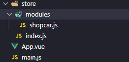

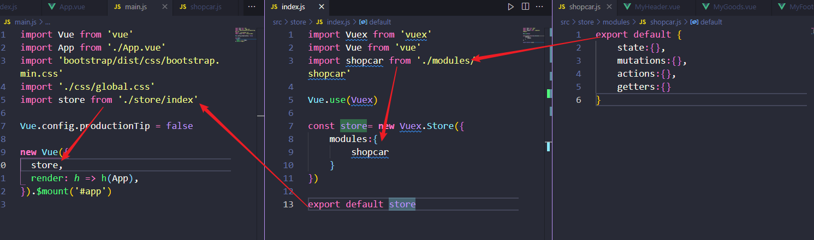

项目从git克隆下来（克隆下来自动建立远程本地关联，pull需要先关联）后，第一步就是执行`yarn`命令下载package.json中的第三方依赖

main.js是整个项目的入口文件，需要导入vue模块，App模块，全局css样式，vuex的store对象（vuex模块），router路由模块

## 10.0. 项目初始化

1. 下包
   * 需要执行`yarn`命令先下载package.json中的第三方依赖

   * 然后执行`yarn add xxx`下载axios、vuex@3.6.2

2. 并在全局导入axios，并将axios挂载到Vue原型上，供所有组件访问`$axios`或者`$http`注意js文件中无法访问到这些挂在Vue原型上的方法，需要自己额外导入。当然在main.js入口文件中，所有的模块都已经导入了。可以直接使用`Vue.prototype`

**本案例思想：子组件通过App.vue为中转站，shopcar的勾选状态交给父组件App.vue去操作，可以让子组件shopcar的复用性更高，状态变了我告诉父组件，父组件怎么处理跟我无关。这是封装组件的思想**

另外还有内聚思想：对同一数据多次操作时，尽量放在同一个地方进行

数据分模块本来就是数据独立，如果在三个或多个模块都要使用，就放到一个模块中就行（直接在store文件夹的index.js中的new Vuex.Store({xxx}}中配置state）

## 10.1.  获取并渲染数据

1. 在actions中定义获取数据的方法
2. 获取数据后交给mutations存入state（新创建一个mutation方法）
3. 在App组件内created钩子中触发actions发请求，就是调用函数（可以将发请求封装在api模块中）
4. 在App组件内使用mapState映射购物车数据到组件中
5. 使用v-for循环渲染数据 

初始化数据的时候习惯给state给一个初始值，然后为空数组`state:{ cart:[] }`

```js
//shopcar.js
import { getData } from '@/Api/Api'
export default {
    namespaced:true,
    state:{
        cart:[]
    },
    mutations:{
        setInitData(state,payload){
            state.cart=payload
        }
    },
    actions:{
        async getInitData(context){
            const {data:res}=await getData()
            console.log(res)
            context.commit('setInitData',res.list)
        }
    },
    getters:{}
}

// Api.js
import axios from 'axios'
export const getData=()=>axios.get('https://www.escook.cn/api/cart')

// App,vue
import {mapState} from 'vuex'
export default {
  name: 'App',
  created(){
    this.$store.dispatch('shopcar/getInitData');
  },
  computed:{
    ...mapState('shopcar',['cart'])
  }
}
```

> 封装请求api模块 发送axios，，封装一个api模块，项目中所有接口都封装在其中，万一有某个接口有轻微改变，修改维护更加的方便

## 10.2. 改变商品选中状态和购买数量

在MyGoods中不能使用v-model直接修改父组件传递的数据，即便传递的是对象，也不能直接修改（因为所有Vuex的数据修改，必须经过mutations）

1. 在mutations中定义函数，updateState

2. 在stateChange事件触发时调用updateState，修改vuex的数据

3. 点击加减按钮触发 updateCount 函数，根据id修改 vuex 中商品的数量

以前是表单v-model直接绑定input，小选框的状态是和数组中的变量绑定的，因为数据是存在vuex中的，如果使用v-model，勾选时会直接修改变量（不行，需要mutations中修改）而全选框则是根据小选框的状态变化，可以v-miodel绑定一个计算属性，set返回给mutations处理，get拿到state数据来计算

```js
// shopcar.js
export default {
    namespaced:true,
    state:{
        cart:[]
    },
    mutations:{
        updateState(state,payload){
            const index =state.cart.findIndex(item=>item.id===payload.id)
            state.cart[index].goods_state=payload.value
        },
        updateCount(state,payload){
            const index =state.cart.findIndex(item=>item.id===payload.id)
            state.cart[index].goods_count=payload.value
        }
    }
}

// MyGoods.vue
<input type="checkbox" class="custom-control-input" :id="id" :checked="state" @change="onCheckedChange">

<button class="btn btn-light" @click="onBtnClick(-1)">-</button>
<span class="count">{{count}}</span>
<button class="btn btn-light" @click="onBtnClick(1)">+</button>

methods: {
    // 监听选中状态变化的事件，input多选框被选中或取消选中时触发
    onCheckedChange(e) {
      // 触发自定义事件，把最新的状态传递给组件的使用者
      this.$emit('stateChange', {
        id: this.id,
        value: e.target.checked,
      })
    },
    // 按钮的点击事件处理函数
    onBtnClick(step) {
      // 如果新值 < 1，则不进行任何处理
      if (this.count + step < 1) {
        return
      }
      // 把最新的 count 值传递给组件的使用者
      this.$emit('countChange', {
        id: this.id,
        value: this.count + step,
      })
},
    
// App.vue  子组件来触发父组件的子定义事件，由父组件App.vue来统一发布号令，触发vuex中的方法
<my-goods 
    // 一个个传是为了单向数据流来限制子组件直接修改引用数据
    v-for="item in cart" :key="item.id"
      :id="item.id" 
      :title="item.goods_name" 
      :thumb="item.goods_img" 
      :price="item.goods_price" 
      :count="item.goods_count" 
      :state="item.goods_state"
      @stateChange="getState" 
      @countChange="getCount"></my-goods>

methods: {
    // 商品的选中状态发生了变化
    getState(e) {
      // {id: 1, value: false}
      console.log(e)
      this.$store.commit('shopcar/updateState',e)
    },
    // 商品的数量发生了变化
    getCount(e) {
      // {id: 1, value: 2}
      console.log(e)
      this.$store.commit('shopcar/updateCount',e)
    },
  },
```

e.target是返回触发此事件的元素（事件的目标节点)，e是事件对象，里面存有一些属性和方法，其他的属性大部分是事件被触发时鼠标或者键盘的行为。e需要template中不传事件参数，在methods中第一个参数写e就是事件对象，如果需要事件传参，用$event解决

## 10.3. 全选框的选中状态

绑定一个计算属性，get()中返回全选框的布尔值，用state中的数据，set() 中不能直接修改state中的值，通过mutations，值传过去改

全选框可以绑定v-model是因为，是他绑定的数据并不是vuex中的数据，即使做了修改也不会直接修改vuex中的数据，只需要触发mutations就可以来同步修改state中数据

```js
// shopcar.js
mutations:{
        updateAllState(state,payload){
            state.cart.forEach(item=>item.goods_state=payload)
        }
    },

// MyFooter.vue
<input v-model="isAll" type="checkbox" class="custom-control-input" id="fullcheck">
    
import {mapGetters} from 'vuex'
export default {
  name: 'MyFooter',
  computed:{
    ...mapGetters('shopcar',['isAllSel']),
    isAll:{
      set(val){
        this.$store.commit('shopcar/updateAllState',val)
      },
      get(){
        return this.isAllSel
      }
    }
  }
}
```

基本上每操作一次state数据都要重新新建衣蛾mutation方法，导致mutation越来越多，所以划分模块很有必要！

## 10.4. 总价和总数量

在getters中定义，然后用 mapGetters 在Footers中展开导入

```js
// shopcar.js
 getters:{
        totalCount(state){
            return state.cart.filter(item=>item.goods_state).reduce((sum,item)=>sum+item.goods_count,0)
        },
        totalPrice(state){
            return state.cart.filter(item=>item.goods_state).reduce((sum,item)=>sum+item.goods_count*item.goods_price,0)
        }
    }

// MyFooter.vue
<span class="price">￥{{totalPrice}}</span>
<button class="btn btn-primary btn-settle">结算（{{totalCount}}）</button>

import {mapGetters} from 'vuex'
export default {
  name: 'MyFooter',
  computed:{
    ...mapGetters('shopcar',['isAllSel','totalCount','totalPrice']),
    }
  }
}
```


