有需求就去看官网有没有对应的组件，官网怎么使用的

# ElementUI 组件教学（参考）

## 了解常见组件库及使用流程

### 目标

了解一些常见的Vue组件库

### 前端项目分类

移动端（h5页， 小程序）

PC端

### 常见的vue技术栈组件库

* 移动端（[Vant](https://vant-contrib.gitee.io/vant/#/zh-CN/), [Cube-UI](https://didi.github.io/cube-ui/#/zh-CN/docs/introduction),  [NutUI](https://nutui.jd.com/#/index) ）
* PC端 （ [element-ui](https://element.eleme.cn/#/zh-CN), [Ant Design of Vue](https://www.antdv.com/docs/vue/introduce-cn/), [iView](http://v1.iviewui.com/)）
* 小程序: [uniapp](https://uniapp.dcloud.io/select)

antd--React使用的最多，最近也支持了vue。是蚂蚁金服维护的组件库，属于阿里巴巴

### 组件库的基本使用流程

1. 根据项目的实际情况，进行技术选型： 用什么技术栈，用**什么组件库**

2. 去对应的**官方**上**查文档**

3. **遇到困难时**：

   1. 在官网上找 **常见问题**(一般在网页的最底部)

      下图是[element官网](https://element.eleme.io/#/zh-CN)上的截图

   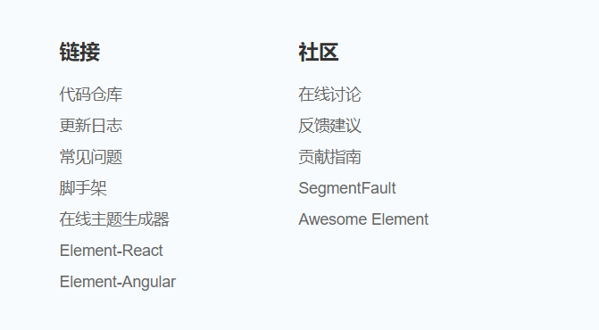

   2. 在社区/搜索引擎 找答案
   3. 去提[issue](https://github.com/ElemeFE/element/issues?page=3&q=table)  ，面对面直接向组件的作者提问
   4. 改源码（提pr  pull request，作者觉得正确就会合并你的pr）

### 小结

* vue技术栈有很多的组件库（一般大厂才会维护组件库）
* 组件库要分移动端和PC端
* 学习组件库的基本方法是查文档，遇到困难时提 issue

## 创建项目并引入element组件库

Element，一套为开发者、设计师和产品经理准备的基于 Vue 2.0 的桌面端组件库

官方地址：https://element.eleme.cn/#/zh-CN

ElementPlus(适配Vue3.0的版本)官方地址： https://element-plus.org/#/zh-CN

### 目标

用vue-cli脚手架工具创建项目，并在项目中引入elementUI组件库

### 思路

用vue create 命令创建项目；根据elementUI官网中的说明来安装和使用组件

### 用vue-cli创建vue项目

#### vue create

找一个合适的文件夹，打开cmd窗口，用vue create 创建项目 

```bash
vue create element-demo
-------------------------------
? Please pick a preset:
> Default ([Vue 2] babel, eslint)
  Default (Vue 3 Preview) ([Vue 3] babel, eslint)
  Manually select features
```

注意：

1. `vue create` 命令会自动创建文件夹，这样就不需要我们手动创建了
2. 选择Vue2 版本的默认配置
3. 如果vue create 命令不能正常运行，要先安装脚手架工具， 对应的命令是： `npm  i -g @vue/cli`

#### cd 项目名再启动

上一步的命令做了两件事：创建文件夹，把示例项目的代码下载到这个文件夹中，为了运行项目，我们还需要进入项目目录下，并运行命令。 对应的命令是：

```bash
cd element-demo # 进入项目目录
npm run serve # 运行命令
```

#### 查看效果

http://localhost:8080

### 把ElementUI添加到项目中

参考[官网文档](https://element.eleme.io/#/zh-CN/component/installation)，按全局引入的方式，一共分成两步：

1. 安装 elementUI
2. 在项目的main.js中引入使用

#### 在项目中[安装elementUI](https://element.eleme.io/#/zh-CN/component/installation)

```bash
npm i element-ui -S
```

> -S: 是--save的简写，表示 这个包是**生产依赖**， 表示项目上线也要使用这个包。
>
> -S: 是可以省略不写的。
>
> 如果要安装**开发依赖**，则要加 -D。

#### main.js中引入并注册

[官网参考](https://element.eleme.io/#/zh-CN/component/quickstart)

```js
import ElementUI from 'element-ui'
import 'element-ui/lib/theme-chalk/index.css'
Vue.use(ElementUI)
```

上面的写法是固定模式，可随时去官网查看。

### 使用elementUI组件

使用组件的基本思路是：在官网上进行 cv操作。这里找一个最简单的[button组件](https://element.eleme.io/#/zh-CN/component/button)进行尝试使用。

在`app.vue`中

```html
<template>
  <div id="app">
    <el-button>默认按钮</el-button>
    <el-button type="primary">主要按钮</el-button>
    <el-button type="success">成功按钮</el-button>
    <el-button type="info">信息按钮</el-button>
    <el-button type="warning">警告按钮</el-button>
    <el-button type="danger">危险按钮</el-button>
  </div>
</template>
```

注意:

1. 组件名前面有el这个关键字
2. type属性决定了按钮的样式风格

### 效果预览

如果打开浏览器预览，看到如图所示，那么一切ok~

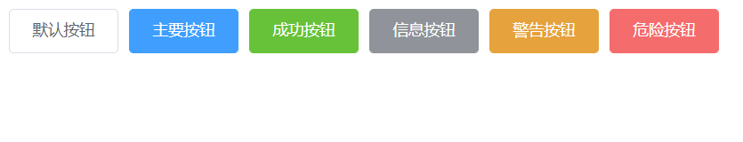

### 小结

1. elementui是做PC项目的首选
2. 组件库一般都会有配套使用教程，基本套路是：
   1. npm i 安装
   2. 在main.js中导入，并使用


------

我们即将要开的人资项目是基于elementUI重度使用的一套架构，我们把后台管理系统一类的项目中高频使用的组件依次学习一下，方便大家更容易的接受业务的顺利进行

------

## table组件-基础使用

用表格来显示数据，是一PC后台管理系统中一个非常常见的需求。

### 目标

能通过分析官网中的代码，把表格数据（文本数据）展示出来

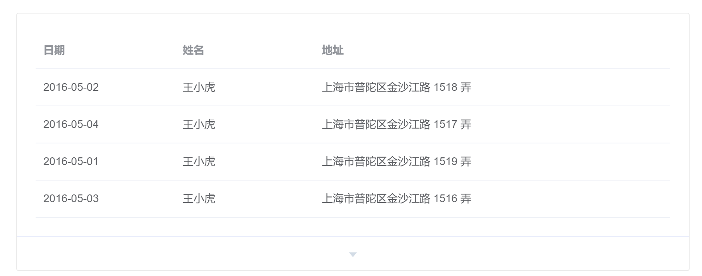

### 思路

从官网上cv代码到项目中 ；

学习相关属性的使用；

### 基础demo

复制[官方demo]( https://element.eleme.cn/#/zh-CN/component/table)中的第一个基础demo，先把我们的组件跑起来运行

```html
<template>
    <el-table :data="tableData" style="width: 100%">
      <el-table-column prop="date" label="日期" width="180"> </el-table-column>
      <el-table-column prop="name" label="姓名" width="180"> </el-table-column>
      <el-table-column prop="address" label="地址"> </el-table-column>
    </el-table>
</template>
<script>
export default {
  data() {
    return {
      tableData: [{
        date: '2016-05-02',
        name: '王小虎',
        address: '上海市普陀区金沙江路 1518 弄'
      }, {
        date: '2016-05-04',
        name: '王小虎',
        address: '上海市普陀区金沙江路 1517 弄'
      }, {
        date: '2016-05-01',
        name: '王小虎',
        address: '上海市普陀区金沙江路 1519 弄'
      }]
    }
  }
}
</script>
```

效果如下


### 学习组件的使用

数据源由table组件的data属性来指定（不需要我们自己用v-for指令来循环）

1. 行(data)，决定表格的数据。它是数组，数组中的每一个元素是一个对象，表示一行。

2. 列，决定表格结构。 列由el-table-column决定，下面有三个属性需要掌握 

   * label：决定当前列显示出的标题 
   * prop：决定当前列数据的来源。对于表格来说， 它的数据是一个数组，每一个元素是一个对象，这里的prop值就是这个对象中的属性名

   prop="date"。 这里的prop就是用来从每一个对象中取出属性名为date的 属性值。

   * width: 用来设置列的宽度。如果不设置，它会自适应。

### 小结

在el-table使用data属性

在el-table-column上使用prop属性

## table组件-自定义列-插槽

### 场景

有时候我们的表格单元格中，不光想要渲染文本，可能会渲染一些自定义的内容:  图片，操作按钮

### 目标

掌握自定义列的用法，能在表格单元格中显示自定义的内容。 

需求描述：我们想在最后一列渲染出一个删除按钮

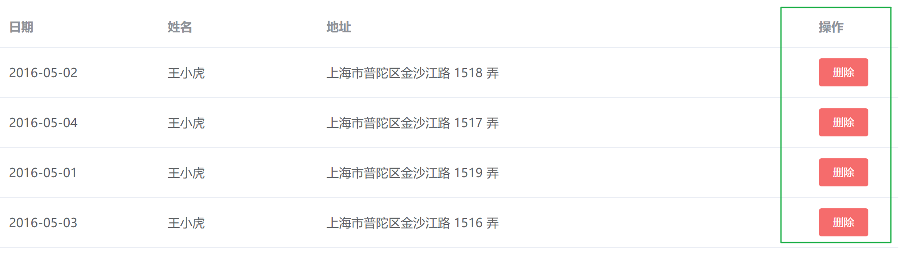

### 思路

[官网：自定义列模板](https://element.eleme.io/#/zh-CN/component/table#zi-ding-yi-lie-mo-ban)

### 代码

我们需要在对应的列中，使用`template`标签包裹我们自定义渲染的内容，其实用的就是**插槽**的机制

```html
// 省略其它....
<el-table-column label="操作" width="100">
    <template>
      <el-button size="small" type="danger">删除</el-button>
    </template>
</el-table-column>
```

### 小结

要自定义内容：

1. 删除`prop`属性
2. 用**插槽**

## table组件-自定义列-作用域插槽

### 需求说明

后端返回的数据中，只有一个指代性别的编码，为了方便用户查看，需要我们把1转换成男，0转换成女。

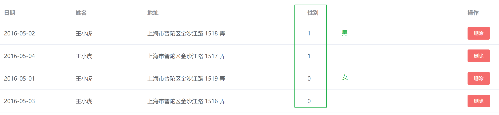

数据如下：

```json
tableData: [{
       date: '2016-05-02',
       name: '王小虎',
       address: '上海市普陀区金沙江路 1518 弄',
  		 gender: 0
      }, {
        date: '2016-05-04',
        name: '王小虎',
        address: '上海市普陀区金沙江路 1517 弄',
        gender: 1
      }, {
        date: '2016-05-01',
        name: '王小虎',
        address: '上海市普陀区金沙江路 1519 弄',
        gender: 1
      }]
```

### 解决思路

用作用域插槽拿到数据（[官网](table组件-自定义列-插槽)），再使用函数做转换输出即可

```html
<el-table-column label="性别">
  <!-- 
	1. slot-scope是固定写法
  2. scope理解为变量，并不一定需要固定这个名字，el-table-column组件会自动将渲染本行需要的数据
  传给scope，其中scope.row就表示当前行的数据，它对应数据源中的某个对象。这里的row是固定写法
  3. {{ 方法() }} 的作用是执行这个方法，将返回值显示在当前单元格中
  -->
    <template slot-scope="scope">
      {{ transGender(scope.row.gender) }}
    </template>
</el-table-column>

<script>
  export default {
      methods: {
        transGender(genderCode) {
          console.log(genderCode)
          const genderList = {
            1: '男',
            0: '女'
          }
          return genderList[genderCode]
        }
      }
  }
</script>
```

> 通过 `Scoped slot` 可以获取到 row, column, $index 和 store（table 内部的状态管理）的数据

### 小结

1. 场景：直接使用prop只能渲染文本，通过prop不能直接渲染的时，我们需要自定义内容渲染
2. 机制：作用域插槽  

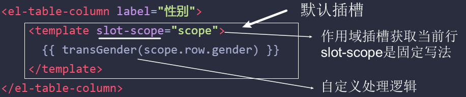

3. 如何拿当前行的完整对象数据？ scope.row  

## table组件-自定义列-显示图片（练习）

### 目标

把图片显示在表格中

### 数据

```js
tableData: [{
   companyName: '小米',
   companyLogo: 'http://s02.mifile.cn/assets/static/image/logo-mi2.png'
 }, 
 {
    companyName: '京东',
    companyLogo: 'https://misc.360buyimg.com/lib/img/e/logo-201305-b.png'
  }, 
  {
    companyName: '百度',
    companyLogo: 'https://www.baidu.com/img/PCtm_d9c8750bed0b3c7d089fa7d55720d6cf.png'
  }
]
```

### 代码

```vue
<template>
  <div>
    <el-table :data="tableData">
      <el-table-column
        label="公司名"
        prop="companyName">
      </el-table-column>

      <el-table-column
        label="公司logo"
        prop="companyLogo">
      </el-table-column>

      <el-table-column
        label="公司logo"
        >
        <!-- 
          slot-scope: 是老语法，
          v-slot ：是新语法。效果一样
        -->
      <template slot-scope="scope">
        <!-- {{scope.row.companyLogo}} -->
        
      </template>
      </el-table-column>
    </el-table>
  </div>
</template>

<script>
export default {
  data () {
    return {
      tableData: [{
        companyName: '小米',
        companyLogo: "http://s02.mifile.cn/assets/static/image/logo-mi2.png"
      }, 
      {
          companyName: '京东',
          companyLogo:"https://misc.360buyimg.com/lib/img/e/logo-201305-b.png"
        }, 
        {
          companyName: '百度',
          companyLogo:"https://www.baidu.com/img/PCtm_d9c8750bed0b3c7d089fa7d55720d6cf.png"
        }
      ]
    }
  }
}
</script>
```


## pagination-翻页组件

分页组件的官网地址：https://element.eleme.io/#/zh-CN/component/pagination

### 目标

掌握翻页组件的使用

### 基础使用

```html
<el-pagination 
  layout="prev, pager, next" 
  :total="1000">
</el-pagination>
```

说明：

* layout中的关键字有自己的含义；
* total用来设置数据的总条数

### 每页条数

page-size:默认每页10条数据

### 翻页事件

当用户点击页面进行翻页时就会触发current-change 事件

```html
<template>
  <div>
    <h1>Pagination</h1>
    <el-pagination
      layout="prev, pager, next"
      :total="1000"
      @current-change="pageChange"
    >
    </el-pagination>
  </div>
</template>

<script>
export default {
  methods: {
    // 把当前点击的页数给传进来
    pageChange(page) {
      console.log(page)
    }
  }
}
</script>
```

注意：

1. 事件名不是驼峰命名法，而是采用kebab-case(昵称：烤串命名法)
2. 它会自动接收页码

### 小结

1. 翻页按钮的结构 ：layout 按照我们传入的结构顺序依次渲染  
2. 分页逻辑：总页数 = 总条数（:total） / 每页的条数(:page-size)
3. 事件： @current-change
4. 翻页组件一般和表格一起使用，但是，它并不决定表格的数据来源。

## Form表单组件-基本使用

### 目标

掌握表单组件的基本使用

### 思路

在官网上cv一个最复杂的例子，然后对应做修改

### 用户登录表单-数据双向绑定

```html
<template>
  <div class="form-container">
    <el-form label-width="80px">
      <el-form-item label="手机号">
        <el-input v-model="form.mobile"></el-input>
      </el-form-item>
      <el-form-item label="密码">
        <el-input v-model="form.code"></el-input>
      </el-form-item>
      <el-form-item>
        <el-button type="primary" @click="onSubmit">立即创建</el-button>
        <el-button>取消</el-button>
      </el-form-item>
    </el-form>
  </div>
</template>
<script>
export default {
  data() {
    return {
      form: {
        mobile: '',
        code: ''
      }
    }
  },
  methods: {
    onSubmit() {
      console.log('submit!')
    }
  }
}
</script>

<style scoped>
  .form-container{
    width: 600px;
  }
</style>
```

### 小结

* 表单中的数据项一般会用一个对象包起来
* 属性名一般和后端接口中保持一致
* 在元素上采用v-model双向绑定

## Form表单校验-基本介绍

### 目标

了解表单校验的必要性和实现方式

### **校验必要性**

在向后端发请求调用接口之前，我们需要对所要传递的参数进行验证，来把用户的错误扼杀在摇篮之中。

> 不能相信用户的任何输入！不能相信用户的任何输入！不能相信用户的任何输入！

### **校验内容**

* 内容不能为空（*）
* 密码长度必须多少位
* 手机号的格式要合规
* 邮箱的格式要合规
* ...

### **校验方式**

* 不依赖于任何组件的验证
  * 在做提交之前，自己把数据分析处理一下。
* 基于具体组件的验证（不同的组件库，它的验证方式可能也各有不同）

### 小结

* 表单内容一定要验证（不能相信用户的任何输入！）；
* 如果使用是组件库中的表单，最好是采用它们自带的验证方式

## Form表单组件-表单验证

### 场景

在上面的表单中，要求：用户名必填

### 目标

掌握element-ui中表单校验的使用

### 基本步骤-共三步

1. 定义验证规则。data()中按格式定义规则

2. 在模板上做属性配置来应用规则（三个配置）

   给表单设置 `rules` 属性传入验证规则

   给表单设置`model`属性传入表单数据

   给表单项（Form-Item ）设置 `prop` 属性，其值为设置为需校验的字段名

3. 手动兜底验证

### 步骤1-定义表单验证规则

在 data 中,补充定义规则。

格式：

```js
data() {
  return {
    rules: {
        // 字段名1：表示要验证的属性
        // 值: 表示验证规则列表。它是一个数组，数组中的每一项表示一条规则。
        //     数组中的多条规则会按顺序进行
        字段名1: [
          { 验证规则1 },
          { 验证规则2 },
        ],
        字段名2: [
          { 验证规则1 },
          { 验证规则2 },
        ], 
		}
  }
}
```

示例

```js
  { required: true, message: '请输入验证码', trigger: 'blur' },
  { pattern: /^\d{6}$/, message: '请输入合法的验证码', trigger: 'blur' },
  { min: 6, max: 8, message: '长度为6-8位', trigger: 'blur' }

```

实操代码

```js
data () {
    return {
      // 表单验证规则，整体是一个对象
      // 键：要验证的字段, 值：是一个数组，每一项就是一条规则
      
      rules: {
        // 字段名：mobile就表示要验证的 属性
        // 值: 是一个数组。数组中的每一项表示一条规则。
        mobile: [
          { required: true, message: '请输入手机号', trigger: 'blur' }
        ]
      }
    }
  },

```

注意：

* rules中的属性名与表单数据项中的属性名必须是一致的。

### 步骤2-模板中的配置

内容：

1. 给 el-form 组件绑定 model 为表单数据对象
2. 给 el-form 组件绑定 rules 属性配置验证规则
3. 给需要验证的表单项 el-form-item 绑定 prop 属性，注意：prop 属性需要指定表单对象中的数据名称

代码：

```jsx
<el-form label-width="80px" :model="form" :rules="rules">
  <el-form-item label="手机号" prop="mobile">
    <el-input v-model="form.mobile"></el-input>
  </el-form-item>
  <el-form-item label="密码" prop="code">
    <el-input v-model="form.code"></el-input>
  </el-form-item>
  <el-form-item>
    <el-button type="primary" @click="onSubmit">立即创建</el-button>
    <el-button @click="onCancel">取消</el-button>
  </el-form-item>
</el-form>

```

验收效果

我们做到这一步时，当用户输入的内容不符合表单规则要求时，并且某个输入框失焦时，它会给出相应的提示，当我们输入的内容符合要求时，错误提示会自动消失。

### 步骤3-手动兜底验证

**格式**

```
element-ui的表单组件.validate(valid => {
	if(valid) {
	   // 通过了验证
	} else {
		 // 验证失败
	}
})

```

说明：

* [validate](https://element.eleme.io/#/zh-CN/component/form#form-methods) 方法是表单组件自带的，用来对表单内容进行检验。
* 需要在模板中添加对表单组件的引用：ref 的作用主要用来获取表单组件手动触发验证

代码-模板

```jsx
<el-form label-width="80px" 
+  ref="form"
   :model="form"
   :rules="rules">

```

添加ref来引用el-form组件。

代码

在做提交时进行手动兜底验证，如果通过了验证

```js
doLogin () {
  alert('我可以做登录了')
},
submit () {
  this.$refs.form.validate(valid => {
    // valid 就是表单验证的结果，如果是true，表示通过了
    // console.log(valid)
    if (valid) {
      // 通过了验证，你可以做后续动作了
      this.doLogin()
    }
  })
}

```

### 小结

步骤

1. 定义验证规则(按element-ui的要求来)

2. 配置模板，应用规则

   给表单设置 `rules` 属性传入验证规

   给表单设置`model`属性传入表单数据

   给表单中的元素（Form-Item ）设置 `prop` 属性，其值为设置为需校验的字段名

3. 手动兜底验证

## Form表单组件-表单验证-作业

在我们上一节课的基础上来做。

### 目标

1. 手机号/用户名不能为空，且必须为11位手机号 (/^1[0-9]{10}$/)
2. 密码为必填且长度6到8位字符

### 代码

定义规则

```js
rules:{
          name: [
            // trigger: 什么时候触发验证 
            { required: true, message: '请输入手机号', trigger: 'blur' },
            // pattern : 正则
            { pattern: /^1[345678]\d{9}$/, message: '请输入合法的手机号', trigger: 'blur' }
          ],
          password: [
            { required: true, message: '请输入手机号', trigger: 'blur' },
            { min: 6, max: 8, message: '长度为6-8位', trigger: 'blur' }
          ]
        }

```

模板中配置应用规则

```vue
<el-form ref="form" :model="form" :rules="rules" label-width="80px">
    <el-form-item label="手机号" prop="name">
      <el-input v-model="form.name"></el-input>
    </el-form-item>

    <el-form-item label="密码" prop="password">
      <el-input v-model="form.password"></el-input>
    </el-form-item>
    
    <el-form-item>
      <el-button type="primary" @click="onSubmit">立即创建</el-button>
      <el-button>取消</el-button>
    </el-form-item>
  </el-form>

```

### 注意

下面三个地方的属性名必须一致

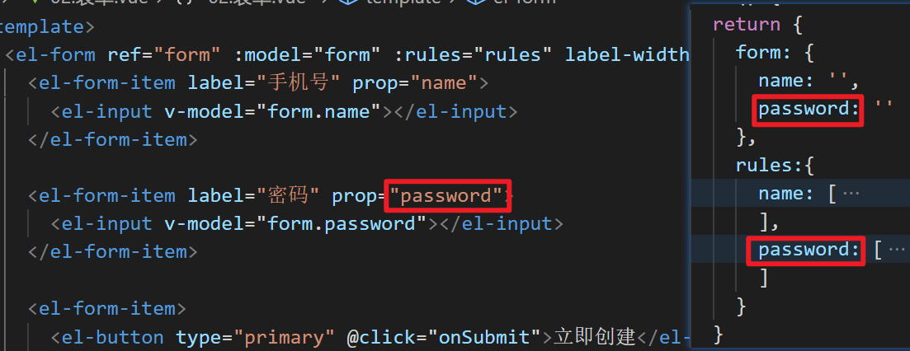

## Form表单组件-表单验证-自定义检验规则

场景：

密码不允许是`123456`

### 目标

掌握自定义检验规则的使用格式

### 思路

在rules中自定义validator

### 格式

```js
rules:{
    属性名1: [
      { 
        // 注意参数顺序
        validator: function (rule, value, callback) {
      		// rule：采用的规则
          // value: 被校验的值
          // callback是回调函数， 
          //      如果通过了规则检验，就直接调用callback()
          //      如果没有通过规则检验，就调用callback(错误对象，在错误对象中说明原因)
        	//         例如：callback(new Error('错误说明'))
      	}, 
        trigger: 'blur' 
     }]
}

```

### 落地代码

```js
rules: {
  name: [{required: true, message:'必须要填入', triggle: 'blur'}],
  code: [
      {
        validator:(rule, value, callback)=>{
          console.log(rule, value, callback)
          if(value === '123456') {
            callback(new Error('这是世界上最差的密码了'))
          } else {
            callback()
          }
      	},
        triggle: 'blur'
      },
      {min: 6, max:8, message:'长度为6-8位', triggle: 'blur'},
      {required: true, message:'必须要填入', triggle: 'blur'},
  ]
}

```

### 小结

* 自定义规则可以让校验逻辑更加灵活，它的格式是固定的
* callback必须调用

## Form表单组件-重置表单清理校验痕迹

### 背景

校验失败会有红色的提示文字，有时候我们需要在执行了某个操作之后把当前校校验失败留下的痕迹清理一下，为下一次校验做准备。

### 格式

```
this.$refs.form组件的引用.resetFields()

```

这个方法可以

1. 清理校验痕迹
2. 恢复表单默认数据

## Tree树形组件

### 目标

了解树状结构的数据；

学习Tree组件的基础使用

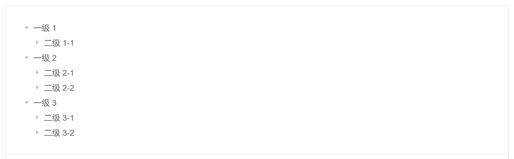

### 什么是树形数据

有一些业务场景在描述主体关系的时候必须使用树形数据，比如：我们常见的家庭成员关系图，公司里的组织架构等，要描述这样的业务场景，与之对应的，我们就得给出树形结构的数据


### Tree组件基础使用

学习树状结构的数据和label、children属性

示例[代码](https://element.eleme.io/#/zh-CN/component/tree#ji-chu-yong-fa)

```html
<template>
  <el-tree :data="data"></el-tree>
</template>

<script>
export default {
  data() {
    return {
      data: [{
        label: '一级 1',
        children: [{
          label: '二级 1-1',
          children: [{
            label: '三级 1-1-1'
          }]
        }]
      }, {
        label: '一级 2',
        children: [{
          label: '二级 2-1',
          children: [{
            label: '三级 2-1-1'
          }]
        }, {
          label: '二级 2-2',
          children: [{
            label: '三级 2-2-1'
          }]
        }]
      }, {
        label: '一级 3',
        children: [{
          label: '二级 3-1',
          children: [{
            label: '三级 3-1-1'
          }]
        }, {
          label: '二级 3-2',
          children: [{
            label: '三级 3-2-1'
          }]
        }]
      }]
    }
  }
}
</script>

```

上面我们就完成了一个基础树形组件的渲染，依赖一个data属性即可，data属性传入的就是树状结构

注意：

* 数据项中label和children是关键字，不可随意改动。tree组件用它们来显示内容


### 配置自定义渲染字段

tree组件渲染节点title默认使用的是数据中的`label属性`，识别子节点默认使用的是`children`属性，我们尝试把data里的属性名换一下，例如：label换成name，children换成childList，就会发现渲染失败了。

如果你非要去自定义这个两个关键字：label和children的话，就需要用到props属性了。

如下：

```html
<el-tree :data="data" :props="defaultProps"></el-tree>

defaultProps:{
    label:'name',
    children:'childList'
}

```

### 获取特定树形节点数据

当我们点击某个树形子节点的时候，如何获取到当前点击这项节点对应的数据？

监听时间：@node-click="handleNodeClick"`

```html
<template>
  <el-tree :data="data" @node-click="handleNodeClick"></el-tree>
</template>

<script>
  export default {
     methods:{
       // 共三个参数，
       // 依次为：
       //   - 传递给 data 属性的数组中该节点所对应的对象
       //   - 节点对应的 Node
       //   - 节点组件本身
        handleNodeClick(a,b,c){
          console.log(a,b,c)
        }
      }
  }
</script>

```

### 小结

1. 使用场景：组织架构   人员关系

2. 树形数据  

   ```js
   data:[
     {
       label:'a',
       id:101,
       children:[
           {},
           {},
           {}
       ]
     }
   ]
   
   ```

3. 自定义props适配数据渲染字段

## Tree树形组件-练习题

将下图中的数据内部用树形数据表示出来，并通过tree显示

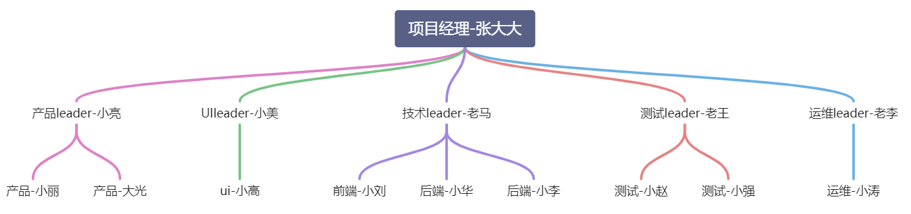


**参考代码**

```js
data: [{
        label: '张大大',
        children: [
          {
          	label: '小亮',
          	children: [{label: '小丽'}，{label: '大光'}]
        	},
          {
          	label: '小美',
          	children: [{label: '小高'}]
        	},
          {
          	label: '老马',
          	children: [{label: '小刘'}，{label: '小华'},{label: '小李'}]
        	},
          {
          	label: '老王',
          	children: [{label: '小赵'}，{label: '小强'}]
        	},
          {
          	label: '老李',
          	children: [{label: '小涛'}]
        	}
      	]
      }]

```


## 思考题：数组转化成树(难点-难点-难点)

### 背景

后端接口返回的数据一般是平铺的数组结构，而不会是树形结构，例如下面的平铺数组结构：

```json
data = 
[
  {id:"01", name: "张大大", pid:"", job: "项目经理"},
  {id:"02", name: "小亮", pid:"01", job: "产品leader"},
  {id:"03", name: "小美", pid:"01", job: "UIleader"},
  {id:"04", name: "老马", pid:"01", job: "技术leader"},
  {id:"05", name: "老王", pid:"01", job: "测试leader"},
  {id:"06", name: "老李", pid:"01", job: "运维leader"},
  {id:"07", name: "小丽", pid:"02", job: "产品经理"},
  {id:"08", name: "大光", pid:"02", job: "产品经理"},
  {id:"09", name: "小高", pid:"03", job: "UI设计师"},
  {id:"10", name: "小刘", pid:"04", job: "前端工程师"},
  {id:"11", name: "小华", pid:"04", job: "后端工程师"},
  {id:"12", name: "小李", pid:"04", job: "后端工程师"},
  {id:"13", name: "小赵", pid:"05", job: "测试工程师"},
  {id:"14", name: "小强", pid:"05", job: "测试工程师"},
  {id:"15", name: "小涛", pid:"06", job: "运维工程师"}
]

```

这样的数据可以直接在table中使用，但是不能直接在tree组件中使用，需要我们做一些转换。

### 额外补充一个函数来做转换

代码

```js
const data = [
  {id:"01", name: "张大大", pid:"", job: "项目经理"},
  {id:"02", name: "小亮", pid:"01", job: "产品leader"},
  {id:"03", name: "小美", pid:"01", job: "UIleader"},
  {id:"04", name: "老马", pid:"01", job: "技术leader"},
  {id:"05", name: "老王", pid:"01", job: "测试leader"},
  {id:"06", name: "老李", pid:"01", job: "运维leader"},
  {id:"07", name: "小丽", pid:"02", job: "产品经理"},
  {id:"08", name: "大光", pid:"02", job: "产品经理"},
  {id:"09", name: "小高", pid:"03", job: "UI设计师"},
  {id:"10", name: "小刘", pid:"04", job: "前端工程师"},
  {id:"11", name: "小华", pid:"04", job: "后端工程师"},
  {id:"12", name: "小李", pid:"04", job: "后端工程师"},
  {id:"13", name: "小赵", pid:"05", job: "测试工程师"},
  {id:"14", name: "小强", pid:"05", job: "测试工程师"},
  {id:"15", name: "小涛", pid:"06", job: "运维工程师"}
]

// 完成代码
function arrToTree(data) {
  
  // 你的代码
  
}

// 目标：
const treeData = arrToTree(data)
// treeData就是：
// [{
//   label: '张大大',
//   children: [
//     {
//       label: '小亮',
//       children: [{label: '小丽'}，{label: '大光'}]
//     },
//     {
//       label: '小美',
//       children: [{label: '小高'}]
//     },
//     {
//       label: '老马',
//       children: [{label: '小刘'}，{label: '小华'},{label: '小李'}]
//     },
//     {
//       label: '老王',
//       children: [{label: '小赵'}，{label: '小强'}]
//     },
//     {
//       label: '老李',
//       children: [{label: '小涛'}]
//     }
//   ]
// }]

```


## Dialog弹框组件

### 目标

 学习Dialog弹框组件的基础使用

### 弹框组件基础使用

* 基本交互
* 使用默认插槽来自定义内容

```html
<template>
  <div>
    <el-button type="text" @click="dialogVisible = true">点击打开 Dialog</el-button>
    <el-dialog
      title="提示"
      :visible.sync="dialogVisible"
      width="30%"
    >
      <span>这是一段信息</span>
      <span slot="footer" class="dialog-footer">
        <el-button @click="dialogVisible = false">取 消</el-button>
        <el-button type="primary" @click="dialogVisible = false">确 定</el-button>
      </span>
    </el-dialog>
  </div>
</template>

<script>
  export default {
    data() {
      return {
        dialogVisible: false
      }
    }
  }
</script>

```

### 监听open和close事件

> 弹框组件有俩种状态，一个是打开一个是关闭，如果我们想在它打开或者关闭时做一些自己的事情，就可以监听俩个事件
>
> @close  弹框关闭 : dialogVisible从true变成false
>
> @open  弹框打开 : dialogVisible从false变成true

```html
<template>
  <div>
    <el-button type="text" @click="dialogVisible = true"
      >点击打开 Dialog</el-button
    >
    <el-dialog
      title="提示"
      :visible.sync="dialogVisible"
      @close="dialogClose"
      @open="dialogOpen"
      width="30%"
    >
      <span>这是一段信息</span>
      <span slot="footer" class="dialog-footer">
        <el-button @click="dialogVisible = false">取 消</el-button>
        <el-button type="primary" @click="dialogVisible = false">确 定</el-button>
      </span>
    </el-dialog>
  </div>
</template>

<script>
export default {
  data() {
    return {
      dialogVisible: false,
    }
  },
  methods: {
    dialogClose() {
      console.log('弹框要关闭了')
    },
    dialogOpen(){
      console.log('弹框打开咯')
    }
  }
}
</script>

```

### 取消两种关闭的方式

```vue
<el-dialog
      :close-on-click-modal="false"
      :close-on-press-escape="false"

```


### 小结

1. 弹框组件一共俩种状态  打开和关闭  `:visible.sync="布尔值"`
2. open和close俩个自定义事件要关注
3. 取消两种关闭的方式(点击遮罩，esc)


## MessageBox


```js
openMessage () {
      this.$message({
        type: 'success ',
        message: `月薪15K`
      })
    },
    open () {
      this.$alert('你真的要走吗？', '系统提示', {
        confirmButtonText: '确认',
        callback: action => {
          this.$message({
            type: 'info',
            message: `action: ${action}`
          })
        }
      })
    }

```


## Select


### 基本使用

```js
<template>
  <el-select v-model="value" placeholder="请选择">

    <!-- label: 显示的内容
    value: 选中之后要保存的内容---值 -->
    <el-option
      v-for="item in options"
      :key="item.value"

      :label="item.label"
      :value="item.value">
    </el-option>

  </el-select>
</template>

<script>
export default {
  data () {
    return {
      options: [{
        value: '1',
        label: '黄金糕'
      }, {
        value: '2',
        label: '双皮奶'
      }, {
        value: '选项3',
        label: '蚵仔煎'
      }, {
        value: '选项4',
        label: '龙须面'
      }, {
        value: '选项5',
        label: '北京烤鸭'
      }],
      value: ''
    }
  }
}
</script>

```


## 多个的select联动

selecct:  @change, ajax

## Tabs


用来做页面布局


## 案例-整体介绍

### 目标

复习vue项目中路由的使用(嵌套路由)； 

了解后台管理系统的基本页面结构

### 基本内容

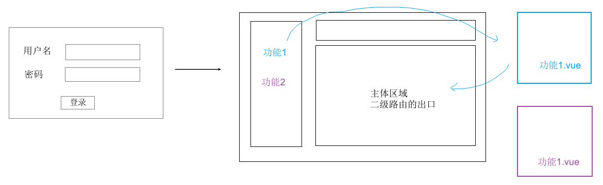

> 需求演示：http://cp_fe.gitee.io/vue-element-project/#/login
>
> 需求描述：
>
> 1. 登录页实现表单校验功能，校验通过之后跳转到首页
> 2. 首页默认进入到table菜单路由下，表格渲染列表
> 3. 表格数据里的性别 1 转换成 男  0转换成 女

## 案例-引入路由

在当前的项目中，我们并没有引入vue-router，所以我们这里先来单独安装一下它。

### 安装

`npm i vue-router`

### 复习使用vue-router的基本步骤

* 定义路由并导出
* 在main.js中导入，并挂载到vue实例中
* 设置路由出口

### 定义

src/router/index.js

```js
import Vue from 'vue'
import VueRouter from 'vue-router'
import Login from '@/views/login.vue'

Vue.use(VueRouter)

const router = new VueRouter({
  routes: [
    { path: '/login', component: Login }
  ]
})

export default router

```

### 使用

src/main.js中引入

```js
// 省略其他
import router from '@/router/index.js'

new Vue({
+ router,
  render: h => h(App),
}).$mount('#app')

```

app.vue中定义路由出口

src/app.vue

```vue
  <div id="app">
    <router-view></router-view>
  </div>

```


## 案例-Login模块实现

Login静态布局页面

src/views/login.vue

```html
<template>
  <div class="login-container">
    <div class="form-container">
      <el-form label-width="80px">
        <el-form-item label="手机号:">
          <el-input v-model="form.mobile"></el-input>
        </el-form-item>
        <el-form-item label="密码:">
          <el-input v-model="form.password"></el-input>
        </el-form-item>
        <el-form-item>
          <el-button type="primary">确定</el-button>
          <el-button>取消</el-button>
        </el-form-item>
      </el-form>
    </div>
    <div>自行完成表单验证</div>
  </div>
</template>

<script>
export default {
  data () {
    return {
      form: {
        mobile: '',
        password: ''
      }
    }
  }
}
</script>

<style scoped>
.login-container {
  width: 100vw;
  height: 100vh;
  background-color: rgb(238, 241, 246);
}
.form-container {
  width: 500px;
  height: 400px;
  border: 1px solid #b3c0d1;
  border-radius: 10px;
  position: absolute;
  left: 50%;
  top: 50%;
  transform: translate(-50%, -50%);
  display: flex;
  justify-content: center;
  align-items: center;
  }
</style>

```

## 案例-用container和menu实现主页

### 分析

需要有单独的组件来做主页布局

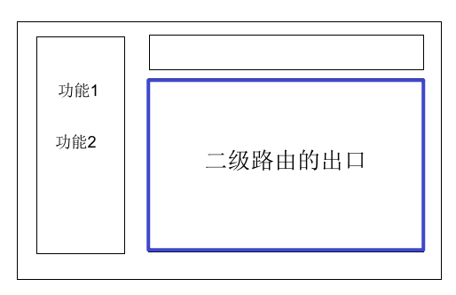

### Layout静态布局

src/views/layout.vue

[container组件布局](https://element.eleme.io/#/zh-CN/component/container)  [menu组件](https://element.eleme.io/#/zh-CN/component/menu#ce-lan)

```html
<template>
  <el-container style="height: 100vh">
    <el-aside width="200px" style="background-color: rgb(238, 241, 246)">
      <div class="logo">实战案例logo</div>
      <!-- 菜单区域 -->
      <el-menu>
        <el-menu-item index="1-1">table</el-menu-item>
      </el-menu>
    </el-aside>
    <el-container>
      <el-header style="text-align: right; font-size: 12px">
        <i class="el-icon-setting" style="margin-right: 15px"></i>
        <span>王小虎</span>
      </el-header>
      <el-main>
        这里是主体
      </el-main>
    </el-container>
  </el-container>
</template>

<script>
export default {}
</script>
<style>
.logo{
  height: 60px;
  text-align: center;
  line-height: 60px;
  color:#333;
  text-shadow: 0 0 4px #b3c0d1;
  font-size: 20px;
}
.el-header {
  background-color: #b3c0d1;
  color: #333;
  line-height: 60px;
}
.el-aside {
  color: #333;
}
</style>

```


### 路由配置

```js
import Vue from 'vue'
import VueRouter from 'vue-router'
import Login from '@/views/login.vue'
import Layout from '@/views/layout.vue'
Vue.use(VueRouter)

const router = new VueRouter({
  routes: [
    {
      path: '/login',
      component: Login
    },
    {
      path: '/', // 主页
      component: Layout
    }
  ]
})

export default router

```

### 验收效果

通过路由地址访问一下，看看是否能显示主页

## 案例-配置二级路由

### 目标

点击不同的菜单，载入不同的页面

### 分析

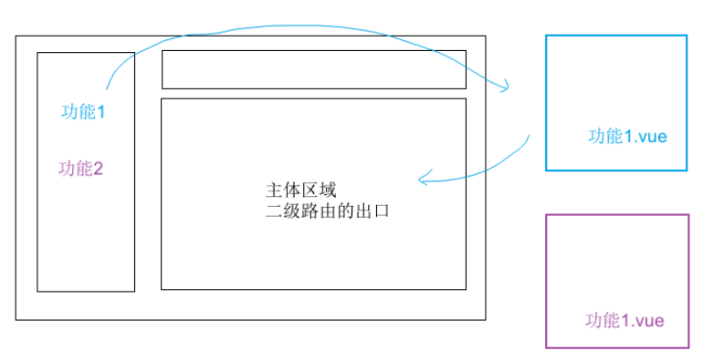

配置二级路由

### 路由配置

src/router/index.js

```js
import Vue from 'vue'
import VueRouter from 'vue-router'
import Login from '@/views/login.vue'

// Layout:布局。用它来做布局，它只是一个壳子: 有 左侧菜单，右侧主体空出来
import Layout from '@/views/layout.vue'

// 具体的子页面
import Home from '@/views/home.vue'
import Tree from '@/views/tree.vue'
Vue.use(VueRouter)

const router = new VueRouter({
  routes: [
    { path: '/login', component: Login },
    { 
      path: '/', 
      component: Layout,
      children: [
        // path是空，它是二级路由中默认显示的组件
        { path: '', component: Home },
        { path: 'tree', component: Tree }
      ]
    }
  ]
})

export default router

```

### 二级路由出口

src/views/layout.vue

```vue
<el-container>
  <el-header>Header</el-header>
  <el-main>
    <!-- 二级路由出口 -->
    <router-view />
  </el-main>
</el-container>

```

### 导航菜单

src/views/layout.vue 中，设置index和router

```vue
<el-menu
          default-active="/"
          class="el-menu-vertical-demo"
          router
        >
          <el-menu-item index="/">
            <i class="el-icon-menu"></i>
            <span slot="title">主页</span>
          </el-menu-item>
         
          <el-menu-item index="/tree">
            <i class="el-icon-setting"></i>
            <span slot="title">树</span>
          </el-menu-item>
        </el-menu>

```

rotuer: 是否使用 vue-router 的模式，启用该模式会在激活导航时以 index 作为 path 进行路由跳转

### Table模块实现

table静态布局

```html
<template>
  <div class="table-container">
    <el-table :data="tableData" style="width: 100%">
      <el-table-column prop="date" label="日期" width="180"> </el-table-column>
      <el-table-column prop="name" label="姓名" width="180"> </el-table-column>
      <el-table-column prop="address" label="地址"> </el-table-column>
    </el-table>
    <div class="page">
      <el-pagination layout="prev, pager, next" :total="50"> </el-pagination>
    </div>
  </div>
</template>

<script>
export default {
  data () {
    return {
      tableData: [{
        date: '2016-05-02',
        name: '王小虎',
        address: '上海市普陀区金沙江路 1518 弄'
      }, {
        date: '2016-05-04',
        name: '王小虎',
        address: '上海市普陀区金沙江路 1517 弄'
      }]
    }
  }
}
</script>

<style lang="less" scoped>
 .page{
   margin-top: 20px;
 }
</style>

```

## BUG修复

描述：

选中其他的菜单，刷新页面，发现默认选中的菜单不对！

解决

`:default-active="$route.path"`

# ElmentUI组件库学习（自己）

需要需求首先去看官网，看官网有没有相关的demo实现了

* element的某个组件的内容很多时，选择一个最简单的去学习，以后要使用的话，按需去学习。如果某个组件的内容很少，选一个最难的去学习

* 学组件从外面往里面学
* 仔细看它官网每个组件最下面的api，然后灵活去应用

自己对组件的理解：

1. 为什么组件可以直接绑定事件，子触发了父的自定义事件，设置class相当于父给子传值，传一个类名
2. 什么时候使用组件什么时候使用原生的标签，当使用原生的比较麻烦时就可以去组件库里找找有没有方便的组件，当一个简单的h1标签或者span标签能解决时，就直接用原生的标签就可以了
3. 组件里面到底能不能随便用别的标签，一般是可以随便使用，因为原理就是插槽，但有时候也也不能使用，使用了会报错之类的，一般不知道能不能的时候试试就知道了

组件属性是布尔值的`:strip="true"`不加引号默认解析为字符串，应该加引号，直接写strip就是未true的意思，与h5的标签一样使用

elementUI官方网站：[https://element.eleme.cn/#/zh-CN/component/layout](https://element.eleme.cn/#/zh-CN/component/layout)

# 1. Basic

## Layout 布局

基于bootstrap实现的栅格布局，基础的 24 分栏 通过el-row和el-col配合基础的span属性来创建布局

* Row 组件 提供 `gutter` 属性来指定每一栏之间的间隔
* Row组件的`type`属性设置为`flex`可以开启flex布局，通过设置`justify`属性来设置对齐方式
* Col组件的`offset`属性来社会中分栏的偏移份数
* 同bootstrap一样， 有`xs`、`sm`、`md`、`lg` 和 `xl`五个响应式布局

```js
<el-row :gutter="20">
  <el-col :span="10" :offset="5"><div class="grid-content bg-purple-dark"></div></el-col>
</el-row>
<el-row type="flex" justify="center">
  <el-col :span="12"><div class="grid-content bg-purple"></div></el-col>
  <el-col :span="12"><div class="grid-content bg-purple-light"></div></el-col>
</el-row>

<el-row :gutter="10">
  <el-col :xs="8" :sm="6" :md="4" :lg="3" :xl="1"><div class="grid-content bg-purple"></div></el-col>
  <el-col :xs="4" :sm="6" :md="8" :lg="9" :xl="11"><div class="grid-content bg-purple-light"></div></el-col>
</el-row>
```

更多的使用嵌套

```js
    		// 第一个el-col
			<el-col :span="20">
                <span>{{ data.name }}</span>
              </el-col>
			// 第二个el-col
              <el-col :span="4">
                <el-row type="flex" justify="end">
                  <!-- 两个内容 -->
                  <el-col>{{ data.manager }}</el-col>
                  <el-col>
                    <!-- 下拉菜单 element -->
                    <el-dropdown trigger="click">
                      <span> 操作<i class="el-icon-arrow-down" /> </span>
                      <!-- 下拉菜单 -->
                      <el-dropdown-menu slot="dropdown">
                        <el-dropdown-item @click.native="hAddOrEdit(data.id,false)">添加子部门</el-dropdown-item>
                        <el-dropdown-item @click.native="hAddOrEdit(data.id,true)">编辑部门</el-dropdown-item>
                        <el-dropdown-item v-if="data.children.length === 0" @click.native="hDel(data.id)">删除部门</el-dropdown-item>
                      </el-dropdown-menu>
                    </el-dropdown>
                  </el-col>
                </el-row>
              </el-col>
```

## Link 文字链接

`el-link`是a链接的替代品，hover后可以出现下划线，设置type属性可以设置链接的文字

peimary-主要链接-蓝色 success-成功-绿色 warning-警告-橙色 danger-危险-红色 info-信息-灰色

```js
<el-link href="https://element.eleme.io" target="_blank">默认链接</el-link>
<el-link type="primary">主要链接</el-link>
```

# 2. Form

## Checkbox 多选框


## Input 输入框

input输入框，常用在表单组件el-form-item中

**不支持 `v-model` 修饰符**

```html
<el-input v-model="input" placeholder="请输入内容" value="xxx"></el-input>
```

## Form 表单

**由输入框、选择器、单选框、多选框等控件组成，用以收集、校验、提交数据**

在 el-form 组件中，每一个表单域由一个 el-form-item 组件构成，表单域中可以放置各种类型的表单控件，包括 Input、Select、Checkbox、Radio、Switch、DatePicker、TimePicker

```vue
 <el-form :model="loginForm" :rules="loginRules" ref="loginForm">
        <!-- 用户名 -->
        <el-form-item prop="username">
          <el-input
            v-model="loginForm.username"
            placeholder="请输入用户名"
          ></el-input>
        </el-form-item>
        <!-- 密码 -->
        <el-form-item prop="password">
          <el-input
            v-model="loginForm.password"
            type="password"
            placeholder="请输入密码"
          ></el-input>
        </el-form-item>
        <el-form-item>
          <el-button type="primary" class="btn-login" @click="login"
            >登录</el-button
          >
          <el-link type="info" @click="$router.push('/reg')">去注册</el-link>
        </el-form-item>
      </el-form>

data () {
    return {
      // 登录表单的数据对象
      loginForm: {
        username: '',
        password: ''
      },
      // 登录表单的验证规则对象
      loginRules: {
        username: [
          { required: true, message: '请输入用户名', trigger: 'blur' },
          // 必须是首位不能为数字的 1-10位的字母或数字
          {
            pattern: /^[a-zA-z][a-zA-Z0-9]{0,9}$/,
            message: '请输入1-10字母或数字，且首位不能是数字',
            trigger: 'blur'
          }
        ],
        password: [
          { required: true, message: '请输入密码', trigger: 'blur' },
          {
            pattern: /^\S{6,15}$/,
            message: '请输入6-15位密码',
            trigger: 'blur'
          }
        ]
      }
    }
  },
```

ref为用来选中该表单的属性，model为表单对象（每个表单都应该绑定一个对象，并且里面的属性需要与后端接口的参数一样），rules动态绑定一个rules标签用来做表单校验

prop要和数据名的字段一样，三者合一prop，规则对象里面的每个item名，v-model绑定的数据名

表单使用的时候，需要在data中初始化一个userForm，并写出里面所有的属性（初始化为空字符串），因为要和每个表单元素双向绑定

> 一般是整个表单对应的是对应的是list里面的一条数据（一个对象）
>
> 数据对象的初始不能直接写一个空数组，需要把各个字段赋为空，写在data里，防止没有网后台数据请求不过来，因为找不到字段报错的现象

注意事项

* 表单提交时需要做兜底校验

  ```js
  this.$refs.loginForm.validate(async (validateRes) => {
          // 还有未校验通过的直接return 不发请求，不校验账号密码是否正确
          if (!validateRes) return
      // do something
  }
  
  //使用Promise开发
  const res = await this.$refs.loginForm.validate().catch(e => e)
  if (!res) return
  ```

* 自定义校验

  ```js
  // data中，自定义校验函数定义在data中，callback函数必须要执行，不然会堵塞后面的规则，第一个rule对下个你不用，当然函数可以直接写在rules数组中，但是太长了就抽离出来了
  data () {
      const checkPwd = (rule, value, callback) => {
        if (value !== this.regForm.password) return callback(new Error('两次密码不一致'))
        callback()
      }
      return {}
  }
  
  repassword: [
            { required: true, message: '请再次输入密码', trigger: 'blur' },
      // pattern 开发中一般不用，会抽离出去
            { pattern: /^\S{6,15}$/, message: '请输入6-15位密码', trigger: 'blur' },
            { validator: checkPwd, trigger: 'blur' }
          ]
  ```

* 重置表单数据`this.$refs.loginForm.resetFields()`重置到渲染前的状态（初始时loginForm=''，后来this.loginForm=xxx，然后渲染到表单中），这种情况重置，会保留赋值后的渲染状态。重置的是el-form-item绑定的prop字段

* 校验部分表单，第三方的组件无法由element内置触发（trigger无用），需要手动合适的时机（blur事件或者change事件）触发，`this.$refs.loginForm.validatefield('username')`三者合一

注意事项：

自定义校验函数写在data中，但是自定义校验的布尔结果一般会封装在utils的validate.js中

required:true 必填项

trigger:触发时机（事件）

validator:自定义校验规则，函数

message:错误提示消息

pattern:定义正则，真正项目开发时，其实用的很少，因为复用性不高

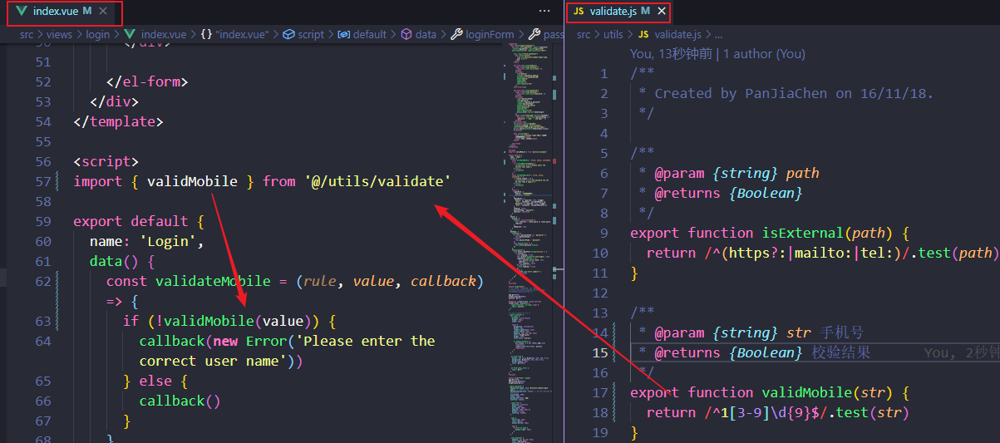

### 表单校验

1. 校验写在el-form或者el-form-item中

**当 rules 写在 el-form-item 中时，**
prop、rules、v-model三者可以不一致，我们只需要注意保持，prop 和 v-model 一致即可，因为 rules 已经表示了该 el-form-item 应该应用什么校验规则了。
**当 rules 写在 el-form中时，**
prop、rules、v-model三者则必须保持一致，因为 rules 是写在 el-form 上的，无法知道各个 el-form-item 应该使用 rules 中的哪条校验规则，因此我们需要用 prop 来进行关联绑定。无论怎么变化，prop检验的应该是model绑定的数据对象数组中的某一个字段，不管v-model绑定的是谁

2. 验证规则中默认选择或输入的值是字符串，如果校验数组需要加type:'array'，对象是type:'object'
3. 要想两个el-form-item放在一行，可以用el-row包两个el-col。每个设置`:span="12"`，每个el-col包一个el-form-item

### 特殊情况：后端要求的是字符串，而v-model只能拿到数组

用计算属性的set和get来实现，el-select的v-model绑定formTags这个计算属性，计算属性这里相当于一个中转站

* formData中的tags有初始数据，需要渲染到表单，触发get函数，返回一个数组，渲染到选择中
* 手动选择option，选择的数据在formTags中，是一个数据，触发set函数，把formData中的tags设置为转换后的字符串即可

校验：需要prop绑定formData中的tags，因为整个form表单的model绑定的是formData，需要prop来告诉去匹配哪一条校验规则，里面的v-model不用管

```js
<el-form-item label="试题标签" prop="tags">
          <el-select v-model="formTags" style="width: 400px;" multiple >
            <el-option v-for="item in tagList" :key="item.value" :value="item.label" 						:label="item.label"></el-option>
          </el-select>
</el-form-item>

data(){
    return{
        formData:{
            // ...
            tags:''
        }
    }
}
rules：{
    //...
    tags: [
          { required: true, message: '请选择标签', trigger: 'change' }
        ]
}
computed:{
    formTags: {
      set (val) {
        // console.log(val)
        if (val.length === 1) {
          this.formData.tags = val.join('')
        } else {
          this.formData.tags = val.join(',')
        }
      },
      get () {
        // console.log(this.tagList)
        // console.log(this.formData.tags)
        if (this.formData.tags === '') {
          return []
        } else {
          return this.formData.tags.split(',')
        }
      }
    }
}
```


## Select 选择器

属于表单控件，用来创建下拉列表。区别el-drop下拉菜单组件是用来做导航（某些动作或菜单折叠到下拉菜单）的

```js
<el-select v-model="value" placeholder="请选择">
    <el-option
      v-for="item in cities"
      :key="item.value"
      :label="item.label"
      :value="item.value">
      <span style="float: left">{{ item.label }}</span>
      <span style="float: right; color: #8492a6; font-size: 13px">{{ item.value }}</span>
    </el-option>
  </el-select>
```

* 给el-select双向绑定v-model的value值，绑定的是el-option的value值

* label是选项的标签显示在option上，如果不设置的话，默认与value相同。label决定了select输入框和option中显示什么内容。

* 闭合标签中间自定义的内容决定option内容。但是select输入框还是由label决定

  ```js
  <el-select v-model="value" placeholder="请选择">
      <el-option
        v-for="item in cities"
        :key="item.value"
        :label="item.label"
        :value="item.value">
        <span style="float: left">{{ item.label }}</span>
        <span style="float: right; color: #8492a6; font-size: 13px">{{ item.value }}</span>
      </el-option>
    </el-select>
  ```

这里的el-select和el-option是input和ul li来实现的，和原生的下拉框表单不同，option的label属性要是不设置，option上显示的是value值

## DatePicker 日期选择器

```js
<el-date-picker
      v-model="value1"
      type="date"
      placeholder="选择日期"
	 format="yyyy 年 MM 月 dd 日"
	 value-format="yyyy-MM-dd">
</el-date-picker>
```

选择后，返回的是一个date对象

* 使用`format`指定输入框的格式（选择了之后输入框的显示）

* 使用`value-format`指定绑定值的格式（存的是什么。传给后端的数据格式，设置了value-format就是字符串）。一般前端传什么过去后端传什么过来，如果后台传的是date对象，那么需要在前端做一次日期格式转换

常用格式

* `yyyy` 年 - 2017
* `MM`月 - 09（补零）
* `dd` 日 - 02（补零）
* `HH` 时 - 08（补零-24h制）
* `mm`分 - 30（补零）
* `ss`秒 - 50（补零）

## Upload 上传

```vue
<!--
      action: 上传的服务器地址, 设置为 # 表示不上传
      show-file-list: 显示已上传文件列表
      on-success: 上传成功的回调
      before-upload: 上传前的回调 (可以限制文件的大小 / 格式)
      http-request: 通过该回调进行上传, 选择文件后由这个函数来做上传
     -->
<el-upload
      class="avatar-uploader"
      action="#"
      :on-success="handleAvatarSuccess"
      :before-upload="beforeAvatarUpload"
      :http-request="upload"
    >
      
      <i v-else class="el-icon-plus avatar-uploader-icon" />
    </el-upload>

<script>
 methods: {
       beforeAvatarUpload(file) {
        // 1.上传前
        const isJPG = file.type === 'image/jpeg';
        const isLt2M = file.size / 1024 / 1024 < 2;

        if (!isJPG) {
          this.$message.error('上传头像图片只能是 JPG 格式!');
        }
        if (!isLt2M) {
          this.$message.error('上传头像图片大小不能超过 2MB!');
        }
        return isJPG && isLt2M;
      }
     upload(){
         // 2.这里用来做上传图片的操作
     }
      handleAvatarSuccess(res, file) {
        // 3.上传成功后
        // file是上传的文件对象，这里是转成url用来做文件预览
        this.imageUrl = URL.createObjectURL(file.raw);
      },
    
    }
</script>
```

# 3. Data

## Table 表格

最简单的表格

data属性动态绑定一个对象数组，el-tabel-column上用`prop`属性来对应对象中的键名即可填入数据，用`label`属性来定义表格的列名

* `stripe`属性可以创建带斑马纹的表格。它接受一个`Boolean`，默认为`false`，设置为`true`即为启用。**想要显示属性上直接写stripe就行**
* 默认情况下，Table 组件是不具有竖直方向的边框的，如果需要，可以使用`border`属性，它接受一个`Boolean`，设置为`true`即可启用。**想要显示属性上直接写border就行**
* `sortable`可以让表格每列实现排序，升序、降序、无排序三种状态的切换。但是这种方式只排序当前页的，如果小的数据在后面，则无法拿到。全部数据的排序，需要后台接口支持

```js
<el-table :data="tableData" style="width: 100%">
      <el-table-column prop="date" label="日期" width="180"> </el-table-column>
      <el-table-column prop="name" label="姓名" width="180"> </el-table-column>
      <el-table-column prop="address" label="地址"> </el-table-column>
</el-table>
```

具名插槽和作用域插槽经常在表格中使用，尤其是作用域插槽，只要是对数据有操作的，需要用到数组的item就需要用作用域插槽

老语法：具名插槽`slot=""`和作用域插槽`scope-slot=""`可以直接对组件使用，碰到对组件使用的，我们需要用template包起来（老语法在vue3中已经不支持）

新语法（只能配合template标签使用）具名插槽`v-slot:title`简写为`#title`，作用域插槽`v-slot="scope"`常用`v-slot={ row }`，两者同时使用，`v-slot:tilte="scope"`或者直接`#tilte="scope"`

> 补充：`#default === slot-scope === v-slot`
>
> el-table-column的width只设置几个，剩下的自适应。总共占满100%

用闭合标签包裹的所用于插槽代替prop来渲染数据

```js
<el-table-column label="文章标题">
          <template v-slot="{ row }">
           <e-link type="success"> {{ row.title }} </e-link>
          </template>
</el-table-column>
```

作用域插槽中的scope，里面有数组每一个item的索引$index，以及每一个item（scope.row）

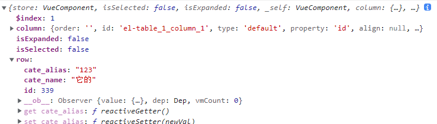

**树型表格**

树型表格有两个条件，一个是要有树形数组，另一个设置el-table的row-key为id（唯一标识）

```js
<el-table :data="list" row-key="id" border>
```


## Pagination 分页器

* size-change：pagesize发生变化时的回调
* current-page：page当前页发生变化时的回调

注意：

* 用js修改pagenum的值，不会触发handleCurrentChange函数（手动选择才会触发），但是页面的页码显示也会变（如果页面器有这么多页的话），修改后需要手动调用方法请求当前页的数据

记住，页码器显示多少页只由total和pagesize影响，添加数据前可以先让total相加，显示有足够的页数，再去请求第几页的数据

* 用js修改pagesize的值，不会触发handleSizeChange函数，页面中页码器显示的每页多少条也不会变化，但是文章列表是显示的修改的pagesize，一般没有人去用代码修改pagesize，没什么意义

另外的属性

* current-page: 当前页（页面显示多少页，由自动计算total/page-szie得来）
* page-sizes: 设置每页显示多少条的选项
* page-size: 每页显示多少条（默认值设置与page-sizes的第一个值相同）
* layout：设置页码器中各个块的布局（各自所放的位置）
* total：所有数据的总条数（一般会在每次请求后传过来的数据中有一个total字段）

```vue
<el-pagination
      :current-page="pageParams.page"
      :page-sizes="[2, 4, 6, 8]"
      :page-size="pageParams.pagesize"
      layout="total, sizes, prev, pager, next, jumper"
      :total="40"
      @size-change="handleSizeChange"
      @current-change="handleCurrentChange">
    </el-pagination>

<script>
      handleSizeChange(val) {
      console.log('一页多少数据：' + val)
      this.pageParams.pagesize = val
      this.loadRoles()
    },
    handleCurrentChange(val) {
      console.log('现在是第几页：' + val)
      this.pageParams.page = val
      this.loadRoles()
    },
</script>
```

elementui官方帮我们解决了一个bug，在最后一页，然后修改page-size为更大的，pagenum会自动跳到能到的最大页码（自动计算出来total/pagesize的最大页码），依次触发size-change和current-change和两个函数，自动跳转到更小的pagenum（自动计算的total/pagesize的值）

**页码器的参数，需要考虑到页面中的任意操作对查询操作参数的改变**

常见注意点：

* 添加数据时，当前total没变，只有8页，手动修改pagenum为9，本地查询参数数据中的pagenum变成9，但是页码仍然在第8页，设置pagenun为9时，手动给total+1

  ```js
  // 以前做法
  
  // 希望添加后能够自动跳转到最后一页
        const maxNum = Math.ceil(this.total / this.pageParams.pagesize)
        // 需要处理最后一页满了，就要让maxNum+1
        if (this.total % this.pageParams.pagesize === 0) {
          // 这时候页码器最大只有maxNum页，total没变，+1后页码没变（但是查询参数中的page变了，所以请求的还是maxNum+1的数据）
          // 只有页码器中存在第九页，用js修改page为9才会跳到第九页，而页码器中页数取决于total的值
  
          // 解决方法，手动total+1，让页码器先出现maxNum+1页
          this.total++
          this.pageParams.page = maxNum + 1
        } else {
          this.pageParams.page = maxNum
        }
  ```

  简化做法

  ```js
  // 添加一条数据，防止最后一页满了，需要新加一页，先手动加一，计算最新的最后一页
  this.pageParams.page = Math.ceil( ++this.total / this.pageParams.size)
  // 发请求拿到最新列表
  this.loadEmployees()
  ```

* 处理删除数据的问题，最后一页只有一个元素，删除需要page--，所有分页的删除bug都是这么处理的（如果是第一页不需要操作）

  ```js
  if (this.employees.length === 1 && this.pageParams.page > 1) {
          this.pageParams.page--
        }
  ```

**page和pagesize不是双向绑定的手动在页面上切换了page和pagesize需要手动赋值**

```js
handleSizeChange(val) {
      console.log(`每页 ${val} 条`)
      this.paramsPage.pagesize = val
      this.loadRoles()
    },
handleCurrentChange(val) {
      console.log(`当前页: ${val}`)
      this.paramsPage.page = val
      this.loadRoles()
    }
```

## Tree 树形控件

el-tree标签动态绑定的data是一个数组

动态绑定的props是一个对象，对象里面有label和children两个属性，同table组件一样，是按照props来渲染数据的，不写props默认加载的就是后台传过来的label是children，对象的属性直接叫label和children

如果后台数据给的不是label属性，而是name属性需要修改，同理后台给的不叫children，也需要同步修改

```js
 defaultProps: {
          children: 'children',
          label: 'name'
        }
```

```js
<!-- 放置一个el-tree组件 -->
<el-tree
   :data="list",
   :props="defaultProps"// 可以去掉，没什么用，只能用来渲染纯文本
/>

<script>
export default {
  data() {
    return {
      // 依赖一份树形数据
      list: [{
        label: '财务部',
        children: [
          {
            label: '财务核算部'
          },
          {
            label: '税务核算部'
          }
        ],
      }],
       defaultProps: {
          children: 'children',
          label: 'label'
        }
    }
  }
}
</script>
```

**默认展开所有子节点**

通过设置default-expand-all属性为true，可以控制tree组件默认展开所有的子节点

```js
// 将获取的角色的permissions渲染到树中，多选框前面打钩，初始的数据回填
this.$refs.permissionTree.setCheckedKeys(res.data.permIds)

// 编辑时重新勾选后，获得勾选的值
const permIds = this.$refs.permissionTree.getCheckedKeys()
```

```js
<el-tree
    :data="list"
+   :default-expand-all="true"
/
```

设置show-checkbox会显示前面的多选框，默认子级菜单与父级是小选和全选的关系，设置check-strictly能够隔断这一关系

调用

```js
<el-tree
      :data="permissionData"
      :props="{ label: 'name'}"
      default-expand-all
      show-checkbox
      check-strictly
    />
```

但是其实这个props没什么用。因为这只能渲染纯文本，而实际中我们可能还要渲染每一级的字体图标或者操作按钮之类的，需要使用到作用域插槽来代替props渲染（同表格）

```html
<el-tree
    :data="list"
    :default-expand-all="true"
  >
    <!-- 作用域插槽 data拿到的是每一个子节点的对象 -->
    <!-- 
      #default === slot-scope
      什么时候用到作用域插槽？父组件中如果想使用子组件中的数据进行自定义内容的渲染 (类似于table 单元格数据渲染)
    -->
    <template #default="{ data }">
      <el-row
        type="flex"
        justify="space-between"
        align="middle"
        style="height: 40px; width: 100%;"
      >
        <el-col :span="20">
          <span>{{ data.name }}</span>
        </el-col>
        <el-col :span="4">
          <el-row type="flex" justify="end">
            <!-- 两个内容 -->
            <el-col>{{ data.manager }}</el-col>
            <el-col>
              <!-- 下拉菜单 element -->
              <el-dropdown>
                <span> 操作<i class="el-icon-arrow-down" /> </span>
                <!-- 下拉菜单 -->
                <el-dropdown-menu slot="dropdown">
                  <el-dropdown-item>添加子部门</el-dropdown-item>
                  <el-dropdown-item>编辑部门</el-dropdown-item>
                  <el-dropdown-item>删除部门</el-dropdown-item>
                </el-dropdown-menu>
              </el-dropdown>
            </el-col>
          </el-row>
        </el-col>
      </el-row>
    </template>
 </el-tree>
```

作用域里面的插槽传过来的scope的data就是每一级的对象（有data和node两个属性，node用的较少）

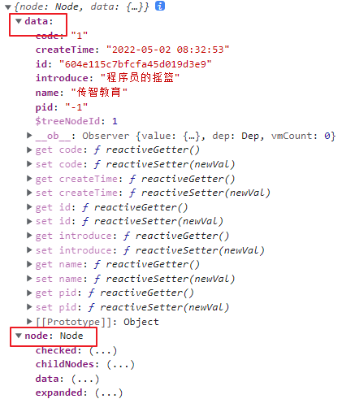

> 可能需要扁平化数据转树的操作
>
> 树型下拉列表，elementui中下拉列表不支持，需要使用el-tree并控制el-tree的显示与隐藏

简化--props的写法，只要后面的数据有类型就需要加冒号

```js
<el-tree
      :data="permissionData"
      :props="{ label: 'name'}"
    />
```

# 4. Notice

## Message 消息提示

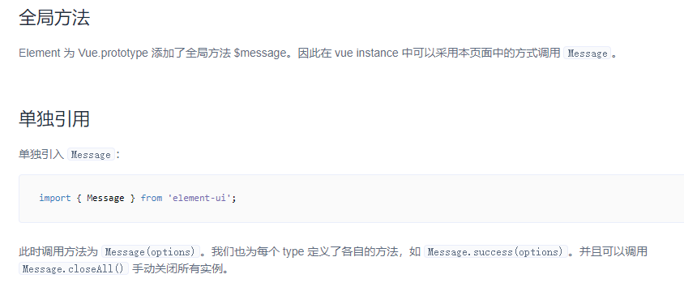

常用于主动操作后的反馈提示。与 Notification 的区别是后者更多用于系统级通知的被动提醒

**Element 为 Vue.prototype 添加了全局方法 $message。因此在 vue instance 中可以采用本页面中的方式调用 `Message`**

```js
this.$message({
          showClose: true,
          message: '这是一条消息提示'
        })

// 分为 success（绿色）、warning（橙色）、error（红色）、不写type就是info类名（灰色）this.$message('xxx')
// 常用
this.$message.success('xxx')
// 非vue文件中，调用Vue原型上的方法
Vue.prototype.$message.warning('xxx')
```


## MessageBox 弹框

messagebox弹框是为了美化系统的alert prompt、confirm，更复杂的业务使用dialog。bom自带的原生方法，是一个同步事务，执行的时候会阻塞进程，造成后面的代码不执行。

这里elementui封装成了Promise对象，是一个异步事务，后面的 代码可以执行

常用来做一些铭感操作，比如删除前的提示，或者退出前的提示

```js
 this.$confirm('此操作将永久删除该文件, 是否继续?', '提示', {
          confirmButtonText: '确定',
          cancelButtonText: '取消',
          type: 'warning'
        }).then(() => {
          this.$message({
            type: 'success',
            message: '删除成功!'
          });
        }).catch(() => {
          this.$message({
            type: 'info',
            message: '已取消删除'
          });          
        });

// 改良写法
const res = await this.$confirm().catch(e => e)
if(res != 'confirm') return// 取消什么也不做
// res=confirm就是选择的确定，res=cancel就是选择的取消
this.$message.success('xxx')// 点击确认需要提醒用户
```

# 5. Navigation

## NavMenu 导航菜单

template标签，就是一个虚拟标签，起到的作用就是包裹多个标签

1. vue文件的最外面的模块标签
2. 具名插槽和作用域插槽
3. 用来包裹标签，不知道循环什么组件导航朱建忠，循环创建el-menu-item或者el-submenu

属性介绍

* default-active 默认激活的菜单项
* 子菜单的index 菜单的唯一标识
* :router="true" 在组件库中，所有boolean类型的属性，要记得加: 才有类型（简写：直接写 router属性即可）

注意事项：

* 最外面是el-menu标签，以前可以套上el-submenu（有子菜单children的），submenu前面必须要有一段<template #title>来标识子菜单的标题，其后再跟上el-menu-item渲染每个导航项
* el-submenu和el-menu-item可以平级，el-submenu里面可以包含el-menu-item
* 插槽碰到的老语法，统一替换成v-slot+template新语法

```html
<el-menu
          router
          :default-active="$route.path"
          background-color="#23262e"
          text-color="#fff"
          active-text-color="#ffd04b"
        >
        <!-- template 第三种用法 虚拟标签，用来包裹要循环的标签，这里根据children的布尔值来决定是否循环el-menu-item或者el-submenu key只能加载真实标签上-->
        <template v-for="item in menuList" >
          <el-submenu v-if="item.children" :key="item.indexPath" :index="item.indexPath">
            <!-- el-submenu一定要传title的具名插槽 -->
            <template #title>
              <i :class="item.icon"></i>
              <span>{{item.title}}</span>
            </template>

                <!-- 开启路由模式时，以index为path跳转 -->
              <el-menu-item v-for="sub in item.children" :key="sub.indexPath" :index="sub.indexPath">
                <template #title>
                <i :class="sub.icon"></i>
                <!-- 这里span标签上是老用法，直接加在某个标签上具名，可加可不加，用v-slot的话只能搭配template使用 -->
                <!-- el-submenu必须加template具名title，el-menu-item的title可加可不加 -->
                <span>{{sub.title}}</span>
                </template>
              </el-menu-item>

          </el-submenu>

          <el-menu-item v-else :key="item.indexPath" :index="item.indexPath">
            <i :class="item.icon"></i>
            <!-- el-menu-item传不传 -->
            <span slot="title">{{item.title}}</span>
          </el-menu-item>
        </template>
</el-menu>
```

> 可能需要扁平化数据转树的操作

## Tabs 标签页

分隔内容上有关联但属于不同类别的数据集合，也是用来做导航

el-tabs里面包裹着el-tab-pane

注意：一般为了拆分业务，会把每个tab里面的内容拆分为一个组件

```js
		<el-tabs>
          <el-tab-pane label="登录账户设置">
            <login-setting>xlsx</login-setting>
          </el-tab-pane>
          <el-tab-pane label="个人详情">
            <user-info>xxxx</user-info>
          </el-tab-pane>
          <el-tab-pane label="岗位信息">
            <job-info>xxx</job-info>
          </el-tab-pane>
        </el-tabs>
```

## Dropdown 下拉菜单

* el-dropdown-item绑定点击事件时，需要加上`.native`修饰符，这样才可以触发子组件的点击事件

* 通过组件`slot`来设置下拉触发的元素以及需要通过具名`slot`为`dropdown` 来设置下拉菜单（固定写法），通常是el-menu，这是下拉菜单

先是el-dropdown然后包一些标题之类的，然后el-dropdown-menu设置slot为下拉菜单，然后el-dropdown-menu里面的el-dropdown-item为下拉菜单项

```js
		       <el-dropdown trigger="click">
                  <span style="cursor:pointer;">
                    操作<i class="el-icon-arrow-down" />
                  </span>
                  <el-dropdown-menu slot="dropdown">
                    <el-dropdown-item>添加子部门</el-dropdown-item>
                  </el-dropdown-menu>
                </el-dropdown>
```

默认是hover显示下拉菜单，设置trigger属性为click可以点击显示下拉菜单

```js
<el-dropdown trigger="click">
```

# 6. Others

## Dialog 对话框

在保留当前页面状态的情况下，告知用户并承载相关操作，相比messageBox来说，用来设置更大的业务场景

需要自己在data中定义一个变量来控制对话框的显示与隐藏`showDialog`

对话框组件在模板中的位置一般有两种放法

1. 跟在控制它显示隐藏的按钮后面
2. 放在模板根标签的最后面

常用属性：

* @closed事件：在表单（关闭动画完全消失）关闭后的回调函数，可以用来重置表单
* :close-on-click-modal="false"关闭点击modal（对话框外的区域）关闭对话框
* :close-on-press-escape="false"关闭按下esc关闭对话框
* fullscreen全屏显示对话框，一般用来添加一些复杂的业务（很多信息）
* before-close关闭前的回调，会暂停dialog的关闭，常用this.$confirm()来提示用户是否要关闭

注意事项：

* 一般el-dialog里面需要包裹form表单，如果业务简单就几个表单标签，可以直接写，如果业务复杂建议二次封装一个组件（将el-form在封装成一个组件）。二次封装后就需要进行频繁的父子通信和父传子

```js
<el-dialog
      :title="dialogTitle"
      :visible.sync="showDialog"
      :close-on-click-modal="false"
      :close-on-press-escape="false"
	  @closed
    >
      <add-or-edit v-if="showDialog" :id="curId" :is-edit="isEdit" @success="hSuccess()" @close="showDialog=false" />
    </el-dialog>
```

## Card 卡片

将信息聚合在卡片容器中展示。就是一个容器，类似于div

Card 组件包括`header`和`body`部分，`header`部分需要有显式具名 slot 分发，同时也是可选的。（如果不需要头部可以不设置solt，直接在外面包一个el-card）

设置card的阴影，通过`shadow`属性设置卡片阴影出现的时机：`always`、`hover`或`never`。

```js
<el-card class="box-card" shadow="always">
  <div slot="header" class="clearfix">
    <span>卡片名称</span>
    <el-button style="float: right; padding: 3px 0" type="text">操作按钮</el-button>
  </div>
  <div v-for="o in 4" :key="o" class="text item">
    {{'列表内容 ' + o }}
  </div>
</el-card>
```

## Calendar 日历

value指定显示的月份，不指定默认显示当前月

```js
<el-calendar v-model="value">
</el-calendar>

<script>
  export default {
    data() {
      return {
        value: new Date()
      }
    }
  }
</script>
```

自定义日历组件使用作用域插槽

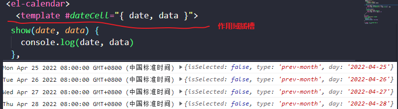