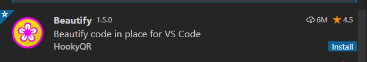
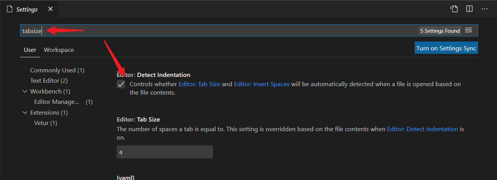

**把设置的formatterOnSave等和formatter相关的设置全部关掉，不然和ESlint的自动保存修复冲突，而报错。ESlint插件也可以美化格式，ESlint规范本身要求的格式就比较美观了，所以一些格式化代码的插件可能违反eslint规范**

顺序是——先有npm包，再有vscode插件

1. ESlint（代码质量和格式，质量：未使用变量、三等号、全局变量声明等）

ESlint是一个第三方包，只不过vue/cli脚手架自动帮我们内置了（项目初始化会自动下载ESlint），是用来检查代码的。每次保存之后，不符合ESlint规范的会报错（内置了一些默认配置，也可以在`.eslintrc.js`配置文件中自定义配置）

**那么我想在我一边写代码的时候就能直接看到错误，然后就能直接随手改正错误，这要怎么做呢？** 这时eslint的vscode插件诞生了。边写代码就能看到不符合eslint规范的波浪线。并且还是科一保存后自动格式化（符合eslint规范）（需要设置自动保存的配置）

虽然vscode插件也可以单独配置格式，但是如果项目中有`.eslintrc.js`文件，那么eslint插件会优先执行`.eslintrc.js`文件的配置（插件只是为了方便自己开发）


2. prettier（只校验格式，ESlint提供的格式化还不够）

保存代码后，js文件只是增加了分号，双引号。但是代码的格式该怎么乱还是怎么乱，即不美观，也不工整。并且eslint只能作用于js文件，像html，css，json，vue文件，eslint都处理不了他们的代码格式的问题。此时prettier认为代码的格式也很重要，于是prettier诞生了

`.prettierrc.js`自定义格式化的配置

想要在我写代码的时候，一Ctrl+S保存就能自动格式化代码，需要装一个prettier插件（可以不用装prettier的npm包）

> 如果都设置了保存后执行格式化，一Ctrl+S保存，先是自动加上分号和双引号，然后又没了。这还是因为eslint插件自动保存的效果和prettier插件自动保存的效果冲突了。
> 一保存，先是执行了eslint的配置，然后再执行prettier的配置。完蛋，不管前面的eslint设置得多好，只要和prettier的设置冲突了，就直接被prettier覆盖了
>
> 一定要注意**Eslint和prettier的配置要统一，不能冲突**
>
> 
>
> eslint默认是要双引号，加分号的。而prettier默认是单引号，不加分号的。所以这两个默认配置会冲突。可以把eslint的这个关掉

团队开发会有自己的一套eslint规则

保证prettier的规则不和eslint冲突就行了

## ESlint和prettier基础配置

ESlint

* 'space-before-function-paren': 0（去掉函数小括号前面的空格）

* 'vue/multi-word-component-names': 'off'（组件的名字不必都为多字符）

```js
module.exports = {
  root: true,
  env: {
    node: true
  },
  extends: ['plugin:vue/vue3-essential', '@vue/standard'],
  parserOptions: {
    parser: '@babel/eslint-parser'
  },
  rules: {
    'no-console': process.env.NODE_ENV === 'production' ? 'warn' : 'off',
    'no-debugger': process.env.NODE_ENV === 'production' ? 'warn' : 'off',
    'space-before-function-paren': 0
     'vue/multi-word-component-names': 'off'
  }
}

```

prettier

分别设置了单引号、分号、对象最后一个元素的逗号

```js
{
  "singleQuote": true,
  "semi": false,
  "trailingComma": "none"
}
```

## ESLint-基本介绍

### 目标

了解eslint的作用；

能判断eslint的错误；

### 什么是eslint

[ESLint](http://eslint.cn/) 是一个代码检查工具，用来检查你的代码是否符合指定的规范（例如： = 的前后必须有一个空格）。

**Eslint 是来规范团队开发的代码风格，一般由领导决定，虽然遵不遵守不影响最后代码的运行结果，但是如果有一个代码规范的话，更易于维护**

风格一致---不管多少人写，看出来是一个人写

* 规范
  * 行业推荐的规范； 在创建项目时，我们使用的是 JavaScript ==Standard== Style 代码风格的规则
  * 自定义的规范。你和你的团队可以自行约定一套规范
* 使用ESLint的好处在于：多人协作时代码风格统一

> ```
> eslint是法官，Standard 是法律
> ```

vue-cli工具在创建项目时提供选项，我们前面在创建项目时选中了它，所以它在本项目中是直接生效的 。

### JavaScript Standard Style 规范说明

在项目创建之初我们就选中了这个规范，也就是说，我们后续所有的代码都必须要遵守这个要求，否则ESLint就会报错。

下面是这份规则中的一小部分：

* *字符串使用单引号* – 需要转义的地方除外
* *关键字后加空格* `if (condition) { ... }`
* *函数名后加空格* `function name (arg) { ... }`
* 坚持使用全等 `===` 摒弃 `==` 一但在需要检查 `null || undefined` 时可以使用 `obj == null`
* ......

建议把https://github.com/standard/standard/blob/master/docs/RULES-zhcn.md看一遍，然后在写的时候遇到错误就可查询解决。如果找不到的规则 再看看这里: http://www.verydoc.net/eslint/00003312.html

### 代码规范错误

如果你的代码不符合standard的要求，eslint会跳出来**刀子嘴，豆腐心**地提示你。下面我们在main.js中随意做一些改动：添加一行`let a= 10;`

```
import Vue from 'vue'
import App from './App.vue'
import router from './router'

Vue.config.productionTip = false
let a = 10 // 这行代码是新添加的
new Vue({
  router,
  render: h => h(App)
}).$mount('#app')
```

按下保存代码之后：将会看在控制台中输出如下错误：


从左到右依次是：错误位置，错误级别，错误描述，规则名称

才写了一行代码，就报了两行错误： eslint 是来帮助你的，心态要好，有错，就改!

去 https://standardjs.com/rules-zhcn.html(或者上面2个网址里) 搜索上图第4步中的规则名字就知道错误原因了 (==用前面网址多用ctrl F 搜索哦==)

### 小结

ESLint是法官，它用我们约定的法律来检验我们的代码是否合法；

它可以帮助我们养成良好的编码习惯；

## ESLint-错误修正

### 目标

能看懂eslint的错误，并改正

### 错误提示

出现了错误不要怕，其实提示已经很全面了，大家按提示来就行。


### 改正错误的四种方式

有四种方法来修正错误：

* 手动修正：人肉修改
* 命令修正：npm run lint
* 修改规则：让代码符合修改之后的规则，当然也就不报错了
* 插件修正：配合vscode 中的eslint插件

### 手动修正

根据错误提示来一项一项手动修正。

如果你不认识命令行中的语法报错是什么意思，你可以根据错误规则名字（func-call-spacing, space-in-parens,.....）去 ESLint 规则列表网站中查找其具体含义。

建议大家手动去修改错误，帮助养成良好的编码习惯，更加专业

### 命令修正

vuecli创建项目时 提供了自动修复功能（有些复杂的错误还是要手动来改正），具体做法是运行：

```
npm run lint
```

### 小结

eslint错误修正有四种方式： 我们这里介绍了前面两种，后面两种再来分别介绍。

## ESLint-自定义规则

### 目标

了解eslint的自定义规则，能看懂.eslintrc.js的配置

### 自定义校验

在项目根目录下面，有一个.eslintrc.js文件，它是对eslint进行配置的，其中有一个属性是专门用来设置自定义代码规则的：rules

```js
module.exports = {
  root: true, // 当前项目使用这个配置文件, 不会往父级目录找.eslintrc.js文件
  env: { // 指定eslint启动环境(vuecli底层是node支持), browser: true也可以在浏览器设置
    node: true
  },
  extends: [ // 扩展配置
    'plugin:vue/essential', // vue里必须的规则
    '@vue/standard' // 使eslint继承@vue/cli脚手架里的 - standard标准
  ],
  parserOptions: { // 对新语法使用eslint
    parser: 'babel-eslint' // 使用babel-eslint 来解析新语法ES6
  },
  // 这里可以进行自定义规则配置
  // key：规则代号
  // value：具体的限定方式
  //   "off" or 0 - 关闭规则
  //   "warn" or 1 - 将规则视为一个警告（不会影响退出码）,只警告，不会退出程序
  //   "error" or 2 - 将规则视为一个错误 (退出码为1)，报错并退出程序
  rules: { // 自定义规则 - 其实上面集成后有很多内置的规则, 这里可以进行规则的一些修改
    'no-console': process.env.NODE_ENV === 'production' ? 'warn' : 'off', // 上线环境用打印就报警告, 开发环境关闭此规则
    'no-debugger': process.env.NODE_ENV === 'production' ? 'warn' : 'off', // debugger可以终止代码执行
    'no-multiple-empty-lines': 'off' // 不允许有连续多行空行(关闭规则)
  }
}
```

rules是一个对象，以键值对的格式来约定规则：

* 键名是规则名（可在报错信息和eslint官网查看）
* 值是这条规则的具体说明， 最常见的有off,warn,error。

> 如果需要修改eslint规范的话，需要修改`.eslintrc.js`文件，配置信息去官网中去看（不是技术活，就是个工具），配置文件需要重新启动服务器

### 示例 - 关闭多行空格

在配置文件中补充一条配置：

```
  rules: { // 自定义规则 - 其实上面集成后有很多内置的规则, 这里可以进行规则的一些修改
    // 省略其他
+   'no-multiple-empty-lines': 'off' // 不允许有连续多行空行(关闭规则)
  }
```

修改了配置文件，一定要重启项目，验收效果

## ESLint-在vscode中使用插件

### 目标

掌握配合vscode中的eslint插件一起工作的方法：

1. 有错误立即提示（显示波浪线）
2. ctrl+s保存时立即自动修正错误

### 改正错误的方式

有三种方法来修正错误：

* 手动修正: 人肉修改（项目开发不推荐）
* 命令修正：npm run lint，可以修改 eslint 的错误（不合 eslint 规范，yarn lint不能识别一些写错的代码。比如定义变量未使用）
* **插件修正: 配合vscode 中的eslint插件**，保存后自动消除eslint报错

> ESlint 只能帮忙解决代码风格，并不能修复bug

### 安装eslint插件

我们还可以安装eslint插件, 让vscode实时告诉我, 我哪里错了


==非常非常非常重要==： 用vscode打开项目时，将脚手架工程作为vscode根目录, 因为eslint要使用配置文件.eslintrc

### eslint自动格式化修正代码

按如下五个步骤：


下面是补充内容：

```
{
  "eslint.enable": true,
  "eslint.run": "onType",
  "eslint.options": {
      "extensions": [
          ".js",
          ".vue",
          ".jsx",
          ".tsx"
      ]
  },
  "editor.codeActionsOnSave": {
      "source.fixAll.eslint": true
  }
}
```

eslint.run - 运行eslint检验的时刻 (onSave保存) (onType输入时)

editor.codeActionsOnSave - 控制在保存时运行代码操作时修复哪些问题

* source.fixAll.eslint - 自所有插件的所有可自动修复的ESLint错误都将在保存时修复

更多的规则可以看[这里](https://www.cnblogs.com/jiaoshou/p/12218642.html)

### 备注：可能遇到的问题

#### ctrl+s保存不自动格式化

打开一个代码文件, 右下角有个ESLint, 如果是图示这样, 点击一下然后弹出来的对话框选择AnyWhere 在任意处生效(启动vscode中的eslint)

变成v就代表启动着呢


#### 自动缩进1

试着把Beautify插件卸载 - eslint也能美化代码哦



==可能还有JS/CSS Format插件/其他美化插件==

不想卸载可以禁用

如果你的vscode中用其它扩展 启用 自动格式化功能，则有可能与eslint的规则冲突！


解决方案：关闭vscode中的自动格式化

#### 自动缩进2

如果上面不行, 就修改vscode的配置

文件>设置里, 搜索这个, 把下面的勾去掉



#### 一保存, 单引变双引

原因：vetur插件和eslint冲突, 修改eslint插件配置, 把这里代码覆盖进去

```
{
    "eslint.run": "onType",
    "editor.codeActionsOnSave": {
        "source.fixAll.eslint": true
    },
    "vetur.validation.template": false, // 把 vetur 扩展的 template 格式化去掉
	"editor.formatOnSave": false, // 去掉 vscode 自带的自动保存 ，vscode 默认也是 false的，如果要用 eslint 格式化，默认的格式化就不能开启
    "eslint.enable": true, // eslint 格式化的配置
    "eslint.autoFixOnSave": true, // eslint保存时候自动解决语法错误
    "eslint.options": { // eslint选项-格式化js和vue文件
        "extensions": [
            ".js",
            ".vue"
        ]
    },
    "eslint.validate": [
        "javascript",
        {
            "language": "vue",
            "autoFix": true,
        },
        "html",
        "vue"
    ],
}
```

## ESlint常见规则

1. error  Component name "Login" should always be multi-word  vue/multi-word-component-names
   

   描述：ESlint要求组件名必须为驼峰或者多个单词组成`RegPage`、`regPage`、`reg-page`

   解决：可以添加esllint的配置rules`'vue/multi-word-component-names': 'off'`关闭这一规范

## ESlint插件+Prettier ESlint插件来自动格式化

ESLint 插件自动格式化操作手册

实现按照 ESLint 规则自动格式化需要借助 2 个插件：

* ESLint （读取 ESLint 配置文件进行语法检测），VS Code 编辑器中实时发现错误，输入过程中不符合ESlint就会爆红，同时保存的时候对有错误的自动修复（要看项目下有没有`.eslintrc.js`配置文件）--保存修复代码
* Prettier ESLint（按照 ESLint 配置文件进行格式化），按照Eslint规范格式化代码（比如缩进，或者对象里面没有内容什么的删除多余的空格）

都会读取 ESLint 配置文件，格式化是美化代码（关闭了formatOnSave，不然回合eslint保存修复相冲突）需要手动点击右键格式化，保存是修复代码（消除不符合eslint规范的代码）

说明一下这两个插件都是已`.eslintrc.js`为基础，先读取eslint的配置文件，有这个文件插件才生效，eslint的配置文件必须要在项目的根目录

> 出现一些黄线甚至红线不要紧，一切都要看保存后有没有报错（自动格式化）

使用步骤：

1. 安装插件

   

2. 修改默认格式化插件

   找到任意代码文件

   右键点击代码区域

   选择「使用...格式化文档」

   

3. 选择「配置默认格式化程序」

   

4. 选择「Prettier ESLint」

   

到此，已经可以实现「Alt + Shift + F」进行自动格式化啦！

如果希望按「Ctrl + S」自动格式化，还需做以下配置：

1. 打开 JSON 格式的设置文件

   找到菜单栏的文件

   首选项

   设置

   

   点击用户区的设置 JSON 图标

   > 用户区：应用于当前操作系统用户，只要是在当前电脑上开发，任意项目都会生效该配置（慎重修改）
   >
   > 工作区：只应用于当前项目，如果更换项目配置会失效


2. 将以下配置粘贴进设置 JSON 文件中

   ```JSON
   {
     "eslint.enable": true,
     "eslint.run": "onType",
     "eslint.options": {
         "extensions": [
             ".js",
             ".vue",
             ".jsx",
             ".tsx"
         ]
     },
     "editor.codeActionsOnSave": {
         "source.fixAll.eslint": true
     }
   }
   ```


到此为止，即可实现保存自动格式化，如果格式化并未按照 ESLint 规则进行，需要将其他所有格式化插件


目前主流的是这个Prettier插件，eslint插件本身就可以格式化代码，但是还不够，有些对齐之类的未执行，但是未违反eslint规范，可以使用prettier插件来进一步的美化


勾选了之后，保存后自动使用prettier进行格式化，可能会和eslint的自动格式化产生冲突


卸载！例如：Beautify、xxxFormatxxx