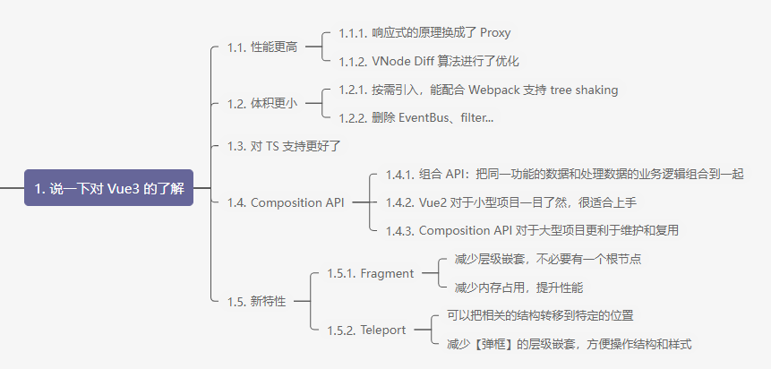
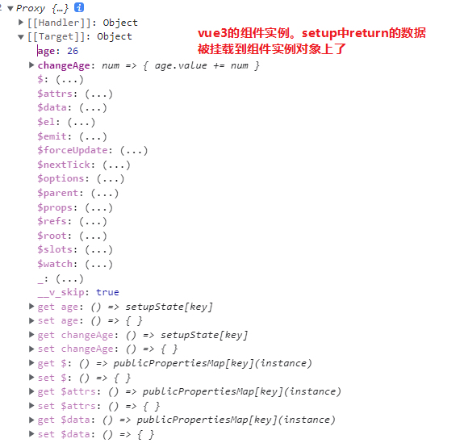
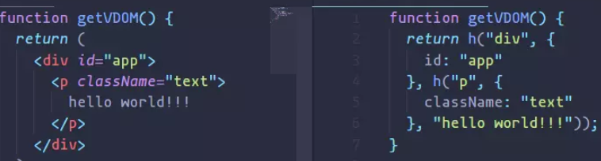
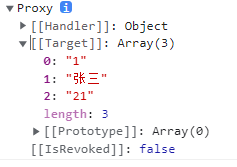
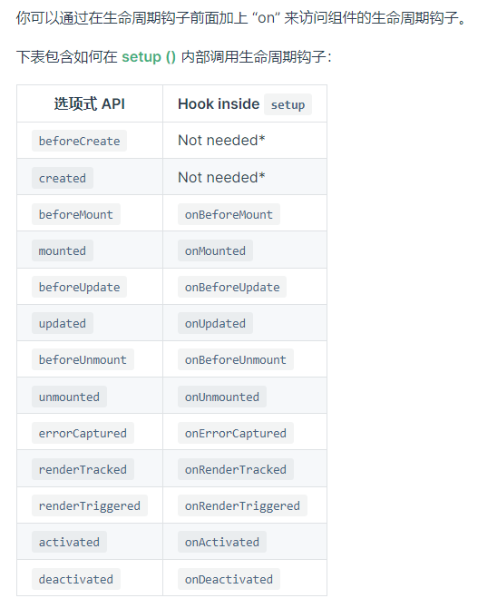
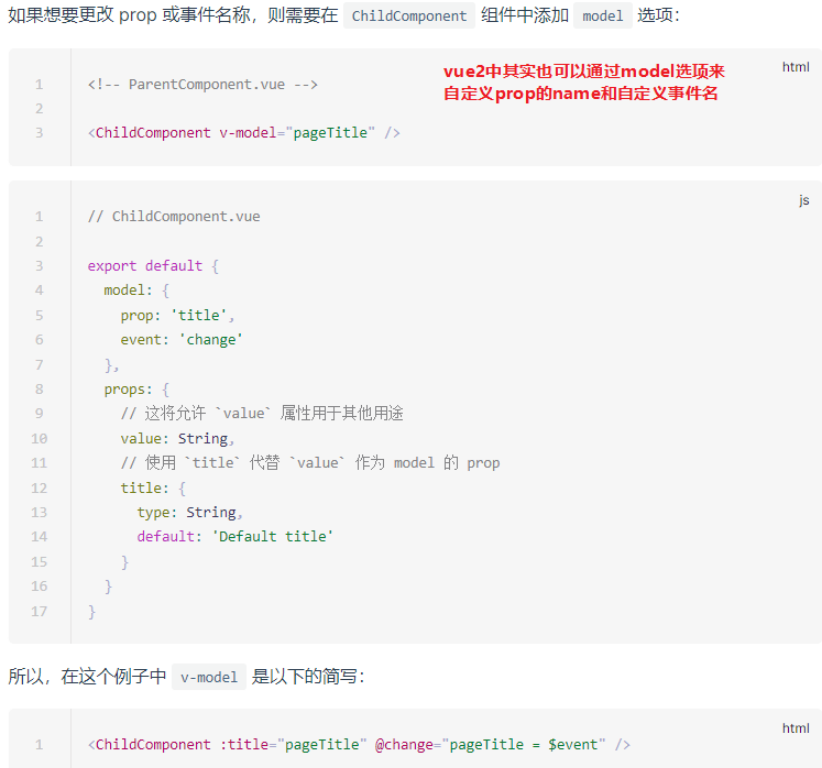
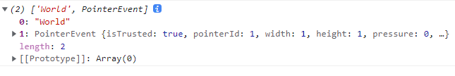
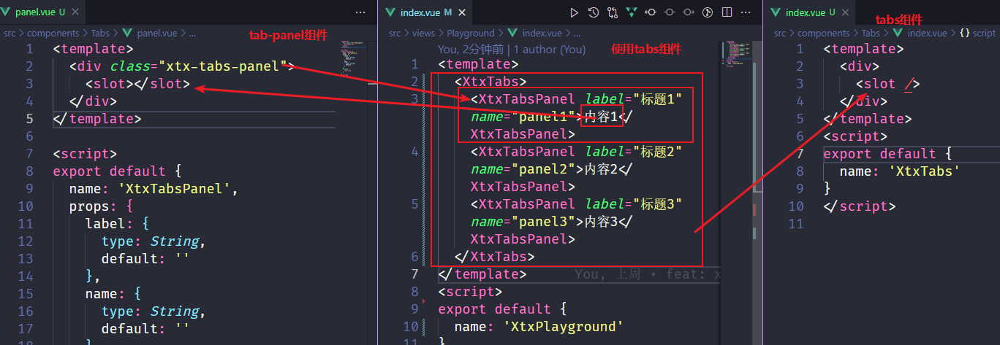

# 1. vue3介绍

[vue3官方中文文档](https://v3.cn.vuejs.org/)


- 2020 年 9 月 18 日，Vue 发布了 [3.0 版本](https://v3.cn.vuejs.org/)，代号：One Piece[（海贼王）](https://github.com/vuejs/vue-next/releases/tag/v3.0.0)，周边生态原因，当时大多数开发者还处于观望状态。
- 现在主流组件库都已经发布了支持 Vue3.0 的版本，例如 [Element Plus](https://element-plus.gitee.io/zh-CN/)、[Vant](https://vant-contrib.gitee.io/vant/v3/#/zh-CN)、[Vue Use](https://vueuse.org/)，其他生态也在不断地完善中，所以 Vue3 是趋势。
- 2022 年 2 月 7 日开始，[Vue3 也将成为新的默认版本](https://zhuanlan.zhihu.com/p/460055155)。

**优点**

* <font color=e32d40>**Composition API**</font> ，能够更好的组织、封装、复用代码，[RFCs](https://github.com/vuejs/rfcs/blob/master/active-rfcs/0013-composition-api.md)。
* 性能：打包大小减少 41%、初次渲染快 55%、更新渲染快 133%、内存减少 54%，主要原因在于 Proxy，VNode，[Tree Shaking support](https://v3.cn.vuejs.org/guide/migration/global-api-treeshaking.html#_2-x-%E8%AF%AD%E6%B3%95)。
* Better TS support，[源码](https://github.com/vuejs/vue-next)。
* 新特性：Fragment、Teleport、Suspense。
* 趋势：未来肯定会有越来越多的企业使用 Vue3.0 + TS 进行大型项目的开发。
* 对于个人来说：适应市场需求，学习流行的技术提升竞争力，加薪！



# 2. vite介绍

vite2.x + vue3.x搭建轻量级的vue应用


## 2.1. vite是什么

[Vite官方中文文档](https://cn.vitejs.dev/) 

vite是下一代前端开发与构建工具，热更新、打包构建速度更快，但目前周边生态还不如 Webpack 成熟，所以实际开发中还是建议使用 Webpack，vue/cli脚手架进行项目的创建

构建一个vite+vue项目

```bash
# 注意 Node 版本要 12 以上
# yarn create vite-app <project-name>
npm init vite-app <project-name>
cd <project-name>
npm install
npm run dev

// 还有很多种构建方式，查看官网
```

webpack与vite的不同点

* Webpack：会将所有模块提前编译、打包，不管这个模块是否被用到，随着项目越来越大，打包启动速度自然越来越慢。
* Vite：瞬间开启一个服务，并不会先编译所有文件，当浏览器用到某个文件时，Vite 服务会收到请求然后编译后响应到客户端（根据当前地址栏的地址发请求）。

index.html不再位于public文件夹中，而是位于项目的根路径下。在开发期间 Vite 是一个服务器，而 `index.html` 是该 Vite 项目的入口文件

> grunt/gulp ---webpack -- vue/cli（基于webpack）----vite（最新打包工具）
>
> vite是冷启动，一上来就启动服务，然后按需加载，配合webpack的tree shaking进行打包，然后vue3也是按需导入，很好的契合

## 2.2. vite创建vue应用

1. 在 `src/main.js` 中按需导入 `createApp` 函数。
2. 定义 `App.vue` 根组件，导入到 `main.js`。
3. 使用 `createApp` 函数基于 `App.vue` 根组件创建应用实例。
4. 挂载至 `index.html` 的 `#app` 容器。

```js
// vue2
import Vue from 'vue'
import App from './App.vue'

// 配置代码：项目上线后把警告日志全部关闭（关闭后用户体验更佳）
Vue.config.productionTip = false

// 创建Vue实例对象
new Vue({ //配置对象，创建一个对象里面加一个对象里面是配置对象
  // 将App组件"渲染"
  render: h => h(App),
}).$mount('#app') //渲染到id为app的容器中（html中，js动态引入）.


// vue3
import { createApp } from 'vue'
import App from './App.vue'
createApp(App).mount('#app')

// import { createApp } from 'vue'
// import App from './App.vue'
// const app = createApp(App)
// app.mount('#app')
```

注意：

* 这里的app就是相当于之前的Vue构造函数创建的vue实例，vue3所有需要扩展的功能都会挂载到app上

* vue3更强调函数式编程，以前的new xx现在统一都是createxxx()，并且这些createxx方法都是按需都vue模块中导入（vue3中几乎所有东西都是按需导入）

  ```js
  // Vue2: new Vue()、new VueRouter()、new Vuex.Store()
  // Vue3: createApp()、createRouter()、createStore()
  ```

  vue3里面的全部是按需导出，有需要时就导入

  

> es6导入文件后缀.js不能省略，vue2可以省略，vue3也不能省略
>
> 从错误提示可以看出来，这个时候处理 `import` 的是 typescript 编译器，不是 webpack，所以它不认得 `.vue` 扩展名。TypeScript 默认只能处理 `.ts` 和 `.tsx`，兼以 `.js`，`.json` 文件，其它文件它不能处理，所以默认不理会
>
> 不能直接导入文件夹去找index，js文件可以省略后缀.js，vue文件不能省略.vue。在js文件中可以直接导入文件夹，自动找到index.js文件

**vue3开发工具**

* VSCode 代码片段插件：Vue VSCode Snippets，使用见[文档](https://github.com/sdras/vue-vscode-snippets)。
* Vue3 的 Chrome 调试插件也变了，[下载链接](https://chrome.zzzmh.cn/info?token=ljjemllljcmogpfapbkkighbhhppjdbg)，注意安装后需要把之前的 Vue2 Devtools 关闭掉。
* Volar，使代码片段高亮，并且可以把template和script或者style左右分离查看，把vue2的vetur禁用

# 3. Vue3 组合式API介绍

## 3.1. 什么是组合式API

vue2都是Options API（选项式API），vue3都是Composition API（组合式API）


1. 选项式API（中小型项目）

* 优点：易于学习和使用，写代码的位置已经约定好。
* 缺点：数据和业务逻辑分散在同一个文件的 N 个地方，随着业务复杂度的上升，可能会出现动图左侧的代码组织方式，不利于管理和维护

2. 组合式API（更适合大型项目，好维护）

* 优点：可以把同一功能的<font color=e32d40>**数据**</font>和<font color=e32d40>**业务逻辑**</font>组织到一起，方便复用和维护。
* 缺点：需要有良好的代码组织和拆分能力，相对没有 Vue2 容易上手。
* 注意：为了能让大家较好的过渡到 Vue3.0 版本，目前也是支持 Vue2.x 选项 API 的写法。
* 链接：[why-composition-api](https://v3.vuejs.org/guide/composition-api-introduction.html#why-composition-api)、[composition-api-doc](https://v3.cn.vuejs.org/api/composition-api.html)。

补充知识：mixin也可以达到代码复用，并且业务逻辑统一的效果。但是也有缺点

mixin（混入，混合插入你的代码片段）缺点：

1. 数据来源不清晰
2. 变量名容易重复

## 3.2. Setup入口函数

* 是什么：`setup` 是 Vue3 中新增的组件配置项，作为组合 API 的入口函数。
* 执行时机：实例创建前调用，甚至早于 Vue2 中的 beforeCreate。
* 注意点：由于执行 setup 的时候实例还没有 created，所以在 setup 中是不能直接使用 data 和 methods 中的数据的，所以 Vue3 干脆把 setup 中的 this 绑定了 undefined，防止乱用！(vue3中很少使用this)
* 虽然 Vue2 中的 data 和 methods 配置项虽然在 Vue3 中也能使用，但不建议了，建议数据和方法都写在 setup 函数中，并<font color=e32d40>**通过 return 进行返回可在模版中直接使用**</font>（一般情况下 setup 不能为异步函数）。

```vue
<tempalte>
    <div></div>
    <p></p>
    <!-- vue3这里也不必只有一个根标签了 这种特性就叫fragment -->
</tempalte>

<script>
    export default {
        setup() {
            /// some code...
        }
    }
</script>
```
> 善于利用工具
>
> * better comments 插件 更好的vscode注释
>* i5ting_toc 将md文件转换成网页版去查看
> * Github Copilot 自动帮忙填充注释和代码

vue3的组件实例，都是被proxy所代理



## 3.3. setup的返回值为一个渲染函数

setup 也可以返回一个渲染函数（问：setup 中 return 的一定只能是一个对象吗？）

```js
<script>
  import { h } from 'vue'
  export default {
    name: 'App',
    setup() {
      return () => h('h2', 'Hello Vue3')
    }
  }
</script>
```

render函数用来渲染虚拟dom。创建虚拟dom节点，使用vue提供的h函数， h是createElement函数的简写，可以直接import h from 'vue'

渲染函数（render函数）可以用来代替template渲染



```js
// 虚拟Dom就是在js中模拟Dom对象树来优化Dom操作的一种技术或思路，它并不是真正意义上的Dom，它作为一个轻量级的js对象，在状态发生变化时，会进行Diff运算，来更新发生变化的Dom，对于未发生变化的Dom节点，不予操作，由于不是全部重绘，大大提高更新渲染性能

// 使用render函数渲染虚拟dom时，需要使用h函数，下面是h函数的用法（创建虚拟dom）
// 第一个参数（必选）一个html标签（string类型）或者一个含有数据选项的对象，或者一个function返回一个函数数据选项的对象。比如”div”就是创建一个 <div>标签
// 第二个参数（可选）一个对象，标签的数据对应的数据，主要用于设置这个dom的一些样式、属性、传的组件的参数、绑定事件之类
// 第三个参数：子级虚拟节点，字符串形式或者数组形式，（类型是数组，数组元素类型是VNode）主要用于说是该结点下有其他结点的话，就放在这里
```

本质就是h函数生成template模板（dom元素）。然后使用render函数渲染到页面

虚拟dom做了两件事：

* 创建了VNode来模拟DOM树
* 通过diff算法比对新旧DOM的变更状态

补充VNode：

VNode是一个类，使用他可以实例化各种类型的vnode实例，不同的DOM元素对应不同类型的vnode（h函数的返回值就是一个虚拟节点VNode)

渲染视图时，先模拟真实的DOM元素创建vnode，使用vnode渲染DOM节点，在每次渲染时，先将vnode缓存起来，下一次渲染时，通过比对新旧vnode的不同来修改真实的DOM元素

## 3.4. setup函数的两个参数

父传子

1. 第一个参数props，是一个对象


注意点：如果传过来的比如goods就是ref对象，props其实是一个reactive对象，那么里面的数据都具有响应式。那么props.goods其实也是一个reactive，也具有响应式。goods可以直接在template中使用不加.value，setup中也不加.value

> vue3仍然考虑单向数据流，所以props仍然是一个readonly，不要直接去修改props。想要props中的属性都具有响应式，使用toRefs  `const { xx, yy } = toRefs(props)`，这样props传的值都具有了响应式

2. 第二个参数context。setup(*props*,*context*) {}


attr就是$attrs（写在组件标签上的自定义属性，未用props接收，存在$attrs中）和slots就是$slots（父组件的插槽），这里的emit就是$emit函数


## 3.5. 以后常用setup语法糖写法

[https://staging-cn.vuejs.org/api/sfc-script-setup.html](https://staging-cn.vuejs.org/api/sfc-script-setup.html)

`<script setup></script>`是在单文件组件（SFC）中使用组合式API的编译时的语法糖。注意还可以再写一个script标签

```js
<script setup>
console.log('hello script setup')
</script>
```

里面的代码会被编译成组件 `setup()` 函数的内容。这意味着与普通的 `<script>` 只在组件被首次引入的时候执行一次不同，`<script setup>` 中的代码会在**每次组件实例被创建的时候执行**。

同时顶层的绑定会直接暴露给模板，不用再return了

另外还可以在里面import一个方法，模板中也可以直接使用，注意ref也要在setup语法糖中导入

```js
<script setup>
import { capitalize } from './helpers'
import { ref } from 'vue'
</script>

<template>
  <div>{{ capitalize('hello') }}</div>
</template>
```

# 4. Vue3 组合式API基础知识

响应式数据：数据更新，视图同步更新（不同于双向绑定，双向还包括视图到数据的同步更新，用v-model来完成）

* 小程序和 React 属于是侵入式的， 数据响应的方式比较直观，是通过主动调函数修改数据的同时触发视图更新
* Vue 的方式是非侵入式，Vue 的数据只是通过修改变量本身就触发了视图更新。Vue2 利用了 JS 的检测对象属性变化相关的 API 去劫持数据更新视图，vue3是使用proxy去实现数据代理

之前的vue2里面使用v-for渲染的数据是放在data中的，data中的数据都是响应式的数据，


## 4.1. reactive方法

vue3中const定义的数据默认并不具有响应式，即数据修改了，视图不会同步更新。而vue2中定义在data、props、computed

### 4.1.1. reactive介绍

reactive](https://v3.cn.vuejs.org/api/basic-reactivity.html#reactive) 是一个函数，用来将普通对象/数组包装成响应式式数据使用（基于 Proxy），无法直接处理基本数据类型！

```js
import { reactive } from 'vue'
const arr =reactive(['a','b','c'])

const state = reactive({
      arr : [
          {
            id: 0,
            name: 'ifer'
          },
          {
            id: 1,
            name: 'elser'
          },
          {
            id: 2,
            name: 'xxx'
          }
        ]
    })
```

reactive。使复杂的数据类型变成响应式的数据，不要使用 .value.直接state.name（包裹的就是vue2中data中定义的冒号右边的值）

1. 包裹数组



2. 包裹对象


### 4.1.2. 不同业务抽离成函数

hook就是函数，习惯用use命名开头

函数抽离到全局中，即script标签下面。export之上

```js
// 添加hook，就是函数，习惯命名以use开头，然后以一个对象导出
const useDel = () => {
// 1.删除
    const state = reactive({
      arr : [
          {
            id: 0,
            name: 'ifer'
          },
          {
            id: 1,
            name: 'elser'
          },
          {
            id: 2,
            name: 'xxx'
          }
        ]
    })
    const hDel=(index)=>{
      state.arr.splice(index, 1)
    }
return { state, hDel }
}

const useAdd = (state) => {
// 2.添加
    const userInfo ={
      id:'',
      name:''
    }

    // 方法
    const hAdd =() => {
      // 这样添加的是一个引用，会影响源数据
      // state.arr.unshift(userInfo)
      state.arr.unshift({ ...userInfo })
    }

    return { userInfo, hAdd }
}

export default {
  setup() {
    // 把相应的数据和方法解构出来
    const { state, hDel } = useDel()
    // 将state传参传进去
    const { userInfo, hAdd } =useAdd(state)
    
    return { state, hDel, userInfo, hAdd }
  }
}
```

### 4.1.3. 不同业务抽离成js文件

会新建一个hooks文件夹专门用来存放抽离的函数，hook是钩子的意思，就是函数，函数名习惯用use开头

```js
<template>
  <input type="text" v-model="userInfo.id">
  <input type="text" v-model="userInfo.name">
  <button @click="hAdd">点我添加</button>
  <ul>
    <li v-for="(item,index) in state.arr" :key="item.id" @click="hDel(index)">{{ item.name }}</li>
  </ul>
</template>

<script>
import { useDel, useAdd } from './components/hooks'

export default {
  setup() {
    // 把相应的数据和方法解构出来
    const { state, hDel } = useDel()
    // 将state传参传进去
    const { userInfo, hAdd } =useAdd(state)
    
    return { state, hDel, userInfo, hAdd }
  }
}
</script>
```

## 4.2. ref方法

ref 函数，可以把简单数据类型包裹为响应式数据（复杂类型也可以），注意 JS 中操作值的时候，需要加 `.value` 属性，模板中正常使用即可。


### 4.2.1. ref包裹简单数据类型

ref用来使简单数据类型变成响应式数据，将其包裹成一个响应式对象，用点value取值，但是模板中不需要加，内部会自动加（又叫解包）


```js
// 使用ref包裹之前data中数据的等号的右边的东西
  const state = ref('张三')
```

### 4.2.2. ref包裹复杂数据类型

* ref包裹复杂数据类型，可以统一使用ref。vue3.2之后性能更高

* 或者确定的是复杂数据类型使用reactive，后台传过来的不确定的使用ref。使用 .value 去取值，拿到那个对象

ref复杂数据类型


state.value拿到里面的数据


```js
// 使用ref包裹之前data中数据的等号的右边的东西
  const state = ref({name:'张三'})
```

注意事项：这种错误大多是ref对象未加.value


### 4.2.3. isReactive方法和isRef方法

用来判断是否是reactive类型或者ref类型，返回布尔值

```js
import { ifReactive, isRef } from 'vue'

// some code...
console.log(isReactive(xxx))
console.log(isRef(yyy))
```

## 4.3. toRef方法

遇到的问题

问题1：模板中多次使用到name和age都要加state.name、state.age，很重复，很麻烦，期望能够直接能使用 name、age 属性

问题2：只想使用两个属性，却把整个对象都导出了，没必要

```js
//使用解构：
    const { name, age } = state
// 这样是新建的变量，会脱离原来的响应式对象环境，从而失去响应式

// 或者导出的时候return{
      name:state.name,
      age:state.age
    }
// 这样同样也相当于是复制一份，会失去原来对象的响应式环境
```

解决方法：借助vue3的toRef方法

1. 把state这个响应式对象里面的name属性变成单独的响应式ref对象

2. 并且转换之后的值和之前的是关联的，对state.age的修改会影响到转换后的age，对age的修改会影响原来的state.age

toRef 函数的作用：转换<font color=e32d40>**响应式对象**</font>中某个属性为单独响应式数据，并且转换后的值和之前是关联的（ref 函数也可以转换，但值非关联）

需要使用name.value取值


```js
let name = toRef(state, "name")
let age = toRef(state, "age")
```

> 如果直接使用ref，就会失去了和原来数据的关联，就是一个新的ref对象
>
> 带下划线的都是私有属性，vue内部使用的，开发者不用关心

## 4.4. toRefs方法

toRefs，将对象中的所有的属性转换成单独的ref对象，并且建立起关联，setup中需要address.value拿到值


toRefs如果是ref对象需要是要toRefs(xx.value)，如果是reactive对象直接toRefs(xx)

```js
const state = ref({
      name: "张三",
      age: 23,
      address: '湖北'
      // ...
    })
const state1 = reactive({
      name: "张三",
      age: 23,
      address: '湖北'
      // ...
    })

// 对象赋值直接解构拿到ref对象。然后再 .value拿到值
const { name, age, address } = toRefs(state.value)
const { name, age, address } = toRefs(state1)
```

开发中常见写法是直接把toRefs在setup的return中展开

```js
return {
      // 最常见的还是下面这种写法，将所有的属性都导出成单独的ref对象
      ...toRefs(state1)
    }
```

但是两种写法都有自己的优缺点：

* return { ...toRefs(state) }，这种就是写法简便，只能在template可以只写属性，setup还是要不停地点语法
* 相当于const { address, age, name } = toRefs(state) 再return { address, age, name }，这种虽然写起来复杂，但是在setup中也可以简写

## 4.5. computed方法

vue3都是函数式编程，所以用computed方法来定义计算属性，使用之前需要先从vue模块中按需导入

可以调用多次computed方法，为了方便维护，可以把所有的computed定义在一个对象中（默认就是响应式的）

用法同vue2一模一样，只是写法不同

computed是一个ref对象

### 4.5.1. 计算属性简单用法

```js
import { reactive, computed, toRefs } from 'vue'

// 1.传入一个函数
const fullName = computed(()=>{
    return state.firstName+''+state.lastName
}) 
// 2.传入一个对象，里面只写get函数，同默认写法一样，这个同vue2
  const fullName = computed({
    get(){
    return state.firstName+''+state.lastName
    }
  }) 
```

### 4.5.2. 计算属性高级用法

传入一个对象，里面用上get和set函数。同vue2，只是写法不同

```js
const fullName = computed({
    get(){
    return state.firstName+' '+state.lastName
    },
    set(newValue){
        // newValue为传过来的新值
      const arr = newValue.split(' ')
        state.firstName = arr[0]
        state.lastName = arr[1]
    }
  })
```

> 计算属性默认都是ref属性，具有响应式

## 4.6. watch方法

**watch只能监听响应式数据。监听普通数据watch不生效**

一般watch的时候不会对比新旧值，也不会通过传参拿到最新的值，之前vue2中是直接this.xx，现在直接拿原位置的值就是最新的数据

### 4.6.1. 监听reactive

监听reactive的内部数据时，强制开启了**深度监听**，且配置无效，监听对象的时候newValue和oldValue是全等的

```js
const state = reactive({
        name: 'ifer',
        hobby: {
          eat: '西瓜'
        }
      })
watch(state, (newValue, oldValue)=>{
      // 这里是相等的，都是最新的数据
      console.log(newValue === oldValue)
    },{
      // 无效
      deep:false
    })
    return {
      state
    }
```

> **reactive响应式对象内部的对象也是一个reactive响应式对象（用isReactive判断），内部的数据都是具有响应式的**

### 4.6.2. 监听ref

监听简单数据

```js
const age = ref(18)
const count = ref(0)
// watch可以监听ref对象，简单数据类型
watch(age,(newValue,oldValue)=>{
      // 这里的新旧数据是正常的，不相等
      console.log(newValue,oldValue)
    }) 

//监听多个简单数据，一个方法里两个都变化，只触发一次watch，可以用nextTick强制多次触发watch
watch([ age, count ],(newValue,oldValue)=>{
      // 这里的新旧数据是正常的，不相等
      console.log(newValue,oldValue)
      console.log('111')
    },{
      // 立即侦听，和vue2的watch实现一样的。刚开始会执行一次这里的回调
      immediate:true
    })
```

监听复杂数据类型

**ref 默认并不是深度监听的**，watch的是ref对象的话，【只能监听第一层】，即state.value的地址变化。state.value = {}触发watch

```js
// 如果直接watch的是state.value.hobby.eat，则改变时触发watch（用一个函数返回）
// 如果直接watch的是state.value，注意state.value是reactive对象，默认深度侦听
    watch(state, (newValue, oldValue) => {
      console.log(newValue, oldValue)
    },{
      deep: true
    })
// 可以使用第三个参数，{ deep: true } 来实现深度侦听，立即侦听配置也放在第三个对象中
// { deep: true, immediate: true }

// 可以这样写，自动深度侦听，watch监听reactive对象是深度侦听
    watch(state.value, (newValue, oldValue) => {
      console.log(newValue, oldValue)
    })
```

> **ref 如果包裹复杂数据类型，其实内部还是借助 reactive 去实现的，即ref对象内部的对象或数组仍然是reacitve类型。**state.value就是reactive类型
>
> ```js
>  const state = ref({
>       hobby: {
>         eat: '西瓜',
>       },
>     })
>  
> console.log(isReactive(state)) // false
> console.log(isReactive(state.value)) // true
> console.log(isReactive(state.value.hobby)) // true
> ```

### 4.6.3. 对比监听reactive和监听ref

* 监听reactive state = {} 改变state的地址，对reactive本身的修改，监听不到（脱离了原来的响应式环境）

* 监听ref state.value = {}触发watch，ref只监听第一层，内部的深度无法监听

### 4.6.4. 监听普通属性

注意watch只能监听响应式数据

vue官方警告信息：`A watch source can only be a getter/effect function, a ref, a reactive object, or an array of these types`

watch 可以监听一个函数，函数返回普通值（必须通过函数返回值来监听普通属性值）就是一个getter

```js
const state = ref({
      hobby: {
        eat: '西瓜',
      },
    })

watch(
      () => state.value.hobby.eat,
      (newValue, oldValue) => {
        console.log(newValue, oldValue)
      }
    ) 

// 下面watch的不合法，控制台会弹出黄色警告信息
     /* watch(
      state.value.hobby.eat,
      (newValue, oldValue) => {
        console.log(newValue, oldValue)
      }
    )  */

// 下面watch的不合法，控制台会弹出黄色警告信息
    /* watch({ name: 'xx' }, (newValue, oldValue) => {
      console.log(newValue, oldValue)
    }) */
```

# 5. Vue3其他变更

## 5.1. Vue3生命周期

* [组合 API](https://v3.cn.vuejs.org/api/composition-api.html#%E7%94%9F%E5%91%BD%E5%91%A8%E6%9C%9F%E9%92%A9%E5%AD%90)生命周期写法，其实 [选项 API](https://v3.cn.vuejs.org/api/options-lifecycle-hooks.html#beforecreate) 的写法在 Vue3 中也是支持。
* Vue3（组合 API）常用的生命周期钩子有 7 个，<font color=e32d40>**可以多次使用同一个钩子**</font>，**执行顺序和书写顺序相同**。
* setup、onBeforeMount、onMounted、onBeforeUpdate、onUpdated、onBeforeUnmount、onUnmounted

这些钩子编写的代码需要直接在`setup`函数中编写



```js
setup() {
    // 1. 把 beforeCreate 和 created 综合为了 setup，生命周期钩子都在在setup中调用，传一个回调函数
    // 2. 同一个生命周期钩子可以使用多次，不会被覆盖
    
    // 使用方法，调用方法，然后传一个回调函数
    onMounted(() => {
      console.log('onMounted1')
    })
    onMounted(() => {
      console.log('onMounted2')
    })
  }
```

## 5.2. v-model

响应式数据就是数据更新，视图同步更新，与数据的双向绑定不完全相同，双向绑定（vue使用v-model来实现）还要求视图更新后，数据也同步变化

* v-model必须绑定一个响应式数据。才能实现双向绑定，数据影响视图，视图影响数据

* v-model如果只绑定一个普通数据，那么只能用来收集数据，比如表单的数据收集（只用自定义input事件触发，数据改变这一条传递）

### 5.2.1. vue2父子通信

父传子使用属性传递就行，子传父需要使用自定义事件

```js
// 父亲
//1. 父组件通过自定义属性传递数据
  <Child :money="money" @updateMoney='hUpdate'>
      
// 儿子
// #2 子组件通过 props 去接收
props: ['money']
const hClick = ()=>{
        context.emit('updateMoney', this.money + 1)
    }
```

如果传递的属性是value，并且自定义事件是input（并且是用来修改传递的值）可以使用v-model简写（这个时候传递的prop name只能叫value，事件名只能叫input）

```js
// 父亲
// 1. 父组件通过自定义属性传递数据
  <Child :value="money" @input='val => money = val '>
  <Child v-model="money">
      
// 儿子
// #2 子组件通过 props 去接收
props: ['money']
const hClick = ()=>{
        context.emit('input', this.money + 1)
    }
```



> 其实父亲在子组件标签上传递的属性，默认放在了子组件的根标签上

### 5.2.2. $event的用法

1. 事件对象

写到真正的事件绑定时候的 $event 表示事件对象（真事件非自定义事件处理函数的实参$event）

```vue
// 子组件
<div>TestChild: {{ modelValue }}</div>
  <!-- 写到真正的事件绑定时候的 $event 表示事件对象 -->
  <!-- 第二个及以后的参数是传递给父组件的参数 -->
  <button @click="$emit('changeMsg', 'World', $event)">修改 msg</button>
  <!-- <button @click="$emit('changeMsg', ['World', $event])">修改 msg</button> -->

// 父组件
<!-- 父组件template的自定义函数没有加参数，参数在下面的函数定义的时候接受 -->
<TestChild :modelValue="msg" @changeMsg="hChange" />
<!-- 这样写，这里的形参，可以一个一个接受子组件$emit后面传过来的一系列参数 -->
    const hChange = (a, b) => {
      console.log(a, b)
      msg.value = "hello world !"
    }
```

事件未传参，事件处理函数的第一个参数表示事件对象

事件传了参，手动传入实参$event为事件对象

2. 子组件传递过来的**第二个**参数（自定义事件处理函数的实参$event）

```html
// 父组件
<template>
  <!-- 在模板中自定义事件写了参数，即加了括号，这里的都是实参，这里的$event就永远表示子组件$emit的第二个参数，即后面传递过来的参数，如果多个参数可以写成一个数组 -->
  <!-- 其实自定义事件的$event完全没必要写，有一点，可以简写，直接在template拿到传过来的值@changeMsg="xxx = $event" -->
  <!-- 另外自定义函数也可以写成箭头函数 @changeMsg="val => xx = val" val拿到子组件传过来的值-->
  <TestChild :modelValue="msg" @changeMsg="hChange($event)" />
</template>

// 这里的参数是形参
const hChange = content => {
      console.log(content)
      msg.value = "hello world !"
    }
```

多个参数放在一个数组里面，$event这个时候拿到的就是一个数组



### 5.2.3. vue3中v-model

vue3.0中的v-model语法有所变化，如果我们给一个组件书写了v-model之后，

1. 给子组件传递了一个名称为`modelValue` 的prop

2. 给子组件绑定了一个名称为`update:modelValue` 的自定义事件

vue3的v-model是vue2的v-model和.sync的结合体，支持使用v-model的参数来自定义属性名，但是自定义处理函数名还是只能叫`update:xxx`

使用了emit需要在emits中定义，表示都是自定义函数，不然vue会报警告信息

```js
export default {
  props: ["modelValue"],
  emits: ["changeMsg"],
}
```

直接使用v-model，那么只能传递modelValue这个prop name

```html
// 父组件
<!-- 四种写法一样 -->
<CustomChild :modelValue="msg" @update:modelValue="val => msg = val"/>
<CustomChild :modelValue="msg" @update:modelValue="msg = $event" />
<CustomChild v-model="msg" />
<CustomChild v-model:modelValue="msg" />

// 子组件
<button @click="$emit('update:modelValue', 'World')">修改 msg</button>
export default {
  props: ["modelValue"],
  emits: ["update:modelValue"],
}
```

**使用v-model的参数来修改传递的prop name**

```html
// 父组件
<CustomChild :age="age" @update:age="age = $event" /> 
    <!-- 是以上的简写 ，可以修改prop的name-->
<CustomChild v-model:age="age" />

// 子组件
<button @click="$emit('update:age', 19)">修改 age</button>
export default {
  props: ["age"],
  emits: ["update:age"],
}
```

## 5.3. provide/inject

使用 provide 函数和 inject 函数完成跨层级组件通讯，就是嵌套很多层的话祖先和孙子的传递可以使用这两个方法，包括子组件作为父组件的插槽填充到slot标签，也可以看成父子组件可以使用provide和inject，传值的时候不能使用props传值，使用provide/inject传值



vue2中（2.2.0新增）也有provide和inject，用来进行更深层次的祖先子孙之间的通信（祖先provide，儿子inject）

**provide/inject可以看成加长版的props**

 为了增加 provide 值和 inject 值之间的响应性，直接provide一个响应式数据，这样的话如果祖先组件中的属性有任何修改，子组建的也会自动更新

```js
// 1. 祖先provide
// 名字叫作注入依赖
    const money = ref(100)
    // #1. 提供依赖
    provide("money", money)
    const changeMoney = () => {
      money.value += 10
    }
    provide("changeMoney", changeMoney)

    // 可以provide一个数组，遵守语法规则即可，provide(name | string, value)
    // provide('xx', [ money, changeMoney ])

// 2. 子孙注入
setup() {
    // #2 inject 接收数据 语法：inject(要 inject 的 property 的 name | string, 默认值(可选) )
    const money = inject("money")
    const changeMoney = inject("changeMoney")

    return {
      money,
      changeMoney,
    }
  },
```

> 注意provide和inject的时机，如果父组件的provide放在事件处理函数中，这样inject的时候还未provide，所以inject的时候还是undefined

## 5.4. ref属性

### 5.4.3. ref获取dom对象

vue2获取dom对象直接ref绑定属性，然后this.$refs.xxx

vue3中似乎要麻烦一些，需要先定义一个空ref对象，然后导出，然后在模板中ref绑定，最后在onMounted钩子中直接拿到dom对象（四部曲）

```vue
<template>
  <!-- #3 和 div 的 ref 属性进行绑定 -->
  <div ref="divRef">box</div>
</template>

<script>
import { onMounted, ref } from "vue"

export default {
  setup() {
    // #1 定义一个空ref对象
    const divRef = ref(null)

    onMounted(() => {
      // #4 divRef.value 就是 DOM
      // console.log(divRef)
      divRef.value.style.backgroundColor = "red"
    })

    // #2 导出
    return {
      divRef,
    }
  },
}
</script>

```

### 5.4.4. ref获取组件实例

同dom对象

```vue
<template>
  <!-- #3 和 div 的 ref 属性进行绑定 -->
  <DivChild ref="childRef" @close="close" />
  <button @click="handleClick">点击</button>
</template>

<script>
import { ref } from "vue"
import DivChild from "./DivChild.vue"

export default {
  components: {
    DivChild,
  },
  setup() {
    // #1
    const childRef = ref(null)

    const handleClick = () => {
      // #4 childRef.value 就是 组件实例
      console.log(childRef.value)
      childRef.value.changeAge(8)
    }

    const close = () => {
      console.log("~~~")
    }

    // #2 导出
    return {
      childRef,
      handleClick,
      close,
    }
  },
}
</script>

```

## 5.5. Fragment

* Vue2 中组件必须有一个跟标签。
* Vue3 中组件可以没有根标签，其内部会将多个标签包含在一个 Fragment 虚拟元素中。
* 好处：减少标签层级和内存占用。

## 5.6. teleport

传送，能将特定的 HTML 结构（一般是嵌套很深的）移动到指定的位置，解决 HTML 结构嵌套过深造成的样式影响或不好控制的问题。但是又希望模态框的逻辑存在于组件中，使用teleport组件来完成（包裹）

```js
<template>
  <div class="child">
    <teleport to="body">
      <dialog v-if="bBar" />
    </teleport>
    <button @click="handleDialog">显示弹框</button>
  </div>
</template>
```

Vue 将正确地将模态框内容渲染为 `body` 标签的子级（就可以更好地设置css选择器，但是业务逻辑还在原来的组件中）

如果 `<teleport>` 包含 Vue 组件，则它仍将是 `<teleport>` 父组件的逻辑子组件。仍然可以进行正常的组件通信

## 5.7. 一些其他的新特性

[参考 Vue3 迁移指南](https://v3.cn.vuejs.org/guide/migration/introduction.html#%E6%A6%82%E8%A7%88)

1. 全局 API 的变更，[链接](https://v3.cn.vuejs.org/guide/migration/introduction.html#%E5%85%A8%E5%B1%80-api)。
2. data 只能是函数，[链接](https://v3.cn.vuejs.org/guide/migration/data-option.html#%E6%A6%82%E8%A7%88)。
3. 自定义指令 API 和组件保持一致，[链接](https://v3.cn.vuejs.org/guide/migration/custom-directives.html#_2-x-%E8%AF%AD%E6%B3%95)。
4. keyCode 作为 v-on 修饰符被移除、移除 v-on.native 修饰符、filters 被移除，[链接](https://v3.cn.vuejs.org/guide/migration/introduction.html#%E7%A7%BB%E9%99%A4-api)。
5. \$on、\$off、\$once 被移除，[链接](https://v3.cn.vuejs.org/guide/migration/events-api.html#%E6%A6%82%E8%A7%88)。
6. 过渡类名的更改，[链接](https://v3.cn.vuejs.org/guide/migration/transition.html#%E6%A6%82%E8%A7%88)。
7. ...

# 6. todolist

## 6.1. 注意点：

* 定义数据为空的话需要`const name = ref(null)`
* 连取两次反就是转换成布尔值，`!!xxx`

* 所有的都是计算属性封装在一个对象之中

```js
// 优化做法，用一个对象包裹起来
    const complete = {
      itemsLeft: computed(() => {
        return state.list.filter(item => !item.flag).length
      }),
    // ...
    }
    return {
        ...complete
    }
```

* 数据持久化（一定要某个地方存，某个地方取，一般是初始化的时候取），watch监听reactive想要监听本身的用法

```js
    const state = reactive({
      list: JSON.parse(localStorage.getItem("myData")) || [
        { id: 1, name: "吃饭", flag: true },
        { id: 2, name: "睡觉", flag: false },
        { id: 3, name: "打豆豆", flag: true },
      ],
      todoName: "",
      tabs: ["All", "Active", "Completed"],
      active: "",
    })
    
    // 1. state.list是一个reactive类型，只能监听内部数据的变化，即state.list = [xxx]时，监听不到
    /* watch(state.list, () => {
      localStorage.setItem('myData', state.list)
    }) */

    // 2. state是一个reactive类型，可以监听list的数据变化，但是存起来的是整个对象，多余了，下面这种写法也可以，但是存多的数据涉及到了性能的浪费
    /* watch(state, () => {
      // 这里传参可以拿到newValue，但是可以不用，直接去reactive里面的数据就是最新的数据
      localStorage.setItem('myData', JSON.stringify(state.list))
    }) */

    // 3. 新写法: 把reactive当作普通值来监听，这样只能监听本身地址值的变化，所以要使用deep来深度监听
    watch(
      () => state.list,
      () => {
        localStorage.setItem("myData", JSON.stringify(state.list))
      },
      {
        deep: true,
      }
    )

 	// console.log(isReactive(state.list)) 仍然是reactive对象
    // 这样return了之后，template标签中可以直接使用，setup中使用需要使用xx.value即可
    return {
      ...toRefs(state)
    }
```

## 6.2. 底部的tabs做法

* 点击高亮，定义一个数组tabs用来标识三个状态，定义一个变量avtive来标识现在是哪个状态

```js
<footer class="footer" v-if="showFooter">
      <span class="todo-count"
        ><strong>{{ itemsLeft }}</strong> item left</span
      >
      <ul class="filters">
        <li v-for="item in tabs" :key="item" @click="active = item">
          <a :class="{ selected: active === item }" href="#/">{{ item }}</a>
        </li>
      </ul>
      <button class="clear-completed" v-if="showClear" @click="clearCompleted">
        Clear completed
      </button>
    </footer>
```

* 点击过滤数组

```js
// 点击底部tabs筛选数组，页面数据用这个filterlist代替，注意不能动原数组，动了原状态回不去了，还要回到all的状态
cosnt complete = {
      filterList: computed(() => {
        if (state.active === "Active") {
          return state.list.filter(item => !item.flag)
        } else if (state.active === "Completed") {
          return state.list.filter(item => item.flag)
        } else {
          return state.list
        }
      })
}
```


render