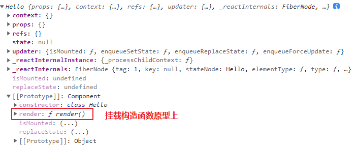

# 1.React介绍


logo是一个原子图标

React 19 2022 年 3 月 29 日出来的

## 1.1. React基本介绍

背景

[React](https://react.docschina.org/) 起源于 Facebook(Meta) 的内部项目（2011，News Feed），之后又被用来开发网站（2012，Instagram），并于 2013 年 5 月开源

是什么

[React](https://react.docschina.org/) 是一个用于构建**用户界面**的 JavaScript **库**。

* 用户界面：HTML 界面。
* Library（库）和 Framework（框架）：库的特点是**小而巧**，针对特定问题的单一解决方案。框架的特点是**大而全**，提供了一整套的解决方案。

从 [NPM 下载量](https://www.npmtrends.com/angular-vs-react-vs-vue) 来看，React > Vue > Angular

## 1.2. React特点

* **声明式**
  只需要描述 UI（HTML）看起来是什么样子，就像写 HTML 一样简单，React 内部负责渲染 UI，并在数据变化时自动更新 UI
* **组件化**
  只需要描述 UI（HTML）看起来是什么样子，就像写 HTML 一样简单，React 内部负责渲染 UI，并在数据变化时自动更新 UI
* **一次学习，随处使用**
  使用 React 除了可以开发 Web 应用，还可以使用 React Native 开发原生移动应用，甚至可以开发 VR（虚拟现实）应用（React 360）

> 相比较于 Vue，React 强调尽可能的利用 JS 语言自身的能力来编写 UI，而不是通过造轮子增强 HTML 的功能

react没有什么v-if之类的语法

vue3也逐渐成熟，也可以处理大型项目，国内也有的大厂慢慢过渡到vue3

import React from 'react' 打印这个React对象（不是一个构造函数，就是一个对象，但是全局方法可以挂在React.Component上面，它是一个构造函数）


# 2. 使用React脚手架创建项目

现代的 Web 应用要考虑的问题很多，除了编写业务代码之外，还要考虑代码规范、预编译、压缩合并、打包上线等工作，需要有一套完整的解决方案来辅助我们快速开发，

 [React 脚手架](https://create-react-app.dev/) 就是这么一套完整的解决方案，它零配置，开箱即用，让我们从繁杂的 Webpack 配置当中解脱出来，更关注于业务本身

使用 [create-react-app](https://create-react-app.dev/) 这个命令行工具，它是 React 官方团队出的一个构建 React 应用的脚手架工具（ 简称cra）。

**方法一**

1. 全局安装`npm i -g create-react-app`或者`yarn global add create-react-app`。
2. 初始化项目`create-react-app my-app`，my-app 表示项目名称，可以修改。
3. 启动项目：`yarn start`or `npm start`。

缺点：全局安装命令无法保证命令一直是最新版本。

**方法二（推荐）**

1. 命令：`npx create-react-app react-basic`。
2. 启动项目：`yarn start` or `npm start`。
3. npx 是 `npm@v5.2` 版本新添加的命令，用来简化 npm 工具包的使用流程。

优点：`npx` 会调用最新的 `create-react-app` 直接创建 React 项目

> React 18 中不再支持 ReactDOM.render，请改用 ReactDOM.createRoot().render()，[参考链接](https://mp.weixin.qq.com/s/fg6cuJYk1kW6mg0up9n_mA)

# 3. 创建第一个React应用

具体步骤

1. 删除 `src` 和 `public` 目录中的所有内容。
2. 新建 `public/index.html`。
3. 新建 `src/index.js` 文件。
4. 引入 React 核心库和涉及 DOM 操作的包。
5. 调用 `React.createElement()` 方法创建 React 元素。
6. 调用 `ReactDOM.render()` 方法渲染 React 元素到页面

```js
/* // React 18 之前的统一写法
// 1. 导入 React 核心包
import React from "react"
// 2. 负责渲染的包（虚拟 dom 转换成真实 dom 并渲染）
import ReactDOM from "react-dom"

// 3. 创建一个虚拟 dom（需要使用React.createElement方法，所以需要引入React）
const h1Ele = React.createElement("h1", { title: "reactxxx" }, "Hello World")

// 4. 把虚拟dom渲染到页面
// 渲染谁，渲染到哪
ReactDOM.render(h1Ele, document.querySelector("#root")) */


// React 18后的写法
// 1. 导入 React 核心包
import React from "react"
// 2. 负责渲染的包（虚拟 dom 转换成真实 dom 并渲染）不同点一
import ReactDOM from "react-dom/client"

// 3. 创建一个虚拟 dom（如果这里是使用的jsx，在React@16.14以前需要引入React才支持，React@16.14以后不需要引入了。内部自动帮忙引入）
const h1Ele = React.createElement("h1", { title: "reactxxx" }, "Hello World")

// 4. 把虚拟dom渲染到页面 不同点二
// render里面可以直接写jsx
// 渲染谁，渲染到哪
ReactDOM.createRoot(document.querySelector("#root")).render(h1Ele)

```

`ReactDOM.render()`方法在react18中已经不支持，需要使用`ReactDOM.createRoot().render()`


# 4. JSX介绍


## 4.1. React.createElement()

`React.createElement()`这个方法是用来创建虚拟dom节点的，类似于vue的`createelement()`、`createVNode()`、`h`，之后通过render函数的一个渲染

```js
// React 18后的写法
// 1. 导入 React 核心包
import React, { Component } from "react"
// 2. 负责渲染的包（虚拟 dom 转换成真实 dom 并渲染）不同点一
import ReactDOM from "react-dom/client"
// 3. 创建一个虚拟 dom
// const h1Ele = React.createElement("h1", { title: "reactxxx" }, "Hello World")
// import App from "./App" //

// 使用React.createElement()的问题
// 参数：标签名，属性列表（一个对象，没有的直接null），第三个及以后的所有参数都表示内容（也可以写成一个数组统一放在第三个参数）
// 问题，这样写，显得太冗余了
/* const wrapEle = React.createElement(
  "div",
  null,
  React.createElement(
    "ul",
    null,
    React.createElement("li", null, "React"),
    React.createElement("li", null, "Vue"),
    React.createElement("li", null, "Angular")
  )
) */

// createElement第三个参数，可以是一个数组，每个子元素需要指定key（和vue中一样，提升性能），不写成数组，第三个及第三个以后的都是子元素
const wrapEle1 = React.createElement(
  "div",
  null,
  React.createElement("ul", null, [
    React.createElement("li", null, "React"),
    React.createElement("li", null, "Vue"),
    React.createElement("li", null, "Angular"),
  ])
)

// 4. 把虚拟dom渲染到页面 不同点二

ReactDOM.createRoot(document.querySelector("#root")).render(wrapEle1)
```

每次写都需要通过写嵌套非常深的代码，效率很低，`React.createElement()` 创建 React 元素的问题：繁琐/不简洁；不直观，无法一眼看出所描述的结构；代码不容易维护！

react提供了jsx语法的支持，对比一下

```js
// React.createElement()
React.createElement(
    'div',
    { className: 'wrap' },
    React.createElement('ul', null, React.createElement('li', null, 'React'), React.createElement('li', null, 'Vue'), React.createElement('li', null, 'Angular'))
)

// JSX
<div class="wrap">
    <ul>
        <li>React</li>
        <li>Vue</li>
        <li>Angular</li>
    </ul>
</div>
```

> `React.createElement()`和jsx中的子元素是数组的时候，都需要指定key属性，来提升性能（dom diff更快地查找新元素），同vue一样

## ==4.2. JSX语法==

JSX语法在vue和react中都支持，vue中的地位是支持javascript完全编程，用处不是很多，可以代替template模板渲染

但是JSX在react中使用非常频繁，是react的核心之一

### 4.2.1. JSX是什么

JSX 是 JavaScript XML 的简写，表示可以在 JavaScript 代码中写 XML（HTML） 格式的代码。

xml是一个数据格式，和html有点像，之前坤给我们看过，jsx并不是html，只是像写 html一样，可以写一些js的语法，js文件里面书写jsx语法

> return后面的类似于html代码的就是一个jsx，比如下面egJsx等号右边的就是一个jsx
>
> const egJsx = <p>xxx</p>

优势：声明式语法更加直观，与 HTML 结构相同，降低了学习成本，提高了开发效率，JSX 是 React 的核心之一

本质：jsx就是虚拟dom（VNode 就是一个js对象），直接使用render函数渲染


```jsx
//1. 使用 JSX 创建 React 元素
const title = <h1>Hello JSX</h1>
      
// 2.使用 ReactDOM.render() 方法渲染 React 元素到页面中
ReactDOM.render(title, document.querySelector('#root'))
```

补充：声明式（只需要声明，具体怎么做由框架内部来做，vue也是声明式）<--->命令式（函数式，某个数据变了，还要使用dom语法进行变更）vue也是声明式

### 4.2.2. JSX是如何工作的

JSX 并不是标准的 ECMAScript 语法，为什么 React 脚手架中可以直接使用 JSX 呢

原因：JSX 需要使用 Babel 编译成 `React.createElement()` 的形式，然后配合 React 才能在浏览器中使用，而 `create-react-app` 脚手架中已经内置了 Babel 及相关配置

编译 JSX 语法的包为：[@babel/preset-react](https://www.npmjs.com/package/@babel/preset-react)，[在线体验](https://www.babeljs.cn/repl#?browsers=defaults%2C not ie 11%2C not ie_mob 11&build=&builtIns=false&corejs=3.6&spec=false&loose=false&code_lz=DwCwjAfAEgpgNnA9gAgFIGUAawD04JA&debug=false&forceAllTransforms=false&shippedProposals=false&circleciRepo=&evaluate=false&fileSize=false&timeTravel=false&sourceType=module&lineWrap=true&presets=env%2Creact%2Cstage-2&prettier=false&targets=&version=7.16.2&externalPlugins=&assumptions={})

### ==4.2.3. JSX注意事项==

* 必须有 1 个根节点，或者虚拟根节点 `<></>`、`<React.Fragment></React.Fragment>`。
* 属性名一般是小驼峰的写法且不能是 JS 中的关键字，例如 class 改成 className，label 的 for 属性改为 `htmlFor`，colspan 改为 `colSpan`。（不用记，写错了会有错误提示）
  
* 元素若没有子节点，可以使用单标签，但一定要闭合，例如 `<span/>`。
* `React@16.14` 之前需要先引入 React 才能使用 JSX（这个也好理解，因为 JSX 最后还是要被转成 `React.createElement()` 的形式），之后就不需要引入了，由内部帮我们引入。
* 换行建议使用 `()` 进行包裹，防止换行的时候[自动插入分号](https://stackoverflow.com/questions/2846283/what-are-the-rules-for-javascripts-automatic-semicolon-insertion-asi)的 Bug
  

### ==4.2.4. JSX中使用表达式==

**单大括号**中可以使用任意的表达式（**可以产生结果的式子**）

```js
const username = "ifer"
const obj = { address: "河南", age: 30 }
const arr = ["apple", "orange"]
const fn = () => "Hello React"
// React.createElement("h1", null, "JSX");
const h1Jsx = <h1>JSX</h1>
// 数组里面装了一堆 JSX
const arrJsx = [<li>Vue</li>, <li>React</li>, <li>Angular</li>]
const wrapEle = (
  <div>
    {/* 1.普通变量 */}
    <p>username: {username}</p>
    {/* 2.对象中的属性 */}
    <p>address: {obj.address}</p>
    {/* 对象虽然也是表达式，但是不是在 {} 号中使用 */}
    {/* //!Objects are not valid as a React child : 意味着你肯定在大括号中使用对象了 */}
    {/* <p>对象:{obj}</p> */}
    {/* 3.数组中的某一项 */}
    <p>apple: {arr[0]}</p>
    {/* 4.甚至整个数组，渲染时候去掉数组 */}
    <p>apple: {arr}</p>
    <p>arr: {arr.join("~")}</p>
    {/* 5.函数本身也是表达式，但是也不能直接在 {} 中用，但是函数调用可以 */}
    {/* <p>{fn}</p> */}
    <p>{fn()}</p>
    {/* 6.JSX 本身也是表达式 */}
    {h1Jsx}
    {/* 可以直接是一个包含jsx的数组，或者jsx数组的某一项 */}
    {arrJsx}
    {arrJsx[0]}
  </div>
)
```

注意点：

* JS 对象虽然也是表达式，但是不能直接嵌套在 `{}` 中，一般只会出现在 style 属性中
* 函数也是表达式，但是不能直接嵌套在 `{}` 中，函数调用可以（return了有返回值，没有return返回undefined）
* JSX本身也是表达式
* JSX 中不能放语句，例如 `if`、`switch`、`for`、`while` 等

### 4.2.5. JSX使用数组的情况

```jsx
// React 18后的写法
// 1. 导入 React 核心包
import React from "react"
// 2. 负责渲染的包（虚拟 dom 转换成真实 dom 并渲染）不同点一
import ReactDOM from "react-dom/client"
// 3. 创建一个虚拟 dom

// jsx 可以帮助我们像写html的形式去写渲染ui，内部还是转换成了React.createElement()
const arr = [
  { id: 1, name: "Vue" },
  { id: 2, name: "React" },
  { id: 3, name: "Angular" },
  { id: 4, name: "Angular1111" },
]

// 1.第一种写法
/* const wrapEle = (
    <ul>
      <li>{arr[0].name}</li>
      <li>{arr[1].name}</li>
      <li>{arr[2].name}</li>
    </ul>
  )  */

// 2.第二种写法
// 和上面等价
/* const arrJsx = [
  <li key={arr[0].id}>{arr[0].name}</li>,
  <li key={arr[1].id}>{arr[1].name}</li>,
  <li key={arr[2].id}>{arr[2].name}</li>,
]
const wrapEle = <ul>arrJsx</ul>
*/

// 3.第三种写法，开发最常见
// 数组的渲染
// 最外面的 () 是防止换行多的分号产生的bug
const wrapEle = (
  <ul>
    {/* 这里第一个 {} 表示我要写表达式了，arr.map() 就是一个表达式 */}
    {arr.map(item => (
      <span key={item.id}>{item.name}</span>
    ))}
  </ul>
)

// 4. 把虚拟dom渲染到页面

ReactDOM.createRoot(document.querySelector("#root")).render(wrapEle)

```

对象里面放数组，数组也是一个表达式

```jsx
const arr = ["张三", "李四"]
ReactDOM.createRoot(document.querySelector("#root")).render(<div className="box1 box2">App,{arr}</div>)
// 会渲染成App,张三李四
```

不管是`React.createElment()`的数组渲染还是jsx的数组渲染都需要使用key


关于key主要是用来性能优化的（dom diff时更快地找到新元素，vue中的key也是）

1. 特点：key 值要保证唯一，尽量避免使用索引号，key 在最终的 HTML 结构中是看不见的。
2. 加在哪里：`map()` 遍历谁，就把 key 加在谁上。
3. 作用：React 内部用来进行**性能优化**时使用的，key 在最终的 HTML 结构中是看不见的

# 5. 渲染页面

## 5.1. 条件渲染

```js
import ReactDOM from 'react-dom'

const isLoading = true

// 1. 使用if-else条件判断
const loadData = () => {
    if (isLoading) {
        return <h2>数据加载中，请稍后...</h2>
    }
    return <h2>数据加载完成，此处显示了加载后的数据</h2>
}

// 2.使用三元表达式
const loadData = () => {
    return <h2>{isLoading ? '数据加载中，请稍后...' : '数据加载完成，此处显示了加载后的数据'}</h2>
}

ReactDOM.createRoot(document.querySelector('#root')).render(loadData())
```

## 5.2. 列表渲染

**在 JSX 中使用数组的 map 方法来生成列表结构**（必须掌握，非常常用）

```jsx
import ReactDOM from "react-dom"

const list = [
  { id: 1, name: "Vue" },
  { id: 2, name: "React" },
  { id: 3, name: "Angular" },
]

const arrJsx = list.map(item => <li>{item.name}</li>)

const loadData = () => {
  return <ul>{arrJsx}</ul>
}

ReactDOM.createRoot(document.querySelector("#root")).render(loadData())

```

# 6. 样式处理

## 6.1. style行内属性

`{}`里面写上`{}`只在这里支持

css属性使用小驼峰（和vue一样），右边的属性值需要使用引号

```jsx
<元素 style={ {css属性1：值1,css属性2：值2} }></元素>
```

```jsx
import "./test.css"
const wrapEle = (
  <div>
    <div
      style={{
        width: 100, //单位是 px 可以省略
        // height: 100px,// 不能省略引号
        height: "100px",
        lineHeight: "100px", //lineHeight要加上px，不加表示倍数。数字（font-size的倍数）
        backgroundColor: "pink", // 小驼峰命名
        color: "red",
        textAlign: "center",
      }}
    >
      测试文字
    </div>
  </div>
)
```

## 6.2. class样式类

class需要换成className，并且css样式需要import导入（需要另外写一个css文件）

jsx不允许重复的属性，所以不能直接使用多个className，一个className后面只能跟一个class

```js
// 1.普通class
<div className = "box1">App</div>

// 2.多个静态class
<div className="box1 box2">App</div>

// 3.变量（也是表达式）
const varbox = box1
<div className = { varBox }>App</div>

// 4.表达式
<div className = { true ? "box1" : ""}>App</div>
```

想要实现多个动态class

* 使用模板字符串，或者+

  ```jsx
  <span className={`like ${item.attitude === 1 ? "liked" : ""}`}></span>
  <span className={"like"+" "+item.attitude === 1 ? "liked" : ""}></span>
  
  // 目标得到类似下面这种
  <div className="box1 box2">App</div>
  ```

* 使用数组，join()方法拼接

  ```jsx
  <span className={['like', item.attitude === 1 ? 'liked' : ''].join(' ')}></span>
  
  // 目标得到类似下面这种
  <div className="box1 box2">App</div>
  ```

* 使用classnames库（强烈推荐）

react中的类名需要使用className，但是只能写上字符串或者用上{}写表达式，无法像vue一样那么灵活，使用react官方推荐的classnames库

```bash
npm install classnames --save // 项目依赖
```

classnames是一个方法，就是一个表达式，需要写在{}里面

可以用和vue一样的写法，表达式，对象，数组（**注意对象的写法类名不加引号，单独的静态class需要加引号**）

```js
import classNames from "classnames"

// 包不包数组都无所谓，变量需要判断是否ture，字符串静态class就直接写，但是xx：true的形式要包在对象里
// 1.对象
<div className = {className({box1:true, box2:false})}></div>

// 2.数组（包不包外面的 [] 都一样）
<div className = {className({box1: true}, "box2")}></div>
<div className = {className(true ? "box1" : "", "box2")}></div>
```

## 6.3. css-loader

使用webpack的css-loader可以在打包项目的时候指定该样式的scope（类似于vue中style标签的scope）不然虽然导入样式到组件里面，还是全局样式

```jsx
// webpack config
module.exports = {
    module: {
      loaders: [
        { 
          test: /\.css$/, 
          loader: 'css-loader?modules&importLoaders=1&localIdentName=[name]__[local]___[hash:base64:5]' 
        },
     ]
   },
   ...
}

// App.css
.app {
      background-color: red;
  }
.form-item{
    color: red;
  }

// 组件（函数组件或者类组件）
import styles from './App.css';
  const App = props => {
    return (
      <div className={style.app}>123</div>
      <div className={style['form-item']}>456</div>
    )
}
```

这样`.app`就会被编译为`.App__app___hash`这样的格式了。这种方式是借助webpack实现将组件内的css只作用于组件内样式，相比于直接写inline styling也是一个不错的解决方案

webpack支持“`-`”和驼峰互相转换

## 6.4. css-in-js

css-in-js是在js中直接编写css的技术（同时支持直接在css中使用组件中的js变量），也是react官方推荐的编写css的方案

几个css-in-js方案（几个package）：`styled-components`、`emotions`、`radium`、`aphrodite`、`jss`

从体积来看：**emotion**的体积是最小的。

从技术生态环境（以及流行程度）：**styled-components**的star最多，文档相对来讲也是最完善的。

从功能来说，**emotion**也是功能最全面的

从支持的特性来看：**emotion、aphrodite、jss**支持的特性是最多的。

而且emotion是为数不多的支持source-map的css-in-js框架之一

# 7. React组件

> react就是一个雏形。就是一个库，不像vue有很成熟的一套完整解决方案，有很多自己的轮子，技术好的可以装的比vue好用。比如引用classnames库来扩展写能class的形式

组件（通常是jsx文件）：组件就是页面中的一部分，是 React 的一等公民，使用 React 就是在用组件，而所谓的组件化开发就是采用分而治之的思想来管理繁杂的页面逻辑。特点：独立、可复用、可组合

模块（通常是js文件）：JS 模块一般是向外提供特定功能的代码片段，通常来说是一个 JS 文件

* 功能使用：UI 组件（AntD 第三方组件）和业务组件（留言板 自己封装的）；普通组件（在一个组件中直接使用的组件）和路由组件（通过路由跳转访问到的组件）。
* 创建方式：函数组件和类组件

> 前十年主流是类组件，现在主流慢慢是函数式组件

## 7.1. 函数组件

通过函数创建出来的组件，又称**简单组件**或**无状态组件**（React16.8 以后函数式组件也可以拥有自己的状态），**本质上来说就是一个 JS 函数**

使用步骤

1. 先定义。

   a，函数名称**必须以大写字母开头**。

   b，**必须有返回值**，返回值表示该组件的结构，如果不想渲染任何内容，可以 `return null`。

2. 再使用。

   a，`<函数名/>`，单标签闭合。

   b，`<函数名></函数名>`，双标签

**注意点：**函数式组件中的 this 指向是 undefined，因为 Babel 编译后的代码开启了严格模式，[Babel 试一试](https://www.babeljs.cn/repl#?browsers=defaults%2C not ie 11%2C not ie_mob 11&build=&builtIns=false&corejs=3.6&spec=false&loose=false&code_lz=GYVwdgxgLglg9mABAWQJ4GEC2AHAFASkQG8AoASACcBTKECpAHgAsBGAPkF_FQB1NB4fUBG_QG9yDAPSs2JAL5A&debug=false&forceAllTransforms=false&shippedProposals=false&circleciRepo=&evaluate=false&fileSize=false&timeTravel=false&sourceType=module&lineWrap=true&presets=env%2Ces2015%2Creact%2Cstage-0&prettier=false&targets=&version=7.15.8&externalPlugins=)。

原因：类方法中默认开启了严格模式，调用是window调用的

```jsx
import ReactDOM from "react-dom/client"

// 函数组件，首字母必须大写
function Hello() {
  // console.log(this) 这里面的 this 执行undefined
  // 原因：经过 babel 编译后，会开启严格模式，内部是Hello()，严格模式指向undefined
  // 必须要有返回值，如果不想返回任何 jsx 返回 null 就行
  return <h1> hello world </h1>
}

// 标签使用单标签闭合或双标签
// ReactDOM.createRoot(document.querySelector("#root")).render(<Hello></Hello>)
ReactDOM.createRoot(document.querySelector("#root")).render(<Hello />)

// 不要这样写，当普通函数去使用, <Hello /> 是当做组件去使用（可以有组件的一些特性 独立、复用、组合）
// ReactDOM.createRoot(document.querySelector("#root")).render(Hello())
```

**渲染过程：**

1. render函数渲染，发现首字母是大写的，内部当做组件来进行解析，又发现是一个函数组件，内部调用这个函数，Hello()

2. 调用完得到一段jsx 由 Babel 转成 React.createElement() 这种形式，调用完毕得到一个虚拟dom

3. render 函数把虚拟 dom 转成真实 dom 并渲染

> 解析标签是如果是小写字母开头，当成普通jsx来渲染

## 7.2. 类组件

a，使用 ES6 语法的 class 创建的组件，又称复杂组件或有状态组件。

b，类名称也必须要大写字母开头。

c，类组件应该继承 `React.Component` 父类，从而可以使用父类中提供的方法或者属性。

d，类组件必须提供 `render()` 方法，此方法中的 this 指向此组件的实例对象，此方法中必须要有 return 返回值

类组件实例，因为 render 方法挂在原型上，由实例去调用

```jsx
import React, { Component } from "react"
import ReactDOM from "react-dom/client" //

// class Hello extends React.Component {
class Hello extends Component {
  // 必须要有render方法，实例调用返回jsx
  render() {
    return <h1> hello world !!! </h1>
  }
}

ReactDOM.createRoot(document.querySelector("#root")).render(<Hello />)
```

**类组件的渲染过程**

* render 解析 <Hello /> 发现是大写字母开头的，当做组件来解析，又发现是 class 声明的，当做类组件来解析
  内部会 const hello = new Hello() 得到一个组件实例，接下来内部调用 实例.render()
* 得到一个 jsx ，由 Babel 转成 React.createElement() 
* render 函数把虚拟 dom 转成真实 dom 并渲染



类组件里面的方法名只能是render由内部调用使用，不能用别的名字（用了别的名字后发现报错）


## 7.3. 提取组件为jsx文件

js文件和jsx文件其实没区别，jsx文件通常用来做 React 组件

1. 创建 App.js，创建组件（函数 或 类）。
2. 在 App.js 中通过 export default 默认导出该组件。
3. 在 index.js 中通过 import 默认导入 App 组件。
4. 渲染组件。

App.jsx

```jsx
import React, { Component } from 'react'

export default class App extends Component {
    render() {
        return <div>Hello World</div>
    }
}
```

index.js

```js
import ReactDOM from 'react-dom'
import App from './App'

ReactDOM.createRoot(document.querySelector('#root')).render(<App />)
```

创建组件jsx文件后，并且装了react相关插件，推荐使用快捷键生成组件模板

* rcc => react class component

* rfc =>react function component

# 8. 组件的状态

## 8.1. 组件状态介绍

**概念**：状态就是用来描述事物在某一时刻的的数据，例如：9 月 23 号时书的库存数量；18 岁时人的身高等

**特点**：状态能被改变，改变了之后视图会有对应的变化

作用：

* 保存数据
* 数据变化响应到视图（调用 setState 方法后 React 包内部的操作）

**有状态/无状态组件**

* 有状态组件：能定义 state 的组件，类组件就是**有状态组件**。
* 无状态组件：不能定义 state 的组件，函数组件一般叫做**无状态组件**。

2019 年 02 月 06 日，React v16.8 中引入了 React Hooks，从而函数式组件也能定义自己的状态了。

可以把state的属性解构出来，防止写太长的this.state.xxx

然后setState的时候，可以先复制一份

```js
// 建议同名
const fruits = [...this.state.fruits]

// 这样可以更简单的写
this.setState({ fruits })
```

> 前十年类组件是主流，但是 hooks 出来之后，函数组件逐渐成为了主流

无状态组件的应用场景

一般只有简单数据，就是数据不能改变的

* 组件本身就不需要有状态，例如渲染一段静态的内容。
* 组件本身就没有状态，有可能只需要从外部传入的状态就够了。

## 8.2. 类组件的状态

定义类组件中的状态（这里的状态只能定义在实例的state对象里面，**名字也只能叫state**，同时**state 对应的值必须是一个对象**）

第一种方式：在 constructor 中通过 `this.state = {}`

```jsx
class App extends React.Component {
    constructor() {
        super()
        this.state = {
            list: [
                { id: 1, name: '明天会更好' },
                { id: 2, name: '今天' },
            ],
        }
    }
}
```

第二种方式：通过 state 来定义状态

第二种方式不能使用constructor的实参，但是这个class类是由 react 内部来 new 的，所以传什么参数并不确定，所以这里传参并不影响，常常使用第二种写法来日常开发

```jsx
class App extends React.Component {
    state = {
        list: [
            { id: 1, name: '明天会更好' },
            { id: 2, name: '今天' },
        ],
    }
    // ...
}
```

class类的特点

* extends 继承的父类原型方法并不显式地显示在代码上，但是子类可以直接使用  相当于`子类.prototype = Object.create(父类.prototype)`
* 使用了constructor 函数，必须要调用 super() 方法，不管有没有继承父类的实例属性
* 定义的方法大部分情况下需要挂载到原型上，少部分情况可以直接挂载到实例上（浪费内存）比如时间处理函数为通过 this 拿到实例，直接挂在实例上

```js
// 把类组件抽离出一个js文件
import React, { Component } from "react"

new App('test')// 这里的 new 是由 react 内部完成，不知道传没传参
export default class App extends Component {
  constructor(param) {
    super()
    // 这里写的虽然能传参，但是这个 App 类是由 react 内部来 new 的 传什么参数并不知道
    // 还是推荐用下面的写法（constructor里面可以自定义实例的属性）
    this.state = {
      // ...
      age:param
    }
  }
  // 在这里写的是实例属性，不能传参，constructor 中的可以传参
  // 推荐写法!!!  
  state = {
    // ...
  }
  render() {
    return <div>App</div>
  }
}

```

# 9. 事件绑定

基础语法

```jsx
<元素 事件名1={事件处理函数1} 事件名2={事件处理函数2}></元素>
```

React 事件名采用驼峰命名法，比如 onClick、onMouseEnter 等

注意这里的 onClick 和 onChange 不是原生事件，是 react 经过处理的合成事件，可以当做属性来看，事件触发的时候由 react 内部调用

## 9.1. 函数组件中的事件绑定

下面两种方式没什么区别，因为 this 指向都是undefined（babel  编译后开启了严格模式，本来指向 window）

```jsx
// 1.事件处理函数写在 jsx 里面
const App = () => {
    return <button onClick={ () => {console.log('Hello World')} }>click</button>
}

// 2.事件处理函数写在 jsx 外面
const App = () => {
    const handleClick = () => {
        console.log('Hello World')
    }
    return <button onClick={handleClick}>click</button>
}
```

## 9.2. 类组件中的事件绑定

**类中定义的方法默认开启了严格模式**，一般代码经过babel打包编译后，会开启严格模式

开启严格模式，js对代码的编译更加严格了，全局开启（script的顶部开启），局部（函数内部）开启

* this指向平常是window的变成undefined  node环境中
* 函数内没用const let var定义的会上升为全局变量，开启后直接报错
* 多个相同的形参，不报错，开启后直接报错

### 9.2.1. 事件处理函数直接写在 jsx 中，

* 箭头函数，this 直接指向当前实例（箭头函数没有 this 指向跟谁调用无关，为外部环境中的 this）
* function 普通函数，为 window.onClick()，严格模式 this 指向 undefined

```jsx
class App extends React.Component {
    render() {
        return (
            <button
                onClick={ () => {console.log('Hello World')} }>
                click
            </button>
        )
    }
}
```

### 9.2.2. 事件处理函数抽离出来

```jsx
class App extends React.Component {
    handleClick() {
        console.log('Hello World')
    }
    render() {
        return <button onClick={this.handleClick}>click</button>
    }
}
```

**这里提取了之后（可以提取到原型或者实例上）就要考虑到事件处理函数中的this指向问题了**

如果是按照习惯，方法挂载到原型上（因为多个组件可以复用，不能浪费内存），onClick = handleClick(){} 然后调用是 onClick() 严格模式，事件处理函数中的this直接指向了undefined

```jsx
export default class App extends Component {
  state = {
    count: 0,
  }

  // 一、实例方法，相当于this.handleClick = xxx
  /* handleClick = () => {
    console.log("hello world")
  } */

  // 二、原型方法，组件复用时，都可以使用的
  handleClick(e) {
    // 这里面的e是事件对象
    console.log("hello react")
  }
  render() {
    return (
      <div>
        <button onClick={ this.handleClick }>
          点我+1
        </button>
      </div>
    )
  }
}
```

### 9.2.3. 事件处理函数的区别（原生js、Vue、React）

vue和原生js中事件处理函数可以直接写一句执行语句，点击的时候触发，react 需要外面套一个函数，不然会立即执行

涉及到事件和按键修饰符也发生了一些改变 [Vue3 官方文档事件修饰符和按键修饰符](https://staging-cn.vuejs.org/guide/essentials/event-handling.html#key-modifiers)

```js
// 原生js 不能传参
<button onclick="start()"></button>

// Vue 不传参
<button @click="start"></button>
// Vue 可以传参
<button @click="start(xx)"></button>
// Vue 可以直接写执行语句
<button @click="count++"></button>

// React 中 jsx 不传参
<button onClick={start}></button>
// React 中 jsx 可以传参 点击后执行需要在外面套一个箭头函数
<button onClick={() => {start(xx)}}></button>
// React 中 jsx 中直接写执行函数一上来就会执行，需要在外面包一个函数
// React 中 onClick 中不能直接写执行语句，需要外面套一个箭头函数
<button className="clear-completed" onClick={dispatch(clearCompleted())}>
```

> jsx只能使用合成事件，想要绑定原生事件，使用dom语法，先获取dom。在使用.onclick或者addEventClick绑定原生事件

# ==10. 点击计数案例（this 指向和 setState 方法）==

## ==10.1. 解决 this 指向问题==

### 10.1.1. 方法一：高阶函数/函数柯里化

直接调用，得到一个函数，点击了执行

```jsx
import React, { Component } from "react"

export default class App extends Component {
  // constructor是自己的构造函数，不继承实例属性可以不写

  // 实例属性
  state = {
    count: 0,
  }

  // 一、高阶或者柯里化。可以传参
  // 高阶函数（返回函数的函数，或者函数当做参数传递的函数，比如数组的遍历方法）
  // 函数柯里化：通过函数调用继续返回函数，实现多次接受参数最后统一处理的编码形式

  // 原型方法
  handleClick(a) {
    console.log(a) // "xx"
    console.log(this.state.count) //这里面的this指向实例（调用了）

    // 箭头函数没有this。取决于外部环境的this执行
    // 这里由点击时由 react 内部调用 onClick 合成事件，传递 e 事件对象实参
    return e => {
      console.log(e) // 事件对象
      console.log(a) // "xx"
      console.log(this.state.count)
    }
  }
  render() {
    return (
      <div>
        <button onClick={this.handleClick("xx")}>点我+1</button>
      </div>
    )
  }
}

```

### 10.1.2. 方法二：使用箭头函数包裹

点击了之后，先执行外面的箭头函数，再直接调用

```jsx
import React, { Component } from "react"

export default class App extends Component {
  // constructor是自己的构造函数，不继承实例属性可以不写

  // 实例属性
  state = {
    count: 0,
  }

  // 二、使用箭头函数包裹 可以传参
  // 原型方法
  handleClick(a, e) {
    console.log(a) // "xx"
    console.log(e) // 事件对象
    console.log(this.state.count) //这里面的this
  }
  render() {
    return (
      <div>
        <button
          // 外面用一个箭头函数包起来，点击的时候才执行里面的代码，里面的 this指向实例，this调用，所以事件处理函数中的this也指向实例
          onClick={() => {
            this.handleClick("xx")
          }}
        >
          点我+1
        </button>
      </div>
    )
  }
}

// 箭头函数中传一个事件对象，e就是传递的事件对象，点击时由 react 内部传递事件对象参数 onClick(e)
onClick={(e) => { this.handleClick("xx"，e) }}
```

### 10.1.3. 方法三：使用 bind 方法

调用 bind （原函数里面的代码并没有执行），得到一个新函数，点击了直接调用

```jsx
import React, { Component } from "react"

export default class App extends Component {
  // constructor是自己的构造函数，不继承实例属性可以不写

  // 实例属性
  state = {
    count: 0,
  }

  // 三、使用bind 可以传参
  // 原型方法
  handleClick(a, b, e) {
    // 这里bind函数调用返回一个新函数，a = 1，b = 2，这里e是事件对象，实际内部由bind产生的新函数传递过来的
    console.log(this.state.count, a, b, e) //这里面的this
  }
  render() {
    return (
      <div>
        <button
          onClick={
            // 下面两个this都指向实例
            // 第一个this是实例，为了拿到handleClick，后面的this是改变handleClick里面的this指向
            this.handleClick.bind(this, 1, 2)
          }
        >
          点我+1
        </button>
      </div>
    )
  }
}

```

bind函数，改变this指向，并生产一个新函数，bind和新函数都可以传递参数，bind先传，新函数在后面，叠加

```js
function fn(num, num2){
    console.log(this, num, num2)
}
const o = { age : 18 }
const newFn = fn.bind(o, 18)
newFn(19)

// 事件处理函数中的this指向，让他指向组件实例
```

事件处理函数里的事件对象，是通过bind返回的新函数里面传递过来的（所以bind的新函数也可以传参）

### 10.1.4. 方法四：实例挂载

不直接调用，挂载到实例上（必须使用箭头函数），点击了执行

```jsx
import React, { Component } from "react"

export default class App extends Component {
  // constructor是自己的构造函数，不继承实例属性可以不写

  // 实例属性
  state = {
    count: 0,
  }

  // 四、实例挂载（平常用的最多，不能传参时使用）

  // 1.多个实例复用，造成稍微的内存浪费
  // 2.无法事件传参，但是可以事件处理返回一个函数来传参，多余了，这样就可以直接用前面三种

  temp = this // 这是实例挂载的意思，这里的this就是指向的实例 a是实例 a.temp === a 为true
  //实例挂载方法

  // 注意箭头函数跟谁调用无关
  handleClick = () => {
    console.log(this.state.count) //这里面的this和外部环境的一样，外部的this是指向实例
  }
  render() {
    return (
      <div>
        <button onClick={this.handleClick}>点我+1</button>
      </div>
    )
  }
}

```

### 10.1.5. 方法五：实例引用原型方法

需要写 constructor 函数，也要调用 bind 调用得到一个新函数，把原型上的方法引用一份到实例

```jsx
import React, { Component } from "react"

export default class App extends Component {
  constructor() {
    super()
    this.state = {
      count: 0,
    }
    // 实例方法
    // 根据原型上的 handleClick 生成一个新方法给了实例属性 aaa 并把原型方法 handleClick 内部的 this 改成实例
    this.aaa = this.handleClick.bind(this)
  }

  // 五、实例引用原型的方法 无法传参
  // 也是无法传参，但是多个实例都是引用的同一个原型的方法

  // 原型方法
  handleClick() {
    console.log(this.state.count)
  }
  render() {
    return (
      <div>
        <button onClick={this.aaa}>点我+1</button>
      </div>
    )
  }
}

```


### 10.1.6. 小结

* 前三种，事件处理函数都是挂载到原型上，可以传参，传参相当于函数直接调用了，this直接指向了实例（返回函数，外面用箭头函数包裹，bind 返回一个新函数）
* 后两种，事件处理函数第四种直接挂载到实例上，第五种，是挂载原型上，但是实例中引用了一份（使用bind 改变一下 this） 这两种不能传参

常用：

```js
// 传参
// 第二种外面用一个箭头函数包裹，事件处理函数挂载到原型上
handleClick(a, e) {
    console.log(a) // "xx"
    console.log(e) // 事件对象
    console.log(this.state.count) //这里面的this
  }
  render() {
    return (
      <div>
        // 外面用一个箭头函数包起来，点击的时候才执行里面的代码，里面的 this指向实例，this调用，所以事件处理函数中的this也指向实例
        <button onClick={() => { this.handleClick("xx") }}>点我+1</button>
      </div>
    )
  }

  
// 不传参
// 第四种，事件处理函数直接挂载到实例上
temp = this // 这是实例挂载的意思，这里的this就是指向的实例 a是实例 a.temp === a 为true
  //实例挂载方法

  // 注意箭头函数跟谁调用无关
  handleClick = () => {
    console.log(this.state.count) //这里面的this和外部环境的一样，外部的this是指向实例
  }
  render() {
    return (
      <div>
        <button onClick={ this.handleClick }>点我+1</button>
      </div>
    )
  }
```

## ==10.2. setState 方法==

### 10.2.1. setState

React 通过 setState 方法来修改状态

```jsx
import React, { Component } from 'react'

export default class App extends Component {
  // 状态，可以通过修改来影响视图
    state = {}
  // 普通数据，可以用来做静态渲染，无法修改，即使修改了视图也不会变
    arr = []
  render() {
    return (
      <div>App</div>
    )
  }
}

```

* 语法：`this.setState({ 要修改的状态: 新数据 })`。
* 作用：修改 state 并更新视图。
* **注意点**：
  * 只能修改state顶层的属性,，接写就行了，不用点语法，万一要修改对象里面某个属性，需要覆盖外面整个对象
  * setState是合并，不会影响同级的其他属性，同一个属性会直接**覆盖**
  * setState 只能修改状态，即定义在state状态对象里面的属性，普通数据无法修改
  * 左边和右边的不用对应，用右边的去覆盖左边的，不要修改原状态据

setState方法是继承来的，在 `React.Component` 的原型上


setSatet 用法示例

```jsx
import React, { Component } from "react"

export default class App extends Component {
  state = {
    count: 0,
  }

  // react数据中的不可变性
  // 这里后面不能直接 this.state.count++ 这样违背了状态的不可变性，虽然视图是可以变的
  handleClick = () => {
    this.setState({ count: this.state.count + 1 })
  }
  render() {
    return (
      <div>
        <p>{this.state.count}</p>
        <button onClick={this.handleClick}>点我+1</button>
      </div>
    )
  }
}

```

另外一些常见用法

* 删除状态某个数据，比如数据，可以使用filter方法返回一个新数组，并且不改变原数组

* 状态渲染，直接先在render函数前面解构一下，免得一直this.state.xxx

  ```jsx
  render(){
      const { age } = this.state.person
      // ...
      return <span>{ age }</span>
  }
  ```

* 由于状态的不可变性，先copy一份同名的，然后setSate的时候就可以使用解构简便写法

  ```jsx
  changeCheckbox = e => {
      // 状态的不可变性，先copy一份
      const fruits = [...this.state.fruits]
      if (this.state.fruits.includes(e.target.value)) {
        // 有就删掉
        const idx = fruits.indexOf(e.target.value)
        fruits.splice(idx, 1)
      } else {
        // 没有就加上
        fruits.push(e.target.value)
      }
      this.setState({ fruits })
    }
  ```

### 10.2.2. 状态的不可变性

**React 的核心理念，状态的不可变性**

也就是说不要**直接修改**原数据，而是要**产生一份新数据**，然后通过 `setState()` 用新的数据覆盖原数据，这么做的其中一个重要原因就是为了 SCU（shouldComponentUpdate），为了性能优化


 ```jsx
 import React, { Component } from "react"
 import ReactDOM from "react-dom"
 
 export default class App extends Component {
   state = {
     count: 0,
     list: [1, 2, 3],
     person: {
       name: "jack",
       age: 18,
       address: "beijing",
     },
   }
   changeCount = () => {
     /* this.state.count++
     // 不要上面的写法，即便通过下面的操作也能做到更新视图，违背了 react 状态的不可变性
     this.setState({
       count: this.state.count,
     }) */
     this.setState({ count: this.state.count + 1 })
   }
   changeList = () => {
     /* this.state.list.push("Hello React")
     this.setState({
       list: this.state.list,
     }) */
     this.setState({
       list: [...this.state.list, "hell0 react"],
     })
   }
   changePerson = () => {
     /* this.state.person.name = "ifer"
     this.state.person.age = 19
     this.setState({
       person: this.state.person,
     }) */
     this.setState({
       person: {
         // 下面的name和age会覆盖展开运算符复制过来的同名属性
         ...this.state.person,
         name: "ifer",
         age: 19,
       },
     })
   }
   render() {
     return (
       <div>
         <h3>count</h3>
         <p>{this.state.count}</p>
         <button onClick={this.changeCount}>click</button>
         <hr />
         <h3>list</h3>
         <ul>
           {this.state.list.map((item, index) => (
             <li key={index}>{item}</li>
           ))}
         </ul>
         <button onClick={this.changeList}>click</button>
         <hr />
         <h3>person</h3>
         <p>
           {this.state.person.name} {this.state.person.age}
         </p>
         <button onClick={this.changePerson}>click</button>
       </div>
     )
   }
 }
 
 ReactDOM.render(<App />, document.querySelector("#root"))
 
 ```

> 有这样一种感受，写react就是在写js代码，jsx里面支持所有的js语法

### 10.3. setState的第二个参数

dom的更新是异步的，vue 中使用 nextTick 等待 dom 更新完毕后获取 dom，也可以在 mounted 钩子获取dom

React 中也有类似于 nextTick 的方法，那就是 setState 的第二个参数，是一个回调函数，视图更新完毕后调用

```js
            this.setState({
                msg:"world"
            },()=>{//视图更新完毕的回调函数
                console.log(this.title.innerHTML);
            })
```

# 11. 受控表单组件

**受控不受控一般是针对表单来说的，所谓受控表单组件，即表单元素的 value 值受到了 React 中状态（state）的控制（对状态的操作会影响视图，视图的变化又会反映到状态上）**

> 单选多选的 checked 或者其他表单的 value 绑定了状态，都是受控表单组件

也就是 vue 中的数据的双向绑定

1. 在 state 中添加一个状态，作为表单元素的 value 值（数据影响视图）。
2. 给表单元素绑定 onChange 事件，将表单元素的值设置为 state 的值（视图影响数据）

响应式（修改数据视图变化）和数据的双向绑定（监听onChange事件，拿到e.target.value）都需要使用到

```jsx
import React, { Component } from "react"

export default class App extends Component {
  // 1.定义状态
  state = {
    count: 2,
  }
  handleChange = e => {
     // 监听 onChange 事件 将视图的数据赋值给状态。实现数据双向绑定
    this.setState({ count: e.target.value })
  }
  render() {
    return (
      <div>
        <input
          type="text"
          // 2.响应式  数据变化，视图更新
          value={this.state.value}
           // 3.绑定 onChange 事件
          onChange={this.handleChange}
        />
      </div>
    )
  }
}

```

## 11.1. 常见表单受控组件

给表单的value或者checked绑定了状态，改都改不了，输也输不了，因为表单受控了（和vue 和 原生js也不一样）必须通过onChange事件修改了状态（通过 e.target.value）才能变化。如果value或者checked绑定的不是状态，隐式转换成布尔值，一直是那个状态，也无法切换

```jsx
import React, { Component } from "react"

export default class App extends Component {
  // 定义在state中的才叫状态，类似于vue中data返回的对象
  /* // 普通的叫作普通数据，不能通过setState管理
  a = 1 */

  // 受控表单组件
  state = {
    // 1.定义状态
    username: "12312",
    content: "",
    frame: "react",
    sex: "man",
    fruits: ["apple"],
  }
  // 没指定input的value，默认是on
  changText = e => {
    console.log(e)
    console.log(e.target.id)
    this.setState({
      username: e.target.value,
    })
  }
  changeTextarea = e => {
    this.setState({
      content: e.target.value,
    })
  }
  changeOption = e => {
    this.setState({
      frame: e.target.value,
    })
  }
  changeRadio = e => {
    this.setState({
      sex: e.target.value,
    })
  }
    
  // 多选框需要收集某一个表单标签的 value
  changeCheckbox = e => {
    // 状态的不可变性，先copy一份
    const fruits = [...this.state.fruits]
    if (this.state.fruits.includes(e.target.value)) {
      // 有就删掉
      const idx = fruits.indexOf(e.target.value)
      fruits.splice(idx, 1)
    } else {
      // 没有就加上
      fruits.push(e.target.value)
    }
    this.setState({ fruits })
  }

  render() {
    return (
      <div>
        <ul>
          <li>
            {/* input */}
            <input
              type="text"
              name="1"
              id="2"
              // 2.把状态和表单标签的 value 进行绑定
              value={this.state.username}
              // 3.监听 onChange 事件，把输入的内容传给 state 状态
              onChange={this.changText}
            />
          </li>
          <li>
            {/* textarea */}
            <textarea
              value={this.state.content}
              onChange={this.changeTextarea}
            ></textarea>
          </li>
          <li>
            {/* select */}
            <label htmlFor="frame">框架</label>
            <select
              name=""
              id="frame"
              value={this.state.frame}
              onChange={this.changeOption}
            >
              <option value="React">React</option>
              <option value="Vue">Vue</option>
              <option value="Angular">Angular</option>
            </select>
          </li>
          <li>
            {/* radio */}
            <label htmlFor="man">男</label>
            <input
              type="radio"
              name=""
              id="man"
              value="man"
              checked={this.state.sex === "man"}
              onChange={this.changeRadio}
            />
            <label htmlFor="woman">女</label>
            <input
              type="radio"
              name=""
              id="woman"
              value="woman"
              checked={this.state.sex === "woman"}
              onChange={this.changeRadio}
            />
            <label htmlFor="unknown">未知</label>
            <input
              type="radio"
              name=""
              id="unknown"
              value="unknown"
              checked={this.state.sex === "unknown"}
              onChange={this.changeRadio}
            />
          </li>
          <li>
            {/* checkbox */}
            <label htmlFor="apple">苹果</label>
            <input
              type="checkbox"
              name=""
              id="apple"
              value="apple"
              checked={this.state.fruits.includes("apple")}
              onChange={this.changeCheckbox}
            />
            <label htmlFor="banana">香蕉</label>
            <input
              type="checkbox"
              name=""
              id="banana"
              value="banana"
              checked={this.state.fruits.includes("banana")}
              onChange={this.changeCheckbox}
            />
          </li>
        </ul>
      </div>
    )
  }
}

```

单选框或者多选框不需要获取 value 值，仅仅是切换 checked 的 true 或 false

```js
changeDone = async (id, done) => {
    await request.patch("/" + id, { done })
    // 重新后去数据并渲染
    this.props.getList()
  }

// 可能有的多选不要求拿到value值，只维护一个对象数组中每一个item的一个字段，就不用这么麻烦，传一个id就行了
<input
         className="toggle"
         type="checkbox"
         checked={item.done}
         onChange={() => this.changeDone(item.id, !item.done)}
/>
// 这里只是 item.done 的值渲染给了checked，然后手动勾选的时候，需要在 change事件里面取反去父组件手动改变绑定的变量值
// vue中是使用 v-model双向绑定的
```

## 11.2. 优化上述写法

代码都是一步步优化成很简单的，尤其是源码里面，会优化简化很多的代码，很难看懂，但是不要过度优化了，代码的可读性要很高

```jsx
//input表单上绑定的name属性，现在已经被id所取代，但是name还是可以用来存值，并通过e.target.name拿到
//e.target.type可以拿到input表单元素的类型  
//e.target.id可以拿到id

<input type="text" id="" name=""/>
```

```jsx
  // 没指定input的value，默认是on
  handleChange = e => {
    this.setState({
      [e.target.name]: e.target.value,
    })
  }
  changeCheckbox = e => {
    // 状态的不可变性，先copy一份
    // 一、做法一
    /* const fruits = [...this.state.fruits]
    if (this.state.fruits.includes(e.target.value)) {
      // 有就删掉
      const idx = fruits.indexOf(e.target.value)
      fruits.splice(idx, 1)
    } else {
      // 没有就加上
      fruits.push(e.target.value)
    }
    this.setState({ fruits }) */
    // 二、做法二
    /* if (this.state.fruits.includes(e.target.value)) {
      // 有就删掉
      this.setState({
        fruits: this.state.fruits.filter(item => item !== e.target.value),
      })
    } else {
      // 没有就加上
      this.setState({
        fruits: [...this.state.fruits, e.target.value],
      })
    }*/
    // 三、做法三
    this.setState({
      [e.target.name]: this.state.fruits.includes(e.target.value)
        ? this.state.fruits.filter(item => item !== e.target.value)
        : [...this.state.fruits, e.target.value],
    })
  }
  // 然后上面两个还可以合成一个，就不做要求了，根据e.target.type是不是checkbox来判断，写起来代码的可阅读性就太差了
```

# 12. 非受控表单组件（获取 dom 对象）

非受控组件则是通过操作 DOM 的方式来获取数据，表单中的 value 并没有和 state 中的数据进行绑定

**可以用来收集数据**

非受控表单--数据不用变，直接写简单数据不用写在state对象中

```jsx
import React, { Component } from "react"

export default class App extends Component {
  // 1.设置简单数据（不被修改的数据不能放在state对象里面）
  input = React.createRef()

  // 3.挂载实例方法
  handleChange = () => {
    // 来收集表单数据，但是没有办法更改数据来影响视图
    console.log(this.input.current) //拿到dom对象
    console.log(this.input.current.value) // 表单标签的内容是value属性，其他的是innerHTML属性
  }
  render() {
    return (
      <div>
        {/* 2.绑定标签的ref属性 */}
        <input type="text" ref={this.input} onChange={this.handleChange} />
      </div>
    )
  }
}

```

# 13. 留言评论案例

`arr.map((_, index) => {xxx})`没用到的变量用`_`表示

大括号里面不能使用对象，使用了就是下面的报错


setState 

* 添加数据：展开运算符，然后加，可以写多个`this.setState({ list: [...this.state.list, newComment], content: "" })`
* 删除数据：使用filter方法 `this.setState({ list: this.state.list.filter((_, index) => index !== idx) })`

* 修改数据（修改某一项）：使用map方法

  ```jsx
  this.setState({
        list: this.state.list.map(item => {
          if (item.id === id) {
            return {
              ...item,
              attitude,
            }
          } else {
            return item
          }
        }),
      })
  ```

> 通过class类组件中，方法定义在原型或者实例上，对数据的操作，比如解构，或者复制新数据在render函数中完成，注意return中是返回的jsx，可以使用js的所有语法

> 使用 map 方法映射数组的时候，必须给每个元素加上 key 不然会报错

```jsx
handleDel(idx) {
    // 删除index的值 并setState
    // 不能直接对原数据操作
    // 1.拷贝一份数据，然后将删除后的新数组 setState
    // 2.直接使用 filter 进行删除
    this.setState({ list: this.state.list.filter((_, index) => index !== idx) })
  }
  // 发表评论，添加数据
  handleSubmit = () => {
    if (this.state.content.trim() === "") return
    const newComment = {
      id: Date.now(),
      author: "xxx",
      comment: this.state.content,
      time: new Date(),
      img: avatar,
      // 1: 点赞 0：无态度 -1:踩
      attitude: 0,
    }
    this.setState({ list: [...this.state.list, newComment], content: "" })
  }

  // 点赞和踩
  handleLike(id, attitude) {
    this.setState({
      list: this.state.list.map(item => {
        if (item.id === id) {
          return {
            ...item,
            attitude,
          }
        } else {
          return item
        }
      }),
    })
  }

<li
     className={classNames({ on: item.type === state.active })}
     key={item.id}
     onClick={() => {
        this.handleClick(item.type)
      }}
>
    
<span
      className={item.attitude === 1 ? "like liked" : "like"}
      onClick={() => {
           this.handleLike(item.id, item.attitude === 1 ? 0 : 1)
      }}
>
```
