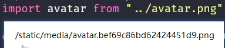
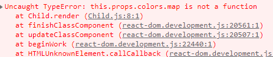
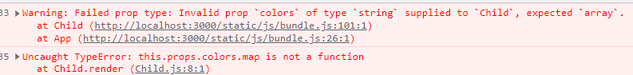

# 1. 组件通信

* 组件是独立且封闭的单元，默认情况下，只能使用组件自己的数据。
* 在组件化过程中，我们将一个完整的功能拆分成多个组件，以更好的管理整个应用的功能（组件拆的粒度越细，维护就越好维护，但是对组件通信的要求就越高）。
* 而在这个过程中，多个组件之间不可避免的要**传递或共享某些数据**。
* 为了实现这些功能，就需要打破组件的独立封闭性，让其与外界沟通，这个过程就是组件通讯。
* 组件通信常见的方式有：父传子、子传父、兄弟相传、跨组件通信等

> 响应式数据  vue是通过内部劫持（vue3是通过proxy）来实现  react 是 setState 方法来实现的
>
> jsx 外面一般用括号包起来  防止 return 后面因为换行自动添加的分号带来的 bug

# 2. 父传子

## 2.1. 函数组件

* 父组件通过组件标签的自定义属性传递数据
* 子组件通过函数的形参 props 接受（既然是形参就可以随便命名了）传过来的是一个对象，使用`props.xx`取值

```jsx
// 父
<Child count={this.state.count} />

// 子
export default function Child(props) {
  return <div>{props.count}</div>
}
```

## 2.1. 类组件

* 父组件通过组件标签的自定义属性传递数据
* 子组件通过使用`this.props.xx`取值（props 是挂在 React.Component 对象上的属性，是一个对象）

```jsx
// 父
<Child count={this.state.count} />

// 子
export default class Child extends Component {
  render() {
    return <div>{this.props.count}</div>
  }
}
```

> 父传子时，组件标签必须单闭合标签

import的图片路径应该是最后打包后的静态路径



类组件里面方法和对数据的操作的放置位置

```jsx
export default class Child extends Component {
    // 方法同一定义在原型上（为了组件复用），需要this指向就定义在实例上（每次new都需要新建一个地址）
  getRandomIntInclusive(min, max) {
    min = Math.ceil(min)
    max = Math.floor(max)
    return Math.floor(Math.random() * (max - min + 1)) + min //含最大值，含最小值
  }

  handleClick = () => {
    const price = this.getRandomIntInclusive(2, 5)
    this.props.changePrice(this.props.id, price)
  }

  render() {
     //数据的解构放在render函数中，千万不要把方法定义在render中
     // 对数据的操作都放在render函数体内，return上面
    const { name, price, info } = this.props
    return (
      <div className="child">
        <h3 className="title">{name}</h3>
        <p className="price">{price}</p>
        <p className="product">{info}</p>
        <button onClick={this.handleClick}></button>
      </div>
    )
  }
}
```

## 2.2. 父传子注意事项

* **Props 是只读的，不能修改**。

* 单向数据流，也叫做：自上而下的数据流。

  a，当父组件中的数据更新时，子组件接收到的数据也会自动更新。

  b，但不能反过来，例如子组件直接去修改父组件的数据。

  c，类比：就像瀑布的水一样只能从上往下流动，并且，当上游的水变浑浊，下游的水也会受到影响。

* 可以给组件传递任意类型的数据，例如数字、字符串、布尔、对象、函数、JSX 等

```jsx
// 父
export default class App extends Component {
  state = {
    count: 2,
  }
  render() {
    return (
      <div>
        <Child
          // 状态数据
          count={this.state.count}
          // 字符串（和 Vue 一样，传其他类型的需要当做表达式来看）
          name="张三"
          // 数字
          age={888}
          // 布尔
          isRight={true}
          // 对象，直接传或者用状态传
          obj={{ name: "zs", age: 18 }}
          // 函数（非常有用，可以模拟作用域插槽，或者子传父）
          fn={() => "hello world"}
          // jsx
          jsx={<h4>hello React</h4>}
        />
      </div>
    )
  }
}

// 子
export default class Child extends Component {
  render() {
    return (
      <ul>
        <li>{this.props.count}</li>
        <li>{this.props.name}</li>
        <li>{this.props.age}</li>
        <li>{this.props.isRight}</li>
        <li>{this.props.obj.age}</li>
        <li>{this.props.fn()}</li>
        <li>{this.props.jsx}</li>
      </ul>
    )
  }
}
```

## 2.3. 在 constructor 中使用 this.props

使用类组件时，如果写了构造函数，应该在 constructor 中接收 props，并将 props 传递给 super，否则无法在构造函数中使用 this.props

```jsx
export default class Child extends Component {
  constructor(props) {
    // 组件实例是由 react 内部来 new 的，所以这里的props是由内部传递的实参
    // 为父组件传递过来的所有属性
    super(props)
    // super 里面的 props 是传递给父类的构造函数的实参，Component 有一个实例属性 props
    // super 相当于 React.Component.call(this) 这里的this是指向子类的实例。实际上是						      sup.prototype.constructor.call(this,name)
    // 这里就相当于 this.props=props

    // 这样就可以使用this.props访问父组件传递的所有属性，是一个对象
    console.log(props === this.props) // true
  }

  // 也可以这样写，所有属性都挂载
  /* constructor(...args){
    super(...args)
    //xxx
  } */
    
   render(){ return xxx}
}
```

## 2.4. 父传子练习

```jsx
// 父
render() {
    return (
      <div className="parent">
        {/* 
        这样整个对象传过去也可以
        {this.state.list.map(item => (
          <Child key={item.id} item={item}></Child>
        ))} */}
            
        {/* 使用展开运算符这样可以把对象的所有属性都传递给子组件，免得一个属性一个属性的传递*/}
        {/* {this.state.list.map(item => (
          <Child
            key={item.id}
            id={item.id}
            name={item.name}
            price={item.price}
            info={item.info}
          />
        ))} */}
        {/* 和上面等价写法 */}
        {this.state.list.map(item => (
          <Child key={item.id} {...item} />
        ))}

        {/* Vue 中也有这样的写法 v-bind */}
        {/* <!-- 绑定一个全是 attribute 的对象 --> */}
        {/* <div v-bind="{ id: someProp, name: otherProp }"></div> */}
        {/* <div :id="someProp", :name="otherProp"></div> */}
      </div>
    )
  }

// 子
render() {
    const { name, price, info } = this.props
    return (
      <div className="child">
        <h3 className="title">{name}</h3>
        <p className="price">{price}</p>
        <p className="product">{info}</p>
      </div>
    )
  }
```

# 3. 子传父

子传父三部曲

1. 父组件准备一个方法传递给子组件
2. 子组件调用父组件传递过来的方法的同时并传参
3. 父组件接收参数并修改

> 子传父的本质还是父传子，只不过传递的是一个函数，因为要使用原来的外部环境的 this 所以必须要使用箭头函数

## 3.1. 类组件

```jsx
// 父
export default class App extends Component {
  state = {
    car: "奥拓",
  }
  // 1.父组件准备一个方法传递给子组件
/*  changeCar() {
    // 3.父组件接收参数并做修改
    // 这样写 this 指向谁 => 谁调用就指向谁  function写法
    // 这里的 this 指向this（子组件的实例）.props
    console.log(this)
  } */
 changeCar = (car) => {
     // 传递的函数因为要使用原来的外部环境的 this 所以必须要使用箭头函数。并挂载到实例上
     this.setState({ car })
     console.log(this)
 }

  render() {
    return (
      <div>
        父组件：{this.state.car}
        <hr />
        <Child changeCar={this.changeCar} />
      </div>
    )
  }
}

// 子
export default class Child extends Component {
  // 2 子组件调用父组件传递过来方法的同时并传参
  handleClick = () => {
     // 这里要用到当前组件的 this 所以也要使用箭头函数，并挂载到实例上
    this.props.changeCar("奔驰")
  }
  render() {
    return (
      <div>
        <button onClick={this.handleClick}>点我，奥拓变奔驰</button>
      </div>
    )
  }
}
```

> 子传父时，有两种传递方式，在子组件间加工好数据再传过去，把要加工的数据传到父组件进行加工，比如，数组是传递某一个 item 去父组件，还是处理好的 list 去父组件

## 3.2. 子传父练习


```jsx
// 父
// 1.父组件准备一个方法
  changePrice = (id, price) => {
    // 3.父组件接收参数，并做修改，使用map方法
    this.setState({
      list: this.state.list.map(item => {
        if (id === item.id) {
          // 处理减到0的情况
          let p = item.price - price
          if (p <= 0) {
            p = 0
          }
          return {
            ...item,
            // 这里想要使用 toFixed() 方法来保留两位小数，且四舍五入，但是这个方法返回是一个字符串，减法会隐式转换，但是加法就会字符串拼接，所以需要转成数字，可以使用 Number 方法来转换，这里考虑另外一种思路，在渲染时转换
            price: p,
          }
        } else {
          return item
        }
      }),
    })
  }

// 子
export default class Child extends Component {
  // 2.子组件调用父组件传的过来的方法并传参
  handleClick = () => {
    const price = Math.random()
    // 这个参数从哪里来，可以直接在 jsx 里拿到，这样因为传了id直接用就行了
    this.props.changePrice(this.props.id, price)
  }

  render() {
    const { name, price, info } = this.props
    return (
      <div className="child">
        <h3 className="title">{name}</h3>
        {/* 选择在渲染的时候处理数据，一个很好的技巧  */}
        <p className="price">{price.toFixed(2)}</p>
        <p className="product">{info}</p>
        <button onClick={this.handleClick}>砍一刀</button>
      </div>
    )
  }
}
```

**一个非常重要的思想：在页面渲染的时候在转换**

注意：字符串转数字，`'+1.20'`===1.2（自动去0）

toFixed(2)会产生一个新数据而且是字符串，四舍五入保留两位小数

# 4. 兄弟通信

## 4.1. 常见做法

1. 准备 A、B 兄弟组件。
2. 把需要操作的 B 组件中的数据 count 提升到公共的父组件里面。
3. **父组件提供数据和操作数据的方法**。
4. 把数据传递给 B 组件，把操作数据的方法传递给 A 组件

兄弟通信，可以改成父子通信，找到同一个父亲（**状态提升**，把兄弟变成子父 父子的关系）

```jsx
// 公共父组件
export default class App extends Component {
  // 1.找到 Children1 和 Children2 的公共父组件，把 Children2 中的数据剪切到父组件
  state = {
    count: 0,
  }
  // 3.父组件准备一个方法传递给子组件
  changeCount = count1 => {
    // 5.父组件接收参数并做修改
    this.setState({ count: this.state.count + count1 })
  }
  render() {
    return (
      <div>
        <Child1 changeCount={this.changeCount} />
        {/* 2.把 count 传递到 Children2 */}
        <Child2 count={this.state.count} />
      </div>
    )
  }
}

// Child1
export default class Child1 extends Component {
  handleClick = () => {
    // 4.子组件调用父组件传递过来方法的同时并传参
    this.props.changeCount(8)
  }
  render() {
    return (
      <div>
        Child1<button onClick={this.handleClick}>点我添加</button>
      </div>
    )
  }
}
// Child2
export default class Child2 extends Component {
  /* state = {
    count: 0,
  } */
  render() {
    // return <div>Child2 {this.state.count}</div>
    return <div>Child2 {this.props.count}</div>
  }
}
```

## 4.2. 使用事件总线 eventBus 来实现任意组件通信

eventBus是用js来实现的，vue中有，react中也有，第三方包 [mitt](https://github.com/developit/mitt) 或 [tiny-emitter](https://github.com/scottcorgan/tiny-emitter)，也可以自己实现（前面封装过）


> 注意点：使用eventBus（发布/订阅）使用任意组件之间的通信，但是这种方法太灵活了，不知道在哪 on 的，或者在哪 emit 的，对于大型项目及其难以维护。通常使用状态管理来共享数据

import 的 React 是一个对象，自定义的全局方法挂在`React.Component.prototype`上面，这样每一个组件都可以通过 this 访问，因为类组件都继承了`React.Component`的原型方法

```js
// index.js
import mitt from "mitt"
// !#1 往 React.Component 上面挂载 emitter 
// React.Component.prototype.emitter = new EventBus 或者是自己实现的事件总线
React.Component.prototype.emitter = mitt()

// 组件A（监听一个事件）
export default class Child2 extends Component {
  state = {
    count: 0,
  }
  componentDidMount() {
    // !#3 渲染完毕，等价于 Vue 中的 mounted
    this.emitter.on("changeCount", count => {
      this.setState({ count: this.state.count + count })
    })
  }
  render() {
    return <div>Child2 {this.state.count}</div>
  }
}

// 组件B（触发一个事件，并传参过去）
export default class Child1 extends Component {
  handleClick = () => {
    // !#2 emit 触发事件
    this.emitter.emit("changeCount", 2)
  }
  render() {
    return (
      <div>
        Child1<button onClick={this.handleClick}>+1</button>
      </div>
    )
  }
}
```

# 5. 跨层级组件通信（Context）

通过 Context 实现跨层级组件通信（孙组件和祖先组件之前的通信）

`context.provider `用于类组件，函数组件还有更好的方法

## 5.1. 使用步骤

步骤

1. 祖先组件通过 `React.createContext()` 创建 Context 并导出（新建一个 Context.js文件）。
2. 祖先组件通过 `<Context.Provider>` 配合 value 属性提供数据。
3. 后代组件通过 `<Context.Consumer>` 配合函数获取数据

```js
// Context.js
import React from "react"
// 1.创建 context 对象并导出
export const CounterContext = React.createContext()

// 祖先组件
import { CounterContext } from "./Context"

export default class App extends Component {
  state = {
    count: 8,
  }

  // 传递一个方法，传递的方法都要使用箭头函数，因为 this 需要指向原来外部环境下的 this
  changeCount = num => {
    this.setState({ count: this.state.count + num })
  }
  render() {
    return (
      // 2 祖先通过 CounterContext.Provider 配合 value 提供数据
      // 多个数据的话就使用对象，通常传递子组件的是数据和修改数据的方法
      // <CounterContext.Provider value={this.state.count}>
      <CounterContext.Provider
        value={{
          count: this.state.count,
          changeCount: this.changeCount,
        }}
      >
        <div>
          我是祖先组件
          <Child1 />
        </div>
      </CounterContext.Provider>
    )
  }
}

// 子孙组件
import { CounterContext } from "./Context"

export default class Child2 extends Component {
  render() {
    return (
      // 3 使用 CounterContext.Consumer 配合函数消费数据
      <CounterContext.Consumer>
        {/* 如果这里传递的是对象，实参这里可以直接解构一下  */}
        {/* {value => <div>我是孙组件{value}</div>} */}
        {({ count, changeCount }) => (
          <div>
            <div>我是孙组件{count}</div>
            <button
              onClick={() => {
                changeCount(2)
              }}
            >
              点我加2
            </button>
          </div>
        )}
        {/*  {value => <div>{value}</div>} */}
      </CounterContext.Consumer>
    )
  }
}
```

## 5.2. 另一种获取数据-挂载contextType静态属性

`contextType`这个静态属性的名字是固定的，不能用别的名字

```js
import { CounterContext } from "./Context"

export default class Child1 extends Component {
  // 使用 provide 提供的数据的第二种方式
  static contextType = CounterContext
  render() {
    return (
      <div>
        {/* 配置了 static 之后 这里的 this.context 就是传递过来的 value */}
        我是父组件{this.context.count}
        <Child2 />
      </div>
    )
  }
}

/*
Child1.contexttype = CounterContext
*/
```

## 5.3. 指定默认值

不传递时，就传递默认值

注意默认值生效的条件：并不是不传递 value，而是没有找到包裹的 Context.Provider 这个组件

```js
export const ThemeContext = React.createContext('light')
/* export const CounterContext = React.createContext({
    count: 888,
    changeCount: (num) => {
      console.log(num)
    },
})
```

# 6. 特殊的children属性

* 组件的子节点会被当做是 children 属性传递到子组件内部，子组件可以使用this.props.children拿到
* 在传递数据的时候 children 属性与普通的 prop 一样，值可以是任意类型例如数字、字符串、数组、JSX、函数等

> 这里可以模拟 Vue 中的作用域插槽：父组件中拿到子组件的数据，在父组件加工处理后，把加工处理的结果再传递给子组件

````js
export default class App extends Component {
  render() {
    return (
      <div>
        {/* 下面两种写法等价 */}
        {/* <Child children="hello world" /> */}
        {/* <Child>hello world</Child> */}

        {/* 作用域插槽 */}

        {/* 这里为了使用外部环境的this使用箭头函数 */}
        <Child
          children={str => {
            return <strong>{str + "~~~"}</strong>
          }}
        />
        <Child>
          {str => {
            return <h2>{str + "~~~"}</h2>
          }}
        </Child>
      </div>
    )
  }
}
````

# 7. props校验规则

## 7.1. 为什么传递数据时需要校验

组件可能是你封装的，别人用的时候不知道传什么值出来，报错提示不够明显。prop-types包来支持，早期这个包是集成在react中的，但是后来react都是用ts写的，为了减小体积，就把这个包删了。以后写ts 就不用这个来校验了

更准确：对于组件来说，props 是外来的，无法保证组件使用者传入数据的格式正确，如果传入的数据格式不对，可能会导致组件内部报错，**而组件的使用者不能很明确的知道错误的原因**

校验前（错误不清晰）



当我设置了传来数组（校验后）



## 7.2. 运用 prop-types 包进行校验

通过 `propTypes` 静态属性来设置对象里面的校验规则

注意后面使用了 ts 后就不再需要这样校验了

**使用步骤**：

1. 安装并导入 `prop-types` 包。
2. 使用 `子组件名.propTypes = {}`（静态属性） 来给子组件的 props 添加校验规则。
3. 校验规则通过 `PropTypes` 对象来指定

**常见的校验规则**：

1. 常见类型：number、string、bool、array、func、object。
2. React 元素类型（JSX）：element。
3. 必填项：isRequired。
4. 特定结构的对象：shape({})。

```js
export default class Child extends Component {
  static propTypes = {
    // 常见的 props 校验规则
    colors: PropTypes.array.isRequired,
    age: PropTypes.number,
    // obj:PropTypes.object,
    // 特定结构的对象
    obj: PropTypes.shape({
      address: PropTypes.string,
      age: PropTypes.number.isRequired,
    }),
    jsx: PropTypes.element,
  }

  render() {
    return (
      <div>
        <ul>
          {this.props.colors.map(item => (
            <li key={item} style={{ backgroundColor: item }}>
              {item}
            </li>
          ))}
        </ul>
      </div>
    )
  }
}

/* // 静态属性，直接写在class里面，手动添加校验规则
Child.propTypes = {
  colors: PropTypes.array.isRequired,
} */
```

## 7.3. props的默认值

通过 `defaultProps` 静态属性可以给组件的 props 设置默认值，在未传入 props 的时候生效

注意：这个几乎不用，就算有默认 props 的需求，也是常用 ES6  解构赋值时候的默认值

> 类的静态属性可以直接使用 `static` 关键字来进行挂载

```js
export default class Child extends Component {
  // 默认传值，不怎么用，更常用 es6 提供的解构默认赋值
  static defaultProps = {
    colors: ["red", "green", "blue"],
  }

  render() {
    // 常用 ES6 解构赋值时候的默认值
    // 对象的解构赋值中，等号表示默认值，冒号表示重命名
    // const { colors = ["red", "green", "blue"] } = this.props
    return (
      <div>
        <ul>
          {this.props.colors.map(item => (
            <li key={item} style={{ backgroundColor: item }}>
              {item}
            </li>
          ))}
        </ul>
      </div>
    )
  }
}

/* // 静态属性，默认值
Child.defaultProps = {
  colors: ["xx", "yy", "xxx"],
} */

```

>  注意：propTypes 和 defaultProps 这两个静态属性是不能改变的，是 React 内部约定的

# 8. 留言评论案例--组件封装

* 拆分组件，数据存在父组件中（数据流向子组件，需要修改数据，需要用到子传父）
* Vue 中子传父也可以传递一个函数

```jsx
// index.js

state={
    //...
}

// 配置修改父组件的数据的方法
changeActive = active => {
    // 3.父组件接收参数并修改
    this.setState({ active })
  }
  addItem = newItem => {
    this.setState({ list: [...this.state.list, newItem] })
  }
  delItem = id => {
    // 用 filter 来删除数据
    this.setState({ list: this.state.list.filter(item => item.id !== id) })
  }
  handleLike = (id, attitude) => {
    this.setState({
      list: this.state.list.map(item => {
        if (item.id === id) {
          return { ...item, attitude }
        } else {
          return item
        }
      }),
    })
  }

render() {
    const { state } = this
    return (
      <div className="App">
        <div className="comment-container">
          <div className="comment-head">
            <span>{state.list.length} 评论</span>
          </div>
          <Tabs state={state} changeActive={this.changeActive} />
          <Form content={state.content} addItem={this.addItem} />
          <List
            state={state}
            delItem={this.delItem}
            handleLike={this.handleLike}
          />
        </div>
      </div>
    )
  }

// forom.js
state = {
    content: "",
  }
// 受控组件
  changeContent = e => {
    this.setState({ content: e.target.value })
  }
  handleSubmit = () => {
    if (this.state.content.trim() === "") return alert("不能为空")
    // 要么把 content 传到父组件，父组件加工成对象并怼到 list
    // 要么在这儿直接加工好对象，直接把对象传递到父组件，父组件怼到 list
    const newItem = {
      id: 4,
      author: "elser",
      comment: this.state.content,
      time: new Date(),
      img: avatar,
      attitude: 0,
      hot: 555,
    }
    // 又是一个子传父
    this.props.addItem(newItem)
    // 添加后清空表单
    this.setState({ content: "" })
  }
  
// 子组件
  <span
       className={`hate ${item.attitude === -1 ? "hated" : ""}`}
        onClick={() => {
        this.props.handleLike(
             item.id,
             item.attitude === -1 ? 0 : -1
      )}}>
```

