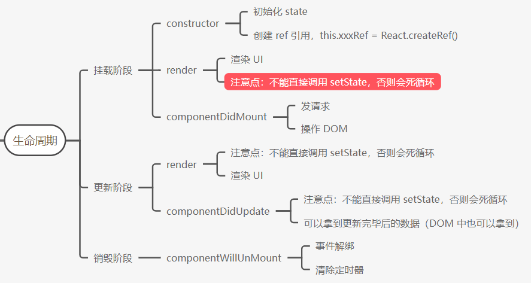
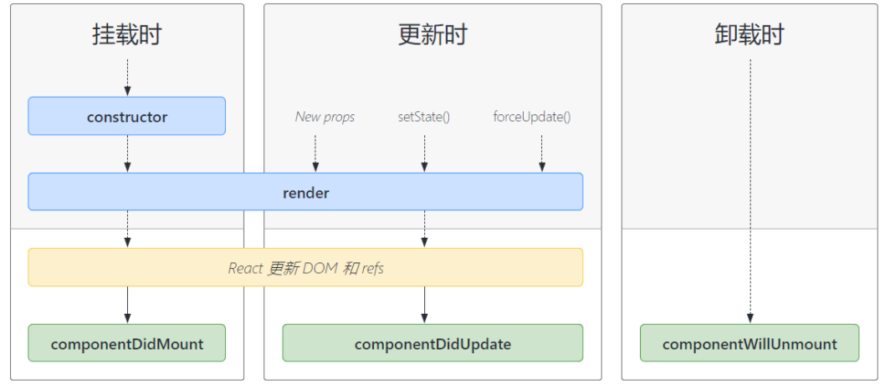
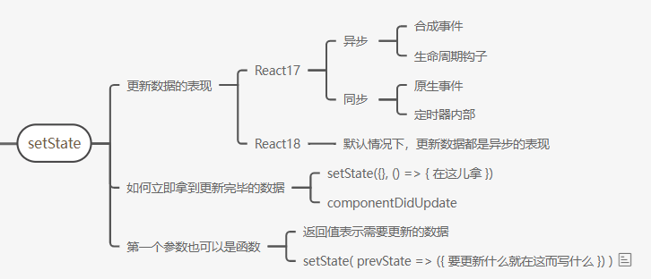

项目开启时的 favicon 为什么显示 vue 的图标？

项目开启后，会从public目录下去找favicon，没有就从浏览器的缓存中读取

# 1. 生命周期



## 1.1. 生命周期介绍

[React 官方文档生命周期介绍](https://zh-hans.reactjs.org/docs/react-component.html#the-component-lifecycle)

* 生命周期：一个事物从创建到最后消亡的整个过程，而组件的生命周期说的就是组件从被创建到挂载到页面中运行，再到组件卸载的过程。
* 意义：学习组件的生命周期有助于理解组件的运行方式、完成更复杂的组件功能、分析组件中问题产生的原因等。
* 生命周期钩子函数的作用：为开发人员在不同阶段操作组件提供了时机。
* **只有类组件才有生命周期。**函数组件可以通过 useEffect 来**模拟**类组件的生命周期

> 同 Vue 中的生命周期一样的作用

React 类组件的生命周期分为以下三个阶段，很多钩子都被废弃了，为了节省性能



> 注意：React 生命周期中的钩子远远不止这下面列出的钩子函数（很多出于一些原因也已经废弃了），具体参考[React 官方文档生命周期介绍](https://zh-hans.reactjs.org/docs/react-component.html#the-component-lifecycle)

## 1.2. 挂载阶段

挂载阶段常用的生命周期函数有 3 个，执行顺序是 constructor => render => componentDidMount

| 钩子函数          | 触发时机                    | 作用                                           |
| ----------------- | --------------------------- | ---------------------------------------------- |
| constructor       | 创建组件时，最先执行        | 1. 初始化 state 2. 创建 Ref 等                 |
| render            | 每次组件渲染都会触发        | 渲染 UI（**注意： 不能直接调用 setState()** ） |
| componentDidMount | 组件挂载（完成 DOM 渲染）后 | 1. 发送网络请求 2.DOM 操作                     |

> 同理，也不要【直接】在 componentDidUpdate 中改变状态

## 1.3. 更新阶段

更新阶段常用的生命周期函数有 2 个，执行顺序是 render => componentDidUpdate

触发更新（更新阶段的两个钩子再执行一次）：`setState()`、`forceUpdate()`、`New props`（父组件进行了 render）

* foreceUpdate 调用后页面强制刷新

* new props => 只要父组件触发了render 子组件就会更新（刚开始传递并不触发，是子组件创建时触发的挂载阶段，render 和 componentDidMount）

| 钩子函数           | 触发时机                    | 作用                                                         |
| ------------------ | --------------------------- | ------------------------------------------------------------ |
| render             | 每次组件渲染都会触发        | 渲染 UI（与挂载阶段是同一个 render）                         |
| componentDidUpdate | 组件更新（完成 DOM 渲染）后 | DOM 操作，可以获取到更新后的 DOM 内容，**不要调用 setState** |

**注意点：不能在 render 和 componentDidUpdate 钩子中【直接】（可以有条件的调用比如加一个 if 语句）调用setState，因为每次 setState 都会触发更新阶段的 render 和 componentDidUpdate 。会陷入一个死循环**

## 1.4. 卸载阶段

触发时机：组件从页面中消失

以前的做法销毁组件`ReactDOM.unmountComponentAtNode(document.getElementById('root'))`（React18 已经废弃）

| 钩子函数             | 触发时机                 | 作用                                           |
| -------------------- | ------------------------ | ---------------------------------------------- |
| componentWillUnmount | 组件卸载（从页面中消失） | 执行清理工作（比如：清理定时器等、解绑事件等） |

> * 生命周期钩子中的this 指向组件实例
>
> * root.unmount() 钩子用来销毁（卸载）组件，root是你 ReactDOM.createRoot() 创建的root
>
> * Vue3 中也是创建一个 app 然后 app.unmount()

```js
export default class Child extends Component {
  constructor() {
    super()
    console.log("constructor")
  }
  state = {
    count: 0,
  }
  render() {
    console.log("render")
    return (
      <div>
        <p>props:{this.props.num}</p>
        <p>Child:{this.state.count}</p>
        <button
          onClick={() => {
            // this.setState({ count: this.state.count + 1 })
            // 想要页面强制刷新一次
            this.forceUpdate()
          }}
        >
          点我子组件
        </button>
      </div>
    )
  }
  // 主动卸载组件的方法在 React18 中已经被删除
  // ReactDOM.unmountComponentAtNode(document.getElementById('root'))

  // 使用 root.unmount() 进行组件的销毁，同 Vue3 的 app.unmount() 方法

  componentDidMount() {
    console.log("componentDidMount")
  }
  componentDidUpdate() {
    console.log("componentDidUpdate")
  }
  componentWillUnmount() {
    console.log("componentWillUnmount")
  }
}
```

## 1.5. 生命周期钩子应用-数据持久化

在生命周期钩子中实现数据的持久化

componentDidMount 钩子只在组件初始渲染完毕后执行一次，而 componentDidUpdate 钩子会在数据更多后执行，可以执行多次

```jsx
  // list 修改完毕后进行持久化
  componentDidUpdate() {
    localStorage.setItem('list', JSON.stringify(this.state.list))
  }
  // 初始化完成从本地获取数据并通过 setState 同步到 list
  componentDidMount() {
    this.setState({ list: JSON.parse(localStorage.getItem('list')) || [] })
  }
```

# 2. setState的推荐语法

[React 官方 setState 方法介绍](https://react.docschina.org/docs/state-and-lifecycle.html#state-updates-may-be-asynchronous)

setState本身就是一个同步方法，react18之前 分为同步表现和异步表现（react 内部维护的一个队列）react18以后默认都是异步表现，可以通过某些方式开启

更加官方的说法：ReactV18 是 Automatic batching 全自动批处理，18 之前的版本是半自动批处理

* 合成事件和生命周期钩子中它的表现形式是异步的
* 原生事件、定时器和 Promise.的then回调函数里是同步的。18之后对这个进行了统一的处理，一律是异步的表现
  异步就是（多次进行 setState 会进行合并的操作，同样的属性会进行覆盖）会等待后面的 setState 合并后（参数是对象）然后一起执行，或者等待所有的 setState （参数是函数）一起执行完毕后，在进行一次视图的更新（为了性能考虑）



## 2.1. 异步表现

* 一般情况下（常见的在生命周期或合成事件处理函数中），通过 `setState()` 方法来更新数据，表现是异步的。
* 当执行到 setState 这一行的时候，React 出于性能考虑，并不会马上进行调用来修改 state，而是先把这个以及后续的更新对象放到一个更新队列里面进行合并的操作，期间不影响后续代码的执行。
* 多次调用` setState()`（不管参数是对象还是函数，对象会合并，执行一次），只会触发一次重新渲染，所以无需担心多次进行 `setState` 会带来性能问题

```js
import React, { Component } from "react"
export default class App extends Component {
  state = {
    age: 1,
  }
  handleClick = () => {

    this.setState({ age: this.state.age + 1 })
    this.setState({ age: this.state.age + 2 })
    this.setState({ age: this.state.age + 3 }) 

    // 这样第二个回调中的结果都是 4 ，是执行最后一句后的结果

    // 这样写的话，react 内部会先合并所有的 setState 语句，对象合并
    // {...{ age: this.state.age + 1 }, ...{ age: this.state.age + 2 }, ...{ age: this.state.age + 3 }}
    // 最后合并的结果是，相同的属性会覆盖 { age: this.state.age + 3 }
    console.log(this.state.age) // 这里立即拿到的数据还是1，视图结果是4
  }
  render() {
    return (
      <div>
        <p>{this.state.age}</p>
        <button onClick={this.handleClick}>点我更新数据</button>
      </div>
    )
  }
  // update 钩子只执行一次
  componentDidUpdate() {
    console.log(this.state.age)
  }
}

```

## 2.2. 同步表现

原生事件里的同步表现

```js
import React, { Component, createRef } from 'react'

export default class App extends Component {
    state = {
        count: 1,
    }
    btnRef = createRef()
    componentDidMount() {
        this.btnRef.current.onclick = () => {
            this.setState({
                count: this.state.count + 1,
            })
            console.log(this.state.count) // 2
        }
    }
    render() {
        return (
            <div>
                <h2>{this.state.count}</h2>
                <button ref={this.btnRef}>click</button>
            </div>
        )
    }
}
```

另一种同步的表现写法，使用`async + await`（了解即可，不怎么用）

```js
import React, { Component } from 'react'

export default class App extends Component {
    state = {
        count: 1,
    }
    async componentDidMount() {
        await this.setState({
            count: this.state.count + 1,
        })
        console.log(this.state.count) // 2
    }
    render() {
        return (
            <div>
                <h2>{this.state.count}</h2>
            </div>
        )
    }
}
```

## 2.3. setState 推荐语法

有两个问题没有解决

1. 既然 setState 方法的表现形式是异步的，那么怎么立即拿到更新后的数据？

2. 多次 setState 会合并对象，怎么让它不合并，每个都执行？

### 2.3.1. setState 的第二个参数

通过 setState 第二个参数（回调函数中）中可以立即拿到更新后（数据更新后 dom 重新渲染）的数据

* 场景：在状态更新后，依靠更新后的状态立即执行某个操作
* 语法：`setState(updater[, callback])`

```js
export default class App extends Component {
  state = {
    age: 1,
  }
  handleClick = () => {
    // 解决：setState 方法第二个参数接收一个回调函数，可以拿到更新后(dom 渲染)的数据
    // Vue 是可以立即拿到更新的数据，但是拿不到 dom 渲染的数据，需要使用 nextTick()
      
    this.setState({ age: this.state.age + 2 }, () => {
      // 这里用普通 function 函数或者箭头函数都可以用 this 拿到组件实例
      // console.log(this)
      console.log(this.state.age) //3
      console.log(document.querySelector("p").innerHTML) //3
    })

  render() {
    return (
      <div>
        <p>{this.state.age}</p>
        <button onClick={this.handleClick}>点我更新数据</button>
      </div>
    )
  }

  // 也可以在生命周期钩子 componentDidUpdate 中拿到更新后的数据，这样的话，业务就拆分了，不太方便，推荐在 setState 第二个回调中拿
  // update 钩子只执行一次
  componentDidUpdate() {
    console.log(this.state.age)
  }
}
```

### 2.3.2. setState 的第一个参数传一个函数

对象还是用的最多，如果需要拿到上一次的数据，或者写一些逻辑，就用函数，加 return 返回那个对象就可以了

 setState 参数是对象，会先合并，执行一次；参数是函数，会执行多次，两种情况最终数据的视图渲染只有一次，为了性能优化，componentDidUpdate 钩子只执行一次

> **最重要的是写成函数可以拿到上一次执行 setState 之后的状态**

```js
export default class App extends Component {
  state = {
    age: 1,
  }
  handleClick = () => {
    // 解决：setState 方法的第一个参数可以写一个对象，也可以写一个函数，return 一个对象，二者作用等价，函数不会合并
    // 第一个回调有一个参数，会把上一个执行 setState 的更新后的状态传过来
    // 这样也可以在第二个回调后拿到更新后的数据
    this.setState({ age: this.state.age + 1 }) // 第一次不需要 prevState 可以直接写对象
    this.setState(prevState => {
      return { age: prevState.age + 2 }
    })
    this.setState(
      prevState => {
        return { age: prevState.age + 3 }
      },
      () => {
        // 这样仍然可以从第二个回调中拿到 dom 更新后的数据
        console.log(this.state.age)
      }
    )
    console.log(this.state.age) // 这里仍然是异步的，结果是 1，但是视图更新是 7
    // 可以使用 async + await 拿到 dom 更新后的数据，但是不常用 await this.setState()
  }
  render() {
    return (
      <div>
        <p>{this.state.age}</p>
        <button onClick={this.handleClick}>点我更新数据</button>
      </div>
    )
  }

  // 也可以在生命周期钩子 componentDidUpdate 中拿到更新后的数据，这样的话，业务就拆分了，不太方便，推荐在 setState 第二个回调中拿
  // update 钩子只执行一次
  componentDidUpdate() {
    console.log(this.state.age)
  }
}
```

## 2.4. setState 异步的练习

1. 搭建基本结构。
2. 准备一个变量来控制 `<input/>` 框的显示隐藏。
3. 给按钮绑定点击事件，在事件回调里面修改这个变量的状态。
4. 在事件回调里面，获取 `<input/>` 框 DOM 对象并调用其聚焦的方法

```js
export default class App extends Component {
  // 需求：点击按钮显示 input 框并聚焦
  state = {
    showInput: false,
  }
  inputRef = createRef()
  handleClick = () => {
    this.setState({ showInput: !this.state.showInput }, () => {
      // dom 更新渲染后才能获取到真实 dom
      this.inputRef.current.focus()
    })
  }
  input
  render() {
    return (
      <div>
        {this.state.showInput ? (
          <input type="text" ref={this.inputRef} />
        ) : null}
        <button onClick={this.handleClick}>回复</button>
      </div>
    )
  }
}
```

# 3. todolist

## 3.1. 一些常用的技巧积累

1. 三元表达式显示的结果为空字符串或者null，就表示什么也不做，比如某个className

```js
// className
<span className={true ? "active" : ""></span>

// jsx
{ count%2 === 0 ？<div>我是文字</div> : null}
```

2. react 中使用 v-if 的同样效果
   1. 定义布尔值的状态
   2. 三元表达式
   3. 定义事件处理函数

```jsx
export default class App extends Component {
// 点击后切换显示隐藏 input 表单
  state = {
    showInput: false,
  }
  handleClick = () => {
    this.setState({ showInput: !this.state.showInput })
  }
  input
  render() {
    return (
      <div>
        {this.state.showInput ? (
          <input type="text"/>
        ) : null}
        <button onClick={this.handleClick}>回复</button>
      </div>
    )
  }
}
```

3. jsx 常用来将处理好的数据作为实参传递

   ```js
   changeDone = async (id, done) => {
       await request.patch("/" + id, { done })
       // 重新后去数据并渲染
       this.props.getList()
     }
   
   // 点击切换数据，在 jsx 中把切换好的数据传参传过去
   <input
          className="toggle"
          type="checkbox"
          checked={item.done}
          onChange={() => this.changeDone(item.id, !item.done)}
   />
   ```

4. 子传父中处理父亲传递过来的方法的两种方式

   ```js
   //1. 直接包在一个箭头函数里面，需要传参
   <input
         type="checkbox"
          checked={goods_state}
          onChange={() => {
          changeState(id)
        }}
   />
   
   // 2. 或者这样抽离出来，里面还需要写一些逻辑
   handleChange=（）=> {
       //some code...
       props.changeState(id)
   }
   <input
         type="checkbox"
          checked={goods_state}
          onChange={handleChange}
   />
   ```

## 3.2. json-server

`json-server`用本地数据来模拟接口

使用步骤

1. 安装

   ```bash
   npm i -g json-server
   ```

2. 在项目的根目录下准备数据`data.json`

   ```js
   {
       "todos": [
           {
               "id": 1,
               "name": "死豆",
               "done": false
           },
           {
               "name": "打死豆豆",
               "done": true,
               "id": 4
           }
       ]
   }
   ```

3. node 环境中启动本地服务

   ```bash
   json-server data.json --port 8888
   ```

4. 使用（可以使用 postman 测试接口，这里的 todos 是根据自己定义的数据里的来的）

   ```js
   GET    /todos
   GET    /todos/1
   POST   /todos
   PUT    /todos/1
   PATCH  /todos/1
   DELETE /todos/1
   ```

**PUT 和 PATCH 的差异**

PUT 是全量修改，修改了数据中的某一项也要把其他的数据带过去，不然其他的数据会被干掉，PATCH 是补丁，传递什么只会修改什么

## 3.3. todolist 案例（未做完...）

### App.js

**步骤**

1. `App.js` 中请求数据并存储到 state 的 list 数组中。
2. 把 list 数组传递到 `<TodoMain/>` 组件。
3. 通过 propTypes 对传递过来的 list 数组进行校验。
4. 循环渲染 list 数组。

**注意点**

* 发请求在 componentDidMount 中发，需要先定义一个状态用来接受后台的 list 数据，思路和之前差不多
* 封装一个请求最新数据的方法，并传到子组件，在每次数据更改后，需要重新请求最新数据

```js
import React, { Component } from "react"
import TodoHeader from "./components/TodoHeader"
import TodoMain from "./components/TodoMain"
import TodoFooter from "./components/TodoFooter"
import { request } from "./utils/request"

export default class App extends Component {
  state = {
    list: [],
  }
  componentDidMount() {
    this.getList()
  }
  getList = async () => {
    const { data: res } = await request({
      url: "/",
      methods: "get",
    })
    // console.log(res)
    this.setState({ list: res })
  }

  render() {
    return (
      <section className="todoapp">
        {/* TodoHeader */}
        <TodoHeader getList={this.getList} />
        {/* TodoMain */}
        <TodoMain list={this.state.list} getList={this.getList} />
        {/* TodoFooter */}
        <TodoFooter />
      </section>
    )
  }
}
```

### TodoHeader.js

```js
import React, { Component } from "react"
import { request } from "../utils/request"

export default class TodoHeader extends Component {
  state = {
    content: "",
  }
  // 添加功能
  handleKeyUp = async e => {
    // keydown 如果长按的话会一直触发，建议按键事件都使用 keyup
    // console.log(e)
    if (e.key !== "Enter") return
    // e.target.value === this.state.content
    if (e.target.value.trim() === "") return
    // 添加到后端
    await request.post("/", {
      name: this.state.content,
      done: false,
    })
    // 清空表单
    this.setState({ content: "" })
    // 重新请求数据并渲染
    this.props.getList()
  }
  render() {
    return (
      <header className="header">
        <h1>todos</h1>
        <input
          className="new-todo"
          placeholder="What needs to be done?"
          autoFocus
          value={this.state.content}
          onChange={e => {
            // console.log(e)
            this.setState({ content: e.target.value })
          }}
          onKeyUp={this.handleKeyUp}
        />
      </header>
    )
  }
}

```

### TodoMain.js

```js
import classNames from "classnames"
import React, { Component } from "react"
import { request } from "../utils/request"

export default class TodoMain extends Component {
   // 删除功能
  delTodo = async id => {
    // 从后台删除数据
    await request.delete("/" + id)
    // 重新请求最新的数据进行页面渲染
    this.props.getList()
  }
    
   // 多选选中功能
  changeDone = async (id, done) => {
    await request.patch("/" + id, { done })
    // 重新后去数据并渲染
    this.props.getList()
  }
  render() {
    const { list } = this.props
    return (
      <section className="main">
        <input id="toggle-all" className="toggle-all" type="checkbox" />
        <label htmlFor="toggle-all">Mark all as complete</label>
        <ul className="todo-list">
          {list.map(item => (
            <li className={classNames({ completed: item.done })} key={item.id}>
              <div className="view">
                <input
                  className="toggle"
                  type="checkbox"
                  checked={item.done}
                  onChange={() => this.changeDone(item.id, !item.done)}
                />
                <label>{item.name}</label>
                <button
                  className="destroy"
                  onClick={() => {
                    this.delTodo(item.id)
                  }}
                ></button>
              </div>
              {/* <input className="edit" value="Create a TodoMVC template" /> */}
            </li>
          ))}
        </ul>
      </section>
    )
  }
}

```

### TodoFooter.js

```js
import React, { Component } from "react"

export default class TodoFooter extends Component {
  render() {
    return (
      <footer className="footer">
        <span className="todo-count">
          <strong>0</strong> item left
        </span>
        <ul className="filters">
          <li>
            <a className="selected" href="#/">
              All
            </a>
          </li>
          <li>
            <a href="#/active">Active</a>
          </li>
          <li>
            <a href="#/completed">Completed</a>
          </li>
        </ul>
        <button className="clear-completed">Clear completed</button>
      </footer>
    )
  }
}

```

