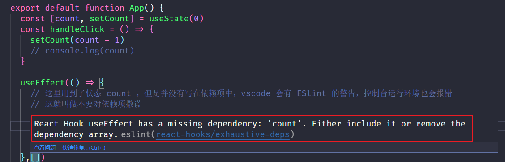

# 1. Hooks 介绍

## 1.1. Hooks 是什么

[React 官方文档 Hook 介绍](https://zh-hans.reactjs.org/docs/hooks-intro.html)

* `Hooks`：钩子、钩住，是 `React@16.8` 提供的新功能
* 作用：为函数组件提供状态、生命周期等原本 class 组件中才有的功能，可以理解为通过 Hooks 为函数式组件钩入了 class 组件的特性
* `React@16.8` 以前，class 组件（提供状态和生命周期） + 函数组件（展示内容）
* `React@16.8` 以后，class 组件（提供状态和生命周期） + 函数组件（展示内容），Hooks（提供状态和生命周期） + 函数组件（展示内容），也可以混用这两种方式，即部分功能用 class 组件，部分功能用 Hooks + 函数组件
* 注意：**Hooks 只能在函数组件中使用**，虽然有了 Hooks，但 [React 官方](https://zh-hans.reactjs.org/docs/hooks-intro.html)并没有计划从 React 库中移除 class

> **函数组件配合 Hooks **来使用，可以和原来的类组件实现一样的功能

## 1.2. 为什么要有 Hooks


* 组件的状态逻辑复用问题

  a. 在 Hooks 之前，组件的状态逻辑复用经历了：mixins（混入）、HOC（高阶组件）、render props 等模式

  b. （早已废弃）mixins 的问题：数据来源不清晰；命名冲突

  c. HOC、render props 的问题：重构组件结构，导致组件形成 JSX 嵌套地狱问题

* class 组件自身的问题

  a. 选择：函数组件和 class 组件之间的区别以及使用哪种组件更合适（可能刚开始没有需要状态，但是写一半又需要状态，太麻烦）

  b. 需要理解 class 中的 this 是如何工作的（this 的指向有五种方法 ，需要花时间成本去学习）

  c. 同一业务的状态和业务逻辑被拆分到不同位置

**同时：相比于函数组件来说，类组件不利于代码压缩和优化，也不利于 TS 的类型推导（了解）**

```bash
# 例如不能把 componentDidMount 压缩成 c
# 例如写 this 的时候没有提示，因为 this 只有在调用的时候才能确定指向，编写代码期间 TS 是不知道的
```

**前十年的主流都是类组件 ，为什么现在函数组件渐渐成为了主流？**

* 因为 react 的函数组件和 ts 的适配性更好，同时 Vue2 和 ts 的适配性也不好，Vue3 和 ts 的适配性更好
* 最主要的特点就是组件的状态逻辑复用问题，并且业务逻辑可以写在一起（ 函数组件 + hooks）

> Hooks 为函数组件勾入状态和类似生命周期的行为

## 1.3. Hooks 渐进策略

**Hooks 和之前 class 的写法是可以共存的**

* [官方](https://zh-hans.reactjs.org/docs/hooks-intro.html)没有计划从 React 中移除 class 组件

* Hooks 和现有代码可以同时工作，建议渐进式地使用它们

  a. 不推荐：大规模使用 Hooks 直接重构现有组件

  b. 推荐：新功能用 Hooks，Hooks 实现不了的复杂功能，也可以继续用 class

  c. 具体操作，从一些功能简单、非核心功能的组件开始使用 Hooks

* 不能在 Hooks 组件中，使用 class 组件相关的 API

  a. state 与 setState

  b. 钩子函数，`componentDidMount`、`componentDidUpdate`、`componentWillUnmount`

  c. `this` 相关的用法

* 原来学习的绝大部分知识点还是要用的

  a. JSX：`{}`、`onClick={handleClick}`、条件渲染、列表渲染、样式处理等

  b. 组件：函数组件、组件通讯

  c. React 开发理念：`单向数据流`、`状态提升` 等

  d. 解决问题的思路、技巧、常见错误的分析等

# ==2. 内置Hook-useState== 

**作用：为函数组件提供状态和修改状态的方法**


## 2.1. useState基本用法

### 2.1.1. 基础语法

基本语法：`const [count, setCount] = useState(0)`

* 参数：初始状态，比如传入 `0` 就表示该状态的初始值为 0。此处的状态可以是任意值（比如，数值、字符串、对象等），注意 class 组件中的 state 必须是对象。
* 返回值：数组，数组里面包含两个值（这里是直接用了数组的解构），状态和修改该状态的方法。`count` 为定义的状态，`setCount `是用来修改状态的方法

> 约定：修改状态的方法以 set 开头，后面跟上状态的名称

useState 的返回值


### 2.1.2. 读取和修改状态

然后用法和注意点其实和 setState 差不太多

目前，**useState 只能在函数组件内部调用**（或者后续学习的自定义 Hook 内部也可以使用），所以返回的状态也是函数内部的局部变量

状态的**不可变性**（修改状态的时候，要使用新的状态替换掉旧的状态，而不要直接修改原状态）在函数组件中也存在

* 修改状态方式 1

  a. `setCount(newValue)` 是一个函数调用，参数表示新的状态值

  b. 调用该函数后，将使用新的状态值直接替换旧状态

  c. 修改状态后，组件会自动重新渲染

  **这里的 setXxx 调用的表现形式也是异步的，立即拿到更新后的数据在 Hook useEffect 的第一个回调中拿（多次执行 setXxx 最终视图只会更新一次，useEffect 只触发一次）**

* 修改状态方式 2

  `setCount(prevState => newValue)`，通过 prevState 可以拿到上一次更新完毕后的状态

  **解决多次调用会合并的问题**

```js
import React, { useState } from "react"

export default function App() {
  // 函数里面的 this 是 undefined

  // 数组的解构赋值，顺序很重要，是根据顺序去解构的
  // 对象的解构赋值是根据属性名去解构的

  const [count, setCount] = useState(0)
  const handleClick = () => {
    // setCount(count + 1)

    // 和之前的 setState 一样 多个会合并
      
    /*  setCount(count + 1)
    setCount(count + 2)
    setCount(count + 3)
    console.log(count) // 结果是 0，最后的 count + 3覆盖了之前的 */

    // 想要多次执行不合并，和 setState 一样 传入一个函数，拿到 prevState
    setCount(count + 1)
    setCount(prevState => prevState + 2)
    setCount(prevState => prevState + 3)
    console.log(count) // 结果是6
  }
  
  // 多次执行 setXxx 最终视图只会更新一次，useEffect 只触发一次
  // 在 useEffect 中拿到立即更新的数据
  useEffect(() => {
    console.log(count)
  }, [count])
  return (
    <div>
      <p>{count}</p>
      <button onClick={handleClick}>点我+1</button>
    </div>
  )
}

```

> 往往很多时候需要 setXxx 需要写回调函数拿到上一个状态的值，来解决一些闭包的影响

## 2.2. setXxx 调用组件会重新渲染（组件更新过程）

* 组件第 1 次渲染
  1. 调用函数式组件，从头开始执行组件中的代码逻辑。
  2. 调用 `useState(0)` 将传入的参数作为初始状态值，即：0。
  3. 开始渲染组件，此时得到的状态 count 值为：0。
* 组件第 2 次渲染
  1. 点击按钮，调用 `setCount(count + 1)` 来修改状态，因为状态发生改变，所以，该组件会重新渲染。
  2. 组件重新渲染时，会再次执行该组件中的代码逻辑。
  3. 再次调用 `useState(0)`，此时 **React 内部会拿到最新的状态值而非初始值**，比如该案例中的最新状态值为 1。
  4. 再次渲染组件，此时，获取到的状态 count 值为：1。
* **强调：useState 的初始值(参数)只会在组件第一次渲染时生效**，也就是说，以后的每次渲染，useState 获取到都是最新的状态值，React 组件内部会记住每次更新后的最新状态值!

```js
import React, { useState } from "react"

export default function App() {
  console.log("11") //这里每次在 setXxx 时都会打印
  // 每次调用 setCount 整个组件会重新渲染一次，即 App() 重新调用一次，里面的代码逻辑会从头到尾重新执行一次
  // 但是 useState 里面的初始值只有在初始渲染的时候 React 内部会拿到最新的状态值而非初始值
  // useState 的初始值(参数)只会在组件第一次渲染时生效 以后的每次调用 setCount ，useState 都会获取最新的状态

  const [obj, setObj] = useState({
    name: "张三",
    age: 23,
  })
  const handleClick = () => {
    setObj({
      ...obj,
      age: 20,
    })
    console.log(obj) //这里其实改变了 age 为20，视图渲染为20，但是表现形式是异步的，所以仍然打印23
  }
  return (
    <div>
      <p>age: {obj.age}</p>
      <button onClick={handleClick}>点我改变</button>
    </div>
  )
}

```

就跟 setState 每次执行时，render 和 componentDidUpdate 都会重新触发一次一样，setXxx 每次执行，函数组件会重新渲染一次

> 多次改变，组件只会渲染一次，componentDidUpdate 钩子或者 useEffect Hook只会执行一次，框架的基操，来节省性能

## 2.3. useState 的参数可以是一个回调函数

`useState(回调函数)`，回调函数的返回值就是状态的初始值，**该回调函数只初始化时触发一次**

该使用哪种形式？

* 如果状态就是需要一个普通数据（没有逻辑、无需计算），那么推荐 `useState(普通的数据)`。

* 如果状态是经过一些计算得到的，此时，推荐使用 useState(回调函数)

```js
import React, { useState } from "react"

export default function App() {
  // useCount 的参数可以是一个函数+ return 来表示初始值
  // 这样写 每次 setXxx 这里的for都会执行一次，极大的影响性能
  /*  let sum = 0
  for (let i = 0; i < 100; i++) {
    sum += i
  }
  const [count, setCount] = useState(sum) */

  // 解决
  // 里面的参数只在初始时渲染一次，后面 useState 拿到的都是最新的状态
  // 如果状态是经过一些计算得到的，此时，推荐使用 useState(回调函数)
  const [count, setCount] = useState(() => {
    let sum = 0
    for (let i = 0; i < 100; i++) {
      sum += i
    }
    return sum
  })

  const handleClick = () => {}
  return (
    <div>
      <p>count: {count}</p>
      <button onClick={handleClick}>点我+1</button>
    </div>
  )
}
```

## 2.4. useState 的书写位置注意点

如何为函数组件提供多个状态？

多次调用 useState 即可，每一次调用返回的 `[state, setState]` 之间，互不影响

**useState 的使用细则**

* **不能嵌套在 if/for/其他函数 中！**（if 的条件判断、for 循环的次数、函数的调用与否都可能会影响 hook 的顺序）
* React 是按照 Hooks 的调用顺序来识别每一个 Hook，如果每次调用的顺序不同，导致 React 无法知道是哪一个状态和修改状态的方法
* 可以通过开发者工具进行查看 React 对 Hook 的管理

里面不知道改哪一个状态，也不知道是哪一个状态，内部维护的是一个链表，是有顺序的，下图是 devtools 里面的图


> Vue3 中 useRouter 不能写在函数里面，是因为块级作用域，外面拿不到

```js
export default function App() {
  // 多个状态调用多次 useState 就行了
  // 注意：不要放在任何影响 useState 调用顺序的语句里面，比如 if、for、fn里面（不确定执不执行或者执行多少次就会影响状态的顺序性）
  const [num1, setNum1] = useState(0)
  const [num2, setNum2] = useState(3)
  const [num3, setNum3] = useState(6)

  return (
    <div>
      <div>
        num1: {num1}
        <button onClick={() => setNum1(num1 + 1)}>修改 num1</button>
      </div>
      <div>
        num2: {num2}
        <button onClick={() => setNum2(num2 + 1)}>修改 num1</button>
      </div>
      <div>
        num3: {num3}
        <button onClick={() => setNum3(num3 + 1)}>修改 num1</button>
      </div>
    </div>
  )
}
```

# ==3. 内置Hook-useEffect==


## 3.1. 什么是副作用（side effect）

* 类比，对于 999 感冒灵来说

  a，主作用：用于治疗感冒引起的头痛，发热，鼻塞，流涕，咽痛等

  b，副作用：可见困倦、嗜睡、口渴、虚弱感

* 那组件或一般函数的副作用是什么呢？

  a，组件的副作用：对于 React 组件来说，主作用就是根据数据（state/props）**渲染 UI**，除此之外都是副作用，比如手动修改 DOM、数据（AJAX）请求、localStorage 操作等

  b，函数的副作用：如果一个函数修改了其局部环境之外的数据，那么它就被称为有副作用

* 关于 useEffect

  作用：当你想要在函数组件中处理副作用（side effect），就要使用 useEffect 这个内置 Hook

> 在实际开发中，副作用是不可避免的。开发中副作用往往就是发请求

拓展 --- Hook 的缺点：类组件是一个萝卜一个坑，hook是都揉在一起，心智负担更重了，每次写东西不知道写在哪里比较合适，比如写在 useEffect 中又担心每次数据更新，又多执行一次

## 3.2. useEffect 基本使用

useEffect 用来在函数组件中处理副作用

语法：`useEffect(callback)`这里的 callback 称为副作用处理函数，也称为 effect 或者 effect 回调

这种写法相当于 class 组件中的 `componentDidMount`和 `componentDIdUpdate` 生命周期钩子

```js
import React, { useEffect, useState } from "react"

export default function App() {
  const [count, setCount] = useState(0)
  const [age, setAge] = useState(10)
  useEffect(() => {
    // 这里的代码只希望 count 变化的时候才执行

    // 但是这里在初始化的时候会走一次
   //age 变化这里也走了，性能不好
    console.log("111")
    document.title = count
  }) 
  // 初始化会走 => componentDidMount
  // 状态变化会走 => componentDIdUpdate

  return (
    <div>
      <h3>{count}</h3>
      <h3>{age}</h3>
      <button onClick={() => setCount(count + 1)}>修改count</button>
      <button onClick={() => setAge(age + 1)}>修改age</button>
    </div>
  )
}
```

出现一个问题：

useEffect 里面只希望 count 变化的时候才执行，但是实际上 age 变化的时候也走了，性能不好，如何解决？

解决：使用 useEffect 的依赖来解决

## 3.3. useEffect 依赖

useEffect 的第二个参数称为依赖，用来限制只在依赖状态变化时才执行副作用处理函数

期望：**如何跳过不必要的执行，只有在 count 变化时，才执行相应的 effect**

解决：**第二个参数可以传一个数组（整个数组称为依赖），表示只有当数组中的选项/依赖项改变时，才会重新执行该 effect**

```js
import React, { useEffect, useState } from "react"

export default function App() {
  const [count, setCount] = useState(0)
  const [age, setAge] = useState(10)
  useEffect(() => {
    // 这里的代码只希望 count 变化的时候才执行

    // 但是这里在初始化的时候会走一次
    // 不加后面的依赖项数组，age 变化这里也走了，性能不好
    console.log("111")
    document.title = count
  }, [count]) // 第二个参数可以写一个数组，数组里面的内容称为依赖项（依赖项可以写多个），表示数组里面的状态/依赖项变化的时候才执行副作用处理函数
  // 加了 useEffect 依赖项的时候
  // 初始化会走 => componentDidMount
  // count 状态变化会走 => 有条件的 componentDIdUpdate

  return (
    <div>
      <h3>{count}</h3>
      <h3>{age}</h3>
      <button onClick={() => setCount(count + 1)}>修改count</button>
      <button onClick={() => setAge(age + 1)}>修改age</button>
    </div>
  )
}
```

## 3.4. useEffect 依赖的三种情况小结

| useEffect 依赖 | 语法                             | effect 回调什么时候执行       | 可以模拟 类组件的什么生命周期钩子               | 应用                                           |
| -------------- | -------------------------------- | ----------------------------- | ----------------------------------------------- | ---------------------------------------------- |
| 什么也不写     | `useEffect(()=>{})`              | 初始化、任何状态变化都会走    | componentDidMount + componentDidUpdate          | 用的很少                                       |
| 空数组         | `useEffect(()=>{},[])`           | 只在初始化走一次              | componentDidMount                               | **开启定时器、事件绑定**、**发送请求**         |
| 数组           | `useEffect(()=>{},[conut, num])` | 初始化、 count 变化完毕后会走 | componentDidMount + 有条件的 componentDidUpdate | 监听某个状态的变化，或者拿到状态变化后的最新值 |

> 一个 useEffect 只处理一个功能，有多个功能时，使用多次 useEffect

## 3.5. 如何立即拿到更新后的数据

在 useEffect 的副作用处理函数中拿到状态变化后最新的数据

```js
export default function App() {
  const [count, setCount] = useState(0)
  const handleClick = () => {
    setCount(count + 1)
    // console.log(count)
  }

  useEffect(() => {
    // 初始化
    // 当 count 变化完毕后会走

    // 立即拿到更新后的数据
    console.log(count)
  }, [count])
  return (
    <div>
      <h3>count: {count}</h3>
      <button onClick={handleClick}>+1</button>
    </div>
  )
}
```

## 3.6. 补充-不要对依赖项撒谎

* useEffect 回调函数中用到的数据（比如前面学习的 count）就是依赖数据，就应该出现在依赖项数组中
* 如果 useEffect 回调函数中用到了某个数据，但是没有出现在依赖项数组中，就会导致一些“Bug”出现（例如 useEffect 回调不会执行）
* 所以，不要对 useEffect 的依赖撒谎，[参考 useEffect 完全指南](https://overreacted.io/zh-hans/a-complete-guide-to-useeffect/)



## 3.7. 不要在 useEffect 中直接改变状态

和之前的不能在 render 中【直接】（可以有条件的使用，比如 if） 使用 setState 一样，修改了会不断的触发 render ，然后又触发 setState，陷入死循环

这里同上面一样，在 useEffect 中直接使用 setXxx 来修改状态（前提是状态改变 effect 会触发，没设第二个参数，或者设置了相应的依赖项），会不断触发 effect 陷入死循环

```js
import React, { useEffect, useState } from "react"

export default function App() {
  const [count, setCount] = useState(0)
  const handleClick = () => {
    setCount(count + 1)
    // console.log(count)
  }

  useEffect(() => {

    // 这样写会陷入死循环，每次 setCount 之后，重新渲染，effect 回调又触发，再触发setCount...
    setCount(count + 1)

  },[count])

  return (
    <div>
      <h3>count: {count}</h3>
      <button onClick={handleClick}>+1</button>
    </div>
  )
}

```

## 3.8. useEffect应用-开启定时器

这里不会出现上面的死循环，因为第二个参数写的是一个空数组，只在初始化时执行一次

### 3.8.1. 遇到的问题

这里 count 用到了useEffect 外面的变量，形成了闭包，导致怎么点击按钮怎么改变状态，5s 之后 count 的值都会变成9

```js
import React, { useEffect, useState } from "react"

export default function App() {
  const [count, setCount] = useState(10)
  useEffect(() => {
    setInterval(() => {
      console.log(1)
      // 这里的 count 引用外面的变量
      // 虽然没执行，但是已经解析了，记录当次渲染的 count 值
      setCount(count - 1)
    }, 5000)
  }, [])
  return (
    <div>
      <h3>count: {count}</h3>
      <button
        onClick={() => {
          setCount(count + 10)
        }}
      >
        点我
      </button>
    </div>
  )
}

```

### 3.8.2. 分析闭包输出的结果

这里和上面是一样的，函数内部引用了外部的变量

**闭包：一个函数，使用外部函数的局部变量，称为使用变量的地方发生了闭包现象，变量定义所在的函数称为闭包函数**

```js
import React, { useState } from "react"

export default function App() {
  const [count, setCount] = useState(10)
  const startTime = () => {
    setTimeout(() => {
      // debugger
      // 一个函数，使用外部函数的局部变量，称为使用变量的地方发生了闭包现象，变量定义所在的函数称为闭包函数

      // 这里的 count 的内存并不会释放掉，一直都是外面内存中的 10 ，虽然定时器没执行，但是代码解析了，还是用到了外部环境的 count
      console.log(count)
    }, 10000)
  }
  return (
    <div>
      <h3>{count}</h3>
      <button onClick={() => setCount(count + 8)}>+8</button>
      <button onClick={startTime}>开启定时器</button>
    </div>
  )
}
```

> 在代码中使用 debugger 关键字，代码执行到这里的时候会进入断点调试模式

### 3.8.3. 闭包问题的解决与分析

一上来定时器里的代码虽然没有执行，但是已经被解析了，形成了闭包，闭包引用的变量会存在内存中不会释放

形参也是局部变量


解决：

```js
import React, { useEffect, useState } from "react"

export default function App() {
  const [count, setCount] = useState(10)
  /* useEffect(() => {
    setInterval(() => {
      // console.log(count)
      setCount(count - 1)
    }, 1000)
  }, []) */
  useEffect(() => {
    setInterval(() => {
      // setCount 的参数是一个函数，这里的 count 是一个形参，什么名字都可以，表示上一次的状态，没有形成闭包
      // 需要多次使用 setXxx，往往需要使用函数回调
      setCount(count => count - 1)
    }, 1000)
  }, [])
  return (
    <div>
      <h3>count: {count}</h3>
    </div>
  )
}

```

## 3.9. useEffect清理副作用

* 建议所有的变量声明放在最上面，依次是简单变量，函数变量，然后再是hooks（当然hooks的执行顺序很重要）
* 一个 useEffect 只用来处理一个功能，有多个功能时，可以使用多个 useEffect

### 3.9.1. 基本介绍

useEffect 可以返回一个函数，这个函数称为清理函数，在此函数内用来执行清理相关的操作（例如事件解绑、清除定时器等）

注意：当return一个执行语句，副作用处理函数执行时，这条执行语句会直接执行

**清理函数的执行时机：下一次副作用回调函数调用时以及组件卸载（从页面上删除dom）时**

```js
import React, { useEffect, useState } from 'react'

export default function Test() {
    const [count, setCount] = useState(0)

    useEffect(() => {
        console.log('effect')
        // 这里组件创建和状态更新时会执行，取决于依赖项
        
        // 这样下面的会立即执行
        // return fn()
        return () => {
      // useEffect 的 return 函数的执行时机:下一次副作用调用时以及组件卸载时调用
      // 组件卸载时 effect 回调不执行，但是 return 的回调执行
      // 组件创建时 effect 回调调用，return 的回调不执行
            console.log('clear effect')
        }
    })
    const handleClick = () => {
        setCount(count + 1)
    }
    return (
        <div>
            {count}
            <button onClick={handleClick}>click</button>
        </div>
    )
}
```

### 3.9.2. 案例一

定时器开启和清除（依赖项是空数组）定时器在组件销毁后并不会清除，需要手动清除

```js
import React, { useEffect, useState } from "react"

export default function Count() {
  const [count, setCount] = useState(10)

  useEffect(() => {
    // 副作用回调函数
    const timer = setInterval(() => {
      console.log(1)
      setCount(count => count - 1)
    }, 1000)
    return () => {
      console.log("清理函数执行了")
      // 清理函数
      clearInterval(timer)
    }
  }, [])

  return <div>Count: {count}</div>
}

```

### 3.9.3. 案例二

事件的绑定和解绑

```js
import React, { useEffect, useState } from "react"
import Avatar from "./avatar.jpg"

// 写在这里
// 当 Count 组件有多个的适合会相互影响
// const handleMouseMove = () => {}
export default function App() {
  const [pos, setPost] = useState({
    x: 0,
    y: 0,
  })

  // 写在这里
  // 每次状态变化，都会重新生成一个新函数 这里后面有新 hook useCallback 来引用同一个函数
  // const handleMouseMove = () => {}
  useEffect(() => {
    const handleMouseMove = e => {
      setPost({
        x: e.pageX,
        y: e.pageY,
      })
    }
    document.addEventListener("mousemove", handleMouseMove)
    return () => {
      document.removeEventListener()
    }
  }, [])
  return (
    <div>
      
    </div>
  )
}

```

## 3.10. useEffect 发送请求

useEffect 是专门用来处理副作用的，所以发送请求这个副作用可以在 useEffect 回调内进行处理

> async 后面的函数是一个异步函数，return 的是一个 Promise

* 注意：useEffect 的回调只能是一个同步函数，即不能使用 async 进行修饰。
* 原因：如果 useEffect 的回调是异步的，此时返回值会被 Promise 化，这样的话就无法保证清理函数被立即调用。（async 修饰的函数会返回一个 Promise 对象）
* 若需要使用 async/await 语法，可以在 useEffect 回调内部再次创建 async 函数并调用

### 3.10.1. useEffect 中向后台发送请求的规范写法

1. 定义一个初始状态
2. 封装请求函数
3. 调用请求函数
4. 后台数据用来改变状态

```js
// 1.定义一个初始状态
const [lise, setList] = useState([])
useEffect(() => {
    // 2.封装请求函数
    async function fetchMyAPI() {
        let url = 'http://something/' + productId
        const res = await myFetch(url)
        // 4.后台数据用来改变状态
        setList(res.data.list)
    }
	// 3.调用请求函数
    fetchMyAPI()
}, [productId])
```

### 3.10.2. 补充 fetch api

[MDN指路](https://developer.mozilla.org/zh-CN/docs/Web/API/Fetch_API/Using_Fetch)

`fetch()`是浏览器内置的 API，用来替代 XMLHttpRequest，工作中目前用到最多的还剩 Axios

fetch 方法的返回的是一个 Promise

```js
const res = await fetch('请求 url 地址')
// 如果说后端返回是 JSON 格式的字符串，那么这里就可以直接用 res.json() 进行转换得到结果，结果又是一个 Promise
// 如果说后端返回是普通的字符串，那么这里就可以直接用 res.text() 进行转换得到结果，结果又是一个 Promise
const getData = async () => {
      const res = await fetch('http://geek.itheima.net/v1_0/user/channels')
      const {
        data: { channels },
      } = await res.json()
      // 把 channels 设置到状态中
      setList(channels)
    }
    getData()


fetch('xx').then(r => r.json()).then(res => console.log(res))
```

# 4. 购物车案例

**注意点**

0. 什么时候需要定义状态，什么时候不用定义状态？就看视图需不需要更新。有的数据本来就是根据状态计算而来的，视图也可以更新，就不需要定义新的状态。另外一种场景，需要在子组件里面复制一份父组件传过来的状态，直接useState(list)就是复制了一份状态，和原来的状态没有任何关系

1. 像下面这种id传来传去，一定有一种简单写法


这样就不用再传来传去了


2. **因为之前的计算属性，完全可以用函数来代替，这里 react 中不支持计算属性，直接用函数来代替**

3. 之前的forEach会修改元素组，这里只能覆盖，使用map


4. 父组件提供的方法，参数尽量和要修改的字段名保持一致（不管子组件传的什么数据），这样写对象的时候可以解构  

```js
// 父组件提供的方法，参数尽量和要修改的字段名保持一致，这样写对象的时候可以解构  
const changeCount = (id, goods_count) => {
    setList(
      list.map(item => {
        if (item.id === id) {
          return { ...item, goods_count }
        } else {
          return item
        }
      })
    )
  }
```

5. 只有影响到视图的数据才需要定义为状态，其他简单使用的，直接使用就可以，不需要使用 useState

```js
let num = 9
num + 1 //对num并没有影响

let isSelected
!isSelected// 对 isSelected 有影响，对原来的变量进行取反
```

## 4.1. 切换小选的选中状态

1. 父组件准备修改状态的方法并传递给子组件。
2. 子组件点击 checkBox 的时候调用父组件传递过来的方法，并传递过去 id。
3. 父组件根据传递过来的 id 进行对应数据的修改

这种id传来传去上面注意点提到了简单做法

子传父有两种做法

* 在子组件处理后，把数据当做参数直接传递到父组件，父组件直接使用
* 数据直接传到父组件，由父组件处理数据

```js
// App.js
// 改变单选状态
  const changeState = id => {
    setList(
      list.map(item => {
        if (item.id === id) {
          return {
            ...item,
              // 在父组件处理的数据
            goods_state: !item.goods_state,
          }
        } else {
          return item
        }
      })
    )
  }
 //这样传值，item的所有属性都挂载到了props对象上，子组件接收的时候解构就可以了
 // 这样传递是把等号左边的函数传到了子组件
<GoodsItem {...item} changeState={() => {changeState(item.id)}}/>

// GoodsItem.js
<input type="checkbox" checked={goods_state} onChange={changeState}/>
```

## 4.2. 底部的合计和结算

这里考虑两种做法

* 直接在父组件处理，把处理好的数据传到子组件显示
* 把list传到子组件，在子组件中处理

```js
// MyFooter.js
export default function MyFooter({ list }) {
  // 选中总数量
  const totalCount = list
    .filter(item => item.goods_state)
    .reduce((sum, item) => item.goods_count + sum, 0)
  // 选中总加钱
  const totalPrice = list
    .filter(item => item.goods_state)
    .reduce((sum, item) => sum + item.goods_count * item.goods_price, 0)
// ...
}
```

## 4.3. 小选和全选的功能

**首选要弄清楚数据在哪个组件，需不需要传递一下数据**

* 单目运算符并没有改变原数据

```js
let b = true
!b
console.log(b)// true
```

* 注意 react 没有双向绑定，手动勾选，只能在change事件中取反，然后传参去用函数修改相应字段。checked后面的变量只负责来渲染勾选状态

```js
// App.js
  // 全选影响小选
  const allToSingle = goods_state => {
    setList(
      list.map(item => ({
        ...item,
        goods_state,
      }))
    )
  }
<MyFooter list={list} allToSingle={allToSingle} />  
    
// MyFooter.js
    //小选影响全选
const singleToAll = list.every(item => item.goods_state)
<input type="checkbox" checked={singleToAll} onChange={() => { allToSingle(!singleToAll) }}/>
```

## 4.4. 数据持久化

存数据：要求数据修改了能够持久化

取数据：本地有数据就从本地取，没有就发请求

```js
// App.js

// 1.初始为一个空数组
  const [list, setList] = useState([])

  // hook 要考虑hook的执行顺序，一定要注意好，根据具体的业务逻辑来看顺序
  // 执行逻辑、执行顺序、执行时机 都很重要
  // 需求：本地有，优先使用本地的数据，本地没有就发请求请求后台数据

  // 发请求就只发一次
  useEffect(() => {
    const localList = JSON.parse(localStorage.getItem("list") || "[]")
    if (localList.length > 0) {
      // 这里必须要 return 一个执行语句
      return setList(localList)
    }
    const fetchData = async () => {
      const res = await axios.get("https://www.escook.cn/api/cart")
      setList(res.data.list)
    }
    fetchData()
  }, [])

  // 下面的 useEffect 如果放在上面。本来本地有数据，每次一上来就存一个空数组把原来有的本地数据覆盖了，然后再发请求
  // 了解 dan 的心智模型？
  useEffect(() => {
    // 每次list 变化的时候存储list数据到本地
    localStorage.setItem("list", JSON.stringify(list))
  }, [list])
```

## 4.5. 数量控制 useContext

这里用到后面的知识

```jsx
// App.js
  const changeCount = (id, goods_count) => {
    setList(
      list.map(item => {
        if (item.id === id) {
          return { ...item, goods_count }
        } else {
          return item
        }
      })
    )
  }

  return (
    // <Context.provider> 可以直接包在整个jsx外面，用来全局提供，后面的需要什么拿什么

    // 当涉及到组件循环 需要传每一项的什么时，就不能使用全局 provider 了
    <div className="app">
      <MyHeader backgroundColor="pink">购物车</MyHeader>
      {list.map(item => (
        <Context.Provider
          key={item.id}
          value={{
            changeCount,
            goods_count: item.goods_count,
            id: item.id,
          }}
        >
          <GoodsItem
            {...item}
            changeState={() => {
              changeState(item.id)
            }}
          />
        </Context.Provider>
      ))}
      <MyFooter list={list} allToSingle={allToSingle} />
    </div>
  )

// Mycount.js
  // 涉及三层组件通信，从爷爷到孙子，可以一层一层的传递，但是更推荐使用 context来传递 跨层级组件传递
  // 右边拿到的就是 value
  const { goods_count, id, changeCount } = useContext(Context)

  const increment = () => {
    const num = goods_count + 1
    changeCount(id, num)
  }
  const decrement = () => {
    const num = goods_count - 1
    if (num <= 0) return
    changeCount(id, num)

```

> **一定弄清楚数据在哪，就得在哪修改，在哪里定义方法，传递出去**

# 5. 自定义 Hook

能够使用自定义的 Hook 实现状态逻辑的复用

普通函数里面不能使用 useState ，自定义Hook中可以使用 useXxx  等内置 Hooks

自定义 Hook 就想象成一个函数  只处理状态和处理状态的业务逻辑  组件封装里面还涉及到 ui

Vue 3 的 组合api 也是的，不处理ui

* 自定义 Hook 是一个函数，规定函数名称必须以 use 开头，格式是 `useXxx`，React 内部会据此来区分是否是一个 Hook。
* 自定义 Hook 只能在函数组件或其他自定义 Hook 中使用，否则，会报错！

封装一个获取鼠标位置的 Hook，`hooks.js`需不需要返回值，参数，和之前封装函数一样

```js
import { useState, useEffect } from 'react'
export const useMouse = () => {
    const [pos, setPos] = useState({
        x: 0,
        y: 0,
    })
    useEffect(() => {
        const move = (e) => {
            setPos({
                x: e.pageX,
                y: e.pageY,
            })
        }
        document.addEventListener('mousemove', move)
        return () => {
            document.removeEventListener('mousemove', move)
        }
    }, [])
    return pos
}
```

App.js

```js
import React from 'react'
import avatar from './images/avatar.png'
import { useMouse } from './hooks'
export default function App() {
    const pos = useMouse()
    return (
        <div>
            
        </div>
    )
}
```

# ==6. useRef 介绍==

简称为 ref  叫作引用

* 与状态不同，存储在引用或引用中的数据或值保持不变，即使在组件重新渲染之后也是如此。因此，**引用不会影响组件渲染，但状态会影响。**

* useState 返回 2 个属性或一个数组。一个是值或状态，另一个是更新状态的函数。相比之下， useRef 只返回一个值，即实际存储的数据。

* 当引用参考值发生变化时，无需刷新或重新渲染即可更新。但是在 useState 中，组件必须再次渲染以更新状态或其值

> 其实平常开发用法差不多，都需要先定义初始值，然后修改，然后接着使用最新的状态或引用。
>
> 区别：状态通常是和 视图更新紧密联系的，而引用和视图、渲染没有任何关系，可以当做一个全局变量来看

## 6.1. 获取 Dom

 useRef 每次都会返回相同的引用，而 createRef 每次渲染都会返回一个新的引用（函数组件因为 setXxx 会重新渲染组件，所以 useRef 更常用，createRef 只在类组件使用）

1. 使用 useRef 创建一个有 current 属性的 ref 对象，`{ current: null }`
2. 通过 DOM 的 ref 属性和上面创建的对象进行关联
3. 通过 `xxx.current` 就可以访问到对应的 DOM

```js
import React, { useRef } from 'react'

const App = () => {
    const inputRef = useRef(null)
    const add = () => {
        console.log(inputRef.current.value)
    }
    return (
        <section>
            <input placeholder='请输入内容' ref={inputRef} />
            <button onClick={add}>添加</button>
        </section>
    )
}

export default App
```

## 6.2. 获取类组件（只能是类组件）

如何获取函数组件后面再说

拿到类组件后就相当于拿到了实例this，可以访问实例或者原型成员

useRef 获取到类组件实例（不能获取函数组件，怎么获取后面再说），可以使用类组件实例上的方法之类的，可以通过函数传参来进行父传子

```js
import React, { useRef } from 'react'
import Test from './Test'

const App = () => {
    const testClassCmp = useRef(null)
    const add = () => {
        // 访问类组件实例的原型方法
        testClassCmp.current.handleClick()
    }
    return (
        <section>
            <Test ref={testClassCmp} />
            <button onClick={add}>添加</button>
        </section>
    )
}

export default App

// Test.js
import React, { Component } from 'react'

export default class Test extends Component {
    handleClick() {
        console.log(1)
    }
    render() {
        return <div>类组件</div>
    }
}
```

## ==6.3. 共享数据（很重要）==

* 形成闭包之后，那个变量就没有释放，后续在使用，还是使用的第一次形成闭包的那个变量
* 以前没有在意闭包，是因为页面没有重新渲染，这里 setXxx 执行，组件重新渲染了
* 页面重新渲染，之前的变量都被销毁了，但是定时器仍然存在
* 函数执行完毕后，所有的局部变量都被销毁了，但是定时器使用的变量除外，定时器还未执行，里面用到的变量暂时不销毁

> 我们发现`count`在每一次函数调用中都是一个常量值。值得强调的是 — **我们的组件函数每次渲染都会被调用，但是每一次调用中`count`值都是常量，并且它被赋予了当前渲染中的状态值**
>
> 每次状态改变，组件就会重新渲染，获取新的 props 和 state ，但是**在任意一次渲染中，props和state是始终保持不变的**，如果props和state在不同的渲染中是相互独立的，那么使用到它们的任何值也是独立的（包括事件处理函数）。它们都“属于”一次特定的渲染。即便是事件处理中的异步函数调用“看到”的也是这次渲染中的`count`值（这样就解释了状态的不可变，修改每次都用一个值去替换，避免每次渲染的相互污染）
>
> 理解为Hooks这么依赖Javascript闭包（class 组件里面的 this.state.count总是指向最新的 count 值，而不是某次特定渲染的值）

### 6.3.0. 以前使用的定时器没有问题

这里的 timeID 是一个全局变量，每次都是同一个，代码没有重新执行

```js
		let timeID = null
        document.querySelector('input').oninput = function () {
            // oninput事件每次都触发
            // 先清除之前的清除定时器
            clearTimeout(timeID)
            // 开启本次定时器
            timeID = setTimeout(() => {
                // 里面使用箭头函数，this指向上层的作用域input表单标签
                console.log(`搜索内容是：${this.value}`)
            }, 500)
        }
```

### 6.3.1. 定时器遇到的问题一（使用useEffect开启）

解决：使用 setCount 的回调函数拿到上一次的 state 值

```js
import React, { useEffect, useState } from "react"

export default function App() {
  const [count, setCount] = useState(10)
  useEffect(() => {
    setInterval(() => {
      // 这样 count 一直为外面的 10，每次页面重新渲染，和外面构成了闭包
      // setCount(count - 1)
      // 解决：使用回调
      setCount(preCount => preCount - 1)
    }, 1000)
  }, [])
  return <div>{count}</div>
}

```

### 6.3.2. 定时器遇到的问题二（使用按钮点击开启）

重复点击会开启多个倒计时（组件重新渲染，定时器并没有关掉，必须手动关掉，但是组件重新渲染时，记录定时器 ID 的变量 timer 销毁了）

```js
import React, { useState } from 'react'

// 【点击按钮】开始倒计时
// 问题：重复点击会开启多个定时器
export default function App() {
  const [count, setCount] = useState(10)

  const handleClick = () => {
    setInterval(() => {
      // 注意这儿一定是函数的形式
      setCount((count) => count - 1)
    }, 1000)
  }
  return (
    <div>
      <h3>{count}</h3>
      <button onClick={handleClick}>开始倒计时</button>
    </div>
  )
}
```

多次点击并不会重新渲染，只有定时器到时间了走了一次，setCount() 执行，组件才会重新渲染

解决方法一（未解决）：

* 保证每次的 timer 都是同一个
* 第一次点击清除 null，生成一个定时器，5s 内再点击清除的都是上一个 timer，清除成功，最后一次点击又生成了新的定时器。5s后，setCount执行，状态改变，页面重新渲染（之前的 timer 变量销毁了，但是定时器仍然还开着），生成当前次的 timer，形成闭包，记录当前次的count 状态值，又会出现之前的情况，且上一次的定时器并没有被清除，这样开启的定时器越来越多
* 这样在5000ms内是有效的，可以清除
* 每次点击打印的 timer 不是 null ，是因为5s 内，timer 上次开启的定时器id，5s 后会打印一次 null

```js
import React, { useEffect, useState } from "react"

// setCount((count) => count - 1) 执行
// App 组件渲染
// 每次渲染都会形成一个闭包
// 而 handleClick 每次点击确实是清除的当前闭包形成的 timer
// 但是你别忘了，前面的多次点击也开了好多个定时器
// 解决方法，让 timer 永远是同一个，那这样就能保证清除的永远是同一个

export default function App() {
  const [count, setCount] = useState(10)
  let timer = null

  // debugger
  // 而 handleClick 每次点击都会执行内部的代码，所以每次点击都会形成一个闭包
  const handleClick = () => {
    clearInterval(timer)
    timer = setInterval(() => {
      setCount(count => count - 1)
    }, 1000)
  }

  // 注意下面写法确实只会形成一个闭包，就是第一次时候的那个闭包，因为 useEffect 只执行了 1 次
  /* useEffect(() => {
    clearInterval(timer)
    timer = setInterval(() => {
      setCount((count) => count - 1)
    }, 1000)
  }, []) */

  return (
    <div>
      <h3>{count}</h3>
      <button onClick={handleClick}>开始倒计时</button>
    </div>
  )
}

```

解决方法二（不太好，影响复用的组件）

把 timer 放在全局，放在 export 的上面，可以解决，但是多个组件复用会相互影响

多个组件实例之间会共用一个组件里定义的全局变量

```js
import React, { useEffect, useState } from "react"
// 放在这里会影响到其他复用的组件
let timer = null
export default function App() {
  const [count, setCount] = useState(10)

  // 而 handleClick 每次点击都会执行内部的代码，所以每次点击都会形成一个闭包
  const handleClick = () => {
    clearInterval(timer)
    timer = setInterval(() => {
      setCount(count => count - 1)
    }, 1000)
  }
  return (
    <div>
      <h3>{count}</h3>
      <button onClick={handleClick}>开始倒计时</button>
    </div>
  )
}

```

### 6.3.3. 终极方案（使用 useRef 解决）

useRef：可以实现多次渲染之间进行数据共享，保证了更新期间共用同一个 ref 对象（可以先理解为是一个全局变量）的同时，多个组件实例之间又不会相互影响（因为它是在组件内部的）

```js
import React, { useRef, useState } from 'react'

// 它可以做到组件多次渲染之间进行状态共享（类似于全局变量，和全局变量不同的是：即便多个组件实例也不会相互影响）
export default function Child() {
  // timer 是一个对象
  // #1 创建一个 useRef 引用，null 就表示初始的 timer.current 值
  const timer = useRef(null)
  const [count, setCount] = useState(10)
  const handleClick = () => {
    // #2 清除 timer.current
    clearInterval(timer.current)
    // #3 timer.current = setInterval
    timer.current = setInterval(() => {
      setCount((count) => count - 1)
    }, 1000)
  }
  return (
    <div>
      <h3>{count}</h3>
      <button onClick={handleClick}>开始倒计时</button>
    </div>
  )
}

```

局部变量 在函数里面的变量，函数调用之后就销毁了，全局变量，会一直存在，不会立即销毁

## ==6.4. useState 和 useRef 的区别==


# 7. useContext 介绍

Context 作用：实现跨组件（爷爷/祖先和孙子）传递数据，而不必在每一个组件传递 props，简化组件之间数据传递的过程

a. 祖先组件通过 `<Context.Provider value/>` 组件配合 value 属性提供数据。

b. 后代组件通过 `<Context.Consumer/>` 组件配合函数获取提供的数据。

c. 如果祖先组件没有使用 `<Context.Provider/>` 组件进行包裹，那么 Consumer 获取到的是 `React.createContext(defaultValue)` 的 defaultValue 值。

## 7.1. createContext 创建 context 对象

在未检测到`<Context.Provider></Context.Provider>`时，可以传一个默认值，具体参考前面

```js
import { createContext } from "react"

export const Context = createContext()

```

## 7.2. Context.Provider + value 提供数据

* Provider组件可以包裹整个 jsx 来全局提供，也可以在中间包裹

* value 可以是一个简单值，多个数据使用对象

```jsx
return (
    // <Context.provider> 可以直接包在整个jsx外面，用来全局提供，后面的需要什么拿什么

    // 当涉及到组件循环 需要传每一项的什么时，就不能使用全局 provider 了
    <div className="app">
      <MyHeader backgroundColor="pink">购物车</MyHeader>
      {list.map(item => (
        <Context.Provider
          key={item.id}
          value={{
            changeCount,
            goods_count: item.goods_count,
            id: item.id,
          }}
        >
          <GoodsItem
            {...item}
            changeState={() => {
              changeState(item.id)
            }}
          />
        </Context.Provider>
      ))}
      <MyFooter list={list} allToSingle={allToSingle} />
    </div>
  )
```

## 7.3. 消费数据（三种方式）

### 7.3.1. Context.Consumer + 回调函数（类组件和函数组件通用）

对象可以直接在参数里面结构

使用箭头函数时，参数是对象，外面的小括号不能省略，返回值是对象想要省略return，外面的小括号不能省略

````js
return (
      // 3 使用 CounterContext.Consumer 配合函数消费数据
      <CounterContext.Consumer>
        {/* 如果这里传递的是对象，实参这里可以直接解构一下  */}
        {/* {value => <div>我是孙组件{value}</div>} */}
        {({ count, changeCount }) => (
          <div>
            <div>我是孙组件{count}</div>
            <button
              onClick={() => {
                changeCount(2)
              }}
            >
              点我加2
            </button>
          </div>
        )}
        {/*  {value => <div>{value}</div>} */}
      </CounterContext.Consumer>
    )
````

### 7.3.2.使用静态属性 contextType（仅类组件）

使用静态属性 contextType（这个静态属性的名字不能改变）

```js
import { CounterContext } from "./Context"

export default class Child1 extends Component {
  // 使用 provide 提供的数据的第二种方式
  static contextType = CounterContext
  render() {
    return (
      <div>
        {/* 配置了 static 之后 这里的 this.context 就是传递过来的 value */}
        我是父组件{this.context.count}
        <Child2 />
      </div>
    )
  }
}

/*
Child1.contexttype = CounterContext
*/
```

### 7.3.2. 使用useContext(Context)（仅函数组件）

直接使用`useContext(Context)`拿到传过来的 value

```js
import { useContext } from 'react'
import { Context } from './countContext'

export default function Child() {
    const value = useContext(Context)
    return (
        <div>
            Child
            <h3>{value.count}</h3>
        </div>
    )
}
```

