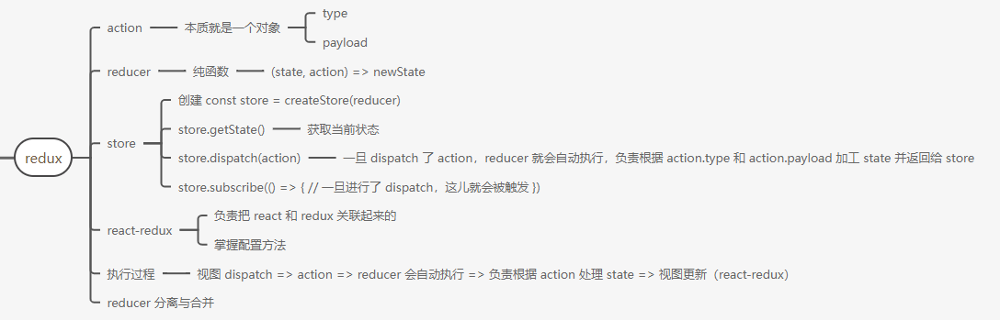
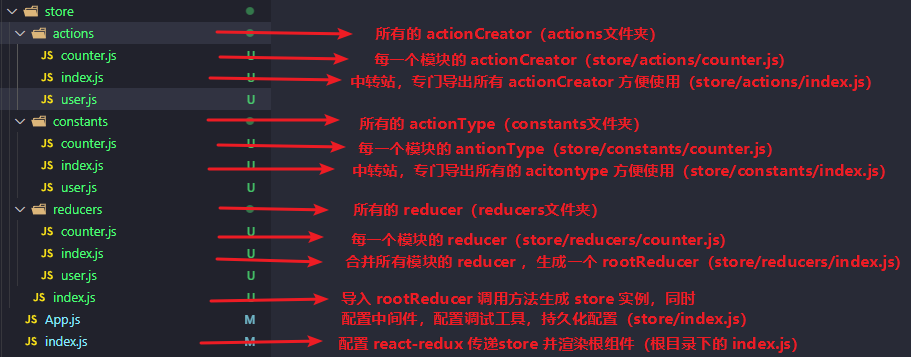

# 1. Redux 介绍

 [Redux 中文官网](http://cn.redux.js.org/)，[中文文档](https://www.redux.org.cn/)

## 1.1. Redux是什么

Redux 是一个全局状态管理的 JS 库（作用类似于Vuex）

和js绑定，在 Vue 中也可以用。不像Vuex只能在Vue中使用。当然还有其他的状态管理库，redux 占70%左右，作者是 **Dan Abramov**

1. React 的定位只是一个用来构建用户界面的库，并不是 Web 应用的完整解决方案。因此 React 在涉及到复杂组件之间的通信时会比较棘手，而对于大型项目来说，这方面恰恰是最关键的，因此只用 React 写大型项目会比较吃力。

2. 2014 年 Facebook 提出了 [Flux](http://www.ruanyifeng.com/blog/2016/01/flux.html) 架构的概念，引发了很多的实现。

3. 2015 年，Redux 出现，将 Flux 与函数式编程（Reducer）结合一起，很短时间内就成为了最热门的前端状态管理库，类似的还有 Mobx、Saga 等状态管理工具

## 1.2. 为什么要使用Redux

不使用 Redux

* 只能使用父子组件通讯、状态提升等 React 自带机制，远房亲戚（非父子）关系的组件通讯时乏力

* 组件之间的数据流混乱，出现 Bug 时难定位

使用 Redux

* **集中式存储和管理应用的状态**，处理组件通讯问题时，无视组件之间的层级关系

* **简化复杂应用中的数据传递问题**，数据流清晰，易于定位 Bug

## 1.3. Redux安装

直接安装npm包即可

```bash
npm i redux
// yarn add redux
```

# 2. Redux 核心概念



[阮一峰老师Redux教程（强烈推荐）](https://www.ruanyifeng.com/blog/2016/09/redux_tutorial_part_one_basic_usages.html)

为了让代码各部分职责清晰、明确，Redux 提出三个核心概念，需要我们写代码的时候遵守

* **action**（动作）：描述要做的事情（要干啥）

* **reducer**（函数）：更新状态（怎么干）

* **store**（仓库）：整合 action 和 reducer（谁来指挥）

**通过例子来理解三个核心概念（上班这件事来模拟 redux 的工作流程）**

* action：相当于公司里面要做的事情，比如打扫卫生这个事等

* reducer：相当于公司的员工，负责执行

* store：相当于公司的老板

流程：老板（store）分配（dispatch）要做的事情（action）给员工（reducer），员工干完活把结果交给老板

在视图当中，通过 store dispatch 一个 action，reducer 会自动收到通知来更新 state，state 一旦变化，说有使用 state 的视图自然就变了

## 2.1. action与actionCreator

action 用来描述要做的事情，项目中的每一个功能都是一个 action

* 计数器案例：计数器加 1、减 1。

* todomvc 案例：添加任务、删除任务等。

* 项目：登录，退出等

特点如下：

* 只描述做什么

* 本质上就是一个 JS 对象，必须带有 `type` 属性，用于区分动作的类型

* 可以通过 payload 携带额外的数据

`store/actions/counter.js`

```js
// 减 5 的一个action
export const decrement = {
  // 习惯大写，以后写成常量，与变量区分开
  type: "DECREMENT",
  payload: 5,
}

// 加 3 的一个action
export const increment = {
  type: "INCREMENT",
  payload: 3,
} 
```

使用函数（actionCreator）去创建一个 action

1. 问题：直接使用对象来创建 action 不灵活，参数写死了
2. 解决：可以使用函数来创建 action，通过传参把不一样的数据传递过去就好了，我们把这个创建 action 的函数叫做 actionCreator
3. 返回值：返回一个 action 对象
4. 好处：代码更加简洁，容易复用

```js
// 上面写成对象的话，payload 是写死的，每次改变都要重新写一个 action
// 解决：使用函数，payload 用参数传进去，返回一个 action 对象

// 专业术语：定义一个 actionCreator => 创建 action => 接收 payload => 返回值就是 action
export const decrement = payload => ({
  type: "DECREMENT",
  payload,
})
export const increment = payload => ({
  type: "INCREMENT",
  payload,
})

```

> 每一个 action 都要使用按需导出，到时候 dispatch 哪个就导入哪个

## 2.2. reducer

### 2.2.1. 介绍一下纯函数

纯函数是[阮一峰老师函数式编程](http://www.ruanyifeng.com/blog/2012/04/functional_programming.html)中的概念，对于纯函数来说有一个很重要的特点：**相同的输入总是得到相同的输出**。

纯函数常具有以下特点

* 不得改写参数（不要直接修改传入的参数，状态的不可变性），不能使用全局变量（防止别的地方改变了该变量，导致函数的返回值发生了变化）

* 不能调用 Date.now() 或者 Math.random() 等不纯的方法，因为每次会得到不一样的结果

* 不包含副作用的处理，副作用：AJAX 请求、操作本地数据、或者操作函数外部的变量等

好处：代码简洁、方便测试、方便性能优化

纯（也可以理解为主作用）和副作用本来就是对立的

举几个纯函数的例子

```js
// 1 是
const add = (a, b) => a + b
add(1, 2)

// 2 不是
const add = (a, b) => a + b + Math.random()
add(1, 2)
add(1, 2)

// 3.是（slice不改变原数组）
const arr = [1, 2, 3, 4, 5]
arr.slice(1, 2)
arr.slice(1, 2)
arr.slice(1, 2)

// 4. 不是（改变了原数组，每次的结果不一样）
const arr = [1, 2, 3, 4, 5]
arr.splice(1, 2)
arr.splice(1, 2)
```

### 2.2.2. reducer使用

reducer：本质上是一个纯函数，作用是根据 action 来更新状态，有如下特点

* 函数签名（ts 中的概念）为：`(prevState, action) => newState`
* 接收上一次的状态和 action，根据 action 的类型执行对应的操作，最终返回新的状态
* 原则：不要在 reducer 函数内部直接修改 state

```js
// reducer 是一个函数，负责根据 action 的类型和 payload 返回相应的 state
// 注意不要直接修改 state 的值

// 默认导出，只能有一个reducer
// 这里的 state = 10 表示一个初始的状态
export default function counter(state = 10, action) {
  // 使用 if-else 也可以，return state 的新值就可以
  switch (action.type) {
    case "INCREMENT":
      // return 必须有（直接结束整个函数）用 break 是结束 switch 语句，不然直接过渡到下一个 case
      return state + action.payload
    case "DECREMENT":
      return state - action.payload
    default:
      return state
  }
}

// switch case 用的更多，也可以使用 if - return
export default function todo(state = initState, action) {
    if (action.type === TODO_DEL) {
        return state.filter((item) => item.id !== action.id)
    }
    if (action.type === TODO_CHANGESTATUS) {
        return state.map((item) => {
            if (item.id === action.id) {
                return {
                    ...item,
                    done: !item.done,
                }
            } else {
                return item
            }
        })
    }
    return state
}
```

> **reducer 需要默认导出是一个函数，创建 store 实例的参数使用**

## 2.3. store

Store：仓库，是 Redux 的核心，负责整合 Action 和 Reducer

**一个应用只有一个 Store**

* 创建：`const store = createStore(reducer)`（参数是reducer默认导出的函数）

* 获取数据：`store.getState()`（只能获取快照）

* 更新数据：`store.dispatch(action)`（参数是每一个按需导出的actionCreator）

其他 API

* 订阅（监听）状态变化：`const unSubscribe = store.subscribe(() => {})`，注意要**先**订阅，后续的更新才能被观测到

* 取消订阅状态变化：`unSubscribe()`

项目根目录下的`index.js`

```js
import ReactDOM from "react-dom/client"

import App from "./App"
// 先导入一下，目的是为了执行 store 里面的代码，同时拿到 store 实例
import { store } from "./store"

// 这样写的话，每次 redux 的数据被 dispatch 改变了，视图不会更新，是正常的
// ReactDOM.createRoot(document.querySelector("#root")).render(<App />)

// 这个必须写在上面
// 可以下面这样写，但是这样写，每次触发就会渲染整个组件，性能不好，以后会有处理方法
store.subscribe(() => {
  root.render(<App store={store} />)
})

const root = ReactDOM.createRoot(document.querySelector("#root"))
root.render(<App store={store} />)
```

`store/index.js`

```js
import { legacy_createStore as createStore } from "redux"
import { decrement, increment } from "./actions/counter"
import counterReducer from "./reducers/counter"

// 创建 store 仓库，参数是自定义的 reducer （默认导出的）
// 返回 store 实例
export const store = createStore(counterReducer)

// 输出当前的状态
console.log(store.getState()) // 10

// dispatch 派发 action 去调用 reducer 修改 state
/* store.dispatch({ type: "INCREMENT", payload: 3 })
console.log(store.getState()) //13

store.dispatch({ type: "DECREMENT", payload: 2 })
console.log(store.getState()) //11 */

// 有没有办法监听派发的 action，监听到后执行对应的回调
// subscribe 要放到 dispatch 的前面

const unSubscribe = store.subscribe(() => {
  // 每次 dispatch 这里都会走
  console.log(store.getState())
})

// 取消监听/订阅
// unSubscribe()

// 简化：使用 actionCreator 来创建 action
store.dispatch(increment(3))
// console.log(store.getState()) //13

store.dispatch(decrement(2))
// console.log(store.getState()) //11

// 每次这样就很麻烦，每次都要 getState 拿到新的 state
// 有没有办法监听派发的 action，监听到后执行对应的回调
// subscribe 要放到 dispatch 的前面

```

小问题


## 2.4. 小案例-点击计数

```js
// index.js把值传过去，并监听数据的变化后，重新渲染组件
// 这个必须写在上面
store.subscribe(() => {
  root.render(<App store={store} />)
})

// 可以下面这样写，但是这样写，每次触发就会渲染整个组件，性能不好，以后会有处理方法
const root = ReactDOM.createRoot(document.querySelector("#root"))
root.render(<App store={store} />)


// App.js
import React from "react"
import { decrement, increment } from "./store/actions/counter"

export default function App({ store }) {
  return (
    <div>
      <h2>{store.getState()}</h2>
      <button onClick={() => store.dispatch(increment(2))}>+2</button>
      <button onClick={() => store.dispatch(increment(3))}>+3</button>
      <button onClick={() => store.dispatch(increment(5))}>+5</button>
      <button onClick={() => store.dispatch(decrement(1))}>-1</button>
      <button onClick={() => store.dispatch(decrement(4))}>+4</button>
    </div>
  )
}
```

# 3. Redux 执行流程

## 3.1. 初始状态

初始状态存放在 reducers 文件夹中的某个文件中

刚开始从redux 中拿到所有的 state ，react-redux 帮忙处理了，当dispatch了之后，视图自动变化


## 3.2. 修改 redux 里的状态

操作 redux 里面的数据永远会涉及到四个文件

常爱瑞组：很优秀 

**常（constant 常量）爱（action）瑞（reducer）组（组件）**


## 3.3. redux 执行流程

只要创建 store，Redux 内部就会调用一次 reducer（所有模块中的 reducer 都会默认执行，之后需要 combineReducers）。类似：`reducer(undefined, {type: "@@redux/INITv.a.4.t.t.p"})`。这一次调用 reducer 的目的：**获取状态的默认值**

原因：传入的状态值是 undefined ，并且是一个随机的 action type

* 状态值因为 undefined，所以，我们设置的默认值就会生效，比如，此处的：10
* 因为是一个随机的 action type，所以，reducer 中 switch 一定无法命中，那就一定会走 default，也就是直接返回了状态的默认值，也就是：10

Redux 内部拿到这个数据（比如此处的 10）以后，就用这个数据作为了 store 中的最新状态值

当我们调用 `store.getState()` 方法来获取 Redux 状态值的时候，拿到的就是 10 了

> 注意这里的括号里的 10 用来初始化（是别的对象可以抽离出来），下面的 default 用来 dispatch （或者初始）的时候匹配不上，return 的当前的状态。缺一不可

```js
export default function counter(state = 10, action) {
  // 使用 if-else 也可以，return state 的新值就可以
  switch (action.type) {
    case COUNTER_INCREMENT:
      // return 必须有（直接结束整个函数）用 break 是结束 switch 语句，不然直接过渡到下一个 case
      return state + action.payload
    case COUNTER_DECREMENT:
      return state - action.payload
    default:
      return state
  }
}
```

点击按钮（调用 dispatch）的执行流程

1. 点击按钮，派发动作 `store.dispatch(action)`
2. 只要触发了 action（根据 type 找到对应的 case），Redux 内部就会自动调用 reducer（多个模块，可以理解为合并之后的reducer）
   根据上一次的状态（由 redux 内部传递给 reducer 的第一个参数）和 action （由 redux 内部传递给 reducer 的第二个参数）计算出新的状态并返回
3. reducer 执行完毕后，将最新的状态交给 store，store 用最新的状态替换旧状态，状态更新完毕（通过`store.getState()`或者`useSelector()`拿到当前的状态快照）

# 4. react-redux

## 4.1. react-redux介绍

之前修改了redux的值，但是视图不会自动更新需要自己手动重新渲染

```js
// 这样写的话，每次 redux 的数据被 dispatch 改变了，视图不会更新，是正常的
// ReactDOM.createRoot(document.querySelector("#root")).render(<App />)

// 解决：手动重新渲染
// 这个必须写在上面
store.subscribe(() => {
  root.render(<App store={store} />)
}) 
ReactDOM.createRoot(document.querySelector("#root")).render(<App />)
```

**现在借助 react-redux 这个库实现状态改变，视图自动更新**

React 和 Redux 是两个独立的库，两者之间职责独立，因此，为了更好的实现在 React 中使用 Redux 进行状态管理，就需要一种机制，将这两个独立的库关联在一起

> react-redux 是 Redux 官方提供的 React 绑定库

使用步骤

1. 安装 npm 包

   ```bash
   npm i react-redux
   ```

2. 配置根目录 index.js

   ```js
   import ReactDOM from 'react-dom'
   import App from './App.js'
   import store from './store/store.js'
   import { Provider } from 'react-redux'
   
   // 通过 Provider 提供 store 供其他组件内部使用
   const root = ReactDOM.createRoot(document.querySelector("#root"))
   root.render(
       <Provider store={store}>
           <App />
       </Provider>
   )
   
   // 用了 react-redux 下面手动触发更新的方式就没用了
   /* store.subscribe(() => {
       root.render(<App />, document.querySelector('#root'))
   }) */
   ```

## 4.2. 使用新的 api

 **一旦使用了 react-redux，获取和更新数据的方式就变化了，要按照这个库的要求来**

### 4.2.1. useSelector

* `react-redux` 这个库提供了 useSelector，作用：从 store 中获取状态。
* selector 函数应该是个纯函数

```js
import React from 'react'
import { useSelector } from 'react-redux'
const App = () => {
    // 可以在selector函数里写一些逻辑，
    // 函数的参数 state 表示 redux 的整个状态（注意是所有的状态），这儿又把 state 进行了返回

    // useSelector 里面的回调返回什么，useSelector 就返回什么        
    const count = useSelector((state) => state)
    // 这里返回 { xxx:11, yyy:{name:'张三', age:20} }    
    
    // 拿到 count 两种写法
  // 写法一    
  // const count = useSelector(state => state.counter)
    
  // 写法二 解构        
  const {
    counter: count,
    user: { name, age },
  } = useSelector(state => state)        
    return (
        <div>
            <h3>{count}</h3>
        </div>
    )
}
export default App
```

返回的整个 state 对象的来源`store/reducers/index.js`，使用 useSelector 获取最新状态，把下面的 reducer 解析成了状态（状态变化，这里会获取到最新的状态数据，同时视图也会同步更新）

```js
// reducer 的拆分和合并
// 导入两个模块中的 reducer
import counter from "./counter"
import user from "./user"
import { combineReducers } from "redux"

// 这里的键名就是 useSelector 返回的 state 中的键名，
// export default combineReducers({ xxx: counter, yyy: user })

// 还是推荐键名和 value 一样

export default combineReducers({ counter, user })

```

### 4.2.2. useDispatch

得到 dispatch 来触发 action（触发 action 会执行 reducer（combineReducers 合并之后的 reducer），reducer 负责数据的修改，react-redux 内部会监听数据的变化自动进行视图更新）

```js
import React from 'react'
import { useSelector, useDispatch } from 'react-redux'
import { increment, decrement } from './store/actions'
const App = () => {
    const count = useSelector((state) => state)
    // 这个的作用就相当于之前的 store.dispatch(action)
    const dispatch = useDispatch()
    return (
        <div>
            <h3>{count}</h3>
            <div>
                <button onClick={() => dispatch(increment(1))}>+1</button>
                <button onClick={() => dispatch(increment(5))}>+5</button>
                <button onClick={() => dispatch(decrement(1))}>-1</button>
                <button onClick={() => dispatch(decrement(5))}>-5</button>
            </div>
        </div>
    )
}
export default App
```

# 5. Reducer 的分离与合并

## 5.1. 为什么需要 reduer 的分离和合并

随着项目功能变得越来越复杂，需要 Redux 管理的状态也会越来越多，此时，有两种方式来处理状态的更新

1. 使用一个 reducer，处理项目中所有状态

2. 使用多个 reducer，按照项目功能划分，每一个 reducer 处理该功能的状态

推荐：使用第二种方案，每个 reducer 处理单一功能的状态，职责更明确。第二种方案，由于 store 只能接受一个 reducer，需要将多个 reducer 合并成一个 reducer，使用 redux 官方提供的 api  `combineReducers({ counter： counterReducer, user： userReducer })` 函数（这里取的键名就是以后所有状态的 state 对象中各个 reducer 状态的属性名，例如`{counter: 3, user: {name: "张三", age: 23}}`）

注意点：

每个 reducer 应该只关注自己的数据，例如：

* 登录功能：`loginReducer` 处理的只应该是跟登录相关的状态。
* 个人资料：`profileReducer` 处理的只应该是跟个人资料相关的状态。
* 文章列表、文章详情、文章评论等

> 每一个 reducer 的函数名都和模块名相同即可，并且 reducer 的函数名只在combineReducers 起作用

## 5.2. 具体步骤

1. 新建`counter.js`和`user.js`两个 reducer 模块
2. 新建`reducers/index.js`，使用 combineReducers 方法将两个 reducer 合并并导出
3. 在`store/index.js`中导入合并后的 reducer （也是一个函数）创建 store 实例
4. 在组件中获取或者修改状态

具体操作如下

1. counter.js和user.js（一个模块只有一个 reducer 直接默认导出）

```js
// counter.js
// reducer 是一个函数，负责根据 action 的类型和 payload 返回相应的 state
// 注意不要直接修改 state 的值

import { COUNTER_DECREMENT, COUNTER_INCREMENT } from "../constants"

// 默认导出，只能有一个reducer
// 这里的 state = 10 表示一个初始的状态
export default function counter(state = 10, action) {
  // 使用 if-else 也可以，return state 的新值就可以
  switch (action.type) {
    case COUNTER_INCREMENT:
      // return 必须有（直接结束整个函数）用 break 是结束 switch 语句，不然直接过渡到下一个 case
      return state + action.payload
    case COUNTER_DECREMENT:
      return state - action.payload
    default:
      return state
  }
}


// user.js
import { USER_UPDATE_AGE, USER_UPDATE_NAME } from "../constants"

// 一般是 key 和 value 保持一致
export default function user(preState = { name: "张三", age: 20 }, action) {
  switch (action.type) {
    case USER_UPDATE_NAME:
      return {
        ...preState,
        name: action.payload,
      }
    // 这里直接写常量的话，万一突然写错了，dispatch 就不会命中，返回默认值，多个地方使用到常量使用 constants 文件来统一管理
    // case "UPDATE_AGEa":
    case USER_UPDATE_AGE:
      return {
        ...preState,
        age: action.payload,
      }
    default:
      return preState
  }
}
```

2. reducers/index.js（因为只有一个直接默认导出）

```js
// reducer 的拆分和合并
import counter from "./counter"
import user from "./user"
import { combineReducers } from "redux"

// 这里的键名就是 useSelector 返回的 state 中的键名，
// export default combineReducers({ xxx: counter, yyy: user })

// 还是推荐键名和 value 一样

export default combineReducers({ counter, user })
```

3. store/index.js

```js
import { legacy_createStore as createStore } from "redux"
import rootReducer from "./reducers"

// 导入合并之后的 combineReducer
export const store = createStore(rootReducer)
```

4. App.js 使用（这里使用了 react-redux 才需要使用到 useSelector 和 useDispatch）

```js
  // 二、获取数据的方式发生了变化
  // useSelector 接收一个函数作为参数
  // 函数的参数 state 表示 redux 的整个状态（注意是所有的状态），这儿又把 state 进行了返回

  // useSelector 里面的回调返回什么，useSelector 就返回什么

  // 这里返回 { xxx:11, yyy:{name:'张三', age:20} }
  // 因为在 index.js 中 dispatch 了，改变了原值，这里拿到的和初始值不同
  // const state = useSelector(state => state)
  // console.log(state)

  // 拿到 count 两种写法
  // 方式一 直接拿
  // const count = useSelector(state => state.counter)
  // 方式二 解构
  const {
    counter: count,
    user: { name, age },
  } = useSelector(state => state)

  // console.log(count)
  // 派发后，reducer 执行，视图会自动更新
  const dispatch = useDispatch()
```

# 6. ActionsTypes

## 6.1. 为什么需要ActionTypes

同一个 type 会在不同文件中多次被用到，比如 actions.js、reducers.js 等（action 和 reducer 中都会用到）

问题：某一个 type 在某个文件中写错了，无法命中，就返回 default，但是这样页面没有任何错误提示，对开发不便

解决：集中处理 action type，保持一致性，容易维护（把相同的 action type 提取为一个变量放在 constants 或者叫 actionTypes文件夹中统一管理）

## 6.2. 具体步骤

1. 在 store 目录中创建 `actionTypes.js` 或 `constants.js` 文件
2. 使用常量创建 ActionType 并导出
3. 命名推荐：`模块_动作`，比如：
   * 计数器：`COUNTER_INCREMENT` 表示计数器模块中的 INCREMENT 动作
   * TodoList：`TODOLIST_ADD` 表示 TodoList 案例中 ADD 动作
   * 登录：`LOGIN_GETCODE` 表示登录模块中获取验证码的动作，`LOGIN_SUBMIT` 表示登录模块中的提交功能
   * 个人信息：`PROFILE_GETINFO` 表示个人资料模块中的获取信息动作；`PROFILE_UPDATEINFO` 等
4. 哪里需要用到就按需导入

```js
// counter.js
export const COUNTER_INCREMENT = "COUNTER_INCREMENT"
export const COUNTER_DECREMENT = "COUNTER_DECREMENT"

// use.js
export const USER_UPDATE_NAME = "USER_UPDATE_NAME"
export const USER_UPDATE_AGE = "USER_UPDATE_AGE"

// index.js
// 导入并导出
// 常量不多的话，就不用分模块，前面前缀习惯加上模块名
export { COUNTER_DECREMENT, COUNTER_INCREMENT } from "./counter"
export { USER_UPDATE_AGE, USER_UPDATE_NAME } from "./user"

// 这样所有需要的直接 import { xx } from "./constants" 
```

# 7. redux 文件目录的最佳实践

注意点：

* store文件夹下创建`actions`、`constants`、`reducers`文件夹
* 相同的模块名在几个文件夹中都保持一致的文件名
* `reduers/index.js`中需要调用`combineReducers({counter, user})`方法来合并所有模块的 reduer 并默认导出

> 当项目大了之后都需要像下面这种文件目录，如果是小项目就不太需要分文件模块，直接放在对应文件夹的 index.js 中即可



补充一下 actions 文件夹（现在都用 actionCreator ）的结构（第5第6有了 reduers 文件夹和 constants 文件夹）

```js
// counter.js
// 减 5 的一个action
/* export const decrement = {
  // 习惯大写，以后写成常量，与变量区分开
  type: "DECREMENT",
  payload: 5,
}

// 加 3 的一个action
export const increment = {
  type: "INCREMENT",
  payload: 3,
} */

import { COUNTER_DECREMENT, COUNTER_INCREMENT } from "../constants"

// 上面写成对象的话，payload 是写死的，每次改变都要重新写一个 action
// 解决：使用函数，payload 用参数传进去，返回一个 action 对象

// 专业术语：定义一个 actionCreator => 创建 action => 接收 payload => 返回值就是 action
export const decrement = payload => ({
  type: COUNTER_DECREMENT,
  payload,
})
export const increment = payload => ({
  type: COUNTER_INCREMENT,
  payload,
})

// actions/index.js
// 中转一下，更加清楚，import 直接在 index.js 里面导入
export { decrement, increment } from "./counter"
export { updateAge, updateName } from "./user"

```

# 8. TodoList

## 8.0. 注意点

1. 操作 redux 状态的四部曲

常（定义常量）爱（action）瑞（reducer）组（组件里派发action）

> redux 的执行流程：说的时候倒过来说，从视图开始说，先dispatch 派发一个 action，redux 内部会自动执行 reducer


2. filter 是保留的意思

3. 在 dispatch 的时候 action 和 reducer 产生了关联

4. reducer 是一个纯函数，可以把不纯的当做 action 参数的实参（可以传多个参数，最好语义化不叫 payload）传进去

   ```js
   export const todoAdd = name => ({
     type: TODO_ADD,
     // action 可以传多个参数，reducer 中必须是纯函数，可以把不纯的当做action传进去
     // 这些也可以在组件里面传
     name,
     id: Date.now(),
     done: false,
   })
   ```

5. 下面两种写法并不是等价的，抽离在上面的函数存在局部作用域的问题，不能使用下面 jsx 的变量，如果要使用，必须由下面 jsx 中在外面套一个箭头函数，传参传到上面。下面两种方式都可以拿到事件对象
   逻辑较多时，就需要抽离出来写在上面，jsx 里面的参数就需要传参传到上面

   

6. 注意以下几种写法

   ```js
   // 1.抽离出来写在上面，想要使用循环的item 因为局部作用域，必须要传过去，上面下面等价
   const handleClick=(item)=>{
       dispatch(filterChangeActive(item))
     }
   <button className="clear-completed" onClick={（）=>{handleClick(item)}}>Clear completed</button>
   
   
   /// 2.写在下面，可以直接使用循环里面的item
   <button className="clear-completed" onClick={() => { dispatch(todoClearComplete(item))}}>Clear completed</button>
   
   
   // 3.下面不写参数，上面传参就是事件对象
   const handleClick = (e)=>{
       console.log(e)//事件对象
   }
   <button onClick={handleClick}></button>
   
   // 4. 直接在下面使用事件对象也可以
   <button onClick={(e) => {seName(e)}}></button>
   
   //5.上面传了参数，上面需要使用事件对象
   const handleClick =(id, name, e)=>{
       console.log(e)//事件对象
   }
   <button onClick=(e)=>{handleClick(item.id, item.name, e)}></button>
   ```

7. 表单加了checked或value就变换成了受控表单，需要添加onChange 事件。checked 或 value 与绑定的变量并不是双向绑定的，这里的isSelected是根据原本的状态计算而来的，不需要额外定义成状态，同时注意，点击的时候先触发change事件，同步 redux中的数据，在change事件处理函数中执行，之后isSelectedAll的值就变了（是因为状态变了，重新计算）

   * 这里 checked 绑定了转态的计算值 isSelected 也是受控的（开发中都是受控的，非受控就是没有checked或value属性，用ref来获取表单dom对象，来获取表单的value）
   * 绑定一个布尔值 true，一直是选中，单击无法更改（隐式转换成布尔值，一直是那个状态，也无法切换）
   * 没有设置checed 属性或者 value 属性，表单不受控，任意单击切换（用ref来获取表单dom对象，来获取表单的value）

   > 始终记住，表单受控，必须结合 onChange 事件去改变状态后（使用事件对象拿到e.target.value为当前的最新状态，或者直接去拿到value或checked绑定的上一个状态，取反传值去修改状态），表单的视图才会同步更新
   >
   > ```js
   > // 1. 拿到上一次的状态
   > <input
   >         id="toggle-all"
   >         className="toggle-all"
   >         type="checkbox"
   >         checked={isSelectedAll}
   >         onChange={() => {
   >           // console.log(isSelectedAll)
   >           // 代码先走这里，值还没变，change 事件执行完毕后，isSelectedAll 取了反，还没改变取反把这个值传到reducer 中去修改
   >           dispatch(todoChangeSingleStatus(!isSelectedAll))
   >         }}
   >       />
   > 
   > // 2. 使用事件对象拿到最新的状态
   > <input
   >         className="edit"
   >         // value={item.name}
   >         // onChange={() => {}}
   >         // 这样直接使用 item.name 相当于是边输入边改变，不希望这样，希望按回车后改变，需要自定义状态
   >         value={name}
   > 		// 这里拿到的 name 只能是上一次的状态
   >         onChange={e => setName(e.target.value)}
   >         ref={inputRef}
   >         onBlur={handleBlur}
   >         onKeyUp={handleKeyUp}
   >       />
   > ```

   

8. 给表单的value或者checked绑定了状态，改都改不了，输也输不了，因为表单受控了（和vue 和 原生js也不一样）必须通过onChange事件修改了状态（通过 e.target.value）才能变化。如果value或者checked绑定的不是状态，就可以切换
   

9. 类组件中 setState 第二个参数可以获取 dom 更新渲染后的数据，函数组件中的 setXxx 不能传递第二个参数来获取更新后的数据，使用 useEffect 获取

10. redux 用来放一些共享数据，私有数据放在组件里就可以了（如果需要视图同步更新，需要自己定义一个状态），如果是根据别的状态计算来的数据，就不需要自己定义状态了，也会触发视图同步更新

    ```js
    // 组件里的数据分为三种情况
    // 1. 普通数据，不涉及到视图更新的，不用定义状态，
    let null
    let timer =setTimeout(()=>{},1000)
    useEffect(()=>{
        return ()=>{
            clearTimeout(timer)
        }
    })
    
    // 2. 根据别的状态计算而来的，就不用额外定义状态，状态变了，视图也会自动更新
     const activeLength = todo.filter(item => !item.done).length
     
     // 3.需要自己额外定义组件内的状态
       // 自定义一个编辑框的状态
      const [name, setName] = useState("")
      <input
            className="edit"
            // value={item.name}
            // onChange={() => {}}
            // 这样直接使用 item.name 相当于是边输入边改变，不希望这样，希望按回车后改变，需要自定义状态
            value={name}
            onChange={e => setName(e.target.value)}
            ref={inputRef}
            onBlur={handleBlur}
            onKeyUp={handleKeyUp}
          />
    ```

11. 组件jsx外面必须要套一个父标签，大括号外面

    ```js
    return (
        // 括号里面不允许直接表达式，在外面套一个空标签
        <>
          {todo.length > 0 ? (
            <footer className="footer">
              // ...
            </footer>
          ) : null}
        </>
    )
    ```

    

## 8.1. 准备

需要拆分组件并创建 redux 初始基本结构

## 8.2. 列表渲染

初始数据需要放在 reducer 中，来设置状态的初始值，在 reducer 里面直接放回原数据，先供页面渲染（只要创建 store，Redux 内部就会调用一次 reducer 然后 store 仓库拿到初始状态，可以通过 store.getState()查看状态快照）

> 初始状态不知道些什么就直接写一个空对象`{}`，这样可扩展性高

```js
const initState = {
  active: "All",
  arr: ["All", "Active", "Complete"],
}
export default function filter(prevState = initState, action) {
  return prevState
}
```

步骤

1. 在 `store/reducers/todo.js` 文件中准备初始数据
2. 在 `components/TodoMain.js` 文件中通过 useSelector 获取数据并渲染

`store/reducers/todo.js`

```js
const initState = [
    {
        id: 1,
        name: '吃饭',
        done: true,
    },
    {
        id: 2,
        name: '睡觉',
        done: false,
    },
]

// 这里的参数 state 每次都是由 react 内部传的上一个状态，也可以用参数 prevState 代替
export default function todo(state = initState, action) {
    // 初始时，不知道定义什么 case ，直接return state，啥都不写，不知道干嘛，先返回一个默认的 state
  // return prevState
    return state
}
```

`components/TodoMain.js`（这里的 li 是要抽离成组件的，为什么后面再说）

```js
import React from 'react'
import { useSelector } from 'react-redux'

export default function TodoMain() {
    const list = useSelector((state) => state.todo)
    return (
        <section className='main'>
            <input id='toggle-all' className='toggle-all' type='checkbox' />
            <label htmlFor='toggle-all'>Mark all as complete</label>
            <ul className='todo-list'>
                {list.map((item) => (
                    <li key={item.id} className={item.done ? 'completed' : ''}>
                        <div className='view'>
                            <input className='toggle' type='checkbox' checked={item.done} onChange={() => {}} />
                            <label>{item.name}</label>
                            <button className='destroy'></button>
                        </div>
                        <input className='edit' value='Create a TodoMVC template' />
                    </li>
                ))}
            </ul>
        </section>
    )
}
```

## 8.3. 删除功能

1. 在 `store/constants/todo.js` 文件中新建删除的 ActionType
2. 在 `store/actions/todo.js` 文件中创建删除的 actionCreator
3. 在 `store/reducers/todo.js` 文件中编写删除的 reducer
4. 在 `components/TodoMain.js` 组件中通过 dispatch action 进行删除的操作

具体步骤

1. `store/constants/todo.js`

```js
export const TODO_DELETE = "TODO_DELETE"
```

2. `store/actions/todo.js`

```js
import {
  TODO_DELETE,
} from "../constants"

export const todoDel = id => ({
  // 这里的参数可以更加的语义化，直接用id
  type: TODO_DELETE,
  id,
})
```

3. `store/reducers/todo.js`

```js
import {
  TODO_DELETE,
} from "../constants"

const initState = [
  {
    id: 1,
    name: "吃饭",
    done: true,
  },
  {
    id: 2,
    name: "睡觉",
    done: false,
  },
]

// 状态的初始值不知道些什么的时候就写一个对象
export default function todo(prevState = initState, action) {
  switch (action.type) {
    // 删除
    case TODO_DELETE:
      return prevState.filter(item => item.id !== action.id)
    default:
      return prevState
  }
}

```

4. `components/TodoMain.js`

```js
import React from 'react'
import { useSelector, useDispatch } from 'react-redux'
import { changeStatus, delTodo } from '../store/actions/todo'

export default function TodoMain() {
    const list = useSelector((state) => state.todo)
    const dispatch = useDispatch()
    return (
        <section className='main'>
            <input id='toggle-all' className='toggle-all' type='checkbox' />
            <label htmlFor='toggle-all'>Mark all as complete</label>
            <ul className='todo-list'>
                {list.map((item) => (
                    <li key={item.id} className={item.done ? 'completed' : ''}>
                        <div className='view'>
                            <input className='toggle' type='checkbox' checked={item.done} onChange={() => dispatch(changeStatus(item.id))} />
                            <label>{item.name}</label>
						// 派发 action 传递参数过去
                            <button className='destroy' onClick={() => dispatch(delTodo(item.id))}></button>
                        </div>
                        <input className='edit' value='Create a TodoMVC template' />
                    </li>
                ))}
            </ul>
        </section>
    )
}
```

## 8.4. 修改任务状态（切换小选勾选状态）

修改某个 item 的某个属性需要使用 map `item.id === action.id ? { ...item, done: !item.done } : item`

1. 在 `store/constants/todo.js` 文件中创建修改任务状态的 ActionType。
2. 在 `store/actions/todo.js` 文件中创建修改任务状态的 actionCreator。
3. 在 `store/reducers/todo.js` 文件中编写修改任务状态的 reducer。
4. 在 `components/TodoMain.js` 组件中通过 dispatch action 进行修改任务状态的操作

具体步骤

1. `store/constants/todo.js`

```js
export const TODO_UPDATE_STATUS = "TODO_UPDATE_STATUS"
```

2. `store/actions/todo.js`

```js
import {
  TODO_CHANGE_SINGLE_STATUS,
} from "../constants"

export const todoUpdateStatus = id => ({
  type: TODO_UPDATE_STATUS,
  id,
})
```

3. `store/reducers/todo.js`

```js
import {
  TODO_UPDATE_STATUS,
} from "../constants"

const initState = [
  {
    id: 1,
    name: "吃饭",
    done: true,
  },
  {
    id: 2,
    name: "睡觉",
    done: false,
  },
]

// 状态的初始值不知道些什么的时候就写一个对象
export default function todo(prevState = initState, action) {
  // 啥都不写，不知道干嘛，先返回一个默认的 state
  // return prevState

  switch (action.type) {
    // 修改小选勾选状态
    // 每次要返回一个完整的 state 数组，每次 map 循环要返回一个完整的 item
    case TODO_UPDATE_STATUS:
      return prevState.map(item =>
        item.id === action.id ? { ...item, done: !item.done } : item
      )
    default:
      return prevState
  }
}

```

4. `components/TodoMain.js`

```js
import React from 'react'
import { useSelector, useDispatch } from 'react-redux'
import { changeStatus, delTodo } from '../store/actions/todo'

export default function TodoMain() {
    const list = useSelector((state) => state.todo)
    const dispatch = useDispatch()
    return (
        <section className='main'>
            <input id='toggle-all' className='toggle-all' type='checkbox' />
            <label htmlFor='toggle-all'>Mark all as complete</label>
            <ul className='todo-list'>
                {list.map((item) => (
                    <li key={item.id} className={item.done ? 'completed' : ''}>
                        <div className='view'>
                            // 派发 action 并传参
                            <input className='toggle' type='checkbox' checked={item.done} onChange={() => dispatch(changeStatus(item.id))} />
                            <label>{item.name}</label>
                            <button className='destroy' onClick={() => dispatch(delTodo(item.id))}></button>
                        </div>
                        <input className='edit' value='Create a TodoMVC template' />
                    </li>
                ))}
            </ul>
        </section>
    )
}
```

## 8.5. 添加任务

添加不用遍历，直接`[...prevState, newItem]`

1. 在 `store/constants/todo.js` 文件中创建添加任务的 ActionType。
2. 在 `store/actions/todo.js` 文件中创建添加任务的 actionCreator。
3. 在 `store/reducers/todo.js` 文件中编写添加任务的 reducer。
4. 在 `components/TodoHeader.js` 组件中通过 dispatch action 进行添加任务的操作，如果敲了回车，并且 name 不为空，才进行 dispatch，最后清空输入的内容

具体步骤

1. `store/constants/todo.js`

```js
export const TODO_ADD = 'TODO_ADD'
```

2. `store/actions/todo.js`

```js
import { TODO_ADD } from '../constants/todo'

export const todoAdd = name => ({
  type: TODO_ADD,
  // action 可以传多个参数，reducer 中必须是纯函数，可以把不纯的当做action传进去
  // 这些也可以在组件里面传
  name,
  id: Date.now(),
  done: false,
})
```

3. `store/reducers/todo.js`

```js
import {
  TODO_ADD,
} from "../constants"

const initState = [
  {
    id: 1,
    name: "吃饭",
    done: true,
  },
  {
    id: 2,
    name: "睡觉",
    done: false,
  },
]

// 状态的初始值不知道些什么的时候就写一个对象
export default function todo(prevState = initState, action) {
  switch (action.type) {
    // 添加
    case TODO_ADD:
      // 除去 type 其它的都要
      // case 这里直接写执行语句
      const { type, ...payload } = action
      return [payload, ...prevState]
    default:
      return prevState
  }
}

```

4. `components/TodoHeader.js`

```js
import React, { useState } from 'react'
import { useDispatch } from 'react-redux'
import { addTodo } from '../store/actions/todo'

export default function TodoHeader() {
    // 设置一个状态用来收集表单的输入值
    const [name, setName] = useState('')
    const dispatch = useDispatch()
    const add = (e) => {
        if (e.code === 'Enter') {
            if (!name) return alert('内容不能为空')
            dispatch(addTodo(name))
            setName('')
        }
    }
    return (
        <header className='header'>
            <h1>todo</h1>
            <input className='new-todo' placeholder='What needs to be done?' autoFocus value={name} onChange={(e) => setName(e.target.value)} onKeyUp={add} />
        </header>
    )
}
```

## 8.6. 全选功能（小选影响全选，全选影响小选）

这里的全选是根据所有的小选状态计算而来的，状态变化后，视图也会自动更新，不用再额外定义状态

表单加了checked 或 value 就变换成了受控表单，需要添加 onChange 事件。checked 或 value 与绑定的变量并不是双向绑定的，这里的isSelected是根据原本的状态计算而来的，不需要额外定义成状态，同时注意，点击的时候先触发change事件，同步 redux中的数据，在change事件处理函数中执行，之后isSelectedAll的值就变了（是因为状态变了，重新计算）

1. 在 `store/constants/todo.js` 文件中创建全选的 ActionType。
2. 在 `store/actions/todo.js` 文件中创建全选的 actionCreator。
3. 在 `store/reducers/todo.js` 文件中编写全选的 reducer。
4. 在 `components/TodoMain.js` 组件中通过 dispatch action 进行全选的操作（关键点：先拿到全选的状态，点击的时候对当前全选状态进行取反的操作

具体步骤

1. `store/constants/todo.js`

```js
export const TODO_CHANGE_SINGLE_STATUS = "TODO_CHANGE_SINGLE_STATUS"
```

2. `store/actions/todo.js`

```js
import {
  TODO_CHANGE_SINGLE_STATUS,
} from "../constants"


export const todoChangeSingleStatus = done => ({
  type: TODO_CHANGE_SINGLE_STATUS,
  done,
})
```

3. `store/reducers/todo.js`

```js
import {
  TODO_CHANGE_SINGLE_STATUS,
} from "../constants"

const initState = [
  {
    id: 1,
    name: "吃饭",
    done: true,
  },
  {
    id: 2,
    name: "睡觉",
    done: false,
  },
]

export default function todo(prevState = initState, action) {
  switch (action.type) {
    case TODO_CHANGE_SINGLE_STATUS:
      // 这里注意每次map 都要返回一个完整的 item 对象
      return prevState.map(item => ({ ...item, done: action.done }))
    default:
      return prevState
  }
}

```

4. `components/TodoMain.js`

```js
import React from 'react'
import { useSelector, useDispatch } from 'react-redux'
import { changeAll, changeStatus, delTodo } from '../store/actions/todo'

export default function TodoMain() {
    const list = useSelector((state) => state.todo)
    const dispatch = useDispatch()
    // 先拿到全选的状态
    const isCheckAll = list.every((item) => item.done)
    return (
        <section className='main'>
        	// 把拿到的当前的状态 isCheckAll 取反传递给 redux 修改各个小选的状态，然后 isCheckAll 根据修改后的小选状态重新计算，值改变，视图更新
            <input id='toggle-all' className='toggle-all' type='checkbox' checked={isCheckAll} onChange={() => dispatch(changeAll(!isCheckAll))} />
            <label htmlFor='toggle-all'>Mark all as complete</label>
            <ul className='todo-list'>
                {list.map((item) => (
                    <li key={item.id} className={item.done ? 'completed' : ''}>
                        <div className='view'>
                            <input className='toggle' type='checkbox' checked={item.done} onChange={() => dispatch(changeStatus(item.id))} />
                            <label>{item.name}</label>
                            <button className='destroy' onClick={() => dispatch(delTodo(item.id))}></button>
                        </div>
                        <input className='edit' value='Create a TodoMVC template' onChange={() => {}} />
                    </li>
                ))}
            </ul>
        </section>
    )
}
```

## 8.7. 编辑功能

需求

* 双击显示编辑框
* 自动获取焦点
* 数据回填
* 回车修改数据
* 细节：失去焦点编辑框消失，按 esc 编辑框消失，编辑框需要非空判断

是否显示编辑框取决于 li 上是否使用 editing class

这里考虑把 li 抽离为一个组件，不然使用 useRef 获取到的 dom ，只有最后一个

把编辑框里自定义一个状态，只有回车的时候才更新 redux 状态

TodoItem.js

```js
import classNames from "classnames"
import React, { useEffect, useRef, useState } from "react"
import { useDispatch } from "react-redux"
import {
  todoDel,
  todoUpdateName,
  todoUpdateStatus,
} from "../store/actions/todo"
// 把父组件的 item 直接传过来了
export default function TodoItem({ item }) {
  const dispatch = useDispatch()
  // 不把 li 抽离，循环创建的多个 input 都绑定了这个，最后一个覆盖了前面的，只能获取到最后一个 input dom
  const inputRef = useRef(null)

  // 自定义一个编辑框的状态
  const [name, setName] = useState("")

  // 定义一个 editId 用来显示每个的input
  const [editId, setEditId] = useState("")

  // 双击显示输入框
  const handleDoubleClick = (id, name) => {
    // 这个操作是异步的，需哟使用 useEffect 来获取
    // setEditId(id)

    // 这里希望数据回填
    // setName(name)

    handleEditIdAndName(id, name)
  }

  const handleBlur = () => {
    // setEditId("")
    // setName("")
    handleEditIdAndName("", item.name)
  }

  // 注意：这里上面的函数能直接使用 item 是因为父组件传了 item 过来
  // 处理回车和按 esc 的操作，回车需要操作 redux
  const handleKeyUp = e => {
    if (e.key === "Enter") {
      if (name.trim() === "") return
      dispatch(todoUpdateName(item.id, name))
      return handleEditIdAndName("", item.name)
    }
    if (e.key === "Escape") {
      return handleEditIdAndName("", item.name)
    }
  }
  // 封装一个方法
  const handleEditIdAndName = (id, name) => {
    setEditId(id)
    setName(name)
  }
  // 用来自动获取焦点
  useEffect(() => {
    // 刚开始希望不走
    if (editId === "") return
    inputRef.current.focus()
  }, [editId])

  return (
    <li
      className={classNames({
        completed: item.done,
      	// 这个类名决定是否显示编辑框
        editing: editId === item.id,
      })}
    >
      <div className="view">
        <input
          className="toggle"
          type="checkbox"
          checked={item.done}
          onChange={() => {
            // console.log(item.done)
            handleChangeStatus(item.id)
          }}
        />
        <label
          onDoubleClick={() => {
            handleDoubleClick(item.id, item.name)
          }}
        >
          {item.name}
        </label>
        <button className="destroy" onClick={() => handleDel(item.id)}></button>
      </div>
      <input
        className="edit"
        // value={item.name}
        // onChange={() => {}}
        // 这样直接使用 item.name 相当于是边输入边改变，不希望这样，希望按回车后改变，需要自定义状态
        value={name}
        onChange={e => setName(e.target.value)}
        ref={inputRef}
        onBlur={handleBlur}
        onKeyUp={handleKeyUp}
      />
    </li>
  )
}
```

## 8.8. 清空已完成并 统计剩余未完成数量

列表没有数据底部栏需要消失

1. `constants/todo.js`

```js
export const TODO_CLEAR_COMPLETE = "TODO_CLEAR_COMPLETE"
```

2. `actions/todo.js`

```js
import {
  TODO_CLEAR_COMPLETE,
} from "../constants"

export const todoClearComplete = () => ({
  type: TODO_CLEAR_COMPLETE,
})

```

3. `reducers/todo.js`

```js
import {
  TODO_CLEAR_COMPLETE,
} from "../constants"

const initState = [
  {
    id: 1,
    name: "吃饭",
    done: true,
  },
  {
    id: 2,
    name: "睡觉",
    done: false,
  },
]

export default function todo(prevState = initState, action) {
  switch (action.type) {
    case TODO_CLEAR_COMPLETE:
      return prevState.filter(item => !item.done)
    default:
      return prevState
  }
}

```

4. `components/TodoFooter.js`

```js
import React from "react"
import { useSelector, useDispatch } from "react-redux"
import { todoClearComplete } from "../store/actions/todo"
import classNames from "classnames"
export default function TodoFooter() {
  const {
    todo,
    filter: { active, arr },
  } = useSelector(state => state)
  const activeLength = todo.filter(item => !item.done).length
  const dispatch = useDispatch()

  return (
    // 括号里面不允许直接表达式，在外面套一个空标签
    <>
      // 数组有数据就显示，没有就不渲染
      {todo.length > 0 ? (
        <footer className="footer">
          <span className="todo-count">
       	  // 显示还未完成的任务
            <strong>{activeLength}</strong> item left
          </span>
          <ul className="filters">
            {arr.map((item, index) => (
              <li key={index}>
                <a
                  className={classNames({ selected: active === item })}
                  href="#/"
                  onClick={() => {handleClick(item)}}>
                  {item}
                </a>
              </li>
            ))}
          </ul>
          <button
            className="clear-completed"
            onClick={() => {
              // dispatch 中要是一个action对象 ，由actionCreator 调用得来
              dispatch(todoClearComplete())
            }}
          >
            Clear completed
          </button>
        </footer>
      ) : null}
    </>
  )
}
```

## 8.9. 点击高亮

这里要使用 filter 方法生成新数组，不能操作原数组，不然点了已完成后想回到所有回不去了

1. 在 store/constants/filter.js 文件中创建过滤的 ActionType。
2. 在 store/actions/filter.js 文件中创建过滤的 actionCreator。
3. 在 store/reducers/filter.js 文件中编写过滤的 reducer。
4. 在 store/reducers/index.js 引入 filter reducer。
5. 在 components/TodoFooter.js 组件中通过 dispatch action 进行过滤的操作

具体步骤

1. `constants/filter.js`

```js
export const FILTER_CHANGE_ACTIVE = "FILTER_CHANGE_ACTIVE"
```

2. `actions/filter.js`（这里加上异步操作）

```js
import { FILTER_CHANGE_ACTIVE } from "../constants"

export const filterChangeActiveAC = active => ({
  type: FILTER_CHANGE_ACTIVE,
  active,
})

// 需求：点击后两秒切换底部高亮状态
// active 直接这样写想完成异步操作，这样函数返回的是一个 undefined
/* export const updateActive = active => {
  setTimeout(() => {
    return {
      type: FILTER_CHANGE_ACTIVE,
      active,
    }
  })
} */
// 异步操作需要借助中间件来完成

// 所有的异步操作都需要返回一个函数，借助中间件来完成
export const filterChangeActive = active => {
  // 需要返回一个函数，返回函数的参数是 useDispatch 的 dispatch
  return dispatch => {
    // 函数里面写异步代码
    setTimeout(() => {
      // 这里还是需要写上 action 对象
      // 异步结果到达之后，再次 dispatch 触发 reducer 执行
      dispatch(filterChangeActiveAC(active))
    }, 2000)
  }
}
```

3. `reducers/filter.js`

```js
import { FILTER_CHANGE_ACTIVE } from "../constants"

const initState = {
  active: "All",
  arr: ["All", "Active", "Completed"],
}
export default function filter(prevState = initState, action) {
  switch (action.type) {
    case FILTER_CHANGE_ACTIVE:
      return { ...prevState, active: action.active }
    default:
      return prevState
  }
}

```

4. `reducers/index.js`

```js
import { combineReducers } from 'redux'
import todo from './todo'
import filter from './filter'
const rootReducer = combineReducers({
    todo,
    filter,
})

export default rootReducer
```

5. `components/TodoFooter.js`

```js
import React from "react"
import { useSelector, useDispatch } from "react-redux"
import { todoClearComplete } from "../store/actions/todo"
import { filterChangeActive } from "../store/actions/filter"
import classNames from "classnames"

export default function TodoFooter() {
  // 下面这样拿到的是所有的状态组成的数组
  // const list = useSelector(state => state)
  // console.log(list)
  const {
    todo,
    filter: { active, arr },
  } = useSelector(state => state)
  const activeLength = todo.filter(item => !item.done).length
  const dispatch = useDispatch()

  // 点击高亮
  // 1. Redux 中准备一个变量 active
  // 2. 用这个变量和循环时候的数据进行比较，如果一样就应用 selected class
  // 3. 点击的时候，只需要用当前点击的这一项去更新 Redux 中的那个变量 active
  const handleClick = item => {
    dispatch(filterChangeActive(item))
  }
  return (
    // 括号里面不允许直接表达式，在外面套一个空标签
    <>
      {todo.length > 0 ? (
        <footer className="footer">
          <span className="todo-count">
            <strong>{activeLength}</strong> item left
          </span>
          <ul className="filters">
            {arr.map((item, index) => (
              <li key={index}>
                <a
                  className={classNames({ selected: active === item })}
                  href="#/"
                  onClick={() => {handleClick(item)}}>
                  {item}
                </a>
              </li>
            ))}
          </ul>
          <button
            className="clear-completed"
            onClick={() => {
              // dispatch 中要是一个action对象 ，由actionCreator 调用得来
              dispatch(todoClearComplete())}}>
            Clear completed
          </button>
        </footer>
      ) : null}
    </>
  )
}

```

## 8.10. 切换数据

只需要根据定义的 active 的字段 把渲染数据的数组换成过滤后的数组即可

TodoMain.js

```js
const list = useSelector(state => {
    const active = state.filter.active
    // console.log(active)
    if (active === "Active") {
      return state.todo.filter(item => !item.done)
    }
    if (active === "Completed") {
      return state.todo.filter(item => item.done)
    }
    return state.todo
  })
```

## 8.11. redux 数据持久化

借助 redux-persisit 这里包来完成 [npm 官方网站](https://www.npmjs.com/package/redux-persist)

1. 下包

   ```bash
   yarn add redux-persist
   ```

2. 完成相关文件的配置

```js
// store/index.js
import { legacy_createStore, applyMiddleware } from "redux"
import rootReducer from "./reducers"
import thunk from "redux-thunk"
import promise from "redux-promise"
import { persistStore, persistReducer } from "redux-persist"// step1
import storage from "redux-persist/lib/storage"// step2

//step3
const persistConfig = {
    //localStorage 的键名
  key: "root",
  storage,
}

//step4
const persistedReducer = persistReducer(persistConfig, rootReducer)

// 导出
//step5
export const store = legacy_createStore(
  persistedReducer,
  applyMiddleware(thunk, promise)
)
//step6
export const persistor = persistStore(store)


// 根目录 index.js
import ReactDOM from "react-dom/client"
import { Provider } from "react-redux"
import App from "./App"
import { persistor, store } from "./store"//step1
import "./styles/base.css"
import "./styles/index.css"
import { PersistGate } from "redux-persist/integration/react"//step2

const root = ReactDOM.createRoot(document.querySelector("#root"))
root.render(
  <Provider store={store}>
    <PersistGate loading={null} persistor={persistor}>//step3
      <App />
    </PersistGate>
  </Provider>
)

```

# 9. 中间件概述

## 9.1. 为什么需要 redux 中间件

之前的问题：默认情况下，Redux 自身只能处理同步数据流，但是在实际项目开发中，如何用 Redux 处理异步任务

**就是 action 被 diapatch 之后会立即触发相应的 reduer（合并后的） 中的 case，需要想办法在 异步任务获取到结果之后再 dispatch 一个 action**

下面这种做法行不通，直接返回 undefined ，连 action 都拿不到

```js
// 在 actions 文件夹中
import { FILTER_CHANGE_ACTIVE } from "../constants"

export const filterChangeActiveAC = active => ({
  type: FILTER_CHANGE_ACTIVE,
  active,
})

// 需求：点击后两秒切换底部高亮状态
// active 直接这样写想完成异步操作，这样函数返回的是一个 undefined
export const updateActive = active => {
  setTimeout(() => {
    return {
      type: FILTER_CHANGE_ACTIVE,
      active,
    }
  })
} 
```

> **用了 redux 之后，建议所有的异步请求都放在 action 中，形成规范**

## 9.2. redux 中间件

通过 Redux 中间件机制来实现，解决异步任务（定时器，发请求）

是什么：在 dispatch 之后，执行 reducer 之前会触发的一个函数，可以理解为处理一个功能的中间环节

封装了 Redux 的 dispatch 方法。

* 没有中间件：`store.dispatch()` 使用的是 Redux 库自己提供的 dispatch 方法，用来发起状态更新。

* 使用中间件：`store.dispatch()` 使用的是中间件封装处理后的 dispatch，但是最终还是会调用 Redux 库自己提供的 dispatch （store.dispatch()或者useDispatch()）方法。


## 9.3. redux-thunk 中间件

`redux-thunk` 中间件可以处理函数形式的 action，而在函数形式的 action 中就可以执行异步操作代码，完成异步操作

1. 安装：`yarn add redux-thunk`
2. 导入 `import thunk from 'redux-thunk'`
3. 从 redux 中导入 applyMiddleware 函数
4. 将 `applyMiddleware(thunk)` 调用的结果作为 createStore 函数的第二个参数
5. 在相应模块 action 文件定义一个 方法，返回一个函数
6. 在函数形式的 action 中执行异步操作，在异步操作成功后，分发 action （额外定义一个 actionCreator）更新状态

> 注意是在原来 actionCreator 中配置中间件，返回一个函数，在这个函数（参数就是原生的 dispatch）中处理异步，拿到异步结果中在使用 `dispatch(action)`派发 action，然后自动调用 reducer 找到对应的 case，更新状态并返回 
>
>  没有中间件，这个 dispatch 只能是一个 action 对象
>
>  有了中间的处理，这里 dispatch 的参数可以是一个函数，函数里面可以做一些异步处理
>
>  一旦配置了中间件，dispatch 的参数就可以是一个函数
>
>  中间件内部会判断，如果参数是函数，其实这个 dispatch 就会用中间件处理后的 dispatch

store/index.js

```js
import { createStore, applyMiddleware } from 'redux'
import thunk from 'redux-thunk'
import rootReducer from './reducers'
export default createStore(rootReducer, applyMiddleware(thunk))
```

store/actions/filter.js

```js
import { FILTER_CHANGE_ACTIVE } from "../constants"

// 这个 actionCreator 导不导出都可以，因为是给下面的函数使用，建议都导出一下
export const filterChangeActiveAC = active => ({
  type: FILTER_CHANGE_ACTIVE,
  active,
})

export const filterChangeActiveAC = active => {
  // 这个函数没有别的中间件的支持下，必须返回一个纯对象
  // 不管下面怎么写都不行，async 也是一个异步函数，可能 return 了还没拿到结果
  // 外面的大函数变成 async 函数，则返回一个 promise 对象
  async fn(){
      const res = await getList(xx)
  }
   
  return {
  type: FILTER_CHANGE_ACTIVE,
  active,
}
}

// 需求：两秒后再派发 action

// 异步操作需要借助中间件来完成

// 所有的异步操作都需要返回一个函数，借助中间件来完成
export const filterChangeActive = active => {
  // 需要返回一个函数，返回函数的参数是 useDispatch 的 dispatch 或者 store.dispatch
  return dispatch => {
    // 函数里面写异步代码
    setTimeout(() => {
      // 这里还是需要写上 action 对象
      // 异步结果到达之后，再次 dispatch 触发 reducer 执行
      dispatch(filterChangeActiveAC(active))
    }, 2000)
  }
}

```

TodoFooter.js（和以前的 dispatch 的使用方式没什么变化）

```js
import { filterChangeActive } from "../store/actions/filter"
import { useSelector, useDispatch } from "react-redux"

const dispatch = useDispatch()
const handleClick = item => {
    dispatch(filterChangeActive(item))
  }
```

> **使用还是和以前一样使用 ，只是 action 文件需要额外定义一个函数来处理异步**
>
> 只有 dispatch 之后才会触发 action 中定义的 return 的回调（不使用直接触发函数，return 回调不执行）

## 9.4. redux-promise

主流的异步事务的中间件是使用的 redux-thunk

> 新写法：`[1, 2, 3].forEach(console.log)` forEach 每次都把三个参数传进去然后执行里面的 console.log 函数

使用 redux-thunk 封装一个睡眠函数（代替定时器）

```js
const sleep =(time) => {
    // 函数返回一个 promise
    return new Promise((resolve)=>{
    // Promise 在定时器饿回调走了之后才成功
       setTimeout(()=>{
           resolve()
       },time)
    }
})

// 简化
const sleep = time => new Promise(resolve => setTimeout(resolve,time))

const decrement = (payload)=>{
    // 方式一
    return async (dispatch)=>{
        // await 就是等待 promise 的结果（resolve 之后）
        // 1s 后派发 action
        await sleep(1000)
        dispatch(decrement(payload))
    }
}

// 和上面等价
export const decrement=(payload)=>{
    return (dispatch)=>{
        setTimout(()=>{
            dispatch(decrement(payload))
        },1000)
    }
}
```

redex-pormise 中间件支持了可以返回一个 promise 对象，由中间件处理，在dispatch action之前把返回的 promise 转换成对象

```js
// 方式二
export const decrement = async (payload)=>{
    await sleep(1000)
    return decrement(payload)
}
```

配置流程：

1. 下载

   ```bash
   yarn add redux-promise
   ```

2. 配置中间件

   ```js
   import { legacy_createStore, applyMiddleware } from "redux"
   import rootReducer from "./reducers"
   import thunk from "redux-thunk"
   import promise from "redux-promise"
   import { persistStore, persistReducer } from "redux-persist"
   import storage from "redux-persist/lib/storage"
   
   const persistConfig = {
     key: "root",
     storage,
   }
   
   const persistedReducer = persistReducer(persistConfig, rootReducer)
   export const store = legacy_createStore(
     persistedReducer,
     // 配置多个中间件
     applyMiddleware(thunk, promise)
   )
   export const persistor = persistStore(store)
   
   ```


# 10. Redux 调试工具-redux-devtools-extension

开发 React 项目时，能够通过 Chrome 开发者工具调试跟踪 Redux 状态

1. 保证浏览器安装了 Redux 的开发者工具。
2. 通过包管理器在项目中安装 `yarn add redux-devtools-extension`。
3. 在 store/index.js 中进行配置。
4. 启动 react 项目，打开 chrome 开发者工具，测试

`store/index.js`（项目中一定会有异步任务，把中间件的配置包起来就可以）

```js
import { createStore, applyMiddleware } from 'redux'
import reducer from './reducers'
import thunk from 'redux-thunk'
import { composeWithDevTools } from 'redux-devtools-extension'
export default createStore(reducer, composeWithDevTools(applyMiddleware(thunk)))
```

# 11. 头条案例（涉及后台接口数据的操作）

* action 中接收到的组件传过来的参数就是你需要传什么参数过来 我来操作 redux 的数据

* reducer 中初始值是什么，下面就要返回什么样的数据类型（是数组就要返回数组），初始化需要渲染一次，然后发了请求状态改变后又需要渲染一次，有两种做法

  ```js
  // 方法一 使用 && 逻辑运算符，有就渲染
  <div className="list">
      {list && list.map(xxx)}
  </div>
  
  // 方法二 初始时的数据格式和后端返回的一样，比如后端返回是一个数组，初始就用一个 []（推荐）
  export default function news(prevState = { list: [] }, action) {
      return prevState
  }
  ```

* 异步请求的流程，先写完常爱（发完请求后，先不写action对象）之后，


具体异步请求的流程（需求：根据 id 和时间戳【向后台请求数据】并进行【渲染】）

1. 封装`utils/request.js`模块（有没有需要封装 api 文件）

   ```js
   import axios from "axios"
   
   export default axios.create({
     baseURL: "http://geek.itheima.net/v1_0/",
     timeout: 1000,
   })
   
   ```

2. 先定义 constants 常量

   ```js
   export const NEWS_GET_LIST = "NEWS_GET_LIST"
   ```

3. 定义 action 动作（先定义函数，先不定义具体的 action ，看异步请求是否成功--- 需要先配置中间件支持异步）这里的参数是组件里面传过来的

   ```js
   export const getList = channelId => {
     return async dispatch => {
       const {
         data: {
           data: { results },
         },
       } = await request.get(
         `/articles?channel_id=${channelId}&timestamp=${Date.now()}`
       )
       console.log(results)
     }
   }
   ```

4. 去组件里面触发看一下（传入相应的参数到 action 中，比如发请求需要的参数）

   ```js
   const {
       // 两个模块
       channel: { active: channelId },
       news: { list },
     } = useSelector(state => state)
     const dispatch = useDispatch()
     useEffect(() => {
         // 防止刚开始W为 -1 不触发
       if (channelId === -1) return
       dispatch(getList(channelId))
     }, [dispatch, channelId])
   ```

5. 然后接着之前的爱瑞组去完成，定义 action，内部调用原生的 dispatch0（异步除了actionCreator 需要额外多定义一个函数，调用这个封装的异步函数在组件里面合适的时机调用）

   ```js
   import request from "../../utils/request"
   import { NEWS_GET_LIST } from "../constants/news"
   
   export const getListAc = results => ({
     type: NEWS_GET_LIST,
     results,
   })
   
   export const getList = channelId => {
     return async dispatch => {
       const {
         data: {
           data: { results },
         },
       } = await request.get(
         `/articles?channel_id=${channelId}&timestamp=${Date.now()}`
       )
       // console.log(results)
       // 把拿到的结果传给 reducer 状态存起来
       dispatch(getListAc(results))
     }
   }
   ```

6. 定义 reducer （调用之后把状态存起来）

   ```js
   import { NEWS_GET_LIST } from "../constants/news"
   
   export default function news(prevState = { list: [] }, action) {
     switch (action.type) {
       case NEWS_GET_LIST:
         return {
           ...prevState,
           list: action.results,
         }
       default:
         return prevState
     }
   }
   ```

