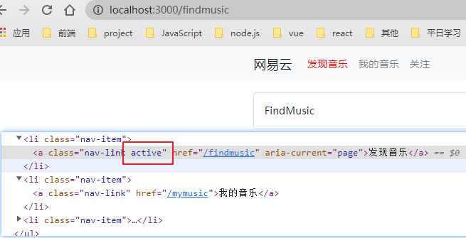
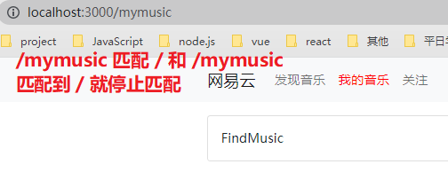
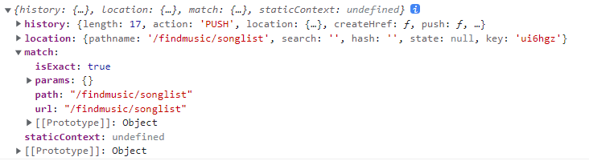
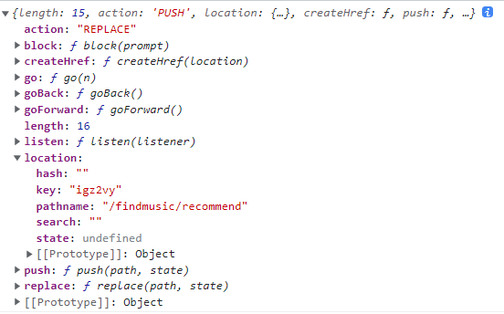
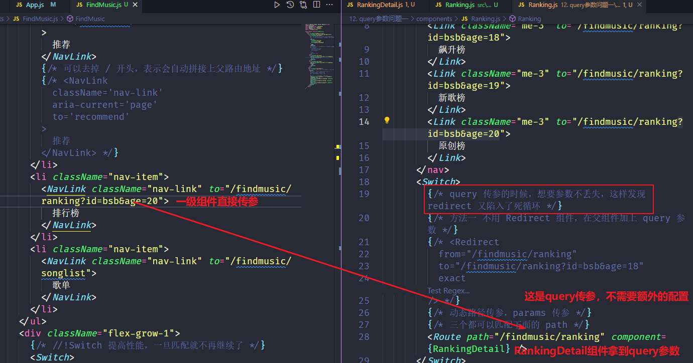
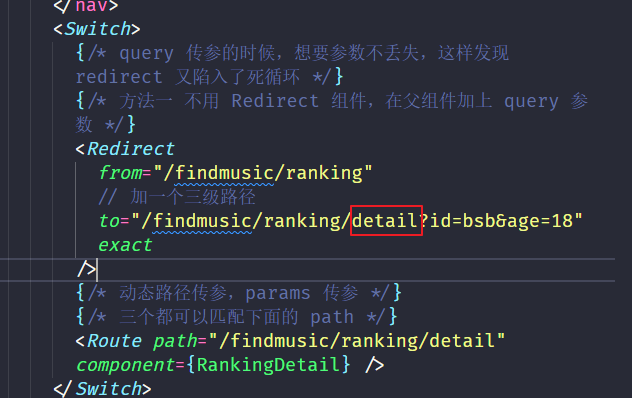

# 1. SPA（Single Page Application）

代表：[网易云音乐](https://music.163.com/)

* SPA： `Single Page Application` 单页面应用程序，整个应用中只有一个页面（index.html）

* MPA : `Multiple Page Application` 多页面应用程序，整个应用中有很多个页面（*.html）

SPA优势：页面响应速度快，体验好（无刷新），降低了对服务器的压力

  1. 传统的多页面应用程序，每次请求服务器返回的都是一整个完整的页面

  2. 单页面应用程序只有第一次会加载完整的页面，以后每次请求仅仅获取必要的数据

缺点：不利于 SEO 搜索引擎优化

  1. 因为爬虫只爬取 HTML 页面中的文本内容，不会执行 JS 代码

  2. 可以通过 SSR（服务端渲染 Server Side Rendering）来解决 SEO 问题，即先在服务器端把内容渲染出来，返回给浏览器的就是纯 HTML 内容了

> 另外，因为首次需要加载完整的页面，存在首页加载过慢的情况

# 2. 前端路由

## 2.1. 前端路由

现代的前端应用大多都是 SPA，也就是只有一个 HTML 页面的应用程序，因为它的用户体验更好、对服务器的压力更小，所以更受欢迎

为了有效的使用单个页面来管理原来多页面的功能，前端路由应运而生，功能：让用户从一个视图（页面）导航到另一个视图（页面）

* 前端路由是一套**映射规则**，是 URL 路径 与组件之间的对应关系。
* 使用 React 路由简单来说就是：配置路径和组件（配对）

## 2.2. 选项卡 和路由的区别

选项卡不能保持状态，页面一刷新就回去了，路由会根据地址保持状态，刷新不会回去，会根据地址加载相应组件

单页应用：前端页面通过路由跳转。通过 js 来加载相应的组件

# 2. 路由的原理

## 2.1. hash 路由的原理（模拟一下）

使用 URL 的哈希值实现（`http://localhost:3000/#/first`），是通过监听 window 的 `hashchange` 事件来实现的

```js
import React, { useState } from "react"
import { useEffect } from "react"
import MyMusic from "./components/MyMusic"
import FindMusic from "./components/FindMusic"
import MyFollow from "./components/MyFollow"

// 路由：Hash 地址和组件之间的对应关系
export default function App() {
  const [hash, setHash] = useState("")
  useEffect(() => {
    // 一上来就调用一次
    const hashChange = () => {
      // 每次 hash 切换都把 Hash 值记录到状态中，不同状态显示对应的组件
      const hash = window.location.hash
      setHash(hash)
    }
    hashChange()
    // 这是原生的 onHashChange 事件
    window.addEventListener("hashchange", hashChange)
    return () => {
      window.removeEventListener("hashchange", hashChange)
    }
  }, [])
  return (
    <>
		//...
      {/* a标签的锚点跳转 */}
     <li><a className="nav-link active" aria-current="page" href="#/findmusic">发现音乐</a></li>
     <li><a className="nav-link" aria-current="page" href="#/mymusic">我的音乐</a></li>
     <li><a className="nav-link" aria-current="page" href="#/myfollow">关注</a>
		//...
        <div className="card">
          <div className="card-body">
            {/* if(){} 写在表达式里就用逻辑运算符 */}
            {hash === "#/findmusic" && <FindMusic />}
            {hash === "#/mymusic" && <MyMusic />}
            {hash === "#/myfollow" && <MyFollow />}
          </div>
        </div>
      </div>
    </>
  )
}

```

## 2.2. history 模式

使用 H5 的 history API 实现（`http://localhost:3000/first`），是通过监听 window 的 `popstate` 事件来实现的，详情百度

# 3. React-Router

6的版本写法更加简单了（以后学也更快，和5的用法几乎都不一样），是才出来的，公司大部分是5的版本

* if(x){y}  =>  x&&y    || 是前面 true 就取前面的，前面 false 就取后面的（写在括号里面的表达式通常是后面的逻辑运算符）

* if(){}else{} =>xx?xx:xx 三元表达式 （写在括号里面的表达式通常是后面的逻辑运算符）

> react-router是基于组件来写的，vue 路由需要配置路由表

使用插件react-router-dom来完成 react 路由的跳转（现在流行的暂且是 @5 的大版本）

* pc端是react-router-dom

* 手机原生应用是 react-router-native

## 3.1. react-router-dom 使用

1. 安装。

```bash
yarn add react-router-dom@5.3.0
```

2. `react-router-dom` 这个包提供了三个核心的组件

```js
import { HashRouter, Route, Link } from 'react-router-dom'
```

3. 使用 `HashRouter` 包裹整个应用，一个项目中只会有一个 Router

```js
<HashRouter>
    <div className="App">App</div>
</HashRouter>
// 或者直接在 项目根目录 index.js 中包裹 App 组件
```

4. 使用 Link 指定导航链接（直接把原来的 a 标签改为 Link 组件包裹）

```js
<Link className='nav-link active' aria-current='page' to='/findmusic'>
    发现音乐
</Link>
```

5. 使用 `Route` 指定路由规则

```js
// 在哪里写的 Route，最终匹配到的组件就会渲染到哪里
<Route path='/findmusic' component={FindMusic} />
```

改写之前的

```jsx
			<li className="nav-item">
                {/* 3.a 标签改为 Link 组件包裹，href 改为 to 属性，地址去掉 # 号 */}
                <Link className="nav-link active" aria-current="page" to="/findmusic">
                  发现音乐
                </Link>
              </li>
              <li className="nav-item">
                <Link className="nav-link" aria-current="page" to="/mymusic">
                  我的音乐
                </Link>
              </li>
              <li className="nav-item">
                <Link className="nav-link" aria-current="page" to="/myfollow">
                  关注
                </Link>
              </li>

		<div className="card-body">
            {/* 4.使用 Route 组件指定路由规则 path 和 之前 Link 中的 to 匹配，加载对应的 component 在这里渲染。route 标签写在哪就在哪渲染*/}
            <Route path="/findmusic" component={FindMusic} />
            <Route path="/mymusic" component={MyMusic} />
            <Route path="/myfollow" component={MyFollow} />
          </div>
```

## 3.2. hash 模式和 history 模式

具体的原理看前面，主要是 hash 模式 `#` 后面的参数不会传到服务器，每次返回一个 index.html

而 history 模式 `/ `后面的参数会传到服务器，需要后端做支持，也每次都返回 index.html

这里我们是用 vue/cli 启动的项目，脚手架自动做了支持

**Router 组件的说明（HashRouter 和 HistoryRouter）**

常用有两种 Router：`HashRouter` 和 `BrowserRouter`，用来包裹整个应用，一个 React 应用只需要使用一次。

* HashRouter：使用 URL 的哈希值实现（`http://localhost:3000/#/first`），是通过监听 window 的 `hashchange` 事件来实现的。
* BrowserRouter：使用 H5 的 history API 实现（`http://localhost:3000/first`），是通过监听 window 的 `popstate` 事件来实现的

```js
// 使用时建议通过 as 起一个别名，方便修改
import { HashRouter as Router, Route, Link } from 'react-router-dom'
```

只需要在组件的外面包起来包一次就可以了`App.js`

```js
import React from "react"
import {
  NavLink,
  HashRouter as Router,
  Switch,
  Route,
  Redirect,
} from "react-router-dom"
import MyLayout from "./pages/MyLayout"
import Login from "./pages/Login"
import NotFound from "./pages/NotFound"

export default function App() {
  return (
    <Router>
      <Switch>
        {/* <Redirect from="/" to="/login" exact /> */}
        {/* 重定向也有下面这种写法，使用 render 函数 */}
        <Route path="/" render={() => <Redirect to="/login" />} exact />
        <Route path="/login" component={Login} />
        <Route path="/home" component={MyLayout} />
        <NotFound component={NotFound} />
      </Switch>
    </Router>
  )
}
```

## 3.3. 路由的执行过程

1. 点击 Link 组件（a 标签），浏览器地址栏中的 url 发生变化。
2. ReactRouter 通过 `hashchange` 或 `popState` 监听到了地址栏 url 的变化。
3. ReactRouter 内部遍历所有 Route 组件，使用路由规则（path）与 pathname（hash）进行匹配。
4. 当路由规则（path）能够匹配地址栏中的 pathname（hash）时，就展示该 Route 对应的组件

# 4. Link 和 Navlink

`Link` 组件最终会渲染成 a 标签，用于指定路由导航。

* to 属性，将来会渲染成 a 标签的 href 属性

* `Link` 组件无法实现导航的高亮效果

`NavLink` 组件，一个更特殊的 `Link` 组件，可以用于指定当前导航高亮

* to：用于指定地址，会渲染成 a 标签的 href 属性

* activeClass：用于指定高亮的类名，默认 `active`（每个 NavLink 都要加上这个 activeClass 属性，一般不加就用 active，除非有冲突，有冲突也可以使用 css 选择器来模拟消除，所以就用默认的 active）

* exact：精确匹配，表示必须精确匹配类名才会应用 class，默认是模糊模糊匹配（属性直接加上 exact 用法同表单的 checked，单写一个 exact 即可）

## 4.1. NavLink 的使用（专门用来做导航高亮）

匹配的 NavLink 组件会多一个 active 的类名，注意不加 exact 的话，默认是模糊匹配，`/findmusic`匹配`/`和`/findmusic`会添加两个 active 的类名



## 4.2. NavLink 的精确匹配

注意默认是**模糊匹配**

原因：NavLink 组件 to 属性对应的值如果是 `/`，则表示，只要是以 `/` 开头的就会被添加 class，当访问 `/mymusic` 的时候，发现是以 `/` 开头的，所以这里也加了 class，`/myfollow` 同理（就是 `/mymusic` 同时匹配了 `/` 和 `/mymusic`  都会加上 active 类名）

另外：同时 `/mymusic/12` 也同时匹配了 `/`  和 `/mymusic`  都会加上 active 类名

**exact：精确匹配，表示必须精确匹配类名才会应用 active 的 class**

```jsx
// / 加了 exact 表示 只有 / 可以匹配这个 NavLink，之前的 /mymusic 无法匹配了
<li><NavLink className="nav-link" aria-current="page" to="/" exact>发现音乐</NavLink></li>
{/* 这里的 exact 表示只匹配 /mymusic ，/mymusic/xxx 不匹配 */}
<li><NavLink className="nav-link" aria-current="page" to="/mymusic" exact>我的音乐</NavLink></li>
<li><NavLink className="nav-link" aria-current="page" to="/myfollow">关注</NavLink>
```

> vue 中和 react 中的路由不一样， vue是由children来区分的。react 中并没有 children
>
> 是`/`都要加 exact 属性

## 4.3. Route 的精确匹配

Route 可以被称为 React 路由中的路由规则，在哪里匹配就在哪里渲染相应的组件，**点击 NavLink 和在地址栏输入是一样的都是为了拿到一个地址去和 Route 组件中的 path 进行匹配**

所以 NavLink 和 Route 分开看， NavLink 看高亮，下面看地址命中哪个渲染哪个组件

默认是以 path 对应值开头的路径就会被匹配

* 不加 exact `/mymusic` 匹配到 `/ `和 `/mymusic` 对应的组件显示，同时不加 exact `/mymusic/sdf` 匹配到 `/` 和 `/mymusic` 对应的组件显示
* 加了 exact 之后，表示只有 `/` 才匹配 `/`显示 `FindMusic` 组件

```js
<Route path="/" component={FindMusic} exact />
<Route path="/mymusic" component={MyMusic} />
<Route path="/myfollow" component={MyFollow} />
```

> 地址栏中的地址和 NavLink 中的 `to` 或者 Route 的 `path` 匹配规则是一样的，没加 exact 就是模糊匹配，匹配只要以对应的路径开头就可以匹配到，加了 exact 就必须一样才匹配。Link 或者 NavLink 的`/`以及 Route 的`/`都要加上 exact

# 5. Switch 组件的使用

通常，会把一个个的 `Route` 包裹在一个 `Switch` 组件中，这样只会渲染第一个匹配到的组件，往往是我们期望的

通过 `Switch` 组件配合不带 path 属性的 Route 组件能实现 404 效果，即便不需要实现 404，也可以用 Switch 包裹来提升性能（为了节省性能，通常路由的出口处就用 switch 包裹一下，匹配到一个就停下来）

```js
<Switch>
       <Route path="/" component={FindMusic} exact />
       <Route path="/mymusic" component={MyMusic} />
       <Route path="/myfollow" component={MyFollow} />
       {/* 一个不带 path 属性的 Route，默认情况下其实会一直被渲染 */}
       <Route component={NotFound} />
</Switch>
```

加了switch 就是从上往下匹配只要匹配到了就停止，导致下面一种情况（如果我没加 exact）

```js
<Switch>
              <Route path="/" component={FindMusic} />
              <Route path="/mymusic" component={MyMusic} />
              <Route path="/myfollow" component={MyFollow} />
              {/* 一个不带 path 属性的 Route，默认情况下其实会一直被渲染 */}
              <Route component={NotFound} />
            </Switch>
```



# 6. 路由匹配规则

* Route 组件 path 属性对应的值表示：默认是以此值开头的路径就会被匹配，添加 exact 属性可以开启精确匹配
* 所以默认情况下，path 为 `/` 能够匹配所有路由组件，因为所有路由组件都是以 `/` 开头的，一般来说，如果路径配置了 `/`，往往都需要配置 exact 属性
* 如果 path 的路径匹配上了，那么对应的组件就会被 render，否则就会 render null
* 如果没有指定 path，那么一定会被渲染，例如 `<Route component={NotFound}></Route>`

# 7. Redirect 组件的使用-路由重定向

直接用`/`去匹配某个组件的话，语义化不好，但往往用户刚进来的时候默认路由地址就是`/`，用路由重定向去解决

重头开始匹配包括 Redirect 自己的 from 也会重新匹配

重定向的需求，一般是用一级路由路径（二级路径时`/`）去匹配一个二级路由组件（或者二级匹配三级）

```js
        	<Switch>
              {/* from 表示以 / 开头的就会被匹配 */}
              {/* 重定向，是重头开始匹配的意思 */}
              {/* 不加 exact ，匹配到/,然后重定向到 /findmusic 然后从头匹配，该地址匹配到 / 和 /findmusic ，匹配到 / 由匹配到了Redirect 组件，又重定向，陷入死循环，需要加上 exact*/}
              {/* from 加了exact 之后 表示只有以 / 开头的才会被匹配 */}
              <Redirect from="/" to="/findmusic" exact />
              {/* path 改成/ 语义化不好，使用重定向来完成 */}
              <Route path="/findmusic" component={FindMusic} />
              <Route path="/mymusic" component={MyMusic} />
              <Route path="/myfollow" component={MyFollow} />
              {/* 一个不带 path 属性的 Route，默认情况下其实会一直被渲染 */}
              <Route component={NotFound} />
            </Switch>
```

> **重定向的组件 一般都加上 exact**
>
> 用 Redirect 组件的 from 来作路由规则

# 8. 嵌套路由

几个注意点

* 二级路由规则（可以理解为有 path 路径的组件）需要配在一级路由组件里（先匹配一级路由组件再匹配二级）
* **有二级路由存在，父路由一定不能加 exact**
* 二级路由一定需要加上一级路由（提高易读性的话就带上，路由嵌套少的时候，或者获取到父路由定义成一个变量），当然也有一种简洁的写法就是二级路由不加`/`
* 组件路由规则一定要加上 Switch 组件来提高性能（不止一个路由组件）

> React/cli 内部支持了 sass 但是需要安装第三方 sass 的包

```js
import { NavLink, Route, Switch, Redirect } from "react-router-dom"
import Recommend from "./Recommend"
import Ranking from "./Ranking"
import SongList from "./SongList"
import "./findmusic.scss"

export default function FindMusic() {
  return (
    <div className="findmusic d-flex">
      <ul className="nav flex-column bg-light me-3">
        <li className="nav-item">
          {/* 二级路由的出入口一般写在一级路由组件里面 */}
          {/* //!二级路由入口的指定一定记得把一级路由的地址带上 */}
          <NavLink
            className="nav-link"
            aria-current="page"
            to="/findmusic/recommend"
          >
            推荐
          </NavLink>
          {/* 可以去掉 / 开头，表示会自动拼接上父路由地址 */}
          {/* <NavLink
            className='nav-link'
            aria-current='page'
            to='recommend'
          >
            推荐
          </NavLink> */}
        </li>
        <li className="nav-item">
          <NavLink className="nav-link" to="/findmusic/ranking">
            排行榜
          </NavLink>
        </li>
        <li className="nav-item">
          <NavLink className="nav-link" to="/findmusic/songlist">
            歌单
          </NavLink>
        </li>
      </ul>
      <div className="flex-grow-1">
        {/* //!Switch 提高性能，一旦匹配就不再继续了 */}
        <Switch>
          {/* exact 一定要加，表示精确匹配，必须是 /findmusic 才会进行重定向 */}
          {/* 一级路由不要加 exact  */}
          <Redirect from="/findmusic" to="/findmusic/recommend" exact />
          <Route path="/findmusic/recommend" component={Recommend} />
          <Route path="/findmusic/ranking" component={Ranking} />
          <Route path="/findmusic/songlist" component={SongList} />
        </Switch>
      </div>
    </div>
  )
}
```

> 配置嵌套路由的时候，必须要先匹配到父路由，才能匹配到子路由

# 9. 编程式导航

编程式导航：通过 JS 代码来实现页面跳转，可以处理相关逻辑，更加灵活

* 第一种方式通过 props 拿到 history 进行跳转，`props.history.push('/comment')`
  props 这种方式跳转，前提是这个 SongList 组件（就是 使用 props.history 跳转的当前组件必须是路由组件）必须是作为路由组件存在的才可以，路由组件的 props 可以拿到 history、location、match，不然 props 拿到的是父组件传过来的自定义属性的值，下面是路由组件传递过来的 props
  
* 第二种方式通过 react-router-dom 提供的 useHistory 勾子进行跳转（推荐：有 hook 建议用hook）

```js
import React from "react"
import { useHistory } from "react-router-dom"
import Test from "./Test"

export default function SongList(props) {
  const history = useHistory()
  // console.log(history)
  // console.log(props)
  const handleClick = () => {
    // history.push("/")
    // props 这种方式跳转，前提是这个 SongList 组件（就是 使用 props.history 跳转的当前组件必须是路由组件）必须是作为路由组件存在的才可以
    // 路由组件的 props 可以拿到 history、location、match
    // 不然 props 拿到的是父组件传过来的自定义属性的值
    props.history.push("/")
  }
  return (
    <div>
      <Test></Test>
      <h3>SongList</h3>
      <button onClick={handleClick}>首页</button>
    </div>
  )
}

```

函数传参后面再学习

# 10. 动态路由传参

1. 入口

   ```jsx
   <NavLink className='nav-link' to='/findmusic/ranking/bsb'>
       飙升榜
   </NavLink>
   ```

2. 出口

   ```jsx
   <Route path='/findmusic/ranking/:id' component={RankingList} />
   ```

3. 获取

   ```js
   // 1
   // props.match.params.id history 的match 也可以能拿到 params 参数
   
   // 2
   // 新钩子`const params = useParams()` params.id可以直接拿到参数
   ```

注意点：

* 路由传参的参数刷新了之后一定还存在

* 只要不是一个，就建议包裹在 switch 组件里面，redirect 组件也算一个

* 路由组件传参，props 属性，路由组件不能使用自定义属性来传参

histroy有useHistory 钩子，location 有 useLocation 钩子

`const history = useHistory()`使用 `history.push('xxx')`进行跳转（history 钩子可以拿到传的参数）



```js
import { Link, Route, Switch, Redirect } from "react-router-dom"
import RankingDetail from "./RankingDetail"

export default function Ranking() {
  return (
    <div>
      <nav>
        <Link className="me-3" to="/findmusic/ranking/bsb">
          飙升榜
        </Link>
        <Link className="me-3" to="/findmusic/ranking/xgb">
          新歌榜
        </Link>
        <Link className="me-3" to="/findmusic/ranking/ycb">
          原创榜
        </Link>
      </nav>
      <Switch>
        <Redirect from="/findmusic/ranking" to="/findmusic/ranking/bsb" exact />
        {/* 动态路径传参，params 传参 */}
        {/* 三个都可以匹配下面的 path */}
        <Route path="/findmusic/ranking/:id" component={RankingDetail} />
      </Switch>
    </div>
  )
}
```

# 11. Query 传参

## 11.1. query 传参

`xxxx?name=zx&age=23`类似于这种用问号在路径后面拼接的就是 query 传参（传参是在跳转的那个组件内部拿到参数）

借助`qs`这个第三方包来帮忙解析 query 查询字符串

```js
import { useParams } from "react-router-dom"
import { useLocation } from "react-router-dom"
import qs from "qs"

export default function RankingDetail(props) {
  const params = useParams()
  const location = useLocation()
  // 又来一个钩子
  // props.match.params.id 也可以
  // return <div>RankingDetail: {params.id}</div>

  // location.search 拿到的是这种需要自己处理成对象?id=bsb&age=20
  // 借助 qs 这个包来实现 queryString
  const res = qs.parse(location.search, { ignoreQueryPrefix: true })
  console.log(res)
  return <div>看控制台</div>
}
```

const history = useHostory  钩子也可以拿到location.search

history对象如下图


## 11.1. 遇到的问题，query怎么传参

问题：query 传参实现路由重定向

重定向是 希望二级路由地址（即三级地址是`/`），匹配到三级路由组件 重定向一个三级路由路径

解决一，但是这样语义化不好



解决二

加一个三级路径（重定向，二级去重定向三级的，就是该级路由的`/`匹配到当前级别路由的第一个组件）


