# 1. TypeScript 概述

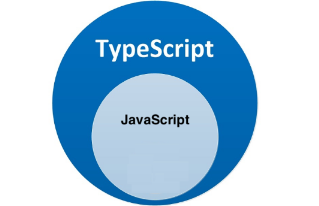


## 1.1. TS 是什么

[TS 推荐入门文档](https://ts.xcatliu.com/)

* TypeScript 是微软开发的编程语言，它是 JavaScript 的超集，可以在任何运行 JavaScript 的地方运行，[官方文档](https://www.typescriptlang.org/)，[中文文档，不再维护](https://www.tslang.cn/)
* TypeScript = `Type` + JavaScript（在 JS 基础之上，为 JS 添加了类型支持/类型检测）

示例

```js
let age1: number = 18 // TS 代码 => 有明确的类型，即 number（数值类型）
```

## 1.2. 为什么要使用 TS

* 背景：JS 的类型系统存在“先天缺陷”，是弱类型语言，而代码中的大部分错误都是类型错误（TypeError），这些经常出现的错误，导致了在使用 JS 进行项目开发时，增加了找 Bug、改 Bug 的时间，严重影响开发效率。
* 对于 JS 来说：需要等到代码真正去执行的时候才能发现错误（晚）；对于 TS 来说：在代码编译的时候（代码执行前）就可以发现错误（早）。
* 配合 VSCode 等开发工具，**发现错误的时机 TS 可以提前到在编写代码的时候**，减少找 Bug、改 Bug 时间。

```js
// 使用 JavaScript：在 VSCode 里面写代码；在浏览器中运行代码，发现错误【晚】。
// 使用 TypeScript：在 VSCode 里面写代码；写代码的同时，就会发现错误【早】；在浏览器中运行代码。
let num = 123
num = 'abc'
num.toFixed(2) // Uncaught TypeError: num.toFixed is not a function
```

## 1.3. TS 的优势

1. **更早（写代码的同时）发现错误**，减少找 Bug、改 Bug 时间，提升开发效率。
2. 程序中任何位置的代码都有**代码提示**，随时随地的安全感，增强了开发体验。
3. 支持最新的 ECMAScript 语法，**优先体验最新的语法，让你走在前端技术的最前沿**。
4. Vue3 源码使用 TS 重写、Angular 默认支持 TS、React 与 TS 完美配合，TypeScript 已成为大中型前端项目的首选编程语言，前端最新的开发技术栈离不开 TS，例如 React（TS + Hooks），Vue（TS + Vue3）

> ts 写多了 ，就回不去 js 了，就特别依赖这些提示，依赖这些类型的校验

* 多个更多的提示（比如数组的方法，点后面会自动提示所有的方法）结合vscode（vscode和ts都是微软的）
* 多了校验

声明了类型，后面改变了类型,就会边写边校验

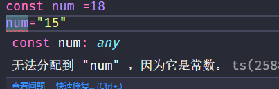

自动提示功能

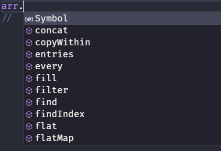

# 2. 编译 TS

## 2.1. 安装编译 TS 的工具包

* 问题：为什么要安装编译 TS 的工具包？
* 回答：Node.js/浏览器，只认识 JS 代码，不认识 TS 代码，因此需要先将 TS 代码转化为 JS 代码，然后才能运行
* 安装命令：`npm i -g typescript` 或者 `yarn global add typescript`
* 验证是否安装成功：tsc –v（查看 TypeScript 的版本）

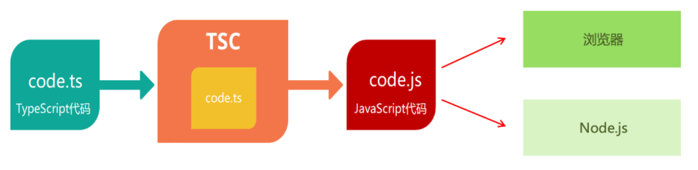

## 2.2. 编译并运行 TS 代码

1. 创建 `hello.ts` 文件（注意：TS 文件的后缀名为 `.ts`）
2. 将 TS 编译为 JS：在终端中输入命令，`tsc hello.ts`（此时，在同级目录中会出现一个同名的 JS 文件）
3. 执行 JS 代码：在终端中输入命令，`node hello.js`
4. 说明：所有合法的 JS 代码都是 TS 代码，有 JS 基础只需要学习 TS 的类型即可
5. 注意：由 TS 编译生成的 JS 文件，代码中就没有类型信息了

`tsc`和`node`每次修改了 ts 文件，需要重新执行这两个命令

使用下面的命令，修改后自动处理（开两个 shell 窗口）

```bash
# 监听 index.ts 文件的变化并编译
tsc -w index.ts  # 窗口 1
# 运行编译后的代码
nodemon index.js # 窗口 2
```

> 拓展：`ts-node`这个第三方包可以直接运行 ts 代码，和 node 运行一样，直接 `ts-node ./index.ts`。学习使用，真正项目中用不到了

## 2.3. 一个小问题

默认情况下 ts 代码里面的变量会在整个根目录下查找，因为编译成了 js 文件。有重名变量

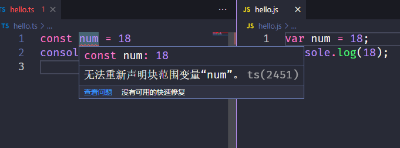

解决：在 ts 文件里面 `export {}` 这样 ts 文件就有了自己的作用域，不会报错了

项目中不会出这个问题（脚手架生成）

> 单独写没有配合 babel 的支持，可能有的 ts 校验检查不出来，把文件关了重新开一下就可以了，到时候为项目中不会出现这个问题

# 3. 类型注解

语法：通过冒号进行类型注解

> ts 里的类型又称为类型体操，可以结合着来使用，很多时候类型还需要自己去思考一下怎么写

TypeScript 是 JS 的超集，TS 提供了 JS 的所有功能，并且额外的增加了：**类型系统**

* 所有的 JS 代码都是 TS 代码

* JS 虽然也有类型（比如，number/string 等），但是 JS 不会检查变量的类型是否发生变化，而 TS 会检查

TypeScript 类型系统的主要优势：**可以显式标记出代码中的意外行为，从而降低了发生错误的可能性**

```js
// 举个例子
let age: number = 18
```

代码中的 `:number` 就是**类型注解**

* 作用：**为变量添加类型约束**，比如上述代码中，约定变量 age 的类型为 number 类型
* 解释：**约定了什么类型，就只能给变量赋值该类型的值，否则，就会报错**

```ts
// 举个会报错的例子
// 错误原因：将 string 类型的值赋值给了 number 类型的变量，类型不一致
let age: number = '18'
```

> 同时，不仅写错了会给出错误提示，而且约定了类型之后，代码的提示也会非常的清晰。比如约定数字类型的变量输入了点之后后面会提示数字类型的所有方法

# 4. 原始类型

可以将 TS 中的**常用基础类型**（也叫原始类型）细分为两类，分别是 JS 已有类型和 TS 新增类型

1. **JS 已有类型**

   * 原始类型：`number/string/boolean/null/undefined/symbol/bigint`

   * 对象类型：`object`（包括，数组、对象、函数等对象）

2. **TS 新增类型**

   * 联合类型、自定义类型（类型别名）、接口（interface）、元组（tuple）、字面量类型、枚举、void、any 等

   * 注意：TS 中的原始类型和 JS 中写法一致；TS 中的对象类型在 JS 类型基础上更加细化，每个具体的对象（比如数组、对象、函数）都有自己的类型语法

```js
let age: number = 18
let myName: string = 'Ifer'
let isLoading: boolean = false
// ...
```

# 5. 数组类型

```ts
// 写法一（常用）
const arr: number[] = [1,2,3]

// 写法二 泛型
const arr: Array<number> = [1,2,3]

arr.push(2) // 后续 push 的数据也必须是字符串
console.log(arr);

export {}
```

# 6. 联合类型

通过联合类型将多个类型组合成一个类型

数组中既有 number 类型，又有 string 类型，这个数组的类型应该如何写？

解决：使用 TS 新增类型--联合类型

```js
// 定义一个数组，数组中可以有数字或者字符串, 需要注意 | 的优先级
let arr: (number | string)[] = [1, 'abc', 2]

// 没有数组
const s : num | string | boolean = "zs"
```

* 解释：`|`（竖线）在 TS 中叫做联合类型，即由两个或多个其他类型组成的类型，表示可以是这些类型中的一种
* 注意：这是 TS 中联合类型的语法，只有一根竖线，不要与 JS 中的或（||）混淆了

应用场景

```ts
// 先赋值为 null 后续的值为数字类型
let timer: number | null = null
timer = setInterval(() => {}, 1000)
```

# 7. 类型别名（也叫自定义类型）

能够使用类型别名给类型起别名（为任意类型取别名，甚至可以是中文）

注意点：

* 使用 `type` 关键字来创建自定义类型。

* 类型别名（比如，此处的 CustomArray）可以是任意合法的变量名称。

* 推荐使用大写字母开头。

* 创建类型别名后，直接使用该类型别名作为变量的类型注解即可

```ts
type s = string
const myName: s = 'ifer'

type 字符串类型 = string
const myAddress: 字符串类型 = '河南老乡~'
```

取别名 习惯以大写的`T`开头（使用 type 关键字）然后再跟一个大写字母开头

```ts
type TArray = (number | string | boolean)[]
const arr1: TArray = [1, 'a', true]
```

> type 和 interface 的用法其实差不多，要看公司里面哪个用的多一些

使用场景

当同一类型（复杂）且可能被多次使用时，可以通过类型别名，**简化该类型的使用**

```ts
type CustomArray = (number | string)[]

let arr1: CustomArray = [1, 'a', 3, 'b']
let arr2: CustomArray = ['x', 'y', 6, 7]
```

或者类型的内容（比如对象的类型）比较多，可以用别名抽离出来

```ts
type IStar = {
  name: string
  age: number
  sayHI(num1: number): number
}
const star: IStar = {
  name: "zx",
  age: 18,
  sayHI(num1) {
    return 2
  },
}
```

# 8. 函数类型

函数的类型实际上指的是：`函数参数` 和 `返回值` 的类型，为函数指定类型有如下两种方式

## 8.1.类型 定义

###  8.1. 直接定义函数

1. 声明式函数（状态会提升，可以先调用后声明，使用 function 定义）

   声明式函数只能**单独指定**

   ```js
   function add(num1: number, num2: number): number {
     return num1 + num2
   }
   add(1, 2)
   ```

2. 函数表达式（状态不能提升，必须先声明后调用，使用等号 + function定义，或者使用等号 + 箭头函数）

   函数表达式（匿名函数 或者 箭头函数，function 匿名函数可以改写成箭头函数）具有**单独指定**和**统一指定**两种类型注解
   
   ```js
   // 单独指定类型 返回值类型前面必须有一个冒号，紧跟在形参后面
   const decline = function(num1: number, num2: number): number {
     return num1 - num2
   }
   const decline = (num1: number, num2: number): number => num1 - num2
   
   // 统一指定类型（可以通过类似箭头函数形式的语法来为函数添加类型，注意这种形式只适用于函数表达式，返回值的类型前必须要有箭头）
   // type TFn = (a:number, b:number) => number
   // a 和 num1 、 b 和 num2 名字可以不一样，但是建议一一对应，习惯和规范
   type TFn = (num1: number, num2: number) => number
   const testFn: TFn = function(num1, num2) {
       return num1 + num2
   }
   const testFn: TFn = (num1, num2) => num1 + num2
   
   // 统一声明了之后，后面还可以单独声明，不报错，可以正常执行，但是没必要。有人这样写，是因为它更明确地知道类型，不然只有调用的时候才知道传什么类型，传错了会报错
   /* const testFn : TFn =(num1:number, num2:number):number => {
       return num1-num2
   } */
   ```

> 只需要记返回值类型，**单独指定**是需要在形参小括号后面加`:返回值类型`，**统一指定**是需要在形参小括号后面加`=>返回值类型`

还有一个函数表达式的写法（用的不多）

```ts
// type 描述函数 用对象包裹起来，也属于统一指定
type TSetPerson = {
    (name: string, age: number): void
}
const setPerson: TSetPerson = (name, age) => {}

setPerson('ifer', 18)

// interface 描述函数
interface ISetPerson {
    (name: string, age: number): void
}
const setPerson: ISetPerson = (name, age) => {}

setPerson('ifer', 18)
```

### 8.2. 定义在对象中的方法

相当于函数表达式，看对象中的方法可以怎么定义的，类型就可以怎么定义（加不加冒号）不用刻意去记

```ts
// 单独指定类型
const person1: { name: string; add(num1: number, num2: number): void } = {
  name: "zx",
  add(num1, num2) {},
  // 写成箭头函数也可以
  // add: (num1, num2) => {},
}

// 统一指定类型 返回值类型前面必须有一个箭头
const person2: { name: string; add: (num1: number, num2: number) => number } = {
  name: "zx",
  add() {
    return 2
  },
  // 写成箭头函数也可以
  // add: num1 => 2,
}
```

##  8.2. void 类型

```ts
// 注意：在没有开始 strictNullChecks 模式的情况下，可以把 null 和 undefined 赋值给任意类型
// 如何开启：通过 tsc --init 生成配置文件，默认就会开启 strictNullChecks
// let temp: void = null // ok
let temp: void = undefined // ok
```

`void` 类型的常用场景：函数没有返回值，就定义类型为 `void`

```ts
function greet(name: string): void {
    console.log('Hello', name)
    // return undefined // 默认有这么一句
}
```

注意：如果一个函数明确了返回类型是 undefined，则必须显示的 `return undefined`

```ts
const add = (): undefined => {
    return undefined
}
```

## 8.3. 函数可选参数

使用 `?` 指定可选参数类型

使用函数实现某个功能时，参数可以传也可以不传，这种情况下，在给函数参数指定类型时，就用到**可选参数**了

场景：比如，数组的 slice 方法，可以 `slice()` 也可以 `slice(1)` 还可以 `slice(1, 3)`

可选参数语法：在可传可不传的参数名称后面添加 `?`（问号）

```ts
// start、end 可传可不传，r如果传就必须传 number 类型
function mySlice(start?: number, end?: number): void {
    console.log('起始索引：', start, '结束索引：', end)
}

```

注意：**可选参数只能出现在参数列表的最后**，也就是说可选参数后面不能再出现必选参数（ts规定）

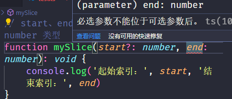

## 8.4. 函数参数默认值

能够给参数指定默认值

通过赋值符号（=）可以给参数执行默认值，注意：可选参数可以和默认值一起使用，但是不能一起作用于同一个形参，**因为参数默认值和可选参数互斥的，只能指定其中一种**

```ts
// Error: Parameter cannot have question mark and initializer
function mySlice(start: number = 0, end?: number = 0) {}

// 正确
function mySlice(start: number = 0, end?: number) {}
function mySlice(start: number = 0, end: number = 0) {}
```

# 9. 对象类型（interface）

## 9.1. 基本使用

JS 中的对象是由属性和方法构成的，而 **TS 对象的类型就是在描述数据的结构**（有什么样类型的属性和方法）

```ts
// 一、js 基本数据类型 要求 person 变量的值必须为一个对象
const person: object = {}

// 二、左边的 {} 表示类型（严格来说应该是对象字面量类型），右边的 {} 表示值
// 这种写法右边其实可以是除了 undefined 和 null 的任意值
let person: {} = {}

// 三、可以精确描述对象里面具体内容的类型
// 这样描述：变量右边有没有 name 的属性，并且类型为 string 类型，不符合就报错，这样写左右属性的数量必须一致

const person: { name: string } = {
    name: '同学',
}
/*
可以使用 type 或者 interface 抽离对象类型
type TPerson = { name: string }
const person: TPerson ={ name: '同学' }
*/

const obj = {
    name: '同学',
    age: 18
}
// 右边是变量，在满足左边声明的前提下（右边内容可以比左边多）
// 考虑到后端返回的数据，可能会有多的字段，ts 支持了这样一种情况
const person: { name: string } = obj
```

符号的使用（可以使用逗号，分号或者不写）注意这是类型声明中，要赋给变量的对象属性之间需要使用逗号

```ts
// 类型声明建议使用分号来分割多个属性。注意函数中的参数类型之间是逗号
const person: { name: string; age: number } = {
  name: "zx",
  age: 18,
}
// 换行了就去掉分号，注意等号右边的对象的逗号不能省略
const person: { 
    name: string
    age: number 
} = {
  name: "zx",
  age: 18,
}


// 如果使用 type 或者 interface 抽离出来了，建议换行不写 分号或者冒号
type TPerson = {
  name: string
  age: number
}
// 如果抽离出来没有换行，建议使用分号
type TPerson = { name: string; age: number }
const person : TPerson = {
  name: "zx",
  age: 18,
}
```

## 9.2. 字符串的特殊使用

字符串类型注解的大多数情况

```ts
const str : string = "xx"
```

也可以用对象去指定字符串的类型。含义就是右边是否有 length 属性，并且 length 的类型是 number 类型

````ts
const str: { length: number } = "str"
````

补充：字符串是基本包装类型，函数也有 length 表示参数的个数，伪数组，数组都有 length 属性

```ts
const str: { length: number } = "str"// 字符串
const arr: { length: number } = []//数组
const weiArr: { length: number } = {
    0:1,
    1:6,
    length:2
}// 伪数组
const str: { length: number } = function(){}// 函数
```

## 9.3. 定义对象里面的方法

相当于函数表达式，看对象中的方法可以怎么定义的，类型就可以怎么定义（加不加冒号）不用刻意去记

```ts
// 单独指定类型
const person1: { name: string; add(num1: number, num2: number): void } = {
  name: "zx",
  add(num1, num2) {},
  // 写成箭头函数也可以
  // add: (num1, num2) => {},
}

// 统一指定类型 返回值类型前面必须有一个箭头
const person2: { name: string; add: (num1: number, num2: number) => number } = {
  name: "zx",
  add() {
    return 2
  },
  // 写成箭头函数也可以
  // add: num1 => 2,
}
```

## 9.4. 对象可选属性

对象的属性或方法，也可以是可选的，此时就用到**可选属性**了

场景：比如，我们在使用 `axios({ ... })` 时，如果发送 GET 请求，method 属性就可以省略

可选属性的语法与函数可选参数的语法一致，都使用 `?` 来表示（记得在对象类型中定义）

```ts
type Config = {
    url: string
    method?: string
}

function myAxios(config: Config) {
    console.log(config)
}
```

## 9.5. 小练习

创建两个学生对象：包含姓名、性别、成绩、身高、学习、打游戏

```ts
type Student = {
    name: string
    gender: string
    score: number
    height: number
    study(): void
    // play(name: string): void
    play: (name: string) => void
}

const stu: Student = {
    name: 'xxx',
    gender: 'man',
    score: 88,
    height: 178,
    study() {
        console.log('学学学')
    },
    // 或者写箭头函数
    //study:()=>{xxx}
    // play() 这里不写参数，也不会马上报错，但 stu.play() 调用的时候就知道了
    play(name) {},
}

//上面如果不写参数 play() {} ，直接 stu.play() 调用不传参数会直接报错
// 但是如果调用时传一个参数，stu.play('zs') 不会报错，这样是直接跳过了中间，没什么意义，是一个缺陷，不用纠结，一般在赋值的时候都会写上对象的参数

// 类似于函数表达式，赋值的时候不写参数
type TFn = (num1: number, num2: number) => number
const testFn: TFn = function () {
  return 3
}
testFn() //也会报错
testFn(1, 2)//不会报错，但意义不大，一般不会有人忘记赋值的的时候写上形参
```

## 9.6. 接口

当一个对象类型被多次使用时，一般会使用接口（`interface`）来描述对象的类型，达到复用的目的

* 使用 `interface` 关键字来声明接口
* 接口名称（比如，此处的 IPerson），可以是任意合法的变量名称，推荐以 `I` 开头
* 声明接口后，直接使用接口名称作为变量的类型
* 因为每一行只有一个属性类型，因此，属性类型后没有 `;`（分号）

```ts
interface IStudent {
    name: string
    gender: string
    study(): void
}

const stu: IStudent = {
    name: 'xxx',
    gender: 'man',
    study() {
        console.log('学学学')
    },
}
```

和 type 取别名的用法差不多，**接口后面不用写等号**，接口属性换行不写分号，写在一行需要写分号

## 9.7. 接口继承

如果两个类型之间有相同的属性或方法，可以将**公共的属性或方法抽离出来，通过继承来实现复用**

```ts
interface Point2D {
    x: number
    y: number
}
// 使用 `extends`（继承）关键字实现了接口 Point3D 继承 Point2D
// 继承后，Point3D 就有了 Point2D 的所有属性和方法（此时，Point3D 同时有 x、y、z 三个属性）
interface Point3D extends Point2D {
    z: number
}
```

## 9.8. interface 和 type 的异同点

interface 和 type 其实用法差不多，取决于公司要求，看哪个要求使用的比较多

### 相同点

1. 都可以描述对象或者函数

```ts
// 一、type
// type 描述对象
type TPerson = {
    name: string
    age: number
}
const p: TPerson = { name: 'ifer', age: 18 }

// type 描述函数
type TSetPerson = {
    (name: string, age: number): void
}
const setPerson: TSetPerson = (name, age) => {}

setPerson('ifer', 18)


// 二 interface
// interface 描述对象
interface IPerson {
    name: string
    age: number
}
const p: IPerson = { name: 'ifer', age: 18 }

// interface 描述函数
interface ISetPerson {
    (name: string, age: number): void
}
const setPerson: ISetPerson = (name, age) => {}

setPerson('ifer', 18)

```

2. 都允许拓展，语法不一样
   type 是地址符号，名字叫作交叉类型，interface 是 extends 关键字，名字叫继承

```ts
// type & type
type TName = { name: string }
type TPerson = { age: number } & TName

const p: TPerson = {
    name: 'ifer',
    age: 18,
}

// type & interface
interface IName {
    name: string
}
type TPerson = { age: number } & IName

const p: TPerson = {
    name: 'ifer',
    age: 18,
}

// interface extends interface
interface IName {
    name: string
}
interface IPerson extends IName {
    age: number
}

const p: IPerson = {
    name: 'ifer',
    age: 18,
}

// interface extends type
type TName = { name: string }
interface IPerson extends TName {
    age: number
}

const p: IPerson = {
    name: 'ifer',
    age: 18,
}
```

### 不同点

type 除了可以描述对象或函数，实际上可以为任意类型指定别名

````ts
type NumStr = number | string
````

相同的 interface 声明能够合并，相同的 type 声明会报错

```ts
interface IPerson {
    name: string
}
interface IPerson {
    age: number
}
const p: IPerson = {
    name: 'ifer',
    age: 18,
}
```

> **总结：一般使用 interface 来描述对象结构（只能描述对象或函数），用 type 来描述类型关系（可以为任意类型指定别名）**

# 10. 元组类型

* 使用 `number[]` 的缺点：不严谨，因为该类型的数组中可以出现任意多个数字。
* `元组 Tuple`，元组是特殊的数组类型，**它能确定元素的个数以及特定索引对应的类型**

```ts
// 基本语法（常用）
const position: [number, number] = [39.5427, 116.2317]

// 可以给元组中每个元素起一个别名，主要是为了语义化，不会用到，这个取的名字用不到
const position: [jingdu: number, weidu: number] = [39.5427, 116.2317]
const arrTuple: [height: number, age: number, salary: number] = [170, 20, 17500]
```

元组类型可以确切地标记出有多少个元素，以及每个元素的类型

比如：该示例中，元素有两个元素，每个元素的类型都是 number

举个例子

```ts
// 其实 useState 的返回值就是一个元组
function useState(num: number) {
    // 类型推断返回 void
    const setNum = (num: number) => {}
    return [num, setNum]
}
// 问题：这里 num 和 setNum 被推断成了 number | ((num: number) => void) 类型，一般期望 num 是 number 类型，setNum 是 ((num: number) => void) 类型
const [num, setNum] = useState(8)

// 上面只推断或者指定了返回值的元素的类型，下面直接指定一整个返回值的类型
// 解决：返回值明确指定为元组类型，或者通过后续学习的断言
function useState(num: number): [number, (number: number) => void] {
    const setNum = (num: number) => {}
    return [num, setNum]
}
const [num, setNum] = useState(8)
```

> 元组（tuple）中的函数只能使用统一指定类型（要使用箭头）

# 11. 类型推论

在 TS 中，某些没有明确指出类型的地方，**TS 的类型推论机制会帮助提供类型**

> 换句话说：由于类型推论的存在，这些地方，类型注解可以省略不写

常见应用场景：

* 声明变量并初始化时
* 决定函数返回值时

````ts
// 变量 age 的类型被自动推断为：number
let age = 18

const obj = {
    name: 'ifer',
    age: 18,
    show() {},
}

// 函数返回值的类型被自动推断为：number
function add(num1: number, num2: number) {
    return num1 + num2
}
````

举个例子：类型推论非常的智能，考虑的非常全面

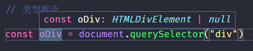

没有加类型的会自动加上类型，进行校验

* 校验
* 更好的提示

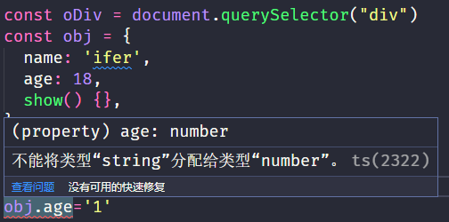

最佳实践

* 推荐：代码写熟了之后，有类型推论的情况下可以省略类型注解，充分利用 TS 类型推论的能力，提升开发效率
* 技巧：如果不知道类型，可以通过鼠标放在变量名称上，利用 VSCode 的提示来查看类型
* 建议：在 VSCode 中写代码的时候，多看方法、属性的类型，养成写代码看类型的习惯，例如 `const oDiv = document.createElement('div')`

# 12. 字面量类型

## 12.1. 基本使用

下面两种写法的区别

1. let 声明变量（string 类型的范围就很广）

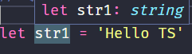

2. const 声明变量（字面量类型就限制死了，不能改）下面是字符串字面量类型

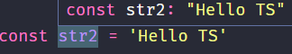

补充，下面这样 let 实际上就模拟了const 的效果

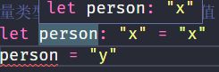

通过 TS 类型推论机制，可以得到答案：变量 str1 的类型为：string，变量 str2 的类型为：’Hello TS’。

* str1 是一个变量，它的值可以是任意字符串，所以类型为：string。
* str2 是一个常量，它的值不能变化只能是 ‘Hello TS’，所以，它的类型为：’Hello TS’（字符串字面量类型）。
* 注意：此处的 ‘Hello TS’，就是一个**字符串字面量类型**，也就是说某个特定的字符串也可以作为 TS 中的类型。
* 任意的 JS 字面量都可以作为类型使用，例如 `{ name: 'jack' }`、`[]`、`18`、`'abc'`、`false`、`function() {}` 等。

## 12. 使用场景

**字面量类型常配合联合类型一起使用**

使用场景：用来表示一组明确的可选值列表，比如在贪吃蛇游戏中，游戏方向的值只能是上、下、左、右中的一个

```ts
type Direction = 'up' | 'down' | 'left' | 'right'
function changeDirection(direction: Direction) {
    console.log(direction)
}
changeDirection('up') // 调用函数时，会有类型提示
```

参数 direction 的值只能是 up/down/left/right 中的任意一个

优势：**相比于 string 类型，使用字面量类型更加精确、严谨**

其他应用场景，性别和 Redux 中的 Action 等等

```tsx
type Gender = '男' | '女'
const zs: Gender = '男'

// redux 中的 actinos，这样就不再需要常量了
type Action = {
    type: 'TODO_ADD' | 'TODO_DEL' | 'TODO_CHANGE' | 'TODO_FIND'
}

function reducer(state, action: Action) {
    switch (action.type) {
        case 'TODO_ADD': // 这里会自动具有提示
    }
}
```

# 13. 枚举类型

## 13.1. 基本介绍

* 枚举的功能类似于**字面量类型+联合类型组合**的功能，也可以表示一组明确的可选值。
* 枚举：定义一组命名常量，它描述一个值，该值可以是这些命名常量中的一个。
* 使用 `enum` 关键字定义枚举，约定枚举名称以大写字母开头。
* 枚举中的多个值之间通过 `,`（逗号）分隔，定义好枚举后，直接使用枚举名称作为类型注解

> 一个重要的点：**每个枚举值之间必须要加逗号，枚举可以当做值去使用**
>
> 注意枚举 `emun`和接口`interface`一样，没有等号赋值的说法，直接定义一个对象

编译之后，并不会删掉枚举，类型会被删掉

需要传入枚举的值（下面可以是 Direction.up 或者 0，不能写 Up）

```ts
// 创建枚举（这样写就是数字枚举）
enum Direction {
    Up,
    Down,
    Left,
    Right,
}

// 可以当做类型使用枚举
// direction 只能是枚举中的四个值
function changeDirection(direction: Direction) {
    console.log(direction)
}

// 也可以当做值使用枚举
// 调用函数时，需要传入：枚举 Direction 成员的任意一个，类似于 JS 中的对象，直接通过点（.）语法 访问枚举的成员
changeDirection(Up) // 报错，需要传入枚举的值
changeDirection(0) // 值为 0
changeDirection(Direction.Up) // 值为 0
console.log(Direction.Up) // 0

console.log(Direction["0"]) // Up
```

> 枚举类型的习惯以大写的`E`开头，比如`EDirection`

## 13.2. 数字枚举

* 问题：我们把枚举成员作为了函数的实参，它的值是什么呢?
* 解释：通过将鼠标移入 Direction.Up，可以看到枚举成员 Up 的值为 0
* 注意：枚举成员是有值的，默认为：从 0 开始自增的数值
* 我们把枚举成员的值为数字的枚举称为：`数字枚举`
* 当然，也可以通过“等号”给枚举中的成员指定初始值，如下所示

```ts
// Down -> 11、Left -> 12、Right -> 13
enum Direction {
    Up = 10,
    Down,
    Left,
    Right,
}

enum Direction {
    Up = 2,
    Down = 4,
    Left = 8,
    Right = 16,
}
console.log(Direction['Up']) // 2
// 也可以反向操作
console.log(Direction[2]) // Up
```

## 13.3. 字符串枚举

我们把枚举成员的值为字符串的枚举称为：`字符串枚举`

注意：字符串枚举没有自增长行为，因此，**字符串枚举的每个成员必须有初始值**。

```ts
enum Direction {
    Up = 'UP',
    Down = 'DOWN',
    Left = 'LEFT',
    Right = 'RIGHT',
}
```

使用场景

```ts
enum Gender {
    女,
    男,
}
type User = {
    name: string
    age: number
    // gender: '男' | '女' // 但后台需要 0 和 1
    gender: Gender
}

const user: User = {
    name: 'ifer',
    age: 18,
    gender: Gender.男,
}
```

## 13.4. 枚举作为值使用的注意点

枚举甚至可以直接用汉字，然后直接点语法取值

```ts
// 数字枚举
enum Direction = {
    Up,
    Down,
    Left,
    Right,
}
console.log(Direction.Up)// 0 ,后面的分别为 1 2 3

// 字符串枚举
// 第一个写了字符串，后面的也一定要写上初始值，不然报错
enum Direction = {
    Up ="u",
    Down="d",
    Left="l",
    Right="r",
}

//第一个也可以不写
enum Direction = {
    Up,
    Down="d",
    Left="l",
    Right="r",
}
console.log(Direction.Up)// 0 不写的话第一个就是 0
```

## 13.5. 枚举原理

枚举获取值，**可以正向获取，也可以反向获取**的原理如下

index.ts

```ts
// 创建枚举
enum Direction {
  Up,
  Down,
  Left,
  Right,
}

// 可以当做类型使用枚举
function changeDirection(direction: Direction) {
  console.log(direction)
}

// 也可以当做值使用枚举
// 调用函数时，需要传入：枚举 Direction 成员的任意一个，类似于 JS 中的对象，直接通过点（.）语法 访问枚举的成员
changeDirection(Direction.Up)

```

编译后，index.js（注意赋值语句的返回值，a = 4 的返回值是 4）

```js
// 创建枚举
var Direction;
(function (Direction) {
    Direction[Direction["Up"] = 0] = "Up";
    Direction[Direction["Down"] = 1] = "Down";
    Direction[Direction["Left"] = 2] = "Left";
    Direction[Direction["Right"] = 3] = "Right";
})(Direction || (Direction = {}));
// 可以当做类型使用枚举
function changeDirection(direction) {
    console.log(direction);
}
// 也可以当做值使用枚举
// 调用函数时，需要传入：枚举 Direction 成员的任意一个，类似于 JS 中的对象，直接通过点（.）语法 访问枚举的成员
changeDirection(Direction.Up);

```

# ==14. 类型断言==

有时候你会比 TS 更加明确一个值的类型，此时可以使用类型断言来指定更具体的类型，比如根据 ID 选择 a 标签

```ts
// 注意 document.querySelector('a') 这种写法会自动推断出是 HTMLLinkElement 类型 或者 null 类型0
const oLink = document.getElementById('link')

//该方法返回的类型是 HTMLElement，该类型只包含所有标签公共的属性或方法，不包含 a 标签特有的 href 等属性，这个类型太宽泛（不具体），无法操作 href 等 a 标签特有的属性或方法

// 解决方法：这种情况下就需要使用类型断言指定更加具体的类型
// 方式一：借助 as 关键字
const oLink = document.getElementById('link') as HTMLAnchorElement
// 方式二：使用断言来指定（因为会和 jsx 产生冲突，用得少，多数情况用 as）
const oLink = <HTMLAnchorElement>document.getElementById('link')
```

说明：

* 使用 `as` 关键字实现类型断言
* 关键字 as 后面的类型是一个更加具体的类型（HTMLAnchorElement 是 HTMLElement 的子类型）
* 通过类型断言，oLink 的类型变得更加具体，这样就可以访问 a 标签特有的属性或方法了

> 技巧：打开浏览器控制台，选中标签，通过 `$0.__proto__` 可以获取 DOM 元素的类型

类型断言 从可能的类型（根据类型推断）中断言一下，断定它是什么类型（就是你比 ts 更清楚这个变量的类型）

不确定的类型才能进行类型断言，不能 `string as  number` ，但可以断言 unknown 为 number，可以 `string as unknown as number`

> 平常使用的只用 as ，不会使用泛型的方式去断言。**注意断言是针对有不确定类型的变量来说的。使用：变量 as xxx**

```ts
const b = a as string[]
// 使用泛型来指定断言，在值前面加 <>
// 可以这样写
const b = <Array<string>> a
// 或者
const b= <string[]> a
```

# 15. typeof

JS 中的 typeof 可以在运行时判断类型，TS 中的 typeof 可以在编译时获取类型

在类型注解或者结合 type 关键字来使用，ts 会当做获取类型来使用（并不是 js 中的类型判断）

> 类型不能 log 出来，因为在编译成 js 代码之后，这些类型会被干掉。可以打印表示可以当做值来处理，注意类型不能当做值来使用（枚举除外）

```ts
interface Person {
    name: string
    age: number
}
const person: Person = { name: 'ifer', age: 18 }

// 获取 person 的类型，得到的就是 Person 接口类型
type p = typeof person
```

应用场景：根据已有变量的值，获取该值的类型，来简化类型书写

```ts
const p = { x: 1, y: 2 }
function formatPoint(point) {} // 没有提示
function formatPoint(point: { x: number; y: number }) {} // 有提示，写法麻烦

// 使用 `typeof` 操作符来获取变量 p 的类型，结果与上面对象字面量的形式相同
function formatPoint(point: typeof p) {} // 推荐
```

> 注意 typeof **出现在类型注解的位置**（参数名称的冒号后面，区别于 JS 代码）

一个小问题

```ts
const p = {x: 1 , y: 2}

function fn(point: {x:1 , y:2}){}
fn(p)// 这样会报错，因为类型推断的 p 的属性是 number 类型，比较广泛
```

# 16. keyof

作用：获取**接口**、**对象**（配合 typeof）、**类**等的所有**属性名**（字面量）组成的联合类型（获取类型的 key 组成字符串联合类型）

as 是对于值来说的，keyof 是对于类型来说的

```ts
// 接口
interface Person {
    name: string
    age: number
}
type K1 = keyof Person // "name" | "age"
type K2 = keyof [] // "length" | "toString" | "pop" | "push" | "concat" | "join" 等等

// 对象（要配合 typeof 才能使用）
const obj = { name: 'ifer', age: 18 }
/* type newobj = typeof obj
type keyofObj = keyof newobj // "name" | "age" */

// 简写
type keyofObj = keyof typeof obj // "name" | "age"
let s1: keyofObj = 'name' // ok
let s2: keyofObj = 'xxx' // error

// 下面的了解即可

// 类
class User {
    // constructor(public username: string, public age: number) {}
    public username: string
    public age: number
    constructor(username: string, age: number) {
        this.username = username
        this.age = age
    }
}

type UserInfo = keyof User // "username" | "age"
const s: UserInfo = 'username' // ok

// 基本类型
type K1 = keyof boolean // 'valueOf'
type T2 = keyof number // 'toString' | 'toFixed' | ...
type T3 = keyof any // string | number | symbol

// 枚举
enum HttpMethod {
    GET,
    POST,
}
// 先获取数字枚举的类型 { GET: number, POST: number }
type Method = keyof typeof HttpMethod // 'GET' | 'POST'
```

# 18. 特殊类型

## 18.1. any

**原则：不推荐使用 any！这会让 TypeScript 变为 “AnyScript”（失去 TS 类型保护的优势）**

原因：当值的类型为 any 时，可以对该值进行任意操作，即使可能存在错误，并且不会有代码提示

```ts
let num: any = 8 // 任意类型，不对类型进行校验
num.toFixed() // 没有提示
num = 'xxx' // 可以赋任意值（即可以把任意值给 any 类型）

const a = 9 as any // 可以把 any 赋给任意类型
```

> 尽可能的避免使用 any 类型，除非临时使用 any 来“避免”书写很长、很复杂的类型，或者有些参数就是可以使用任何类型，例如 `console.log()`

其他隐式具有 any 类型的情况（因为不推荐使用 any，所以下面两种情况下都应该提供类型）

* 声明变量不提供类型也不提供默认值
* 函数参数不加类型

```ts
// 空对象类型，没啥意义，就相当于什么都不校验
let a: {} = []// 后面都可以写，啥都不校验

// 和 any 不一样，any 可以给任意类型
const b:number = a // 报错
```

## 18.2. unknown

unknown: 任意类型，**更安全的 any 类型**

原因：由于不知道是什么类型，所以方法什么的不能乱用

```ts
let num: unknown = 88
num = 'abc'
console.log(num)
num() // error: 不能调用方法
console.log(num.length) // error: 不能访问属性
```

通常使用**类型收窄**来处理 unknown 类型（通过判断类型来执行什么操作）

```ts
// 使用类型收窄处理 unknown
// 方式一：使用 if 条件判断类型
let num: unknown = 88
if (typeof num === 'string') {
    console.log(num.length)
} else if (typeof num === 'function') {
    num()
}

// 方式二：使用断言来确定类型
let num: unknown = 88
let len = (num as string).length
console.log(len)

// 并不是所有的类型都可以进行收窄
let num = 'hello' // num 的类型已经确定就是 string 类型
if (typeof num === 'string') {
    console.log(num.length)
} else if (typeof num === 'function') {
    // 如果再等于了 function 类型，那是不可能的，所以 num 被推断为了 never 类型
    num() // Error
}
```

不确定的类型才能进行类型断言，不能 `string as  number` ，但可以断言 unknown 为 number，可以 `string as unknown as number`

## 18.3. any 和 unknown 的比较

1. 任何类型可以给 any（断言指定类型），any 也可以赋值给任何类型的变量

   ```ts
   let temp: any = 'hello'
   let str: string = temp // ok
   ```

2. 任何类型可以给 unknown（断言指定类型），unknown 只能赋值给 unknown 或 any 类型

   ```ts
   let temp: unknown = 'hello'
   // 把一个不知道的类型给了 string 类型的变量 str
   // let str: string = temp // error
   
   // 解决，配合类型断言
   let str: string = temp as string // ok
   ```

**问题：如何把 string 类型的变量赋值给 number 类型？**

```ts
// 错误
let temp: string = '888'
// 把 string 类型的变量给了 number 类型的变量 num，显然是有问题的
let num: number = temp

// 正确
let temp: string = '888'
// 先断言为 any，利用 any 可以给任何类型的特点
let num: number = temp as any

// 正确
let temp: string = '888'
// 不能直接断言 string 为 number，但可以断言 unknown 为 number
let num: number = temp as unknown as number
```

unknown 配合 类型断言要小心（一定是你比 ts 更加清楚这个变量的类型）。**任意类型可以断言为 unknown**

## 18.4. never

不可能实现的类型

```ts
type Test = number & string

// 也可以当做函数的返回值，表示不会执行到头
function test(): never {
    throw new Error('Error')
}
// 函数无返回值是 void
```

## 18.5. null 和 undefined

 undefined 和 null 是其他类型的子类型，也就是可以作为其他类型的值存在

```js
let timer = null
// 下面报错 不能把 number 类型赋值给 null 类型
timer = 2

let zs = undefined
// 下面报错 不能把 null 类型赋值给 undefined 类型
zs = null

// 默认情况下不会对 nulL 和 undefined 进行类型检测
// 通过 tsc --init 命令可以生成配置文件
// 通过 strictNullChecks 指定为 true 可以开启对 null 和 undefined 的检测（作为任意类型的子类型）

// 即便开启了检测，当 null 赋值给某个变量时，这个变量会被推断为 any 类型
// 通过 noImplicitAny 指定为 false 可以禁用 any 类型，此时 null 赋值给某个变量时将会是 null 类型
```

# 19. 函数重载

需求：改造下面的函数，输入 [‘a’, ‘b’, ‘c’]，输出 [‘Hello a’, ‘Hello b’, ‘Hello c’]

```ts
function greet(name: string): string {
    return `Hello ${name}`
}
```

解决：

```ts
//1.使用联合类型搭配断言来实现
function greet(name: string | string[]): string | string[] {
    // 这里的 typeof 是 js 里面的类型判断
    if (typeof name === 'string') {
        return `Hello ${name}`
    } else if (Array.isArray(name)) {
        return name.map((name) => `Hello ${name}`)
    }
    throw new Error('异常')
}
const r = greet(['a', 'b', 'c'])
console.log(r)

// 结果使用断言指定返回值类型
const a = greet(["a", "b", "c"]) as string[] // 开发最常用 as 来进行断言
// const a = <Array<string>>greet(["a", "b", "c"])
// const a = <string[]>greet(["a", "b", "c"])

// 2.使用函数重载
// 一个函数可以有多个重载签名
// 重载签名：包含了函数的参数类型和返回值类型，但不包含函数体
function greet(name: string): string
function greet(name: string[]): string[]

// 一个函数只能有一个实现签名
// 实现签名：参数和返回值要覆盖上面的情况（更通用），且包含了函数体（通常使用 unknown）
function greet(person: unknown): unknown {
    if (typeof name === 'string') {
        return `Hello ${name}`
    } else if (Array.isArray(name)) {
        return name.map((name) => `Hello ${name}`)
    }
    throw new Error('异常')
}

console.log(greet(['a', 'b', 'c']))
```

# ==20. 关于泛型==

## 20.1. 什么是泛型

**泛型的定义：定义时宽泛、不确定的类型，需要使用者去主动传入**（用于函数定义泛型的类型变量，使用者调用传入具体类型）

> 用户输入的类型是不确定的，如果输出结果需要根据用户输入的类型来决定，就需要使用泛型
>
> 可以进行泛型约束（更具体或者 extends 关键字）

需求：创建一个 id 函数，传入什么数据类型就返回该数据类型本身（也就是说，参数和返回值类型相同）

```ts
// id(10) 调用以上函数就会直接返回 10 本身，但是，该函数只接收数值类型，无法用于其他类型
function id(value: number): number {
    return value
}

// 为了让函数能够接受任意类型，可以将参数类型修改为 any，但是，这样就失去了 TS 的类型保护，类型不安全
function id(value: any): any {
    return value
}

// 可以尝试一个个定义（使用函数重载来实现），但是类型太多了话，不太方便
function id(value: string | number) {
   return value
}
```

## 20.2. 泛型函数

* 语法：在函数名称的后面添加 `<>`（尖括号），**尖括号中添加类型变量**

* 类型变量：一种特殊类型的变量，它处理类型而不是值，比如下面案例中的 Type

* 该类型变量相当于一个类型容器，能够捕获用户提供的类型（具体是什么类型由用户调用该函数时指定）

* 因为 Type 是类型，因此可以将其作为函数参数和返回值的类型，表示参数和返回值具有相同的类型

* 类型变量 Type，可以是任意合法的变量名称，一般简写为 T

```ts
function id<T>(value: T): T {
    return value
}

// 调用
// 如果传入类型 string，函数 id 参数和返回值的类型就都是 string
id<string>("2")

const num = id<number>(10)
const str = id<string>('a')
```

这样，通过泛型就做到了让 id 函数与多种不同的类型一起工作，**实现了复用的同时保证了类型安全**

> 泛型参数默认值：`function id<T = xx>()`跟函数参数默认值一样，xx 为 T 的默认类型值

## 20.3. 简化泛型函数的调用

* 在调用泛型函数时，**可以省略 `<类型>` 来简化泛型函数的调用**
* 此时，TS 内部会采用一种叫做**类型参数推断**的机制，来根据传入的实参自动推断出类型变量 Type 的类型
* 比如，传入实参 10，TS 会自动推断出变量 num 的类型 number，并作为 T 的类型
* 推荐：使用这种简化的方式调用泛型函数，使代码更简短，更易于阅读
* 说明：**当编译器无法推断类型或者推断的类型不准确时，就需要显式地传入类型参数（鼠标悬停了看一下）**

```ts
let num = id(10) // 省略 <number> 调用函数
let str = id('a') // 省略 <string> 调用函数
```

泛型调用的时候，类型推断

```ts
function id<T>(num:T):T {
    return num
}
// 调用
id(8)// 这样会直接推断为 8 数字字面量类型
// 改写
let num = 8
id(num) // 这样就推断成了 number 类型
```

## 20.4. 泛型约束

泛型函数的类型变量 T 可以代表任意类型，这导致访问泛型类型定义的数据属性时会没有提示，或者报错

例如：`id('a')` 调用函数时获取参数的长度

```ts
function id<T>(value: T): T {
    console.log(value.length) // Property 'length' does not exist on type 'Type'
    return value
}

id(['a', 'b'])
```

原因：T 可以代表任意类型，无法保证一定存在 length 属性，比如 number 类型就没有 length

解决：需要为泛型添加约束来收缩类型（缩窄类型取值范围）

主要有以下两种解决方式

### 20.4.1. 指定更加具体的类型

将类型修改为 `T[]`（Type 类型的数组），因为只要是数组就一定存在 length 属性，因此就可以访问了

```ts
// 其实泛型 T 约束的是数组里面的元素
function id<T>(value: T[]): T[] {
    console.log(value.length)
    return value
}

id<string>(['a', 'b'])
```

### 20.4.2. 通过 extends 关键字配合 interface（或者直接写） 来添加约束（常用）

创建描述约束的接口 ILength，该接口要求提供 length 属性，通过 `extends` 关键字使用该接口，为泛型（类型变量）添加约束

该约束表示：**传入的类型必须具有 length 属性**

意思就是：泛型必须要满足什么（翻译成继承也可以，继承什么的类型）

```ts
interface ILength {
    length: number
}

// T extends ILength 添加泛型约束
// 表示传入的类型必须满足 ILength 接口的要求才行，也就是得有一个 number 类型的 length 属性
function id<T extends ILength>(value: T): T {
    console.log(value.length)
    return value
}

id('abc')
id(['a', 'b', 'c'])
id({ length: 8 })

// T 也可以 extends 字面量类型 满足什么的要求 也就是得有一个 number 类型的 length 属性
function id<T extends { length: number }>(value: T): number {
    return value.length
}
```

## 20.5. 多个类型变量

泛型的类型变量可以有多个，并且**类型变量之间还可以约束**（比如第二个类型变量受第一个类型变量约束）

```ts
// 创建一个函数来获取对象中属性的值 T - Type  K - Key
// keyof T 这里表示 "name" | "age"
function getProp<T extends { name: string, age: number }, K extends keyof T>(obj: T, key: K) {
    return obj[key]
}
let person = { name: 'jack', age: 18 }
getProp(person, 'name')
```

1. 添加了第二个类型变量 K，两个类型变量之间使用 `,` 逗号分隔
2. keyof 关键字接收一个对象类型，生成其键名称的联合类型，例如这里也就是：`'name' | 'age'`
3. 类型变量 K 受 T 约束，即 K 只能是 T 所有键中的任意一个，或者说只能访问对象中存在的属性

注意下面写法是错误的（传进来的 T 是不确定的，参数是不确定的， T 根据类型推断来的）

```ts
function getProp<T, K extends keyof { name: string; age: number }>(obj: T, key: K) {
    // type 'K' cannot be used to index type 'T'.
    // 原因：因为 T 是泛型，什么类型都有可能，而 'name' | 'age' 并没有和 T 产生关系
    return obj[key]
}
let person = { name: 'jack', age: 18 }
// let person = { aaa: 'jack', bbb: 18 } 这样就错了
getProp(person, 'name')
```

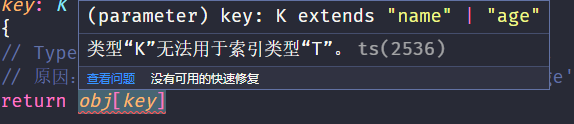

## 20.6. 泛型接口

**接口也可以配合泛型来使用，以增加其灵活性，增强其复用性**

```ts
interface User<T> {
    name: T
    age: number
}
const user: User<string> = {
    name: 'ifer',
    age: 18,
}
```

下面是一个例子

```ts
interface IdFunc<Type> {
    id: (value: Type) => Type // 接收什么类型，返回什么类型
    ids: () => Type[] // 返回值是，根据接收到的类型组成的数组
}

// 定义变量时调用该类型
let obj: IdFunc<number> = {
    id(value) {
        return value
    },
    ids() {
        return [1, 3, 5]
    },
}
```

1. 在接口名称的后面添加 `<类型变量>`，那么，这个接口就变成了泛型接口
2. 接口的类型变量，对接口中所有其他成员可见，也就是**接口中所有成员都可以使用类型变量**
3. 使用泛型接口时，**需要显式指定具体的类型**（比如，此处的 `IdFunc<number>`）（泛型函数调用可以简化，不写类型，直接类型推断即可）
4. 此时，id 方法的参数和返回值类型都是 number，ids 方法的返回值类型是 `number[]`

> 对象的 key 可以是 string、number、symbol or a template literal type（模板字符串）
>
> 对象取值可以中括号加变量取值

使用泛型去定义数组的类型

```ts
// 常用数组定义 const arr: number[] = [1, 2, 3]
// 这其实也是通过泛型接口的形式来定义的数组类型
const arr: Array<number> = [1, 2, 3]
                            
// 模拟实现一下自己的 number[]
interface IArray<T> {
  // key 是自己命名的变量
  [key: number]: T                            
}
const arr: IArray<number> = [1, 2]
arr[1] // 去取键为 1 的值
```

## 20.7. 泛型工具类型

泛型工具类型：TS 内置了一些常用的工具类型，来简化 TS 中的一些常见操作

它们都是基于泛型实现并且是内置的，可以直接在代码中使用，这些工具类型有很多，主要学习以下几个

* `Partial<T>`
* `Readonly<T>`
* `Pick<T, Keys>`

语法：`type NT = 关键字<T>`（NT 为新类型，T 为旧类型）

### Partial

Partial 用来构造（创建）一个类型，将 Type 的所有属性设置为可选（使用`?:`可以设置单个属性为可选）

```ts
type Props = {
    id: string
    children: number[]
}

// 构造出来的新类型 PartialProps 结构和 Props 相同，但所有属性都变为可选的啦
type PartialProps = Partial<Props>

// 原理
// keyof 获取类，对象，接口的所有属性名组成的联合类型
// in 表示遍历，一般用于联合类型
type MyPartial<T> = {
    [P in keyof T]?: T[P]
}
```

### Readonly

Readonly 用来构造一个类型，将 Type 的所有属性都设置为 readonly（只读）（单独加，在属性前面加 readonly 就可以）

当我们想给 id 属性重新赋值时，就会报错：无法分配到 “id”，因为它是只读属性

```ts
type Props = {
    id: string
    children: number[]
}
// 构造出来的新类型 ReadonlyProps 结构和 Props 相同，但所有属性都变为只读的啦
type ReadonlyProps = Readonly<Props>

let props: ReadonlyProps = { id: '1', children: [] }
props.id = '2' // Cannot assign to 'id' because it is a read-only property
```

### Pick

* Pick<T, Keys> 从 T 中选择一组属性来构造新类型
* Pick 工具类型有两个类型变量，1. 表示选择谁的属性，2. 表示选择哪几个属性
* 第二个类型变量传入的属性只能是第一个类型变量中存在的属性
* 构造出来的新类型 PickProps，只有 id 和 title 两个属性类型

```ts
interface Props {
    id: string
    title: string
    children: number[]
}
// 摘出 id 和 title
type PickProps = Pick<Props, 'id' | 'title'>
```

Omit，和 Pick 相反，表示排除的意思

```ts
// 排除 id 和 title
type OmitProps = Omit<Props, 'id' | 'title'>
```

# 21. 创建新项目

* 命令：`npx create-react-app my-app --template typescript`

* 说明：在命令行中，添加 `--template typescript` 表示创建支持 TS 的项目

* 项目目录的变化

  1. 在项目根目录中多了一个 TS 配置文件：`tsconfig.json`，也可以通过 `tsc --init` 生成。说明：所有的配置项都可以通过鼠标移入的方式，来查看配置项的解释说明，[配置说明](https://www.typescriptlang.org/tsconfig)

  2. 在 src 目录中，文件的后缀有变化，由原来的 .js 变为 `.ts` 或 `.tsx`（使用了 jsx 模板，后缀名必须叫 tsx）

  3. 在 src 目录中，多了 `react-app-env.d.ts` 类型声明文件，用来指定 node、react、react-dom 库的类型（此文件引用特定于使用Create React App启动的项目的TypeScript类型声明，这些类型声明添加了对导入资源文件的支持，如bmp、gif、jpeg、jpg、png、webp和svg，它还添加了对导入CSS模块的支持。这与导入扩展名为.module.css、.module.scss和.module.sass的文件有关）

# 22. 类型声明文件

> `.ts`可以声明类型和可执行代码，类型只能作用于`.ts`文件
>
> `.d.ts`只能声明类型（使用 declare 关键字），类型可以作用与`.js`和`.ts`文件

## 22.1. 基本介绍

几乎所有的 JavaScript 应用都会引入许多第三方库来完成任务需求，这些第三方库不管是否是用 TS 编写的，最终都要编译成 JS 代码，才能供开发者使用

* 我们知道是 TS 提供了类型，才有了代码提示和类型保护等机制，但在项目开发中使用第三方库时，你会发现它们几乎都有相应的 TS 类型（有很多提示），这些类型（或提示）是怎么来的呢？
* 答案：**类型声明文件**（文件后缀名为`.d.ts`），用来为已存在的 JS 库提供类型信息

ts 和 .d.ts 文件类型的区别？

1. `.ts` 文件：**既可以包含类型信息又可以包含可执行代码**
   *  可以被编译为 .js 文件，然后执行代码
   * 用途：编写程序代码的地方

2. `.d.ts` 文件：**只包含类型信息的类型声明文件**
   * 不会生成 `.js` 文件，仅用于提供类型信息，在 `.d.ts` 文件中不允许出现可执行的代码，只用于提供类型
   * 用途：为 JS（可以作用于 ts 或者 js 文件，最终都编译成了 js 文件） 提供类型信息

> 总结：`.ts` 是 implementation（代码实现文件），`.d.ts`是 declaration（类型声明文件），如果要为 JS 库提供类型信息，需要使用`.d.ts` 文件
>
> `.tsx`是用来写 jsx 的文件，即 ts 文件需要用到 jsx 语法，需要把文件后缀名改成`.tsx`

## 22.2. 内置文件

TS 为 JS 所有标准化内置 API 都提供了类型声明文件，比如在使用数组时，数组所有方法都会有相应的代码提示以及类型信息

* 比如，查看 forEach 方法的类型声明，通过 Ctrl + 鼠标左键，在 VSCode 中会自动跳转到 `lib.es5.d.ts` 类型声明文件中
* 当然，像 window、document 等 BOM、DOM API 也都有相应的类型声明（`lib.dom.d.ts`）

```ts
const strs = ['a', 'b', 'c']
// 鼠标放在 forEach 上查看类型
strs.forEach
```

## 22.3. 第三方库

目前，几乎所有常用的第三方库都有相应的类型声明文件

第三方库的类型声明文件有两种存在形式，分别是库自带类型声明文件或者由 [DefinitelyTyped](https://github.com/DefinitelyTyped/DefinitelyTyped/) 提供

1. 库自带类型声明文件：比如，axios，通过查看 `node_modules/axios` 目录可以发现 `index.d.ts` 类型定义文件，这种情况下只需要正常导入该库，**TS 就会自动加载库自己的类型声明文件**，提供该库的类型声明。

2. 由 DefinitelyTyped 提供
   * DefinitelyTyped 是一个 Github 仓库，用来提供高质量 TypeScript 类型声明。
   * 可以通过 npm/yarn 来下载该仓库提供的 TS 类型声明包，这些包的名称格式为:`@types/*`
   * 比如，@types/react、@types/lodash 等
   * 说明：在实际项目开发时，如果你使用的第三方库没有自带的声明文件，VSCode 会给出明确的提示

当安装 `@types/*` 类型声明库后，**TS 也会自动加载该类声明库**，可以通过此[链接](https://www.typescriptlang.org/dt)来查询 @types/* 库

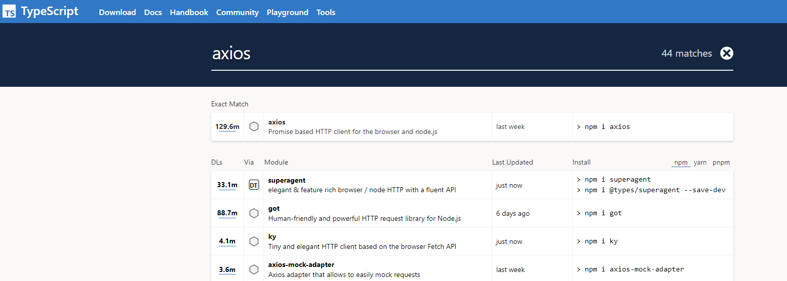

## 22.4. 自己定义

> 类型声明文件中声明函数不推荐使用单独声明，推荐使用整体声明

`utils/index.js`

```js
let count = 10
let songName = '痴心绝对'
let position = {
    x: 0,
    y: 0,
}

function add(x, y) {
    return x + y
}

function changeDirection(direction) {
    console.log(direction)
}

const fomartPoint = (point) => {
    console.log('当前坐标：', point)
}

export { count, songName, position, add, changeDirection, fomartPoint }
```

### 方法 1：将 js 文件改成 ts 文件，并修改成 ts 代码（很麻烦）

```ts
// #1
type Position = {
    x: number
    y: number
}
// #2
type Direction = 'top' | 'down' | 'left' | 'right'

let count = 10
let songName = '痴心绝对'
// #3
let position: Position = {
    x: 0,
    y: 0,
}

// #4
function add(x: number, y: number): number {
    return x + y
}

// #5
function changeDirection(direction: Direction) {
    console.log(direction)
}

// #6
const fomartPoint = (point: Position) => {
    console.log('当前坐标：', point)
}

export { count, songName, position, add, changeDirection, fomartPoint }
```

### 方法 2：定义类型声明文件 `index.d.ts`，无需改动原来的代码

```ts
declare let count: number

declare let songName: string

interface Position {
    x: number
    y: number
}

declare let position: Position

declare function add(x: number, y: number): number

type Direction = 'left' | 'right' | 'top' | 'down'

declare function changeDirection(direction: Direction): void

type FomartPoint = (point: Position) => void

declare const fomartPoint: FomartPoint

export { count, songName, position, add, changeDirection, FomartPoint, fomartPoint }
```

推荐：如果多个 `.ts` 文件中都用到同一个类型，此时可以创建 `.d.ts` 文件提供该类型，实现类型共享

declare 关键字，用于类型声明，为其他地方（比如 .js 文件）已存在的变量声明类型，而不是创建一个新的变量。

* 对于 type、interface 等这些明确就是 TS 类型的（只能在 TS 中使用的），可以省略 declare 关键字。

* 对于 let、function 等具有双重含义（在 JS、TS 中都能用），应该使用 declare 关键字，明确指定此处用于类型声明

## 22.5. 自己定义操作步骤

1. 创建 `index.d.ts` 类型声明文件。
2. 通过 **declare** 关键字创建需要共享的类型，最后使用 export 统一导出。
3. 通过 import 正常导入 JS/TS 文件即可，TS 内部会自动加载与之同名的 .d.ts 文件

```ts
// utiles/index.js 中定义了 add 方法

// 没有 index.d.ts 的效果
import { add } from './utils'
add(8, '3') // 无警告，add(x: any, y: any): any

// 添加 index.d.ts 后的效果
import { add } from './utils'
add(8, '3') // add(x: number, y: number): number
```

