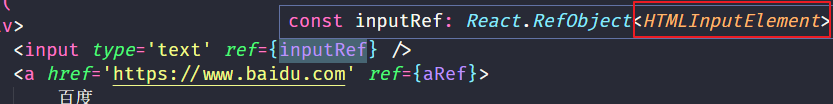
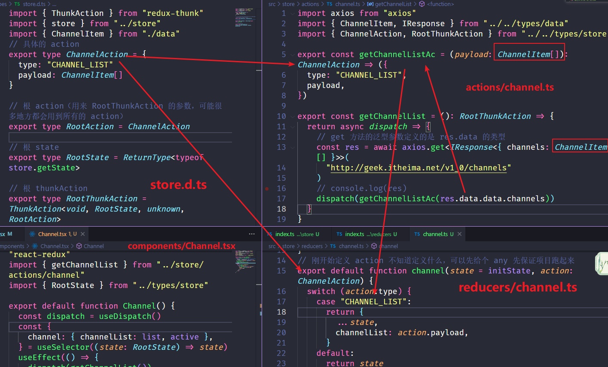

# 1. useState

`useState` 接收一个泛型参数，**用于指定初始值的类型**

```ts
const [name, setName] = useState<string>('张三')
const [age, setAge] = useState<number>(28)
const [isProgrammer, setIsProgrammer] = useState<boolean>(true)

// 如果你在 setName 函数中的参数不符合声明的变量类型，程序会报错
<button onClick={() => setName(100)}>按钮</button>
```

注意：`useState` 的类型推断，在使用 useState 的时候，只要提供了初始值，TypeScript 会自动根据初始值进行类型推断，因此 `useState` 的泛型参数可以省略

# 2. useEffect

`useEffect` 是用于我们管理副作用（例如 API 调用）并在组件中使用 React 生命周期的

重点：`useEffect` 函数不涉及到任何泛型参数，在 TS 中的使用和 JS 中完全一致

```ts
// 定时器开启和关闭
useEffect(() => {
    let timer = setInterval(() => {
        console.log('哈哈哈')
    })
    return () => {
        clearInterval(timer)
    }
}, [])

// 事件的绑定和解绑
useEffect(() => {
    // 给 window 绑定点击事件
    const handleClick = () => {
        console.log('哈哈哈')
    }
    window.addEventListener('click', handleClick)

    return () => {
        // 给 window 移除点击事件
        window.addEventListener('click', handleClick)
    }
}, [])
```

# 3. 请求数据

**如果 useState 没有提供具体类型的初始值，是需要使用泛型参数指定类型的**

当然这些的数据通常要放在 redux 中进行状态管理，如果不放，需要定义一个初始状态类型，不然无法使用点语法

```ts
// 三种解决方案
// 方案一 使用 any 解决，但不建议
<ul>
    {list.map((item: any) => {
        return <li key={item.id}>{item.name}</li>
    })}
</ul>

// 方案二 给循环时的 item 指定类型
<ul>
    {list.map((item: TItem) => {
        return <li key={item.id}>{item.name}</li>
    })}
</ul>

// 方案三 给 useState 指定泛型参数（推荐）
// 解决1：给个初始值，不推荐
    // const [list, setList] = useState([{ name: 'ifer', id: 0 }])
    // 解决2：泛型参数
    // 一般复杂的类型，需要手动进行指定初始值类型，TS 没法进行推断
interface IList {
  name:string,
  id:number
}
// const [count,setCount] = useState()// 什么都不声明 泛型参数为 undefined 
// const [count,setCount] = useState({})// 泛型参数为 {}
// const [list,setList] = useState([])// 泛型参数为 never[] 后续取用 item 就会报错 
const [list,setList] = useState<IList[]>([])// 正确 <> 泛型参数定义 list 的类型，小括号里面的为list 的初始值

// 了解
interface IRes extends Array<{ id: number; name: string }> {}
```


修改之后


# 4. useRef

**使用 useRef 配合 TS 操作 DOM**

`useRef` 接收一个泛型参数，**泛型参数用于指定 current 属性的值的类型**

```ts
import { useRef } from 'react'
export default function App() {
    // 不推荐 any
    // const inputRef = useRef<any>(null)
    // 指定了 current 的类型，目的是为了让 current 有属性提示
    const inputRef = useRef<HTMLInputElement>(null)
    const aRef = useRef<HTMLAnchorElement>(null)
    const get = () => {
        // inputRef.current 可能是 null，所以用了 ?.
        console.log(inputRef.current?.value)
        console.log(aRef.current?.href)
    }
    return (
        <div>
            <input type='text' ref={inputRef} />
            <a href='https://www.baidu.com' ref={aRef}>
                百度
            </a>
            <button onClick={get}>获取</button>
        </div>
    )
}
```

使用鼠标悬停在 ref 上悬停之后可以看到 dom对象 的类型



为什么参数要是 null 或者可以是 null 呢

```ts
// 通过类型定义文件得知：参数要么是 T 类型，要么是 null
function useRef<T>(initialValue: T | null): RefObject<T>
```

# 5. 非空断言

* 如果我们明确的知道对象的属性一定不会为空，那么可以使用非空断言 `!`
* 注意：非空断言一定要确保有该属性才能使用，不然使用非空断言会导致 Bug

```ts
// 注意测试的时候要开启 strictNullChecks 模式
function show(name: string | undefined) {
    let sName: string = name // Error
}

// 解决
function show(name: string | undefined) {
    let sName: string
    if (name) {
        sName = name
    }
}

// 优化
function show(name: string | undefined) {
    // name! 意思是从 name 可能的值中断言（假定）没有 null 和 undefined
    let sName: string = name!
}

// 应用场景
import { useRef } from 'react'
export default function App() {
    const inputRef = useRef<HTMLInputElement>(null)
    const get = () => {
        // 断言 inputRef.current 不可能为空
        /* const current = inputRef.current!
        console.log(current.value) */
        console.log(inputRef.current!.value)
    }
    return (
        <div>
            <input type='text' ref={inputRef} />
            <button onClick={get}>获取</button>
        </div>
    )
}
```

注意，使用非空断言时要想明白，否则程序可能报错

```ts
const str: string | null = null
console.log(str!.length)
```

# 6. React 路由

## 6.1. useHistory

问题：

* from 没有提示和类型校验（跟写 js 没区别了）（即使是随便写的你自己定义的变量，也需要提前定义好类型，写什么才能有提示）
* 不能用 any

> 变量后面跟着`<>`并且仍然表示类型的一定是泛型接口，如`H.History<HistoryLocationState>`

seHistory 实现跳转功能，和 JS 中使用语法一致

```ts
// /pages/Home.tsx
import { useHistory } from 'react-router-dom'

export default function Home() {
    const history = useHistory()
    const login = () => {
        history.push('/login')
    }
    return (
        <div>
            <h2>Home</h2>
            <button onClick={login}>登录</button>
        </div>
    )
}

// useHistory 在跳转时可以通过 state 进行传参，并通过泛型参数来指定 state 的类型
// 记住即可，useHistory 的泛型参数用来指定编程式导航的参数 state 的类型
const history = useHistory<{ from: string }>()
const login = () => {
    history.push({
        pathname: '/login',
        state: {
            from: 'ifer',
        },
    })
}
```

写 ts 就要慢慢地想类型，如果卡住了不知道写什么类型，先用 any 或者 unknown 保证代码能跑

```ts
(location.state as any).form // 这样就不会报错了，any 想写什么就写什么
```

> 想要知道原来，可以按住 ctrl + 鼠标左键进行查看源码

## 6.2. useLocation

useLocation 接收一个泛型参数，用于指定接收 state 的类型，与 useHistory 的泛型参数对应

```ts
import { useLocation } from 'react-router-dom'

export default function Login() {
    const location = useLocation<{ from: string } | null>()
    // 直接点击登录页，没有传参会报错，所以这里用了可选链操作符 ?.
    return <div>Login: {location.state?.from}</div>
}
```


优化：因为 useLocation 和 useHistory 都需要指定 Location 类型，因此可以将类型存放到通用的类型声明文件中，`src/types/data.d.ts`

```ts
// Tip: 这里明确或了一个 null，当后面再书写 location.state.from 的时候，.from 的前面会自动加上 ? 号
export type LocationState = {
    from: string
} | null

// src/types/data.d.ts
import { useLocation } from 'react-router-dom'
import { LocationState } from '../types'

export default function Login() {
    const location = useLocation<LocationState>()
    return <div>Login: {location.state?.from}</div>
}
```

> data.d.ts 和 store.d.ts 使我们自己定义的类型声明文件，并不是同第三库一样的同名文件，需要我们额外的进行 export 使用

## 6.3. useParams

useParams 接收一个泛型参数，用于指定 params 对象的类型

```ts
// App.tsx
import { BrowserRouter as Router, Link, Route } from 'react-router-dom'
import Article from './Article'

export default function App() {
    return (
        <div>
            <Router>
                <nav>
                    <Link to='/article/1'>文章1</Link>
                    <Link to='/article/2'>文章2</Link>
                </nav>
                <Route path='/article/:id' component={Article} />
            </Router>
        </div>
    )
}

// pages/article.tsx
import { useParams } from 'react-router'
export default function Article() {
    const params = useParams<{ id: string }>()
    return <div>Article: {params.id}</div>
}
```


> 总结：定义任何变量之前都需要写定义类型，不要可能会报错，没有提示，失去了 ts 的意义

# 7. TodoList

写到哪写不下去，就反过来去定义类型？比如 item 是一个 never 或者 unknown 类型 无法使用点语法

有些包之前有好好地，结果后来突然跑不起来了，去npm上找一个下载量最多的就是稳定版本

> 鼠标悬停多看看 ts 自己帮我们推导的类型
>
> 规定了类型，就不能乱写（校验），写什么都有提示（点语法）
>
> 注意写什么可以乱写的时候，说明没有定义类型，需要想清楚类型怎么定义。比如说我一个函数的返回值定义了类型那么返回值就不可以乱写了

## 7.1. useSelector 和 Rootstate

### 7.1.1. reducer 初始化

```ts
const initValue = [
    {
        id: 1,
        name: '吃饭',
        done: false,
    },
    {
        id: 2,
        name: '睡觉',
        done: true,
    },
    {
        id: 3,
        name: '打豆豆',
        done: false,
    },
]
// initState 的类型也没有定义，通常刚开始是空数组的时候需要定义类型， action 暂时给了 any
export default function todo(state = initValue, action: any) {
    return state
}
```

### 7.1.2. useSelector

```ts
// useSelector 的基本使用，接收两个泛型参数
// 泛型参数1: 指定 state 的类型，默认是 {}
// 泛型参数2: 指定函数返回值的类型
const name = useSelector<{ name: string }, string>((state) => state.name)

// 也可以不使用泛型，通过指定 state 函数参数的类型（推荐，类型推论友好）
const name = useSelector((state: { name: string }) => state.name)
```

### 7.1.3. RootState

如何准确的获取到 store 中 todo 的类型呢

```ts
// 方法一 手动指定
// src/types/store.d.ts
export type RootState = {
    todo: {
        id: number
        name: string
        done: boolean
    }[]
}

// pages/Home/index.tsx
import { useSelector } from 'react-redux'
import { RootState } from '../types/store'
export default function Home() {
    const todo = useSelector((state: RootState) => state.todo)
    console.log(todo)
    return <div>Home</div>
}
```

思考：再有其他模块时，都要这样定义，太过繁琐

解决：`typeof` 配合 `ReturnType`。`typeof` 可以获取某个数据的类型，`ReturnType` 是一个泛型工具类型，可以获取一个**函数类型**的返回值类型

```ts
// 方法二 定义 interface 接口或者 type 别名
function fn(n1: number, n2: number): number {
    return n1 + n2
}
// 获取 fn 函数的类型
type Fn = typeof fn
// 获取 Fn 函数的返回值类型
type Res = ReturnType<Fn>

// 获取 RootState 的操作 
// src/types/store.d.ts
import store from '../store'
// 注意一定是 typeof store.getState，不要忘了 typeof 操作符
export type RootState = ReturnType<typeof store.getState>
    
                                   
// 统一写法
export default function App() {
    const todos = useSelector((state: RootState) => state.todo)
    return (
        <ul>
            {todos.map((item) => (
                <li className={item.done ? 'completed' : ''} key={item.id}>
                    <span>{item.name}</span>
                    <button>x</button>
                </li>
            ))}
        </ul>
    )
}
```

## 7.2. 添加

具体的步骤

1. 有了 ts 之后，之前的常 constants 已经不需要了，需要定义 action 的类型。每一个模块需要定义的类型接口， `interface 模块名Action {}`

```ts
// types/store.d.ts
import store from '../store'
// TodoAction 后续将包含所有和 Todo 相关的 Action
export type TodoAction = {
    type: 'TODO_ADD'
    name: string
    id: number
    done: boolean
}

export type RootState = ReturnType<typeof store.getState>
```

2. reducers（会定义一个数组中 item 的类型）

```ts
// types/data.d.ts
export type TodoItem = {
    id: number
    name: string
    done: boolean
}

// reducers/todo.ts
import { TodoItem } from '../../types/data'
import { TodoAction } from '../../types/store'

// 明确指定类型，防止当数组中为空的时候报错
const initState: TodoItem[] = []
export default function todo(state = initState, action: TodoAction) {
    switch (action.type) {
        case 'TODO_ADD':
            const { type, ...rest } = action
            return [rest, ...state]
        default:
            return state
    }
}
```

3. 收集数据并添加（如果事件处理函数被抽离出来了，需要额外指定事件对象的类型，这个时候类型推导推不出来）

```ts
import { useSelector, useDispatch } from 'react-redux'
import { RootState } from './types/store'
import './App.css'
import { useState } from 'react'
import { todoAdd } from './store/actions/todo'

export default function App() {
    const dispatch = useDispatch()
    // #1
    const [name, setName] = useState('')
    const todos = useSelector((state: RootState) => state.todo)
    // #3
    const handleAdd = (e: React.KeyboardEvent<HTMLInputElement>) => {
        if (e.code === 'Enter') {
            dispatch(todoAdd(name))
            setName('')
        }
    }
    return (
        <>
            {/* #2 */}
            <input type='text' value={name} onChange={(e) => setName(e.target.value)} onKeyUp={handleAdd} />
            <ul>
                {todos.map((item) => (
                    <li className={item.done ? 'completed' : ''} key={item.id}>
                        <span>{item.name}</span>
                        <button>x</button>
                    </li>
                ))}
            </ul>
        </>
    )
}
```

指定 action 的类型，不要你 action 可以乱写，而且没有校验，没有提示，跟写 js 就一样了

## 7.3. 删除

```ts
// types/store.d.ts
// 添加action类型 同一个模块直接在后面并上就可以了
import store from '../store'

export type TodoAction =
    | {
          type: 'TODO_ADD'
          name: string
          id: number
          done: boolean
      }
    | {
          type: 'TODO_DEL' // 删除
          id: number
      }

export type RootState = ReturnType<typeof store.getState>

// 定义具体的 action
// actions/todo.ts
import { TodoAction } from '../../types/store'

export const todoDel = (id: number): TodoAction => ({
    type: 'TODO_DEL',
    id,
})                      
  
// reducers/todo.ts
import { TodoItem } from '../../types/data'
import { TodoAction } from '../../types/store'

// 明确指定类型，防止当数组中为空的时候报错
const initState: TodoItem[] = []
export default function todo(state = initState, action: TodoAction) {
    switch (action.type) {
        case 'TODO_DEL':
            return state.filter((item) => item.id !== action.id)
        default:
            return state
    }
}
```

# 8. redux-thunk

> react-redux@8.x.x 有些小 bug 使用 @7.2.8 的更加稳定 （useEffect 里面的 dispatch 会报错）
>
> ```ts
> useEffect(()=>{
>     dispatch(getChannelList())
>   },[])
> ```
>
> redux-thunk @3.x.x 的版本 里面的提示出不来，换成 @2.3.0 的就有了（action 里面的 dispatch  即异步 return 的回调里面，没有提示，但是会有警告）
>
> ```ts
> export const getChannel = (): RootThunkAction => {
>   return async (dispatch) => {
>     // get 的泛型参数其实限制的是 res.data 的类型
>     const res = await axios.get<IResponse<{ channels: ChannelItem[] }>>('http://geek.itheima.net/v1_0/channels')
>     // res.data 再往后面点的话没有提示
>     dispatch({
>       type: 'CHANNEL_SAVE',
>       payload: res.data.data.channels,
>     })
>   }
> }
> ```

写项目也可以不用 ts 写，用 js 写也可以


如何处理定义在 action 中的异步函数的返回值的类型

ThunkAction 类型的使用，[参考文档](https://redux.js.org/usage/usage-with-typescript#type-checking-redux-thunks)

```ts
// 泛型参数
// 1: 指定内部函数的返回值类型，一般是 void
// 2: 指定 RootState 的类型
// 3: 指定额外的参数类型，这里用不到，一般为 unknown 或 any，可以在配置 redux-thunk 的时候，通过 thunk.withExtraArgument('ifer') 指定
// 4: 指定 dispatch 的 action 的类型
import { ThunkAction } from 'redux-thunk'
export const todoDelAsync = (id: number): ThunkAction<void, RootState, unknown, TodoAction> => {
    // 后面三个参数是啥，看下文档
    return (dispatch, getState, extraData) => {
        // getState().todo // 因为，指定了 RootState 类型，这儿自动具有提示
        setTimeout(() => {
            dispatch(todoDel(id))
        }, 2000)
    }
}
```

不定义这个函数回调的类型，回到函数里面校验也不校验，提示也没有提示

以后的统一写法

```ts
import { ThunkAction } from 'redux-thunk'
import store from '../store'

export type TodoAction =
    | {
          type: 'TODO_ADD'
          name: string
          id: number
          done: boolean
      }
    | {
          type: 'TODO_DEL'
          id: number
      }
    | {
          type: 'TODO_CHANGE_DOEN'
          id: number
      }
export type RootAction = TodoAction // 后面可以并上别的模块的
export type RootState = ReturnType<typeof store.getState>
export type RootThunkAction = ThunkAction<void, RootState, unknown, RootAction>
```

# 9. 头条案例

1. 配置中间件，配置调试工具（store/index.ts）

2. 配置 react-redux 的 Provider（根目录下的 index.ts ）

3. reducer 中初始的 state 不能是空对象或者空数组，应该写上类型（不然通过 useSelector 拿到的返回值，类型推断后就是空对象或者空数组，无法继续下去，进行点语法什么的）

   ```ts
   interface IState {
       list: ChannelItem[]
   }
   
   //方式一：使用断言
   const initState ={
       list: []
   } as IState
   
   // 方式二：直接声明（更推荐）
   const initState: IState = {
       list: []
   }
   ```

4. axios.get() 的泛型参数是 data 的类型

   ```ts
   axios.get<xxx>()
   const res = await axios.get<IResponse<{ channels: ChannelItem[] }>>('xxx')
   //注意axios({})不是 这里的 axios 不是泛型函数，不能传泛型参数
   // 需要使用 axios.request，xxx 也是用来定义 res.data 的数据类型的
   axios.request<xxx>()
   ```

5. 技巧：巧妙利用类型推导

   ```ts
   // 根据后端的数据赋值过来 然后鼠标悬停看下推导的类型
   
   // 使用 json to ts 插件 选中 json 字符串 ctrl + shift + alt + v
   ```

**正常应该是你写什么就应该有提示和校验**

先指定类型，不知道指定什么的先给一个 any 或者 unknown（可以配置后端给的接口文档看返回什么）

**为什么要把数据发请求放在 action  ，需要配置中间件去发异步请求？**

答案：一般来说，组件只是用来处理 UI 相关的，为了保证组件的纯粹性，不包含一些副作用，比如发请求之类的，提出木偶组件和智能组件的区别

* 智能组件：通俗来讲就是比较聪明的组件，它是数据的所有者，它拥有数据、且拥有操作数据的action，但是它不实现任何具体功能。它会将数据和操作action传递给子组件，让子组件来完成UI或者功能
* 木偶组件：通俗来讲就是比较傻的组件，它就是一个工具，不拥有任何数据、及操作数据的action，给它什么数据它就显示什么数据，给它什么方法，它就调用什么方法

## 9.1. 配置 redux

```ts
// store/reducers/channel.ts 
// 1.定义 reducers 的初始值和类型
const initValue = {
    channelList: [],
    active: 0,
}

export default function channel(state = initValue, action: any) {
    return state
}

// store/reducers/index.ts
// 2.合并 reducers
import { combineReducers } from 'redux'
import channel from './channel'
export default combineReducers({ channel })

// store/index.ts
// 3.创建 store 实例
import { createStore, applyMiddleware } from 'redux'
import thunk from 'redux-thunk'
import { composeWithDevTools } from 'redux-devtools-extension'
import rootReducer from './reducers'
export default createStore(rootReducer, composeWithDevTools(applyMiddleware(thunk)))

// src/index.tsx
// 4. 定义根目录下的 index.tsx 组件
import ReactDOM from 'react-dom'
import { Provider } from 'react-redux'
import './styles/index.css'
import App from './App'
import store from './store'

ReactDOM.render(
    <Provider store={store}>
        <App />
    </Provider>,
    document.getElementById('root')
)
```

## 9.2. 存储频道数据到 redux

action 的类型需要定义。结合后台接口文档看 返回的数据类型是什么

步骤还是常（废弃了，先定义 aciton 类型，payload 是组件传来的）爱（定义了需要先在组件中调用看看）瑞组

1. 定义初始数据的类型（一般会定义每条数据即数组的 item 的类型在`data.d.ts`中，一般为一个对象）

   ```ts
   // reducers/channel.ts
   import { ChannelItem } from "../../types/data"
   import { ChannelAction } from "../../types/store"
   
   // 这里初始数据类型不定义的话，就会导致请求还未拿到数据的时候，出现报错，拿不到相应的属性
   // 私有的 接口 直接定义在这就可以
   interface IState {
     channelList: ChannelItem[]
   }
   
   const initState: IState = {
     channelList: []
   }
   // 刚开始定义 action 不知道定义什么，可以先给个 any 或者 unknown 先保证项目跑起来
   export default function channel(state = initState, action: ChannelAction) {
     	return state
   }
   
   // 先定义 ChannelItem （每一个数据对象）和 后台数据的 统一类型 src/types/data.d.ts
   // 这个文件只定义统一的数据类型
   export type ChannelItem = {
     id: number
     name: string
   }
   
   export interface IResponse<T> {
     data: T
     message: string
   }
   
   
   ```

2. 定义 action 和 action 的类型，并定义统一的根类型。在组件中调用看看有没有结果

   ```ts
   // actions/channel.ts
   import axios from "axios"
   import { ChannelItem, IResponse } from "../../types/data"
   import { ChannelAction, RootThunkAction } from "../../types/store"
   
   export const getChannelList = (): RootThunkAction => {
     return async dispatch => {
       // get 方法的泛型参数定义的是 res.data 的类型
       const res = await axios.get<IResponse<{ channels: ChannelItem[] }>>(
         "http://geek.itheima.net/v1_0/channels"
       )
        console.log(res)
     }
   }
   
   // src/types/store.d.ts
   import { ThunkAction } from "redux-thunk"
   import { store } from "../store"
   import { ChannelItem } from "./data"
   // 具体的 action，多个直接在后面或就完了，组成联合类型
   export type ChannelAction = {
     type: "CHANNEL_LIST"
     payload: ChannelItem[]
   }
   
   // 根 action（用来 RootThunkAction 的参数，可能很多地方都会用到所有的 action）
   export type RootAction = ChannelAction
   
   // 根 state
   export type RootState = ReturnType<store.getState>
   
   // 根 thunkAction
   export type RootThunkAction = ThunkAction<void, RootState, unknown, RootAction>
   
   
   // components/Channel.ts
   const dispatch = useDispatch()
     useEffect(()=>{
       dispatch(getChannelList())
     },[])
   ```

3. 写完整 action，并定义 acitonAc

   ```ts
   import axios from "axios"
   import { ChannelItem, IResponse } from "../../types/data"
   import { ChannelAction, RootThunkAction } from "../../types/store"
   
   export const getChannelListAc = (payload: ChannelItem[]): ChannelAction => ({
     type: "CHANNEL_LIST",
     payload,
   })
   
   export const getChannelList = (): RootThunkAction => {
     return async dispatch => {
       // get 方法的泛型参数定义的是 res.data 的类型
       const res = await axios.get<IResponse<{ channels: ChannelItem[] }>>(
         "http://geek.itheima.net/v1_0/channels"
       )
       // console.log(res)
       dispatch(getChannelListAc(res.data.data.channels))
     }
   }
   
   ```

4. 定义reducers（写一些逻辑）

   ```ts
   // store/reducers/channel.ts
   export default function channel(state = initState, action: ChannelAction) {
     switch (action.type) {
       case "CHANNEL_LIST":
         return {
           ...state,
           channelList: action.payload,
         }
       default:
         return state
     }
   }
   ```

## 9.3. 渲染频道数据

可以先在后面点语法，然后看怎么解构


```ts
import React, { useEffect } from "react"
import { useDispatch, useSelector } from "react-redux"
import { getChannelList } from "../store/actions/channel"
import { RootState } from "../types/store"

export default function Channel() {
  const dispatch = useDispatch()
  const {
    channel: { channelList: list, active },
  } = useSelector((state: RootState) => state)
  useEffect(() => {
    dispatch(getChannelList())
  }, [])
  return (
    <ul className="catagtory">
      {list.map(item => (
        <li className={active === item.id ? "select" : ""} key={item.id}>
          {item.name}
        </li>
      ))}
    </ul>
  )
}

```

这里的item有提示，是因为 之前存到 redux 里面的数据加了 ChannelItem 类型

注意定义的 action 类型分别在**定义 action** 和**使用 action**  的地方用到了



## 9.4. 处理文章高亮

和以前一样，传一个 id 出来，需要提前在 redux 好定义好 active 字段，处理它的类型

```ts
// store.d.ts（一个模块里的直接在后面并上即可）
export type ChannelAction =
  | {
      type: "CHANNEL_LIST"
      payload: ChannelItem[]
    }
  | {
      type: "CHANNEL_ACTIVE"
      payload: number
    }

// actions/channel.ts（action 这里的 payload 是外界传过来的参数）
export const ChangeActive = (payload: number): ChannelAction => ({
  type: "CHANNEL_ACTIVE",
  payload,
})

// reducers/channel.ts
import { ChannelItem } from "../../types/data"
import { ChannelAction } from "../../types/store"

// 私有的 接口 直接定义在这就可以
interface IState {
  channelList: ChannelItem[]
  active: number
}

const initState: IState = {
  channelList: [],
  active: 0,
}
// 刚开始定义 action 不知道定义什么，可以先给个 any 先保证项目跑起来
export default function channel(state = initState, action: ChannelAction) {
  switch (action.type) {
    case "CHANNEL_ACTIVE":
      return {
        ...state,
        active: action.payload,
      }
    default:
      return state
  }
}

// coomponents/Channel.tsx
import React, { useEffect } from "react"
import { useDispatch, useSelector } from "react-redux"
import { ChangeActive, getChannelList } from "../store/actions/channel"
import { RootState } from "../types/store"

export default function Channel() {
  const dispatch = useDispatch()
  const {
    channel: { channelList: list, active },
  } = useSelector((state: RootState) => state)

  const handleClick = (id:number)=>{
    dispatch(ChangeActive(id))
  }
  useEffect(() => {
    dispatch(getChannelList())
  }, [])
  return (
    <ul className="catagtory">
      {list.map(item => (
        <li className={active === item.id ? "select" : ""} key={item.id} onClick={()=>{handleClick(item.id)}}>
          {item.name}
        </li>
      ))}
    </ul>
  )
}

```

## 9.5. 存储文章数据到 redux

根据频道 ID 请求文章数据，ID 是从视图中传递过去的，然后异步 Action 接受 ID 并发请求，拿到异步结果之后，真正的 dispatch 存储操作时已经拿到了数据，所以定义 Action 时无需 ID（active 字段就是 channelId）

一个小问题，定义了新的 action 的类型，需要加到 RootAction 中，然后当做 RootThunkAction 的泛型参数


## ==9.7. react + redux + ts 的工作流程==

 上来先定义每个模块的action 

后台的接口一般都是有规律的，有 data 和 message


