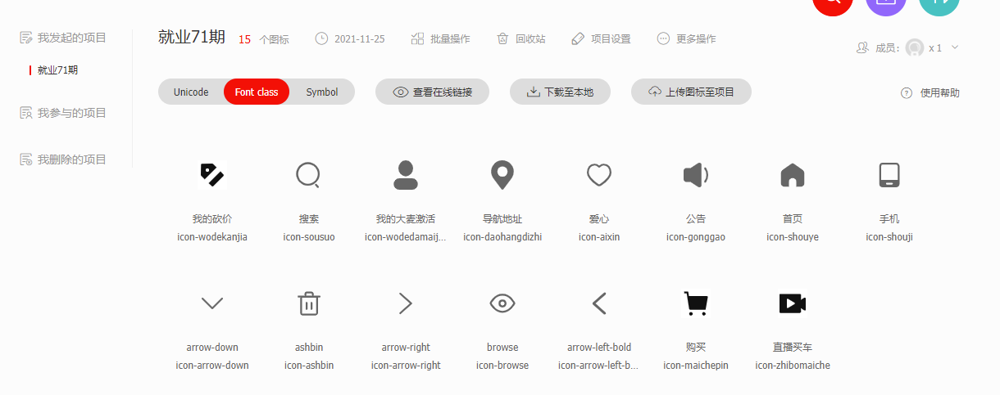
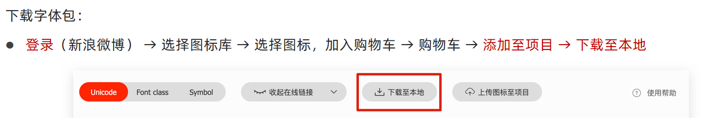
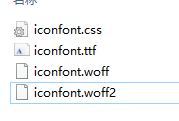

# 1. 字体图标

字体图标主要用来实现网页中简洁的图标效果，注意字体图标展示的是图标，本质上是字体

优点：

1. 灵活性：灵活的修改样式，例如尺寸、颜色
2. 轻量级：体积小、渲染快、降低服务器请求次数
3. 几乎兼容所有主流浏览器 
4. 适用方便

> 字体图标并不能替换精灵图，字体图标颜色比较单一，也比较简单，而精灵图可以实现多样式多颜色或者渐变的小图标

## 1.1. 下载字体图标（了解）

使用之前需要去图标网站（例如阿里巴巴图标库网站www.iconfont.cn）去下载需要图标的对应zip文件，具体使用步骤如下：

登录>选择图标库>选择图标，加入购物车>购物车>添加到项目>下载字体包至本地

​              



## 1.2. 使用字体图标（重点）

### 1.3. 引入相关文件

在项目根目录新建一个fonts文件夹，把字体包中的`iconfont.css`、`iconfont.ttf`、`iconfont.woff`、`iconfont.woff2` 四个文件复制到fonts文件夹下



### 1.4. 使用类名引入字体图标（开发中常用 重点记住）

使用步骤：

1. 引入字体图标CSS样式表文件
2. 调佣图标对应的类名，必须调用两个类名
   - `iconfont`：基本样式，包含字体的使用
   - `icon-xxx`：图标对应的类名

### 1.5. 使用`unicode`编码（了解）

使用步骤：

1. 引入字体图标CSS样式表
2. 需要添加一个盒子,复制粘贴对应的`unicode`编码到盒子中和字体一样操作  `&#xe686`
3. 设置文字字体`font-family:"iconfont"`或者在对应盒子添加`iconfont`类名

### 1.6. 使用伪元素字体图标（记住）

使用步骤：

1. 引入字体图标CSS样式表
2. 父元素添加伪元素设置`content: "\e67d";`
3. 设置文字字体`font-family:"iconfont"`

> - 当图标库没有需要的图标时,可以自己上传svg矢量图,然后和前面一样操作就行
> - `iconfont`添加到组成员中可以共享所选图标

### 1.7. 小结

字体图标是前端工程师必须具备的知识点。 开发中， 字体图标上传，选择，都是网页美工给我们准备好了。
我们重点是下载和使用。
字体图标使用可以整体分为两大步骤：

1. 复制相关文件到网站根目录下，并引入CSS文件到HTML页面中 
   - 通常都放到fonts文件夹里面。
   - 通常iconfont.css 和字体放一起。
2. 调用
   - 开发中最常用的是使用类名来调用，所以重点记住这个就可以了。

```html
     <span class="iconfont icon-daohangdizhi"></span>
```

# 2. 变形 tansform（2D）

## 2.1. 位移translate

用transform实现元素的位移效果
语法：`transform:translate(水平移动距离,垂直移动距离)`
距离取值（正负都可，向右向下为正）：

- 像素单位数值
- 百分比（参照物为盒子自身尺寸）

> 单独设置某个方向的移动距离：`transformX()`、`transformY() ` 注意这里同时设置会出现transform属性覆盖的问题
>
> translate如果只给出一个值，表示x轴方向移动的距离

### 2.1.1. translate与margin的区别

1. margin移动盒子会影响到其余的盒子，把其他的挤走
2. 位移transform移动盒子不会影响其他的盒子

### 2.1.2. 定位盒子水平垂直居中

定位的盒子如果需要水平居中不能使用普通使块级元素水平垂直居中的方法`margin:0 auto`

```css
.box2 {
            position: absolute;
            left: 50%;
            top: 50%;
            transform: translate(-50%, -50%);
            width: 100px;
            height: 100px;
            background-color: skyblue;
        }
```

另外一种和盒子水平居中的方法

```css
.box2 {
            position: absolute;
            下面四个方位为0是固定写法
            left: 0;
            right: 0;
            top: 0;
            bottom: 0;
            width: 100px;
            height: 100px;
            background-color: purple;
            '左侧全部充满'
            margin-left: auto;
            margin: auto;
        }
```

## 2.2.旋转rotate

使用rotate实现元素旋转效果
语法：
transform:rotate(角度值)

- 角度单位是deg  degree度数的意思
- 取值正负均可，正是顺时针，负是逆时针

```css
img {
            transition: all .5s;
            transform-origin: right bottom;
        }

        img:hover {
            transform: rotate(180deg);
        }
```

### 2.2.1. 转换旋转原点

默认圆点是盒子中心旋转点，transform-origin属性改变转换原点，不常用
语法：
transform-origin: 原点水平位置 原点垂直位置
取值：

1. 方位名词（常用）left right top bottom center，只写一个默认为水平位置，第二个是center
2. 像素单位数值
3. 百分比（参考盒子自身尺寸计算）

### 2.2.2. 多形态变形复合写法

如果需要移动，也需要旋转，则一定先写移动，后写旋转，CSS属性书写顺序影响代码执行
多重转换原理：

- rotate会影响元素的x轴和y轴
- 先写旋转则后面的转换效果的轴向以旋转后的轴向为准，会影响转换效果

```css
img:hover {
    transform: translateX(600px) rotate(360deg);
	}
```

> - 多个transform一定要z注意出现覆盖的问题 
> - transform的属性值之间用空格隔开，属性值中括号里面的值用逗号隔开
> - 特别注意hover或者动画后的transform会出现覆盖的现象，后面的transform要加上前面已经写过的

## 2.3. 缩放 scale

使用scale改变元素的尺寸，通常搭配hover使用，使用width加transition也可以实现缩放但是是从元素左上角朝对角变形,体验不太好
语法:
`transform:scale(x轴放大倍数 y轴放大倍数)` 1.5表示是原来的1.5倍 .3表示是原来的30%

```css
img:hover {
            transform: scale(1.5);
        }
```

一般情况下，只为scale设置一个值，表示x轴和y轴等比例缩放 scale值大于1表示放大，小于1表示缩小

# 3. 渐变

使用background-image属性实现渐变背景效果，渐变是多个颜色逐渐变化的视觉效果，一般用于设置盒子的背景效果
语法：`background-image:linear-gradient(颜色1，颜色2) `
实际应用：盒子hover之后的黑色渐变遮罩效果

```css
.box {
            width: 200px;
            height: 200px;
            /* background-color: pink; */
            /* background-image: linear-gradient(颜色值1, 颜色值2, 颜色值3....); */
            /* background-image: linear-gradient(pink, green); */
            /* 默认方向是to bottom*/
            /* background-image: linear-gradient(方向, 颜色值1, 颜色值2, 颜色值3....); */
            /* background-image: linear-gradient(to left, green, blue, pink); */
            /* to left 设置渐变从右向左，相当于270deg，to right相当于90deg to bottom 相当于180deg为默认不用设置 */
            /* background-image: linear-gradient(270deg, green, blue, pink); */
            /* 常见应用：背景色的遮罩*/
            background-image: linear-gradient(transparent, rgba(0, 0, 0, .5));
            background-image: linear-gradient(rgba(0, 0, 0, 0), rgba(0, 0, 0, .5));

        }
```