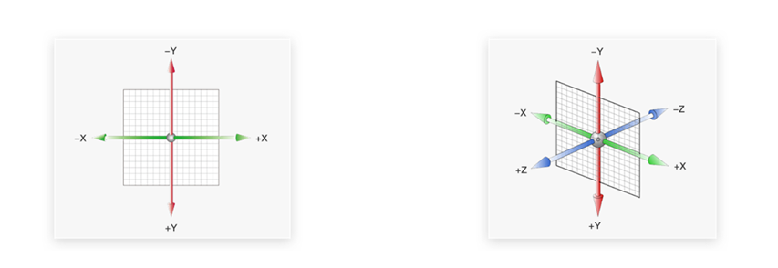
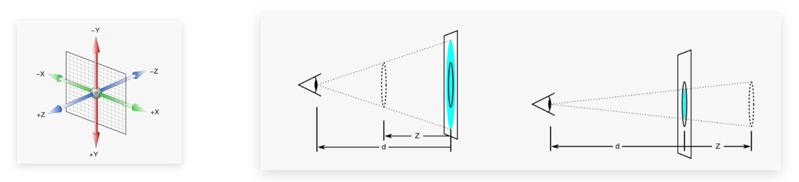
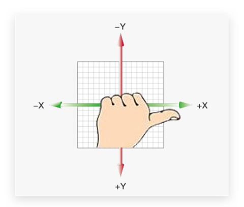
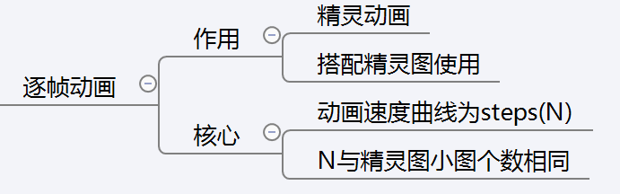
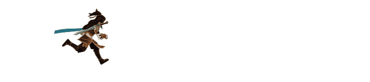

# 1. 空间转换

## 1.1. 3D坐标系

3D坐标系比2D多了一个Z轴


> 一定要记住3个坐标轴取值的正反：
>
> - X 轴 往右越大，是正值， 否则反之
> - Y 轴 往下越大，是正值，否则反之
> - Z轴（指向我们）越大，是正值，否则反之   

## 1.2. 位移

使用transform实现元素空间转换（也叫3D转换）三条轴构成了一个立体空间

 语法：

完整写法（用得不多）：transform:translate3d(x,y,z)

但大部分情况下我们喜欢分开写

- `transform:translateX(偏移值)`
- `transform:translateY(偏移值)`
- `transform:translateZ(偏移值)`

或者`transform:translateX() translateY()`;

取值（正负均可）
1. 像素单位值
2. 百分比（参照物是自身）

### 1.2.1. perspective透视属性

z轴的位置与视线方向相同，朝着我们的方向是z轴的正方向，z轴的移动效果是距离的远近，电脑屏幕是平面，默认无法观察远近效果，需要借助perspective透视属性
作用：空间转换时，为元素添加近大远小、近实远虚的视觉效果
注意：

1. 取值范围经常在 800px ~  1200px 之间。
2. 给父元素添加
3. 透视距离也称为视距，所谓的视距就是人的眼睛到屏幕的距离。
   - 其中 d 为透视即视距的距离
   - z 是 `translateZ` 的距离， 这个距离靠近我们，盒子越大


> 注意一定是给当前transform对象的父元素添加perspective透视属性

```css
<!DOCTYPE html>
<html lang="en">

<head>
    <meta charset="UTF-8">
    <meta http-equiv="X-UA-Compatible" content="IE=edge">
    <meta name="viewport" content="width=device-width, initial-scale=1.0">
    <title>Document</title>
    <style>
        body {
            perspective: 800px;
            /* 视距越小，盒子越大
                视距越大，盒子越小 */
        }
        .box1 {
            width: 100px;
            height: 100px;
            background-color: aqua;
            margin: 100px auto;
            transition: all .5s;
        }
        .box1:hover {
            transform: translateZ(500px);
            /* z轴距离正值越大即向我们移动的距离越多，我们看到的物体越大 */
        }
    </style>
</head>
<body>
    <div class="box1"></div>
</body>
</html>
```

## 1.3. 旋转

使用rotate实现元素空间旋转效果，角度值单位是deg（degree度数）

- transform:rotateX(角度值) 默认绕着水平中心线旋转
- transform:rotateY(角度值) 默认绕着竖直中心线旋转
- transform:rotateZ(角度值) 默认绕着中心点旋转，z轴旋转和之前的平面的rotate是一样的

transform:rotate3d(x,y,z，角度值)，这种基本不用，用来设置自定义旋转轴的位置及旋转的角度，xyz取值为0-1之间的数字

> 空间rotate也可以添加perspective透视属性，实现近大远小，近实远虚的视觉效果

```css
 body {
            perspective: 800px;
        }

        /* 注意要给父元素设置透视属性 */
        img {
            display: block;
            margin: 60px auto;
            transition: all .5s;
        }
        img:hover {
            transform: rotateX(-85deg);
           /* transform: rotateY(-45deg);
            transform: rotate3d(0, 0.5, 0.1, -85deg);*/
        }
```

> 位移和旋转可以连写用空格隔开 `transform: translateX(1000px) rotate(360deg);`

### 1.3.1. 左手法则

左手握住旋转轴，拇指指向正值方向，手指弯曲的方向为旋转正值方向，反方向为旋转负值方向


## 1.4. 立体呈现

给父元素添加transform-style:preserve-3d使子元素出于3d立体空间
步骤：

1. 给父元素添加transform-style:preserve-3d
2. 按需求设置子盒子的位置（位移或旋转）

```css
<!DOCTYPE html>
<html lang="en">

<head>
    <meta charset="UTF-8">
    <meta http-equiv="X-UA-Compatible" content="IE=edge">
    <meta name="viewport" content="width=device-width, initial-scale=1.0">
    <title>立体呈现</title>
    <style>
        .cube {
            position: relative;
            width: 400px;
            height: 400px;
            margin: 100px auto;
            background-color: pink;
            transform-style: preserve-3d;
            /* 默认是flat为2d效果 */
            transition: all .5s;
            /* perspective: 800px; */
        }
        .cube div {
        /* 先加绝对定位让两个盒子重合显示 */
            position: absolute;
            width: 200px;
            height: 200px;
        }
        .front {
            background-color: orange;
            transform: translateZ(100px);
        }
        .back {
            background-color: green;
            transform: translateZ(-100px);
        }
        .cube:hover {
            transform: rotateY(85deg);
        }
    </style>
</head>
<body>
    <div class="cube">
        <div class="front">前面</div>
        <div class="back">后面</div>
    </div>
</body>
</html>
```

> 注意：
>
> - 转换元素都有自己独立的坐标轴，互不干扰
> - 3d旋转的时候心中要有坐标轴的位置即xyz三个坐标轴的位置
> - 空间位移和旋转加上过渡属性视觉效果更佳

## 1.5. 空间缩放

使用scale实现空间缩放效果，用的不多，用的多的一般是平面2d空间的缩放

- transform:scaleX(倍数) 
- transform:scaleY(倍数)
- transform:scaleZ(倍数)
- transform:scale3d(x,y,z)

# 2. 动画（重点）

动画的本质是快速切换大量图片在人脑中形成的具有连续性的画面，构成动画的最小单元是帧或动画帧，动画最大的特点可以不用鼠标触发，自动的，反复的执行某些动画

## 2.1. 动画和过渡的区别

- 过渡实现两个状态间的变化过程
- 动画实现多个状态间的变化过程，动画过程可控（重复播放，最终画面，是否暂停等）

## 2.2. from-to动画

实现步骤（在css中完成 顺序无所谓可以在后面定义）：

1. 定义动画()
   @keyframes 动画名称{
   from{}
   to{}
   }
2. 调用动画 
   选择器中设置animation属性，animation:动画名称 动画时间

> - 调用了动画后可能出现样式重叠，比如前面用了transform:translate，动画效果中也用到了transform属性会出现覆盖，应该在动画中加上前面设置的translate值
> - 动画名称用英文命名，见名知意

```css
        @keyframes scroll {
            /* 动画开始 */
            from {
                transform: translateX(0px);
                /* 开始都是原始位置，可以不写，但是一般情况下还是带上 */
            }
            /* 动画结束 */
            to {
                transform: translateX(1000px) rotate(360deg);
            }
        }
        .box1 {
            text-align: center;
            line-height: 100px;
            animation: scroll 4s 2 linear;
        }
    </style>
```

> from{}括号里面起始位置可以不写甚至from都可以不写只写to，但是一般情况下出于规范还是带上

## 2.3. 百分比动画

百分比动画是每个百分比的位置（相对于原始位置）的状态，100%可以不用回到原始位置，连续rotate需要rotate的值递增

```css
		   @keyframes rotate {
            /* 原始位置可以省略，但是最好写上 */
            0% {
                transform: translate(0, 0);
            }
            25% {
                transform: translateX(800px) rotate(360deg);
            }
            50% {
                transform: translate(800px, 400px) rotate(720deg);
            }
            75% {
                transform: translateY(400px) rotate(1080deg);
            }
            100% {
                transform: translateY(800px) rotate(1440deg);
            }
            }
           .box1 {
            animation: rotate 4s;
            }
```

## 2.4. 动画属性

animation:动画名称 动画时长 速度曲线 延迟时间 重复次数 动画方向 执行完毕时状态
animation: name duration timing-function delay iteration-count direction fill-mode;
注意事项：

- 连写，不分顺序，常用到
- 动画名称和动画时长必须赋值
- 如果有两个时间值，一个是动画时长，一个是延迟时间

### 2.4.1. 单个属性介绍

单个属性不常用到，常用的是连写属性，不用记，用的时候能查到就可以

```css
 .box {
            /* 1.动画名称 */
            animation-name: move;
            /* 2.动画时长 */
            animation-duration: 2 s;
            /* 3.速度曲线 */
            /* 线性过渡 自始至终以同一速度 */
            animation-timing-function: linear;
            /* 默认值 平滑过渡 缓慢开始突然加速再缓慢结束*/
            animation-timing-function: ease;
            /* 由慢到快 */
            animation-timing-function: ease-in;
            /* 由快到慢 */
            animation-timing-function: ease-out;
            /* 由慢到快再到慢 前两个的结合前半段是ease-in 后半段是ease-out*/
            animation-timing-function: ease-in-out;
            /* 分步 可以制作逐帧动画 */
            animation-timing-function: steps(3);
            /* 4.延迟时间 动画开始前的等待时间 infinite只有动画开始前有delay时间后面一直动 */
            animation-delay: 2s;
            /* 5.重复次数 */
            /* 无限循环 */
            animation-iteration-count: infinite;
            /* 循环3次 */
            animation-iteration-count: 3;
            /* 6.动画执行方向 */
            /* 轮流播放动画 动画会在奇数次数（1、3、5 等等）正常播放，而在偶数次数（2、4、6 等等）向后播放 即来回播放 只播放一次则没有效果*/
            animation-direction: alternate;
            /* 7.动画执行完毕时状态 默认是none初始位置*/
            /* 停在最初始状态 */
            animation-fill-mode: backwards;
            /* 停在最后状态 */
            animation-fill-mode: forwards;
        }
```

### 2.4.2. 暂停动画

常常搭配hover属性使用

```css
.box2 {
       /* 暂停动画 结合鼠标hover的效果来实现*/
            animation: move 3s;
        }
        .box2:hover {
            /* 默认值是running */
            animation-play-state: paused;
        }
```

## 2.5. 逐帧动画

使用steps属性值来实现逐帧动画（速度曲线），开发中一般配合精灵图来实现逐帧动画效果，将动画均分成N等份



- 补间动画就是平滑的动画（类似钟表秒针不间断平滑地移动）
- 逐帧动画就是分帧数（类似钟表秒针一秒一秒地移动）

> 核心：动画速度曲线为step(N)，N为精灵图小图个数相同
> 多组动画之间用逗号隔开，不能另起一行再写一个animation会覆盖



```css
<!DOCTYPE html>
<html lang="en">
<head>
    <meta charset="UTF-8">
    <meta http-equiv="X-UA-Compatible" content="IE=edge">
    <meta name="viewport" content="width=device-width, initial-scale=1.0">
    <title>Document</title>
    <style>
        @keyframes move {
            from {}

            to {
                /* 这里可以用微元法，把一帧看成左上角一个点，要12帧的话必须要有移动整个精灵图的距离，然后背景图平铺，移动后最终为第一帧 */
                background-position: -1680px 0;
                /* transform: translate(500px);
                直接这里加也可以 也可以添加一个新的动画 */
            }
        }
        @keyframes move1 {
            from {}
            to {
                transform: translateX(500px);
            }
        }
        /* 定义动画部分写在下面也可以  */
        .box1 {
            width: 140px;
            height: 140px;
            background-image: url(./images/bg.png);
            /* 多组动画之间用逗号隔开，不能另起一行再写一个animation会覆盖 */
            animation: move 5s steps(12),move1 5s;
        }
    </style>
</head>
<body>
    <div class="box1"></div>
</body>
</html>
```