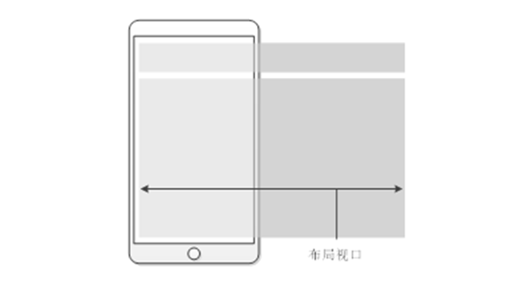
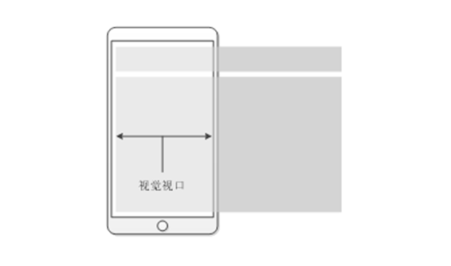
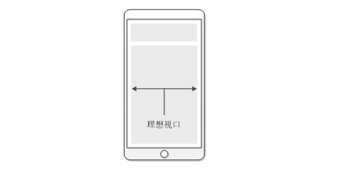
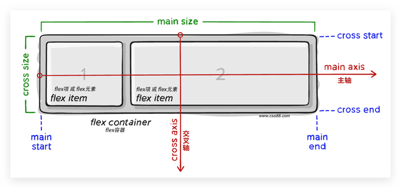
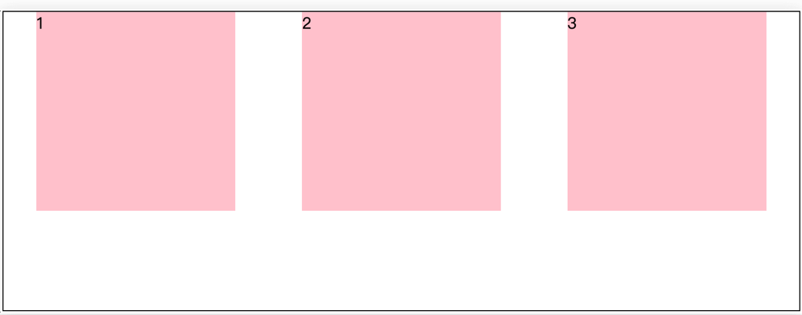
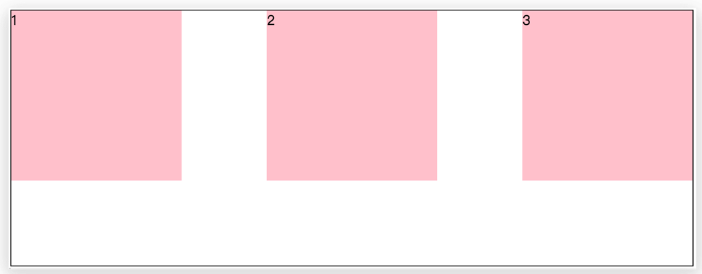
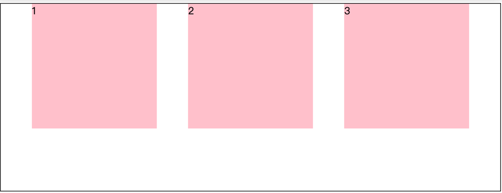

# 1.理论知识

## 1.1. PC端/移动端不同点

- PC端浏览器非常多，需要考虑很多的兼容性问题 （浮动+定位加标准流），pc端屏幕大，网页固定版心
- 移动端不能考虑兼容性问题，手机屏幕小，宽度大多为100%

> PC端可以边写代码边调试移动端网页效果，在谷歌模拟器中调试

## 1.2. 物理分辨率和逻辑分辨率

屏幕尺寸指的是屏幕对角线的长度，一般用英寸来度量4.7寸、5.5寸

区别：

- 物理分辨率是生产屏幕时就固定的，大的屏幕必须配置大的物理分辨率才能有高真度，它是不可改变的，常见的有1920\*1080、1366\*768.....
- 逻辑分辨率是由软件（驱动）决定的，是对软件来说的，只做网页参考逻辑分辨率，分辨率越高越清楚

举例：iphone4出了之后，逻辑分辨率和3gs一样是320\*480，显示的内容是一样多的，但是物理分辨率变成了640\*960，原来在3gs的一个像素内容，在iphone4上则填充了4个像素，因此虽然内容显示还是一样多，但是iphone4s的屏幕精细度比3gs高了2倍，像素倍率是2

## 1.3. 二倍图

背景：我们写代码是按照逻辑像素来写，但是美工设计师在出图如果按照375像素来做设计稿，现在iphone678屏幕上会以750显示，会让图片变得模糊

物理像素比：dpr = 物理像素/逻辑像素（iphone6/7/8的的dpr是2）

所以美工设计稿参考iphone678设备宽度750px来产出设计稿，这样能保证图片更加清晰，我们前端人员先把设计稿缩小一半，改为375px来写代码，手机显示会按照物理像素显示为750px，这样图片就不会失真了。因为设计稿就是750px

应用：

第一个图设计稿设置为 50\*50 像素，则放到真机里面，会模糊

第二个图设计稿为 100\**100, 然后选择 缩小一半通过代码css改为 50\* 50 ,放到真机里面则不模糊，不改尺寸的话，就是100px的显示在物理像素为200px的屏幕上，不够清楚

> 理论性的知识其实比较难懂，还是不懂得可以自己百度了解了解，这里几句话说不明白

## 1.4. 视口

视口viewport是浏览器显示页面内容的屏幕区域即当前可见的计算机图形区域，针对移动端来说，理解了之后能够更好地让我们的网页适配或响应各种不同分辨率的移动设备

- 布局视口（layout viewport ）：移动设备的浏览器都设置了一个布局视口，用于解决早期pc端页面在手机上显示的问题，整个网站的宽度，显示不全，可以缩放调整，横向滚动条，把viewport设为一个较宽的值，比如980px，这样的话即使是那些为桌面设计的网站也能在移动浏览器上正常显示了



- 视觉视口（visual viewport ）：用户正在看到的网站的区域，整个网站显示不全，可以缩放去操作视觉视口，但不会影响到布局视口，布局视口仍然保持原来的宽度



- 理想视口（ideal viewport）：屏幕有多宽我们的网页就有多宽，网页占满整个屏幕，首先不需要用户缩放和横向滚动条就能正常的查看网站的所有内容，第二，显示的文字的大小是合适的


> ideal viewport 并没有一个固定的尺寸，不同的设备拥有有不同的 ideal viewport，手机屏幕尺寸都不同，网页宽度为100%，网页的宽度和逻辑分辨率尺寸相同，就是屏幕宽度也是理想视口的宽度

### 1.4.1. meta标签来设置理想视口

在html骨架结构中有`<meta name="viewport" content="width=device-width, initial-scale=1.0">`这行代码，就是来设置理想视口的

| 属性               | 意义                                                         |
| ------------------ | ------------------------------------------------------------ |
| width=device-width | 视口宽度等于设备宽度                                         |
| initial-scale=1.0  | 初始页面缩放倍数                                             |
| maximum-scale-1.0  | 最大缩放倍数                                                 |
| user-scalable=0    | 不允许用户缩放页面（移动端）或者为no，如果为yes则允许用户缩放 |

> 一般网站首页是不允许缩放的

# 2. 百分比布局

百分比布局也叫流式布局，现在用的非常少了
特点：宽度自适应（宽度设置百分比），高度固定

举例：移动web网页底部导航，固定不动，每个标签宽度20%，高度固定

```css
		ul {
            position: fixed;
            bottom: 0;
            height: 50px;
            width: 100%;
            background-color: pink;
        }
        ul li {
            float: left;
            list-style: none;
            height: 100%;
            width: 20%;
        }
        ul li img {
            width: 100%;
            height: 100%;
        }
```

# 3. Flex布局

掘金flex布局传送门：[https://juejin.cn/post/7072378362349486116](https://juejin.cn/post/7072378362349486116)



Flex布局是一种浏览器提倡的布局模型，布局网页更加灵活、更加简单，避免浮动脱标问题的出现，父盒子不用再清除浮动

基于Flex精确灵活控制块级盒子的布局方式，非常适合结构化布局
特点：

- 可以让多个盒子横向排列，不再使用浮动
- 可以通过设置横纵向的布局方式改变盒子之间的间距，不再需要给每个盒子设置margin值
- 不会出现脱标，不再需要清除浮动
- 不会出现塌陷的问题（浮动的盒子也没有塌陷的问题）

设置方式是给盒子的亲父元素（不能跨代）添加`display:flex`

子元素可以自动的挤压或拉伸，就不再有块级元素、行内元素和行内块元素的概念了，a标签弹性盒子可以设置宽高了

flex父盒子称为弹性容器，里面的子元素称为flex元素或者flex项或者弹性盒子

> 父元素设置高度，flex项不设置高度效果是flex盒子会默认拉伸到撑满父盒子
> 父盒子不设置高度，flex项设置高度效果是flex盒子会撑开父盒子

## 3.1. 主轴对齐方式
默认水平方向是主轴的方向，竖直方向是侧轴的方向


| 属性值           | 意义                                                 |
| ---------------- | ---------------------------------------------------- |
| flex-start/start | 默认值，起点开始依次排列 居左                        |
| flex-end/end     | 终点开始依次排列 居右                                |
| center           | 沿主轴居中排列                                       |
| space-around     | 弹性盒子沿主轴均匀排列，空白间距均分在弹性盒子两侧   |
| space-between    | 弹性盒子沿主轴均匀排列，空白间距均分在相邻盒子两侧   |
| space-evenly     | 弹性盒子沿主轴均匀排列，弹性盒子与容器之间的间距相等 |

```css
.box {
            display: flex;
            /* justify是两端对齐的意思 */
            /* 默认居左 */
            justify-content: start;
            /* 居右 */
            justify-content: end;
            /* 居中 */
            justify-content: center;
            /* 盒子之间间隙是边缘两侧间隙的两倍 */
            justify-content: space-around;
            /* 两端对齐 边缘两侧没有间隙 中间盒子间间隙相等 */
            justify-content: space-between;
            /* 盒子之间间隙和边缘两侧间隙一般大 */
            justify-content: space-evenly;
        }
```

`justify-content: space-around`



`justify-content: space-between`



`justify-content: space-evenly`



> 小技巧：亲父亲弹性容器设置左右padding然后justify-content设置space-between可实现两端对齐

## 3.2. 侧轴对齐方式

### 3.2.1. 使用align-items调节元素在侧轴的对齐方式

给父盒子设置

| 属性值           | 作用                                       |
| ---------------- | ------------------------------------------ |
| flex-start/start | 默认值，起点开始依次排列 居上              |
| flex-end/end     | 终点开始依次排列 居下                      |
| center           | 沿侧轴居中排列（中线对齐）                 |
| stretch          | 默认值，弹性盒子沿着主轴线被拉伸至铺满容器 |

### 3.2.2. 使用align-self控制某个弹性盒子的竖直对齐方式

给子盒子设置
属性值同align-items一样

```css
.box {
            height: 700px;
            display: flex;
            /* 默认值 居上 */
            align-items: flex-start;
            /* 居下 */
            align-items: end;
            /* 居中  中州对齐 */
            align-items: center;
            /* 默认值。弹性盒子不设高度,高度拉伸至100%不设置默认拉伸 设了高度stretch失效*/
            align-items: stretch;
            /* 一行元素基线对齐 */
            /* align-items: baseline; */
            border: 2px solid pink;
        }
        .box>div {
            width: 200px;
            /* height: 200px; */
            background-color: aqua;
        }
        .box>div:nth-child(2) {
            background-color: pink;
            align-self: end;
        }
```

> align-self和align-items有baseline属性值,让一行元素基线对齐

### 3.2.3. 盒子水平居中

```css
.box {
            display: flex;
            justify-content: center;
            align-items: center;
            width: 200px;
            height: 100px;
            background-color: pink;
        }
```
给弹性容器就是父盒子开启flex并分别设置justify-content、align-items可以让子盒子在父盒子里面水平垂直居中

## 3.3. 伸缩比

使用flex属性修改弹性盒子的伸缩比，实际就是分份数，给每个弹性盒子分几份

语法：
flex:值（单纯的阿拉伯数字，无负值小数）
特点： 

1. 只占用父盒子剩余尺寸
2. 给弹性子盒子设置

> 同时设置了width和flex值，会优先执行flex伸缩比
>
> 开发中有以下两种使用方法：
>
> - 给每个弹性子盒子都设置flex值
> - 给某个或某几个子盒子设置固定宽度，给其他剩余的弹性子盒子设置flex值，用剩余的父盒子空间去分份数

## 3.4. 圣杯布局

两边固定不动，中间可以任意伸缩，一般用在网页的头部

```css
<!DOCTYPE html>
<html lang="en">

<head>
    <meta charset="UTF-8">
    <meta http-equiv="X-UA-Compatible" content="IE=edge">
    <meta name="viewport" content="width=device-width, initial-scale=1.0">
    <title>Document</title>
    <style>
        .box {
            display: flex;
            /* 父盒子不能给固定宽度，要占满整个屏幕 */
            /* width: 600px; */
            height: 200px;
            border: 1px solid pink;
        }
        .box div:nth-child(2n-1) {
            width: 50px;
            background-color: pink;
        }
        .box div:nth-child(2) {
            flex: 1;
            background-color: skyblue;
        }
    </style>
</head>
<body>
    <div class="box">
        <div></div>
        <div></div>
        <div></div>
    </div>
</body>
</html>
```

布局中未设置宽高由内容撑大时，弹性盒子会撑大父盒子剩余的宽度

可以给某个盒子设置最小宽度避免被挤压到太小到文字竖直显示

语法：给盒子设置min-width就可以，同时还有min-height、max-width、max-height

## 3.5. 转换主轴方向

使用flex-direction改变元素排列方向，主轴默认是水平方向，侧轴默认是垂直方向，给弹性容器设置

| 属性值         | 意义               |
| -------------- | ------------------ |
| row            | 默认值 水平        |
| column         | 列 垂直 常用       |
| row-reverse    | 行 从右向左 不常用 |
| column-reverse | 列 从下向上 不常用 |

应用：

通常在盒子竖直显示时，同时需要竖直居中（中线对齐）时，可以转换主轴的方向，然后设置justify-content和align-items都为center

## 3.6. 弹性盒子换行

默认情况下，多个弹性盒子在弹性容器内在一行显示，尽管弹性盒子设置了固定宽度，会不断挤压到一行显示
给父盒子设置设置`flex-wrap:wrap`,会自动换行，默认值是nowrap不换行

> 换行之后设置了高度的弹性盒子，各行之间会默认有间距 通过设置align的属性消去

## 3.7. 侧轴多行对齐

使用行对齐align-content调整多行排列效果，搭配`flex-wrap:wrap`使用
属性值同justify-content一样：start、end、center、space-around、space-between、space-evenly

```css
 .box {
            display: flex;
            flex-wrap: wrap;
            /* align-content: space-evenly; */
            align-content: center;
            width: 800px;
            height: 800px;
            background-color: pink;
        }
        .box>div {
            width: 180px;
            /* 不设高度，不设align属性。高默认是拉伸效果 */
            /* 设置了高度 align-content属性的默认值为stretch 会默认出现行间距 通过设置align属性消去这些间距*/
            height: 200px;
            background-color: orange;
        }
```

单行：align-items 单行用的比较多一些（中线对齐）
多行（搭配flex-wrap）：align-content 多行用的比较多 对单行无效

> * justify-items和justify-self属性在弹性布局中被省略