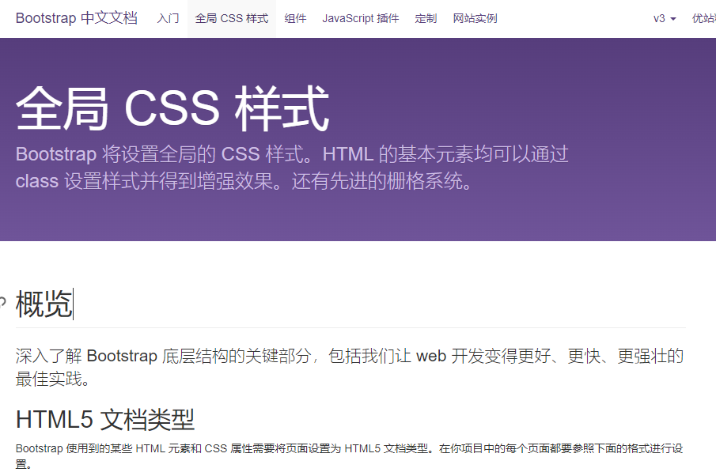

# 1. 响应式布局

响应式网页：pc和手机端共用一套代码，屏幕尺寸发生变化时，页面发生适配。一个网站能够兼容多个终端——而不是为每个终端做一个特定的版本。这个概念是为解决移动互联网浏览而诞生的。

> 特殊需求：当屏幕扩大到一定宽度时，不再发生响应
>
> 这必须要通过媒体查询,可以改变html字号的大小，就是引入flexible.js，设置rem适配
>
> vw不能实现这种需求，因为屏幕变宽时1vw代表的px仍然在改变，而1rem代表的px可以通过媒体查询设置固定的

# 2. UI框架

前端UI框架一般是html，css以及javascript的集合，是别人已经写好的，你可以在引入了相应的css和js文件之后，直接调用类名，或者直接去官方文档复制代码过来直接使用相应的css样式、组件、插件等。

要能够看清楚别人的文档，看懂了才能够使用好框架，比较流行的前端UI框架有 bootstrap、element（饿了吗）、vnt（有赞）等

使用框架能够少写很多html或者css代码，直接复制粘贴官方文档的代码然后自己按照需要添加删除html和css代码覆盖框架原有的布局和样式就可以，非常省时省力

# 3. 媒体查询

媒体查询：能够根据设备宽度的变化，设置差异化css样式

```css
@media (媒体特性){
        选择器{
            css样式；
        }
    }
```

设置范围尺寸内的媒体特性

| 媒体特性  | 含义     | 备注                                    |
| --------- | -------- | --------------------------------------- |
| min-width | 最小宽度 | 大于等于 书写顺序从小到大（小的写前面） |
| max-width | 最大宽度 | 小于等于 书写顺序从大到小（大的写前面） |

书写顺序主要是css样式从上向下渲染，出现样式的重叠覆盖，min-width和max-height只用一个

## 3.1. 完整的媒体查询

```css
@media 关键词/逻辑符 媒体类型 and (媒体特性){
    css代码
}
```

### 3.1.1. 关键词/逻辑符

| 关键词 | 例子                                           | 代码                                                         |                                                            |
| ------ | ---------------------------------------------- | ------------------------------------------------------------ | ---------------------------------------------------------- |
| and    | 宽度大于700且为横屏的tv                        | @media tv and (min-width: 700px) and (orientation: landscape) |                                                            |
| only   | 兼容低版本浏览器，必须位于声明的开头           | @media only screen and (min-width: 1024px)                   |                                                            |
| not    | 反转整个媒体查询的含义                         | @media not screen and (min-width:800px) and (max-width:1200px),print and (color) | 等同于@media (not (screen and (color))), print and (color) |
| or     | 两个媒体特性之间用逗号隔开（或者），否则会报错 | @media (max-width:500px) , (orientation: landscape)          |                                                            |

### 3.1.2. 媒体类型

| 类型名称   | 值     | 描述                   |
| ---------- | ------ | ---------------------- |
| 屏幕       | screen | 带屏幕的设备           |
| 打印预览   | print  | 打印预览模式           |
| 不区分类型 | all    | 默认值 包含以上3种情形 |

### 3.1.3.媒体特性

用来描述媒体类型的具体特征 如当前屏幕的宽高、分辨率、横屏或者竖屏

| 含义         | 代码                  | 属性值                       |
| ------------ | --------------------- | ---------------------------- |
| 视口宽高     | width、height         | 具体数值                     |
| 视口最大宽高 | max-width、max-height | 具体数值                     |
| 视口最小宽高 | min-width、min-height | 具体数值                     |
| 屏幕方向     | orientation           | portrait 竖屏 landscape 横屏 |

## 3.2. 媒体查询案例

```css
        /* 小于768为gray */
        body {
            background-color: gray;
        }
        /* 768-992为pink */
        @media(min-width:768px) {
            body {
                background-color: pink;
            }
        }
        /* 992-1200为pink */
        @media(min-width:992px) {
            body {
                background-color: skyblue;
            }
        }
        /* 大于1200为green */
        @media(min-width:1200px) {
            body {
                background-color: green;
            }
        }
```

## 3.3. 媒体查询应用

### 3.3.1. 媒体查询应用1

需求：如果大于等于 540px 屏幕不再缩放，并且整个页面居中，而且我们页面通过rem缩放

分析：不让rem缩放，实际上就是改变html文字大小的变化

```html
<!DOCTYPE html>
<html lang="en">
<head>
    <meta charset="UTF-8">
    <meta http-equiv="X-UA-Compatible" content="IE=edge">
    <meta name="viewport" content="width=device-width, initial-scale=1.0">
    <title>Document</title>
    <style>
        body {
            /* 还有的未生效是因为有的宽度设置的宽为100% */
            max-width: 540px;
            margin: 0 auto;
        }
        p {
            font-size: 0.5rem;
            width: 100%;
            /* 给body设置背景色会直接被浏览器当作根节点所俘获，导致整个页面都是背景色的颜色，应该给body下面加一个div给div设置background-color */
            background-color: orange;
        }
        .box1 {
            width: 100%;
            height: 40px;
            background-color: pink;
            position: fixed;
            bottom: 0;
            left: 50%;
            max-width: 540px;
            font-size: 0.5rem;
            transform: translateX(-50%);
        }
        @media (min-width:540px) {
            html {
                /* flexible.js中的html属性是行内样式，层级最高会出现覆盖，这里加一个!important */
                font-size: 54px !important;
            }
        }
    </style>
</head>

<body>
    <p>测试文字大小</p>
    <div class="box1">测试文字大小</div>
    <script src="../移动web 04 移动适配01与less语法/06-素材/js/flexible.js"></script>
</body>
</html>
```

### 3.3.2. 媒体查询应用2

需求：屏幕在再低于某个宽度时，某些内容隐藏

分析：就是通过媒体查询，设置max-width，盒子设置display:none;

```css
<!DOCTYPE html>
<html lang="en">
<head>
    <meta charset="UTF-8">
    <meta http-equiv="X-UA-Compatible" content="IE=edge">
    <meta name="viewport" content="width=device-width, initial-scale=1.0">
    <title>Document</title>
    <style>
        * {
            padding: 0;
            margin: 0;
            box-sizing: border-box;
        }
        .box {
            display: flex;
            width: 1200px;
            height: 150px;
            background-color: pink;
            margin: 0 auto;
        }
        .box div {
            height: 150px;
            width: 33.3%;
            background-color: blue;
        }
        .box div:nth-child(2) {
            margin: 0 5px;
        }
        /* 媒体查询适配 */
        @media(max-width:1000px) {
            /* 缩小时必须要减小外面父盒子的宽度 */
            .box {
                width: 1000px;
            }
            .box div:nth-child(1) {
                margin: 0 5px 0 0;
            }
            .box div {
                width: 50%;
            }
            .box div:nth-child(2) {
                display: none;
            }
        }
    </style>
</head>
<body>
    <div class="box">
        <div></div>
        <div></div>
        <div></div>
    </div>
</body>

</html>
```

### 3.3.3. 媒体查询应用3

需求：设置各种屏幕尺寸上的显示方式，比如几个盒子在>=1200大屏幕上显示4个一行，在>=992中等屏幕上显示3个一行，在>=768小屏幕上显示2个一行，在<=768手机屏幕上显示1个一行

分析：通过媒体查询设置max-width，分别设置盒子的宽度为大屏25%、中等屏33.3%、小屏50%、手机屏100%

```html
<!DOCTYPE html>
<html lang="en">
<head>
    <meta charset="UTF-8">
    <meta http-equiv="X-UA-Compatible" content="IE=edge">
    <meta name="viewport" content="width=device-width, initial-scale=1.0">
    <title>Document</title>
    <style>
        * {
            margin: 0;
            padding: 0;
            box-sizing: border-box;
            background-color: pink;
        }
        .box {
            display: flex;
            flex-wrap: wrap;
            margin: 100px auto;
            width: 100%;
        }
        .box>div {
            width: 25%;
            height: 200px;
            background-color: aqua;
        }
        /* 媒体查询设置移动适配 */
        @media (max-width:1200px) {
            .box div {
                width: 33.3%;
            }
        }
        @media (max-width:992px) {
            .box div {
                width: 50%;
            }
        }
        @media (max-width:768px) {
            .box div {
                width: 100%;
            }
        }
    </style>
</head>
<body>
    <div class="box">
        <div class="box1">1</div>
        <div class="box2">2</div>
        <div class="box3">3</div>
        <div class="box4">4</div>
    </div>
</body>
</html>
```


### 3.4. 媒体查询通过外链CSS引入

通过link标签外链引入，别忘了媒体特性外面的括号
`<link rel="stylesheet" media='关键词/逻辑符 媒体类型 and (媒体特性)' href"xx.css">`

```html
	  <link rel="stylesheet" media="(max-width:1200px)" href="./外链css/screen.css">
    <link rel="stylesheet" media="(max-width:992px)" href="./外链css/ipad.css">
    <link rel="stylesheet" media="(max-width:768px)" href="./外链css/m.css">
```

# 2. Boostrap框架

bootstrap框架是twiter公司开源的前端UI框架，主要应用于响应式网页，理念就是移动优先，提供了很多封装的css样式、组件、插件等 

官网：[Bootstrap](https://www.bootcss.com/)，现在大多数使用的是较为稳定的v3版本：[Bootstrap3](https://v3.bootcss.com/)

> - 现在企业很少做响应式，都是PC一套代码，手机端一套代码
> - Bootstrap因为用的不多，源代码的底层原理可以不同过多地去了解，但是vue和react源代码都很重要
> - Bootstrap 5 和 Bootstrap 3 & 4 的主要区别在于 Bootstrap 5 已经切换到 [JavaScript](https://www.w3school.com.cn/js/index.asp) 而不是 [jQuery](https://www.w3school.com.cn/jquery/index.asp)

## 2.1. 基本使用

1. 下载
2. 产环境下的压缩过，体积更小，推荐下载
3. 源代码 也可以下载
4. 引入css
5. bootstrap.min.css是压缩过的文件，体积更小，就是删除了所有的空格空行，所有代码挤在一起  
6. bootstrap.css 也可以引入

## 2.2. 使用手册

bootstrap预定义了大量类来美化页面，掌握手册的查找方法是学习全局样式的重点

网站首页--Bootstrap3中文文档--全局CSS样式--按分类导航查找目标类



## 2.3. bootstrap栅格系统

Bootstrap 提供了一套响应式、移动设备优先的流式栅格系统，随着屏幕或视口（viewport）尺寸的增加，系统会自动分为最多12列（可以自定义）

它包含了易于使用的预定义类，还有强大的mixin 用于生成更具语义的布局。栅格系统用于通过一系列的行（row）与列（column）的组合来创建页面布局，内容就可以放入这些创建好的布局中

```html
<div class="container">
        <!-- container有默认的左右内边距15px -->
        <div class="row">
            <!-- row类有默认的左右-15px外边距抵消掉container 
            不用row的话就有内边距-->
            <div class="col-lg-3 col-md-4 col-sm-6 col-xs-12">1</div>
            <div class="col-lg-3 col-md-4 col-sm-6 col-xs-12">2</div>
            <div class="col-lg-3 col-md-4 col-sm-6 col-xs-12">3</div>
            <div class="col-lg-3 col-md-4 col-sm-6 col-xs-12">4</div>
        </div>
    </div>
```

通过为“列（column）”设置 padding 属性，从而创建列与列之间的间隔（gutter）。通过为 .row 元素设置负值 margin 从而抵消掉为 .container 元素设置的 padding，也就间接为“行（row）”所包含的“列（column）”抵消掉了padding

> - 栅格系统一定要在row内
> - container是版心盒子，不同的屏幕宽度有不同的版心宽度
> - container-fluid是通栏盒子，也默认有左右15px的内边距

栅格系统 孩子的份数相加等于12  占满整个container的宽度

栅格系统 孩子的份数相加小于12  占不满整个container的宽度 

栅格系统 孩子的份数相加大于12  多个会换行显示

## 2.4. 全局样式

### 2.4.1. 表格

为任意 `<table>` 标签添加 `.table` 类可以为其赋予基本的样式

常用属性类名，在table标签里直接调用类名就可以

- table-striped 隔行换色
- table-bordered 为表格和单元格添加边框
- table-hover 鼠标悬停样式
- table-condensed 表格更加紧凑

响应式表格：将任何 `.table `元素包裹在 `.table-responsive `元素内，即可创建响应式表格，其会在小屏幕设备上（小于768px）水平滚动。当屏幕大于 768px 宽度时，水平滚动条消失，未加responsive类名的缩小后，页面会缩小不会出现滚动条

### 2.4.2. 按钮

为 `<a>`、`<button>` 或 `<input>` 元素添加按钮类（button class）即可使用 Bootstrap 提供的样式

```html
	<a class="btn btn-default" href="#" role="button">Link</a>
    <button class="btn btn-default" type="submit">Button</button>
    <input class="btn btn-default" type="button" value="Input">
    <input class="btn btn-default" type="submit" value="Submit">
```

默认样式btn-default、首选项btn-primary、成功success、一般信息btn-info、警告btn-warning、危险btn-danger

### 2.4.3. 响应式工具

为了加快对移动设备友好的页面开发工作，利用媒体查询功能并使用这些工具类可以方便的针对不同设备展示或隐藏页面内容

另外还包含了针对打印机显示或隐藏内容的工具类。底层原理就是通过使用媒体查询在不同的屏幕上显示隐藏，也是直接调用类名就可以了

- 显示 visible-lg-*（星号表示三种元素显示模式）类名：
  - visible-lg-block  
  - visible-lg-inline  
  - visible-lg-inline-block 
- 隐藏 hidden-xs （后面不必带元素显示模式） 类名：
  - hidden-xs


针对打印类显示和隐藏：

  * 显示：visible-print-block
  * 隐藏：hidden-print
## 2.5. 组件

### 2.5.1. 字体图标

Bootstrap框架提供了包括 250 多个来自 Glyphicon Halflings 的字体图标。使用的时候记得通过link标签导入bootstrap.min.css文件，类名用法和常用的iconfont是一样的(调用两个类名) glyphicon glyphicon-registration-mark

```html
<span class="glyphicon glyphicon-registration-mark"></span>
```

### 2.5.2. 导航条

导航条是在应用或网站中作为导航页头的响应式基础组件。它们在移动设备上可以折叠（并且可开可关），且在视口（viewport）宽度增加时逐渐变为水平展开模式，具体代码见[bootstrap中文文档导航条](https://v3.bootcss.com/components/#navbar)

> bootstrap是依赖于jquery插件库的，需要先引入jquery插件（封装了很多js需要的函数库），再引入js文件。而且jquery需要在js之前引入，因为浏览器是从上往下解析的

## 2.6. 插件

### 2.6.1. 轮播图

轮播图是指在一个模块或者窗口，通过鼠标点击或手指滑动后,可以看到多张图片。

这些图片统称为轮播图，这个模块叫做轮播模块。

Bootstrap提供了Carousel插件，具体代码见[bootstrapv3中文文档轮播图](https://v3.bootcss.com/javascript/#carousel)，可以按照自己的需要进行代码的添加、删除，修改，添加css样式等。前提是要看的懂bootsrap中文文档提供的代码