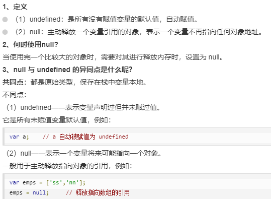
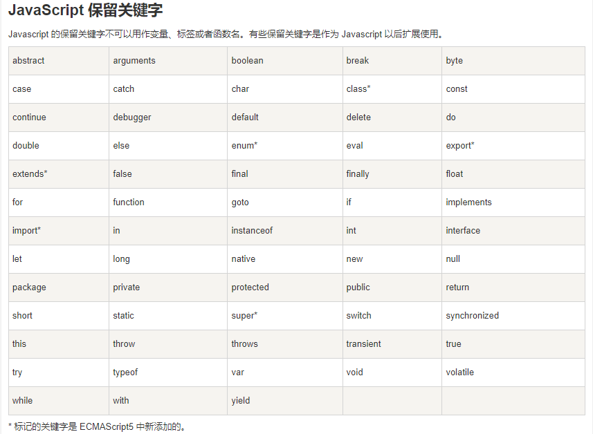

# 1. JavaScript入门

一个前端网页主要由三门语言组成，他们之间是**缺一不可**的关系

- HTML：确定网页的**结构**（标记语言）
- CSS:：确定网页的**样式**（标记语言）
- JavaScript： 确定网页的**行为**（交互）（编程语言）
  - 众所周知，在前端开发中一个网页的源代码主要由三部分组成（HTML,CSS,Javascript）,其中HTML确定网页的结构，CSS确定网页的样式,而JavaScript则主要负责网页的行为（动态效果，交互事件等）。

## 1.1. js三个组成部分

- **ECMAScript** - JavaScript的**核心**（ECMA是欧洲计算机制造协会European Computer Manufacturers Association），目前流行的是ES6语法
  - ECMAScript定义了JavaScript的**语言规范**，是一种标准
  - JavaScript的核心：描述了语言的基本语法和数据类型，ECMAScript是一套标准，定义了一种语言的标准与具体实现无关
- **DOM**- 文档对象模型（document object model）
  - 一套操作页面元素的API
  - DOM可以把HTML看做是文档树，通过DOM提供的API可以对树上的节点进行操作
- **BOM** - 浏览器对象模型（browser object model）
  - 一套操作浏览器功能的API
  - 通过BOM可以操作浏览器窗口，比如：弹出框、控制浏览器跳转、获取分辨率等

## 1.2. js的三种书写方法

- JavaScript也有三种书写方式，并且与CSS的三种书写方式几乎一致
- 1.**行内样式**：写在html标签里面，不推荐，因为不便于维护，后面vue框架会用到
  - `<button onclick="window.alert('js行内写法')">今天天气真好</button>`
- 2.**内部样式**：写在script标签中，如果界面js代码较少可以使用，复杂的话不推荐，通常写在body标签的尾部
  - `<script >alert("这是JS内联样式")</script >`
- 3.**外部样式**：写在js文件中，使用script的src属性导入，通常在head标签里面就引入，开发常用
  - `<script src="./01-JS外联写法.js"></script>`

注意点：

- 无论是CSS还是JS的三种写法，当一个html文件存在多种写法时要记住html的代码是**从上往下解析**的，如果先加载的 JavaScript 期望修改其下方的 HTML，那么它可能由于 HTML 尚未被加载而失效，因此，将 JavaScript 代码放在 HTML页面的底部附近通常是最好的策略即**body标签的尾部**
- 如果script标签没有src属性则表示内联样式，如果有src属性则表示外联样式，外联样式js代码只能写在js文件中而不能写在script标签中，写在script标签里面的代码无效

## 1.3. js的注释写法

代码注释的作用：

- 1.理清思路，方便自己以后阅读代码
- 2.规范编程，方便以后别人接手代码便于维护

```html
<head>
 <style>
        /* less里面的注释 同js一样*/

        /* css单行注释 */

        /* css多行注释1
        css多行注释1
        css多行注释1 */
    </style>
</head>
<body>
	<!-- html单行和多行是一样的 -->
    <!-- <a href=""></a> -->

    <!-- <a href=""></a>
    <a href=""></a>
    <a href=""></a> -->
    <script>
        // 单行注释 : 注释一些简单的代码

        /* 多行注释  
        第一行注释
        第二行注释
        */
    </script>
</body>
```

## 1.4. 输入输出语句

### 1.4.1. 输入

**输入**就是**用户输入数据**，可以用来储存数据，可以赋值给变量

```javascript
	// 2.1 弹出一个输入框 可以输入文本
    prompt('请输入数值')
    // 2.2弹出一个确认框
    confirm('确认执行吗？')
```

### 1.4.2. 输出

输出就是**打印一些数值**，注意只是用来**展示数据**，并不能存储数据，赋给变量会显示undefined

```javascript
// 1.1.alert() 弹出一个提示框
    alert('hello world')

// 1.2console.log('') 控制台中打印数据，不是给用户看的，而是给程序员自己看的，打印数据自己调试，有些网站会把一些隐藏信息放在f12的console里面
    console.log('欢迎来到武汉')
    // 快捷键 log 可以自己在首选项>用户片段>javascript.json中修改快捷键
    // 打印在一行，中间用逗号隔开
    console.log('我的', '世界')

    // 1.3 document.write() 在页面输出数据，可以写标签
    document.write('<h2>测试输出数据</h2>')
    document.write('<span>我的</span>    <span>世界</span>')
    // 多个标签不用逗号， 逗号和空格会被当做字符串打印出来，多个空格只会渲染出来一个空格，块级元素还是一行显示，不能换行，但是反引号可以换行，标签可以分开打印，比如标签的头部和尾部用两个document.write语句打印也是一个完整标签的作用
```

> **括号里面的引号不要掉了**，掉了之后编译器会把它当做变量，报undefined的错误

## 1.5. js结束符

1 分号;作用 : **结束符**,代表一个语法书写结束 

2 如果一行代码只有一个语句,则可以省略分号（js编译器会自动给你加，回车会被编译器识别成结束符）

3 开发中,一般保持代码风格统一。要么每一个语句都加分号，要么都不加

> 现在提倡不加分号，特殊情况：匿名函数的自调用的上一个语句需要加上分号

## 1.6.补充 程序运行原理

程序运行原理：

1. 计算机将存储在硬盘中的html文件读取到**内存**中

2. **浏览器内核编译器**开始编译代码（cpu只能处理二进制数据，需要将我们写的代码转成二进制）

3. **CPU**处理与计算

4. CPU将我们代码在运行时产生的数据保存到内存中


# 2. 数据类型

## 2.1 简单介绍

- 为什么需要有数据类型？

每一种编程语言都有自己的语法规则,在处理数据的时候,也会有自己的规则，不是任何数据都可以处理的

- 什么是数据类型？

js编译器在解析代码的时候，会产生各种不同的数据。 而不同的数据'**运算**'与'**存储**'方式都不同,，计算机需要对这些数据进行分类，称之为**数据类型**

## 2.2. 五种基本数据类型

### 2.2.1. 字符串string

字符串，一切以  单引号''  双引号""  反引号\`\`包起来的内容，三种引号都可以，建议统一只写一种，反引号可以用来解析变量

作用 : 用于**展示文本**

```js
	console.log('我是')
    console.log("双引号")
    console.log(`反引号`)
    // 字符串嵌套（可以用转义字符\输出引号）
    console.log("我'喜欢'你")
    console.log('我"喜欢"你')
    // 组合类型
    console.log('教室401');
    // 只写张三不加引号控制台会报错
```

> **反引号**支持文本内容换行，同时支持写${变量名}读取变量的值

### 2.2.2. 数字number

数值，即一切数学中的数字

作用：用于**数学计算**

```js
	console.log(123)
    // 正无穷 首字母要大写 仍然是数字类型
    console.log(Infinity)
    // 负数小数都可以
    console.log(-2)
```

### 2.2.3. 布尔型bool/boolean

布尔，只有两个值 :  true（真）false（假）

作用 : 用于**条件判断**：true:条件成立 ，false:条件不成立

```js
	console.log(true)
    console.log(false)
```

### 2.2.4. 未定义undefined

未定义 ，只有一个值 undefined

```js
console.log(undefined)
```

- 只声明变量，不赋值的情况下，变量的默认值为 undefined
- 三元表达式，判断条件后。代码1或者代码2没有结果时，为undefined

### 2.2.5. 空值null

空值  只有一个值 null，null值只有自己手动赋值才会出来，其他未出现的值都是编译器都解析为undefined

```js
console.log(null)
```

> 控制台字符串是黑色，数字是蓝色。布尔型是蓝色，undefined和null是灰色

### 2.2.6. undefined与null区别

定义：

1. undefined : 未定义，本来该有值，但是还没给。 当变量只声明,但是没有赋值。此时默认值是undefined
   通俗地讲 : undefined相当于期房。 买了房，但是房子还没建出来。未定义
2. null : 有定义为空值，可能为空对象。 变量有赋值但是为空。
   通俗地讲 ： null相当于毛坯房。买了房,但是房子没住人,里面是空的。

相同点：值相等，转布尔类型都是false

```js
		console.log(undefined == null) //true
        console.log(Boolean(undefined)) //false
        console.log(Boolean(null)) //false
```

不同点：数据类型不同，转number类型值不同

```js
		console.log(undefined === null) //false
        console.log(Number(undefined)) //NaN
        console.log(Number(null)) //0
```



## 2.3. typeof检测数据类型

语法：typeof 数据 或者 typeof （数据）

结果：得到一个字符串来告诉你这个数据是什么类型

```js
	    console.log(typeof 123) //number
        console.log(typeof '123') //string
        console.log(typeof true) // boolean
        console.log(typeof undefined) // undefined
		/*  object数据类型，可以认为JavaScript中顶级数据类型.在JavaScript绝大多数高级类型对象都是object类型 */
        console.log(typeof null) //object
```

数组返回object

null返回object

要解决使用

```js
        console.log( Object.prototype.toString.call( nul ) )//[object Null]
        console.log( Object.prototype.toString.call( arr ) )//[object Array]
```

## 2.4. 强弱数据类型

 js是**弱数据类型**，变量到底属于哪种类型，只有赋值之后，我们才能确认，不用事先定义，java、c++、python是强类型语言 例如int a=3必须是整数

**强类型**是在编译的时候就确定类型的数据，在执行时类型不能更改，而弱类型在执行的时候才会确定类型。没有好不好，二者各有好处，强类型安全，因为它事先已经确定好了，而且效率高。弱类型更灵活，但是效率低，而且出错概率高

# 3. 变量

变量的作用是在内存中**存储数据**。在最新的ECMAscript6语法中，是用let去定义一个变量，在ES5中是用var定义变量，区别如下：

1. var是函数作用域，而let是块作用域。在函数内声明了var，整个函数内都是有效的，在for循环内定义了一个var变量，实际上其在for循环以外也是可以访问的，而let由于是块作用域，所以如果在块作用域内（for循环内）定义的变量，在其外面是不可被访问的

在es6（ECMAScript6）之前，是没有块级作用域，所谓块级作用域，就是用{}包含的区域，我们常用的有for，while，if等。但是在块级作用域中用let声明变量，那么此变量就有了块级作用域，就必须只有在此块级作用域才能访问此变量

2. var可以允许重复声明相同的变量，后者会覆盖前者，let则不能重复声明相同的变量
3. 用var定义时，不管变量被声明在函数什么位置，所有变量声明都会被提升至函数顶部（预解析阶段）（变量声明指 var a; 即声明还未赋值），如 var a=1写在打印的后面，var a会被提升至函数顶部，但是1的赋值并未提升

提一下什么是预解析？
let来声明变量时，一定要声明之后才能使用。

ES5中有预解析机制，浏览器再执行js代码时会分成两部分操作：预解析以及逐行执行代码。也就是说浏览器不会直接执行代码，而是加工处理（预解析）之后再执行

预解析的过程：

1. 将变量声明提升到当前作用域的最前面（赋值还是在原来的位置，只是将声明提升到最前面）
2. 将剩余代码按照书写顺序依次放到后面，注意let的变量不会被提升

## 3.1. 变量的基本使用

1. 声明变量 ： 在内存中开辟一个空间
   `let number`
2. 变量赋值 写入内存
   = : 赋值运算符（把右边的数据放入左边的变量中）
   `number = 20`
3. 变量取值 ： 读取变量(容器)中存储的数据
   `console.log(number)`

常用的是变量在声明的时候就赋值，赋一个初始值
`let a=0或者null`

可以let多个变量，用逗号隔开就可以

```javascript
	    let a = 2,
            b = 3,
            c = 6
        console.log(a, b, c)
```

## 3.2. 变量注意事项

1. 变量不允许重复声明的，一个变量只能let声明一次，不然控制台出现declared的报错
2. 变量重新赋值 : 先销毁（回收）旧值，然后存入新值
3. 变量之间赋值 ： 取出变量的数据拷贝一份，然后复制

```js
let number=18,
	age=20
    number = age
```

number的值仍然为20，未改变

## 3.3. 变量的命名规则和规范

### 3.3.1. 规则

规则 ： 代码必须强制遵守，不遵守则程序报错

1. 变量名必须以： 字母、下划线_ 、$符号开头，结尾可以是字母、下划线_ 、$符号、数字，变量名不能以数字开头

```js
let _a=1
let $b=2
let res=10
```

2. 变量不能使用关键字作为变量名
   比如let、break、case、catch、new等具有实际逻辑意义的关键字不能作为变量名，但是可以使用大写，编译器是区分大小写的，confirm这些是js内置的语句不是关键字，但是一般也不用

```js
let Let=20
let confirm=10
```

js中的关键字

> break、else、new、let、var、case、finally、return、void、catch、for、switch、while、continue、function、this、with、default、if、throw、delete、in、try、do、instranceof、typeof



### 3.3.2. 规范

大家共同遵守的一种习惯，不遵守，不报错。但是不规范，但是后期很难维护，易读性太差

1. 变量取名要有意义，最好是英语名词，达到见名知意的效果最好

```js
let name
let time
```

2. 多个单词使用驼峰命名法 : 第一个单词首字母小写，后面单词首字母大写

```js
let girlFriend = 'mark'
console.log(girlFriend)
```

## 3.4. 常量

变量的值可以修改, 使用let声明。常量的值不可以修改，使用const声明，也有字符常量、数字常量等

```js
const G = 9.8  const PI = 3.14 //现实中那些固定不变的值
```

## 3.5. 字面量

js中的数据有两种使用方法：

1. 先存入变量中,，通过变量取值语法来使用，变量用let声明
2. 不存入变量中，直接拿来使用，就是字面量，就是一个固定的数据，字面量用const声明

> 等号的左边只能是变量，字面量不能出现在等号的左边

字面量有下面五种：

```js
 	   '123' //字符串字面量
        123 //数字字面量
        true //布尔字面量
		[10, 20, 30] //数组字面量
        {
            name: '111'
        } //对象字面量
```

常量和字面量的区别（有的时候并没有区别）：

```js
		let a;  //a为变量
         const b=10; //b为常量,10为字面量
         let str="hello world"; //str为变量,hello world也为字面量
```

## 3.6. 变量作用域

定义：js中变量的**作用域**就是指变量可以使用的区域
作用：避免变量污染（变量名相同导致代码冲突）

三种作用域：

1. 全局作用域（全局变量）：在函数外面let的变量 可以在页面的任何区域使用和修改
2. 局部作用域（局部变量）: 在函数里面let的变量，只能在函数内部使用，比如函数的形参和函数里除块级以外的变量
3. 块级作用域（块级变量）：在分支或循环大括号中let的变量，只能在大括号{}里面使用，包括小括号()里面的变量比如for里面的循环变量i

```js
        //1.全局变量
        let num = 10
        //函数
        function fn(a, b) {
            //2.局部变量（包括形参）
            // 局部变量只能在函数内部
            let age = 18
            console.log(age)
        }
        console.log(age) //报错. 
        fn(1, 2)
        // 3.块级变量
        //以for循环为例，包括分支和循环（包括小括号里面的变量）
        for (let i = 1; i <= 6; i++) {
            console.log(i)
        }
        console.log(i) //报错
        // 块级变量只能在大括号内部
        console.log(num) //10
```

变量有一个坑， 特殊情况：如果函数内部或者块级作用域内部，变量没有声明，直接赋值，也当全局变量看，但是强烈不推荐，不符合规范

# 4. 运算符与表达式

运算符 : 有运算作用的符号

表达式：由运算符组成的式子，一定会有运算结果，要么存起来，要么打印

再说一下后面要写到的语句的含义：让js编译器执行某个命令,做什么事情 （执行某个功能）

## 4.1. 算数运算符和表达式

算术运算符：用于数学算术运算，加减乘除与求模  \+ - * / %(求模运算,相当于取余数) 

算术表达式 ： 由算术运算符组成的式子

> 除法其实几乎不怎么用，因为除法可以用乘法代替。除以2与乘以0.5是一个意思

## 4.2. 赋值运算符

赋值运算符   =  +=  -=  *=  /=   %=

num = num + 5 与 num += 5 的结果是一样的

> 等号左边的只能是变量，不能是字面量

## 4.3. 自增自减运算符

自增运算符 ++ 自减运算符 --，就是变量自身加一或者减一

```js
//要实现num+1的需求
	   let num = 0
        num++ //优先使用
        num = num + 1
        num += 0.
1
```

## 4.4. 连接符

```js
	let name = prompt('请输入你的姓名')
    let age = prompt('请输入你的年龄')
```

现在要将用户输入的信息用一句话连接起来

1. 错误方式 ： 此时name和age都是字符串的一部分，无法取值

    `console.log('我的姓名是name，我的年龄是age')`

2. 正确方式： 使用连接符 +

+号 ： 只要遇到字符串,就是连接符

` console.log('我的姓名是：' + name + '，我的年龄是' + age)`

3. 推荐方式： 使用**模板字符串** `` (反引号)，反引号里面的内容可以换行，显示也显示换行

作用： 拼接字符串 ${ 变量名 }

```js
console.log(`我的姓名是${name}，我的年龄是${age}`)
```

> 重点：加号只有遇到字符串才是连接符

## 4.5. 关系运算符和关系表达式

关系运算符作用 : 比较两个数据的关系，结果是bool型true或false 

< >  <= >= 

 ==（相等）  !=（不等） 不比较数据类型，!=和==结果一定相反，遇到!=先看==

 ===（全等）  !==（不全等）先比较数据类型，!==和===结果一定相反，遇到!==先看===

```js
	console.log('1' == 1) //true
    console.log('1' === 1) //false
    console.log('1' != 1) //false
    console.log('1' !== 1) //true
```

## 4.6. 逻辑运算符和逻辑表达式

逻辑运算符：计算多个条件是否成立（实际上结果不一定是true或者false）

逻辑运算符只有三种

          \* && :逻辑与，读作并且 一假则假 都满足才true
    
          \* || :逻辑或，读作或者 一真则真 有一个满足就true
    
          \* !  :逻辑非，读作取反（对布尔类型） true取反是false

逻辑表达式: 表达式1 逻辑运算符 表达式2

```js
 // 与
  Boolean(1 > 10 && 2 > 1)
  // 或
  Boolean(1 > 0 || 3 == 5)
  // 非
  Boolean(!(1 > 0))
```

## 4.7. 运算符优先级

运算符优先级： 不同的运算符在一个式子中的运算顺序

| 运算符                  | 优先级小从上到下 | 备注                   |
| ----------------------- | ---------------- | ---------------------- |
| ()                      | 0                | 小括号优先级最高       |
| ++  --  !               | 1                | 一元运算符             |
| / * + -                 | 2                | 算术 先* / % 再 + -    |
| < > >= <= != == !== === | 3                | 关系运算符             |
| && \|\|                 | 4                | 逻辑与比逻辑或优先级高 |
| =                       | 5                | 赋值运算符优先级最低   |

> 开发中遇到复杂的式子，一般使用()小括号提升优先级