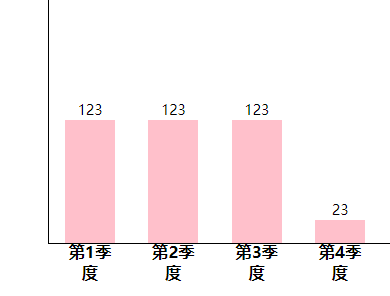

# 1. 数组基本语法

**数组**（array）、**函数**（function）和**对象**（object）属于复杂的数据类型。

数组可以说也是一个变量，可以‘存储多个数据’，数组在内存由三个部分组成（数组三要素）：

- **元素**：数组中的数据（数组才有元素这个称呼）
- **下标或索引**（index）：元素的位置（从0开始）
- **长度**（length）：元素的数量（存了多少个数据）编译器自动检测长度，数值上等于最大下标加1

## 1.1. 基本使用

```js
使用数组： 一个变量存储多个数据
        let array = ['小明', '小刚', '小花', '小美', '小白']
        // 打印数组所有元素
        console.log(array)
        // 打印下标为2的元素
        console.log(array[2])
        // 打印数组长度
        console.log(array.length)
```

## 1.2. 语法

1. 数组声明加赋初始值：  let  数组名 = [元素1,元素2,元素3,.......] 
   通常只存**相同数据类型**的数据，也是一个变量，但是里面存的是数组，叫作数组名

```js
let arr = [80, 90, 90, 95]
```

也可以定义空数组 `let arr=[]`

> 注意：
>
> - 数组长度由编译器自动给出，不需要定义，空数组时，`a[2] = 3`赋值的是最后一个元素，前两个是空属性
> - 空数组如果定义固定了长度，a[6]=2超过长度的赋值无意义不生效

2. 数组取值    数组名[下标] 

```js
console.log(arr[2])
```

3. 数组长度    数组名.length

```js
console.log(arr.length)
```

> // 直接打印arr，控制台会出现数组三要素`console.log(arr)`

## 1.3. 数组遍历

**数组遍历**就是依次读取数组每一个元素值，是数组其他所有应用的基础，很重要

```js
			固定格式的for循环:  
                for(let i = 0;i < arr.length ;i++){
                    arr[i]
                }
```

> - i<arr.length与i<=arr.length-1是一样的
> - 注意循环条件数组长度千万不要直接写length

# 2. 数组操作

数组的操作就是四种最基本的操作：增、删、改、查

## 2.1 增

### 2.1.1. 在尾部增（常用）

语法：`数组名.push（元素）`一个或者多个元素添加到末尾，常用的是只push一个数据，多个元素的话之间用逗号隔开

> 注意不要写成`arr.push()=10`，这是调用方法/函数

### 2.1.2. 在头部增

语法：`数组名.unshift（元素）`一个或者多个元素,添加到开头，用法同push

### 2.1.3. 在任意位置增

语法：`中间新增：arr.splice(index,0,items1,items2...)`

index是下标起始位，从这里开始新增，包含这个下标，第二个参数0表示删除0个元素，第三个及后面的是新增的元素。新增的第一个元素的下标就是index

## 2.2. 删

### 2.2.1. 在尾部删

语法：`数组名.pop() `删除末尾的一个元素

### 2.2.2. 在头部删

语法：`数组名.shift()`删除开头的一个元素（shift是移开移走的意思）

> 注意上面的pop和这里的shift小括号里面没有内容，加了也无效

### 2.2.3. 在任意位置删

语法：`数组名.splice(start,deleteCount)`删除数组指定位置指定数量的元素

start是数组下标，splice是拼接，移接的意思，从start下标（包含start）开始往后删除deleteCount个元素

## 2.3. 改（不存在就新增）

语法：` 数组名[下标] = 值`给数组赋值覆盖原来的值就是修改数组

1. 下标存在：修改元素值
2. 下标不存在：新增元素值
   控制台会出现延迟的现象，元素先新增了，长度延迟改变，不影响开发 

> 如果不按顺序给数组赋值，比如本来长度为5，执行`arr[10]=5`则中间的都是undefined 

## 2.4. 查（首先要查到）

语法：`数组名[下标]`要么打印要么赋值给变量

1. 下标存在：获取元素值
2. 下标不存在：获取undefined值，未定义

> 小技巧：以后出现undefined值一定是数组下标写错了

## 2.5. 小结

### 2.5.1. 易错点

1. 新增 arr.push()=60

 改正：arr.push(60)

2. 删除末尾的一个元素 arr.pop(50)

改正：arr.pop()

### 2.5.2. 知识小结

1. 数组三要素

          元素：数组存储的数据
          
          下标：元素的位置（下标从0开始）
          
          长度：元素的数量（长度=最大下标+1）

2. 数组声明

          let 数组名=[元素1,元素2......]

3. 数组新增一个或者多个（增）

          末尾新增：arr.push(元素)
          
          开头新增：arr.unshift(元素)
          
          中间新增：arr.splice(下标起始位,0,items1,items2...)

4. 数组删除一个（删）

          删除末尾：arr.pop()
          
          删除开头：arr.unshift()
          
          删除中间：arr.splice(下标起始位,deleteCount)

5. 数组修改（改）

          数组名[下标]=值

6. 数组查询（查） 

          查询一个元素：数组名[下标]
          
          查询每一个元素：
          
          for(let i=1;i<arr.length;i++){arr[i]}

# 3. 数组应用

数组的大部分应用都是基于数组的遍历

## 3.1. 求和

累加和 : 求一组数据的总和 

1. 声明一个变量存储结果
2. 遍历数组中每一个元素，这种思路也可以不仅仅用于数组
3. 累加

```js
	let arr = [20, 29, 109, 23, 2],
      sum = 0
    for (let i = 0; i < arr.length; i++) {
      sum += arr[i]
    }
    console.log(sum)
```

## 3.2. 求最大值

求出一组数据的最大值：

1. 声明最大值变量默认为第一个元素
2. 遍历数组
3. 依次比较大小，然后赋值

```js
		let arr = [20, 3, 43, 234, 12],
            max = arr[0]
        for (let i = 1; i < arr.length; i++) {
            if (max < arr[i]) {
                max = arr[i]
            }
        }
        console.log(max)
```

## 3.3. 数组筛选

1. 遍历数组找出指定范围符合条件的数
2. 把符合条件的数放入新数组中（新增元素）

```js
		let arr = [10, 23, 3, 4, 432, 21, 32, 3, 5],
            newArr = []
        for (let i = 0; i < arr.length; i++) {
            if (arr[i] >= 10) {
                newArr.push(arr[i])
            }
        }
        console.log(newArr)
```

## 3.4. 数组去0

实际开发场景：去除数组中指定的元素，生成新数组

1. 微信账单： 收入 + 支出。  需求是只看收入（支出类型去除）
2. 商品列表 ： 京东自营（把非自营商品去除）

做法就是数组删选做法，把if中换成`arr[i]!=0`即可

## 3.5. 根据数组生成柱状图

需求 

1. 让用户输入四个季度数据，存入数组中
2. 根据数组中的数据，生成页面柱状图



数据先存入数组中

```js
let arr = []
    for (let i = 1; i <= 4; i++) {
      let num = +prompt(`请输入第${i}季度的数据`)
      arr.push(num)
    }
```

生成柱状图，累加和来拼接字符串

```js
	let str = ''
    for (let i = 0; i < arr.length; i++) {
      str += `<div style='height:${arr[i]}px'>
      <span>${arr[i]}</span>
      <h4>${i+1}季度</h4>
    </div>`
    }
    document.write(`<div class="box">${str}</div>`)
```

补上css样式

```css
	.box {
      width: 800px;
      height: 400px;
      margin: 50px auto;
      border-left: 1px solid #000;
      border-bottom: 1px solid #000;
      display: flex;
      justify-content: space-around;
      align-items: flex-end;
      text-align: center;
    }
    .box>div {
      width: 50px;
      height: 100px;
      background-color: pink;
      display: flex;
      /* 修改主轴方向为垂直方向 */
      flex-direction: column;
      /* 主轴对齐方式 */
      justify-content: space-between;
    }

    .box>div>span {
      margin-top: -20px;
    }
    .box>div>h4 {
      margin-bottom: -25px;
    }
```

## 3.6. 根据数组生成手风琴盒子

需求：图片hover之后会变宽，多余的需要隐藏


```js
 		let arr = [
            './images/1.jpg',
            './images/2.jpg',
            './images/3.jpg',
            './images/4.jpg',
            './images/5.jpg',
            './images/6.jpg',
            './images/7.jpg',
        ]
        // 拼接字符串
        let str = ''
        for (let i = 0; i < arr.length; i++) {
            str += `<div></div>`
        }
        document.write(`<div class="box">${str}</div>`)
```

实际开发中，这图片地址都是网络地址，在运营人员在后台上传了图片后，这边的图片会自动变化，实时动态加载数据，不需要前端人员再去修改代码

补上CSS样式

```css
		.box {
            width: 1120px;
            height: 260px;
            margin: 50px auto;
            display: flex;
            overflow: hidden;
        }
        .box>div {
            width: 120px;
            border: 1px solid #fff;
            transition: all 0.5s;
        }
        .box>div:hover {
            width: 400px;
        }
```

## 3.7. 小结

1. 累加和
   1. 声明一个累加变量 let sum=0 或者let str=''
   2. 遍历数组
   3. 累加
2. 求最大值
   1. 声明一个变量默认为数组第一个元素，let max=arr[0]
   2. 遍历数组
   3. 依次比较大小，然大的赋值给max
3. 筛选：找出数组中所有满足条件的元素
   1. 声明空数组newArr存储筛选后的元素
   2. 遍历arr，将满足“筛选条件”的元素，新增到newArr