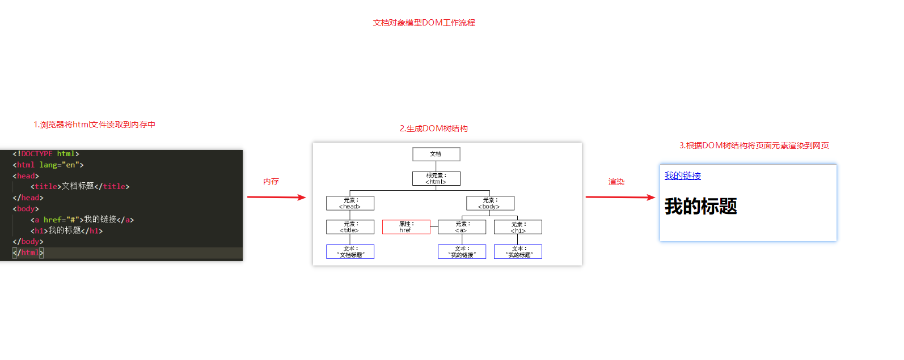
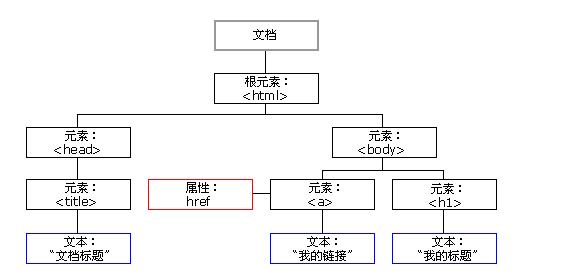
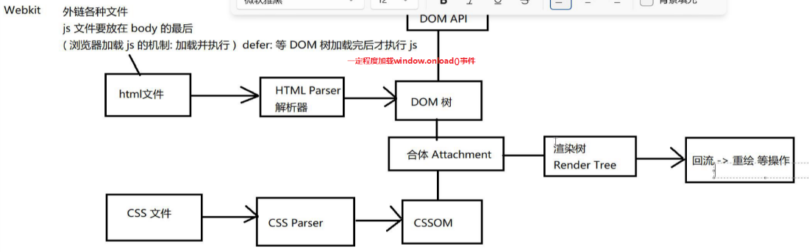
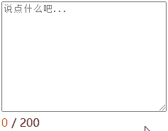

# 1. WebAPI介绍

## 1.1. JavaScript组成

### 1.1.1. 三部分

* 1.ECMAScript - JavaScript的核心
  * 定义了javascript的语法规范
  * JavaScript的核心，描述了语言的基本语法和数据类型，ECMAScript是一套标准，定义了js语言的标准
* 2.DOM - 文档对象模型
  * 一套操作页面元素的API
  * DOM可以把HTML看做是文档树，通过DOM提供的API可以对树上的节点进行操作
* 3.BOM - 浏览器对象模型
  * 一套操作浏览器功能的API
  * 通过BOM可以操作浏览器窗口，比如：弹出框、控制浏览器跳转、获取分辨率等

### 1.1.2. webAPI

定义：API（Application Programming Interface,应用程序编程接口）是一些预先定义的函数，目的是提供应用程序与开发人员基于某软件或硬件得以访问一组例程的能力，而又无需访问源码，或理解内部工作机制的细节，包括dom和bom。

白话文：web是dom（网页内容）+bom（浏览器窗口），api是预先定义的接口（一般是函数）不关心内部逻辑，只关注如何使用，webApi就是操作网页内容（html元素）和浏览器窗口的函数

> html骨架结构的第一句代码<!DOCTYPE html>声明是一个html文档

## 1.2. dom原理

dom工作原理本质上就是如何用js语法去增删改查，去动态操作页面内容，具体流程如下：

1. 浏览器将代码从硬盘读取到内存中
2. 当网页被加载时，浏览器会创建页面的文档对象模型，JavaScript引擎将解析页面结构生成一颗dom树（js在这个阶段发挥作用，修改dom树，dom树变了页面内容自然会变）
3. 渲染引擎将dom渲染到页面上

理清关系：document是一个对象，里面存了一套api函数，调用方法后返回的是dom对象也可以是（比如querySelectorAll）伪数组，但是都可以直接拿到或者通过某种方法可以拿到页面中的所有网页元素（称为dom对象），可以通过赋值操作这个dom对象

dom对象逻辑上是一颗dom树，物理上存在堆中，dom对象中又存了很多对象（可能是属性或者对象等）



> 网页中所有的内容都存在这一课dom树中（逻辑上）





# ==2. 查询页面内容==

查找DOM元素/DOM对象就是选择页面中标签/元素，==动态操作页面的前提就是先获取到需要改的dom对象==

## 2.1. 常用两种查询方式

常用的是两个查询函数语法 （==查询==是其他增删改的前提），注意括号里面的引号，里面的选择器可以写css的任意选择器，但是querySelector写伪类选择器想选多个时也是只能选择满足条件的第一个dom对象

> 写之前一定要考虑是拿一个还是一组dom对象调用方法不同

### 2.1.1. 获取单个元素

获取单个元素 ： `document.querySelector('选择器')`得到dom对象, 可以直接使用dom语法修改

* @description: 获取满足条件的第一个元素
* @param {string}  ==选择器字符串（和css一样）== 没有点代表标签选择器（这里很容易写错！）
* @return:  dom对象（存储的是和dom相关的内容，class等是他的属性）就是返回一个标签或者返回 null（目前就这一个地方出现，null ->空对象）

```js
let box = document.querySelector('.box')
    // 现阶段变量名等于选择器的名字不带点
    console.log(box)
```

### 2.1.2. 获取多个元素

获取多个元素 : ` document.querySelectorAll('选择器')`得到数组, ==不可以直接使用dom语法，需要通过下标先取出里面的dom对象==

* @description: 获取满足条件所有元素
* @param {string}  选择器字符串  
* @return:  一定是伪数组 （有三要素下标、元素、长度。 但是没有数组的那些增删改查的语法，只能看不能改，可以遍历，有length属性 ）（一个也没有的话返回的是空伪数组，长度为0，不是返回null，一个元素返回长度为1的数组）

```js
let boxList = document.querySelectorAll('.box')
    // let boxArr = document.querySelectorAll('.box')
    // boxList或者boxList
    console.log(boxList)
```

> `document.querySelectorAll('.box')[0].style.backgroundColor = 'red'`这个==对象数组==必须先取出里面的对象后才能直接操作页面元素

## 2.2. 获取元素其他方式（了解）

以前老版本的元素获取需要各种类型的选择器分开写，很麻烦，这里了解即可，看到要知道

1. 根据id名获取元素（不用写#号，id具有唯一性）

```js
    let btn = document.getElementById('btn')
    console.log(btn)
```

2. 根据标签名获取元素（伪数组）

```js
   let liList = document.getElementsByTagName('li')
    console.log(liList)
```

3. 根据类名获取元素（伪数组）

```js
   let boxList = document.getElementsByClassName('box')
   console.log(boxList)
```

4. 根据name值获取表单元素（伪数组）

```js
   let genderList = document.getElementsByName('gender')
   console.log(genderList)
```

# 3. 操作页面内容

DOM对象都是根据标签生成的，所以操作DOM对象，本质上就是操作网页的html标签，而网页中的所有内容在逻辑上都存在DOM树中，可以通过直接或者间接（伪数组）获取到到所有的DOM对象

## 3.1. 元素内容操作

双标签里面的内容叫做元素的内容，单标签通过value值获取内容

语法：

1. 元素.innerText :  获取文本 （包含子元素所有文本内容，标签也当做文本，只是不打印标签名），拿到的是字符串

```js
let box = document.querySelector('.box')
console.log(box.innerText)
box.innerText = '<h1>我是标题</h1>'//h1的标签样式无法解析，标签名会被当成纯文本
```

2. 元素.innerHTML :  获取文本 + 标签 （也是文本的形式打印文本和标签）
   可以和document.write()一样动态给页面添加元素

```js
let box = document.querySelector('.box')
console.log(box.innerHTML)
box.innerHTML = '<h1>我是标题</h1>'//h1标签的样式可以被解析
```

> 这两个属性是互相覆盖的，只是一个可以解析标签，innerText会把里面解析成文字，innerHTML把标签解析并显示出来，修改时候写的标签名不显示

## 3.2. 元素属性操作

可以获取到dom对象（也叫元素或者标签）的属性进行修改，语法：`元素.属性名`

1. 先获取dom对象（元素）

```js
let a = document.querySelector('a')
let img = document.querySelector('img')

```

2. 再获取存储在其中的属性进行修改（直接覆盖就行）

```js
a.href = 'http://www.baidu.com'
img.src = './images/02.jpg'

```

> 最常见的就是a的href、img的src和title

## 3.3. 元素样式操作

### 3.3.1. style操作样式（行内权重仅次于!important）

style本质也是标签的属性，叫作属性样式，属于行内样式

修改单个样式：   `元素.style.样式名 = 样式值`，style也是一个对象存储元素的各种css样式，存储在dom对象里

```js
let box = document.querySelector('.box')
box.style.width = '200px'

```

注意点： 

1. 如果css属性有- 的需要转成小驼峰命名 （原因：js命名规范与css命名规范不一样）。小驼峰： 去掉-，并且第二个以后的单词首字母都要大写（css中-后面的首字母大写）
2. 赋值的时候，需要的时候不要忘记加css单位和外面的引号，数字不用加引号

> * 所有的元素都有默认的所有css样式，虽然dom对象存的是空字符串，但是css有继承性，继承body的属性
> * ==每一个标签都有默认的样式==，如果赋给空字符串，会自动加载默认样式
> * 获取body标签，直接`document.body`或者`document.querySelector('body')`

### 3.3.2. className操作样式（类名权重，会覆盖原来的不常用）

修改多个样式：  ` 元素.className = '类名'`

提前写好的css的样式，调用类名，会覆盖原来的类名

注意点：不用class是因为class是js中的关键字，在ES6中，class （类）作为对象的模板被引入，可以通过 class 关键字定义类

```js
<div class="box one" style="width: 100px;height: 100px;background-color: pink"></div>
    <script>
        let box = document.querySelector('.box')
        console.log(box.className) //box one
        box.className = 'two'//two 覆盖了原来的两个，并且不能一次添加多个类名
    </script>

```

> 不加点是类名，加点代表的是选择器，注意这里加的类名不要加点，同下

### 3.3.3. ==classList操作样式==（类名权重 常用）

修改多个样式：   `元素.classList`

提前写好的css的样式，调用类名，不会覆盖原来的类名

| 含义     | 语法                                  | 备注                                   |
| -------- | ------------------------------------- | -------------------------------------- |
| 新增类名 | 元素.classList.add('类名1','类名2')   | 加一个或多个，多个用逗号隔开           |
| 移除类名 | 元素.classList.remove('类名','类名2') | 加一个或多个，多个用逗号隔开           |
| 切换类名 | 元素.classList.toggle('类名')         | 有则移除，无则新增                     |
| 判断类名 | 元素.classList.contains('类名')       | 返回一个bool类型，有这个类名就返回true |

## 3.4. 表单元素常用属性

```html
  <!-- 输入框的value值是文本 -->
  <input type="text" placeholder="请输入内容" value="我是输入的内容" disabled="'disabled">
  <br>

 <!-- 多选框  获取文字需要用value值 开始结束标签中间一般默认部输入内容-->
  <textarea name="" id="" cols="30" rows="10"></textarea>

  <!-- 单选框 -->
  <input type="radio" name="gender" checked>男
  <input type="radio" name="gender">女
  <br>
  <!-- 多选框 -->
  <input type="checkbox" name="goods">商品1
  <input type="checkbox" name="goods" checked>商品2
  <input type="checkbox" name="goods">商品3
  <input type="checkbox" name="goods">商品4
  <br>

  <!-- 特殊表单双标签，拿里面的文本可以用innerText但是不知道是第几个.value获取哪个被选中的那个value值 这里select标签的value值是2-->
  <select name="" id="">
    <option value="1">前端</option>
    <option value="2" selected>java</option>
    <option value="3">ui</option>
  </select>
<script>
    // 获取的数组，一定要取下标先取出dom对象。 才可以使用dom语法
    let inputList = document.querySelectorAll('input') //表单
    console.log(inputList)
    let optionList = document.querySelectorAll('option') //下拉
    console.log(optionList)

    //1.表单内容 :  表单元素.value（不能用innerText）
    console.log(inputList[0].value)

    //2.表单状态（写成'false'是字符串，转换bool是true）
    inputList[0].disabled = true //第一个表单禁用
    inputList[2].checked = true // 选中女
    inputList[3].checked = true // 选中商品1
    optionList[2].selected = true // 选中ui
  </script>

```

1. 表单内容：获取input标签（单）和textarea（双）的内容文字区域不能用innerText要用value
2. 表单状态 : ；dom对象这三个状态的属性值为布尔类型（true或false）

| 语法          | 含义                      |                           |
| ------------- | ------------------------- | ------------------------- |
| 元素.disabled | 是否禁用                  | true是禁用，false是不禁用 |
| 元素.checked  | 是否选中(radio与checkbox) | true是选中，false是不选中 |
| 元素.selected | 是否选中 （option）       | true是选中，false是不选中 |

html中，这三个表单属性，写了属性名就是true，不写默认值都是false，写了`disabled='true'`或者`属性名='属性名'`也是true

不属于css样式，与src和href一样是属性，直接点语法

> * `<button> `控件 与 `input type="button"> `相比，提供了更为强大的功能和更丰富的内容。可以在任何时候使用，也可以在form表单里面使用，而input只能在表单标签里面使用。`<button>  </button> `标签之间的所有内容都是按钮的内容，其中包括任何可接受的正文内容，比如文本或多媒体内容
> * 始终为`<button>`按钮规定 type 属性。Internet Explorer 的默认类型是 "button"为普通按钮，而其他浏览器中（包括 W3C 规范）的默认值是 "submit"
> * button标签不是表单标签，也可以提交表单（需要放在form表单域里面）或者用来完成页面交互

# 4. ==事件及注册事件==

1. 定义：事件是JavaScript用来处理用户交互的一种机制，交互就是什么元素在什么时刻做什么事情
2. 事件的三要素：
   * 事件源：操作什么元素、什么元素变（div 、p）-> 获取元素
   * 事件类型：什么时刻（鼠标点击onclick 鼠标移入：onmouseover）-> 注册事件
   * 事件处理函数：做什么事（一段代码：函数）-> 事件处理
3. 注册事件（又叫绑定事件） ： 给元素添加交互，本质是给元素（dom对象）属性赋值，像是给dom对象添加一个dom方法，这个方法名由浏览器内置，注册了（类似于声明函数），交互触发时可以被浏览器底层识别并自动执行，所以事件名写错了不会报错，浏览器解析为动态新增一个方法

语法：`事件源.事件类型 = 事件处理函数`例如`box.onclick = function(){}`

4. ==事件原理==

* 事件在注册的时候，不会执行（函数在声明的时候不会执行）
* 一旦元素注册事件之后，当用户触发了这个事件的时候，浏览器会自动捕捉到这个事件，然后帮我们调用元素对象的事件处理函数，另外一种触发方式是主动执行：手动调用对象事件处理函数`box.onclick()`但一般不这样写，没什么意义

```js
	//获取元素
    let box = document.querySelector('.box')

    //1. 点击事件： box在点击的时候，背景颜色变红
    box.onclick = function () {
      //事件处理函数
      box.style.backgroundColor = 'red'
    }

    //2. 双击事件
    box.ondblclick = function () {
      box.style.width = '200px'
    }

    //3. 鼠标移入
    box.onmouseenter = function () {
      box.style.backgroundColor = 'purple'
    }

    //4. 鼠标移出
    box.onmouseleave = function () {
      box.style.backgroundColor = 'hotpink'
    }

```

> * 任何盒子都可以注册事件，每个盒子都可以注册很多事件
> * 每次点击都会触发事件，如果需要每次点击不一样，则需要设置if条件，单次点击出现多种不同的变化也可能会用到if
> * 专业术语：为DOM对象绑定事件，调用这个事件的方法
> * 右边是匿名函数（没有名字）

# 5. dom01语法总结

1. dom

* 文档对象模型，用来操作网页元素
* 工作原理：
  1. 浏览器将代码从硬盘读取到内存中
  2. js引擎编译器将解析页面结构生成一颗dom树（js在这个阶段发挥作用，修改dom树）
  3. 渲染引擎将dom渲染到页面上

2. 查询元素
   1. `document.querySelector('选择器')` 选中符合要求的第一个元素
   2. `document.querySelectorAll('选择器') `选中符合要求的一组元素，放在一个伪数组中，使用时需要用数组下标选中里面的dom对象
3. 元素属性操作
   1. 内容属性
      `元素.innerText` 选中文本内容，不解析标签
      `元素.innerHTML` 选中标签+文本，可以解析标签
   2. HTML属性 元素.属性名=属性值
      `a.href`
      `img.src`
4. 样式属性
   1. 单个样式 元素.style.属性名=属性值（了解）
   2. 多个样式 元素.className='类名' 调用预先写好的css样式，但是会覆盖以前的类名 不常用
   3. 多个样式（重点） 
      `元素.classList.add('类名')`
      `元素.classList.remove('类名')`
      `元素.classList.toggle('类名')`
      `元素.classList.contains('类名')`
5. 表单样式特殊属性
   1. 表单内容：表单元素.value
   2. 表单布尔属性 disabled、checked、selected
6. 事件
   三要素：事件源、事件类型、事件处理函数
   1. 鼠标事件 
      单击 onclick
      双击 ondblclick
      移入  onmouseenter
      移出 onmouseleave
   2. 键盘事件（大多数情况为表单元素  输入框input、textarea）只要输入一个任意内容包括空格就会触发一次事件
      键盘输入 oninput（键盘输入数字）
      成为焦点 onfocus（鼠标左键点击或者按tab键有光标出现）
      失去焦点 onblur（光标消失）
      键盘按下 onkeydown
      键盘松开 onkeyup
7. 事件执行的步骤：
   1. 获取元素
   2. 注册事件：给元素添加交互，添加一个事件的方法（只是声明）
   3. 事件处理函数
      事件触发（事件处理函数的执行）：
      第一种： 交互触发：用户主动触发交互， 浏览器会捕捉交互，底层会自动帮我们调用对象的方法
      第二种： 主动执行：手动调用对象事件处理函数

# 6. 经典小案例

案例没有思路怎么办：找交互->时间三要素

* 事件源：找元素（操作什么元素，什么元素变）->获取元素
* 事件类型：点击、移入（较为简单）->注册事件    
* 事件处理函数：多用专业术语（较难）->事件处理

        改元素属性：改什么元素 改什么属性 什么条件下改，如什么属性修改为什么值
        
        数量：改一个元素还是每一个还是哪几个

> * 刚开始写的时候，需要每写几行就打一次断点，免得一错全错
> * 事件的断点需要在事件处理的地方打即函数体（并且只有点击的时候或者触发事件的时候才能走，非事件刷新的时候就走），在外面事件注册的地方打断点不会走，如果没有事件只需要打一次断点即可

## 6.0. 实际开发思路介绍

==一定要明确注释比代码更重要，注释才让我们的代码有了灵魂==

实际开发中，我们做某一个功能的时候，通常遵循以下分析思路
1. 明确需求
	 我们代码的意义是完成需求，如果连需求是什么都不清楚，从何谈实现？

2. 根据需求整理思路

	 明确需求之后，应该根据需求理清代码思路，磨刀不误砍柴工，如果敲代码想到一行写一行，思路很容易混乱，而且容易出现bug


3. 根据思路敲代码
    思路一旦清晰，敲代码就是一个代码熟练度问题，如果忘记了某个api，可以查阅资料或者以前的笔记

如何来描述需求和整理思路
	网页的交互需求，其实就是事件，通常都三个大步骤点击了(事件类型)什么元素（事件源），发生了什么事（事件处理），所以我们在整理思路的时候，应该从事件三要素触发

## 6.1. 隔行换色

```js
<!DOCTYPE html>
<html lang="en">
<head>
  <meta charset="UTF-8" />
  <meta name="viewport" content="width=device-width, initial-scale=1.0" />
  <meta http-equiv="X-UA-Compatible" content="ie=edge" />
  <title>Document</title>
</head>
<body>
  <button class="btn">点我啊，给你点颜色看看</button>
  <ul>
    <li>黑马ikun1</li>
    <li>黑马ikun2</li>
    <li>黑马ikun3</li>
    <li>黑马ikun4</li>
  </ul>
  <script>
    //1.获取元素
    let btn = document.querySelector('.btn') //按钮
    let liList = document.querySelectorAll('li') //w伪数组

    //2.注册点击事件
    btn.onclick = function () {
      //3.事件处理: 修改所有li元素颜色（单行：绿色  双行：黄色）
      for (let i = 0; i < liList.length; i++) {
        //单数行：下标是偶数
        if (i % 2 == 0) {
          liList[i].style.backgroundColor = 'green'
        } else {
          liList[i].style.backgroundColor = 'yellow'
        }
      }
    }
  </script>
</body>
</html>

```

## 6.2. 开关灯

```js
<!DOCTYPE html>
<html lang="en">
<head>
  <meta charset="UTF-8" />
  <meta name="viewport" content="width=device-width, initial-scale=1.0" />
  <meta http-equiv="X-UA-Compatible" content="ie=edge" />
  <title>Document</title>
</head>
<body>
  <button class="btn">关灯</button>
  <script>
    /*  1.点击btn按钮 
      （1） 如果按钮文本 是 关灯 : 设置body颜色黑色, 按钮文本变成 开灯
      （2） 否则按钮文本 是 开灯 :  设置body颜色白色，按钮文本变成 关灯
    */
    // 获取元素
    let btn = document.querySelector('.btn'),
      bdy = document.body
    // 注册事件
    btn.onclick = function () {
      // 事件处理
      if (btn.innerText == '关灯') {
        btn.innerText = '开灯'
        bdy.style.backgroundColor = 'black'
      } else {
        btn.innerText = '关灯'
        // 每一个标签都有默认的样式，如果赋给空字符串，会自动加载默认样式
        bdy.style.backgroundColor = ''
      }
    }
  </script>
</body>

</html>

```

## 6.3. 二维码显示隐藏

```js
<!DOCTYPE html>
<html>

<head lang="en">
  <meta charset="UTF-8" />
  <title></title>
  <style>
    #small {
      width: 50px;
      height: 50px;
      background: url('images/bgs.png') no-repeat -159px -51px;

      position: fixed;
      top: 40%;
      right: 10px;
    }
    #big {
      width: 210px;
      height: 210px;
      position: absolute;
      left: -210px;
      display: none;
    }
    #big img {
      width: 100%;
      height: 100%;
    }
  </style>
</head>

<body>
  <div id="small">
    <div id="big">
      
    </div>
  </div>

  <script>
    /* 思路分析
      1.鼠标移入small :  显示： 设置big的display为block
      2.鼠标移出small :  隐藏： 设置big的display为none
      */

    // 获取元素
    let small = document.querySelector('#small'),
      big = document.querySelector('#big')
    // 注册事件 
    small.onmouseenter = function () {
      // 事件处理 鼠标移入small :  显示： 设置big的display为block
      big.style.display = 'block'
    }
    big.onmouseleave = function () {
      // 事件处理 鼠标移出small :  隐藏： 设置big的display为none
      big.style.display = 'none'
    }
    // hover只能设置css样式，鼠标移入移出可以写js代码，更强大
  </script>
</body>
</html>

```

## 6.4. 微博输入案例



```js
<!DOCTYPE html>
<html lang="en">

<head>
  <meta charset="UTF-8" />
  <meta name="viewport" content="width=device-width, initial-scale=1.0" />
  <meta http-equiv="X-UA-Compatible" content="ie=edge" />
  <title>Document</title>
  <style>
    .userCount {
      color: red;
    }
  </style>
</head>

<body>
  <div class="controls">
    <textarea placeholder="说点什么吧..." id="area" cols="30" rows="10" maxlength="200"></textarea>
    <div>
      <span class="userCount">0</span>
      <span>/</span>
      <span>200</span>
    </div>
  </div>
  <script>
    /* 思路
        输入框输入事件 : 获取输入框文本长度 赋值给 span标签的innerText
        */

    //1.获取元素
    let area = document.querySelector('#area')
    let userCount = document.querySelector('.userCount')
    //2.注册输入事件
    area.oninput = function () {
      //事件处理
      //area.value 获取输入框的文本
      //area.value.length 获取输入框的长度
      console.log(area.value)
      //获取输入框文本长度 赋值给 span标签的innerText
      // 字符串可以获取到length属性
      userCount.innerText = area.value.length
    }
  </script>
</body>
</html>

```
