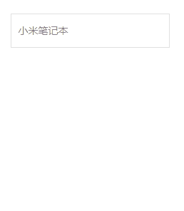
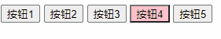
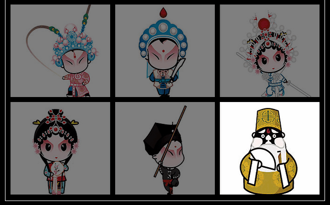
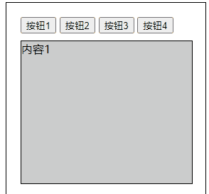
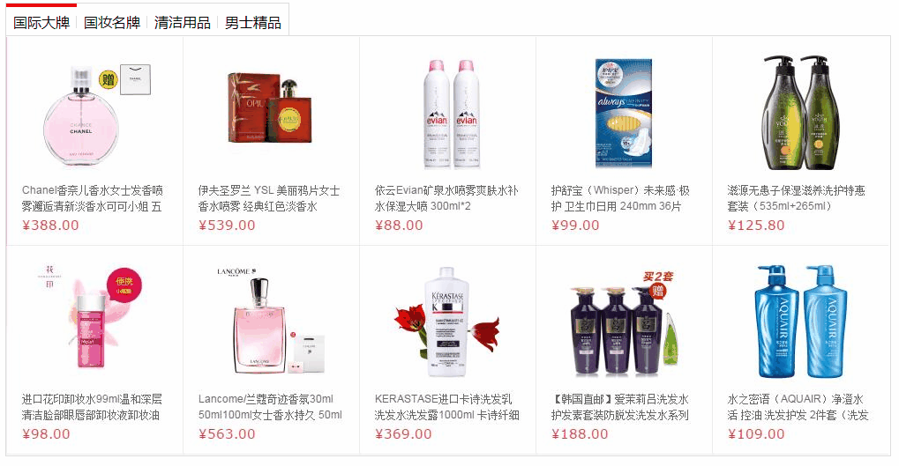
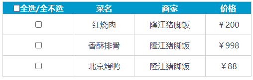

# 1. this环境变量

this环境对象 :  用在函数中，指向 事件源

相当于中文'我', 谁调用我，我就是谁

这个阶段就是指向事件源，谁调用指向谁，虽然交互触发时浏览器来解析但最终还是事件源来调用，this的特殊指向后面在学

能用this尽量用this，更加简洁，千万要注意this的指向

# 2. 小米搜索框

补充知识：键盘焦点事件

* onfocus ：成为焦点, 点击输入框出现闪烁光标。 此时可以输入文字（或者按键盘tab）
* onblur  ：失去焦点, 点击其他空白区域光标消失。 此时不可以输入文字（或者按键盘tab）



```js
<body>
  <div class="mi">
    <input type="search" placeholder="小米笔记本" />
    <ul class="result-list">
      <li><a href="#">全部商品</a></li>
      <li><a href="#">小米11</a></li>
      <li><a href="#">小米10S</a></li>
      <li><a href="#">小米笔记本</a></li>
      <li><a href="#">小米手机</a></li>
      <li><a href="#">黑鲨4</a></li>
      <li><a href="#">空调</a></li>
    </ul>
  </div>
  <script>
    /* 
思路
1. input成为焦点：   （1）显示ul  （2）自己新增类名 search
2. input失去焦点：   （1）隐藏ul  （2）自己移除类名 search
    */
    //1.获取元素，一定要精准，可以使用后代或则和子代选择器
    let input = document.querySelector('.mi>input')
    let ul = document.querySelector('.mi>ul')
    //2.1 成为焦点  onfocus
    input.onfocus = function () {
      //3.事件处理 （1）显示ul  
      ul.style.display = 'block'
      //（2）添加搜索框样式 自己新增类名 search
      // input.style.border='1px solid #ff6788'
      // 一定要注意这里的style操作和类名操作不要混用，权重不一样！
      input.classList.add('search')
    }

    //2.失去焦点 onblur
    input.onblur = function () {
      //3.事件处理 （1）隐藏ul  
      ul.style.display = 'none'
      //（2）移除搜索框样式 自己移除类名 search
      input.classList.remove('search')
    }
  </script>
</body>
```

# 3. 图片切换

图片切换类型功能需要使用全局变量存储下标index （变量：让浏览器存储数据），并且注意事件处理的时候下一张到最后一张或者上一张到第一张的时候要注意逻辑

这里不是重复事件，不用循环，index为显示图片的下标，默认值为显示的第一张图片

技巧：

* 注册事件的时候如果需要是一个伪数组，执行同样的事件，则需要在for循环里面注册数组里各个对象的事件
* 判断事件的方法（事件的处理）需不需要循环，看触发一次的时候需不需要多次进行重复的动作，
* 多次事件触发就是一个代码复用的过程，并不是决定函数体内的循环


```js
<body>
  <h2 class="title">图片切换</h2>
  
  <br />
  <input id="prev" type="button" value="上一张" />
  <input id="next" type="button" value="下一张" />
  <script>
    /*思路分析 
    0. 图片切换类型功能需要使用全局变量存储下标index （变量：让浏览器存储数据）

    1.点击下一张 :  
      （1） 如果 index 是 最后一张（数组length-1）, 则 index = 0 . 否则 index++
      （2） img.src = 数组[index]
    2.点击上一张 
      （1）如果 index 是 第一张（下标为0）, 则 index = 数组length-1 . 否则index--
      （2） img.src = 数组[index]
    */

    //多个数据 使用数组存储
    let imgArr = [
      './images/01.jpg',
      './images/02.jpg',
      './images/03.jpg',
      './images/04.jpg',
      './images/05.jpg',
    ]

    //核心：声明全局变量（两个事件都需要使用）记录图片当前下标，默认值为当前默认显示的下标
    let index = 0
    //1.获取元素
    let img = document.querySelector('img')
    let prev = document.querySelector('#prev') //上一张
    let next = document.querySelector('#next')
    //2.注册事件

    //2.1 点击下一页
    next.onclick = function () {
      //3.1  如果 index 是 最后一张(数组length-1), 则 index = 0 . 否则 index++

      // 最大下标用最大length-1
      index == imgArr.length - 1 ? index = 0 : index++
      //3.2  img.src = 数组[index]
      img.src = imgArr[index]
    }

    //2.2 点击上一页
    prev.onclick = function () {
      //3.1 如果 index 是 第一张(下标为0), 则 index = 数组length-1 . 否则index--
      index == 0 ? index = imgArr.length - 1 : index--
      //3.2  img.src = 数组[index]
      img.src = imgArr[index]
    }


    // 当if和else的语句都只有一行的时候可以使用三元表达式
    /* 三元表达式 : 功能和if-else类似
    表达式 ? 代码1 : 代码2
      如果表达式true: 执行代码1 , 否则执行代码2
    */
  </script>
</body>
```

# ==4. 排他思想==

排他思想场景 ： 多个元素只能有一个元素被选中的场景，一般会有一个初始的默认点击的

## 4.1. 排他思想01

先用循环干掉所有兄弟（包括自己），然后自己复活

### 4.1.1. 案例1



```js
<body>
  <button>按钮1</button>
  <button>按钮2</button>
  <button>按钮3</button>
  <button>按钮4</button>
  <button>按钮5</button>
  <script>
    //1.获取元素
    let buttonList = document.querySelectorAll('button')
    //2.注册事件（一刷新就走）
    // 给数组中每一个dom对象绑定事件for循环减少冗余代码
    for (let i = 0; i < buttonList.length; i++) {
      buttonList[i].onclick = function () {
        //3.事件处理
        // i : 当前点击按钮的下标
        // this : 当前点击的按钮
        // this就是当前绑定事件的dom对象
        console.log(i, this)
        //（1）干掉所有兄弟（断点从这里开始打断点，需要交互触发）for循环减少代码冗余，空字符串就是加载默认样式
        for (let j = 0; j < buttonList.length; j++) {
          buttonList[j].style.backgroundColor = ''
        }
        //（2）复活自己
        this.style.backgroundColor = 'pink'
      }
    }
  </script>
</body>
```

### 4.1.2. 案例2



```js
<body>
  <div class="wrap">
    <ul>
      <li>
        <a href="#"></a>
      </li>
      <li>
        <a href="#"></a>
      </li>
      <li>
        <a href="#"></a>
      </li>
      <li>
        <a href="#"></a>
      </li>
      <li>
        <a href="#"></a>
      </li>
      <li>
        <a href="#"></a>
      </li>
    </ul>
  </div>
  <script>

    //1.获取元素
    let liList = document.querySelectorAll('li')

    //2.注册事件
    for (let i = 0; i < liList.length; i++) {
      liList[i].onmouseenter = function () {
        //3.事件处理： 排他思想修改透明度
        //（1）干掉所有兄弟
        for (let j = 0; j < liList.length; j++) {
          // css中的属性值要是为纯数字，就不用加引号，就直接写数字类型
          liList[j].style.opacity = ''
        }
        //（2）复活自己 this === liList[i]
        this.style.opacity = 1
      }
    }
  </script>
</body>
```

> CSS中的属性值要是为纯数字，就不用加引号，就直接写数字类型

## 4.2. 排他思想02

类名（狙击枪只针对一个，精准定位）排他，先干掉上一次选中元素（需要重新通过交集选择器选择dom对象）然后再复活自己，不用循环，避免了干掉全部，提高浏览器的执行效率

重点：前提一定是通过类名修改样式（id标签行内其他的都不行，权重有高低

两种方法不能混在一起使用，style用循环来改，类名权重低于行内式

> 类名加上或除去的时候只需要加一个类名就可以了，不用精准定位加上父代，浏览器会自动解析已经写好的css样式，一般参考默认一定有一个一定加上了样式

```js
<style>
    .pink {
      background-color: pink;
    }
  </style>

<body>
  <button class="pink">按钮1</button>
  <button>按钮2</button>
  <button>按钮3</button>
  <button>按钮4</button>
  <button>按钮5</button>
  <script>
    //1.获取元素
    let buttonList = document.querySelectorAll('button')
    //2.注册事件
    for (let i = 0; i < buttonList.length; i++) {
      // 3.处理事件（排他思想）
      buttonList[i].onclick = function () {
        //（1）获取上一次选中的元素（排他的时候需要重新获取dom对象），移除样式
        document.querySelector('button.pink').classList.remove('pink')
        //（2）复活自己
        // this===buttonList[i]
        this.classList.add('pink')
      }
    }
  </script>
</body>
</html>
```

## 4.3. 补充一下opacity、visibility、display的异同

transparent 透明色（和颜色值并列） 一般的HTML标签在未指定其背景的时候默认就是透明色

> 被绝对定位或者固定定位遮住的盒子，box1在上面遮住box2，box1会遮住box2的hover

* opacity 用来设置透明度（翻译为不透明度），为0时为全透明隐藏，为1时，不透明度为1遮住下面的盒子 与颜色里面的alpha透明用法相同，区别是：
  利用alpha通道设定透明度的时候需要单独对每一个颜色值设定，而opacity直接就运用在了整个标签上，里面的所有元素和内容都继承了
* display 定义建立布局时元素生成的显示框类型
* visibility 用来设置元素是否可见

opacity、visibility、display 这三个属性分别取值 0、hidden、none 都能使元素在页面上看不见，区别如下

| 事件                             | opacity:0 | visibility:0 | display:none |
| -------------------------------- | --------- | ------------ | ------------ |
| 是否占据页面空间                 | √         | √            | ×            |
| 子元素设置相反值是否可以继续显示 | ×         | √（反隐藏）  | ×            |
| 自身绑定地事件是否可以继续触发   | √         | ×            | ×            |
| 是否影响遮挡住的元素触发事件     | √         | ×            | ×            |
| 属性值改变是否产生回流（重排）   | ×         | ×            | √            |
| 属性值改变是否产生重绘           | √         | √            | √            |
| 是否支持transition               | √         | ×            | ×            |

# 5. 排他应用之tab栏切换

tab栏（选项卡）切换是在开发中常见的一种场景tab-head大部分是按钮，用排他即可，tab-body有时候会是盒子，也有可能是图片切换，改src即可

## 5.1. 循环排他实现tab切换

一般在除法事件之前，应该是有一个初始的被选中的tab-button的按钮和tab-body的盒子



```js
<body>
  <div class="Box" id="box">
    <button>按钮1</button>
    <button>按钮2</button>
    <button>按钮3</button>
    <button>按钮4</button>
    <div class="con" style="display:block">内容1</div>
    <div class="con">内容2</div>
    <div class="con">内容3</div>
    <div class="con">内容4</div>
  </div>
  <script>
    /*
      tab栏（选项卡）切换思路 = 两个排他思想
      1.点击上方每一个按钮 : tab栏切换
        1.1 按钮排他： 干掉所有兄弟，复活自己
        1.2 盒子排他： 隐藏所有兄弟（除自己外），显示（伪数组）下标一致的盒子
      */
    // 1.获取元素
    let buttonList = document.querySelectorAll('.Box>button'),
      conList = document.querySelectorAll('.Box>.con')
    // 2.注册事件
    // 循环为每一个button绑定事件
    for (let i = 0; i < buttonList.length; i++) {
      buttonList[i].onclick = function () {
        // 3.事件处理
        // （1）循环排他 干掉所有兄弟
        for (let j = 0; j < buttonList.length; j++) {
          // tab-button背景色
          buttonList[j].style.backgroundColor = ''
          // tab-body盒子隐藏
          conList[j].style.display = 'none'
        }
        // （2）复活自己
        // tab-button自己加上背景色
        this.style.backgroundColor = 'pink'
        // tab-body自己盒子显示
        conList[i].style.display = 'block'
      }
    }
  </script>
</body>

</html>
```

## 5.2. 类名方式用类名排他



```js
<style>
    .products .main.selected {
      display: block;
    }

    .tab li.active {
      border-color: red;
      border-bottom: 0;
    }
  </style>

<body>
  <!-- 版心盒子 -->
  <div class="wrapper">
    <!-- tab头部选项卡标签 -->
    <ul class="tab">
      <li class="tab-item active">国际大牌<span>◆</span></li>
      <li class="tab-item">国妆名牌<span>◆</span></li>
      <li class="tab-item">清洁用品<span>◆</span></li>
      <li class="tab-item">男士精品</li>
    </ul>
    <!-- products -->
    <div class="products">
      <div class="main selected">
        <a href="###"></a>
      </div>
      <div class="main">
        <a href="###"></a>
      </div>
      <div class="main">
        <a href="###"></a>
      </div>
      <div class="main">
        <a href="###"></a>
      </div>
    </div>
  </div>

  <script>
    /* 思路分析：点击上方li元素
            1. li元素排他：  （1）兄弟移除类名active  （2）自己新增类名active
            2. main盒子排他：  （1）兄弟移除类名selected  （2）自己新增类名selected
      */
    // 1.获取元素
    let tabItemList = document.querySelectorAll('.tab-item'),
      mainList = document.querySelectorAll('.products .main')
    // 2.注册事件
    // 循环为每一个注册事件
    for (let i = 0; i < tabItemList.length; i++) {
      tabItemList[i].onclick = function () {
        // （1）类名干掉已经选中的或者显示的（需要重新选中dom对象）
        // 类名干掉选中的tab-head（一个不用循环）
        document.querySelector('.tab-item.active').classList.remove('active')
        // 类名干掉显示的tab-body
        document.querySelector('.main.selected').classList.remove('selected')

        // （2）类名加上正选中的和要显示的
        // 类名加上tab-head
        this.classList.add('active')
        // 类名加上tab-body
        mainList[i].classList.add('selected')
      }
    }
  </script>
</body>

</html>
```

# 6. 排他思想小结

排他思想： 多个元素只能有一个选中

tab-head和tab-body各两行代码，总共四行，分开写，条理更加清楚，分别运用两个排他

（1）style方式循环（炸弹炸掉所有的）排他：干掉所有兄弟（包括自己）然后复活自己
（2）类名方式用类名（狙击枪只针对一个精准打击）排他：干掉有样式的兄弟（需要通过类名交集选择器重新查询dom对象），再复活自己

> 不要混着用，会出现权重的问题

# ==7. 开关思想==

开关思想 ： 判断数组中是否所有元素都满足，都满足返回一个值，有一个不满足就返回另外一个值

实现步骤：

1. 声明开关变量 : 默认都满足为一直开着不关上时的结果（为true或者其它）
2. 检测开关变量 : 遍历数组,找不满足,得到开关变量的值
3. 获取开关变量

> 数组遍历中if的条件（就是不满足条件时关上并break，if的条件 就是关上的情况）

开关思想应用场景举例：

            （1）检测购物车是否所有商品都选中
    
            （2）检测注册是否每一个表单都填写数据

## 7.1. 应用

### 7.1.1. 需求1： 判断数组中是否所有元素都大于0

```js
 //都大于0 ： 打印true   不是都大于0： false
        let arr1 = [20, 66, 0, 80, 90, 100]

        //（1）声明开关变量
        let flag = true
        //（2）检测开关变量的值是否正确
        for (let i = 0; i < arr1.length; i++) {
            if (arr1[i] <= 0) {
                flag = false
                // 有不满足的就停下，提高浏览器的执行效率，有false了是不可能回去true的
                break
            }
        }
        //（3）开关结果
        console.log(flag)

```

### 7.1.2. 需求2： 判断数组中是否所有商品价格都大于1000

```js
 //都大于1000: 打印：'买'   不是都大于1000：打印"不买"
        let arr2 = [{
                name: '车厘子',
                price: 888
            },
            {
                name: '草莓',
                price: 2888
            },
            {
                name: 'iPhone13香',
                price: 6888
            },
        ]

        //（1）声明开关变量
        let buy = '买'
        //（2）检测开关变量的值是否正确
        for (let i = 0; i < arr2.length; i++) {
            if (arr2[i].price < 1000) {
                buy = '不买'
                break
            }
        }
        //（3）获取开关变量
        console.log(buy)

```

## 7.2. 全选与单选实际案例



思路分析（应该是两个交互）

分析一下事件的三要素

事件源：checkAll和checkList[] 

时间类型：onclick

事件处理函数：

交互1：点击全选按钮， 设置每一个选择框checked值与自身（全选框）一致，如果自己是true那么每一个选择框也是true. 否则就是false

交互2：点击下方每一个选择框（开关思想） :  判断是否所有选择框都选中
开关变量为true，则都选中，返回true 修改全选框checked值为true
开关变量为false，没有都选中（至少有一个没选中），返回false 修改全选框checked值为false

```js
<body>
  <table>
    <tr>
      <th><input type="checkbox" id="checkAll" />全选/全不选</th>
      <th>菜名</th>
      <th>商家</th>
      <th>价格</th>
    </tr>
    <tr>
      <td>
        <input type="checkbox" class="check" />
      </td>
      <td>红烧肉</td>
      <td>隆江猪脚饭</td>
      <td>￥200</td>
    </tr>
    <tr>
      <td>
        <input type="checkbox" class="check" />
      </td>
      <td>香酥排骨</td>
      <td>隆江猪脚饭</td>
      <td>￥998</td>
    </tr>
    <tr>
      <td>
        <input type="checkbox" class="check" />
      </td>
      <td>北京烤鸭</td>
      <td>隆江猪脚饭</td>
      <td>￥88</td>
    </tr>
  </table>
  <script>
    // 1.获取元素
    // 注意这里找事件源发现有四个事件源，需要给这四个都绑定事件
    let checkAll = document.querySelector('#checkAll'),
      checkList = document.querySelectorAll('.check')
    // 用log去看一下是否选中了dom对象
    console.log(checkAll, checkList)

    // 2.注册事件
    // 两个交互分开注册事件

    // 2.1.checkAll
    checkAll.onclick = function () {
      // 事件处理
      // 如果checkAll的checked=true,则checkList[]选择框都为true,反之亦然,需要用for来处理事件
      for (let i = 0; i < checkList.length; i++) {
        checkList[i].checked = checkAll.checked
      }
    }

    // 2.2 checkList
    for (let i = 0; i < checkList.length; i++) {
      // 事件处理（开关思想）
      // 如果checkList[]至少有一个为false则checkAll为false，如全为true则checkAll为true
      checkList[i].onclick = function () {
        // （1）声明开关变量
        let flag = true
        // （2）遍历数组检查是否满足条件，并修改开关变量的值
        for (let j = 0; j < checkList.length; j++) {
          if (!checkList[j].checked) {
            flag = false
            break
          }
        }
        // （3）获取开关变量的值
        checkAll.checked = flag
      }
    }
  </script>
</body>

</html>

```

# 8. attribute语法

自定义属性 : html本身没有的属性（属性作用就是存储数据）

1. 获取自定义属性 ：  `元素.getAttribute('属性名')`
2. 设置自定义属性 ：  `元素.setAttribute('属性名',属性值)`有则修改，无则新增
3. 移除自定义属性（一次只能移除一个） ： ` 元素.removeAttribute('属性名')`后面写上第二个属性名没用

```js
  <style>
    .one {
      height: 100px;
      border: 5px solid blue;
    }
  </style>

<body>
  <div id="box" aaa="啊啊啊" class="one" style="width: 100px;background-color: red"></div>

  <script>
  	//	获取元素
    let box = document.querySelector('#box')
    //1.获取自定义属性(有返回值没有返回null)
    console.log(box.getAttribute('aaa'))
    //2.设置 自定义属性
    box.setAttribute('aaa', '1111') //覆盖
    box.setAttribute('bbb', '2222') //新增
    //3. 移除 自定义属性
    box.removeAttribute('bbb')
    console.log(box.getAttribute('bbb'))
  </script>
</body>

```

## 8.1. 案例-隔行变色进阶版

需求：

1. 设置每一个li元素颜色： 单绿 双黄
2. 鼠标移入li元素： 颜色变红
3. 鼠标移出li元素： 颜色恢复原先的颜色

核心在于鼠标移入的时候需要保留原来的环境现场，即用属性先存入原来的颜色数据

```js
<!DOCTYPE html>
<html lang="en">

<head>
  <meta charset="UTF-8" />
  <meta name="viewport" content="width=device-width, initial-scale=1.0" />
  <meta http-equiv="X-UA-Compatible" content="ie=edge" />
  <title>Document</title>
</head>

<body>
  <ul>
    <li>我是班长1</li>
    <li>我是班长2</li>
    <li>我是班长3</li>
    <li>我是班长4</li>
    <li>我是班长5</li>
    <li>我是班长6</li>
    <li>我是班长7</li>
    <li>我是班长8</li>
    <li>我是班长9</li>
    <li>我是班长10</li>
  </ul>

  <script>

    // 1.获取元素
    let liList = document.querySelectorAll('li')

    // 2.注册事件
    for (let i = 0; i < liList.length; i++) {
      //设置颜色，初始颜色
      liList[i].style.backgroundColor = i % 2 == 0 ? 'green' : 'yellow'

      //鼠标移入
      liList[i].onmouseenter = function () {
        //先存储当前颜色
        this.setAttribute('bgc', this.style.backgroundColor)
        //后修改红色
        this.style.backgroundColor = 'red'
      }

      //鼠标移出
      liList[i].onmouseleave = function () {
        //取出自定义属性的值 赋值给 背景颜色
        this.style.backgroundColor = this.getAttribute('bgc')
      }
    }
  </script>
</body>
</html>

```

> 如果用空字符串的话只是加载默认的样式，前面自己设置的css样式并不是默认的，默认的指的是浏览器自带（原生）的

# 9. 今日学习问题

1. 单选框的checked写成了text的disabled
2. 开关思想中数组遍历时，关上时，break写在了if外面，直接第一遍循环直接break了
3. 获取元素是一组对象（需要绑定相同事件）忘记加All`document.querySelectorAll('')`
4. 复制粘贴下来，总是忘记改一些属性，导致打断点时照不出来