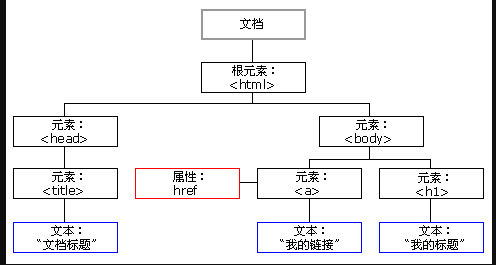
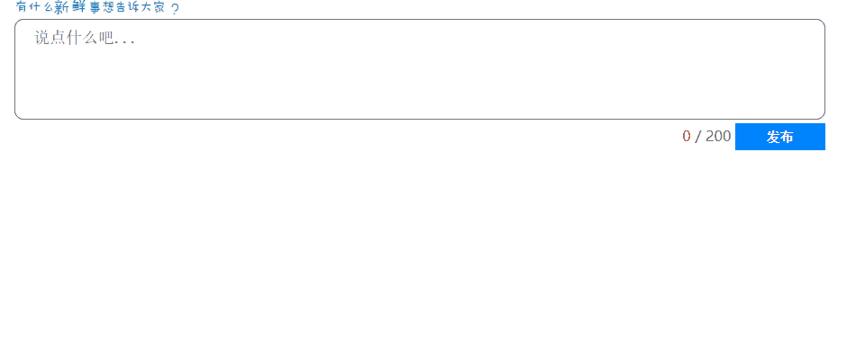
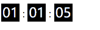
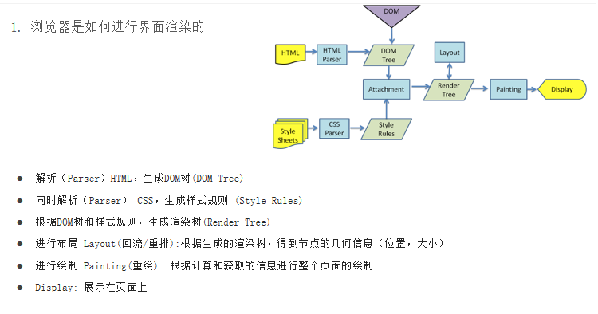
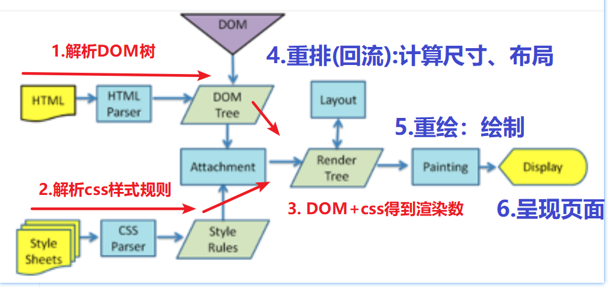
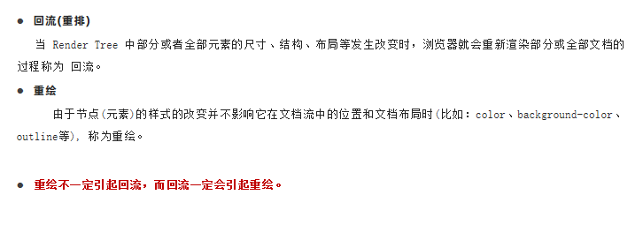
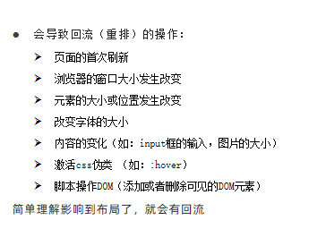

# 1. 节点介绍

节点 node ： 网页一切内容皆为节点，同步对应于dom树上的每一个内容

节点作用 ： 让渲染引擎准确地渲染dom树，同时让我们更好地理清楚标签之间的关系

## 1.1. 节点分类

四种节点： 元素节点（element）、 属性节点（很特殊，并不在childNodes数组里，因为每一个标签都有属性，平时直接用点语法获取，所有的属性还是叫属性节点是方便浏览器渲染页面） 、 文本节点（text） 、 注释节点（comment）

最重要最常用： 元素节点（标签）


# 2. 节点操作

* `querySelector('选择器')` 根据选择器来查询dom对象
* 节点语法根据节点来查询dom对象，所有的节点都可以用选择器选中，节点有时候更简单，是一种辅助一种替代，节点也是dom对象，有时候只需要用一次querySelector选中一个基准dom对象就行，其他的dom对象可以用节点语法参考j基准对象获得

## 2.1. 查找节点

常用的是带上element的查询语法，这里的元素都是先要获取到dom对象，查询是其他操作的前提

查询节点（首先一定得要有一个基准节点（一般是document.querySelector语法拿到）再去找其他的节点），子节点和兄弟节点和父节点是对象的属性

### 2.1.1. 子节点

* `父元素.childNodes`用来获取元素的所有子节点，包括元素节点、文本节点、注释节点.（空格和换行符也会读取成文本节点），属性节点特殊
* `父元素.children`用来获取元素的所有子**元素**（就是html标签）节点，注意一定是伪数组，和querySelectorAll一样，没有就获取空数组

第一个孩子节点：`ul.firstChild === ul.children[0]`
最后一个孩子节点：`ul.lastChild === ul.children[ul.children.length - 1]`

### 2.1.2. 兄弟节点

1. 上一个节点
   * `元素.previousSibling`上一个节点（可以是text、comment、element中的一种）
   * `元素.previousElementSibling`上一个元素节点（只能是element）
2. 下一个节点
   * `元素.nextSibling`下一个节点（可以是text、comment、element中的一种）
   * `元素.nextElementSibling`下一个元素节点（只能是element）

### 

### 2.1.3. 父节点

`子元素.parentNode`来获取父元素节点，不用Element（其他的都要用element）用Node是因为浏览器兼容性更好，只有元素节点才有儿子，当然也有parentElement这个属性

### 2.1.4. 案例（关闭二维码）


```js
<div class="box">
        
        <span id="x">×</span>
    </div>

    <script>
        /* 点击x : 隐藏box */

        //1.获取元素
        let x = document.querySelector('#x')
        //2.注册点击事件
        x.onclick = function () {
            //3.事件处理
            // this : 我自己  x
            // this.parentNode : 我爸爸  box
            this.parentNode.style.display = 'none'

            // 当然也可以选中box，用dom语法完成
        }
    </script>
```

## 2.2. 新增节点

### 2.2.1. dom新增元素 三种方式：

1. `document.write('')`    加载元素的最后面，开发中几乎不用，事件触发可能会覆盖原来的dom树
2. `元素.innerHTML = ''`   新增100以内的元素的时候可以用，超过的时候可能会出现性能的问题，加载过慢（让内容等于空字符串可以做到一键清空内容，极其方便）
   * 覆盖操作：  元素.innerHTML = '<h1>标题</h1>'
   * 新增操作（标签inner的最后面加上）：  元素.innerHTML += '<h1>标题</h1>'（因为innerText和inneHTML返回的都是字符串）
3. `document.createElement()`    : dom推荐

> 代码的数量并不是决定js性能的关键

### 2.2.2. 新增节点的步骤（三部曲）：

1. 在内存中创建空标签 ：  `document.createElement('标签名')`
   空标签只是在内存创建，不是到dom树显示（dom原理：内存->dom树->渲染到页面）
2. 设置标签内容，一般用innerHTML加反引号（获取变量值）添加内容
3. 添加到页面dom树并在页面显示:   `父元素.appendChild(子元素)`

> 标签名、选择器里面需要加引号，而使用dom对象或者变量时不需要加引号了

### 2.2.3. 新增节点的位置

* `父元素.appendChild(子元素)`：新增到父元素的子节点的最后面
* `父元素.insertBefore(要新增的元素,哪一个元素前面)`：新增到指定元素前面，用的最多的，比如评论、订单都是加在最前面，加信息可能会在最后面加

> 插在最前面直接(element，父元素.children[0]),没必要再来一个多余的属性插在最前面，不能跨代，必须是亲父亲

新增和删除汇总

* push(数组元素)、pop()、unshifit(数组元素)、shifit()
* classList.add('类名')、classList.remove('类名')、classList.toggle('类名')、classList.contains('类名')
* appendChild(对象)、insertBefore(对象)、removeChild(对象) 

都是调用函数，直接使用即可，仅`classList.contains('类名')`有返回值返回布尔类型需要存起来，有的是操作dom对象，有的是标签名，有的是数组元素

```js
	//1.在内存中创建空标签
    let li = document.createElement('li')
    //2.设置标签内容
    li.innerText = '我是新来的'
    li.style.backgroundColor = 'red'
    console.log(li)
    //3.添加到页面dom树 :  父元素.appendChild(子元素)
    //3.1 新增到父元素最后面
    // document.querySelector('ul').appendChild(li)
    //3.2 新增到元素前面
    let ul = document.querySelector('ul')
    let li2 = document.querySelector('#li2')
    ul.insertBefore(li, li2)
  </script>
```

## 2.3. 克隆节点

克隆节点就是复制节点，语法：`子元素.cloneNode()`
参数为布尔类型
false：浅克隆，默认false（没有参数返回undefined），只克隆元素自身（不包含innerHTML） 
true : 深克隆，克隆元素自身  + 所有后代元素（innerHTML）

> 只是内存克隆，还需要手动添加到dom树

```js
		//点击按钮 : 克隆box
        document.querySelector('.btn').onclick = function () {
            //获取box
            let box = document.querySelector('.box')
            //***  克隆元素 :  元素.cloneNode()
            let newBox = box.cloneNode(true)
            console.log(newBox)
            // 只是内存克隆，还需要手动添加到dom树
            //新增到dom树
            document.body.appendChild(newBox)
        }
```

## 2.4. 删除节点

删除节点的语法：`父元素.removeChild(子元素)`返回值并不重要不需要关注返回值

`display:none`节点还在dom树中，只是脱标了不显示，这里的removeChild是在dom树中删除节点

> 注意只能移除自己的儿子，不能写错了写成别人的，也不能隔代

## 2.5. 节点操作总结

1. 查节点 : 

          查子元素:  `元素.children`
          
          查兄弟元素:  
          
              上一个元素： `元素.previousElementSibling`
          
              下一个元素：` 元素.nextElementSibling`
          
          查父元素 : `元素.parentNode`

      2.增 ： `document.createElement()`

          （1）内存创建空节点：   document.createElement('标签名')
          
          （2）设置标签内容
          
          （3）添加到页面dom
          
              新增到最后面   ：  `父元素.appendChild(子元素)`
          
              新增到元素前面 ：  `父元素.insertBefore(要加的元素,哪一个元素前面)`

      3.删 ： `父元素.removeChild(子元素)`

      display:none还在dom树中，只是不显示，这里的removeChild是在dom树中删除节点

      只能移除自己的儿子，不能写错了写成别人的，不能隔代

# 3. date()对象

内置对象：js内部预置好的对象可以直接使用

==调用方法需要在后面添加小括号==

* 数学对象Math 直接调用
* 日期对象 需要先new一个

```js
		//1.创建日期对象    
        let d = new Date()
        console.log(d)

        //2.转换日期格式
        // 年月日时分秒
        console.log(d.toLocaleString()) //2022/1/18 下午3:02:53
        // 年月日
        console.log(d.toLocaleDateString()) //2022/1/18
        // 时分秒
        console.log(d.toLocaleTimeString()) //下午3:03:29

        //3.获取 年月日时分秒
        console.log(d.getFullYear()) //2022
        //范围下标 0-11 对应 1-12月
        console.log(d.getMonth()) //0 下标  第1个月
        console.log(d.getDate()) //18
        //星期下标 0-6 对应 周日-周六
        console.log(d.getDay()) //2
        //时分秒
        console.log(d.getHours()) //15
        console.log(d.getMinutes()) //5
        console.log(d.getSeconds()) //44
```

## 3.1. 时间戳

获取时间戳  ： 1970年1月1日0秒 伦敦时间 -> 现在时间总毫秒数
时间戳作用 ： 解决浏览器时区兼容性（在中国是转换成中国当地时间，在美国会自动转成当地时间） 
UTC时区:全球时区   GMT时区：东8区

```js
        console.log(d.getUTCDate()) //全球时区的时间
        console.log(Date.now()) //1642489697575
        console.log(+new Date()) //1642489741950
        console.log(new Date().getTime()) //1642489741950
```

# 4. 综合案例



```js
<body>
  <div class="w">
    <!-- 操作的界面 -->
    <div class="controls">
      <br />
      <!-- maxlength 可以用来限制表单输入的内容长度 -->
      <textarea placeholder="说点什么吧..." id="area" cols="30" rows="10" maxlength="200"></textarea>
      <div>
        <span class="useCount" id="useCount">0</span>
        <span>/</span>
        <span>200</span>
        <button id="send">发布</button>
      </div>
    </div>
    <!-- 微博内容列表 -->
    <div class="contentList">
      <ul id="list"></ul>
    </div>
  </div>

  <!-- 添加了hidden属性元素会直接隐藏掉 -->
  <li hidden>
    <div class="info">
      
      <span class="username">死数据:百里守约</span>
      <p class="send-time">死数据:发布于 2020年12月05日 00:07:54</p>
    </div>
    <div class="content">死数据:111</div>
  </li>

  <script>
    // maxlength 是一个表单属性, 作用是给表单设置一个最大长度
    // 模拟数据
    let dataArr = [{
        uname: '司马懿',
        imgSrc: './images/9.5/01.jpg'
      },
      {
        uname: '女娲',
        imgSrc: './images/9.5/02.jpg'
      },
      {
        uname: '百里守约',
        imgSrc: './images/9.5/03.jpg'
      }
    ]

    /* 思路分析
    1.输入框输入事件 ： oninput
        * 获取输入框文本长度 赋值给 span标签的innerText

    2.点击发布事件
      （1）非空判断（重点经典案例） ： 检测输入框文本是否为空
      单独写的话，在长度为0的时候需要return结束函数，下面接上长度不为0的事件，return和else这里是一样的作用
      也可以用if-else分开写用一个事件，空就提示，有内容就执行else里面的事件
      // 字符串.trim()可以去掉字符串首尾的空格

      （2）创建li元素 : document.createElement()
          a.创建空元素
          b.设置内容 : 数组随机元素、获取当前时间
          c.新增到ul(最前面) :  ul.insertBefore(li, ul.children[0])
      （3）清空输入框文本和span的innerText
    */

    // 1.获取元素
    let area = document.querySelector('textarea'),
      useCount = document.querySelector('#useCount'),
      send = document.querySelector('#send')

    // 键盘输入事件
    area.oninput = function () {
      useCount.innerText = area.value.length
    }
    // 输入框内容获取
    send.onclick = function () {
      // 1.非空判断
      if (area.value.trim() == '') {
        alert('输入框不能为空！')
        return
      }
      // 2.添加li元素
      // 2.1创建空元素
      let li = document.createElement('li')
      // 2.2 li添加内容
      let index = Math.floor(Math.random() * dataArr.length)
      li.innerHTML = `<div class="info">
        
        <span class="username">${dataArr[index].uname}</span>
        <p class="send-time">${ new Date().toLocaleString() }</p>
        </div>
        <div class="content">${area.value}</div>`
      // 2.3 添加到ul的最前面
      let ul = document.querySelector('ul')
      ul.insertBefore(li, ul.children[0])
      // 3.send后文本清空
      area.value = ''
      useCount.innerText = 0
    }
  </script>
</body>
</html>
```

* maxlength 是一个表单属性, 作用是给表单设置一个最大长度
* `字符串.trim()`可以去掉字符串首尾的空格
* `Math.floor(Math.random() * dataArr.length)`得到一个随机数组下标，比如数组长度为3下标为0、1、2，需要乘以2+1才能得到所有的下标

# 5. 定时器

定时器作用就是一段代码在间隔时间内重复执行吗，这里不是事件，是调用带参数的函数要带小括号，返回的是定时器ID值

## 5.1. 间隙函数setInterval永久定时器

setInterval : 永久定时器。 一旦开启，永久重复执行，只能手动清除

1. 开启定时器：`setInterval( 回调函数,间隔时间 )`
   * @description: 开启定时器
   * @param1 {function(){}} 一段代码  
   * @param2 {number} 间隔时间  单位毫秒  1s = 1000ms 第一次显示之前也有一段间隔时间
   * @return: 定时器id

回调函数 ： 如果一个函数的参数也是函数，这个参数函数就叫做**回调函数** 

一个页面可以开启很多定时器，浏览器为了更好管理这些定时器。会给每一个定时器一个编号为setInterval函数的返回值。称之为定时器id（timeID）

2. 清除定时器：`clearInterval( 定时器ID )`
   * @description: 移除定时器
   * @param 定时器ID

> 先写出骨架：防止出错  let timeID = setInterval(function () {}, 1000)

```js
// 1.设置定时器
    let timeID = setInterval(function () {
      // ++会自动隐式转换，innerText拿到的是字符串
      document.querySelector('#pp').innerText++
    }, 1000)

    // 2.移除定时器
    let btn = document.querySelector('button')
    btn.onclick = function () {
      clearInterval(timeID)
    }
```

## 5.2. 延时函数setTimeout一次性定时器

一次性定时器与上面的永久计时器的语法是完全一致的，就是时间间隔到了只执行一次

```js
let timeID = setTimeout(function () {
      console.log('hhhhhh')
    }, 3000)
    document.querySelector('button').onclick = function () {
      clearTimeout(timeID)
```

点击按钮：关闭定时器（5000ms之内是可以手动清除的，但是绝大部分是不需要手动清除的，5s的时候时候已经自动清除了）

## 5.3. 应用

### 5.3.1. 广告窗口3秒自动消失

```js
<body>
    
    <script>
      // 3s关闭广告
        setTimeout(function(){
          document.querySelector('img').style.display = 'none'
        },3000)
    </script>
  </body>
```

### 5.3.2. 电商秒杀倒计时



```js
<body>
  <div>
    <span id="hour">02</span> : <span id="minute">01</span> :
    <span id="second">05</span>
  </div>

  <script>
    /* 
    开启永久定时器，间隔时间1s
      （1）获取 时h  分m  秒s 文本innerText
      （2）s--
      （3）如果 s < 0 :  s = 59 , m--
      （4）如果 m < 0 :  m = 59, h--
      （5）如果 m h s 小于10，则补0
      （6）将计算之后的h m s 重新赋值给页面元素innerText
      （7）如果 h == 0 && m == 0 && s == 0 , 则清除定时器
    */

    // 调用定时器函数
    let timeID = setInterval(function () {
      //  1.获取元素（需要写在函数里面）
      let h = +document.querySelector('#hour').innerText,
        m = +document.querySelector('#minute').innerText,
        s = +document.querySelector('#second').innerText
      // 2.s--
      s--
      // 3.判断时和分的逻辑
      if (s < 0) {
        s = 59
        m--
      }
      if (m < 0) {
        m = 59
        h--
      }

      // 4.数字补0
      s = s < 10 ? '0' + s : s
      m = m < 10 ? '0' + m : m
      h = h < 10 ? '0' + h : h
      // 5.重新赋值给dom对象的innerText
      document.querySelector('#hour').innerText = h
      document.querySelector('#minute').innerText = m
      document.querySelector('#second').innerText = s
    }, 1000)

    // 6.移除定时器
    if (h == 0 && m == 0 && s == 0) {
      clearInterval(timeID)
    }
```

`Number(003)`的值为3

js数据类型有7种，分为两大类

1. 简单数据类型(值类型) : 栈中存储数据, 赋值拷贝的是数据。 修改拷贝后的数据对原数据没有影响
2. 复杂数据类型(引用类型) : 栈中存储地址，堆中存储数据，赋值拷贝地址。 修改拷贝后的数据对原数据有影响。

> * `let hour=document.querySelector('#hour')`实际上引用类型的数据就是数组、函数、对象的别名，对引用类型的操作就是操作自己，操作hour就是操作dom对象，所以原来对hour变量的一系列操作都是改变dom树
> * 而案例中用到的`let h = +document.querySelector('#hour').innerText`这个相当于变量的赋值，是字符串，是取出来，操作了需要再重新赋值回去原dom树才会更改

# 6. 浏览器渲染原理（ 了解 ）





## 5.1. 浏览器渲染解析页面完整流程:

1. 先解析HTML，生成DOM树（重要步骤）
2. 后解析CSS，生成样式规则
3. 根据DOM树与样式规则，得到一颗渲染树Render Tree（重要步骤）
   * DOM树：只有结构没有样式
   * 渲染树：DOM树 + CSS样式 （可以理解为附加了样式的DOM树）
4. 渲染引擎开始工作，解析渲染树。
   这个步骤发生 `回流(又称重排) `  : 计算节点的尺寸、结构、布局
5. 开始绘制
   这个步骤发生`重绘` : 根据重排结果进行绘制页面
6. 渲染完成，呈现页面

## 5.2. 引起重绘和重排的因素

> 重要概念： 重排一定会引起重绘，但是重绘不一定引起重排

* 引起重排操作：主要是修改了尺寸、布局（总结起来就是对布局产生印象）
  * 如：修改盒子的尺寸， 修改盒子位置、修改字体大小、边框等等影响盒子模型布局的都会导致重绘
  * `重排`：会导致页面大面积重绘，甚至是整个页面重新绘制。（影响性能）
* 引起重绘操作：不影响布局，只是影响盒子自身属性
  * 如：修改颜色，修改透明度等，对布局没有任何影响的



