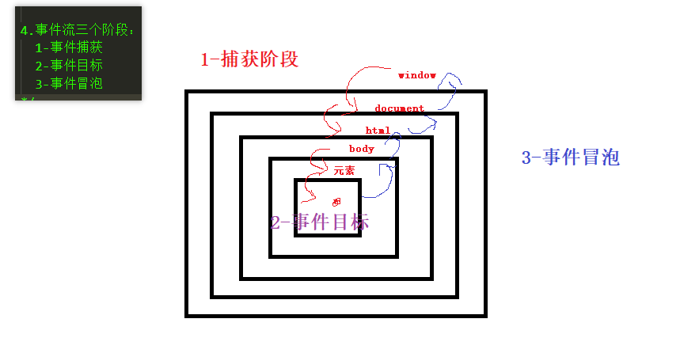
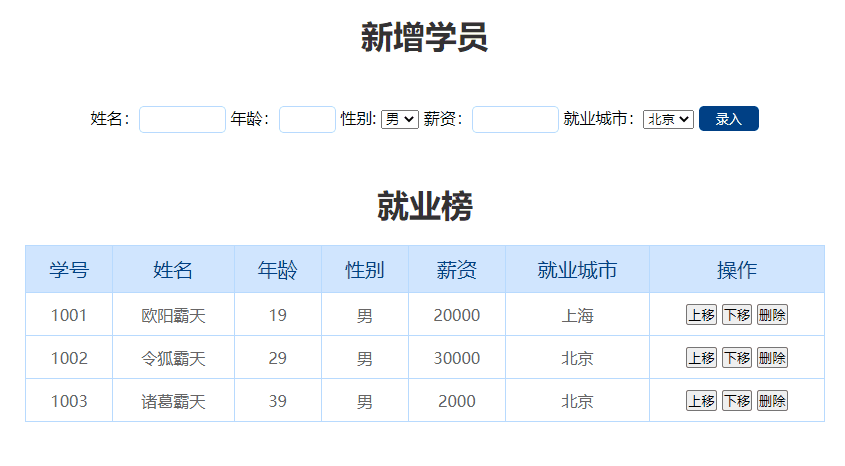

# 1. 事件知识补充

## 1.1. addEventListener注册事件

dom两种注册事件语法：

1. 点语法注册事件（直接注册）:     `事件源.事件类型 = 事件处理函数`

 特点：不能注册‘同名事件’， 否则会覆盖（方法的重新赋值会覆盖）。比如两个onclick后面的覆盖前面的

 `box.onclick=function(){ alert(111)}`


2. 调用api来注册事件（可以注册多个同名事件，比如需要两个onclick都生效）

`事件源.addEventListener('事件类型',事件处理函数)`

特点：可以注册‘同名事件’，依次触发（事件监听）

```js
	//@description: 给元素注册同名事件
    //@param1 {string} 事件类型  不要on
	//@param2 {function} 事件处理函数
	 box.addEventListener('click', function () {
            alert('1-假如生活欺骗了你，请不要悲伤')
        })
```

> * 这里的click是事件名，是字符串，需要使用引号
> * 同时设置，点语法会失效

## 1.2. removeEventListener移除事件

* 点语法移除事件， 赋值null（事件在注册之前赋值函数之前默认就是null，undefined和空字符串也可以但是null更规范，也说明了函数其实也是一种对象） `box.onclick = null`
* `事件源.addEventListener('事件类型',事件处理函数)`这种方式移除事件，需要用到

```js
box.addEventListener('click', function () {
            alert('1-假如生活欺骗了你，请不要悲伤')
        })

        let fn = function () {
            alert('2-因为它明天还会继续欺骗你')
        }
        box.removeEventListener('click', fn)
```

注意点：这种方式移除的只能是具名函数`box.removeEventListener('click', fn)`

> 注意移除事件语法不能混着用，点语法添加的只能用`box.onclick = null`移除，调用api的只能用`box.removeEventListener('click', fn)`移除

## 1.3. 阻止默认事件

html中有部分标签自带点击事件 ：   form表单的button（给form或者里面的btn加都可以看需要而定）和a标签，如果给这些标签注册点击事件，会默认跳转

阻止默认事件 ： 执行自己注册的事件，需要先阻止自带的默认事件  e是获取事件对象，给事件处理函数添加形参（一般用event、ev、e，可以为任意字母）为js编译器规定的形参，编译器帮我们自动调用

```js
		//获取元素
        let a = document.querySelector('a')
        let btn = document.querySelector('.btn')
        //注册事件
        a.onclick = function (e) {
            e.preventDefault()
            console.log('111111')
        }
```

## 1.4. 引用类型赋值

1. 任何数据类型共同点（值类型，引用类型（别名，区别于指针，对引用类型的操作就是操作自己））
   都有变量赋值特点，可以赋值，可以传递
2. 引用类型特点

* 函数： 函数名()
* 数组： 数组名[下标]
* 对象： 对象名.属性名

### 1.4.1.补充一下函数知识

一阶函数

```js
	//函数也是可以当做一种对象
	//先声明函数
	function fn(x){
    return x*x
	}
	fn.lang='hhh'
	console.log(fn.lang)//'hhh'
	//可以把函数赋值给变量，也可以传递
	let res1=fn
    res(5)//25
	let res2=res1
    res2(4)//16
	//函数可以作为实参传递给其他函数调用（回调函数）
	setInterval(function(),1000)
```

高阶函数

高阶函数是对其他函数进行操作的函数，操作可以是将它们作为参数，或者是返回它们。 简单来说，高阶函数是一个接收函数作为参数或将函数作为输出返回的函数

# 2. 事件对象

## 2.1. 事件对象介绍

1. 定义：事件对象是存储与事件相关的对象
2. 如何产生：当用户触发事件的时候，浏览器会自动捕捉触发时(主要应用是鼠标坐标和键盘按键)的信息,存入对象中。这个对象称之为事件对象。不需要存，一直存在于内存中，由浏览器处理，可以获取 ，每触发一次都会产生一个全新的事件对象
3. 如何获取事件对象 :  给事件处理函数添加形参  event  ev  e，随便写都可以，规范话是上面三个
   为js内置的形参，为事件对象，实参由浏览器帮我们调用，这里不考虑函数的返回值

```js
document.querySelector('#box').onclick = function (e) {
      console.log(e)
    }
```

> 主要是**鼠标**事件对象和**键盘**事件对象  

## 2.2. 事件对象常用属性

鼠标事件

onmousedown、onmouseup、onclick都是鼠标左键、中键触发

鼠标左键、中键事件触发顺序：1.onmousedown 2.onmouseup 3.onclick

鼠标右键事件触发顺序：1.onmousedown  2. onmouseup 3.oncnotextmenu

blur是按下之后就执行了，click需要按下弹起就执行

| 代码          | 意义               | 备注             |
| ------------- | ------------------ | ---------------- |
| onclick       | 鼠标单击           |                  |
| ondblclick    | 鼠标双击           |                  |
| onmouseenter  | 鼠标移入           |                  |
| onmouseleave  | 鼠标移出           |                  |
| onmousemove   | 鼠标移动           |                  |
| onmousewheel  | 鼠标中键           |                  |
| onmousedown   | 鼠标按下           |                  |
| onmouseup     | 鼠标松开           | 鼠标长按区分     |
| oncontextmenu | 鼠标显示上下文菜单 | 鼠标右键点击触发 |

键盘事件

| 代码      | 意义                               | 备注                            |
| --------- | ---------------------------------- | ------------------------------- |
| onfocus   | 成为键盘焦点                       | 动态新增的input不会自动获取焦点 |
| onblur    | 失去键盘焦点                       |                                 |
| oninput   | 键盘输入（输入和按下的场景不一样） | 实时获取输入内容                |
| onkeydown | 键盘按下                           | 监听enter键(Enter)首字母是大写  |
| onkeyup   | 键盘松开                           | 键盘长按可以区分                |

### 2.2.1. 鼠标事件对象：

e.pageX / e.pageY : 获取鼠标触发点到页面左上角距离，数字类型，平时使用需要加上px单位，e.pageX+'px'（向下向右为正）click、mousemove

```js
document.querySelector('#box').onclick = function (e) {
      console.log(e.pageX, e.pageY)
    }
```

### 2.2.2. 键盘事件对象

如何获取用户按键
`e.key` :  获取字符串 'Enter'
`e.keyCode` : 获取键盘码ASCII码 13（keyCode少用可能会有一定的bug）

键盘上每一个按键对应一个数字，称之为ASCII码

```js
 let input = document.querySelector('input')
    input.onkeydown = function (e) {
      console.log(e.key, e.keyCode)
      if (e.key == 'Enter') {
        console.log('搜索')
      }
      if (e.keyCode == 13) {
        console.log('搜索')
      }
    }
```

## 2.3. 鼠标跟随移动案例

网页鼠标移动 :  `window.onmousemove`（window就是一个浏览器窗口）

注意点：

1. pageX是数字，设置的时候需要拼接px单位
2. 元素移动前提要有绝对定位（不用父相直接相对于浏览器窗口window移动）

```js
<style>
    img {
      position: absolute;
      left: 0;
      top: 0;
    }
  </style>
</head>
<body>
  
  <script>
    window.onmousemove = function (e) {
      // e是事件对象
      console.log(e)
      document.querySelector('img').style.left = e.pageX + 'px'
      document.querySelector('img').style.top = e.pageY + 'px'
    }
  </script>
</body>
```

# 3. 事件流和事件委托

## 3.1. 事件冒泡

事件冒泡 : 当触发子元素的事件时候，所有的父级元素‘同名事件’（点击需要父元素都是点击，一个点击一个移入无联系）会被依次触发

这个冒泡一定存在，如果其中一个没注册事件，上面的一定会触发，页面最上面的son最先触发

执行顺序：子元素->父元素->body->html->document->window

> * **document.documentElement拿到html根元素**
> * **document.body拿到body元素**

```js
	//子元素
    document.querySelector('.son').onclick = function (e) {
      alert('我是蓝色子元素')
      console.log(e);
    }
    //父元素
    document.querySelector('.father').onclick = function () {
      alert('我是红色父元素')
    }
    //body
    document.body.addEventListener('click', function () {
      alert('我是body')
    })
    //html
    document.documentElement.addEventListener('click', function () {
      alert('我是html')
    })
    //document
    document.addEventListener('click', function () {
      alert('我是document')
    })
    //window
    window.addEventListener('click', function () {
      alert('我是window')
    })
```

## ==3.2. 时间委托（重点）==

事件冒泡 : 当触发子元素的事件时候，所有的父级元素‘同名事件’会被依次触发（这条链一直存在，这里点击li，虽然li没有注册事件，但是还是一直传到window，冒泡源还是li）

事件委托（面试点） :  给父元素注册事件（不一定委托给亲爹，可以跨代，这里的父元素绝对不能是动态新增的）, 委托给子元素处理

* 事件委托原理 : 事件冒泡

* 事件委托注意点 : 

  不能使用 this ： this指向父元素

  需要使用 e.target ：真正点击的子元素（事件触发源/冒泡源）用户到底点击的哪一个li元素触发的这个冒泡（委托的父元素的任意像素点都会触发，要精准找到要委托的子元素，用类名，然后classList.contains来判断元素是否有类名，是就执行事件处理函数）

        2.3 事件委托的应用 ： 给动态新增元素注册事件（开始不存在的节点）

```js
<body>
  <button class="btn">点我新增一行li元素</button>
  <ul>
    <li>我是班长1</li>
    <li>我是班长2</li>
    <li>我是班长3</li>
    <li>我是班长4</li>
    <li>我是班长5</li>
    <li>我是班长6</li>
  </ul>
  <script>
      // 动态新增的元素无法直接注册事件（拿不到新增的dom对象），这些元素一开始并不存在，无法获取，也不知道用户什么时候新增，也不知道新增多少个
    // 新增元素
    document.querySelector('button').onclick = function () {
      document.querySelector('ul').innerHTML += '<li>我是新增的</li>'
    }
    // 为li的父亲ul注册事件
    document.querySelector('ul').onclick = function (e) {
      // this : ul
      // e.target : 真正点击的子元素
      e.target.style.backgroundColor = 'pink'
    }
  </script>
</body>
```

## 3.3. 事件捕获（了解）

前提是父子元素都是一样的事件类型

事件捕获 : 当触发子元素的事件时候，先从最顶级父元素，一级一级往里触发（目前没有应用场景）

规则：  window->document->html->body->父元素->子元素

默认情况下，点语法和两个参数的addEventListener注册的事件都是冒泡事件。 只有唯一一种方式可以注册捕获事件（不设置就是false）：

`元素.addEventListener('事件类型',事件处理函数,true)`

```js
	//子元素
    document.querySelector('.son').addEventListener('click', function () {
      alert('我是蓝色子元素')
    }, true)

    //父元素
    document.querySelector('.father').addEventListener('click', function () {
      alert('我是红色父元素')
    }, true)

```

## 3.4. 事件流三个阶段

前提是父子元素都是一样的事件类型

事件流（两个及两个以上事件）三个阶段（不管有没有注册都会强制执行这三个阶段，是捕获事件在第一个阶段执行，事件目标是第二个阶段，事件冒泡是第三个阶段）

1. 捕获阶段（先从window往目标事件，发现有捕获事件就执行）
2. 目标阶段（执行目标事件若目标元素（为叶子结点的子元素）无事件则进入冒泡阶段）
3. 冒泡阶段（由目标元素往window有冒泡事件就执行）

获取方式：` e.eventPhase`需要先获取事件对象



```js
	// 子元素
    document.querySelector('.son').addEventListener('click', function (e) {
      alert('我是蓝色子元素' + e.eventPhase)
    }, false)
    //父元素
    document.querySelector('.father').addEventListener('click', function (e) {
      alert('我是红色父元素' + e.eventPhase)
    }, false)
    //body
    document.body.addEventListener('click', function (e) {
      alert('我是body' + e.eventPhase)
    }, false)
    //html
    document.documentElement.addEventListener('click', function (e) {
      alert('我是html' + e.eventPhase)
    }, false)
    //document
    document.addEventListener('click', function (e) {
      alert('我是document' + e.eventPhase)
    }, true)
    //window
    window.addEventListener('click', function (e) {
      alert('我是window' + e.eventPhase)
    }, true)
```

## 3.5. 阻止事件流动

上面的事件流可以通过`e.stopPropagation()`来切断事件流

```js
//子元素
    document.querySelector('.son').addEventListener('click', function (e) {
      alert('我是蓝色子元素' + e.eventPhase)
    }, false)

    //父元素
    document.querySelector('.father').addEventListener('click', function (e) {
      alert('我是红色父元素' + e.eventPhase)
      // 这个不阻止，下一个不执行
      // e.preventDefault()
      e.stopPropagation()
    }, false)

    //body
    document.body.addEventListener('click', function (e) {
      alert('我是body' + e.eventPhase)
    }, false)

    //html
    document.documentElement.addEventListener('click', function (e) {
      alert('我是html' + e.eventPhase)
    }, true)
```

# 4. dom综合案例



思路分析：

1. 先将后台数据渲染到页面
2. 获取输入数据增加到表格，给add添加onclick交互
   1. 获取元素
   2. 新增节点加到tbody（表单按钮需要removeDefault）
   3. 清空表单元素
3. 删除数据、上移下移tr（应用事件委托）

```js
<script>
    // 0.获取tbody元素
    let tbody = document.querySelector('tbody')

    // 1.对象数组数据添加到页面
    for (let i = 0; i < arr.length; i++) {
      let tr = document.createElement('tr')
      tr.innerHTML =
        `<td>${arr[i].stuId}</td>
        <td>${arr[i].uname}</td>
        <td>${arr[i].age}</td>
        <td>${arr[i].gender}</td>
        <td>${arr[i].salary}</td>
        <td>${arr[i].city}</td>
        <td><a href='#' class='up'>上移</a>
          <a href='#' class='down'>下移</a>
          <a href='#' class='delete'>删除</a></td>`
      tbody.appendChild(tr)
    }
    // 2.点击录入（新增）
    // 2.1.获取元素
    let add = document.querySelector('.add'),
      uname = document.querySelector('.uname'),
      age = document.querySelector('.age'),
      gender = document.querySelector('.gender'),
      salary = document.querySelector('.salary'),
      city = document.querySelector('.city')

    // 2.2.注册事件
    add.onclick = function (e) {
      // 2.3.事件处理
      // 2.3.1.清除默认表单按钮跳转（首先先清除样式）
      e.preventDefault()
      // 2.3.2.非空判断
      if (uname.value.trim() == '' || age.value.trim() == '' || salary.value.trim() == '') {
        alert('请完善所填信息')
        // return可以减少大括号的嵌套层级
        return
      }
      // 2.3.3.新增节点
      let tr = document.createElement('tr')
      // ${}括号里面写变量或者表达式，写在外面的都是字符串死数据
      tr.innerHTML = `<td>${1001+arr.length}</td>
        <td>${uname.value}</td>
        <td>${age.value}</td>
        <td>${gender.value}</td>
        <td>${salary.value}</td>
        <td>${city.value}</td>
        <td><a href='#' class='up'>上移</a>
          <a href='#' class='down'>下移</a>
          <a href='#' class='delete'>删除</a></td>`
      // tbody.innerHTML+=<tr>..</tr>直接把新增的tr加到tody的后面
      tbody.appendChild(tr)

      // 2.3.4.提交了之后需要清空表单
      /* uname.value = ''
      age.value = ''
      salary.value = '' */
      // form表单独有属性
      document.querySelector('form').reset()
    }

    // 3.删除、上移、下移操作（事件委托）点语法默认是事件冒泡
    tbody.onclick = function (e) {
      // 3.1.精确获取点击的tr元素
      let tr = e.target.parentNode.parentNode
      // 这个事件只要点击tbody的每一个像素点就会触发，那我怎么知道你点的是删除按钮呢？
      // e.target ： 获取触发这个点击的子元素（一定是叶子节点）
      // 通过判断你的类名就知道你是不是删除按钮了
      // 3.2.用类名判断精准需要委托父元素（动态新增元素）的子元素
      // 不能用innerText判断是因为不够精准
      // 3.2.1.删除
      if (e.target.classList.contains('delete')) {
        tbody.removeChild(tr)
        // 3.2.2.上移
      } else if (e.target.classList.contains('up')) {
        // 上移 定义一个中间变量存取该节点
        // 不用删掉，操作的就是它自己，引用类型
        // tbody.removeChild(e.target.parentNode.parentNode)
        if (tr.previousElementSibling) {
          // 第一个就提示不能上移
          tbody.insertBefore(tr, tr.previousElementSibling)
        } else {
          alert('已经是第一个了')
        }
        // 3.2.3.下移
        // insertBefore(a,b)中b为null时，会自动加到最后面==appendChild的作用
      } else if (e.target.classList.contains('down')) {
        if (tr.nextElementSibling) {
          tbody.insertBefore(tr, tr.nextElementSibling.nextElementSibling)
        } else {
          alert('已经是最后一个了')
        }
      }
    }
    // 
  </script>
```