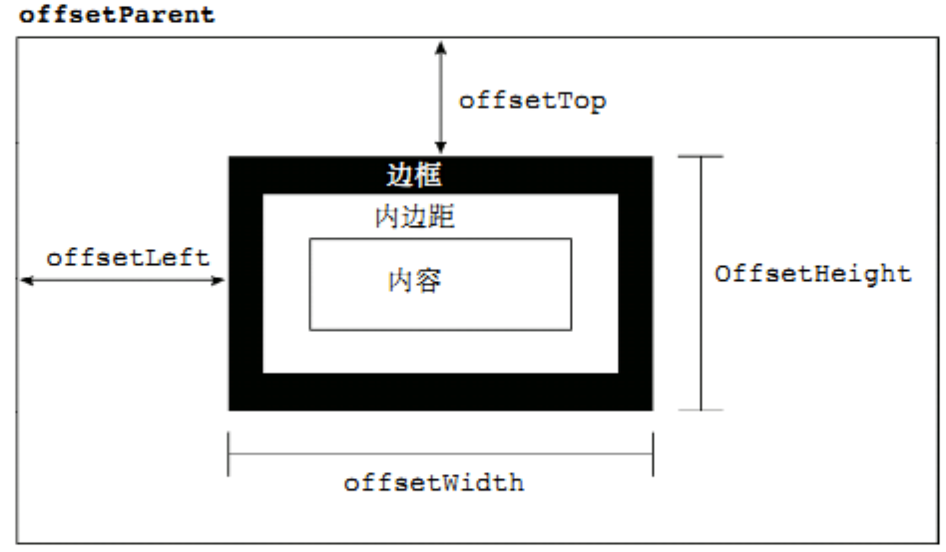
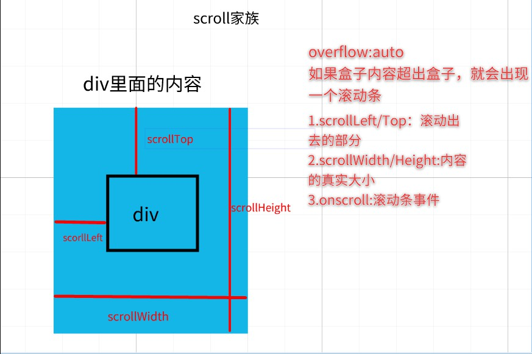
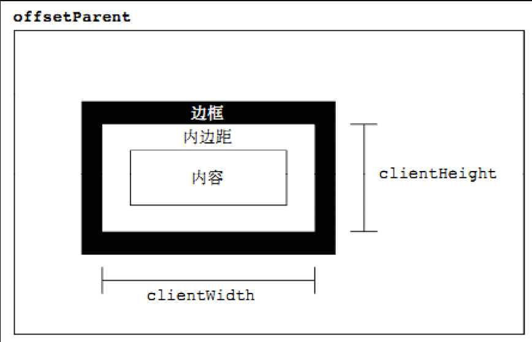
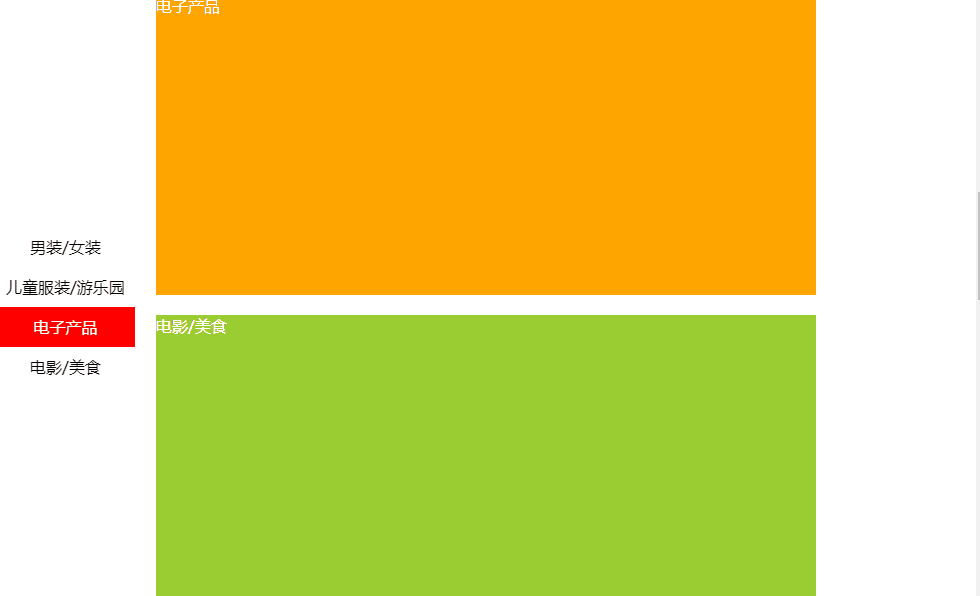
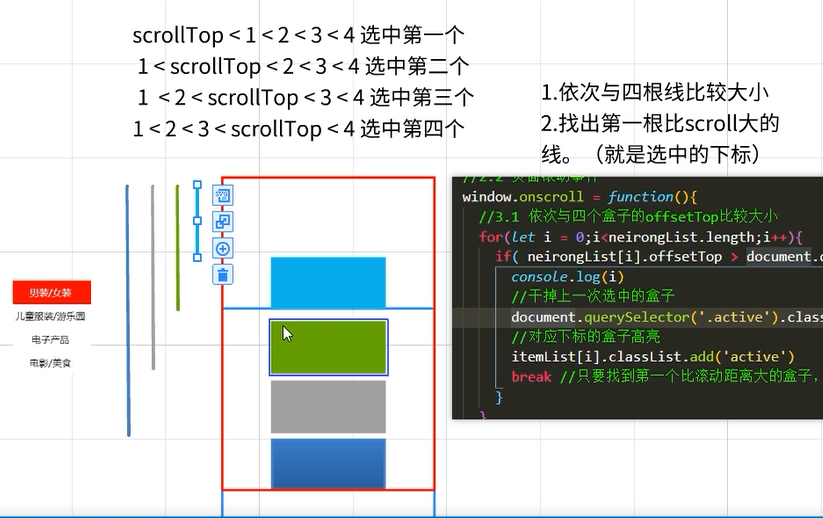
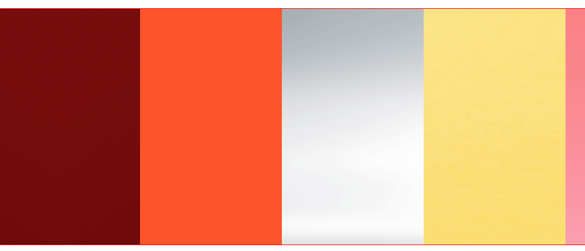

# 1. 三大家族

## 1.1. 属性介绍

注意点：

* 未设置自减盒子模型，width指的就是内容宽度，就是padding里面的
* 返回的是数字类型不带px单位
* 只能用来拿，不能改，scrollTop和scrollLeft可以改（不需要监听onscroll事件），这里注意不要先用变量赋值去修改变量的值，还需要重新赋值赋回去，直接赋值。`document.documentElement.scrollTop= neirongList[i].offsetTop`
* 只有left和top

### 1.1.1. offset家族（偏移值，整个盒子与内容无关）

获取元素 ‘自身’ 的真实宽高 和 真实位置（与内容无关）

* offsetWidth / offsetHeight : 获取 width+padding+border
* offsetLeft / offsetTop : 获取 左/上 外边框 到定位父元素  左/上 内边框距离（子绝父相）



### 1.1.2. scroll家族（滚动值，与内容相关）

获取元素 ‘内容’ 的真实宽高 和 位置

* scrollWidth / scrollHeight : 获取内容的宽高（包括padding，包括隐藏的或者滚动条隐藏的内容，即全部内容）
* scrollLeft ： 内容最左边到左内边框（包含边框）的距离（可以改）
* scrollTop : 内容最上边到上内边框（包含边框）的距离（可以改）

 记住：scrollLeft和scrolltop就是滚动条滚动的距离

默认滚动条会自动占据盒子的宽度（17px）， scrollWidth不包括滚动条的宽度就只是内容的宽度（加padding）

获取的是html的`document.documentElement.scrollTop`



> 始终牢记盒子移动的距离就是页面滚动的距离

### 1.1.3. client家族（客户/代理看到的 可视区域/视口/能看到的全部内容）

获取元素 ‘可视区域’ 宽高 和 位置（包括padding）

* clientWidth / clientHeight : 可视区域大小
* clientLeft / clientTop : 可视区域位置（就是border-left左边框 和 border-top上边框 宽度）

clientWidth不包括滚动条的宽度就是内容的宽度（加padding）

获取的是html的`document.documentElement.clientHeight`



## 1.2. 获取网页滚动距离

获取网页滚动距离需要给window注册onscroll事件，记住下面的固定语法

1. 给页面注册滚动事件要找window :  `window.onscroll`
2. 获取页面滚动距离要找html : `document.documentElement.scrollTop`

页面事件（很多浏览器内核支持的 window是整个窗口）：

* window.onmousemove 鼠标移动
* window.onscroll（记住要拿html的滚动距离）页面滚动
* window.onresize 监听页面视口大小

```js
window.onscroll = function () {
            //获取页面滚动的距离  html标签的scrollTop
            console.log(document.documentElement.scrollLeft, 						document.documentElement.scrollTop)
```

> 记住scrollTop和scrollLeft是可以改变的，改变了页面自动滚动自定义距离，不需要绑定onscroll事件 。绑定页面滚动事件，可以实时获取滚动距离

## 1.3. scroll家族案例：固定导航


思路（一般不会单独给某个盒子设置onscroll，都是直接给window注册）
注册页面滚动事件 : 判断 页面滚动距离 与  top盒子高度 关系

* 如果 页面滚动距离 >= 盒子高度 : 设置导航盒子nav为固定定位 （添加类名fixed）
* 否则 : 设置导航盒子nav为标准流（移除类名fixed）

思路一定要清晰，需求要求滚动topPart的高度后，navbar自动fixed，会脱标，下面的main会自动挤上去，需要设置一个marginTop，回来的时候要消去fixed和marginTop

```js
<body>
    <div class="top" id="topPart">
        
    </div>
    <div class="nav" id="navBar">
        
    </div>
    <div class="main" id="mainPart">
        
    </div>
    <script>
        // 1.获取元素
        // 变量名不能是top
        let topPart = document.querySelector('.top')
        let navBar = document.querySelector('.nav')
        let mainPart = document.querySelector('.main')
        // 2.给页面注册滚动事件
        window.onscroll = function () {
            // 获取滚动距离
            let scrollDistance = document.documentElement.scrollTop
            // 判断逻辑
            if (scrollDistance > topPart.offsetHeight) {
                navBar.classList.add('fixed')
                /* 细节注意点： 固定定位会脱标，导致下面标准流瞬间闪上去（顿闪）
                 解决方案： 设置下面盒子的marginTop, 撑开脱标的高度
                 */
                mainPart.style.marginTop = 10 + navBar.offsetHeight + 'px'
            } else {
                // 类名和style不要混着用
                navBar.classList.remove('fixed')
                // navBar.classList.remove('fixed')
                //回到标准流， marginTop也要恢复
                mainPart.style.marginTop = 10 + 'px'

            }
        }
    </script>
```

> 回到顶部应用或者直接跳到某个盒子的高度位置：直接document.documentElement.scrollTop=0或盒子高度，会回到顶部或者自动滚动相应距离

## 1.4. client家族案例：响应式布局

应用onresize事件监听视口的宽高
1.响应式布局 ： 一个页面适配多个不同设备 
2.响应式布局设备 ：
	* 大PC        ：  >= 1200px
	* 小pc,大平板  ：  992px - 1200px
	* 平板        ： 768px - 992px
	* 手机        :  < 768px
3.响应式布局原理
	* 监听设备视口大小 ： 媒体查询、clientWidth（flexible.js底层原理就是用onresize事件监听视口宽高）
	* 根据视口大小加载不同的样式

> 手机的可视区域就是手机的分辨率，电脑的可视区域不包括浏览器的工具栏就是中间的部分

```js
//  1.给页面注册监听视口大小事件
        window.onresize = function () {
            // 获取视口大小
            let w = document.documentElement.clientWidth
            let h = document.documentElement.clientHeight
            // 事件处理函数
            if (w > 1200) {
                document.body.style.backgroundColor = 'red'
            } else if (w > 992) { //隐藏条件  w < 1200
                document.body.style.backgroundColor = 'yellow'
            } else if (w > 768) { //隐藏条件  w < 992
                document.body.style.backgroundColor = 'green'
            } else { //隐藏条件  w < 768
                document.body.style.backgroundColor = 'pink'
            }
            // 横竖屏适配（只有移动端才有这样的需求）
            if (w > h) {
                alert('横屏')
            } else {
                alert('竖屏')
            }
        }
```

> 获取可视高度也是html的高度，`document.documentElement.clientHeight`

## 1.5. 补充scrollIntoView()方法

MDN传送门：[https://developer.mozilla.org/zh-CN/docs/Web/API/Element/scrollIntoView](https://developer.mozilla.org/zh-CN/docs/Web/API/Element/scrollIntoView)

dom元素调用该方法可以滚动页面中的某个区域滚动到与视口顶部/中部/底部对齐

语法：

```js
element.scrollIntoView(); // 等同于element.scrollIntoView(true)
element.scrollIntoView(alignToTop); // Boolean型参数
element.scrollIntoView(scrollIntoViewOptions); // Object型参数
```

* alignToTop是一个布尔值，true表示与当前可视区域的顶部对齐，相应`scrollIntoViewOptions: {block: "start", inline: "nearest"}`。这是这个参数的默认值。false表示与可视区域底部对齐，相应的`scrollIntoViewOptions: {block: "end", inline: "nearest"}`
* scrollIntoViewOptions是一个包含下列属性的对象
  * behavior 定义动画过渡效果 auto（默认） 或smooth
  * block 垂直方向对齐 start （默认）、center、end或nearest
  * inline 水平方向对齐 同上但默认为nearest

# 2. 电梯导航




> 规定记住就好：注册是给window注册，获取页面内容就是html `document.documentElement.scrollTop`

仔细分析页面，交互事件也就两个，一个是点击左侧每一个列表项，右侧跳转到相应的位置
另一个是滚动页面，滚动相应的距离，左侧列表项要有对应的列表项变化

事件一：点击左侧每一个列表，右侧跳转到相应的位置

1. 排他思想修改样式 :  类名排他active
2. 页面滚动到下标一致盒子位置 ： 
   * 页面滚动 `document.documentElement.scrollTop`
   * 盒子位置 `neirongList[i].offsetTop`
     事件二：右侧盒子滚动时，需要监听滚动距离，让左侧导航栏发生变化
     监听滚动距离，与每一个盒子的offsetTop相比，在范围类的左侧用类名排他

```js
// 左侧事件
let itemList = document.querySelectorAll('.aside .item'),
      neirongList = document.querySelectorAll('.content .neirong')
    // 注册事件
    for (let i = 0; i < itemList.length; i++) {
      itemList[i].onclick = function () {
        document.querySelector('.item.active').classList.remove('active')
        this.classList.add('active')

        document.documentElement.scrollTop = neirongList[i].offsetTop

      }
    }
// 右侧事件
    window.onscroll = function () {
      let scrollDistance = document.documentElement.scrollTop
      for (let i = 0; i < neirongList.length; i++) {
        // 有的页面会在offsetTop下面加上100
        if (scrollDistance < neirongList[i].offsetTop + 100) {
          document.querySelector('.item.active').classList.remove('active')
          itemList[i].classList.add('active')
          // break这里起到了绝对性的作用不能省去，一旦找到第一个位置比页面滚动距离大的盒子,就必须要break结束循环
          break
        }
      }
    }
```

> 监听滚动距离时有时有的页面会在offsetTop上加上100，就是第一个盒子被遮住了一点才跳到第二个盒子

# 3.手风琴

手风琴：一个盒子展开另外剩下的盒子折叠，记住不管怎么样要把整个父盒子占满，计算别算错了

div无语义化，作用就是把功能包在一个盒子里面

思路分析：两个事件，

事件一：鼠标移入每一个li元素，排他思想修改宽度。 兄弟：100px  自己：800px

事件二：鼠标移出整个box ，设置每一个li元素的宽度 240



```js
  // 1.鼠标移入事件
  // 1.1获取元素
  let liList = document.querySelectorAll('#box li'),
    box = document.querySelector('#box')
  // 1.2.注册事件
  for (let i = 0; i < liList.length; i++) {
    liList[i].addEventListener('mouseenter', function () {
      // 排他干掉所有兄弟
      for (let j = 0; j < liList.length; j++) {
        liList[j].style.width = 100 + 'px'
      }
      // 复活自己
      this.style.width = 800 + 'px'
    })
  }
  // 2.鼠标移出事件（注意是移出整个box）
  /* for (let i = 0; i < liList.length; i++) {
    liList[i].onmouseleave = function () {
      this.style.width = 240 + 'px'
    }
  } */
  box.onmouseleave = function () {
    for (let i = 0; i < liList.length; i++) {
      liList[i].style.width = 240 + 'px'
    }
  }
```

# 4. 轮播图


思路分析：

两个事件，一个定时器

事件一：鼠标点击上一页 下一页 切换

图片切换核心思路： 声明全局变量index记录当前下标（上面的图片也可以用修改imgSrc来做）

1. 下一页 :
   * 如果 index 是 最大下标 , 则 index = 0 . 否则 index++
   * 使用index来排他 : 大图 + 小图
   * 修改h3标签文本 ： 当前第几张
2. 上一页 : 
   * 如果 index 是 0 , 则 index = 最大下标 . 否则 index--
   * 使用index来排他 : 大图 + 小图
   * 修改h3标签文本 ： 当前第几张

事件二：鼠标移入下方每一个小li ，图片和文字切换

* 排他思想修改自己的样式： 类名排他 active
* 排他思想修改上面大li的样式： 类名排他 active 
* 修改h3标签文本 ： 当前第几张

自动轮播定时器：

1. 页面一加载 ： 开启定时器自动执行下一页代码（let一个全局的timeID）
2. 鼠标移入大盒子main ： 清除定时器
3. 鼠标移出大盒子main : 开启定时器自动执行下一页代码（不要再重新let一个timeId了）

> 注意点：
>
> * 代码中有opacity:0到opacity:1代替display:none到block再加上过渡实现图片淡入淡出的效果
> * 两个事件可能交叉使用，需要让index的值跟上i的步伐
> * 代码复用可以用函数包装
> * timeID不要在局部声明，就算声明了也要记得清除，事件里面的定时器一定要清除，不然每次触发事件，就会设置一次定时器，会产生叠加
> * 这里的a标签是因为设置了href='javascript:;'阻止了默认跳转，冒号分号一个也不能少，只能给href用
> * 函数（函数表达式不行，函数声明有预解析提升）可以先调用在声明，但是变量一定要先声明在使用，除了定时器和时间可以先使用，因为这两个都会延时执行，而页面很快就加载了，等于执行了下面的声明

```js
<script>
    // 一、点击上一页下一页切换图片
    // 1.获取元素
    let liList1 = document.querySelectorAll('.slides li'),
      liList2 = document.querySelectorAll('.indicator li')
    index = 0,
      prev = document.querySelector('.prev'),
      next = document.querySelector('.next')

    // 2.注册事件
    // 2.1.上一张
    prev.onclick = function () {
      // 2.1.1.下标变化
      // 三元表达式一定要看好，是取它的值用变量赋值还是取执行结果
      index == 0 ? index = liList1.length - 1 : index--
	  paiTa(index)
    }

    // 2.2.下一张
    next.onclick = function () {
      // 2.2.1.下标变化
      // 三元表达式一定要看好，是取它的值用变量赋值还是取执行结果++++++++++++
      index == liList1.length - 1 ? index = 0 : index++
	  paiTa(index)
    }


    // 二、鼠标移入下方小图片大图片跳转
    for (let i = 0; i < liList2.length; i++) {
      liList2[i].onmouseenter = function () {
   		paiTa(i)
        // index与i的值不一致的话，导致两个事件交叉执行时，出现bug
        // 让全局变量下一页的index与当前移入的i保持一致，下一次点击下一页，才会从i的位置新增，就是index在i之后执行会产生错位的现象
        index = i
      }
    }

    // 三、设置定时器让其自动轮播
    // 1.页面一加载就自动轮播
    let timeID = setInterval(function () {
      next.onclick()
    }, 1000)
    // 2.鼠标移入main盒子定时器清除
    document.querySelector('.main').onmouseenter = function () {
      clearInterval(timeID)
    }
    // 3.鼠标移出main盒子设置定时器
    document.querySelector('.main').onmouseleave = function () {
      timeID = setInterval(function () {
        next.onclick()
      }, 1000)
    }

    // 上面有一段重复的代码可以使用函数封装，然后在各个地方分别调用就可以
    function paiTa(i) {
      // 1.大图排他
      // 类名排他干掉兄弟
      document.querySelector('.slides li.active').classList.remove('active')
      // 复活自己
      liList1[i].classList.add('active')
      // 2.小图排他
      // 类名排他干掉兄弟
      document.querySelector('.indicator li.active').classList.remove('active')
      // 复活自己
      liList2[i].classList.add('active')
      document.querySelector('.extra h3').innerText = `第${i+1}张图的描述信息`
    }

```