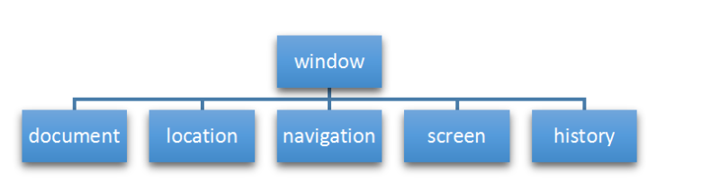
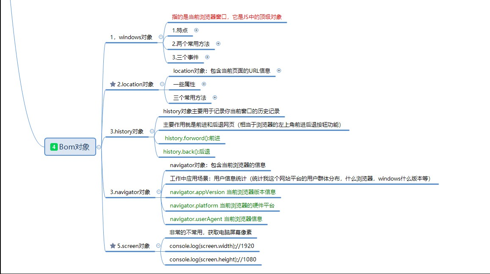
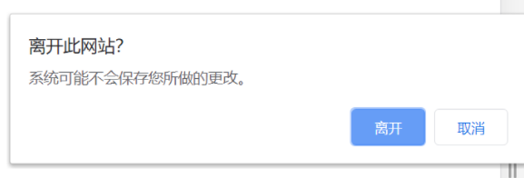
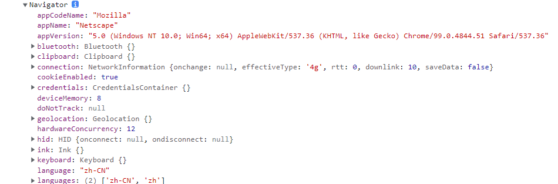
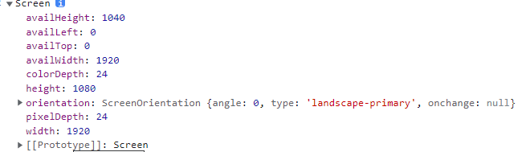
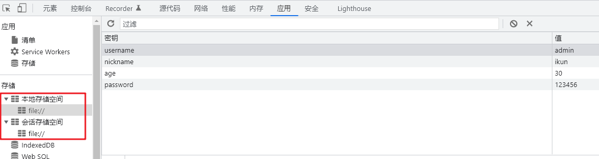

# 1. bom浏览器对象模型

## 1.1. bom和dom介绍

JavaScript语言由三部分组成
* ECMAJavaScript：定义了js的语法规范
* Dom：document object model文档对象模型：一个HTML文档中所有的一切都是dom对象
	Dom定义了一套操作HTML文档的API（节点的增删改查）
* Bom：Brower object model浏览器对象模型 例如：一个浏览器的窗口（一个标签页）就是一个window对象
  Bom定义了一套操作浏览器窗口的API

Bom主要由五大对象组成：
  * window：浏览器核心对象（最顶级的对象）
  * location：包含当前页面的URL信息
  * history：history对象主要用于记录你当前窗口的历史记录
  * navigator：包含当前浏览器的信息，例如用的什么浏览器，操作系统版本等
  * screen：获取用户电脑的屏幕分辨率
    * 这个一般不用，因为对开发者没啥作用





## 1.2.  window对象

### 1.2.1. window对象基本介绍

window对象：指的是当前浏览器窗口，它是JS中的顶级对象。所有的全局函数/变量 都是window对象的成员(属性+方法)。例如`alert()``setInterval()`

凡是window对象中的成员， 使用时都可以省略window 。window.document 可以省略window写成document

> * window中有一些对象是无法被修改的。 例如: top（指向window本身）。我们自己无法声明变量叫做top, 而且也无法修改它的值。 固定值指向window
> * window有一个特殊的属性叫做name，它永远都是一个字符串，可以用来存储数据
> * 声明变量最好不要跟dom里面属性完全一致， 例如: top  left  . 一般会使用驼峰。  boxTop  oneTop

### 1.2.2. window对象两个常用的方法

1. 打开窗口  `window.open()`可以实现窗中窗，打开一个新的窗口

第一个参数url : 网址

第二个参数target : _blank(默认打开新窗口)   _self : 当前（窗口）页面打开

第三个参数 新窗口尺寸 :  可以实现窗中窗功能（定位只能写left和top，不能写right和bottom）

第四个参数 可选参数布尔true/false :  是否替换历史记录，把新开的窗口加入/不加入到浏览器历史记录，默认为true加入历史记录，设置false可以设置为无痕浏览

返回结果：新打开的window对象

```js
document.querySelector(".btn1").onclick = function() {
          window.open('http://www.baidu.com','_blank','left=200,top=200,width=300,height=300')
      }

```

2. 关闭窗口 ` window.close()`

参数就是你想要关闭的窗口对象，如果不写，默认就是关闭自己

可以直接连写`window.open().close()`但是如果关闭的是顶级对象，谷歌火狐会默认识别为恶意代码，不会执行

解决方法：所以我们用js先假装在当前窗口打开自己，然后再关闭自己`window.open(" ","_self").close()`这里的url不是空字符串""，而是一个空格字符串  " "

### 1.2.3. window对象三个事件

window对象有三个事件，记录了浏览器窗口从打开到关闭的三个过程（ECMAScript对象（array，object,Math,Date）   DOM(document)对象  BOM对象）

1. `window.onload`：界面上所有的内容（页面dom树加外部资源）加载完毕之后才触发这个事件

```js
 console.log ( document.getElementById ( "p1" ) 
```
如果script标签写在了body标签的上面，由于编译器是从上往下解析html文件的，js代码会在body内容还未加载的时候就执行，返回null，此时编译器还未解析p标签
```js
 window.onload = function() {
        console.log("页面加载完毕")
        let box = document.querySelector(".box")
        console.log(box)
        console.log(box.scrollWidth,box.scrollHeight)
      }

```
`window.onload()`无论写在界面什么位置都是等整个界面加载完毕之后才会执行

2. `window.onbeforeunload`：界面在关闭之前会触发这个事件

   一般用于存储 重要数据。也可以弹出一个提示框挽留一下用户（谷歌火狐会拦截这种代码）

```js
    window.onbeforeunload = function () {
      console.log('页面关闭之前')
      // window.onbeforeunload : 页面关闭之前
    }
```
https://blog.csdn.net/wls666/article/details/89282244?spm=1001.2101.3001.6650.2&utm_medium=distribute.pc_relevant.none-task-blog-2%7Edefault%7ECTRLIST%7ERate-2-89282244-blog-103181022.pc_relevant_paycolumn_v3&depth_1-utm_source=distribute.pc_relevant.none-task-blog-2%7Edefault%7ECTRLIST%7ERate-2-89282244-blog-103181022.pc_relevant_paycolumn_v3&utm_relevant_index=4

谷歌、火狐做了优化，关闭窗口onbeforeunload会弹出如下的提示框，alert不生效



3. `window.onunload`：界面在关闭的那一瞬间会触发这个事件（用得不多）。无法阻止页面关闭

## 1.3. location对象

### 1.3.1. location对象的介绍

location对象 ： 浏览器地址栏 url（全球统一资源定位符）

重点掌握：` location.href = 'url'`修改location对象的href,可以实现网页跳转

a标签与location跳转的区别：
* a标签href ： 用于无条件渲染。 没有逻辑性，点我100%跳转. 例如：订单、商品详情
* location.href : 用于js具有逻辑性跳转。 例如登录. (只有成功才会跳转)

```js
//1.location对象信息查看
    console.log ( window.location );//location对象
    console.log(location.hash);//资源定位符（锚点定位）
    console.log(location.host);//主机   host = hostname + port
    console.log(location.hostname);//主机名（ip地址）
    console.log(location.port);//端口号
    console.log(location.href);//完整的url路径
    console.log(location.pathname);//资源路径
    console.log(location.protocol);//url的协议
    console.log(location.search);//url请求的参数
```

### 1.3.2. location对象的三个方法

`location.assign('url')`  :   跳转网页（在当前窗口）。 可以回退（等价于location.href方法）

`location.replace('url')`  :  替换网页（在当前窗口）。 不可以回退（同时会替换当前网页的历史记录，当前网页不会留下历史记录）

`location.reload()`  :    刷新网页。 相当于F5，一般用于移动端

```js
 		document.querySelector('.assign').onclick = function(){
            //跳转网页： 与修改 location.href 作用完全一致，只是写法不同
            location.assign('http://www.baidu.com')
        }
        document.querySelector('.replace').onclick = function(){
            //替换网页： 不能回退
            location.replace('http://www.baidu.com')
        }
        document.querySelector('.reload').onclick = function(){
            //刷新网页，相当于F5
            location.reload()
        }
```

## 1.4. history对象

history对象 ： 历史记录。主要作用就是前进和后退网页（相当于浏览器的左上角前进后退按钮功能）

* `history.back()` :  回退上一页

* `history.forward()` :  前进下一页（跳转到当前网页历史记录的下一页，如果没有下一页的历史记录，则不跳转）

* `history.go(数字) `:  跳转指定历史记录
	0 : 跳转自己，相当于刷新
	负数: 回退   -1 回退1页  -2回退2页
	正数: 前进    1 前进1页   2前进2页

## 1.5. navigator对象

navigator对象：包含当前浏览器和设备的信息

工作中应用场景：用户信息统计（统计我这个网站平台的用户群体分布，什么浏览器，windows什么版本等）

` window.navigator`navigator对象

`navigator.userAgent`用户代理  获取用户电脑与浏览器信息



应用

```js
//使用场景1：判断当前用户的操作系统是32位还是64位
    //谷歌和IE  64位显示WOW64    火狐显示Win64
    if(navigator.userAgent.indexOf('WOW64') != -1 || navigator.userAgent.indexOf('Win64') != -1){
        console.log ( "64位" );
    }else{
        console.log ( "32位" );
    }

    //使用场景2：判断用户当前使用哪种浏览器
    if(navigator.userAgent.indexOf('Chrome') != -1){
        console.log ( "谷歌浏览器" );
    }else if(navigator.userAgent.indexOf('Firefox') != -1){
        console.log ( "火狐浏览器" );
    }else{
        console.log ( "IE浏览器" );//也有可能是其他小众浏览器，可以忽略不计
    }
```

现实应用：大数据杀熟，不同的手机价格不一样

## 1.6. screen对象

screen : 用户电脑屏幕 （了解，不常用）



# ==2. localStorage和sessionStorage==
 localStorage和sessionStorage存储空间很大，一般可以存储5M左右

都属于window的成员，可以直接调用




## 2.1. localStorage

localStorage : 本地存储

经典应用 ： 免登录

语法 ：   
* 存数据 ：  `localStorage.setItem('属性名',属性值)` 
* 取数据 ： `localStorage.getItem('属性名')`
* 删数据 :  `localStorage.removeItem('属性名')`
* 清空数据 : `localStorage.clear()`

注意点：

* **localStorage是永久存储的， 除非手动删除，否则一直存在（是认域名的，不同域名的localStorage不一样）**
* 只能存储字符串。 如果是其他类型，则编译器会自动帮你转成字符串后存储（对象需要转换成json存储）

免登录案例

```js
//2.注册事件
        input_sub.onclick = function(){
            //3.事件处理
            //3.1 获取用户输入的用户名和密码
            var username = input_txt.value;
            var passoword = input_pass.value;
            //3.2 判断用户名密码长度
            if(username.length >= 6 && passoword.length >= 6){
                alert('登录成功');
                //(1)存储用户名密码
                localStorage.setItem('username',username);
                localStorage.setItem('password',passoword);
                //(2)跳转网页
                window.location.href = 'http://www.itheima.com/';
            }else{
                alert('登录失败');
            };

        };

        //3.页面一加载：就读取localStorage的数据，赋值给表单
        input_txt.value = localStorage.getItem('username');
        input_pass.value = localStorage.getItem('password');
```

## 2.2. sessionStorage

sessionStorage : 会话存储（语法同localStorage完全一样）
应用场景 :  页面间传值
语法 ：   
* 存数据 ：  `sessionStorage.setItem('属性名',属性值)` 
* 取数据 ：  `sessionStorage.getItem('属性名')`
* 删数据 :   `sessionStorage.removeItem('属性名')`
* 清空数据 : `sessionStorage.clear()`

注意点 ：
* **sessionStorage是临时存储的。 只要页面一关闭，数据就自动清空（区别所在）**
* 只能存储字符串。 如果是其他类型，则编译器会自动帮你转成字符串后存储

页面间传值（后面不会使用sessionStorage，会用url传递参数）

页面A

```js
document.querySelector('.btn').onclick = function(){
            //(1)把表单数据存入 sessionStorage
            let username = document.querySelector('.username').value 
            let password = document.querySelector('.password').value 
            sessionStorage.setItem('username', username )
            sessionStorage.setItem('password', password )
            //(2)跳转到B页面
            location.href = './04-页面传值B.html'
        }
```

页面B

```js
document.querySelector('.btn').onclick = function(){
            //(1)读取A页面数据 -> 从sessionStorage读取
            let username = sessionStorage.getItem('username')
            let password = sessionStorage.getItem('password')
            //(2)读取本页面(B页面)数据
            let phone = document.querySelector('.phone').value
            let address = document.querySelector('.address').value
            //(3)注册： 把A页面数据 + B页面数据 一起发给服务器
            console.log(username,password,phone,address)
            
        }
```

## 2.3. localStorage与sessionStorage的区别（异同点）

* 相同点 : 作用一致，都是用于存储数据

* 不同点 : 存储方式不同
  localStorage : 硬盘存储，永久存储
  sessionStorage : 内存存储，临时存储

  
## 2.4. JSON格式

### 2.4.1. 数据交换格式

数据交换格式，就是服务器端与客户端之间数据传输的格式

* XML（扩展标记语言 基本不用）
* json（主流）

### 2.4.2. json格式

JSON（全称：JavaScript Object Notation）是一种数据交换格式，它本质上是用字符串的方式来表示**对象**或**数组**类型的数据

背景： 实际开发中,网页的数据都是从服务器(后台)获取。 但是后台开发会有很多种编程语言。java、c++、python、php、c#、.net、go,等等。 不同的编程语言由于编译器不同,数据类型也不同。无法直接传输。 后来，人们为了解决这个问题。发明了一种通用的数据格式,让几乎所有的编程语言都支持。这就是JSON格式

JSON语法 : 
* JSON格式字符串 -> JS对象 :   `let 对象名 = JSON.parse( json格式 )`

* JS对象 -> JSON格式字符串 :   `let 变量名 =  JSON.stringify( js对象 )`

json格式字符串`'{"name":"张三","age":"20","hobby":["学习","上课"]}'`
规定：外面必须单引号，里面属性名也要双引号，数字不加双引号也可以，但是为了规范要加上双引号，数组里面的元素也要加上双引号

1. 对象格式的 JSON 数据，最外层使用 {  } 进行包裹，内部的数据为 key: value 的键值对结构
	* key 必须使用英文的双引号进行包裹
	* value 的值只能是字符串、数字、布尔值、null、数组、对象类型（可选类型只有这 6 种）
2. 数组格式的 JSON 数据，最外层使用 [  ] 进行包裹，内部的每一项数据之间使用英文的 , 分隔
	每一项的值类型只能是字符串、数字、布尔值、null、数组、对象这 6 种类型之一

> 注意里面的只有字符串打引号，数字，布尔，null都不打引号

注意事项（六条规则）：

1. 属性名必须使用双引号包裹，最外面必须使用单引号包裹
2. 字符串类型的值必须使用双引号包裹
3. JSON 中不允许使用单引号表示字符串
4. JSON 中不能写注释
5. JSON 的最外层必须是对象或数组格式
6. 不能使用 undefined 或函数作为 JSON 的值

### 2.4.3. 序列化和反序列化

* 把真实数据转换为字符串的过程，叫做序列化（json格式更有序）如`JSON.stringify()`
* 把字符串转换为真实数据的过程，叫做反序列化`JSON.parse()`


## 2.5.json解决 localStorage存储对象类型数据

先转json，后存本地
`localStorage.setItem('obj', JSON.stringify( obj ) )`
先取本地,后转json
`let obj = JSON.parse( localStorage.getItem('obj') )`

# 今日学习总结
bom对象

1. windows对象
指的是当前浏览器窗口，它是JS中的顶级对象
* 特点
(1) 所有的全局变量都是window对象的属性：最顶级的对象
(2) 只要是window的属性和方法，在使用的时候都可以省略window
	window.alert() 可以省略window写成alert()
	window.document 可以省略window写成document
(3).window对象有一个特殊属性叫做name，它永远都是一个字符串，无论给他赋什么值
* 两个常用方法
    * open()：打开一个新窗口
      `window.open('https://www.baidu.com', '_blank', 'top=100,left=100,width=500,height=300', true );`
    * close()：关闭一个窗口
      * `window.close(要关闭的window对象)`
      * 野路子，自己关闭自己:`window.open(" ","_self").close()`;
* 三个事件

    * `window.onload`:界面上所有的内容加载完毕之后才触发这个事件
    * `window.onbeforeunload`:界面在关闭之前会触发这个事件
    * `window.onunload`:界面在关闭的那一瞬间会触发这个事件

 2. location对象

location对象：包含当前页面的URL信息
url = 协议名（http） + ip地址（域名） + 端口号 + 资源路径
暂时只需要知道location对象包含一个网页的网络url信息即可，具体的含义将在后面阶段学习网络的时候详细讲解

一些属性
* `location.hash` ·资源定位符（锚点定位）
* `location.host`主机 host = hostname + port
* `location.hostname`主机名（ip地址）
* `location.port`端口号
* `location.href`完整的url路径
* `location.pathname`资源路径
* `location.protocol`url的协议
* `location.search`url请求的参数

三个常用方法

* `window.location.assign('http://www.itheima.com')`打开新网页，会留下历史记录（可以回退）
* `window.location.replace('http://www.itcast.com')`打开新网页，不会留下历史记录（不能回退）
* `window.location.reload()`刷新当前网页,相当于按了F5刷新当前网页

3. history对象
history对象主要用于记录你当前窗口的历史记录
主要作用就是前进和后退网页（相当于浏览器的左上角前进后退按钮功能）
	* `history.forword()`:前进
	* `history.back()`:后退

4. navigator对象
navigator对象：包含当前浏览器的信息
工作中应用场景：用户信息统计（统计我这个网站平台的用户群体分布，什么浏览器，windows什么版本等）
	* `navigator.appVersion` 当前浏览器版本信息
	* `navigator.platform` 当前浏览器的硬件平台
	* `navigator.userAgent` 当前浏览器信息

5. screen对象
   非常的不常用，获取电脑屏幕像素
    * console.log(screen.width);//1920
    * console.log(screen.height);//1080