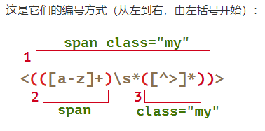
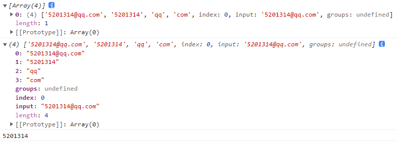

# 1. 正则表达式语法

默认是贪婪匹配和局部匹配（只匹配满足条件的第一个）

## 1.1. 正则表达式介绍

正则表达式（Regular expression）是什么 : 是 用于对字符串进行匹配运算的 **内置对象**。这些模式被用于 [`RegExp`](https://developer.mozilla.org/zh-CN/docs/Web/JavaScript/Reference/Global_Objects/RegExp) 的 [`exec`](https://developer.mozilla.org/zh-CN/docs/Web/JavaScript/Reference/Global_Objects/RegExp/exec) 和 [`test`](https://developer.mozilla.org/zh-CN/docs/Web/JavaScript/Reference/Global_Objects/RegExp/test) 方法, 以及 [`String`](https://developer.mozilla.org/zh-CN/docs/Web/JavaScript/Reference/Global_Objects/String) 的 [`match`](https://developer.mozilla.org/zh-CN/docs/Web/JavaScript/Reference/Global_Objects/String/match)、[`matchAll`](https://developer.mozilla.org/zh-CN/docs/Web/JavaScript/Reference/Global_Objects/String/matchAll)、[`replace`](https://developer.mozilla.org/zh-CN/docs/Web/JavaScript/Reference/Global_Objects/String/replace)、[`search`](https://developer.mozilla.org/zh-CN/docs/Web/JavaScript/Reference/Global_Objects/String/search) 和 [`split`](https://developer.mozilla.org/zh-CN/docs/Web/JavaScript/Reference/Global_Objects/String/split) 方法

正则表达式应用：用来做格式校验

MDN传送门：[https://developer.mozilla.org/zh-CN/docs/Web/JavaScript/Guide/Regular_Expressions](https://developer.mozilla.org/zh-CN/docs/Web/JavaScript/Guide/Regular_Expressions)

正则表达式需要使用new来创建，当然最多的是简写形式

`let reg = **new** *RegExp*('a')`===`/a/`简写两撇之间不要加引号，本来就是对字符串进行检测

常用方法是调用正则的`test()`来判断是否匹配

> js中几乎所有的内置对象，其实都是new创建
>
> ​        new Array()      简写：[]
>
> ​        new Object()     简写：{}
>
> ​        new Date()
>
> ​        new RegExp()      简写: /正则/

```js
		//1.创建正则对象
        //检测字符串有没有a
        let reg = new RegExp('a')
        //2.调用test()进行校验
        console.log( reg.test('123456') )//false
        console.log( reg.test('123a456') )//true

		//简写形式
		console.log( /a/.test('abc123')  )//true
         console.log( /a/.test('123456')  )//false
```

正则表达式图形化网站：https://regexper.com/

## 1.2. 元字符与原义文本字符

正则表达式主要由两部分组成

1. 原义文本字符 :  就是字符串本身的含义，没有其他的意思。例如: `/中国/`   ==**检测字符串中有没有`中国**`==
2. 元字符 :  改变了字符串本身的含义 （类似于js中的关键字）共十一个`[]  . \ () | ^ $ * + ? {}`

注意`/中国/`正则表达式检测字符串，不是有中，也不是有国，也不是有中或有国，也不是有中且有国，就是检测有没有'`中国'这个字符串

```js
    console.log(/中国/.test('中间有国家')) //false
    console.log(/中国/.test('中心有温暖')) //false
    console.log(/中国/.test('我爱中国')) //true
```

## 1.3. 字符类和反向类

通常把具有同一特征的数据叫作类，正则中把`[]`包起来的为一类

`/[abc]/` ：字符类。 把 a 和 b 和 c的字符归为一类，只要满足其中任意一类即可

通俗地说 :：字符串中只要有是 a b c 其中任意一个字符即可 a或b或c

```js
	  console.log(/[abc]/.test("a123"))//true
      console.log(/[abc]/.test("b456"))//true
      console.log(/[abc]/.test("c789"))//true
      console.log(/[abc]/.test("123456"))//false
      console.log(/[abc]/.test("abc123"))//true
      console.log(/[abc]/.test("abcabc"))//true
```

`[^abc]`：反向类。 把 不是a 和 不是b 和 不是c的字符归为一类，只要满足其中任意一类即可 不是a和b和c

通俗地说:：字符串中只要有 ‘不是’ a b c 其中任意一个字符即可

```js
	  console.log(/[^abc]/.test("a123"))//true
      console.log(/[^abc]/.test("b456"))//true
      console.log(/[^abc]/.test("c789"))//true
      console.log(/[^abc]/.test("123456"))//true
      console.log(/[^abc]/.test("abc123"))//true
      console.log(/[^abc]/.test("abcabc"))//false
```

## 1.4. 范围类
`/[0-9]/` : 检测数字字符
`/[a-z]/` : 检测小写字母
`/[A-Z]/ `: 检测大写字母

范围类注意点:

* 范围类是一个闭区间.   `/[0-9]/` 包含0 也包含9
* 范围类可以连写.   `/[0-9a-zA-Z]/`   包含数字 或 大小写字母
* 范围类 左边 一定小于 右边
> 5-3可以表示为`/[0-35-9]/`除掉4

正则范围主要是以字符的ASCII码为准（参考ascll码）
```js
//正则范围主要是以字符的ASCII码为准
        console.log( /[A-Za-z]/.test('[]^_') )//false
        console.log( /[A-z]/.test('[]^_') )//true
```
## 1.5. 预定义类
预定义类： 正则表达式提供好的用来匹配常见的字符类
与定义类|等价|含义
-|-|-
.|[^\r\n]|除了回车和换行之外的所有字符
\d|[0-9]|数字字符
\D|[^0-9]|非数字字符
\s|[\f\n\r\t\v]|空白字符
\S|[^\f\n\r\t\v]|非空白字符
\w|[a-zA-Z_0-9]|单词字符（字母、下划线、数字）
\W|[^a-zA-Z_0-9]|非单词字符
## 1.6. 边界

小结：

`/abc/` : 原义文本字符。 检测abc

`/[abc]/` : 字符类。 检测有a或 b或 c任意一个字符

`/[^abc]/` : 反向类。 检测有 不是 a 和b和 c任意一个字符

`/^abc/` : 开头边界。 检测以a开头的  (类似于js中的+号，元字符在不同的情况下作用不同)

1. 开头边界:  以xxx开头 `/^abc/ `
正确含义:  以a开头 + bc
错误含义:  以 abc 开头

```js
	   console.log(/^abc/.test('a1b2c3'))//false
        console.log(/^abc/.test('abc123abc'))//true
        console.log(/^abc/.test('123abc'))//false
        console.log(/^abc/.test('abcabc'))//true
```
> 理解：全局匹配元义文本字符abc，再看是否以a开头，实际还是从前往后匹配

2. 结尾边界: 以xxx结尾`/abc$/ `
正确含义: a + b + 以c结尾
错误含义: 以abc结尾

```js
	   console.log(/abc$/.test('a1b2c3'))//false
        console.log(/abc$/.test('abc123abc'))//true
        console.log(/abc$/.test('abcabc'))//true
```
> 理解：全局匹配元义文本字符，再看是否以c结尾，实际还是从前往后匹配

3. **==严格匹配==** ： 开头边界 与 结尾边界 同时存在（开发中使用最多，不然只限制开头后面可以乱写，只限制结尾，前面可以乱写）
    `/^abc$/`只有唯一正确答案： abc
    正确含义 : 以a开头 + b + 以c结尾
    错误含义 : 以abc开头 + 以abc结尾
```js
 	console.log(/^abc$/.test('a1b2c3')) //false
    console.log(/^abc$/.test('abc123abc')) //false
    console.log(/^abc$/.test('123abc')) //false
    console.log(/^abc$/.test('abcabc')) //false
    console.log(/^abc$/.test('abc')) //true

    console.log(/^\d$/.test('11'))//false
    console.log(/^\d$/.test('7'))//true
```
> 理解：匹配元义文本字符abc，再看是否以a开头，c结尾，实际还是从前往后匹配

## 1.7. 量词

量词作用： 检测字符出现的次数（默认是贪婪匹配和局部匹配（只匹配满足条件的第一个），即尽可能次数多的匹配）
符号|次数
-|-
`*`| 零次或多次（任意次）
`+`  | 一次或多次（至少出现一次>=1）
`？` |零次或一次（最多出现一次<=1）
`{n}`| 出现n次
`{n,m}`| 出现n-m次（闭区间n<=次数 =<m）
`{n,}`|出现至少n次（>=n）

示例

```js
//   /\d?/   匹配<=1个数字
        console.log( '123456789abc'.replace(/\d?/,'X') )//'X23456789abc'

        //   /\d+/  匹配>=1个数字
        console.log( '123456789abc'.replace(/\d+/,'X') )//'Xabc'
        console.log( 'a123456789abc'.replace(/\d+/,'X') )//'aXabc'

        //   /\d*/  匹配任意次数字   0次 和 多次
        console.log( '123456789abc'.replace(/\d*/,'X') )//'Xabc'
        console.log( 'a123456789abc'.replace(/\d*/,'X') )//'Xa123456789abc'

        //   /\d{5}/  匹配5次数字   
        console.log( 'a123456789abc'.replace(/\d{5}/,'X') )//'aX6789abc'
        //   /\d{5,8}/ 匹配5-8次数字
        console.log( 'a123456789abc'.replace(/\d{5,8}/,'X') )//'aX9abc'
        //   /\d{5,}/ 匹配>=5次数字
        console.log( 'a123456789abc'.replace(/\d{5,}/,'X') )//'aXabc'
```

`console.log( 'a123456789abc'.replace(/\d+/,'X') )//'aXabc'`解释一下，默认是贪婪匹配和局部匹配，在第一个空白的地方就和0个字符匹配了，所以后面的123456789不匹配

## 1.8. 分组和或运算符

`|`或运算符有类的含义，会将左右两边划分

`/lo|ive/`  :  匹配  lo 或 ive

用`()`包裹起来的称为一个分组，分组的作用如下

* 字符分组：把多个字符归为一组，用于量词，用`()`包裹

* 提升优先级 : 让` |` 只匹配小括号内部的字符，提升`|`的优先级

1. 字符分组 

​      需求: 匹配三次  love

​      错误(量词默认只能匹配一个字符)：    `/love{3}/`     匹配  lov + eee

​      正确(如果希望量词可以匹配多个字符):   `/(love){3}/`  匹配  三次 love

```js
// /love{3}/     匹配  lov + eee
      console.log(/love{3}/.test("lovelovelove"))//false
      console.log(/love{3}/.test("loveeee"))//true
      // /(love){3}/   匹配  三次 love
      console.log(/(love){3}/.test("lovelovelove"))//true
      console.log(/(love){3}/.test("loveeee"))//false
```

2. 提升`|`优先级 

​      需求:  匹配 有  love  或  live

​     错误： `/lo|ive/`  :  匹配  lo 或 ive。 `|` 默认会把左右两边全部当做一个整体

​      正确：`/l(o|i)ve/` : 匹配  l  +  o或i + ve

`()`提升|的优先级，只计算小括号里面的字符

```js
	 // /lo|ive/  :  匹配  lo 或 ive
      console.log(/lo|ive/.test("lo1111"))//true
      console.log(/lo|ive/.test("222ive"))//true
      console.log(/lo|ive/.test("love"))//true

      // /l(o|i)ve/ : 匹配  l  +  o或i + ve
      console.log(/l(o|i)ve/.test("lo1111"))//false
      console.log(/l(o|i)ve/.test("222ive"))//false
      console.log(/l(o|i)ve/.test("love"))//true
```

## 1.9. 修饰符

正则表达式对象默认局部匹配，只匹配匹配成功的第一个字符。同时默认区分大小写

修饰符 ： 对正则表达式起到修饰的作用（修饰符支持连写，ig或gi都可以）

* g : global,全局匹配
* i : intensity, 不区分大小写

修饰符语法：

* `/正则表达式/修饰符`
* `new RegExp('正则表达式','修饰符')`

```js
//  /a/  默认情况下 ，正则只会匹配第一个字符
      console.log( 'a123a456A789'.replace(/a/,'X'))//X123a456A789
      // /a/g  全局匹配，匹配所有满足条件的字符
      console.log( 'a123a456A789'.replace(/a/g,'X'))//X123X456A789

      //(2) i : intensity, 不区分大小写
      // /a/  默认情况下，正则区分大小写
      console.log( 'Aa123a456A789'.replace(/a/,'X'))//AX123a456A789
      //  /a/i  不区分大小写
      console.log( 'Aa123a456A789'.replace(/a/i,'X'))//Xa123a456A789

      //(3)修饰符支持连写
      console.log( 'Aa123a456A789'.replace(/a/ig,'X'))//XX123X456X789
```

## 1.10. 贪婪模式和非贪婪模式

贪婪模式与非贪婪模式一般用于量词（不确定数量的量词），不设置的话默认就是贪婪模式

* 贪婪模式：正则表达式在匹配成功的前提下，尽可能多的匹配（默认模式）
* 非贪婪模式:正则表达式匹配成功的前提下，尽可能少的匹配（在量词后面加上 ?）

```js
	//1.贪婪模式：正则表达式在匹配成功的前提下，尽可能多的匹配
    let reg = /\d{3,6}/;//匹配3-6位数字
    console.log ( "1234567890".replace ( reg, "X" ) );//X7890   (正则表达式会匹配6位数字)

    //2.非贪婪模式:正则表达式匹配成功的前提下，尽可能少的匹配
    //语法：在量词后面加上 ?
    let reg1 = /\d{3,6}?/;//匹配3-6位数字
    console.log ( "1234567890".replace ( reg1, "X" ) );//X4567890   (正则表达式会匹配3位数字)
```

# 2. 能使用正则的string方法

`.test()`属于是正则对象的方法

str是一个字符串实例对象

[较为清晰的字符串正则匹配方法](https://zh.javascript.info/regexp-methods)

## 2.1. str.replace()

MDN传送门：[https://developer.mozilla.org/zh-CN/docs/Web/JavaScript/Reference/Global_Objects/String/replace](https://developer.mozilla.org/zh-CN/docs/Web/JavaScript/Reference/Global_Objects/String/replace)

**replace()** 方法返回一个由替换值（`replacement`）替换部分或所有的模式（`pattern`）匹配项后的新字符串。模式可以是一个字符串或者一个[正则表达式](https://developer.mozilla.org/zh-CN/docs/Web/JavaScript/Reference/Global_Objects/RegExp)，替换值可以是一个字符串或者一个每次匹配都要调用的回调函数

**如果pattern是字符串，则仅替换第一个匹配项，匹配多个用正则表达式**

```js
// arr.replace:替换字符串
    let str = 'abcdefgabcdbbbbb';
    console.log ( str.replace ( "b", "X" ) );//aXcdefgabcdbbbbb   默认只能替换第一个
    //如果想替换多个，可以使用正则
    console.log ( str.replace (/b/g, "X" ) );//aXcdefgaXcdXXXXX

    //1.1 把所有逗号,替换成.
    let str = 'abc,efg,hij,klm';
    console.log ( str.replace ( /,/g, "." ) );

    //1.2 去掉字符串中所有空格
    let str = '   safga  sdv  dsfgs    ';
    console.log ( str );
    console.log ( str.trim () );//系统自带的trim方法只能去掉左右空格,无法去掉中间
    //去掉所有空格思路：使用正则全局匹配空格`\s`,替换成空字符
    console.log ( str.replace ( /\s/g, "" ) );
```

## 2.2. str.match()

MDN传送门：[https://developer.mozilla.org/zh-CN/docs/Web/JavaScript/Reference/Global_Objects/String/match](https://developer.mozilla.org/zh-CN/docs/Web/JavaScript/Reference/Global_Objects/String/match)

 **match()** 方法检索返回一个字符串匹配正则表达式的结果，正则不加g只匹配一个，加上g返回所有匹配值的数组

```js
//match:提取字符串中与正则表达式相匹配的文本
    let str = 'abcdefg100xyzabc';
    //返回值是数组,找不到则返回null
    console.log ( str.match ( /a/ ) );//["a", index: 0, input: "abcdefg100xyzabc", groups: undefined]
    console.log ( str.match ( /a/g ) );// ["a", "a"]    此方法支持全局匹配g

    //1  提取工资
    let str = '张三:1000,李四:5000,王五:8000';
    let arr = str.match(/\d+/g);
    console.log ( arr );//["1000", "5000", "8000"]

    //2 提取邮箱的每一个部分
     let str = "5201314@qq.com";
     let reg = /(\w+)@(\w+)\.(\w+)/g;
     let array = str.match(reg);
    console.log ( array );
    //获取分组的数据  ()是分组
     console.log(RegExp.$1);
     console.log(RegExp.$2);
     console.log(RegExp.$3);
```

### 2.2.1. str.matchAll()

方法 `str.matchAll(regexp)` 是 `str.match` “新改进的”变体

与 `match` 相比有 3 个区别：

1. 它返回包含匹配项的可迭代对象，而不是数组。我们可以用 `Array.from` 从中得到一个常规数组。
2. 每个匹配项均以包含分组的数组形式返回（返回格式与不带 `g` 标记的 `str.match` 相同）。
3. 如果没有结果，则返回的不是 `null`，而是一个空的可迭代对象。



```js
let str = "5201314@qq.com";
        let reg = /(\w+)@(\w+)\.(\w+)/g;
        let array = str.matchAll(reg);
        let array1 = Array.from(array)
        console.log(array1);
        console.log(array1[0])
        console.log(array1[0][1])
```

返回结果



## 2.3. str.split()

MDN传送门：[https://developer.mozilla.org/zh-CN/docs/Web/JavaScript/Reference/Global_Objects/String/split](https://developer.mozilla.org/zh-CN/docs/Web/JavaScript/Reference/Global_Objects/String/split)

split：以指定分隔符分隔字符串

```js
//split：以指定分隔符分隔字符串
    let str = '张三|李四|王五';
    console.log ( str.split ( "|" ) );//["张三", "李四", "王五"]  返回值一定数组
    //这个方法有局限性：例如将以下字符串的名字分隔出来
    let str = '张三100李四200王五';
    console.log ( str.split ( "100" ) );//["张三", "李四200王五"]   无法实现

    //使用正则表达式，可以让字符串的方法变得更加强大
    console.log ( str.split ( /\d{3}/ ) );// ["张三", "李四", "王五"]
```

## 2.4. str.search()

MDN传送门：[https://developer.mozilla.org/zh-CN/docs/Web/JavaScript/Reference/Global_Objects/String/search](https://developer.mozilla.org/zh-CN/docs/Web/JavaScript/Reference/Global_Objects/String/search)

**search()** 方法执行正则表达式和 [`String`](https://developer.mozilla.org/zh-CN/docs/Web/JavaScript/Reference/Global_Objects/String) 对象之间的一个搜索匹配

```js
//search:返回第一次和正则匹配的索引，如果没有则返回-1
    //需求：找出字符串第一个数字出现的下标
    //indexOf方法不支持正则

    let str = 'abcdefg100xyz';
    console.log ( str.search ( /\d/g ) );//7   此方法会忽略全局匹配g
```

# 3. 综合案例：小兔鲜登录注册

## 3.1. 定时器的实现（验证码倒计时）

点击验证码 
1. 声明倒计时变量  let num = 5
2. 开启间隔1s定时器  num-
3. 如果 num<0,则清除定时器
> 定时器的常用场景是在定时器内部满足什么条件时，自动清除该定时器，clearInterval那一次会跑完后定时器才清除

```js
let codeBtn = document.querySelector(".code")
  
      codeBtn.onclick = function() {
        //0.如果定时器正在工作，则不能点击。只有定时器停止才可以点击
        if (this.innerText != "发送验证码") {
          return
        }
        //(1)声明倒计时变量  let num = 5
        let num = 5
        //(2)开启间隔1s定时器
        let timeID = setInterval(function() {
          num--
          //修改文本
          codeBtn.innerText = `${num}秒重新点击`
          //(3)如果 num为0,则清除定时器
          if (num < 0) {
            clearInterval(timeID)
            //文本恢复
            codeBtn.innerText = `发送验证码`
          }
        }, 1000)
      }
```

## 3.2. 正则校验

封装一个正则校验函数

```js
      function check(reg,ele){
        if( reg.test( ele.value ) ){
          ele.nextElementSibling.style.display = 'none'
        }else{
          ele.nextElementSibling.style.display = 'block'
        }
      }
```
正则校验（在输入框失去焦点后校验）
```js
      //用户名:   /^\w{6,20}$/
      username.onblur = function(){
        check(/^\w{6,20}$/,this)
      }

      //手机号:   /^(13[0-9]|14[01456879]|15[0-35-9]|16[2567]|17[0-8]|18[0-9]|19[0-35-9])\d{8}$/ 
      phone.onblur = function(){
        check(/^(13[0-9]|14[01456879]|15[0-35-9]|16[2567]|17[0-8]|18[0-9]|19[0-35-9])\d{8}$/,this)
      }

      //验证码:   /^\d{6}$/
      code.onblur = function(){
        check(/^\d{6}$/,this)
      }

      //密码:   /^\w{6,20}$/
      password.onblur = function(){
        check(/^\w{6,20}$/,this)
      }

      //确认 :  判断两次密码输入是否一致
      confirm.onblur = function(){
        if( confirm.value == password.value ){
          this.nextElementSibling.style.display = 'none'
        }else{
          this.nextElementSibling.style.display = 'block'
        }
      }

```

点击字体图标切换类名icon-quren2（toggle有则删除无则添加）

字体图标两个类名，后面的会覆盖前面那个`class="iconfont icon-quren icon-quren2"`会显示icon-quren2的图标

```js
document.querySelector('.icon-queren').onclick = function(){
        this.classList.toggle('icon-queren2')
      }
```

# 4. 常用的正则表达式
开发中使用的正则表达式都是严格匹配`/^xxxx$/`

常用的正则表达式传送门:<https://www.cnblogs.com/fozero/p/7868687.html

1. Email地址：`^\w+([-+.]\w+)*@\w+([-.]\w+)*\.\w+([-.]\w+)*$`
2. 手机号码：`^(13[0-9]|14[57]|15[0-9]|17[067]|18[0-9])\d{8}$`
3. 国内电话号码(0511-4405222、021-87888822)：`^0\d{2,3}[-]\d{7,8}$`
4. 身份证号( *位、* 位数字)：`^\d{* }|\d{* }$`
5. 密码强度
  * 只有大小写字母:`^([a-z].*[A-Z])|([A-Z].*[a-z])$`
  * 大小写字母与数字：`^([a-z].*[0-9])|([A-Z].*[0-9])|[0-9].*[a-zA-Z]$`
  * 大小写字母+数字+下划线：`^[A-Za-z0-9]+[_][A-Za-z0-9]*`
6. 电话号码("XXX-XXXXXXX"、"XXXX-XXXXXXXX"、"XXX-XXXXXXX"、"XXX-XXXXXXXX"、"XXXXXXX"和"XXXXXXXX)
  * `^(\(\d{3,4}-)|\d{3.4}-)?\d{7,8}$`
7. 域名：`[a-zA-Z0-9][-a-zA-Z0-9]{0,* }(/.[a-zA-Z0-9][-a-zA-Z0-9]{0,* })+/.?`
8. InternetURL：`[a-zA-z]+://[^\s]* 或 ^http://([\w-]+\.)+[\w-]+(/[\w-./?%&=]*)?$`

## 4.1. 验证汉字
汉字：在js中，汉字以Unicode编码表示，汉字范围 [\u4e00-\u9fa5]
`/^[\u4e00-\u9fa5]{2,4}$/`匹配2-4位中文姓名
```js
//示例：验证中文姓名  （以汉字开头，2-4位）
    console.log(/^[\u4e00-\u9fa5]{2,4}$/.test('保健坤'));//true
    console.log(/^[\u4e00-\u9fa5]{2,4}$/.test('隔壁老王'));//true
    console.log(/^[\u4e00-\u9fa5]{2,4}$/.test('黑马程序员'));//false
```

