js中级或者高级是对js基础语法的一个补充说明，本质上还是对ECMAScript语法的一个延伸与进阶。有的新语法甚至就是一种语法糖，底层原理并没有变，只是使用起来更加方便

# 1. 面向对象编程

## 1.1. 面向对象编程介绍

面向对象 : 是 一种解决问题 思维方式。**面向对象 本质 是对面向过程的封装**

面向对象的三大特点：

* 封装（函数封装等）

* 继承（js使用较多）

* 多态（js基本上不涉及，后台语言涉及多）

> * 是对单个实物的抽象     --------万物皆对象
> *  对象是一个存储数据的容器（键值对形式）

## 1.2. 举例01
面向过程的弊端
（1）获取元素代码过长  （2）两个for循环，代码冗余   （3）不便于维护
```js
//一：以前做法: 面向过程
    //1.获取页面元素
    // let divList = document.getElementsByTagName('div');
    // let pList = document.getElementsByTagName('p');
    // //2.遍历数组每一个元素，设置边框
    // for(let i = 0;i<divList.length;i++){
    //     divList[i].style.border = '10px solid red';
    // }
    // for(let i = 0;i<pList.length;i++){
    //     pList[i].style.border = '10px solid red';
    // }

    //二：使用函数封装
    // //好处：代码复用     弊端：函数名是全局变量，会造成全局变量污染
    // let divList = tagName('div');
    // let pList = tagName('p');
    // setStyle(divList,'10px solid red');
    // setStyle(pList,'10px solid red');
    //
    //
    // function tagName ( name ) {
    //     return document.getElementsByTagName(name);
    // }
    //
    // function setStyle ( eles,value ) {
    //     for(let i = 0;i<eles.length;i++){
    //         eles[i].style.border = value;
    //     }
    // }

    //三：使用对象封装
    //好处：（1）便于维护，以后添加修改方法很方便   （2）避免全局变量污染
    let obj = {
        tagName:function ( name ) {
            return document.getElementsByTagName(name);
        },
        setStyle:function ( eles,value ) {
            for(let i = 0;i<eles.length;i++){
                eles[i].style.border = value;
            };
        }
    };

    let divList = obj.tagName('div');
    let pList = obj.tagName('p');
    obj.setStyle(divList,'10px solid red');
    obj.setStyle(pList,'10px solid red');
</script>
</body>
</html> 
```
## 1.3. 举例02


以后开发中，如果要实现一个需求，先看有没有现成的专业的对象来解决这个需求，如果有就直接拿来用，没有就自己造一个专业的对象

* 别人造好的对象： 快捷方便，但是不好维护（能够让自己减少很多代码）
* 自己造的对象：  好维护，但是耗费时间和精力
```js
//需求：给三个div和p标签设置边框（使用框架封装减少过程）
    $('div,p').css('border','10px solid green')
```

# 2. 内置对象api

学习传送门：https://www.runoob.com/jsref/jsref-obj-array.html

 js作者提前写好的对象，里面有一些预先定义的方法，我们直接使用即可，无需关心原理

内置对象使用的时候不需要死记硬背，忘记了随时查阅文档就可以

## 2.1. 数组对象api
`let arr = [10,20,30,40,50]`声明一个数组可以直接简写，底层是`new Array(10,20,30,40,50)`

下面的方法都是直接把数组arr作为参数，然后返回操作后的新数组

1. `arr.concat(数组)`   ： 把两个数组连接成一个数组
2. 返回值：返回一个新数组
	应用场景： 一般用于长列表(下一页),不断往后面拼接数组
```js
let newArr = arr.concat([60,70,80,90])
```
ES6中可以使用三个点语法加push语法代替concat

2. `arr.reverse()`   : 翻转数组（修改了原数组）
	返回值：返回一个新数组
	应用场景： 价格从低到高 切换成 从高到低， 只需要翻转数组即可
```js
arr.reverse()//不管储存的是字符串还是数字无条件前后翻转
```
3. `arr.join('分隔符')` : 把数组每一个元素拼接成字符串 
	返回值：返回拼接之后的字符串
	应用场景 :  服务器通常会给我们一个数组。 这个时候就需要将数组元素通过join拼接起来然后渲染到页面（通常结合map使用）
```js
let str = arr1.join('&')//80&90&55&60
```
4. `arr.sort( function(a,b){return a-b} ) `: 排序 默认按照字母升序排序（当数字是按字母顺序排列时"40"将排在"5"前面）固定语法当参数为一个回调函数（数组元素为数字）可以给数字排序，会修改原数组（不能判断正负，简单return正数或负数得到不规则的数组）（记住a-b返回升序，b-a返回降序即可，包括ascall码的比较）
     返回值：返回排序之后的数组
     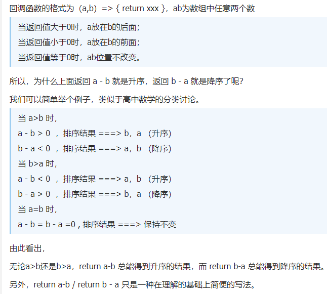

```js
// 刚开始a时第二个数，b是第一个数。之后a一直往后移一个，b为第一个
let arr2 = [80, 90, 50, 20, 77, 88]
        arr2.sort(function (a, b) {
            // return a-b //从小到大
            return b - a //从大到小
        })
     //不添加回调函数的话，会默认按照首字母排序，一样的字母多的在前面（字符串添加回调加参数a，b无无法按大小排序）
    let arr3 = ['bor', 'parr', 'po', 'as', 'ds']
        arr3.sort()//['as', 'bor', 'ds', 'parr', 'po']
```
5. `arr.indexOf(item, start)`方法可以返回数组中某个指定的元素位置
   该方法将从头到尾地检索数组，看它是否含有对应的元素。开始检索的位置在数组 start 处或数组的开头（没有指定 start 参数时）。如果找到一个 item，则返回 item 的第一次出现的位置。开始位置的索引为 0。没有找到，返回-1

   ```js
   // item 必须，查找的元素
   // start 可选的整数参数，规定在数组中开始检索的位置。它的合法取值是 0 到 stringObject.length - 1。如省略该参数，则将从字符串的首字符开始检索
   
   let fruits=["Banana","Orange","Apple","Mango","Banana","Orange","Apple"];
   let a = fruits.indexOf("Apple",4);
   
   console.log(a)// 6
   ```

6. `arr.includes()`includes() 方法用来判断一个数组是否包含一个指定的值，如果是返回 true，否则false
   参数：
   searchElement：必须。需要查找的元素值
   fromIndex：可选。从该索引处开始查找 searchElement。如果为负值，则按升序从 array.length + fromIndex 的索引（计算出来小于零，整个数组被检索）开始搜索。默认为 0。

   ```js
   [1, 2, 3].includes(2);     // true
   [1, 2, 3].includes(4);     // false
   [1, 2, 3].includes(3, 3);  // false
   [1, 2, 3].includes(3, -1); // true
   [1, 2, NaN].includes(NaN); // true
   ```

## 2.2. 字符串对象api

字符串类似于数组，也有长度和下标
```js
let str = '我的大中国我爱你么么哒'
        console.log( str.length )//11
        console.log( str[5] )//我
```
1. `str.indexOf('字符串') `  获取 ‘字符串’ 在str中的首字母下标（注意还是判断整个字符串，并不是判断单个，和正则的原义文本匹配一样）（也支持数组，数组也有这个方法）
	返回值：如果字符串存在则返回首字母下标， 如果字符串不存在则返回固定值 -1
	应用场景：一般用户判断 str中是否有某个字符串  如果没有则返回-1,不是-1说明有
```js
		let index1 = str.indexOf('大中国')
        console.log( index1 )//7
        let index2 = str.indexOf('大中心')
        console.log( index2 )//-1
```
2. `str.split('分隔符')`   用分隔符切割字符串
    返回值：得到返回之后的数组
    应用场景 : 一般用户解析 网址
    split('')空字符串，每一个字符分开放在数组中
```js
		let url = 'http://www.baidu.com?name=张三&age=20'
        console.log( url.split('|') )//['http://www.baidu.com?name=张三&age=20']
        console.log( url.split('?') )//['http://www.baidu.com', 'name=张三&age=20']
        console.log( url.split('=') )//['http://www.baidu.com?name', '张三&age', '20']
```
3. `str.substr(起始下标,截取长度)`截取字符串（获取子串推荐使用slice方法）
    返回值：返回截取后的新字符串（已经废弃掉，已经被划了斜线）
    应用场景 ： 一般后台返回的数据 不会和前端完全匹配。 有时候需要自己截取一部分（例如： 商品价格后台返回 :价格58元  但是前端只需要显示58元，就需要截取）
  * start：必需。要抽取的子串的起始下标。必须是数值。如果是负数，那么该参数声明从字符串的尾部开始算起的位置。也就是说，-1 指字符串中最后一个字符，-2 指倒数第二个字符，以此类推
  * length：可选。子串中的字符数。必须是数值。如果省略了该参数，那么返回从 stringObject 的开始位置到结尾的字串
```js
console.log( str.substr(2,5) )//从2下标开始，往后截取5个字 大中国我爱
```
4. `str.substring(from, to)`用于提取字符串介于两个指定下标之间的字符（用法同slice，推荐使用）
     参数：
     * from：必需。一个非负的整数，规定要提取的子串的第一个字符在 string Object 中的位置
     * to：可选。一个非负的整数，比要提取的子串的最后一个字符在 string Object 中的位置多 1。如果省略该参数，那么返回的子串会一直到字符串的结尾。
```js
console.log(str.substring(2.5))// 从下标2开始，到下标4结束
console.log('今天天气真不错'.substring(2,5))// 天气真
```

5. `str.slice(起始下标start,结束下标end)`和substr作用一样，截取字符串（获取子串推荐使用slice方法）也可以用来截取数组
    参数：（正数就是下标，负数就表示倒数第几个）
  * start：可选。规定从何处开始选取。如果该参数为负数，则表示从原数组中的倒数第几个元素开始提取，slice(-2) 表示提取原数组中的倒数第二个元素到最后一个元素（包含最后一个元素）
  * end：可选。规定从何处结束选取。该参数是数组片断结束处的数组下标。如果没有指定该参数，那么切分的数组包含从 start 到数组结束的所有元素。如果该参数为负数， 则它表示在原数组中的倒数第几个元素结束抽取。 slice(-2,-1) 表示抽取了原数组中的倒数第二个元素到最后一个元素（不包含最后一个元素，也就是只有倒数第二个元素）。
    返回值：返回一个子字符串
```js
let str = '我的大中国我爱你么么哒'
	console.log(str.slice(1，3)) //的大（包含下标1，不包含下标3）
	console.log(str.slice(-3))//么么哒（从倒数第三个到最后一个元素，包含最后一个元素）
	console.log(str.slice(-3, -1)) //么么（包含倒数第一个，不包含倒数第一个）
```


6. `str.toLocaleLowerCase()`、`str.toLocaleUpperCase()`大小写转换（中文没有大小写）
    应用场景： 字母验证码不区分大小写 （一般无论你输入什么，都会转成大写或小写保持格式统一）
```js
		console.log('dsSFJSGDJHsdfs'.toLocaleLowerCase()) //小写 dssfjsgdjhsdfs
        console.log('dsSFJSGDJHsdfs'.toLocaleUpperCase()) //大写 DSSFJSGDJHSDFS
```
7. `str.startswith(searchvalue，start)`用于检测字符串是否以指定的子字符串开始（区分大小写）
   返回结果：布尔值

   参数：

   * searchvalue：待查询的子字符串
   * start：可选，查找的开始位置，默认为 0
8. `str.endswith(searchvalue,length)`用来判断当前字符串是否是以指定的子字符串结尾的（区分大小写）数组也有这个方法
   返回值：布尔值
   参数：

   * searchvalue：要搜索的子字符串
   * length：设置字符串的长度（取字符串的前几位）。默认值为原始字符串长度 string.length

9. `str.includes()`用于判断字符串是否包含指定的子字符串，如果找到匹配的字符串则返回 true，否则返回 false， includes() 方法区分大小写

   参数

   * searchvalue：必需，要查找的字符串
   * start：可选，设置从那个位置开始查找，默认为 0

# ==3. 原型对象==

## 3.1. 工厂函数

需要创建很多个对象 （姓名、年龄、性别）

工厂（作用）函数（数据类型），比如求和函数用来求和

```js
// 工厂函数 :  用于创建对象的函数
        function createPerson(name,age,sex){
            //1.创建对象
            let p = {}
            //2.给对象赋值
            p.name = name
            p.age = age
            p.sex = sex
            //3. 返回对象
            return p
        }
		let p1 = createPerson('张三',20,'男')
        let p2 = createPerson('李四',22,'女')
        console.log(p1,p2)
```

## ==2.2. 构造函数new原理==

构造函数 :  **使用new调用一个函数**，一定不要忘记了关键字new

构造函数作用与工厂函数一致，都是用来创建对象的。但是代码更加简洁。

==new工作原理==：

1. 创建空对象

2. this指向这个对象

3. 对象赋值（实际构造函数只有这块需要我们去写）

4. 返回这个对象

**注意点**：

1. 构造函数首字母一般大写,，为了提醒调用者不要忘记new关键字

2. 如果在构造函数内部 手动return

​                return 值类型  ： 无效,还是返回new创建的对象

​                return 引用类型  ： 有效，会覆盖new创建的对象

```js
function Person(name,age,sex){
            //(1)创建空对象   {}
            //(2)this指向这个对象  this = {}
            //(3)对象赋值
            this.name = name
            this.age = age
            this.sex = sex
            //(4)返回这个对象 return this
        }

        let p1 = new Person('张三',20,'男')
        console.log(p1)
```

## 2.3. 原型对象
### 2.3.1. 原型对象由来

1. 构造函数内部存在方法，创建多个实例对象时，会创建多个堆空间，出现内存浪费

  思考: p1和p2都有eat方法,而是函数体相同。但是他们是同一个函数吗？

  答案：不是同一个： 因为每一次调用构造函数， 内部都会执行一次function,就会在堆中开辟一个新的空间。虽然代码是一样的，但是地址不同。 就会导致每调用一次构造函数，多出一个函数堆空间。导致内存资源浪费
```js
   function Person(name,age){
             this.name = name
             this.age = age
             this.eat = function(){
                 console.log('eat');
             }
         }
         let p1 = new Person('张三',18)
         let p2 = new Person('李四',20)
         console.log( p1,p2)
```

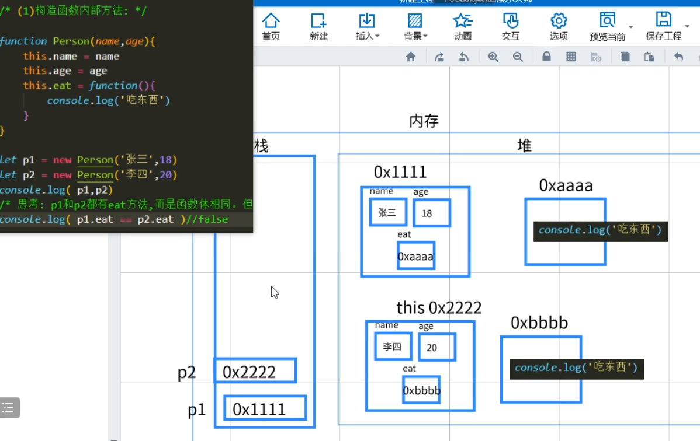

2. 第一步中的构造函数可以使用全局函数来代替。解决了内存浪费的问题，但是又导致了新的问题：全局变量污染

   思考题：p1的eat和p2是不是同一个

   答案：是的  因为构造函数内部并没有重新function创建一个函数，而是拷贝eat的地址赋值。 无论你调用构造函数多少次，都是拷贝eat的地址

```js
let eat = function() {
           console.log("吃东西")
         }
         let learn = function() {
           console.log("学习")
         }
         function Person(name, age) {
           this.name = name
           this.age = age
           this.eat = eat
           this.learn = learn
         }
         let p1 = new Person("张三", 18)
         let p2 = new Person("李四", 20)
         console.log(p1, p2)
```

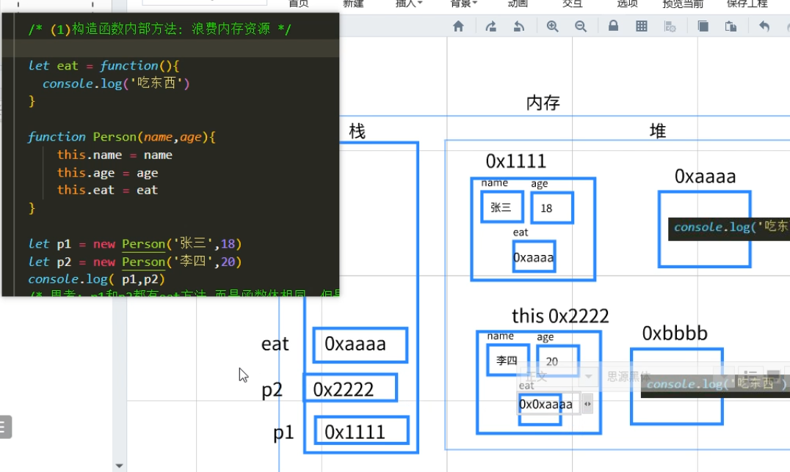

3. 使用对象将多个方法存在一个对象中（块级）， 解决内存浪费 + 变量污染，但是这个对象它本身又成为了一个污染
```js
let obj = {
        eat: function() {
          console.log("吃东西")
        },
        learn: function() {
          console.log("学习")
        }
      }
      function Person(name, age) {
        this.name = name
        this.age = age
        this.eat = obj.eat
        this.learn = obj.learn
      }
      let p1 = new Person("张三", 18)
      let p2 = new Person("李四", 20)
      console.log(p1, p2)
```
4. 这时就诞生了原型对象，任何函数在声明的时候，系统会自动帮你创建一个对象，称之为原型对象，这个对象属于构造函数的成员，不会造成变量污染和内存浪费，nice！

### 2.2.2. 原型对象介绍

原型：任何构造函数在被创建的时候，系统都会自动帮我们创建一个与之对应的对象（由内置构造函数Object构建），称之为**原型对象**

同时解决内存浪费与全局变量污染的问题

谁可以访问原型对象中的成员(属性和方法)

* 构造函数自身：`构造函数名.prototype`

* 构造函数实例化的每一个对象：点语法直接访问

  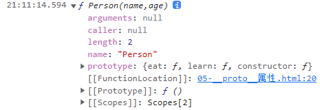
```js
	  //构造函数
      function Person(name, age) {
        this.name = name
        this.age = age
      }
      //原型对象
      console.log(Person.prototype)
      Person.prototype = {
        eat: function() {
          console.log("吃东西")
        },
        learn: function() {
          console.log("学习")
        }
      }
      //实例对象 : 用new调用构造函数，返回的那个对象(new创建的那个对象)
      let p1 = new Person('张三',20)
      console.log( p1 )
      let p2 = new Person('李四',22)
      console.log( p1.eat == p2.eat )//true
```
疑点：这个构造函数自带的这个[[prototype]]是什么？

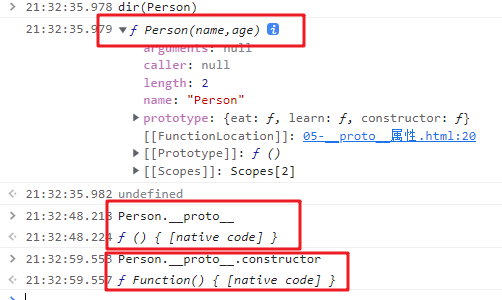

回答：你的爸爸妈妈也有自己的爸爸妈妈，这里的构造函数也是一个（实例）对象（是由别的构造函数创建的）。但是作用不大。只有new的才叫做实例对象，一般是实例对象来调用原型里的方法

注意：空对象没有自己的原型

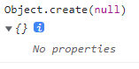

## 2.4. __proto__属性

MDN传送门：[https://developer.mozilla.org/zh-CN/docs/Web/JavaScript/Reference/Global_Objects/Object/proto](https://developer.mozilla.org/zh-CN/docs/Web/JavaScript/Reference/Global_Objects/Object/proto)

`__proto__`属于实例对象的,指向原型对象

​        注意： 这个属性不是web标准，很多浏览器不会显示的。 这个属性在开发中不能使用，只能用于学习研究

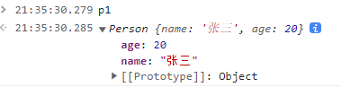

## 2.5. constructor属性

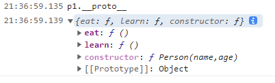

`constructor` : 属于原型对象，指向构造函数

## 2.6. 原型对象相关三个属性的关系

验证 构造函数、原型对象、实例对象三者关系 

```js
 console.log( p1.__proto__.constructor )//Person
 console.log( Person.prototype === p1.__proto__ )//true
```

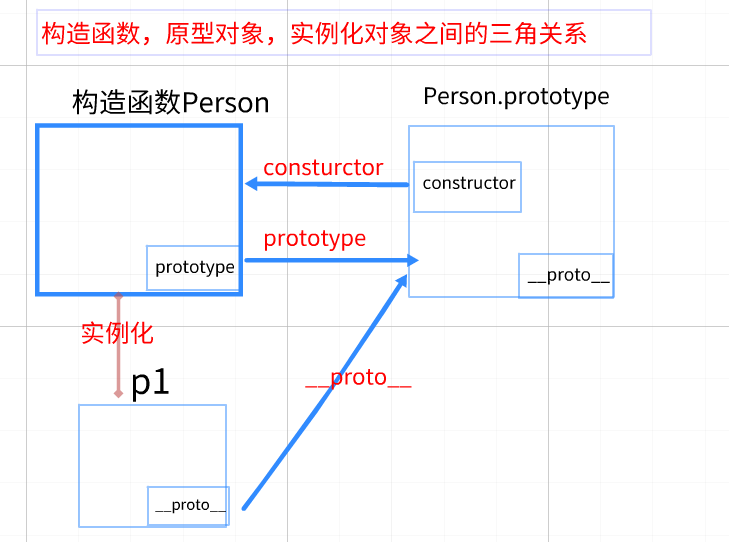

> 注意点：
>
> * 往原型添加属性方法，最好使用构造函数来添加`构造函数名.prototype.eat=function(){}`直接使用对象的点语法添加，注意不要加let
> * 调用原型里面的方法，使用原型对象来访问（先new一个p1）`p1.eat()//p1.__proto__.eat()`

## 2.7. 静态成员与实例对象

对象里的属性和方法统一叫做成员

静态成员： 由构造函数直接调用的属性、方法叫静态成员

实例成员：  由构造函数创建出来的实例对象才能调用的属性和方法就叫实例成员

```js
		let p1 = new Person('张三',20)
       console.log( p1.name )//实例成员
       console.log( p1.age )//实例成员

       console.log( Person.prototype )//静态成员
       console.log( Math.PI ) //静态成员
```

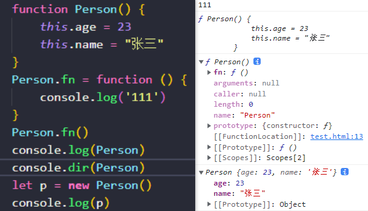

`fn`、`prototype`是Person的静态成员，`__proto__`是实例成员

> 静态成员只能函数（函数也是对象，也可以存方法，需要用console.dir来查看）来调用，没用this.xx来赋值，实例成员调用不了（只能调用原型对象的成员）

## 2.8. Object的values方法

```js
/* 需求：获取对象所有的属性值 */
        let person = {
            name: '张三',
            age: 20,
            sex: '男'
        }

        //1 以前的写法：  for-in 循环
        for (let key in person) {
            console.log(person[key])
        }

        //2.静态方法  Object.values(对象名)
        //返回值是一个数组,会存储对象每一个属性值
        let arr = Object.values(person)
        console.log(arr)
        let keyArr = Object.keys(person)
        console.log(keyArr)
```

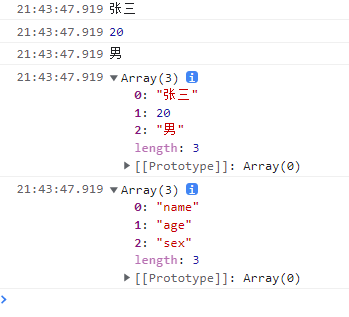

# 4. 总结

1. 面向对象 ： 是注重结果思维方式
	* 面向过程 ： 注重过程
	* 面向对象：注重结果
2. 面向对象 与 面向过程 之间关系
	* 面向对象本质是 面向过程封装
3. 内置对象api : js作者写好的对象，直接使用即可
	* 数组 ： sort() 、reverse()
	* 字符串：indexOf()、split()
4. new工作原理`
	* (1)创建空对象
	* (2)this指向对象
	* (3)对象赋值
	* (4)返回这个对象

## 1.2-原型对象

1. 什么是原型？
	* 任何构造函数在被创建的时候，系统都会自动帮我们创建一个与之对应的对象，称之为原型对象
2. 如何访问原型对象
	* 构造函数名.prototype
3. 哪些对象可以访问原型？
	* a.构造函数自身
	* b.该原型对应的构造函数实例化出来的对象
4. proto属性介绍
	* 属于对象，指向实例化这个对象的构造函数对应的原型
	* **proto**属性不是W3C的标准属性，所以实际开发中一般不会使用它来访问原型
6. constructor属性介绍
	* 属于原型对象，指向这个原型对应的构造函数
	* 作用:可以得知某个实例对象，到底是由哪一个构造函数生成的


## 1.3-js基础语法复习（课后了解）

1. 数据类型
	* 基本数据类型：number、string、boolean、undefined、null
	* 复杂数据类型：object（包含三种子数据类型）
	* 无序存储对象object: `{}`
	* 有序存储数组array: `[]`
	* 函数function: `function`
* 内置对象：属于object类型，是js作者提前写好的对象，里面存储了一些属性和方法，方便开发者直接使用
    * Math：数学对象
    * Date：日期对象
    * Function：函数对象
    * RegExp：正则表达式
    * Array：数组对象
    * String ：string对象
    * Boolean ：boolean对象
    * Number ：number对象
2. 值类型与引用类型
	* a.值类型（基本数据类型）:栈中存储的是数据，赋值拷贝的是数据，修改拷贝后的数据对原数据没有影响
	* b.引用类型（复杂数据类型）：栈中存储的是地址，数据存在堆中，赋值拷贝的是地址，修改拷贝后的数据对原数据有影响
3. in关键字三个作用
	* a.for-in循环遍历对象属性
	* b.判断对象能够访问某个属性
		语法： `属性名字符串` in `对象名`
	* c.判断数组是否包含某个下标
    * 语法： `下标` in `数组名`
    * 判断数组是否包含某元素，可以使用:`数组名`.indexOf(`元素`)
4. delete关键字两个作用
	* a.删除对象的属性 ： `delete` `对象名.属性名`
	* b.删除没有使用let声明的变量
5. ==与===的区别
	* a.`===`全等运算符
		严格匹配，值与数据类型必须要同时相等
	* b.`==`相等运算符
		不严格匹配，当左右两边数据类型不一致的时候允许数据类型转换，分为五种情况（x == y）
		（1）当x与y都为null或者undefined, 返回true
		（2）当x或y为NaN,返回false
		（3）当x或y都为：string，number，boolean。且数据类型不一致的时候，此时会隐式转换成number后比较
		（4）如果x或y存在对象类型，则会转为原始值后比较
		（5）x与y都为对象类型，则比较它们的引用地址。如果同一个地址则为true，不同地址则为false


# 今天学习重点梳理(给同学做总结和面试用)

1. new关键字四个工作流程（必须记住）
	* 1.创建一个空对象
	* 2.this指向这个对象
	* 3.对象赋值
	* 4.返回这个对象
	* 主动return值类型：无效。 还是返回new创建的对象
	* 主动return引用类型：有效。 会覆盖new创建的对象	
2. 构造函数、原型对象、实例对象三者关系（说的出来）
	* 构造函数有一个属性prototype，指向自己的原型对象
		prototype作用：解决构造函数 资源浪费+变量污染
	* 实例对象有一个属性\_\_proto\_\_指向自己的原型对象
		__proto__作用 ： 实例对象访问原型成员
	* 原型对象有一个属性constructor，指向自己的构造函数
		construnctor作用 ： 可以让实例对象知道自己的构造函数是谁

