# 1. 面向对象
## 1.1. 面向对象三大特征

面向对象三大特征: 封装 、 继承 、 多态
1. 封装 :  把代码放入对象的方法中
	将某个具体功能封装在对象中，只对外部暴露指定的接口，外界在使用的时候，只考虑接口怎么用，不用考虑内部怎么实现
2. **继承 :  一个对象 拥有 另一个对象 所有的成员（注意是所有的成员）**
3. 多态 :  一个对象 在不同情况下的不同状态
## 1.2. 继承的三种实现方式
### 1.2.1. 混入式继承
遍历 父对象 的所有属性值，添加给 子对象
```js
for (let key in father){
//这样相当于点语法添加成员，把右边的看成值
        father[key] = son[key]
    }
```
### 1.2.2. 原型继承（替换原型）
将父对象作为子对象构造函数的原型
```js
//父对象
        let father = {
            house:{
                address : '深圳湾一号',
                price: 20000000
            },
            car:{
                brand : '劳斯莱斯幻影',
                price:15000000
            }
        }
        //子对象
        //构造函数
        function Son(name,age){
            this.name = name
            this.age = age
        }
        //原型继承: 把父对象 作为子对象构造函数的原型
        Son.prototype = father
```
可选 : 原型继承之后，由于父对象覆盖原来的 子对象构造函数原型， 就会导致constructor消失.
解决办法： 手动添加`Son.prototype.constructor = Son`（对开发几乎没有影响，也可以不加）

实际的继承原型里的方法通常是`sun=new Son()`通常new一个空实例对象，这样sun可以给自己的原型添加方法

### 1.2.3. 混合式继承（混入加原型继承）

遍历 父对象 所有的属性值,添加给 子对象构造函数 的原型

```js
let father = {
        house:{
            address:'北京一环',
            price:100000000
        },
        car:{
            brand:'劳斯莱斯',
            price:5000000
        }
    }

    function Son (name,age  ) {
        this.name = name
        this.age = age
    }

    Son.prototype.sayHi = function(){
        console.log('你好')
    //将父对象的所有属性添加到子对象构造函数的原型中
    for(let key in father){
        Son.prototype[key] = father[key];
    }
```

## 1.3. 继承（面试）

#### 1. 构造函数继承（Call式继承）

借助call函数，继承的是属性（或者使用apply函数）

参数特别多的话就要使用apply+arguments（里面的Person）

````js
function Person(name,age){
    this.name = name
    this.age =age
}
function Star(name,age){
    /* this.name = '张三'
    this.age =23 */
    Person.call(this, name,age)// 这里后面的name和age传给了Person方法（是Star的实参，外面不传实参，直接在这里写实参也可以）
    // Person.apply(this, [name, age])
    // Person中的this指向call后面括号里的this，而括号里的this指向new Star创建的实例
}
const s =new Star()
````

> 方法不能往构造函数上面挂，存在内存的浪费，往原型对象上挂载（多个实例访问的是同一个原型对象）
>
> ```js
> // 如果是下面这种
> function Person(name,age){
>     this.name = name
>     this.age =age
>     this.say=function(){ console.log('11') }
> }
> const p1 = Person(xx,xx)
> const p2 = Person(yy,yy)
> //这样p1和p2实例上面的say方法不相同，被重新创建了一份
> 
> // 如果是下面这样，那么重新new的实例指向的say是同一个地址，性能提高
> Person.prototype.say=...
> ```
>

子类继承父类

#### 2. 原型继承

通过改造原型链去继承父类构造函数原型上的方法

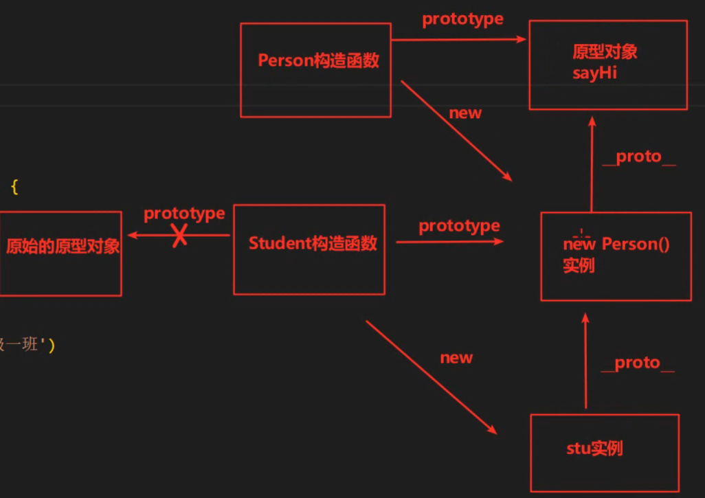

 call/apply不会访问原型，只会继承属性，实例才会访问原型上的属性或者方法

```js
function Person(name,age){
    this.name = name
    this.age =age
}
Person.prototype,say = function(){
    console.log('hello world')
}
function Star(name,age){

}

// 原型继承 => 继承的是方法
// 直接把Star的原型指向Person的实例
Star.prototype = new Person()

// 误区  不能 Star.prototype = Person.prototype
// 这样的话，Star的原型指向了Person的原型，这样给Star的原型添加方法会影响Person的原型，二者指向同一地址

// 同时这样继承了Person的实例之后，发现Star.prototype.constructor指向了Star。（实际上是p1.constructor，实例没有去找原型的，就是p1.___proto__.constructor，注意p1 = new Person()）
// 还需要
Star.prototype.constructor = Star

const zs = new Star('尼古拉斯', 30)
// 这样才能使用
Star.prototype.constructor ===Star// true
zs.constructor ===Star//true
zs.__proto__.constructor ===Star//true
```

说明：

虽然原型继承也继承了父类的属性，但是这里不会传递参数，而且子类Star构造函数可以随意给自己的prototype添加属性和方法而覆盖父类传过来的私有属性，原型继承主要继承的就是父类的方法，通过原型链找到父类的方法

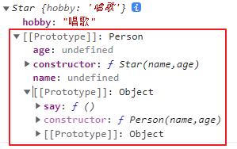

#### 3. 组合继承

属性会使用this挂载到构造函数上，方法会放在构造函数的原型上

```js
function Person(name,age){
    this.name = name
    this.age =age
}
Person.prototype.say = function(){
    console.log('hello world')
}
function Star(name,age){
Person.call(this, name, age)
}

// 原型继承 => 继承的是方法
// 直接把Star的原型指向Person的实例
Star.prototype = new Person()
Star.prototype.constructor = Star
```

#### 4. 寄生组合继承（优化原型继承）--常用

之前原型继承中把父类构造函数的静态属性也继承过来了，但是根本就不需要new的这一过程，只想继承父类构造函数的原型上的方法。

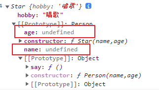、

利用`Object.create()`方法来进行优化，省去了不必要的new操作

1. `Object.create(xx)`会创建一个新对象
2. 并将这个新对象对象的`__proto__`指向传入的参数对象`xx`

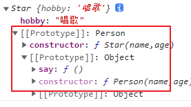

可以这样改造

```js
function Person(name,age){
    this.name = name
    this.age =age
}
Person.prototype.say = function(){
    console.log('hello world')
}
function Star(name,age){
    this.hobby='唱歌'

}

// Star.prototype = new Person()
Star.prototype = Object.create(Person.prototype)
Star.prototype.constructor = Star

const zs = new Star('尼古拉斯', 30)
```

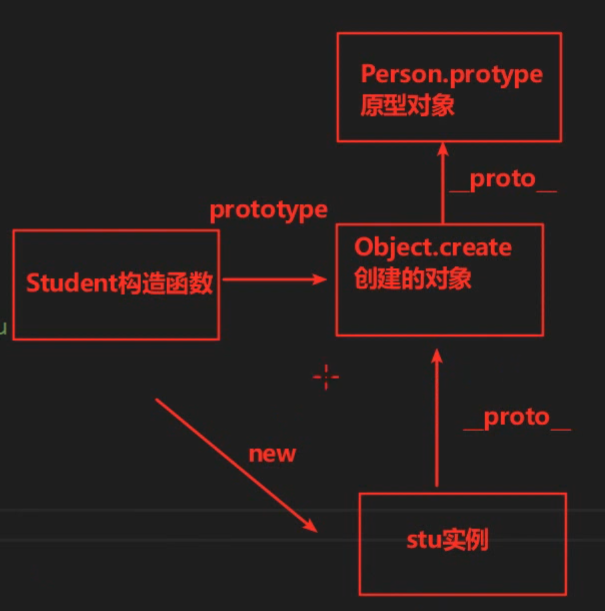

#### 5. ES6的extends继承

先介绍下class

```js
// 原来写法
/* function Person(name, age){
    this.name = name
    this.age = age
}
Person.prototype.sayhi=function(){}
Person.prototype.jump=function(){} */

// class关键字创建两个类，可以直接new
// 好处：构造函数的属性和方法比较分散，需要分开写，而class创建的类是一个整体

// 人类
// 注意person后面没有小括号
class Person{
// constructor类似于之前的构造函数
constructor(name, age){
        this.name = name
        this.age = age
    }

// 固定写法，函数之间没有逗号，不能改成function或者箭头函数
// 底层：这两个方法加在了Person的prototype上
    sayhi(){
        console.log('你好')
    }
    jump(){
        console.log('会跳')
    }
}

// 老师类
class Teacher{
    constructor(name, age, lesson){
        this.name = name
        this.age = age
        this.lesson = lesson
    }
    sayhi(){
        console.log('你好')
    }
    jump(){
        console.log('会跳')
    }
}
const p =new Person('zs', 20)
const t =new Teacher('li', 20, 'en')
console.log(p, t)
```

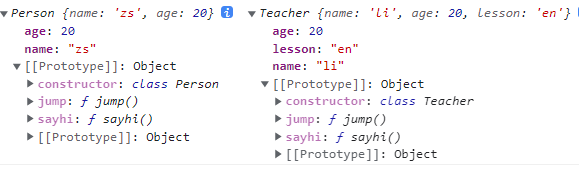

我们发现t实例和p实例出现了重复的属性和方法。借助extends和super关键字来完成继承

注意这里底层原理是寄生式组合继承

```js
class Person{
constructor(name, age){
        this.name = name
        this.age = age
    }
    sayhi(){
        console.log('你好')
    }
    jump(){
        console.log('会跳')
    }
}

class Teacher extends Person{
    // 不写constructor，默认会调用call继承父类Person的name和age属性
    teach(){
        console.log('会教书')
    }
}
const t = new Teacher()
```

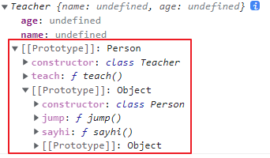

```js
// 老师类
class Teacher extends Person{
    constructor(name, age, lesson){
        // super关键字继承父类构造函数的属性（进行实例的属性初始化）
        /* 注意： 
        1.super关键字必须要有
        2.顺序不能反了，必须先继承父类（先super），在写自己的属性
        */
        super(name, age)
        this.lesson = lesson
    }
    teach(){
        console.log('会教书')
    }
}
```

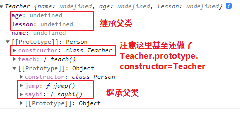

做了三件事

1. `Person.call(this, name, age)`借调父类属性
2. `Teacher.prototype = Object.create(Person.prototype)`借调父类方法
3. `Teacher.prototype.constructor = Teacher`将原型的constructor指回自身构造函数

## 1.4. 静态、私有、共有属性和方法

[https://blog.csdn.net/pinganaaa/article/details/120928279](https://blog.csdn.net/pinganaaa/article/details/120928279)

对象、实例、类（构造函数）

前端的广义的面向对象：不注重过程，只看重结果

狭义的面向对象：创建多个类，然后让类的实例去工作

构造函数的prototype是一个对象，它是Object构造函数的实例

示例：

* fnName就是Fn构造函数的静态属性
* slname就是f1实例的私有属性
* prname就是f1的公有属性

类作为构造函数，在堆内存中存储时分为了三部分:[[scope]]、函数字符串（构造函数体）、键值对（Fn.name和prototype变量，但是原型对象是一个新的对象，又开辟到了一个新的空间）

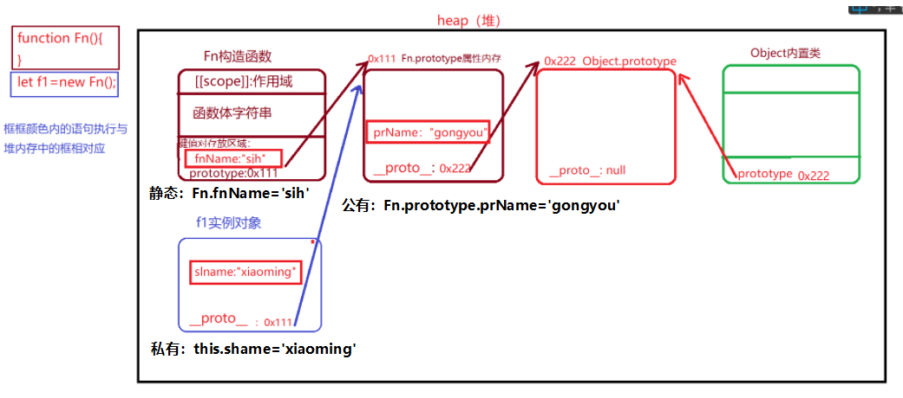

* 静态属性（方法）：`Fn.fnName`挂载到构造函数上面的，`构造函数.xxx`只能构造函数访问
* 私有（实例）属性（方法）：`this.name`-->`p1.name`new之后挂载到实例对象上面的，`实例对象.xxx`
* 公有（原型）属性（方法）：`Fn.prototype.name`挂载到构造函数原型对象上面的，`构造函数.prototype.xxx`或者`实例对象.xxx`

举例：

`arr.push()`和`Array.isArray()`的区别

* `arr.push()`是存在构造函数原型对象里面的方法
* `Array.isArray()`是存在构造函数里面的静态方法

# ==2. 原型链==

## 2.1. 原型链介绍

原型链：每一个对象都有原型，原型本身又是对象，所以原型又有原型，以此类推形成一个链式结构，称为原型链（原型链的终点是null）

对象访问原型链规则 : 就近原则。
	当访问一个对象的成员变量时，会首先访问它自身的成员变量，如果有则访问。没有则在原型中寻找，能找到就访问，不能找到则继续往原型的原型中寻找，以此类推，如果找到原型链的顶端还是找不到，则程序报错:`xxx is not a function`

说明一下报错的原因`p1.learn()`p1找不到learn方法会报undefined的错误，然后加上小括号调用函数，所以会报不是function的错误

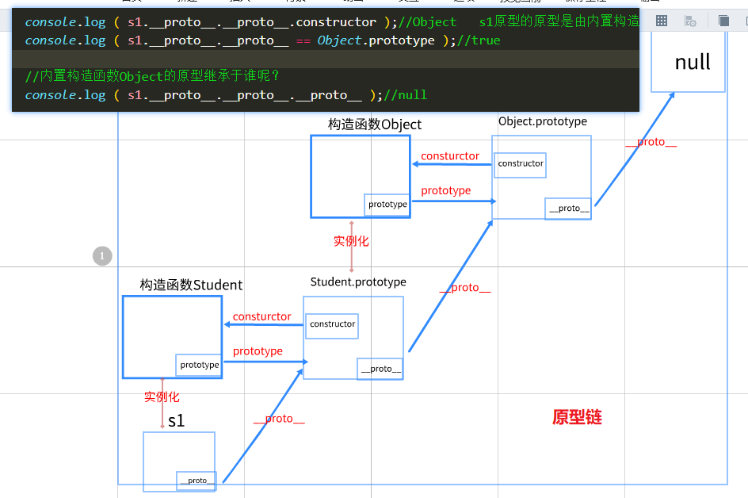

原型对象 : 常用来存储具有共同特征的数据（多个不同的-例对象可以调用）
```js
	   Person.prototype.type = '哺乳动物'
       Person.prototype.country = '中国'
       Person.prototype.eat = function(){
           console.log(this.name + '吃东西')
       }
```

`p1.toString()`p1自己没有toString, p1的原型也没有toString, 但是为什么不报错呢？

原因:  p1的原型的原型有toString

```js
	  //查看p1的原型
       console.log( p1.__proto__.constructor )//Person
       console.log( Person.prototype === p1.__proto__ )//true

       //查看p1的原型的原型
       console.log( p1.__proto__.__proto__.constructor )//Object
       console.log( Object.prototype === p1.__proto__.__proto__ )//true

       //查看p1的原型的原型的原型
       console.log( p1.__proto__.__proto__.__proto__ )//null
```

> 注意点：
>
> * 所有的对象的原型都最终指向内置构造函数Object的原型对象，再最终指向null
> * 构造函数本身也是一个对象，也是由构造函数创建的，也有自己的原型链（作用不大，仅作了解）
> * 只要是对象就有原型，原型对象是由内置构造函数Object创建的

**思考题：为什么arr.toString()方法和对象的toString()方法得到的结果不同**

回答：数组的原型含有tostring方法用来转换成字符串，对象的toString方法是Objec的原型里面的方法，是专门用来监测数据类型的

## 2.2. 内置对象的原型链

> js有几个特殊的对象 无法使用 log来打印的，需要用dir来打印: function date dom对象

String、Array、Date都是构造函数，使用new可以能够创建实例对象

Array的原型链

```js
//1.Array
    let arr = new Array(10,20,30);
    console.log ( arr );

    //查看arr的原型
    console.log ( arr.__proto__.constructor );//Array
    console.log ( arr.__proto__ === Array.prototype );

    //查看arr的原型的原型
    console.log ( arr.__proto__.__proto__.constructor );//Object
    console.log ( arr.__proto__.__proto__ === Object.prototype );//true
```

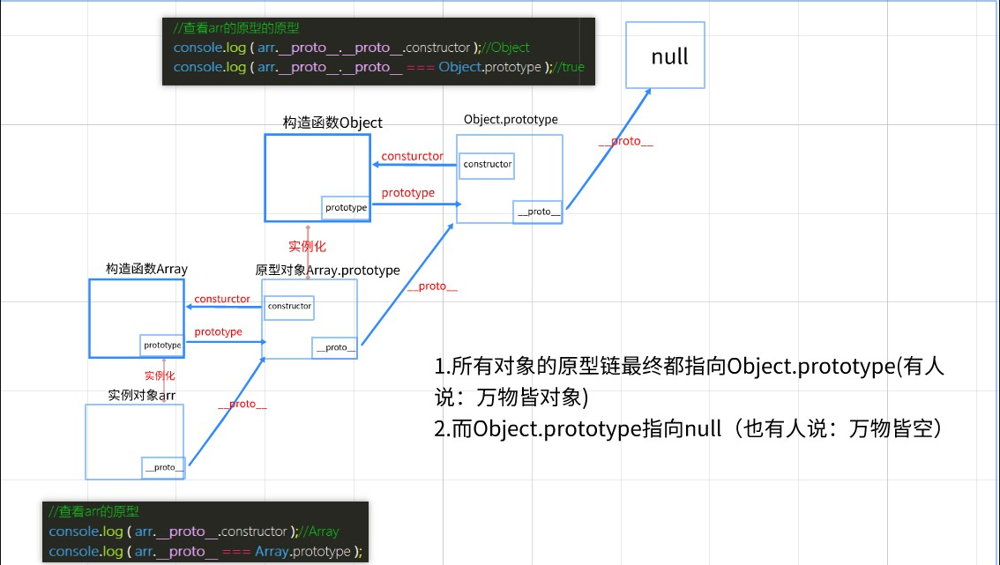

数组[10,20]、字符串'how are you'、数字12、函数function(){}、对象{name:'张三'}都是能够直接写的实例对象，`new Array(10,20)===[10,20]`

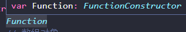

## 2.3. dom对象的原型链

dom对象也是有原型链的。对象分为ECMA对象、dom对象、bom对象，我们平时写的都是ECMA对象

a标签有默认样式只能找到它自身来修改的原因：a标签的默认样式在它自己的属性里，而它的父级的样式都在它的原型里，无法继承，就近原则访问。

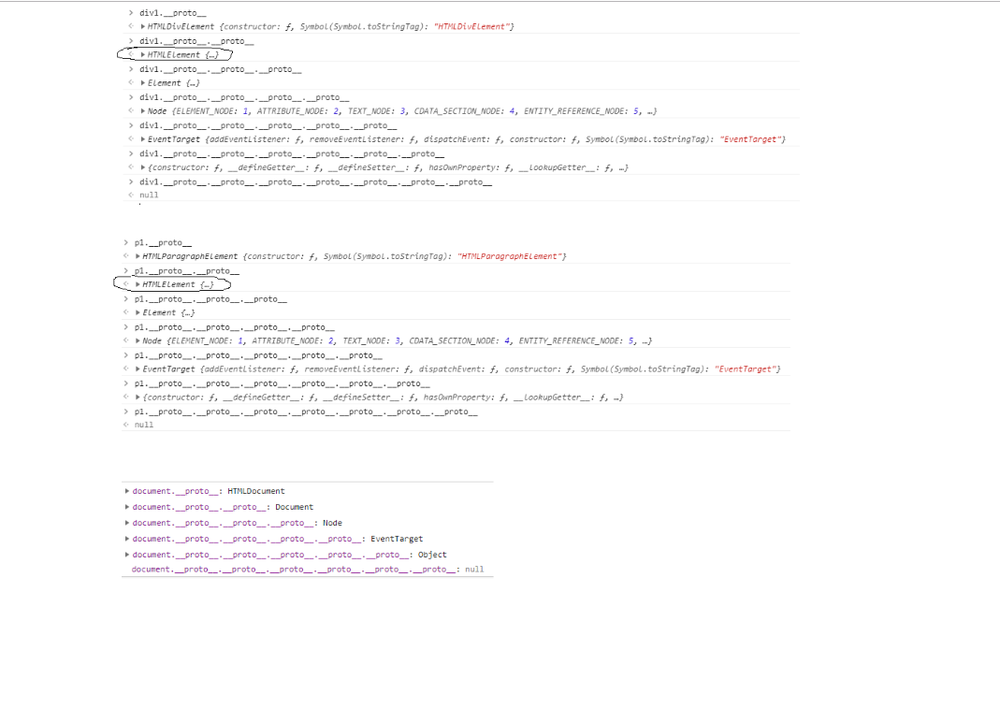

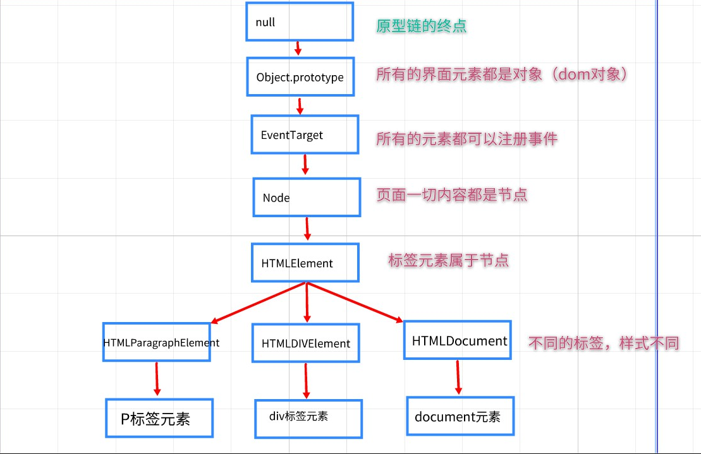

## 2.4. instanceOf运算符

`instanceof(关键字)`: 运算符。用于检测 构造函数的prototype在不在实例对象的原型链中。如`arr instanceof *Array*`**检测arr是不是Array的实例**，通俗的说，检测arr是不是数组（这样说也不准确）

> instanceof判断左边的能不能通过原型链找到右边的prototype，看一下在不在同一条原型链，也不能准确地找到是什么类型，arr instanceof Object 为true
>
> ```js
> const arr = []
> const obj = {}
> console.log(arr instanceof Object)
> console.log(arr.__proto__.__proto__ === Object.prototype)
> 
> console.log(obj instanceof Object)
> console.log(obj.__proto__.__proto__ === Object.prototype)
> ```

应用 :  某些函数为了限制你的数据类型,在内部需要用instanceof进行判断是否是正确的数据类型

```js
//arr-> Array.prototype -> Object.prototype -> null
        console.log( arr instanceof Array )//true
        console.log( arr instanceof Object )//true
        console.log( arr instanceof String )//false
```

封装一个函数，要求这个函数必须要传数组类型、 传其他类型不可以

```js
function fn(arr){
            if( arr instanceof Array){
                console.log( arr.reverse() )
            }else{
                console.log('数据类型错误')
            }
        }

        fn( [10,20,30] )
        fn( 'abc' )
```

# 3. 案例补充(封装一个模态框)

知识点一：

给新增元素注册事件，可以选择事件委托，或者直接在新增元素的下面注册事件，div.qs...表示只能找到该指定div下面的元素，在函数里注册事件。只有调用了函数，事件才有触发的可能。
```js
div.querySelector('.header i').onclick = function(){
          document.body.removeChild(div)
        }
```

> 另外在事件里面注册事件，只有外面事件触发了（也是一个函数触发了）里面的事件才有可能触发

知识点二：

为什么要继承： confirm确认框和 modal模态框 功能是一样的， 也要显示到页面，也要点击xx移除
1. 继承 :  一个对象 继承 另一个对象 所有的成员
2. 原型继承 :  把父对象 作为 子对象构造函数的原型，经常使用的是继承一个空实例对象`Confirm.prototype = new Modal()`，这样给自己Confirm构造函数的原型添加新方法的时候只是在空实例对象中添加方法，不影响原构造函数。所以不能`Confirm.prototype = Modal.prototype`

知识点三：

消息框和确认框是属于两个不同的功能模块，需要创建两个实例对象

知识点四：

把函数当做实参传递到函数时，函数当做值来看，可以直接在函数里调用该回调函数

知识点五：
一般是给构造函数的原型添加方法`Modal.prototype.open = function () {}`，然后实例对象直接点语法调用`c.open()`谁调用函数里面的this就指向谁

```js
   //1. 模态框构造函数
    function Modal(title, message) {
      this.title = title
      this.message = message
      this.modalBox = `<div class="modal">
        <div class="header">${this.title} <i>x</i></div>
        <div class="body">${this.message}</div>
        </div>`
    }

    //2. 模态框原型
    Modal.prototype.open = function () {
      //(1)创建空标签
      let div = document.createElement('div')
      //(2)设置标签内容
      console.log(this)
      div.innerHTML = this.modalBox
      //(3)添加到页面
      document.body.appendChild(div)
      //给删除按钮注册点击事件
      div.querySelector('.header i').onclick = function () {
        document.body.removeChild(div)
      }
    }
```
```js
 //1.确认框构造函数
    function Confirm(title, message) {
      this.title = title
      this.message = message
      this.modalBox = ` <div class="modal">
        <div class="header">${this.title} <i>x</i></div>
        <div class="body">${this.message}</div>
        <div class="footer">
          <a href="javascript:;" class="cancel">取消</a>
          <a href="javascript:;" class="submit">确认</a>
        </div>
        </div>`
    }
    
    //继承Modal的open方法
    Confirm.prototype = new Modal()

    //继续给Confirm的原型添加自己的方法
    Confirm.prototype.addEvent = function (confirm) {
      let modal = document.querySelector('.modal')
      modal.querySelector('.submit').onclick = function () {
        //调用函数
        confirm()
        //移除模态框
        modal.parentNode.removeChild(modal)
      }
      modal.querySelector('.cancel').onclick = function () {
        //移除模态框
        modal.parentNode.removeChild(modal)
      }
    }

```
```js
//弹窗1
    document.querySelector('#btn1').onclick = function () {
      //创建模态框
      let m = new Modal('友情提示', '删除成功')
      m.open()
      console.log(m)
    }
//弹窗4
    document.querySelector('#btn4').onclick = function () {
      //创建确认框
      let c = new Confirm('友情提示', '您确定要下单吗?')
      c.open()
      //添加确认功能
      c.addEvent(function () {
        alert('下单成功')
      })
    }
```


# 4. 函数补充

## 4.1. arguments关键字

arguments关键字：获取函数所有的 实参（**只能在函数内部使用**）是一个**伪数组** :  有数组三要素(元素、下标、长度)，但是不能使用数组的方法

应用：一般用户参数数量不限的函数。`arr.push()`  `Math.max()`  这些函数实参数量不限，底层原理就是使用arguments来接收所有的实参

```js
 function fn(a,b){
            console.log(a)
            console.log(b)
            console.log(a+b)
            console.log(arguments)
     fn()
     fn(10)
```

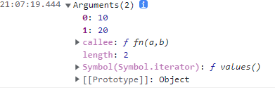

```js
//伪数组
let weiArr={
    0:1
    1:3
    length:2
}
```

伪数组 本质是 :  对象

箭头函数没有arguments，使用ES6的展开运算符获取所有的实参

```js
const fn = (...args)=>{}
// args是一个数组，就是实参的集合
```

## 4.2. 剩余rest参数

获取函数剩余的所有实参，**是一个真数组**，并且**只能写在函数最后形参位置**（语法就是三个点加一个变量）

rest参数可以替代arguments

arguments是老语法，浏览器兼容性好
rest参数：新语法，有些老的浏览器不支持

```js
function fn(a,b,...c){
            console.log(arguments)//获取所有实参 10 20 30 40 伪数组
            console.log(a,b)//10 20
            console.log(c)//[30,40] 获取剩余参数 真数组
         }

// 箭头函数的使用展开运算符获取所有实参
function fn(...b){
            console.log(b)//[10,20,30,40]
}
```

## 4.3. 函数默认参数

函数默认参数 `function 函数名(形参=默认值){  }`

```js
function fn(a=10,b=20){
            //以前： 逻辑或短路
            // 找真 : 左边是真就返回左边式子的值，否则返回右边式子的值
            // a = a || 10
            // b = b || 20
            console.log( a + b ) 
        }
        fn(5)
```