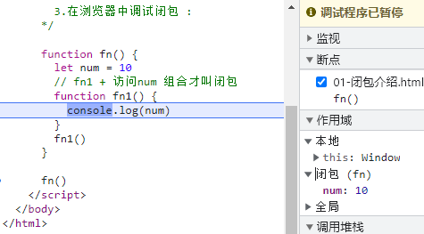

# 1. this的三种指向（面试点）

函数可以在不同的运行环境执行，所以需要有一种机制，能够在函数体内部获得当前的运行环境（context）。所以，`this`就出现了，它的设计目的就是在函数体内部，指代函数当前的运行环境（全局里，对象里）

环境对象this，谁调用我，我就指向谁。this指向跟声明没有关系。取决于函数是如何调用的（这三种执行模式this无法动态修改，只能通过上下文调用来修改this指向）

* 普通函数；  `函数名()`          this指向window

* 对象方法:   `对象名.方法名()`   this指向对象

* 构造函数；  `new 函数名()`      this指向new创建实例对象

有个注意点，就是new的时候，如果构造函数写了return，返回的是值类型，那么返回的仍然是这个实例对象，如果构造函数内部return的是引用类型，那么返回的是写的这个引用类型（数组或对象），this还是指向的那个实例对象
```js
function fn() {
            console.log(this)
        }

        //1.普通函数 : window
        fn()
        //3.构造函数 : new创建实例对象
        new fn()

        let obj = {
            name: '张三',
            eat: fn
        }
        //2.对象方法 : obj对象
        obj.eat()
```

> 小技巧：没点没new是window, 有new是实例,有点是点左边的对象

示例
```js
//作用域链
      let obj = {
        name: "张三",
        eat: function() {
          //1级链
          console.log(this) //1.obj
          function fn() {
            //2级链
            console.log(this) //2.window
          }
          fn()
        }
      }
      let eat = obj.eat
      obj.eat()
```
# 2.函数调用的上下文（局部作用域）模式

上下文也叫不同运行环境

函数上下文三个方法：`call()` `apply()` `bind()`,它们定义在Function构造函数的原型中。就仅仅是函数调用方法的一种形式

默认情况下,函数内部的this不能主动修改. 如果需要修改，则需要使用上下文方式。上下文调用就是调用别人的方法（注意这里并不是继承，继承是继承所有的成员）（不用清楚原理）

使用call或者apply， 你可以只写一次这个方法然后在另一个对象中继承（其实是类似继承）它，而不用在新对象中重复写该方法。

## 2.1. call()调用函数
call()语法： `函数名.call(this修改后的指向，arg1,arg2…………)`
```js
function fn(a,b){
            console.log( a + b )
            console.log( this )
        }

        // 函数名.call(修改后的this)
        fn.call({name:'张三'},10,20)
```

fn.call(obj, 1,2)意思就是调用fn函数，并把fn内部的this指向obj，后面的1和2位fn的实参传进去

fn.call(obj, [1, 2])就是把数组拆开成1和2粉笔赋值给fn中的形参a和b--打散（比call多的用法）

## 2.2. call()应用场景

### 2.2.1. 伪数组转真数组

1. slice可以查询数组，默认情况下不传参这个方法会得到数组本身

2. 但是伪数组由于原型不是Array，所以无法调用slice

3. slice方法存储在哪里？ ： Array.prototype

```js
 let weiArr = {
            0:88,
            1:20,
            2:50,
            3:60,
            length:4
        }
 weiArr = Array.prototype.slice.call(weiArr)
        console.log(weiArr)
```

`obj1.方法.call(obj2)`**就是把obj1.方法中的this指向了obj2**

实际开发中伪数组转真数组会用到ES6的新语法`let arr = Array.from(weiArr)`

### 2.2.2. 万能数据类型检测

typeof 数据 : 有两种数据类型无法检测。null和数组无法检测，结果都是 'object'

解决方案：万能数据类型检测`Object.prototype.toString.call(数据)`返回固定格式字符串 `[object 数据类型]`

Object是构造函数访问原型用`Object.prototype`，实例对象直接点语法访问方法即可

```js
	    console.log( typeof str )//'string'
        console.log( typeof num )//'number'
        console.log( typeof bol )//'boolean'
        console.log( typeof und )//'undefined'
        console.log( typeof nul )//'object'
        console.log( typeof arr )//'object'
        console.log( typeof fn )//'function'
        console.log( typeof obj )//'object'

		console.log( Object.prototype.toString.call( str ) )//[object String]
        console.log( Object.prototype.toString.call( num ) )//[object Number]
        console.log( Object.prototype.toString.call( bol ) )//[object Boolean]
        console.log( Object.prototype.toString.call( und ) )//[object Undefined]
        console.log( Object.prototype.toString.call( nul ) )//[object Null]
        console.log( Object.prototype.toString.call( arr ) )//[object Array]
        console.log( Object.prototype.toString.call( fn ) )//[object Function]
        console.log( Object.prototype.toString.call( obj ) )//[object Object]
```

## 2.3. apply()调用函数

apply()语法：`函数名.apply(this修改之后的指向,伪数组或者数组)`适用于函数原本形参 >= 2

apply会自动帮你遍历数组，然后按照顺序逐一传参

```js
// 函数名.call(修改后的this,形参1,形参2…………)
        fn.call({name:'张三'},10,20)

        fn.apply({name:'李四'}, [30,40] )
```

## 2.4. apply()应用场景

### 2.4.1. 伪数组转真数组

```js
let obj = {
            0:20,
            1:66,
            2:88,
            3:90,
            length:4
        }  
        
        //伪数组转真数组
        let arr = []
        // arr.push( obj[0],obj[1],obj[2],obj[3])
        //借助 apply自动遍历数组/伪数组 逐一传参特点
        //这里不需要修改this,只是借助apply传参的特点. this指向原来是谁，还是设置谁
        arr.push.apply( arr,obj )
```

实际使用还是使用`Array.from()`

### 2.4.2. 求数组最大值

```js
 		//Math.max()
        // let max1 = Math.max(arr[0],arr[1],arr[2],arr[3],arr[4])
        //这里使用apply只是借助传参特点，this指向不用修改。还是原来的this
        let max1 = Math.max.apply(Math,arr)
        //ES6求最大值   ...作用和apply类似，也会自动遍历数组，然后逐一传参
        let max2 = Math.max(...arr1,...arr2)
```

展开运算符可以取代apply注意传参的作用，以后不用apply

### 2.4.3. 打散数据

apply比call多一项功能——先打散数组为单个值，再分别传给函数实参

```js
function fn(a, b, c){
    // xx
}
fn.apply(window, [1, 2, 3])
// 1 2 3 会分别传给a b c

// 另外，分散打印，并且不改变this指向
console.log.apply(console, [1, 3, 5])
```

## 2.5. bind()调用函数

bind()语法：`函数名.bind(this修改后的指向)`如果bind的时候传参，则参数也会绑定。之后无法传递实参的，通常不传参数

**bind()语法并不会立即执行函数，而是返回一个修改指向后的新函数，常用于回调函数**

bind一般用于修改: 定时器函数（this指向永远指向window，箭头函数没有this）、事件处理函数

```js
function fn(a,b,c){
    
}

let newFn = fn.bind({name:'王五'})

// newFn(2) 和 bind 后面的传的参数，可以叠加
newFn(2)
// 则 a={name:'王五'}，b=2，如果bind后面传递的参数够了那么newFn里面的参数无效了
```

## 2.6. bind()应用场景

修改定时器中的this指向

```js
setTimeout(function() {
          console.log(this)
        }.bind({ name: "1111" }),2000)
```

任何写匿名函数的地方都可以写具名函数（为了避免变量污染），`let fn=function(){}`常用于回调函数，对象的方法

## 2.7. call()、apply()、bind()的区别

* 相同点 : 作用一致，修改函数this指向

* 不同点 :  

​                传参方式不同 : call是按照顺序传参，apply是数组/伪数组传参

​                执行机制不同 : call和apply会立即执行函数，而bind不会立即执行而是得到修改this的新函数

# 3. 闭包（面试点）

传送门：https://developer.mozilla.org/zh-CN/docs/Web/JavaScript/Closures

闭包常用来解决**全局变量污染**的问题，让变量被函数保护起来

## 3.1. 闭包介绍

闭包（closure） 是一个 访问其他函数内部变量 的 函数。严格的说，闭包是一个**函数加上下文引用**的代码组合，可以在f12调试工具中查看



执行函数fn1用到了fn中的局部变量num，构成了一个闭包

> 最外面全局作用域就是一个函数

示例代码如下：

```js
let count = 0
setInterval(function () {
  console.log(count++)
}, 1000)
```

以上代码中的 `count` 是一个使用频率很高的变量名，为了避免和其他位置的代码冲突，可以再使用一个函数把以上代码包裹起来，起到**保护**作用。

```js
function fn() {
  let count = 0

  setInterval(function () {
    console.log(count++)
  }, 1000)
}
```

以上代码中，`setInterval` 第一个参数的**匿名函数**与 `count` 构成了闭包。

将以上代码改写如下：

```js
function fn() {
  let count = 0
  function add() {
    console.log(count++)
  }
  
  setInterval(add, 1000)
}
```

以上代码中，`add + count` 构成了闭包。

> **结论**：一个函数内使用了外部的变量，那这个函数和被使用的外部变量一起被称为**闭包结构**，在实际开发中，通常会再使用一个函数包裹住闭包结构，以起到对变量保护的作用。

## 3.2. 闭包案例

在**输入框**输入搜索文字，点击**百度一下**按钮，**用定时器模拟网络请求**，1 秒之后显示搜索结果

页面结构

```js
<div class="box">
  <input type="search" name="" id="">
  <button>百度一下</button>
</div>
```

代码如下

```js
document.querySelector('.btn').onclick = function(){
            //1.获取用户搜索的内容
            let txt = document.querySelector('input').value
            //2.网络请求 : 不是立即就能出结果的，网络请求需要时间的。
            //使用定时器来模拟请求
            setTimeout(function(){
                alert(`${txt}的搜索结果如下:123条`)
            },1000)
        }
```

在 ES5 时代，闭包可以解决一些其他 JavaScript 的小 BUG，但随着 ES6 `let` 等新语法的诞生，之前一些闭包的使用场景已经不再需要

# 4. 递归（面试点）

## 4.1. 递归函数介绍

递归函数:  一个函数 在内部 调用自己（其实开发中并不常用，通常一个项目中只有一到两个地方可能写一个递归）

递归作用和循环类似的，也需要有结束条件（通常是一个if语句，不然会导致死循环），即不满足条件时不再进入函数。递归函数从哪里进去本次函数体执行完毕之后就从哪里出来。递归最大的好处就是能够使代码更加的简洁，有些场景只能用递归函数解决
```js
        //一个函数递归
         function fn(){
             console.log('哈哈');
             fn(); 
         };
         fn();
         
        //两个函数递归
         function fn1(){
             console.log('哈哈');
             fn2();
         };
         function fn2(){
             console.log('呵呵');
             fn1();
         };
         fn2();
```
## 4.2. 浅拷贝与深拷贝（json实现 推荐使用）

浅拷贝：拷贝地址`let newObj = obj`修改拷贝后的数据，原数据也会修改

深拷贝：拷贝数据，需要重新开辟堆空间用来存储对象，修改拷贝后的数据，对原数据没有影响

json实现深拷贝：
 	1. 先把js对象 -> JSON字符串   (JSON会自动帮你深拷贝，即自动开辟堆空间)`let jsonStr = JSON.stringify( obj )`
 	2. 再把 JSON字符串 -> js对象`let newObj = JSON.parse( jsonStr )`

```js
let obj = {
            name:'张三',
            age:20,
            sex:'男',
            hobby:['吃饭','睡觉','学习']
        }
        let newObj = JSON.parse( JSON.stringify( obj ) )
```

## 4.3. 浅拷贝与深拷贝（递归实现 了解）
核心原理：使用递归。 只要遇到属性值是引用类型，则遍历

注意点：数组也可以使用for -in遍历。所有ECMA对象都是内置构造函数Object创建的

```js
//使用递归函数
        function kaobei(obj,newObj){
            for(let key in obj){
                if( obj[key] instanceof Array ){
                    //声明一个空数组,然后继续拷贝数组里面的数据
                    newObj[key] = []
                    //递归调用继续拷贝 数组
                    kaobei(obj[key],newObj[key])
                }else if(  obj[key] instanceof Object ){
                     //声明一个空对象
                     newObj[key] = {}
                    //递归调用继续拷贝 对象
                    kaobei(obj[key],newObj[key])
                }else{
                    newObj[key] = obj[key]
                }
            }
        }
        //创建一个空对象，然后深拷贝
        let newObj = {}
        kaobei(obj,newObj)
```

 ## 4.4. 递归遍历dom树

示例：服务器返回一个不确定的数据结构。  是一个`多级菜单`,这个数据是不确定的。我们需要根据服务器返回的数据，来生成对应的页面结构（涉及到多种数组对象嵌套，数组>对象>数组>对象）

类似于树的先序遍历，先遍历根

```js
let arr = [
        {
          type: "电子产品",
          data: [
            {
              type: "手机",
              data: ["iPhone手机", "小米手机", "华为手机"]
            },
            {
              type: "平板",
              data: ["iPad", "平板小米", "平板华为"]
            },
            {
              type: "智能手表",
              data: []
            }
          ]
        },
        {
          type: "生活家居",
          data: [
            {
              type: "沙发",
              data: ["真皮沙发", "布沙发"]
            },
            {
              type: "椅子",
              data: ["餐椅", "电脑椅", "办公椅", "休闲椅"]
            },
            {
              type: "桌子",
              data: ["办公桌"]
            }
          ]
        }]

	//封装一个遍历dom树函数
      function addElement(arr, father) {
        //遍历数组
        for (let i = 0; i < arr.length; i++) {
          //(1)创建空标签
          let div = document.createElement("div")
          //(2)设置内容（逻辑短路，或运算符找真 左边为真返回左边，否则返回右边）
          div.innerHTML = `<p>${arr[i].type || arr[i] }</p>`
          //(3)添加到父盒子
          father.appendChild(div)
          //如果元素还有data属性,则需要使用递归继续添加下级菜单
          if( arr[i].data ){
              addElement(arr[i].data , div)
          }
        }
      }

      addElement(arr, document.querySelector(".menu"))
```

# 今天学习重点梳理(高频面试题)


## this三种指向

this : 谁 `调用` 我，我就指向谁

1. 全局函数 ：  函数名() 
   		this指向window
2. 对象方法 ：对象名.方法名()
   		this指向对象
3. 构造函数 ： new 函数名()
   		this指向new创建的实例对象

## call、apply、bind区别

* 相同点：修改this指向
* 不同点
  * 传参方式不同：  call是一一传参，apply是数组/伪数组传参
    * call :  函数名.call(修改this,参数1,参数2,.......)
    * apply: 函数名.apply(修改this,数组/伪数组)
  * 执行机制不同： call、apply会立即执行函数， bind不会立即执行函数
    * bind:  函数名.bind(修改this)
      * 了解：如果bind的时候传参，则参数也会绑定。之后无法传递实参的。


## 闭包

* 什么是闭包：以下两种回答都可以
  * 闭包是一个访问其他函数内部变量的函数
  * 闭包是 函数 + 上下文代码组合
* 闭包作用：解决变量污染


## 递归

* 什么是递归：函数内部调用自己
* 递归场景
  * 深拷贝
  * 遍历dom树