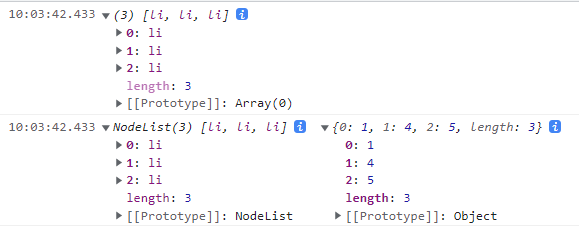

# 1. ES6语法新特性介绍

推荐书籍[阮一峰ES6新语法](https://es6.ruanyifeng.com/)
ES6全称：ECMAScript-2015, 是2015年推出的全新的js语法
一定要切记： 语法的更新，其实就是在原有的语法基础上`新增了几个新`的语法或者采用语法糖改变了之前的写法（ES6更简洁）。 而不是说把我们之前学习的js语法给完全`替换覆盖`

因此，我们学习ES6语法之后，相当于就是在之前的语法基础上，在额外多学几个js语法而已。  现在几乎很少有人会把ES5与ES6分的非常清楚。 基本上直接拿来用就可以了，哪个方便用哪个

## 1.1. 变量声明var、let、const

var属于ES5的用法，有如下特点：

* 有变量预解析，变量的声明会提升到当前作用域最顶端，只是声明提升，后面的赋值并不提升
* 没有块级作用域，在{}中声明的变量在全局中都可以使用，以前都是采用覆盖的方法

let和const属于ES6的语法（推荐使用）
let : 变量。 可以修改
const : 常量。 只可以声明的时候赋值一次，之后无法修改（开发中是能用const就尽量使用const，const性能更高一些）

新语法特点如下：
* 没有预解析，需要先声明后使用，同时不允许重复声明
* 有块级作用域，在{}里面的叫做块级作用域，两个块级作用域里的同名变量互不影响

> 注意不声明直接使用 `a=10`也是不报错的，属于js语法的缺陷，暂时未被修改，不符合规范，禁止使用

## 1.2.解构赋值
解构赋值语法就是变量赋值语法的简写形式，左右的数据类型要对应，套在变量外面的`[]`和`{}`别忘了
### 1.2.1. 数组解构（很简单）
数组解构 
1. 取出数组元素 赋值给变量`[变量名1,变量名2,变量名3]=数组名`

```js
let arr = [10,20,30]
		//ES5
        // let n1 = arr[0]
        // let n2 = arr[1]
        // let n3 = arr[2]
        // let n4 = arr[3]
        
        //ES6
        let [n1,n2,n3,n4]  = arr
```
2. 取出变量的值 赋值给数组元素`数组名=[变量名1,变量名2,变量名3]`
```js
        let num1 = 1
        let num2 = 2
        //ES5
        // let arr1=[]
        // let arr1[0]=num1
        // let arr1[1]=num2
        
        //ES6
        let arr1 = [num1,num2]
```
### 1.2.2. 对象解构（重点掌握）

**注意一定要是变量名和对象的属性名同名才可以用解构赋值。顺序无所谓，对象是无序的**，

```js
let obj = {
            name:'张三',
            age:20,
            sex:'男'
        }
```

1. 取出对象的属性赋值给变量`{属性名1,属性名2,属性名3}=对象名`
```js
                let { name,age,sex } = obj
```
注意如果写`let{name,sex:gender,age}`表示取出对象中的sex重命名（赋值）为gender，即`let gender = obj.sex `。一般不推荐使用冒号，推荐使用后面的ES5语法直接赋值，原则是能用ES6的就用ES6，不能用的ES5也能用

2. 取出变量的属性赋值给对象`对象名={属性名1,属性名2,属性名3}`
```js
                let obj = { 
                    name,// name : name
                    age,
                    sex，
                    //对象里面的方法可以省略function关键字
                    say(){
                console.log(111)                
            }//say:function(){}
                }
                
                obj.say()//111
```
3. 设置解构赋值语法的默认值，能覆盖的就覆盖，没有覆盖的就取默认值
```js
let student = {
        name: '班长',
        age: 38,
        sex: '女'
      }
let {
            name = '坤哥',
            score = 88,
            sex: gender = '男'
        } = student
```

> 补充一下ajax中的二级解构`{data:{data:res}}=obj`表示先取出obj中的data属性赋值给`{data:res}`，然后再取出obj的data属性中的data属性重命名为res

解构的新用法：拿到对象中部分属性组成的对象

```js
const { name, ...data } = {
    name:'zs',
    age:21,
    hobby:'dance'
    // ...
}
// data拿到的就是除name成员的其余成员组成的对象
```

### 1.2.3. 函数参数解构

当函数参数是对象类型时就可以对形参进行解构，传参本质： 实参给形参赋值

```js
function fn(obj){// let obj = {name:'张三',age:20,sex:'男'}
            console.log( obj )
            //对函数形参进行解构
            let {name,sex,age} = obj
            console.log( name,sex,age )
         }

		//进阶版
         function fn1( {name,sex,age} ){// let {name,sex,age} = {name:'张三',age:20,sex:'男'}
            console.log( name,sex,age )
         }

         fn( {name:'张三',age:20,sex:'男'} )
         fn1( {name:'张三',age:20,sex:'男'} )
```

解构案例：

```js
data:{text}//text:text
```

```js
axios({
    method:'',
    url:'',
    data//data:data（右边的data是一个对象）
})
```

以上属于将变量值赋给对象，只是省略了左边的obj对象名`对象名={属性名1,属性名2,属性名3}`

## 1.3. 箭头函数

### 1.3.1. 箭头函数介绍

箭头函数 : 相当于 function函数的简写（只能代替匿名函数）

1. 去掉function,改成 箭头 =>
2. 形参小括号写到箭头左边

箭头函数注意点：
* 如果箭头函数只有一个形参,则可以省略小括号
* 没有形参用空小括号代替或者用一个小下划线`_`（框架中可能会遇到）
* 如果箭头函数的 函数体 只有一行代码，则可以省略大括号（此时必须省略return），函数会返回这一行代码的值。没有返回值的函数可以写执行代码
```js
let fn = (a,b) => {
        console.log(a+b)
      }

      fn(10,20)

      //(1)如果箭头函数只有一个形参,则可以省略小括号
      let fn1 = a=>{
          console.log(a*2)
      }
      
      fn1(66)

      //(2)如果箭头函数的 函数体 只有一行代码，则可以省略大括号。 （此时必须省略return）
      let fn2 = a=>a*2
      
      let res = fn2(88)
```
> 弄清楚`fn1(66)`和`let res = fn2(88)`的区别，前者是执行函数体代码（对返回值不做要求），后者是获取函数的返回值（函数也会执行）

### 1.3.2. 箭头函数this指向

箭头函数this : 没有this

箭头函数本质是访问 上级作用域中的this

注意点：

* 由于箭头函数没有this,所以箭头函数不能作为构造函数 （new会修改this指向,而箭头没有this）
* 箭头函数也无法修改this （call apply bind）对箭头函数是无效的
* 由于箭头函数没有this，所以箭头函数一般不作为事件处理函数，事件处理函数的this很有用

箭头函数this指向示例

```js
       let obj = {
	    name: "ikun",
        eat() {
          //1级   this : obj（只有obj可以调用我）
          function fn1() {
            //2级  
            console.log(this)//window  
          }
          fn1()
          let fn2 = () => {
            //2级  ： 箭头函数访问上级 1级obj
            console.log(this)//obj   
          }
          fn2()
        },
        learn: () => {
          //1级 ： 上级 this->window
          function fn1() {
            console.log(this)//window 
          }
          fn1()
          let fn2 = () => {
            //2级  访问1级 this -> window  
            console.log(this)//window  
          }
          fn2()
        }
      }

      obj.eat()
      obj.learn()
```

## 1.4. 展开运算符

展开运算符`...数组名/对象名`用来遍历数组或者对象，可以用来遍历伪数组

遍历数组

```js
		let arr1 = [10, 20, 30]
        let arr2 = [40, 50, 60]
        let arr = [...arr1, ...arr2, 70]
```

遍历对象（当于遍历obj1的属性名和属性值赋值给obj2对象）

```js
let obj1 = {
            sex: '男'
        }
        let obj2 = {
            name: '张三',
            age: 23,
            ...obj1
        }
```
自己手写的模拟其实不能叫严格的伪数组，querySelectorAll产生的是伪数组可以使用展开运算符，Set对象也不能叫伪数组，但是页可以展开运算符。推荐使用ES6新语法`Array.from()`
```js
 <ul>
        <li></li>
        <li></li>
        <li></li>
    </ul>
    <script>
        let weiArr1 = {
            0: 1,
            1: 4,
            2: 5,
            length: 3
        }
        //手写的模拟可以使用Array.from()方法
        weiArr = document.querySelectorAll('ul li')
        let a = [...weiArr]
        console.log(a)
        console.log(weiArr, weiArr1)
        console.log([...weiArr1])//报错 Uncaught TypeError: weiArr1 is not iterable
```



## 1.5. 数据类型Set

不会的直接去查阅文档，ES6还有个数据类型叫Map

Set相当于是数组类型（这里既不是对象也不是数组，也不是伪数组，类似于集合的形式，不能取下标和长度），和数组Array唯一的区别是不能存储重复元素。set需要用new关键字来创建对象

```js
let arr = [10,20,30,50,60,88,20,50,60,90]
        console.log( arr )

        //1.创建Set,去除数组重复元素
        // let set = new Set( arr )
        // console.log( set )
        //2.把set变成真数组（展开运算符）
        // let newArr = [...set]

        //经典面试题： 一行代码实现数组去重
        let newArr = [...new Set( arr ) ]
        console.log(newArr)
```

# ==2. 数组迭代（遍历）方法（重中之重）==

官网文档：https://developer.mozilla.org/zh-CN/docs/Web/JavaScript/Reference/Global_Objects/Array

> 回调函数的第三个参数都是originArr，就是调用这个方法的数组

**这些方法ES5就会出来了**

以下所有的方法都可以使用传统的for循环来代替，只是语法不同而已

 * 所有语法的形式都是一样的都是`arr.map((item,index)=>{}`，item和index按需取用
 * 都是以arr数组为回调函数的参数，严格地说是解析里面的元素和下标为实参
 * 这些方法都存在于Array构造函数的原型之后，实例对象数组可以点语法调用
 * 一般要写return语句，当然如果只有一行代码，省略了`{}`默认就当成return的语句

| 数组几种遍历介绍(共同点：回调函数一样) | 应用场景                           | 回调执行次数  | 函数返回值      | 回调是否需要return                  |
| -------------------------------------- | ---------------------------------- | ------------- | --------------- | ----------------------------------- |
| map遍历                                | 映射数组（操作每一个item）         | == 原数组长度 | 新数组(==)      | 一定要return（当前元素）            |
| `filter遍历`                           | 过滤数组（只需要部分item）         | == 原数组长度 | 新数组(!=)      | return  true(元素添加到新数组)      |
| forEach遍历                            | 遍历数组                           | == 原数组长度 | 无              | 无                                  |
| some遍历                               | 判断某些是否符合条件               | != 原数组长度 | 布尔类型        | return true；循环结束               |
| `every遍历`                            | 判断所有元素是否符合条件           | != 原数组长度 | 布尔类型        | return true; 循环继续               |
| findIndex遍历                          | 获取符合条件的第一个元素位置(下标) | != 原数组长度 | 数字            | return true; 循环结束               |
| includes方法(底层是遍历)               | 判断数组/字符串是否包含某一个值    | 无回调        | 布尔类型        | 无回调                              |
| reduce                                 | 前后item之间产生关系（如求和）     | ==原数组长度  | sum，第一个参数 | return是下一次的sum值，一定要return |


## 2.1. 数组map方法

数组map方法作用:  映射数组`arr.map(()=>{})`

通俗地说：按照某种映射关系, 把数组的每一个元素给修改了。举例：全场8折:  数组的每一个元素 * 0.8

应用场景：
* 将数组中的每一个元素+1
* 将数组中每一个元素 * 2
* 100以上的商品打八折

> 最常用的还是结合数组的join方法，将服务器传来的对象数组映射到父元素的innerHTML

map方法特点:
1. 回调函数执行次数  ==    数组长度
2. 回调函数内部的return
	* return 新数组的元素
	* 如果没有return， 则map的返回值都是undefined（当然如果只有一行代码，省略了`{}`和return关键字默认就当成return的语句）
3. map方法的返回值
	* 返回映射之后的新数组

```js
		let arr = [88, 90, 100, 20, 50]
        //完整写法
        let res = arr.map((item, index) => {
            return item * 0.8
        })
        //箭头函数如果形参只有一个可以省略小括号， 如果函数体只有一行可以省略大括号(必须省略return)
        let res1 = arr.map(item => item * 0.8)
```

## 2.2. 数组filter方法

数组filter方法作用:  筛选数组`arr.filter(()=>{})`

用于筛选数组中满足条件的元素，返回筛选后的新数组，筛选条件写在回调函数的`{}`中

应用场景:
	找出数组中所有大于10的元素

filter方法特点
1. 回调函数执行次数  ==    数组长度
2. 回调函数内部的return**（函数体可以简写，这里很多时候不用写if-else，直接把判断条件写在箭头的后面）**
  * `return true` : 符合筛选条件，放入新数组中
  * `return false` : 不符合筛选条件，不放入新数组中
3. filter方法的返回值
    返回筛选之后的新数组

```js
let arr = [ 88,90,100,20,50 ]
       //需求：找出50以上的元素
        //完整写法
    //    let res = arr.filter( (item,index)=>{
    //         if( item >= 50 ){
    //             return true
    //         }else{
    //             return false
    //         }
    //    })

    let res = arr.filter(item=>item >= 50)
```

## 2.3. 数组forEach方法

数组forEach方法作用:  遍历数组

应用场景:  和 `for(let i=0;i<arr.length;i++){}` 功能一致

forEach方法特点
1. 回调函数执行次数  ==    数组长度
2. 回调函数内部的return
	 没有返回值
3. forEach方法的返回值
	没有返回值，写了return也没有返回值

```js
let arr = [45,60,88,90,20]

       arr.forEach((item,index)=>{
           console.log(item,index)
       })

const o = { age: 18 }
[].forEach(param1, param2)
// param1是一个函数 函数的三个参数分别是，每一项元素，索引，当前数组
// param2是param1函数内部this的指向
/* [1, 2, 3].forEach(function(item, index, originArr){
  console.log(item, index, originArr)
}, o)
```

## 2.4. 数组some方法

数组some方法作用:   判断数组中是否有符合条件的元素

应用场景:  非空判断（判断多个表单元素，有没有空文本）
	举例 ： 判断数组中有没有负数

some方法特点
1. 回调函数执行次数  !=  数组长度
2. 回调函数内部的return**（函数体可以简写，这里很多时候不用写if-else，直接把判断条件写在箭头的后面）**
	`return true` : 循环结束。 找到了满足条件的元素
	`return false` : 循环继续。 没找到，循环继续。 如果所有元素全部遍历还是没找到，最终结果就是false

3. some方法的返回值
	true : 有符合条件的元素
	false : 没有符合条件的元素

```js
//判断是否有负数
let arr = [10,20,50,60,70,80]
       //标准写法
    //    let res = arr.some((item,index)=>{
    //        if( item < 0 ){
    //            return true
    //        }else{
    //            return false
    //        }
    //    })
        
        //简写
       let res = arr.some(item=>item < 0)
```

> 总结一下，some和every的作用是一样的，some碰到条件true了就停下了说明有元素满足条件，every碰到条件true继续走判断是否所有条件都满足，如果成立最终的返回结果都是true

> some和every什么时候使用，主要看返回的结果，看具体的业务场景，正确的场景要对应返回结果为true
>
> 用some就是是否有一个满足条件，如果有空就返回true。 `const res = arr.some(item => !item.title)`找到true就停止遍历
>
> 用every就是是否全部都不为空，如果有空就返回false。`const res = arr.every(item => item.title)`
>
> 为了更好的进行逻辑判断
>
> 要看四个选项内容是否有空，肯定选择every。选项内容有空返回false（错误），无空返回true（正确）
>
> 看是否有一个选项被选择了，肯定选择some。单选未勾选返回false（错误），有勾选返回true（正确）

## 2.5. 数组every方法

数组every方法作用:   判断数组中 是否所有的 元素都满足条件（可以和some方法互换使用，但是一般开发中只使用一个，看特定情况用哪一个比较好）`arr.every`

应用场景:  开关思想 (购物车全选框)
	举例 ： 判断数组中是不是都是正数

every方法特点
1. 回调函数执行次数  !=  数组长度
2. 回调函数内部的return**（函数体可以简写，这里很多时候不用写if-else，直接把判断条件写在箭头的后面）**
	`return true` : 循环继续, 满足条件,如果所有的元素全部遍历还是true,则最终的结果就是true
	`return false` : 循环结束。 只要要到不满足条件的元素，循环结束。最终的结果false
3. every方法的返回值
	true : 所有的元素 都符合条件
	false : 有元素 不符合条件

```js
//判断数组中是不是都是正数
let arr = [10, 20, 50, 60, 70, 80]
        //标准写法
        /*  let res = arr.every((item,index)=>{
             if( item >= 0 ){
                 return true
             }else{
                 return false
             }
         }) */
        let res = arr.every(item => item >= 0)
        console.log(res)
```

## 2.6. 数组findIndex和find方法
数组findIndex方法作用:   查找元素的下标

数组的findIndex与indexOf异同点
* 相同点：功能一致，都是查找元素下标。 有则返回下标，无则返回固定值-1
* 不同点：应用场景不同
	indexOf : 查找数组中的元素都是值类型
	findIndex : 查找数组中的元素都是引用类型

findIndex方法特点
1. 回调函数执行次数  !=  数组长度
2. 回调函数内部的return**（函数体可以简写，这里很多时候不用写if-else，直接把判断条件写在箭头的后面）**
	`return true` : 循环结束。 找到了,此时返回值就是下标
	`return false` : 循环继续。 没找到，循环继续。 如果所有元素全部遍历还是没找到，最终结果就是-1
3. findIndex方法的返回值
	元素下标 或者 -1

```js
//需求：找名字为王五的人在哪里
        //    let res = arr.findIndex(item=>{
        //        if( item.name == 'sfs' ){
        //            return true
        //        }else{
        //            return false
        //        }
        //    })

        let res = arr.findIndex(item => item.name == '王五')
```
> > 总结一下：数组方法里面的回调函数靠true和fals执行的时候，可以直接写条件表达式（自动判断布尔值）

补充：`arr.find()`方法：根据条件查询数组中第一个满足条件的元素

findeIndex是返回下标，否则返回undefined

```js
arr.find(item=>item>10)//返回第一个大于10的元素
```

## 2.7. 数组reduce方法

数组reduce方法 :  数组累加器方法`arr.reduce ((上一次值sum,当前值item,当前下标index)=>{},num)`
对数组每一个元素执行一次回调函数，累加最后一次回调的结果
应用场景：数组元素求和、求数组元素最大值

第一个参数：回调函数
* sum：初始值，默认为数组第一个元素，item：数组的每一个元素，默认为数组第二个元素，index为下标默认从1开始
* 默认下标不是从0开始，而是从1开始。 开发中一般需要设置默认值num=0，设置之后，item和index都从第一个元素开始
* 每次回调函数的return 值 就是下一次 sum的值

第二个参数: 初始值num
* 一般需要设置初始值为0（sum的初始值）, 如果不设置遇到空数组则会报错

reduce方法返回值是 ： 最后一次sum的结果

```js
		//数组求和
let res = arr.reduce( ( sum,item )=>sum + item , 0 )
        console.log( res )
```

# 3. 数组迭代方法应用
## 3.1. 将对象数组中数据渲染道页面，并求所有商品的总价格
经典之map配合join方法
```js
 document.querySelector('.list').innerHTML =  goodsList.map(item=>{
      return `<div class="item">
      
      <p class="name">${item.name} <span class="tag">【赠品】10优惠券</span></p>
      <p class="price">${item.price}</p>
      <p class="count">x${item.count}</p>
      <p class="sub-total">${item.price * item.count}</p>
      </div>`
    }).join('')

    //求所有商品总价格
    document.querySelector('.amount').innerText =  goodsList.reduce((sum,item)=>sum+item.price*item.count,0)
```
## 3.2. 购物车价格筛选
可以完整封装一个filter函数，也可以部分封装

**知识：函数体内尽量避免使用全局变量，用参数传递**（比如数组对象是服务器传过来的）

```js
//1.获取a标签
    let aList = document.querySelectorAll(".filter>a")
    //2.注册事件
    for (let i = 0; i < aList.length; i++) {
      aList[i].onclick = function () {
        //3.排他
        //(1)类选择器 干掉兄弟
        document.querySelector("a.active").classList.remove("active")
        //(2)复活自己
        this.classList.add("active")
        //筛选
        if (i == 0) { // 0 - 100
          renderData(goodsList.filter(item => item.price < 100))
        } else if (i == 1) {
          //100-300
          renderData(goodsList.filter(item => item.price >= 100 && item.price < 300))
        } else if (i == 2) {
          renderData(goodsList.filter(item => item.price >= 300))
        } else {
          renderData(goodsList)
        }
      }
    }

    const renderData = arr => {
      document.querySelector(".list").innerHTML = arr.map(item => `<div class="item">
        
        <p class="name">${item.name}</p>
        <p class="price">${item.price}</p>
        </div>`).join("")
    }

    //页面一加载，默认渲染所有数据
    renderData(goodsList)
```
## 3.3. every案例：判断全选框逻辑
**Array.from可以把dom对象伪数组转成真数组，调用数组的方法**

```js
//判断 checkList是否所有的元素checked值都是true
        checkAll.checked = Array.from(checkList).every(item=>item.checked)
```
# 今日总结

1. 声明变量let与const
	* 没有预解析（声明不会提前）：必须要先声明，才能调用
	* 有块级作用域 ： if分支和for循环大括号里面声明的变量是局部的
2. let与const区别
	* let : 变量。  可以修改
	* const:常量。 只能在声明的时候赋值一次，不可以修改。
3. 解构赋值 ： 变量赋值的简写
	* 取对象的属性 赋值给 变量`let {name,age,sex} = obj`
	* 取变量的值 赋值给 对象`let obj = {name,age,sex}`
4. 箭头函数： function简写`()=>{}`
	* function替换成=>   
	* 形参() 移到箭头左边
5. 箭头函数this指向    箭头函数没有this
    * 箭头函数的this，通过作用域链访问上级作用域this
    * 箭头函数不能使用new调用
    * 上下文默认不支持箭头函数

# 今日面试点

* function函数和箭头函数区别  /  箭头函数中的this指向
