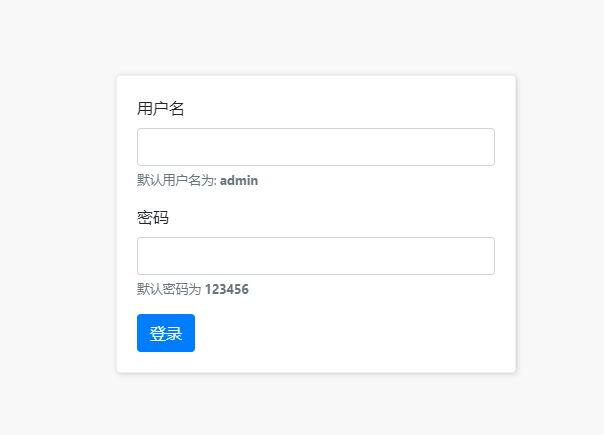

# 1. 服务器介绍

## 1.1. 什么是服务器

服务器是提供某种服务的计算机（ 电脑） 需要软硬件支持（ 文件服务器， 邮件服务器）。**浏览器对应的是web服务器**

* 想让你的电脑提供 `听歌` 服务，需要装什么软件呢？
  * 网易云、qq音乐
* 想让你的电脑提供 `视频` 服务，需要装什么软件呢？
  * 爱奇艺，优酷
* 想让你的电脑提供 `聊天` 服务，需要装什么软件呢？
  * qq，微信

> 要想让你的电脑成为一台Web服务器，我们只需要安装对应的软件即可（这些属于后台知识，我们前端人员只需要知道如何和服务器交互就可以）


## 1.2. 服务器交互流程（前后端交互）

1. 请求(浏览器发起请求，服务器接收)（有的时候浏览器报错可能并不是前端的原因，可能是后端处理和响应出的问题）
2. 处理（服务器处理这个请求）
3. 响应（服务器响应数据给浏览器）

## 1.3. 浏览器访问服务器的几种

1. 直接在地址栏输入网址

2. a标签的href属性
3. location.href='url'

4. AJAX:网页不会跳转，不会覆盖原来的数据，部分数据刷新

```js
</head>
<a href="http://192.168.137.1">点我跳转</a>
<button id="btn">点我也可以跳转哟</button>
<body>
    <script>
        document.getElementById('btn').onclick = function(){
            window.location.href = 'http://192.168.137.1';
        };
    </script>
```

## 1.4. url相关知识

url地址 全称统一资源定位符

URL 地址用来表示服务器上每个资源的确切访问路径。一个标准的url地址由四个部分组成


### 1.4.1. 协议

 协议（protocol）- 网络通讯格式

协议是网络协议的简称，用来保证通信的双方能读懂彼此发送过来的消息内容（可以看成一种约定，约定着传输的数据格式大小等）。

通信的双方，共同遵守http 网络协议（本地文件打开就是file协议）

好处：保证能读懂对方发送过来的消息内容

### 1.4.2. 主机名

主机名（hostname）或IP地址 - 电脑在网络中的唯一标识（主机名可以解析出具体的ip地址）

通过主机名（主机名有时称为域名。主机名映射到 IP 地址，但是主机名和 IP 地址之间没有一对一关系。），可以保证客户端在万千的服务器中，找到自己想访问的那台服务器

> 主机名的含义是机器本身的名字，域名是方面记录IP地址才做的一种IP映射。域名没有重复的，但是主机名是可以重复的，域名必须要向Internet申请，主机名可以随便起
>
> 主机名由称为 DNS 服务器或域名服务器的服务器映射到 IP 地址

虚拟主机（Virtual Host）也叫虚拟服务器（VPS）。是服务器（Server）中独立划出来的网络空间，用来租给用户的可供购买。分为独立IP和共享IP。虚拟主机环境都是商家配置好的，用户不能更改也无须自己配置网站环境

独立服务器是VPS的一个升级版，可以自定义带宽、cpu和环境等

### 1.4.3. 端口号

端口号（port） - 设备与外界通讯交流的出口

端口号是0-65535 之间的整数，它的主要作用是表示一台计算机中的特定进程所提供的服务

在http协议中，如果URL地址中的端口号是80，则 :80端口可以省略不写

> 只有:http协议中80端口可以被简写！！！，https（需要收钱）只有443端口可以被简写！！！

### 1.4.4. 资源存放路径

路径用来表示资源在服务器上具体的存放位置

> 在url地址中不允许出现中文、空格等特殊字符，因此浏览器会自动对url地址中内的内容进行编码，只对非ascll码的内容进行编码，这样数据传输变得更加简单。`encodeURIComponent()`编码`decodeURIComponent`解码，uri不是url很多地方都需要编码解码。等号没被编码（浏览器显示的时候发现是链接键值）但是底层还是要编码
>
> 编码解码是由浏览器帮我们完成的，base64格式图片的时候可能需要自己编码解码

# 2. Ajax

## 2.1. Ajax介绍

* Ajax就`是`让浏览器跟服务器交互的一套`API`。 它的作用就是可以让浏览器和服务器进行交互（asynchronous javascript and xml）（xml 可扩展标记语言 Extensible Markup Language）
  * 说人话： ajax 是一种 用于`向服务器请求数据`的 技术
* MDN官网传送门:https://developer.mozilla.org/zh-CN/docs/Web/Guide/AJAX

ajax往往负责的是网页中某个盒子数据的刷新，一个网页常用好几个ajax请求

> 特点：局部刷新

==ajax（阿贾克斯）：在不刷新页面的情况下向服务器请求数据==（需要联网使用）

## 2.2. 为什么需要ajax

* 1.以前我的写的页面全部都是固定的假数据，其实网页的数据都是从服务器获取的，一旦服务器数据变化，网页上的内容也会发生变化
* 2.虽然可以通过在浏览器地址栏直接输入网址（url）的方式向服务器获取数据，但是我们的网页会刷新
* 3.学会ajax：就可以做到在不刷新网页的情况下向服务器请求数据，让网站数据内容动态变化，做到网页内容部分刷新

## 2.3. Ajax工作流程

1. 创建XMLHttpRequest对象（俗称小黄人）
   `let xhr = new XMLHttpRequest();`

2. 设置请求
   `xhr.open('get', 'https://autumnfish.cn/api/joke');`

3. 发送请求
   `xhr.send();`

4. 注册回调函数事件（相当于服务器那边发出响应后并传回responseText后该事件触发）
   这个函数不是立即执行的，而是等服务器把数据响应返回才会执行（PS：什么时候执行取决于你的网速快慢）
    `xhr.onload = function () {console.log(xhr.responseText);}`


```js
document.querySelector('.getJoke').onclick = function () {
      // 创建xhr对象
      const xhr = new XMLHttpRequest()
      // 设置请求方法和请求地址
      xhr.open('GET', 'https://autumnfish.cn/api/joke')
      // 发送请求
      xhr.send()
      // 注册响应事件（不会立即执行）
      xhr.onload = function () {
        document.querySelector('.joke-container').innerText = xhr.responseText
      }
    }
```


# ==3. Ajax发送get请求与post请求==

get和post大小写无所谓，axios框架里面最好大写

## 3.1. GET请求

get请求一般用来请求获取数据，但是还是取决于接口文档（后端决定）

get请求的参数一般为可选，有参数的话加在url后面就可以。get 请求的参数设置：在url后面拼接

 语法：`url?key1=value1&key2=value2`（英文符号，不能有空格）

```js
//  创建一个XMLHttpRequest对象
    let xhr = new XMLHttpRequest()
    // 设置请求方式和请求方法，并加上参数
    xhr.open('GET', 'https://autumnfish.cn/api/joke/list?num=5')
    // 发送请求
    xhr.send()
    // 注册响应回调事件
    xhr.onload = function () {
      console.log(JSON.parse(xhr.responseText).jokes)
    }
```

## 3.2. POST请求

post请求一般用来请求新增数据，但是还是取决于接口文档（后端决定），比如登录时和后台核对信息会用到post

 post参数的来源是form表单请求数据 ，后来才有了ajax，最早的请求服务器的数据使用form表单请求`<form action="" method="post" enctype="application/x-www-form-urlencoded"></form>`

> 注意：POST需要在send之前调用设置请求头方法`xhr.setRequestHeader('Content-type', 'application/x-www-form-urlencoded')`固定格式不要求记住

```js
//(1).实例化ajax对象
    let xhr = new XMLHttpRequest()
    //(2).设置请求方法和地址
    xhr.open('post', '')
    //(3).设置请求头（post请求才需要设置）
    xhr.setRequestHeader('Content-type', 'application/x-www-form-urlencoded')
    //(4).发送请求 ： 参数格式  'key=value' 
    xhr.send('key=value')
    //(5).注册回调函数
    xhr.onload = function () {
      console.log(xhr.responseText)
    }
```

> 后台传过来的数据一般不知道是什么，大部分是json，需要调用`JSON.parse()`转换成数组对象
>
> axios框架自动帮忙把json转换成了对象

## 3.3. get和post的区别

传参方式不同：get是url，post是单独设置请求头

# 4. 应用案例

## 4.1. 用户登录

1. 点击按钮后发送ajax请求，

2. 注意input的value值不能在页面一加载就获取，会是空字符串



```js
const btn = document.querySelector('#btnLogin')
    // 封装登录事件
    const login = _ => {
      let username = document.querySelector('#username').value,
        password = document.querySelector('#password').value
      // 1.new一个XMLHttpRequest对象
      let xhr = new XMLHttpRequest()
      // 2.设置请求方法和请求地址
      xhr.open('post', 'http://www.liulongbin.top:3009/api/login')
      // 3.post请求头
      xhr.setRequestHeader('Content-type', 'application/x-www-form-urlencoded')
      // 4.发送请求
      xhr.send(`username=${username}&password=${password}`)
      // 5.请求响应事件
      xhr.onload = function () {
        let res = JSON.parse(xhr.responseText)
        console.log(JSON.parse(xhr.responseText))
        if (res.code !== 200) {
          alert(res.msg)
          document.querySelector('#username').value = ''
          document.querySelector('#password').value = ''
          return
        }
        alert(res.msg)
        location.href = 'https://www.baidu.com'
      }
    }

    // 鼠标点击
    btn.addEventListener('click', function () {
      login()
    })
    // 键盘回车
    window.onkeydown = function (e) {
      if (e.key == 'Enter') {
        login()
      }
    }
```

## 4.2. 新闻列表

页面一加载就发送ajax请求，然后后台的json->对象，在把数据通过map迭代渲染到页面


```js
    //(1).实例化ajax对象
    let xhr = new XMLHttpRequest()
    //(2).设置请求方法和地址
    //get请求的数据直接添加在url的后面 格式是 url?key=value
    xhr.open('get', 'http://www.liulongbin.top:3009/api/news')
    //(3).发送请求
    xhr.send()
    //(4).注册回调函数
    xhr.onload = function () {
      let res = JSON.parse(xhr.responseText).data
      console.log(res)
      document.querySelector('#news-list').innerHTML = res.map(item => `<div class="news-item">
      
      <div class="right-box">
        <h1 class="title">${item.title}</h1>
        <div class="footer">
          <div>
            <span>${item.source}</span>&nbsp;&nbsp;
            <span>${item.time}</span>
          </div>
          <span>评论数：${item.cmtcount}</span>
        </div>
      </div>
    </div>`).join('')
    }
```

## 4.3. 水果列表


```js
    let xhr = new XMLHttpRequest()
    xhr.open('get', 'https://autumnfish.cn/fruitApi/fruits')
    xhr.send()
    xhr.onload = function () {
      console.log(JSON.parse(xhr.responseText).data)
      document.querySelector('.tbody').innerHTML = JSON.parse(xhr.responseText).data.map(item => `<div class="tr">
            <div class="td">${item.name}</div>
            <div class="td">
              
            </div>
            <div class="td">
              <span class="my-input__inner count">${item.info}</span>
            </div>
            <div class="td">
              <button class="info">查看详情</button>
            </div>
          </div>`).join('')
    }
```

## 4.3. 新闻列表2

知识点一：

有时候渲染页面单独封装一个renderData函数，有时候把ajax请求代码也封装进去

知识点二：

页面下拉刷新数据，页面最大滚动距离计算公式：最大滚动距离 = body高度 - 可视窗口高度`let max = document.body.offsetHeight - document.documentElement.clientHeight`想象一下可视窗口是一个盒子向下移动的距离就是scrollTop的距离

滚动条滚到最下面的时候需要请求下一页的数据，则需要声明一个全局空数据用来存储所有的数据，还有一个index++用来做axios的params参数请求下一页的数据。

知识点三：

onscroll事件是一个频繁触发的事件，导致轻轻地滚动一下请求了多次数据，这里用节流知识解决一下声明一个全局lastTime记录上次执行事件处理函数的时间

```js
 let arr = []
    let index = 1
    //封装新闻请求
    const getNews = ()=>{
      axios({
      url:' https://api.apiopen.top/getWangYiNews',
      method:'get',
      params:{path:index}
    }).then(res=>{
      //成功回调
      console.log(res)
      arr.push(...res.data.result)
      console.log( arr )
      //省略渲染页面代码
      }
let lastTime = null
    //3.给页面注册滚动条事件
    window.onscroll = function () {
      //最大滚动距离 = body高度 - 可视窗口高度
      let max = document.body.offsetHeight - document.documentElement.clientHeight
      if (document.documentElement.scrollTop >= max - 10) {
        // 节流事件
        let currentTime = +new Date()
        if (currentTime - lastTime >= 500) {
          index++
          getNews()
          lastTime = currentTime
        }
      }
    }
```

# 5. 接口文档

## 5.1. 接口文档介绍

1. 接口：Web服务器提供的，让ajax请求的网络地址称之为接口，简称API（属于逻辑上的接口，之前学的函数也叫做api）

   **使用 Ajax 请求数据时，被请求的URL地址，就叫做数据接口（简称：接口或 API 接口）**

2. 接口文档 ：为了方便开发人员使用，我们的后台小伙伴会提供一种专门的文档，称之为接口文档
  * 接口文档，又称为API文档，可以理解为接口的`使用说明书`
  * 接口文档的本质 ：其实就是后台开发（如java）他们写的函数注释。后台在处理请求的时候一般都会写一些函数

3. 一个标准的接口文档至少要包含以下三种信息（`只能多，不能少`）
  * 请求的地址 （url）
  * 请求的方法 （get或者post）
  * 请求的参数（参数可以设置可选或者必填）

4. 以下接口文档示例，实际开发中为了避免`url地址`，`方法`,`参数`写错，一般强烈建议直接`复制粘贴`

  这个网站可以找到更多接口：https://github.com/AutumnFish/testApi

## 5.2. 接口文档示例

### 1.随机获取笑话的接口

* 请求地址：<https://autumnfish.cn/api/joke>
* 请求方法：get
* 请求参数：无
* 响应内容：随机笑话

### 2.获取多条随机笑话

> 随机获取笑话的接口

* 请求地址：https://autumnfish.cn/api/joke/list

* 请求方法：get

* 请求参数：num

  * 示例：https://autumnfish.cn/api/joke/list?num=10

  | 参数名 | 参数说明 | 备注                  |
  | ------ | -------- | --------------------- |
  | num    | 笑话条数 | 类型为数字,不要给错了 |

* 响应内容：JSON


### 3.用户注册

> 注册用户

* 请求地址：https://autumnfish.cn/api/user/register
* 请求方法：post
* 请求参数：username

| 参数名   | 参数说明 | 备注                                          |
| -------- | -------- | --------------------------------------------- |
| username | 用户名   | 不能为空,通过 send 方法传递，格式为 key=value |

```
xhr.send('username=xxx')
```

* 响应内容：注册成功或失败


### 4.用户登录

* 请求地址：http://www.liulongbin.top:3009/api/login
* 请求方法：post
* 请求参数：username  password

| 参数名   | 参数说明 | 备注                  |
| -------- | -------- | --------------------- |
| username | 用户名   | 不能为空,默认为admin  |
| password | 密码     | 不能为空,默认为123456 |

```
xhr.send('username=xxx&password=xxx')
```

* 响应内容：登录成功{code:200}  登录失败{code:500}


### 5.新闻列表

* 请求地址：http://www.liulongbin.top:3009/api/news
* 请求方法：get
* 请求参数：
* 响应内容：json数据


### 6.水果列表

* 请求地址：https://autumnfish.cn/fruitApi/fruits
* 请求方法：get
* 请求参数：
* 响应内容：json数据

