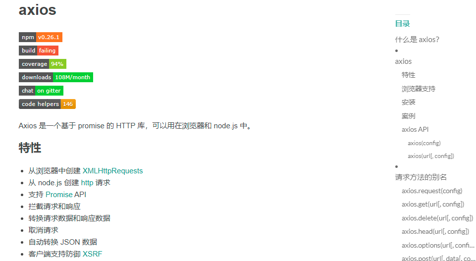
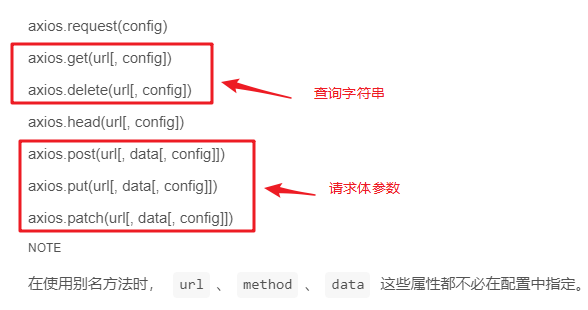
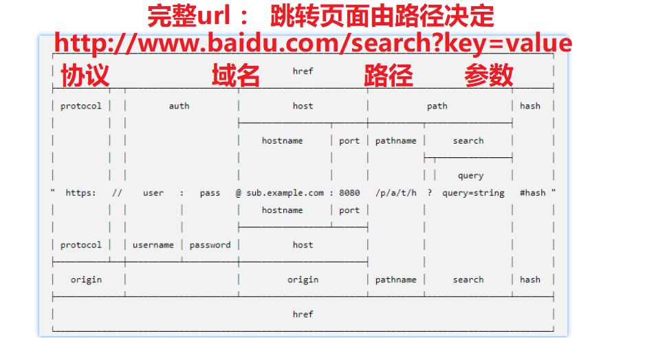
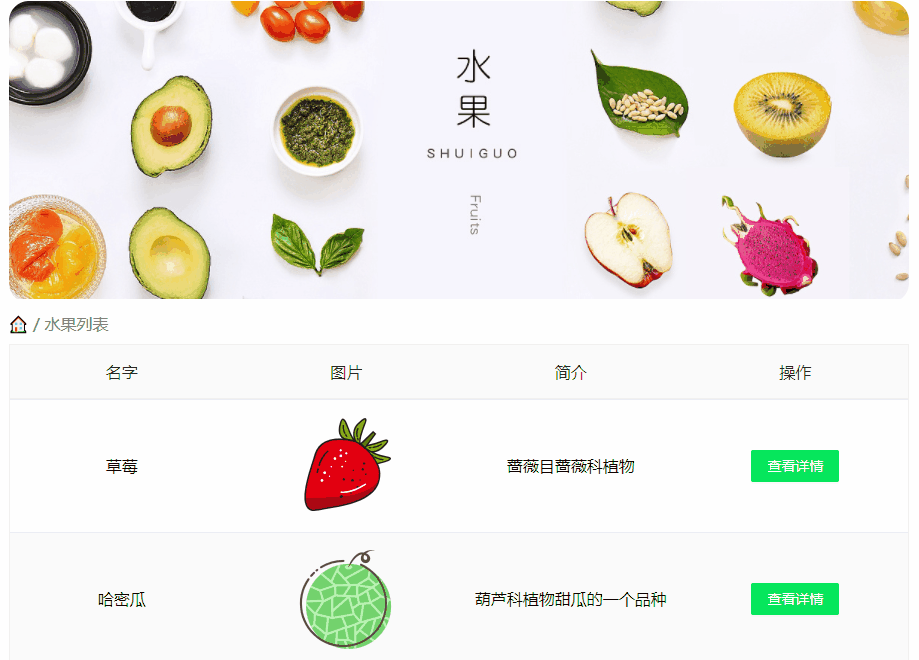
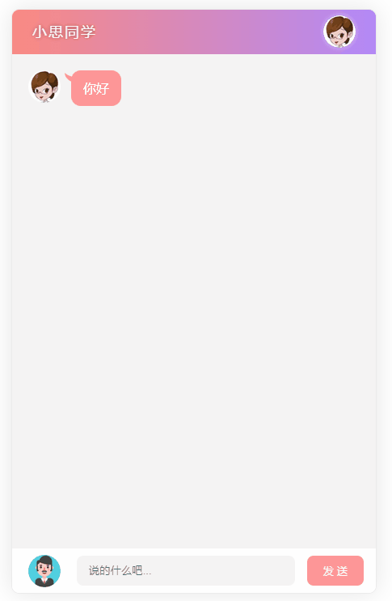
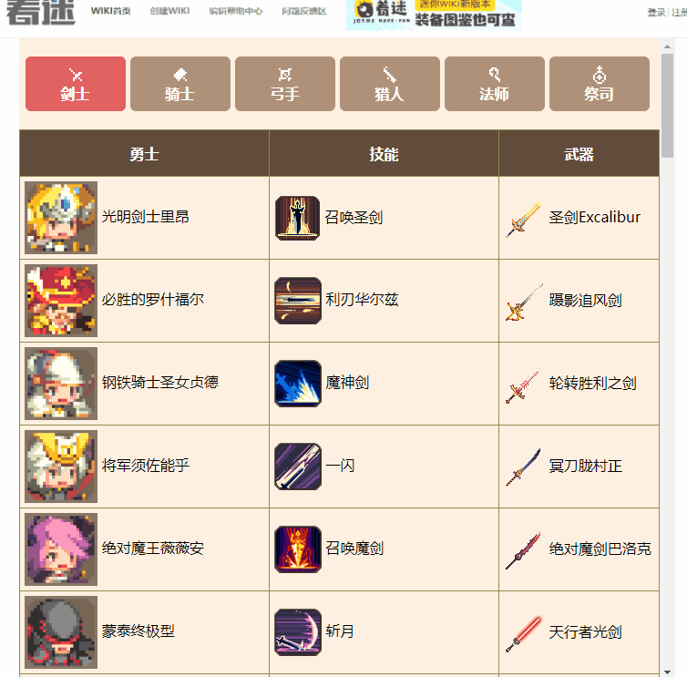

# ==1. axios框架的使用==

axios(哎克休斯) 官网 : http://www.axios-js.com/
1. axios是什么 ：  一个js框架，用于发送ajax请求（底层使用XMLHttpRequest）
2. 为什么要学习axios :  （1）vue课程，我们使用axios发送ajax请求 （2）大家今后实际开发也是使用axios发送ajax请求



任何框架的底层原理都是调用js内置对象的方法 。axios底层是调用内置对象XMLHttpRequest对象（XHR对象）

## 1.1. axios基本语法（了解，开发不用，可在官方文档查阅）

```js
//axios语法（链式语法，可以换行，不要打逗号，属于一个语句）
      axios
        .get('url')
        .then(res=>{//请求成功})
        .catch(err=>{//请求错误})
        .then(()=>{//无论请求成功失败都会返回这里的}) 
        //平常大多数就只有get().then()即可，后面两个不需要。后面三个里面都要求传回调函数，因为服务器会返回数据用这个回调函数接受
```

完整axios四部曲

```js
// 基本使用
    document.querySelector('.btn1').onclick = function () {
      axios
        // 发送请求
        .get('https://autumnfish.cn/api/joke/list')
        .then(res => {
          //res：是axios库对相应数据做了一层封装，。...request得到的就是xhr对象
          console.log(res)
        })
        .catch(err => {
          // 网络错误：1.url路径写错了2.网络错误，主要是硬件错误，参数（用户名密码）对不上，资源找不到会出现在上面的then中
          console.log(err)
        })
        .then(() => {
          //扩展知识：表示本次请求完成，无论请求成功与否（不用传形参，无实参返回）
        })
    }
```

带参数传递

```js
// get请求传递参数
    document.querySelector('.btn2').onclick = function () {
      axios
        // 发送请求
      	// get请求小括号里面需要{params:{参数}}，post直接{参数}
        .get('https://autumnfish.cn/api/joke/list', {
          params: {
            num: 10
          }
        })
        .then(res => {
          console.log(res)
        })
    }
    // post请求传递参数
    document.querySelector('.btn3').onclick = function () {
      axios
        // 发送请求
        .post('http://www.liulongbin.top:3009/api/login', {
          // 点语法，post请求data参数加了直接请求失败
          // 直接一个对象里面加参数 
          username: 'admin',
          password: '123456'
          // 
        })
        .then(res => {
          console.log(res)
        })
    }
```

设置请求头

```js
axios.get('/my/friends',{ 
    headers:{ 
        Authorization:xxx 
    } 
})
```



> 常用请求方法的
>
> * get 获取数据
>
> * post 新增数据
> * put 更新数据（整体更新）
> * patch 更新数据（打补丁，局部更新）
> * delete 删除数据

## 1.2. axios推荐使用方法（开发常用）

上面的写法没有一个规范性，有时候容易出错，推荐使用下面这种写法。忘记了自己去查阅官方文档，axios(阿克休斯) 官网 : http://www.axios-js.com/

> 一定要记得提前导入`axios.js`文件，不然会报axios未定义的错误

```js
    // get
    axios({
      method: 'get',
      url: 'https://autumnfish.cn/api/joke/list',
      // 虽然get这里写了参数，但是底层还是默认解析到url的后面，url?key=value，直接写在url后面也可以
      params: {
        num: 10
      }
    }).then(res => {
      console.log(res)
    })

    // post
    axios({
      method: 'post',
      url: 'http://www.liulongbin.top:3009/api/login',
      data: {
        username: 'admin',
        // 要传字符串
        password: '123456'
      }
      // res是response的意思
    }).then(res => {
      console.log(res)
    })
```

参数的值不存在隐式转换，数字字符串不能弄混

## 1.3. 链式语法使用原理

`axios().then()`这种连续调用函数叫做链式语法，原理主要是方法返回自身的对象

```js
let obj = {
            name: '张三',
            age: '23',
            sex: '女'
        }
        obj.setName = function () {
            this.name = '李四'
            return this
        }
        obj.setAge = function () {
            this.age = '20'
            return this
        }
        obj.setSex = function () {
            this.sex = '男'
            return this
        }
        // 编译器会自动识别换行的方法，自动检测前面的对象
        obj
            .setName()
            .setAge()
            .setSex()
```

> get请求的的参数可以直接写在url后面`?url/key1=value1&key2=value2`
>
> method不写或者写错默认就是get方法

> params是查询query参数，data是请求体body参数

## 1.4. 请求体参数说明

请求体默认数据类型是content-type是application/json（axios自动帮我们加在请求头），formdata会自动帮我们加上请求头中的content-type

get没有请求体，参数会直接加在url的后面，写在params属性里面也可以（只有第一种数据格式）

post请求体参数写在data属性里面，可以使用下面三种数据格式（不会拼接在url后面），这个具体怎么写还是要看接口文档的写法

```js
// Content-type:application/x-www-form-urlencoded  username=admin&password=123456
// Content-type:application/json  {username:admin,password:123456} 对象自动转成json
// Content-type:multipart/form-data FormData对象 文件上传
```

> jquery库提供的方法获取表单value，对应的是`Content-type:application/x-www-form-urlencoded  username=admin&password=123456`
>
> ​    `data: $(this).serialize()`

## 1.5. 自定义请求头

原生的setRequestHeader对应axios的headers属性，常用来自定义JWT令牌参数，参考CMS数据可视化项目，请求头里面的参数首字母大小写都支持

```js
axios({
  url:'请求路径',
  method:'get',
  data: { 'post请求参数'},
  params: { 'get请求参数'},
  headers:{
        Autorization：token值
    }
}).then(res=>{
  //成功回调
  console.log(res)
})
```

# 2. 案例应用（数据驱动）

## 2.1 水果详情

**知识点一：动态新增的元素，无法直接注册事件，解决方案有两种：**

1. 最常用：事件委托

2. 偶尔用：行内式js注册事件。`onclick="事件处理代码"` 一般一行代码，很多的话用事件委托或者封装函数，`onclick="go()"`常用来跳转页面，查看详情

   > 页面传递新增元素的值得方法：用自定义属性在标签中传递，或者使用行内js事件当做实参来传递

知识点二：url路径传参的流程总结 A页面跳转到B页面**



1. 给按钮添加行内js跳转（动态新增按钮不能直接获取，但是可以注册行内事件）
2. 在url路径后面拼接你的参数（页面跳转只由资源的路径决定，参数影响页面的数据内容）
	`<button onclick="location.href=  'url?id=参数值'  "></button>`
3. 在B页面解析location.search参数(属性不是方法不要后面的小括号)`let id=location.search.split('=')[1]`

**知识点三：如果get只有一个参数**
注意点：如果get请求只有一个参数，可以直接在资源路径后面加一个/然后直接写参数值（后台设计），可以通过接口拿到数组中的一个对象，再渲染到页面。应用场景：游戏网站，点击英雄跳转的都是一个页面，之后把url资源路径后面的单个参数 变了（/参数值），导致页面数据变了（查看详细信息）

> 一般一个功能会用一个函数封装起来，比如数据渲染到页面`renderData()`



页面A

```js
axios({
      method: 'get',
      url: ' https://autumnfish.cn/fruitApi/fruits'
    }).then(({
      data: {
        data: res
      }
    }) => {
      console.log(res)
      document.querySelector('.tbody').innerHTML = res.map(item => `<div class="tr">
            <div class="td">${item.name}</div>
            <div class="td">
              
            </div>
            <div class="td">
              <span class="my-input__inner count">${item.info}</span>
            </div>
            <div class="td">
              <button class="info" onclick="location.href='./detail.html?id=${item.id}'">查看详情</button>
            </div>
          </div>`).join('')
    })
```
页面B（获取页面A的id值）
```js
let id = location.search.split('=')[1]
    console.log(id)

    // 发送ajax请求
    axios({
      method: 'get',
      url: `https://autumnfish.cn/fruitApi/fruit/${id}`
    }).then(({
      data: {
        data: res
      }
    }) => {
      console.log(res)
      document.querySelector('.bg').innerHTML = `<div class="name" style="color:red">水果名称:${res.name}</div>
      <div class="img">
        
      </div>
      <p style="color:red">水果信息：${res.info}</p>
      <div class="story">
        <h5>详细介绍：</h5>
        <p>
          ${res.desc}
        </p>
      </div>`
    })
```

## 2.2. 聊天机器人

**知识点一： 页面数据来源服务器或者用户输入**

可能取的服务器的一个数组对象（需要通过`arr.map().join('')`将对象数组映射成字符串），也可以通过参数传递只拿到一条数据（一般用与查看详情页，直接渲染即可），每次新增数据一般用一个空数组存着然后一起渲染

**知识点二： 不要在函数里面访问全局变量，用参数传递**

思路：

点击发送按钮
0. 新建一个全局空数组，新增的节点push放在数组里面，然后map映射数组，再点击按钮
1. 非空判断
2. 渲染自己的数据（先创建，再appendChild）
3. 发送ajax请求机器人聊天内容
4. 服务器响应机器人数据（先创建，再appendChild）
5. 清空输入框

转声音
1. 给页面添加一个audio标签，不设置src属性 不添加controls 不显示出来

2. 接受到机器人聊天内容之后，把内容ajax发给服务器

3. 服务器响应音频url之后，设置给audio标签的src属性

   > 渲染页面的时候根据isMe的标记进行页面左右的渲染

   
```js
// 1.获取元素
        // 不要在函数里面访问全局变量，用参数传递
        let btn = document.querySelector('[type=button]')
        text = document.querySelector('.input_txt')

        // 声明一个全局空数组（这样可以保证下次打开页面的时候以前的聊天记录还在）
        let arr = []
        // 2.注册事件
        btn.onclick = function () {
            // 2.1.非空判断
            if (!text.value.trim()) {
                alert('输入框不能为空')
                return
            }
            // 2.2.添加到数组（用isMe标记）
            arr.push({
                txt: text.value,
                isMe: true
            })
            renderData(arr)

            //2.3.自动滚到最底部
            resetui()

            // 2.4.发送ajax请求
            axios({
                url: 'http://www.liulongbin.top:3006/api/robot',
                method: 'get',
                params: {
                    spoken: text.value
                }
            }).then(({
                data: {
                    data: res
                }
            }) => {
                console.log(res.info.text)
                // 2.4.1.服务器数据添加到数组
                arr.push({
                    txt: res.info.text,
                    isMe: false
                })
                renderData(arr)
                renderVoice(res.info.text)
                // 2.4.2.滚到最底部
                resetui()
            })
            // 2.5.清空文本
            text.value = ''
        }

        // 3.渲染数据函数（开发中用一个函数封装，一个功能用函数封装）
        const renderData = (arr) => {
            document.querySelector('.talk_list').innerHTML = arr.map(item => {
                if (item.isMe) {
                    return ` <li class="right_word">
					
					<span>${item.txt}</span>
				</li>`
                } else {
                    return `<li class="left_word">
          
          <span>${item.txt}</span>
        </li>`
                }
            })
        }

        // 4.文字转语音函数
        const renderVoice = (
            text
        ) => {
            axios({
                url: 'http://www.liulongbin.top:3006/api/synthesize',
                method: 'get',
                params: {
                    text
                }
            }).then(res => {
                //成功回调
                console.log(res)
                document.querySelector('audio').src = res.data.voiceUrl

            })
        }
        // 注册回车事件
        window.onkeydown = function (e) {
            if (e.key == 'Enter') {
                btn.onclick()
            }
        }
```
## 2.3. tab栏目切换

loading原理：
1. 原理：gif动图（全屏或者屏幕中间一部分）
	全屏的就是一个盒子加上适当的透明度等
2. 显示loading：发送ajax之前
3. 隐藏loading：服务器响应之后

技巧：loading页面出现的时间是取决于网速的，但是i网速过快的话，loading会一闪而过，用户体验不好，所以设置一个定时器，让loading界面慢一点消失，同时页面渲染也需要在定时器里面

页面一出来需要手动模拟点击事件，渲染第一个标签的盒子内容，需要手动调用onclick函数

思路分析：

1. 点击每一个tab栏：tab栏切换
     1.1 排他思想修改样式
     1.2 获取当前点击的type类型
     1.3 ajax发送请求
     1.4 服务器响应之后,渲染页面



```js
const liList = document.querySelectorAll('ul li')
    // 注册事件
    for (let i = 0; i < liList.length; i++) {
      liList[i].onclick = function () {
        document.querySelector('.active').classList.remove('active')
        this.classList.add('active')
        // 开启loading效果
        document.querySelector('.cover').style.display = 'block'
        // 发送ajax请求
        axios({
          url: 'https://autumnfish.cn/api/cq/category',
          method: 'get',
          params: {
            type: this.children[1].innerText
          }
        }).then(({
          data: {
            data: {
              heros: res
            }
          }
        }) => {
          //成功回调
          console.log(res)
          // 关闭loading效果（如果网速过快用户看不见loading效果 可以设置一个一次性定时器）
          setTimeout(() => {
            document.querySelector('.cover').style.display = 'none'
            // 记得数据渲染也要放到定时器里面
            renderData(res)
          }, 500)
        })
      }
    }
    const renderData = (arr) => {
      document.querySelector('tbody').innerHTML = arr.map(item => `<tr>
          <td>
            
            <span>
              ${item.heroName}
            </span>
          </td>
          <td>
            
            ${item.skillName}
          </td>
          <td>
            
            ${item.weaponName}
          </td>
        </tr>`).join('')
    }
    document.querySelector('.active').onclick()
```

# 今日接口文档

### 1.获取多条随机笑话

> 随机获取笑话的接口

* 请求地址：https://autumnfish.cn/api/joke/list

* 请求方法：get

* 请求参数：num

  * 示例：https://autumnfish.cn/api/joke/list?num=10

  | 参数名 | 参数说明 | 备注                  |
  | ------ | -------- | --------------------- |
  | num    | 笑话条数 | 类型为数字,不要给错了 |

* 响应内容：JSON

### 2.用户登录

* 请求地址：http://www.liulongbin.top:3009/api/login
* 请求方法：post
* 请求参数：username  password

| 参数名   | 参数说明 | 备注                  |
| -------- | -------- | --------------------- |
| username | 用户名   | 不能为空,默认为admin  |
| password | 密码     | 不能为空,默认为123456 |

```
xhr.send('username=xxx&password=xxx')
```

* 响应内容：登录成功{code:200}  登录失败{code:500}

### 3.水果列表

* 请求地址：https://autumnfish.cn/fruitApi/fruits
* 请求方法：get
* 请求参数：
* 响应内容：json数据


### 4.水果详情

* 请求地址： https://autumnfish.cn/fruitApi/fruit/:id
* 请求方法: get
* 请求参数：id，在 url 中直接传递
* 响应内容：json
  * icon:base64 的图片，直接设置给`src`即可使用

### 5.基础聊天

* 请求地址：http://www.liulongbin.top:3006/api/robot
* 请求方法：get
* 请求参数：spoken

| 参数名 | 参数说明           | 备注 |
| ------ | ------------------ | ---- |
| spoken | 要跟机器人聊的内容 |      |

* 响应内容：聊天的信息

```
{
  "data": {
    "type": 5000,
    "info": {
      "text": "*^_^*好好好~"
    }
  },
  "message": "success"
}
```

| 参数名  | 类型   | 说明                                        |
| ------- | ------ | ------------------------------------------- |
| data    | object | 服务器返回的消息对象                        |
| + type  | int    | 获取聊天消息是否成功的状态码，5000 表示成功 |
| + info  | object | 聊天消息对象                                |
| ++ text | string | 机器人返回的聊天内容                        |
| message | string | 请求结果的描述消息                          |

### 6.文字转语音

* 请求地址：http://www.liulongbin.top:3006/api/synthesize
* 请求方法：get
* 请求参数：text

| 参数名 | 参数说明       | 备注 |
| ------ | -------------- | ---- |
| text   | 要转语音的文字 |      |

* 响应内容：语音的 url

```
{
  "status": 200,
  "message": "success",
  "voiceUrl": "https://dds.dui.ai/runtime/v1/synthesize?voiceId=qianranfa&speed=0.8&volume=100&audioType=wav&text=%E4%BD%A0%E5%A5%BD"
}
```

| 参数名   | 类型   | 说明                                        |
| -------- | ------ | ------------------------------------------- |
| status   | int    | 请求是否成功，200：成功，否则失败           |
| message  | string | 请求结果的描述消息                          |
| voiceUrl | string | 语音消息的 URL 地址，可通过 `` 标签进行播放 |

### 7.根据类型查询角色

> 查询英雄的 详细信息
>

* 请求地址：https://autumnfish.cn/api/cq/category
* 请求方法：get
* 请求参数：type

| 参数名 | 参数说明 | 备注                                                  |
| ------ | -------- | ----------------------------------------------------- |
| type   | 英雄类型 | 不能为空，可选值有:剑士，骑士，弓手，猎人，法师，祭司 |

* 响应内容：JSON

```
{
    "msg": "获取法师英雄数据",
    "code": 200,
    "data": {
        "heros": [
            {
            "heroName": "黑袍魔女桃乐丝",
            "heroIcon": "http://p4.qhimg.com/dr/72__/t015a7af93e23e5c67c.png",
            "skillName": "奥能脉冲",
            "skillIcon": "http://p3.qhimg.com/dr/52__/t01179c3d8588da2733.png",
            "weaponName": "月之女王",
            "weaponIcon": "http://p2.qhimg.com/dr/45__/t01a05a602fe8a972b8.png"
            },
        ]
}
```