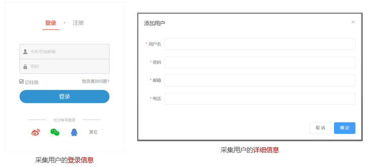
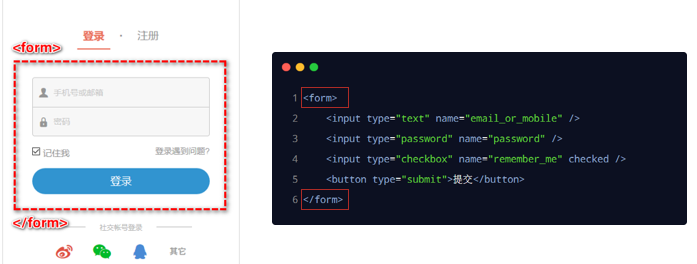
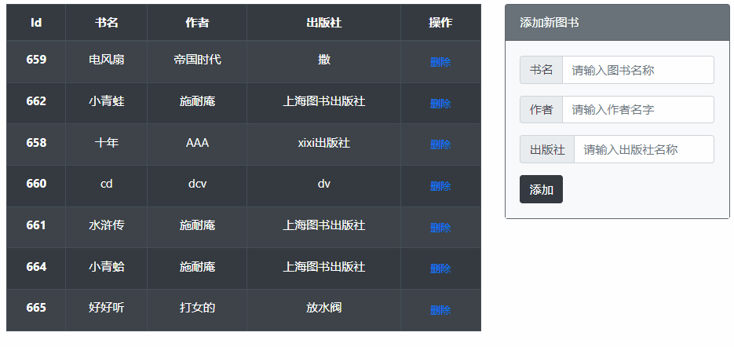
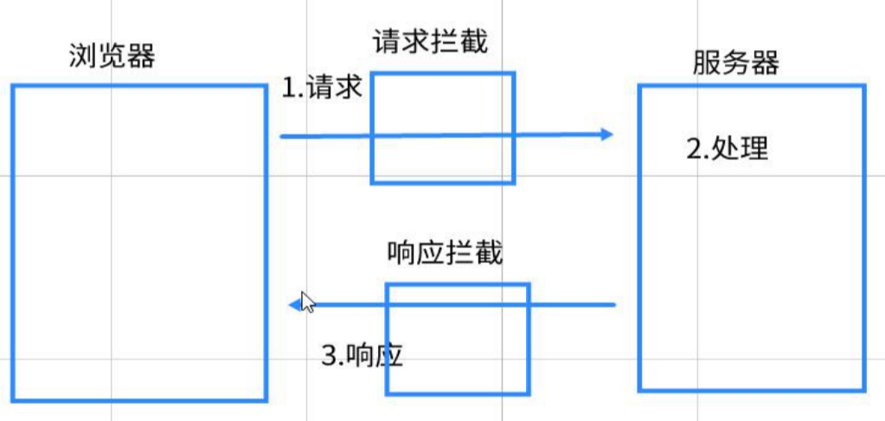
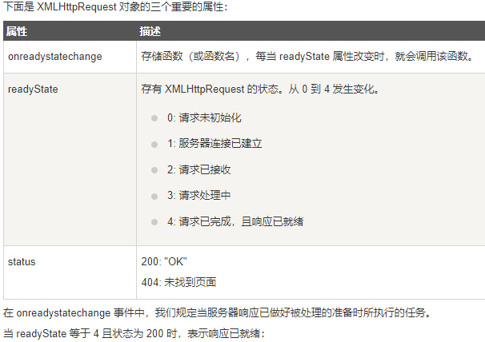

# 1. form表单（现在只用来采集数据，提交到服务器由ajax来完成）

在网页中，表单主要负责数据采集功能



## 1.1. 表单三要素
表单由三部分组成：表单标签、表单域、表单按钮

1. 表单标签`<form></form>`

   HTML 的 `<form>` 就是表单标签，它是一个“容器”，用来将页面上指定的区域划定为表单区域

   

2. 表单域

   表单域提供了采集用户信息的渠道，常见的表单域（每个输入标签为一个表单域）有：input、textarea、select 等

3. 表单按钮
当表单数据填写完毕后，用户点击表单按钮，会触发表单的提交操作，从而把采集到的数据提交给服务器
button标签的注意点：
	* type="submit" 表示提交按钮的意思
	* type 属性的默认值就是 submit，因此 type="submit" 可以省略不写
input标签也可以设置type的值称为表单按钮
## 1.2. form表单标签的属性
`<form>` 标签最重要的 3 个属性分别是 action、method 和 enctype
属性值|可选值|说明
-|-|-
action|接口的url地址|把表单采集到的数据，提交到哪个接口中
method|GET 或 POST|数据的提交方式（默认值为 GET）
enctype|application/x-www-form-urlencoded<br/>multipart/form-data（文件上传）
text/plain（很少用）|数据的编码格式。具体指的是： <br/>把表单数据提交给服务器之前，如何对将要提交的数据进行编码<br/>（默认值application/x-www-form-urlencoded）

enctype 属性只能搭配POST提交方式一起使用；如果是GET提交，则enctype 没有意义

说明：表单的默认跳转会导致整个页面发生跳转，跳转到了action 属性所指向的 url 地址l用户无法停留在当前的页面，导致体验很差

现在流行：

* `<form>` 表单只负责采集数据
* Ajax 负责将数据提交到服务器（符合：职能单一的原则）
需要调用事件对象的preventDefault方法禁止表单的默认跳转（一般直接给表单按钮添加，现在不用监听submit事件了）

# 2. 综合案例：图书管理



需求：

1. 页面一加载,ajax请求所有图书列表
	技术点：数据驱动渲染页面
2. 点击添加按钮 ： 添加图书
	技术点: 获取表单里面的参数
3. 点击删除按钮 ： 删除图书
	技术点: 动态新增按钮无法直接注册事件,需要使用 事件委托
4. 页面所有的ajax请求都需要loading效果
	技术点: axios拦截器使用

细节：表单非空判断、阻止表单按钮默认跳转、点击后表单需要reset

> 本案例实现了一个功能封装一个函数的需求

## 2.1. 查询图书列表

可以部分封装也可以将 **页面渲染** 和 **向服务器请求数据** 封装成一个函数。最好分开封装实现**函数功能模块化**

```js
// 1.页面一加载，查询最新图书列表

    // 函数（1）封装渲染数据函数
    const renderData = (arr) => {
      document.querySelector('tbody').innerHTML = arr.map(item => ` <tr>
              <th scope="row">${item.id}</th>
              <td>${item.bookname}</td>
              <td>${item.author}</td>
              <td>${item.publisher}</td>
              <td>
                <button type="button" class="btn btn-link btn-sm" data-id="${item.id}">
                  删除
                </button>
              </td>
            </tr>`).join('')
    }
    // 发送ajax请求 axios({}).then()
    // 函数（3）封装请求最新数据函数（无参无返回）
    const getBookList = () => {
      axios({
        method: 'get',
        url: 'http://www.liulongbin.top:3006/api/getbooks'
      }).then(({
        data: {
          data: res
        }
      }) => {
        console.log(res)
        renderData(res)
      })
    }
    // 页面一加载，axios请求图书列表
    getBookList()
```

## 2.2.  封装函数获取表单参数

表单数据一般发送ajax的参数，用对象存储起来

```js
let inputList = document.querySelectorAll('form input')
    // 函数（2）封装获取表单参数列表函数
    const getFormData = () => {
      let obj = {}
      //伪数组只有forEach方法但是最好转换一下
      Array.from(inputList).forEach(item => {
        obj[item.name] = item.value //对象赋值不能使用点语法，变量获取要使用中括号语法
      })
      return obj
    }
```

## 2.3. 新增图书

表单按钮别忘了阻止表单默认跳转

非空判断时，使用Object.values方法遍历对象的属性值到一个数组

```js
// 表单按钮注册事件
    document.querySelector('form .btn-dark').addEventListener('click', function (e) {
      // 0.阻止表单默认跳转
      e.preventDefault()
      // 1.获取表单参数
      let data = getFormData()
      console.log(data)
      // 2.非空判断（使用Object.values方法遍历对象的属性值到一个数组）
      // 做一下非空判断，一个input用==。两个用||，三个及以上用开关思想（some）
      if (Object.values(data).some(item => item == '')) {
        return alert('输入框不能为空')
        // 这里没必要清空输入框，用户可以继续输入
      }
      //3.发送ajax来添加图书
      axios({
        url: 'http://www.liulongbin.top:3006/api/addbook',
        method: 'post',
        data //ES6解构赋值，data:data（属性名属性值相等）
      }).then(res => {
        console.log(res)
        if (res.data.status != 201) {
          return alert(`${res.data.msg}`)
        }
        // 新增成功，重新请求图书列表
        getBookList() //渲染代码时回调函数，所以下面的代码先执行，先alert
        // 最后清空输入框
        /* Array.from(inputList).forEach(item => item.value = '') */
        // 清空表单
        document.querySelector('form').reset()
        alert(`${res.data.msg}`)
      })
    })
```

## 2.4. 删除图书

运用事件委托，为新增的节点注册事件注意不能使用this，this指向父元素。e.target指向子元素

事件委托：**给父元素注册事件，委托给子元素处理**

用自定义属性传递每一个tr的id值

```js
document.querySelector('tbody').onclick = function (e) {
      if (e.target.classList.contains('btn-sm')) {

        let id = e.target.getAttribute('data-id')
        console.log(id)
        // 先发送ajax请求删除数据
        axios({
          method: 'get',
          url: 'http://www.liulongbin.top:3006/api/delbook',
          params: {
            id
          }
        }).then(res => {
          console.log(res)
          if (res.data.status != 200) {
            return alert('删除失败')
          }
          // 在发送ajax请求最新图书列表（多人操作）
          alert('删除成功')
          getBookList()
        })
        return
      }
    }
```

## 2.5. loading效果

对每个接口都要进行这两步，万一页面有几百个接口，太麻烦，使用拦截器来实现

```js
//显示loading : ajax发送之前
        document.querySelector(".loading-box").style.display = "block"
//隐藏loading : 服务器响应之后
		setTimeout(function(){
    document.querySelector(".loading-box").style.display = "none"
		},500)
```

## 2.6. axios拦截器使用

### 2.6.1. axios拦截器的介绍

拦截器（interceptors）用来全局拦截 axios 的每一次请求与响应

好处：可以把每个请求中，某些重复性的业务代码封装到拦截器中，提高代码的复用性

axios中文文档传送门：[axios拦截器](http://axios-js.com/zh-cn/docs/#%E6%8B%A6%E6%88%AA%E5%99%A8)

> 需要使用时直接从官网复制粘贴，代码只能多不能少

```js
// 添加请求拦截器
axios.interceptors.request.use(function (config) {
    // 在发送请求之前做些什么
    document.querySelector('.loading-box').style.display = 'block'
    return config;//本次请求的配置信息
  }, function (error) {
    // 对请求错误做些什么（一般为网络错误）
    return Promise.reject(error);
  });

// 添加响应拦截器
axios.interceptors.response.use(function (response) {
    // 对响应数据做点什么
    document.querySelector('.loading-box').style.display = 'none'
    return response;//服务器响应数据
  }, function (error) {
    // 对响应错误做点什么(一般为网络错误)
    return Promise.reject(error);
  });
```

如果你想在稍后移除拦截器，可以这样

```js
//拦截器使用时返回一个和定时器一样的编号，用来清除用
const myInterceptor = axios.interceptors.request.use(function () {/*...*/});
axios.interceptors.request.eject(myInterceptor);

const myInterceptor = axios.interceptors.response.use(function () {/*...*/});
axios.interceptors.response.eject(myInterceptor);
```



### 2.6.2. axios拦截器执行流程

axios拦截器执行流程（一般放在所有发送ajax的最顶部）
1. axios发送请求
2. 执行请求拦截器（发送服务器之前执行）
3. 发送给服务器
4. 服务器响应请求
5. 执行响应拦截器（then方法之前执行）
6. 执行axios的then方法

## 2.7. axios基地址
基地址，也叫请求根地址。一个公司所有的接口文档前面相同的部分

设置axios全局基地址：如果url有设置地址，优先使用你设置的，没有才会用全局基地址（万一一个项目中有一两个不是公司的服务器地址）

基地址和拦截器一起写在代码的开头
```js
axios.defaults.baseURL = 'http://www.liulongbin.top:3006'
```
设置了之后axios代码块中的url地址只需要写后面的资源路径即可`url: '/api/getbooks'`


# 3. ajax补充知识点（面试点）

## 3.1. onreadstatechange事件

菜鸟教程传送门：https://www.runoob.com/ajax/ajax-xmlhttprequest-onreadystatechange.html



1. onload事件 ：  接收服务器响应数据后（一次请求，只会执行一次）

2. onreadystatechange事件 : 作用与onload事件一致（一次请求，会执行多次）

```js
       //（1）.实例化ajax对象
       let xhr = new XMLHttpRequest()
   
       console.log(xhr.readyState) //0
   
       //（2）.设置请求方法和地址
       xhr.open("post", "http://www.liulongbin.top:3009/api/login")
   
       console.log(xhr.readyState) //1
   
       //（3）.设置请求头（post请求才需要设置）
       xhr.setRequestHeader("Content-type", "application/x-www-form-urlencoded")
       console.log(xhr.readyState)
       //（4）.发送请求 ： 参数格式  'key=value'
       xhr.send("username=admin&password=123456")
       //（5）.注册回调函数
       //a. onload 是新式浏览器才支持的
       //b. 如果要兼容更早的浏览器，可以使用 onreadystatechange
       //c. onreadystatechange触发时机 ： xhr.readState状态变化
       // xhr.onload = function() {};
   
       xhr.onreadystatechange = function () {
         console.log(xhr.readyState)
         //onreadystatechange会触发多次，一般需要判断xhr.readState == 4 才获取响应数据
         if (xhr.readyState == 4) {
           // xhr.response包括响应头和响应体
           console.log(xhr.responseText)
         }
       }
```

XMLHttpRequest对象的状态码（xhr.readyState）
0: 请求未建立  （创建了xhr对象，但是还没调用open）
1: 服务器连接已建立 （open之后）
2:请求已接收  （send之后,服务器已经接收了请求）
3:请求处理中 
4:请求已完成，且响应已就绪 （ 4状态码等同于onload事件 ）

## 3.2. ajax组成部分（了解）

Ajax(阿贾克斯)：全称  Asynchronous Javascript And XML(异步的js与xml)

通俗地说：用js发送异步的网络请求

* **A :  Asynchronous  异步**
	* 同步 ： 指的是代码按照从上往下顺序执行
	* 异步 ： 代码不会立即执行,而是要等一会儿执行
	* 目前我们学过的ECMAScript只有两个语法是异步的：  定时器 与  ajax
	* DOM事件也是属于异步的，但是这个是属于DOM的执行机制。所以一般在讨论js同步和异步的时候，主要以js为主，DOM一般不讨论。

* **J：Javascript**

* **A ：And**

* **X :  XML 与 XMLHttpRequest**
	* XML ： 解决跨平台数据传输（xml（全是自定义标签）是html的亲戚语言，也是一种标记语言，需要用dom来解析）
	* 在JSON没有出来以前, 网络传输主要以XML格式数据为主。  后来JSON问世，逐渐取代XML。 但是由于ajax技术出来的比json早，因此xml这个称呼一直保留至今

## 3.3. gei与poat请求区别（重点掌握）

POST 为了能够提交大量的数据，所以没有把数据拼接到URL的末尾，而是放到了独立的“请求体”中

不同点|get|post
-|-|-
传参方式|在url后面拼接（请求行） 请求行参数：随着url一次性传过去|在请求体传参 请求体参数：分为很多次上传（随着数据流一次次传输 很多片）
大小限制|有大小限制，不同浏览器大小限制不同。 一般2-5 MB（查询事件）|没有大小限制（文件上传）（增减）
安全性|参数直接暴露在url，不安全（一般查询类数据都是get）|参数在请求体中，更加安全（一般登录注册必须是post）
传输速度|传输速度快|传输速度慢

记忆方法：get参数在url中传递，轻量很快，但太暴露不够安全，传递的数据太小

从方法、速度、安全性和数据大小四个方向来说

## 3.4. 其他请求方法了解（掌握）

实际开发中，前端无权决定请求方法，只需要根据后台接口文档来就可以了

| 请求方式 | 描述                                           | 特点            |
| -------- | ---------------------------------------------- | --------------- |
| post     | 一般用于新增数据（提交数据）                   | 请求体传参      |
| get      | 一般用于查询数据（查询数据）                   | 请求行(url)传参 |
| delete   | 一般用于删除数据（删除服务器上的数据）         | 请求体传参      |
| put      | 一般用于更新全部数据（例如更新用户的全部信息） | 请求体传参      |
| patch    | 一般用于更新局部数据（例如只更新用户的手机号） | 请求体传参      |

get用params，post'用body，其他方法具体看接口文档，params是查询query参数，data是请求体body参数

# 4. 今日接口文档

图书管理基地址：http://www.liulongbin.top:3006

### 1 图书列表

* 接口URL：  /api/getbooks
* 调用方式： GET
* 参数格式：

| 参数名称  | 参数类型 | 是否必选 | 参数说明 |
| --------- | -------- | -------- | -------- |
| id        | Number   | 否       | 图书Id   |
| bookname  | String   | 否       | 图书名称 |
| author    | String   | 否       | 作者     |
| publisher | String   | 否       | 出版社   |

* 响应格式：

| 数据名称   | 数据类型 | 说明                     |
| ---------- | -------- | ------------------------ |
| status     | Number   | 200 成功；500 失败；     |
| msg        | String   | 对 status 字段的详细说明 |
| data       | Array    | 图书列表                 |
| +id        | Number   | 图书Id                   |
| +bookname  | String   | 图书名称                 |
| +author    | String   | 作者                     |
| +publisher | String   | 出版社                   |

* 返回示例：

```json
{
  "status": 200,
  "msg": "获取图书列表成功",
  "data": [
    { "id": 1, "bookname": "西游记", "author": "吴承恩", "publisher": "北京图书出版社" },
    { "id": 2, "bookname": "红楼梦", "author": "曹雪芹", "publisher": "上海图书出版社" },
    { "id": 3, "bookname": "三国演义", "author": "罗贯中", "publisher": "北京图书出版社" }
  ]
}

```

### 2 添加图书

* 接口URL：  /api/addbook
* 调用方式： POST
* 参数格式：

| 参数名称  | 参数类型 | 是否必选 | 参数说明 |
| --------- | -------- | -------- | -------- |
| bookname  | String   | 是       | 图书名称 |
| author    | String   | 是       | 作者     |
| publisher | String   | 是       | 出版社   |

* 响应格式：

| 数据名称 | 数据类型 | 说明                         |
| -------- | -------- | ---------------------------- |
| status   | Number   | 201 添加成功；500 添加失败； |
| msg      | String   | 对 status 字段的详细说明     |

* 返回示例：

```json
{
    "status": 201,
    "msg": "添加图书成功"
}
```

### 3 删除图书

* 接口URL：  /api/delbook
* 调用方式： GET
* 参数格式：

| 参数名称 | 参数类型 | 是否必选 | 参数说明 |
| -------- | -------- | -------- | -------- |
| id       | Number   | 是       | 图书Id   |

* 响应格式：

| 数据名称 | 数据类型 | 说明                                                         |
| -------- | -------- | ------------------------------------------------------------ |
| status   | Number   | 200 删除成功；500 未指定要删除的图书Id；501 执行Sql报错；502 要删除的图书不存在； |
| msg      | String   | 对 status 字段的详细说明                                     |

* 返回示例：

```json
{
    "status": 200,
    "msg": "删除图书成功！"
}
```


 

