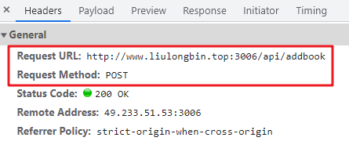

# 1. Ajax工作原理（面试点）

ajax原理： 设置http请求报文的过程

## 1.1. http协议原理与ajax工作原理详解

HTTP : 全称 网络传输协议（协议 ： 约定 数据传输格式（或者规范））

HTTP协议组成部分：请求报文和响应报文

现在比较流行的是HTTP 1.1版本

### 1.1.1. 请求报文三个组成部分（请求行不一样）

**请求报文规定了客户端以什么格式把数据发送给服务器**


请求行 ： 包含请求方法, URL, 协议版本

请求头 ： 浏览器告诉服务器，我给的数据是什么格式 （content-type在请求头中 有的get因为只是查询数据，不需要告诉，只有设备信息）

请求体 ： post请求参数在请求体中，get直接在url中拼接（传输的数据都存在请求体中，参数）

> GET 请求比较特殊，它只有请求头，没有请求体（参数在url中拼接）

### 1.1.2. 响应报文三个组成部分

**响应报文规定了服务器以什么格式把数据响应给客户端**

MDN状态码传送门：[https://developer.mozilla.org/zh-CN/docs/Web/HTTP/Status/](https://developer.mozilla.org/zh-CN/docs/Web/HTTP/Status/)


响应行（状态行） ： 包含协议版本, 服务器的状态码，状态码描述（网络状态）如下：

* 2开头 ： 请求成功  绿色
  * 200 请求成功
  * 201 请求成功
  * 204 请求成功（常用于204和200搭配post请求传两次状态码开始传204，数据流传完后传200）

* 3开头 ： 重定向（服务器遇到无法响应的地址，服务器自动修改地址栏的url跳转地址）   橙色
  * 302

* 4开头 ： 前端问题  红色 
  * 400参数或请求参数错误   
  * 401 没有权限 （身份认证未通过）
  * 402/403 没有权限（细微差别）
  * 404 url错误 ，服务器无法找到资料
  * 405请求方法错误  
  * 413 请求体的数据太大

* 5开头 ： 后台问题 红色 
  * 500 服务器宕机bug,可以理解为后台代码爆红

响应头 ： 服务器告诉浏览器，我给你的数据是什么格式 （浏览器会自动识别 如果是html就自动渲染  文本、json、图片、音视频，json会自动转换成对象）

响应体 ： 后台响应的数据，一般是json格式

### 1.1.3. http响应状态码和业务状态码区别

1. 所处的位置不同

* 在响应头的状态行中所包含的状态码，叫做“响应状态码”

* 在响应体的数据中所包含的状态码，叫做“业务状态码”


2. 表示的结果不同
* 响应状态码只能表示这次请求的成功与否（成功或失败了）
* 业务状态码用来表示这次业务处理的成功与否


3. 通用性不同

* 响应状态码是由 http协议规定的，具有通用性。每个不同的状态码都有其标准的含义，不能乱用
* 业务状态码是后端程序员自定义的，不具有通用性

      

### 1.1.4. 请求报文与响应报文在谷歌调试工具中network的具体位置

1.get请求行


1.post请求行



2.响应行


响应头和请求头


post请求体（用来存参数，get请求体在url中拼接参数）只有post才有这个目录


响应体response

preview是更具格式化的响应体


## 1.2. 一个页面从输入url到呈现过程
课后学习传送门（一个网站从输入网址到呈现页面完整流程）
<https://www.jianshu.com/p/c93d47c26a81>

课后学习传送门： 查看各种响应状态码含义
https://developer.mozilla.org/zh-CN/docs/Web/HTTP/Status/100

这不是ajax，属于向服务器发送请求的四种方式之一， 地址栏、a标签、location.href、 ajax

1. DNS域名解析： 将url中的域名解析成ip地址

2. TCP三次握手： 建立安全可靠的网络传输协议

​            什么是TCP，一种传输控制协议（传输层）

​            保证http网络传输是安全+可靠的（检测客户端与服务器的网卡是不是通的）

3. HTTP建立连接 

​          3.1 客户端发送请求（发出http请求报文）

​          3.2 服务器处理请求

​          3.3 服务器响应请求（收到http响应报文）

4. 渲染引擎开始渲染响应返回的HTML文本

​            4.1.解析html生成dom树

​            4.2.解析css生成样式树

​            4.3.dom树和样式树合并成渲染树

​            4.4.呈现页面

5. 断开链接 TCP四次挥手

### 1.2.2. TCP三次握手


* （1）客户端发送一个SYN=1, Seq=X的数据包到服务器端口(第一次握手, 由浏览器发起, 告诉服务器我要发送请求了)

* （2）服务器返回一个带有SYN=1, ACK=X+1, Seq=Y的响应包来传达确认信息(第二次握手, 由服务器发起, 告诉浏览器我准备接受了, 你可以发送请求了)

* （3）客户端再回传一个ACK=Y+1, Seq=Z的数据包, 代表"握手结束"(第三次握手, 由浏览器发送, 告诉服务器, 我收到服务器的请求了, 现在马上发送请请给服务器)通常在这个阶段会传递收据

### 1.2.3. TCP四次挥手


* （1）发起方向被动方发送报文，Fin、Ack、Seq，表示已经没有数据传输了。并进入 FIN_WAIT_1 状态。(第一次挥手：由浏览器发起的，发送给服务器，我请求报文发送完了，你准备关闭吧)

* （2）被动方发送报文，Ack、Seq，表示同意关闭请求。此时主机发起方进入 FIN_WAIT_2 状态。(第二次挥手：由服务器发起的，告诉浏览器，我请求报文接受完了，我准备关闭了，你也准备吧)

* （3）被动方向发起方发送报文段，Fin、Ack、Seq，请求关闭连接。并进入 LAST_ACK 状态。(第三次挥手：由服务器发起，告诉浏览器，我响应报文发送完了，你准备关闭吧)

* （4）发起方向被动方发送报文段，Ack、Seq。然后进入等待 TIME_WAIT 状态。被动方收到发起方的报文段以后关闭连接。发起方等待一定时间未收到回复，则正常关闭。(第四次挥手：由浏览器发起，告诉服务器，我响应报文接受完了，我准备关闭了，你也准备吧)

# 2. 文件上传

## 2.1. FormData对象

MDN传松门：[https://developer.mozilla.org/zh-CN/docs/Web/API/FormData](https://developer.mozilla.org/zh-CN/docs/Web/API/FormData)

使用`FormData()`构造函数创建一个新的 `FormData` 对象，以键值对的方式存储数据

调用 FormData 对象的 `append(键, 值) `方法，可以向空白的 FormData 中追加键值对数据（不会覆盖原值，而是新增一个值）

作用：FormData 配合 Ajax 技术，能够向服务器发送 multipart/form-data 格式（自动向请求头添加）的请求体数据（Ajax 实现文件上传的时候，请求体的编码格式必须是 multipart/form-data）

```js
const  fd  =  new  FormData()  // 创建一个空白的 FormData 对象，里面没有包含任何数据
fd.append('avatar', 图片文件)  // 键是 avatar       值是文件类型（多文件可以一个属性名，多个文件用逗号隔开）
```

> 注意添加的键名要和接口文档里面的参数名同名，这样才能直接把fd当做post请求中data的值（FormData对象也可以用来传普通数据，但是没必要，开发中常用来上传文件）


## 2.2. 文件上传具体执行流程

文件上传一般都要结合file表单来实现`<input type="file" id="iptFile" accept="image/*" />`

accept 属性表示可选择的文件类型，image/* 表示只允许选择图片类型的文件。加上multiple属性可以实现多选（接口需要支持上传多张图片）

前置知识：

1. file表单：默认点击事件，作用是选择文件
2. 上传文件必须使用原生的FormData对象
	* 文件需要设置单独的请求头：multipart/form-data
	* 文件是以二进制文件传输的（文本是utf-8编码，但是文件不是）
3. file表单有特定的onchange事件，在选择了文件之后触发（检测什么时候传了文件）

文件上传流程：

1. 在file表单的onchange事件获取用户选择的图片`this.files[0]`是一个对象
2. 创建formData对象（自动帮忙创建请求头），将图片添加到fd对象中
`let fd = new FormData()`
`fd.append('接口参数',文件数据)`
3. ajax发送请求，参数必须是FormData对象

> 文件上传一定是post请求

```js
   document.querySelector('#iptFile').onchange = function () {
      console.log(this.files)
      console.log(this.files[0]) //伪数组，获取的是上传的文件，如果file表单没有加multiple属性，则为长度为1的伪数组this.files[0]获取它。获取的是包含这个文件基本信息的对象
      let fd = new FormData()
      //调用FormData对象的append方法为对象添加成员，这里的属性名取决文件上传接口文档里面的参数名
      fd.append('avatar', this.files[0])

      // 发送ajax
      axios({
        url: 'http://www.liulongbin.top:3009/api/upload/avatar',
        method: 'post',
        // 需要放到xhr的send方法里面
        data: fd
      }).then(res => {
        //成功回调
        console.log(res)
        // 显示上传的图片，记得加上基地址（有的会有完整地址）
        document.querySelector('img').src = `http://www.liulongbin.top:3009${res.data.url}`
      })
    }
```

## 2.3. 自定义上传文件按钮

自定义文件上传按钮思路
1. 隐藏file表单（设置display为none）
2. 给自定义按钮注册点击事件，点击注册file表单“默认”点击事件
	* 触发注册点击事件 `dom对象.onclick()`
	* 触发自带“默认”点击事件（有注册事件先触发注册的常用来触发默认点击） `dom对象.click()`（a标签、form标签里面的按钮、file表单按钮）

只需要加上一个事件即可，然后让file表单按钮自动执行默认点击事件

```js
document.querySelector('#btnChoose').onclick = function () {
      document.querySelector('#iptFile').click()
    }
```

另外：可以使用html的label标签来绑定（不需要加上额外的点击事件）

```html
<!-- label标签绑定id值 -->
        <label for="iptFile">
            
        </label>
		<input type="file" id="iptFile" accept="image/*" style="display: none;">

<!-- label标签把别的标签包起来 去掉标签的for属性-->
	<label>
        
        <input type="file" id="iptFile" accept="image/*" style="display: none;">
    </label>
```

# 3. 英雄管理


## 3.1. 搜索功能

`onkeydown`事件就是简单的监听键盘按下，一般是要监听哪个键盘按键

`oninput`是监听输入框输入的内容，一般是实时地监听输入字数或内容

```js
    axios({
      url: 'https://autumnfish.cn/api/cq/page',
      method: 'get',
      params: {
        pageNum: 1,
        pageSize: 20
      }
    }).then(res => {
      //成功回调
      console.log(res)
      renderData(res.data.list)
    })
    // 函数（1）封装渲染页面函数
    const renderData = (arr) => {
      document.querySelector('tbody').innerHTML = arr.map(item => `
       <tr>
       <td></td>
       <td>${item.name}</td>
       <td>${item.skill}</td>
       </tr>
       `).join('')
    }

    // 2.搜索英雄列表
    document.querySelector('.search.form-control').onkeydown = function (e) {
      if (e.key == 'Enter') {
        axios({
          url: 'https://autumnfish.cn/api/cq',
          method: 'get',
          params: {
            query: this.value
          }
        }).then(res => {
          //成功回调
          console.log(res)
          renderData(res.data.list)
        })
      }
    }
```

## 3.2. 文件预览与文件新增功能

### 3.2.1.文件预览功能（由四个固定的格式组成）

使用`URL.createObjectURL()`将文件对象转成url路径，这个路径只能在文件内部使用，并不是一个http地网络地址

注意需要先使用`onchange`事件监听文件地选择

1. 1.file表单注册onchange事件
2. 获取用户选择的文件
3. 将file对象转成url路径
4. 将url路径设置给img标签的src

```js
// 1.file表单注册onchange事件
    document.querySelector('.file-input').onchange = function () {
      // 2.获取用户选择的文件
      let file = this.files[0] //file对象
      // 3.将file对象转成url路径（这个路径只能在文件内部使用，并不是一个http的路径）
      let url = URL.createObjectURL(file)
      console.log(url)
      // 4.将url路径设置给img标签的src
      document.querySelector('.preview').src = url
    }
```

### 3.2.2. 文件新增

文件新增 点击新增，ajax提交数据（本质就是上传文件，一次性上传三个文件，所以需要一个不同的接口）

```js
document.querySelector('.btn-add').onclick = function (e) {
      // 阻止表单默认跳转
      e.preventDefault()
      // 创建FormData对象
      let fd = new FormData()
      // 为对象添加成员
      fd.append('heroName', document.querySelector('#heroName').value)
      fd.append('heroSkill', document.querySelector('#heroSkill').value)
      fd.append('heroIcon', document.querySelector('.file-input').files[0])
      // 发送ajax
      console.log(fd)
      axios({
        url: 'https://autumnfish.cn/api/cq/add',
        method: 'post',
        data: fd,
      }).then(res => {
        //成功回调
        console.log(res)
        if (res.data.code == 201) {
          alert(res.data.msg)
          location.href = './index.html'
        } else {
          alert(res.data.msg)
        }
      })
    }
```

# 4. 函数防抖和节流（面试点）

绑定的事件仍然被频繁触发，只是通过某种方法让代码在规定内执行

## 4.1. 防抖

单位时间内，频繁触发事件，只会触发最后一次

持续触发不执行（一般是事件），不触发的一段时间后执行。希望触发频率低一点（防止抖动）

好处：这样可以有效减少请求的次数，节省网络资源


函数防抖流程 ：
* 声明全局变量存储定时器ID
* 每一次触发事件, 先清除上一次定时器。 然后将事件处理代码放入本次定时器中

经典应用场景 ： 输入框输入事件（键盘输入事件每次都触发的）搜索框只在输入完后，才执行查询的请求

```js
		let timeID = null
        document.querySelector('input').oninput = function () {
            // oninput事件每次都触发
            // 先清除之前的清除定时器
            clearTimeout(timeID)
            // 开启本次定时器
            timeID = setTimeout(() => {
                // 里面使用箭头函数，this指向上层的作用域input表单标签
                console.log(`搜索内容是：${this.value}`)
            }, 500)
        }
```

实时监听输入字数不需要防抖，每次输入先清除原来的定时器，在重新开启一个定时器，上一次已输入和下一次未输入相隔500ms以上则上一次定时器代码执行

## 4.2. 节流

单位时间内，频繁触发事件，只会触发一次

持续触发也执行，只不过触发的频率变低了（节约流量，不一直触发，只在一段时间后触发一次）


经典应用场景 ： 滚动条事件（onscroll）或者鼠标移动（onmousemove不怎么用）

函数节流流程 ：
* 声明全局变量存储上一次触发交互时间

* 每一次触发事件, 获取当前时间  与 上一次时间做比较。判断是否超过节流间隔

* 如果 超过节流时间，则执行事件处理代码。 并且存储本次触发时间

```js
// 声明一个全局变量存储触发时间
        let lastTime = null

        window.onscroll = function () {
            // 每一次触发，先获取本次时间戳
            // +new Date()
            let currentTime = Date.now()
            // 判断当前时间与上一次触发时间是否超过时间间隔
            if (currentTime - lastTime >= 500) {
                console.log(document.documentElement.scrollTop)
                lastTime = currentTime
            }
        }

// 用定时器也可以执行，但是会开好多定时器，性能太差
```

## 4.3. 封装一个防抖函数

持续触发不执行，不触发一段时间后执行

```js
const div = document.querySelector('div')
const debounce = function(callback, time){
  let timer = null
  // 需要返回一个函数用来做事件处理函数，里面的e就是事件对象
  return function(e){
    // this => div dom对象
    clearTimeout(timer)
    timer = setTimeout(()=>{
      callback.call(this, e)
    }, time)
  }
}

// 防抖
// 持续触发不执行，不触发的一段事件后执行
div.onmousemove=debounce(function(e){
 const left = e.pageX - this.offsetLeft
 const top = e.pageY - this.offsetTop
this.innerHTML = `left:${left} top:${top}`
},1000)

```

## 4.4. 封装一个节流函数

持续触发也执行，但触发的频率变低了

```js
const div = document.querySelector('div')
const throttle = function(callback, time){
  let lastTime = null
  // 需要返回一个函数用来做事件处理函数，里面的e就是事件对象
  return function(e){
    // this => div dom对象
    let currentTime = Date.now()
    if(currentTime - lastTime > time){
      callback.call(this, e)
      lastTime = currentTime
    }
  }
}

// 节流
// 持续触发也执行，但触发的频率变低了
div.onmousemove=throttle(function(e){
 const left = e.pageX - this.offsetLeft
 const top = e.pageY - this.offsetTop
this.innerHTML = `left:${left} top:${top}`
},1000)
```

