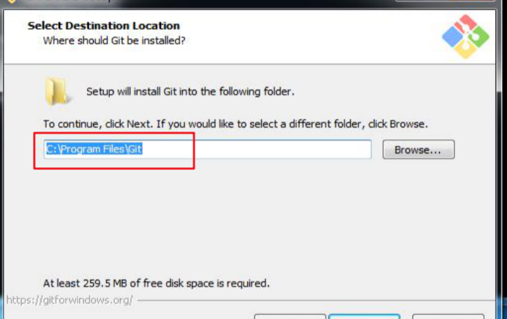
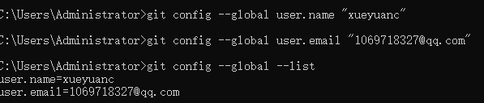
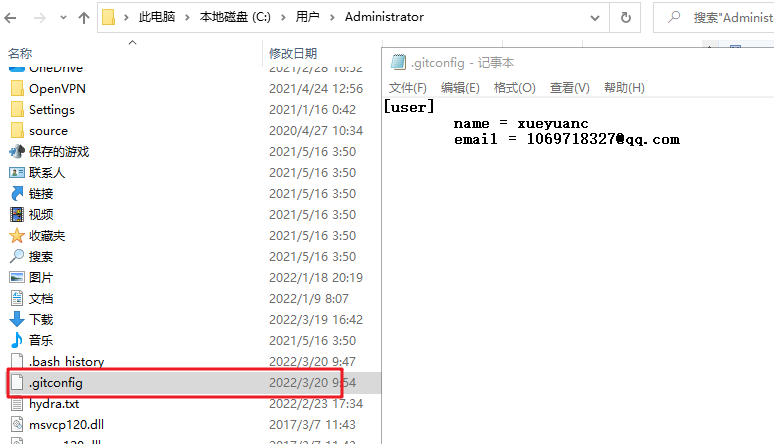
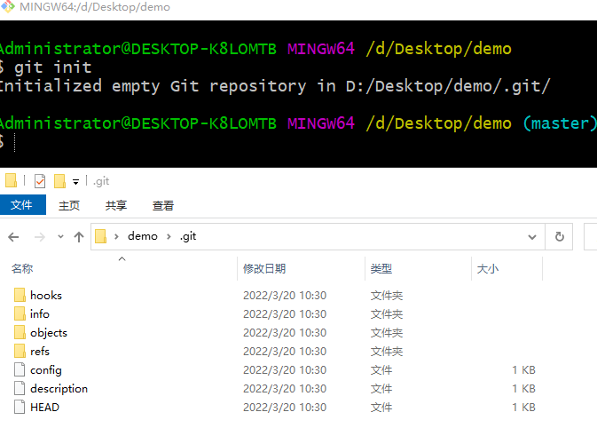

# 1. 版本管理系统介绍


## 1.1. 项目的版本

* 版本和我们平常说的软件、游戏等的版本是一个意思，比如 1.2.8 版本、比如 第1版，比如webstorm2020。
* 所以，版本指的就是代码编写进度当中的一些节点。
* 比如一个项目：
  * 搭建好目录结构 ---  第1版本
  * 完成登录页面布局 --- 第2版本
  * 完成登录功能 --- 第3版本
  * 完成分类页面布局 --- 第4版本
  * ...........

## 1.2. 管理版本

* 【记录】记录代码开发的过程，每一次代码的变化。
* 【回退】将代码回退到之前的版本
* 【查看】查看所有的版本
* 【协作】配合远程仓库，实现多人协作

## 1.3. 使用版本管理软件的必要性

工作场景一：项目的需求不断的变化，改来改去，也可能需要改回原来的代码。

* 使用版本管理软件
  * 可以对代码每次的改动做记录，记录一次，叫做形成一个版本。
  * 可以轻松的将代码回退到任意一个版本。（可以使用之前版本中的代码、文件）
  * 电脑关机了，版本也不会丢失。

工作场景二：多个合作开发，代码不好合并。

* 使用版本管理软件 + 远程仓库，可以解决多人合作的问题。

## 1.4. 版本管理软件的作用

* 记录代码的版本，可以随时回退。
* 配合远程仓库，实现多人协作，可以很轻松的合并代码

## 1.5. 版本管理软件分类

* 集中式，典型代表 SVN（本地只有最新的版本，以前内存太小）
* 分布式，典型代表 `Git`（现在计算机内存大了，可以存有项目生产过程中的所有版本）

# 2. git介绍与安装

Git是一个开源的**分布式版本控制系统**，是目前世界上最先进、最流行的版本控制系统。可以快速高效地处理从很小到非常大的项目版本管理

特点：项目越大越复杂，协同开发者越多，越能体现出Git的高性能和高可用性

## 2.1. git安装

安装包双击，然后一直下一步安装即可（不要修改安装路径，配置参数一律按照默认安装的路径和配置参数进行安装即可），以后界面化工具按照这个默认路径进行查找（如果修改了到时候也需要修改路径）

git安装之后不会出现可视化界面，只会多出几行可以调用的命令（并不是所有软件就会出现图形化界面）



### 2.2. 注意事项

* **不要安装到含有中文的路径中**。比如，不要安装到  “D:/软件/学习/Git”
* 安装完毕，绝对不可以剪切（移动）到其他文件夹。
* 比如安装到 `D:/aa/bb/cc` 文件夹，千万不要**重命名**路径中的任何一个文件夹
* 安装完毕，安装完之后需要重新打开命令行。鼠标在任何文件夹空白位置右键，如果出现 `Git Bash Here`，则表示安装成功。(或者点击“Git Bash Here” --> 输入 git --version  回车，如果看到版本号，则表示安装成功或者在电脑自带cmd中输入也可以)
* Mac用户，使用自带的终端。输入“git --version”，回车，如果看到版本号，则表示安装成功

> Mac用户需要额外配置一下：访达 -> 服务 -> 服务偏好设置 -> 勾选“新建位于文件夹位置的终端窗口”

注意计算机在安装了git之后，cmd和git bash都可以使用git命令
* cmd应用cd命令进入当前盘符下指定文件夹。跨盘符使用盘符加冒号`e：`
* `git bash here`可以直接进入到指定文件夹下进行操作（在目标文件夹里面操作，git命令生效的地方，git init初始化后此文件夹变成git仓库，也叫本地仓库），推荐使用

**也可以直接在编译器（如vscode）中打开终端，依然可以输入git命令（开发常用）**

## 2.2. 配置基本信息

Git软件在工作的时候，需要知道你是谁？所以需要设置一个用户名和邮箱。

这个用户名和邮箱，最好使用你的[github](https://github.com/)账号或[码云](https://gitee.com/)账号（如果你有账号的话），当然随便填也可以。

具体做法：

1. **任何**文件夹，空白处，右键 --> Git Bash Here
2. **依次**执行下面两行命令

```bash
git config --global user.name "xxx"
git config --global user.email "xxx"
```

配置之后，可以通过下面的命令来检查是否配置成功了（卸载git后配置信息仍然存在）

```bash
# 查看所有的全局配置项
git config --list --global

# 查看单个的配置项，比如查看用户名
git config user.name
```

**一定要加上 git config --global（设置全局配置，一次设置终生使用，不加的话，每次使用git都需要重新配置，修改的话直接在输入新的用户名邮箱覆盖原来的即可）**

`git config --global --list`查看全局配置（后面两个-- 顺序无所谓）





# 3. git进行版本控制

## 3.1. 初始化本地仓库（本地文件git init）

对文件夹进行git管理（把文件夹变成一个仓库）有两种办法

1. 将尚未进行版本控制的目录，用git来管理它（需要初始化后生成本地git仓库）

2. 克隆远程仓库的代码来管理（从其他服务器克隆一个已经存在的git仓库）

   

如果自己有一个尚未进行版本控制的项目目录，想要用 Git 来控制它，需要执行如下两个步骤：

1. 在项目目录中，通过鼠标右键打开“Git Bash”

2. 执行 git init 命令将当前的目录转化为 Git 仓库

`git init` 命令会创建一个名为` .git `的隐藏目录（需要电脑打开显示隐藏文件设置），**这个** **.git** **目录就是当前项目的** **Git** **仓库**，里面包含了初始的必要文件，这些文件是 Git 仓库的必要组成部分



> 修改文件后缀名，word或excel文件里面会有一些默认的状态，一般就记事本txt修改后缀名不会有多余的默认信息

## 3.2. 注意事项

注意点如下：

1. 注意：一定要在项目文件夹，右键-->`Git Bash Here`
2. 对于一个项目来说，初始化工作只需要做一次
3. 切记，不要项目套项目
4. `.git`文件不能删除