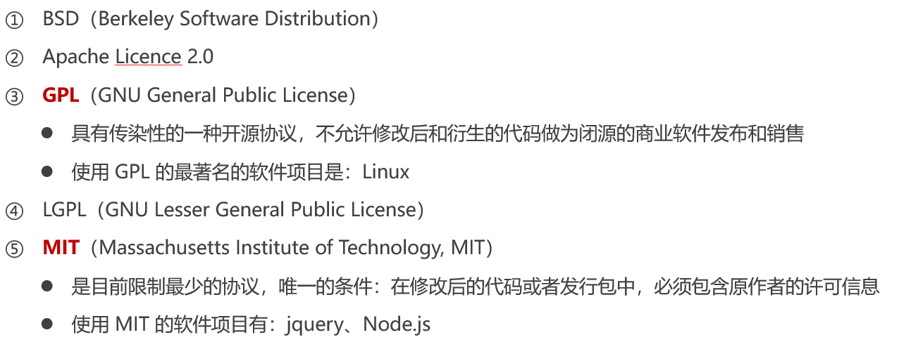

githuab源码里面可以去提issue，有问题的话，和作者面对面交互。用英语，很少用中文提issue。然后可以把代码拉下来提pr（pull request）作者采纳了就会合并你的代码。star数有几百就可以了，大的项目有几万就算很高的

# 1. git中的三个区域

1. 工作区
	* 工作区，指的是使用Git管理后的文件，这些文件显示在磁盘上，供我们使用或修改的区域。所以，粗略的说，项目文件夹就是工作区。
2. 暂存区
	* 执行 `git add .`之后，文件由工作区，添加到了暂存区。 暂存区保存了下次将提交的文件列表信息。
3. 本地仓库（git仓库）
	* 执行 `git commit -m '提交说明'` 之后，代码会被提交到仓库区。仓库区是 Git 中最重要的部分，代码只有提交到仓库，才会形成一次历史记录，即才会形成一个版本。

> 工作区有一个隐藏目录`.git`，这个不算工作区，而是Git的版本库。
>
> Git的版本库里存了很多东西，其中最重要的就是称为stage（或者叫index）的暂存区，还有Git为我们自动创建的第一个分支`master`，以及指向`master`的一个指针叫`HEAD`。

# 2. git工作区中文件的4种状态


Git 操作的终极结果：让工作区中的文件都处于“未修改”的状态。就是都提交了

`untracked`就是在项目文件夹中，但是未加入暂存区，或者未被提交过，需要加入暂存区后才算被git所管理

被跟踪的文件修改了之后会成为`modified`的状态，可以重新添加到暂存区，重新提交

* U --`Untracked`（新增的文件）
* M --`Modefied`（文件曾经被Git记录过了，然后在工作区对他进行了修改）
* A --`Staged`（文件添加到暂存区之后的状态）
* ! --有冲突（或者冲突解决了没提交）
* 未修改--文件后面不会有显示
* 已提交（nothing to commit）
  * 表示没有什么东西可以提交了；即所有的内容都已经提交过了
  * 有的文档也把这个状态叫做 **未修改**，意思是自上次提交过后，代码还没有修改过

窗口太小了，显示不下，按上下显示全部内容，但是无法退出了，按`q`退出查看（只能按q）

`ctrl+c`是结束终端命令的

> 本地git分为主分支master、功能分支、本地仓库（提交到本地仓库才算一个版本）。远程仓库分为主master分支和一些其他的分支

# 3. git命令详解

## 3.1. 基础操作

### 3.1.1 查看文件状态

`git status`查看文件的状态


`git staus -s` 查看文件状态（以精简的方式显示状态，用符号）


### 3.1.2. 文件添加到暂存区
`git add 文件名`将未跟踪的、已跟踪未修改、已修改（或者直接说工作区）的文件添加到暂存区

或者`git add .`将工作区所有文件（不包括未跟踪的文件）添加到暂存区


> `git add .`今后在项目开发中，会经常使用这个命令，将新增和修改过后的文件加入暂存区，不包括被删除的文件

` git add -u`update只将已跟踪的文件加到暂存区

`git add -A`添加整个工作区变更的文件，包括被删除的文件

> `git ls-files`     命令是用来查看暂存区中文件信息

### 3.1.3. 文件提交到本地仓库

`git commit -m "本次提交的消息"`将暂存区所有的文件提交到本地仓库，就形成了一个版本，每次提交都会有一个版本号。用来对提交的内容做进一步的描述


`clear`清除命令行


证明工作区中所有的文件都处于“未修改”的状态，没有任何文件需要被提交

```bash
$ git add -u 命令一样，未跟踪的文件是无法提交上去的
//同时add和提交
$ git commit -am "本次提交的说明"
```

碰到下面的情况时：编译器进入了vim模式，原因是git commit未指定说明信息。不编辑就会用默认的说明信息 w是保存q是退出，i是插入。输入之后直接`:wq``退出vim模式


### 3.1.4. 切换版本

查看历史版本，在版本的历史之间穿梭
`git log`查看提交日志 看是谁提交的（会有多条提交消息）打印的是历史版本（只能查看当前版本之前的）


`git reflog`查看所有版本

`git reset hard "版本号"`来切换版本，版本号在log里面查看，reflog只会有版本号的前几位也具有唯一性

`git reset --hard HEAD^`回退到上一个版本

### 3.1.5. 储藏文件

将所有文件应用`git add .`新增到暂存区之后

应用`git stash`临时将工作区文件的修改保存在堆栈中（git stash后文件直接消失工作区和暂存区都没有）

注意：`git stash -m "储藏信息"`只可以储藏暂存区内所有的文件

`git stash pop`将之前保存至堆栈中的文件取出来

**「使用场景：」** 当你接到一个修复紧急 bug 的任务时候，一般都是先创建一个新的 bug 分支来修复它，然后合并，最后删除。但是，如果当前你正在开发功能中，短时间还无法完成，无法直接提交到仓库，这时候可以先把当前工作区的内容 `git stash` 一下，然后去修复 bug（仍然创建新分支），修复后，再 `git stash pop`，恢复之前的工作内容。

弹出之后文件会存在暂存区内

### 3.1.6. 忽略文件

一般我们总会有些文件无需纳入Git的管理，也不希望它们总出现在未跟踪文件列表。
在这种情况下，我们可以创建一个名为` .gitignore` 的配置文件，列出要忽略的文件的匹配模式。


vue项目中会自动生成这个文件

* 以 # 开头的是注释
* 以 / 结尾的是目录（文件夹）
* 以 / 开头防止递归
* 以 ! 开头表示取反
* 可以使用 glob 模式进行文件和文件夹的匹配（glob 指简化了的正则表达式）

glob模式

* **星号 \*** 匹配零个或多个任意字符

* **[abc]** 匹配任何一个列在方括号中的字符 （此案例匹配一个 a 或匹配一个 b 或匹配一个 c）

* **问号** **?** 只匹配一个任意字符

* 在方括号中使用**短划线**分隔两个字符， 表示所有在这两个字符范围内的都可以匹配（比如 [0-9] 表示匹配所有 0 到 9 的数字）

* **两个星号 \**** 表示匹配任意中间目录（比如 a/**/z 可以匹配 a/z 、 a/b/z 或 a/b/c/z 等）

  

> 注意点：提交的时候这个文件也需要提交，你忽略的别人也要忽略

如果有的文件已经被Git管理了，而又想设置为忽略文件，则需要使用 `git rm --cached 文件名` 将文件从仓库中移除才有效。

## 3.2. 分支及分支命令

在进行多人协作开发的时候，为了防止互相干扰，提高协同开发的体验，建议每个开发者都基于分支进行项目功能的开发

在初始化本地Git仓库的时候，Git默认已经帮我们创建了一个名字叫做`master`的分支。通常我们把这个master分支叫做主分支（主分支和功能分支）

master主分支的作用是：**用来保存和记录整个项目已完成的功能代码**


> **实际开发中，正规的公司，都不允许直接在master分支上开发。需要创建功能分支，开发人员在功能分支上开发，当新功能开发且测试完毕后，最后将代码合并回master主分支**

主分支（master）是基于提交（只有master有过至少一次提交到git仓库）产生的，功能分支是基于主分支产生的

### 3.2.1. 查看分支

`git branch`查看本地分支 ` *`星号是当前所处的分支位置


`git branch -a`查看本地分支和远程分支`all`

### 3.2.2. 创建分支

`git branch 分支名`创建分支，新分支中的代码和当前分支完全一样，此时仍然在主分支上

### 3.2.3. 切换分支

`git checkout 分支名`切换分支（checkout检查退出切换到别的分支）

`git checkout -b 分支名`新建分支并切换到该分支

> **切换分支之前，必须把当前分支的代码全部提交到仓库。**(（不提交git会报错，下次再从别处切换过来可能修改的代码就没了）（除了提交之外还有别的解决方案，剪切也可以）)
>
> 


新建的分支dev和pre都含有master的提交版本，在dev上提交是head指针指向dev的最新提交

### 3.2.4. 合并分支

合并分支特点：一个分支包含另一个分支的全部提交记录（合并也是只能合并本地git的东西，功能分支需要有提交记录）

一般就是将功能分支合并到master分支

合并是基于版本合并的也就是merge之后可以直接推向远程仓库

切换到master分支上，合并功能分支，将功能分支上的代码复制一份（原功能分支不会有任何影响）代码合并到master。原功能分支一定要有提交（会合并最新的提交，会拥有所有的版本），不然合并没什么意义

* 切换到master
* 执行 `git merge pre` ，即可把pre分支的代码合并到master

> 合并之后，master和pre分支的代码就回一样了（pre可以进行再开发）


> * 修改了代码（会认为是删除deletion了一行，并新增insertion了一行）
>
> * 输入前面几个字母按tab键可以自动补齐后面的

pre合并到master后，master拥有pre的提交版本和master自己之前的提交版本。

此时的pre因为是master之前分出来的分支，也会拥有和master一样的提交版本


**重点说一下合并冲突**

合并会产生冲突，两个人在不同的分支修改了同一个文件，都提交到了本地仓库（并且都合并到了master分支，冲突一定是它合并pre到master一次，另一个dev又合并到master了一次），合并其中一个分支时会有冲突。实际开发尽量避免，但是出现了仍然可以解决

1. 可以产生冲突的情况
	同时分两个分支，或者合并之前又分了另外一个分支（即master代码未改变），修改了同一个文件


2. 不会产生冲突的情况
	在合并了之后新开了一个分支（此时master分支的代码已经变了）


有冲突后文件文件后面产生感叹号，重新提交了之后冲突消失。**解决冲突之后需要重新提交到本地仓库**


合并的时候出现这种情况就是合并成功了先按`esc`再直接`:wq`退出即可

因为dev和pre都对这个文件进行了修改，而且pre已经合并到master了，所以在dev合并到master时会产生冲突（选择现在的修改|选择即将到来的修改|保存双方的修改，怎么解决视具体需求来决定）就是下面的情况二


两种情况：

**情况一：两个分支修改的代码不在同一个文件的同一行代码，出现下面的画面**


出现上述画面一，表示已经合并完成了，但是需要提交一次；

出现的框是让我们输入提交说明；

需要执行下面的操作：

* 按 `i` ，进入 “插入” 模式，就可以对画面中的文字进行修改了（直接输入也行）
* 按 “上下左右” 键，调整光标的位置，可以删除里面的内容，写自己的提交说明
* 上述画面中的 `# Please enter.....` 表示注释，可以不用理会
* 按 `Esc` 键，退出 “插入” 模式
* 直接输入 “`:wq`”，退出这个画面，从而完成合并。（一定是英文的冒号）

**情况二：两个分支修改了同一个文件的同一行代码，出现下面的画面**


出现上述画面二，表示正在合并中，但是遇到冲突了；

需要在代码中解决掉冲突，然后保存代码；

最后，需要提交一次；

具体做法：

* 打开有冲突的文件
* 去掉分割线，保存代码，表示解决了冲突（或者直接点击上方三个选项）
* 保存代码，执行 `git add .` 和 `git commit -m '提交说明'` 从而完成这个合并。


### 3.2.5. 删除分支

当把功能分支的代码合并到master主分支上以后，就可以使用如下的命令，删除对应的功能分支

1. 切换回master主分支

2. `git branch -d 分支名`可以删除已合并的分支

   有的分支提交了未合并，就无法删除，要使用`git branch -D` 分支名

## 3.3. 剖析分支原理

* 主分支 Master 主要用来版本发布

* 紧急修复分支Hotfix 线上 bug 修复分支

* 预发行版本 prerelease

* 发布分支 Release 可以认为是 master 分支的未测试版。比如说某一期的功能全部开发完成，那么就将 develop 分支合并到 release 分支，测试没有问题并且到了发布日期就合并到 master 分支，进行发布

* 开发分支 Develop 日常开发分支，该分支正常保存了开发的最新代码

* 功能分支 Feature 具体的功能开发分支，只与 develop 分支交互

### 3.3.1. 基本介绍

所有的圆圈就是一条版本的时间线，每个圆圈代表一个版本（commit到本地git仓库里才能为一个版本）

一开始的时候，`master`分支是一条线，Git用`master`指向最新的提交，再用`HEAD`指向`master`，就能确定当前分支，以及当前分支的提交点


每次提交，`master`分支都会向前移动一步，这样，随着你不断提交，`master`分支的线也越来越长

当我们创建新的分支，例如`dev`时，Git新建了一个指针叫`dev`，指向`master`相同的提交，再把`HEAD`指向`dev`，就表示当前分支在`dev`上（）（工作区的内容并没有改变，看起来像是复制了一份代码到dev上）


不过，从现在开始，对工作区的修改和提交就是针对`dev`分支了（master分支的工作区并没有改变），比如新提交一次后，`dev`指针往前移动一步，而`master`指针不变


完成了dev的开发工作，想要合并时，直接把`master`指向`dev`的当前提交（所以Git合并分支也很快！就改改指针，工作区内容也不变！）


合并完分支后，甚至可以删除`dev`分支。删除`dev`分支就是把`dev`指针给删掉，删掉后，我们就剩下了一条`master`分支。本次合并属于`Fast-forward`，Git告诉我们，这次合并是“快进模式”，也就是直接把`master`指向`dev`的当前提交，所以合并速度非常快。但当然，也不是每次合并都能`Fast-forward`，产生冲突时就不是

### 3.3.2. 冲突解决

* `dev`和`master`分支都修改了同一文件，需要手动解决一下冲突，就是保留那个分支的内容，需要自己选择，`git status`也可以告诉我们冲突的文件，Git用`<<<<<<<`，`=======`，`>>>>>>>`标记出不同分支的内容，我们修改如下后**记得保存**，再add再commit，

* `dev`和`master`分支修改了不同文件，master合并dev时会进入到vim模式，直接`esc`然后`:wq`退出就合并成功了

两个分支各自都有新的提交，`git log --graph`查看合并树和时间线


这种情况下，Git无法执行“快速合并”`Fast-forward`，只能试图把各自的修改合并起来，但这种合并就可能会有冲突，解决之后，成了如下的样子，然后可以继续之前的操作（操作功能分支）


通常，合并分支时，如果可能，Git会用`Fast forward`模式，但这种模式下，删除功能分支后，会丢掉分支信息。

如果要强制禁用`Fast forward`模式，Git就会在merge时生成一个新的commit，这样，从分支历史上就可以看出分支信息

在master分支上`git merge --no-ff -m "merge with no-ff" dev`


### 3.3.3. bug分支（储藏git stash）

储藏跟提交本地仓库的作用有时候是一样的，但是这样的，但是提交会增加一次提交版本log记录，很多时候会选择储藏

**第一种情况：每个bug都可以通过一个新的临时分支来修复，修复后，合并分支，然后将临时分支删除**

当接到一个bug时，很自然地，你想创建一个分支`issue-101`来修复它，但是，等等，当前正在`dev`上进行的工作还没有提交（没提交就不能切换分支，更别说创建分支）

Git还提供了一个`stash`功能，可以把当前工作现场“储藏”起来，等以后恢复现场后继续工作。在`dev`上执行命令`git stash`，用`git status`查看工作区，就是干净的（除非有没有被Git管理的文件），因此可以放心地创建分支来修复bug。

首先确定要在哪个分支上修复bug，假定需要在`master`分支上修复，就从`master`创建临时分支（先切换回master）`issue-101`，修复完成后，切换到`master`分支，并完成合并，最后删除`issue-101`bug分支

vscode储藏有时候出bug，储藏了文件没有消失，记得点源代码管理旁边的刷新按钮

> 只能储藏暂存区内所有的文件，`git stash -m "储藏信息"`可以`-m`加上储藏信息（和commit一样）
>
> 用`git stash list`查看储藏区的内容，一是用`git stash apply`（应用最新储藏的）应用储藏恢复，但是恢复后，stash内容并不删除，你需要用`git stash drop`（删除最新储藏的）来删除，另一种方式是用`git stash pop`弹出储藏（弹出最新储藏的），恢复的同时把stash内容也删了
>
> 可以多次stash，恢复的时候，先用`git stash list`查看，然后恢复指定的stash，`git stash apply stash@{0}`，pop的时候`git stash pop stash@{0}`用来弹出并删除指定的stash，弹出后的文件存在暂存区内

**第二种情况：git stash 可用来暂存当前正在进行的工作， 比如想pull 最新代码， 又不想加新commit，可以先stash起来当前工作区，弹出的时候可能会有冲突需要解决**

**第三种情况：想切换分支看看，又不想commit，可以先把所有本地修改储藏起来**

### 3.3.4. cherry-pick命令

在master分支上修复了bug后，我们要想一想，dev分支是早期从master分支分出来的，所以，这个bug其实在当前dev分支上也存在

同样的bug，要在dev上修复，我们只需要把`4c805e2 fix bug 101`这个提交所做的修改“复制”到dev分支。注意：我们只想复制`4c805e2 fix bug 101`这个提交所做的修改，并不是把整个master分支merge过来（issue-101bug分支合并到master后，版本也合并过去了）

使用命令`$ git cherry-pick 4c805e2`后，Git自动给dev分支做了一次提交，注意这次提交的commit是`1d4b803`，它并不同于master的`4c805e2`，因为这两个commit只是改动相同，但确实是两个不同的commit。用`git cherry-pick`，我们就不需要在dev分支上手动再把修bug的过程重复一遍

当然也可以先把dev工作现场储藏起来，把dev直接当做bug分支重现上述bug修复过程

### 3.3.5. Feature分支

添加一个新功能时，你肯定不希望因为一些实验性质的代码，把主分支搞乱了，所以，每添加一个新功能，最好新建一个feature分支，在上面开发，完成后，合并，最后，删除该feature分支。一般是merge到dev进行测试

**feature：**
　　只与develop交互，因为feature就是新版本开发为了升级和演进需要用的，里面的所有代码只能在发布新版本且经过测试的时候才合进去master，然后在master打tag表明所有新功能开发完毕，一次性合并。同时我们开发一般是不同的人开发不同的功能，因此各自都应该有自己的feature，然后断断续续并进develop所以，保证develop是个新功能持续集成的版本。

**hotfix：**

　　这个分支用来修复主线master的BUG，但是要注意的是，在旧版本的BUG，新版本也是存在的，因此develop分支也存在该BUG，具体来说就是V3R2和V3R3都有该BUG，因此，修复的时候必须要提交两个分支master和develop否则，后面需要rebase就麻烦了

### 3.3.6. 多人协作

* `master`分支是主分支，因此要时刻与远程同步；

* `dev`分支是开发分支，团队所有成员都需要在上面工作，所以也需要与远程同步；

* bug分支只用于在本地修复bug，就没必要推到远程了，除非老板要看看你每周到底修复了几个bug；

* feature分支是否推到远程，取决于你是否和你的小伙伴是否在上面开发。

总之，Git中，分支完全可以在本地自己藏着玩，是否推送，视你的心情而定

> 远程分支已经存在dev分支,直接本地的dev分支推向远程dev会报错（未关联未跟踪），远程不存在能成功并在远程新增一个远程dev分支，upstream上游分支就是与本地分支关联的远程分支，也叫做远程跟踪分支

补充远程的upstream分支（本地和远程分支的名称最好一致，习惯规范问题）

1. 设置当前分支（需要切换到当前分支）的upstream为origin远程仓库的dev分支
   1. `git branch --set-upstream-to=origin/dev`
   2. `git branch -u origin/dev`

2. 在推送（切换到当前分支，对当前分支进行操作关联）的同时，设置upstream
     推送master分支时，直接`git push origin master`是会报错的需要关联起来，默认用的是`git push -u origin master`-u是upstream的意思（关联后下次在某分支上提交到远程仓库同名分支直接`git push`即可）（含义是推送master分支到远程origin仓库master分支，并且建立本地分支master的upstream为origin/master，origin/master为远程的master分支，origin为远程仓库的地址）`git push -u origin login`表示本地的login分支推送到远程的login分支，远程没有的话就会自动新建

3. 不切换分支设置其他分支的upstream，设置本地`pre`的远程跟踪分支为`origin/pre`
    `git br -u origin/pre pre`

  > 使用`git remote show origin`查看跟踪关系 `git branch -a`查看全部分支 `git remote -v`查看远程地址（可以fetch和pull的）


`Remote branches`表示远程仓库的分支，tracked表示已被跟踪，`git pull`表示upstream跟踪分支

**---------------------------------------------------------------------------------------------------------------------------------------------------------**

多人协作时，大家都会往`master`和`dev`分支上推送各自的修改，从远程克隆（只能克隆origin/master）`git clone`时仓库到本地时，会自动新建一个本地master分支，并把远程仓库地址存在变量origin中，并且与远程的origin/master分支相关联（upstream分支）

`git pull origin dev`拉取远程origin/dev分支代码，并且自动关联起来，这个时候虽然只有一个master分支，但是在切换的时候会本地新增一个dev分支


克隆完毕后，现在，小伙伴B要在`dev`分支上开发，就必须创建远程`origin`的`dev`分支到本地，这个时候dev会复制本地master的代码，就可以在`dev`上继续修改，然后，时不时地把`dev`分支`push`到远程`origin/dev`分支

使用`git checkout -b dev origin/dev`命令（切换到dev分支上,接着跟**远程的origin地址上的dev分支关联起来**）

现在小伙伴B已经push代码到远程dev，此时小伙伴A要push到远程dev，但是由于本地的代码并不是最新的远程dev代码`Updates were rejected because the tip of your current branch is behind`，需要先pull一下远程dev的最新代码。在当前分支上`git pull`或者`git pull origin dev`前提是已经和远程dev关联了。

> 如果是修改了同一文件的话，会产生合并冲突，需要手动解决后，在提交一次。最后再push到远程dev中

>多人协作小结
>
>多人协作的工作模式通常是这样：
>
>1. 首先，可以试图用`git push origin <branch-name>`推送自己的修改；
>2. 如果推送失败，则因为远程分支比你的本地更新，需要先用`git pull`试图合并；
>3. 如果合并有冲突，则解决冲突，并在本地提交；
>4. 没有冲突或者解决掉冲突后，再用`git push origin <branch-name>`推送就能成功！
>
>如果`git pull`提示`no tracking information`，则说明本地分支和远程分支的链接关系没有创建，用命令`git branch --set-upstream-to <branch-name> origin/<branch-name>`。
>
>这就是多人协作的工作模式，一旦熟悉了，就非常简单。

### 3.3.7. git rebase

每次合并解决冲突再push后，分支变成了这样，`git log --graph`查看


提交时间线变得很乱，有一种`git rebase`的命令，翻译为变基，变基只是让快照变成了一条时间线上

> 工作中没有要求用变基，就不要用了

示例：


Git用`(HEAD -> master)`和`(origin/master)`标识出当前分支的HEAD和远程origin的位置分别是`582d922 add author`和`d1be385 init hello`，本地分支比远程分支快两个提交。此时push，可能有冲突，先pull，用`git status`看看状态，`git log`查看日志。加上刚才合并的提交，现在我们本地分支比远程分支超前3个提交。

rebase一下


`git rebase`后，原本分叉的提交现在变成一条直线了，Git把我们本地的提交“挪动”了位置，放到了`f005ed4 (origin/master) set exit=1`之后，这样，整个提交历史就成了一条直线。rebase操作前后，最终的提交内容是一致的，但是，我们本地的commit修改内容已经变化了，它们的修改不再基于`d1be385 init hello`，而是基于`f005ed4 (origin/master) set exit=1`，但最后的提交`7e61ed4`内容是一致的

优点：看上去更直观  缺点：本地的分支提交被修改了，合并出现代码问题不容易定位（带有破坏性的修改commit 历史）别人要看的话，不要用rebase这个命令

另外，rebase可以用来达到和merge一样的效果，冲突了
1. 修改冲突部分
2. git add .（不要习惯在add后commit）
3. git rebase --cotinue

如果你rebase master 到你的feature分支：`git merge master feature`或者`先git checkout feature 后git rebase master`

rebase 将所有master的commit移动到你的feature 的顶端。问题是：其他人还在original master上开发，由于你使用了rebase移动了master，git 会认为你的主分支的历史与其他人的有分歧，会产生冲突。（不要再主分支上使用rebase）

### 3.3.8. 打标签tag

常用于发布版本

切换到当前分支，运行`git tag 标签名` 就可以打一个新标签，用`git tag`查看所有标签（标签不是按时间顺序列出，而是按字母排序的），默认标签是打在最新提交的commit上的

要对指定的commit打标签，`git tag 标签名 <commit_id>`

`git show 标签名`查看指定标签信息

> 还可以创建带有说明的标签`git tag -a 标签名 -m "说明信息" <commit_id>`
>
> 还要注意：标签总是和某个commit挂钩。如果这个commit既出现在master分支，又出现在dev分支，那么在这两个分支上都可以看到这个标签

**---------------------------------------------------------------------------------------------**

操作标签

1. 删除一个标签`git tag -d 标签名`创建的标签都只存储在本地，不会自动推送到远程。所以，打错的标签可以在本地安全删除
2. 如果要把标签推向远程 `git push origin <tagname>`，一次性推送全部尚未推送到远程的本地标签 `git push origin --tags`
3. 要删除远程的标签，先`git tag -d 标签名`删除本地的标签，再`git push origin :refs/tags/<tagname>`删除一个远程标签（看看是否删除了可以登录gitee或者github查看）

### 3.3.9. 配置别名

`git config --global alias.st status`能让`git st`代替`git status`就是给status取一个全局别名st（加了global）对本地用户的所有git仓库都有效

很多人都用`co`表示`checkout`，`ci`表示`commit`，`br`表示`branch`

配置文件放哪了？每个仓库的Git配置文件都放在`.git/config`文件中（设置的global就在`C:\Users\计算机的名字\`）


别名就在`[alias]`后面，要删除别名，直接把对应的行删掉即可。配置别名也可以直接修改这个文件，如果改错了，可以删掉文件重新通过命令配置

## 3.4. 远程仓库

### 3.4.1. 了解开源协议

* 开源是指不仅提供程序还提供程序的源代码（重要的是免费）

* 闭源是只提供程序，不提供源代码

开源并不意味着完全没有限制，为了限制使用者的使用范围和保护作者的权利，每个开源项目都应该遵守开源许可协议（Open Source License ）

常见五种开源协议



远程仓库创建（开源仓库，不要选默认添加文件）

### 3.4.2. 开源项目托管平台

专门用于免费存放开源项目源代码的网站，叫做**开源项目托管平台**。目前世界上比较出名的开源项目托管平台主要有以下3个：

* Github（全球最牛的开源项目托管平台，没有之一）

* Gitlab（对代码私有性支持较好，因此企业用户较多）

* Gitee（又叫做码云，是国产的开源项目托管平台。访问速度快、纯中文界面、使用友好）

以github为例：我们能用github（全球最大的同性交友网站）做什么

* 关注自己喜欢的开源项目，为其点赞打 call 

* 为自己喜欢的开源项目做贡献（Pull Request）和开源项目的作者讨论 Bug 和提需求 （Issues）

* 把喜欢的项目复制一份作为自己的项目进行修改（Fork），遇到一个感兴趣的开源项目先fork，比如bootstrap项目，点“Fork”就在自己的账号下克隆了一个bootstrap仓库，然后，从自己的账号下clone。一定要从自己的账号下clone仓库，这样你才能推送修改。如果从bootstrap的作者的仓库地址`git@github.com:twbs/bootstrap.git`克隆，因为没有权限，你将不能推送修改。如果你想修复bootstrap的一个bug，或者新增一个功能，立刻就可以开始干活，干完后，往自己的仓库推送。

  如果你希望bootstrap的官方库能接受你的修改，你就可以在GitHub上发起一个pull request。当然，对方是否接受你的pull request就不一定了（pull request是一个request，它的目的是让别人pull你的东西）仓库作者看到，你提的确实是对的，就会pull，合并到他的项目中

* 创建属于自己的开源项目

* etc…

> 1. watch可以用来设置接受邮件提醒，相当于监听
>
> 2. 如果想持续关注该项目就star一下
>
> 3. 如果想讲项目拷贝一份到自己的账号下就fork一下，fork就相当于在原本的项目分支上建立一个分支，这个分支属于你自己，你也可以任意修改
>
> 4. 如果想将你修改后的代码整合到原有的项目中，需要做pull request操作，当然这得经过作者同意。


Workspace：工作区
Index / Stage：暂存区
Repository：仓库区（或本地仓库）
Remote：远程仓库

### 3.4.3. 访问远程仓库

码云：https://gitee.com/

github：https://github.com/

最好使用`相同的邮箱` 分别到码云和github上注册账号

Github 上的远程仓库，有两种访问方式，分别是 HTTPS 和 SSH。它们的区别是：

* HTTPS：零配置；但是每次访问仓库时，需要重复输入 Github 的账号和密码才能访问成功（window凭据自动帮我们记住了用户名密码，错误的也会记住。需要自己删除重新上传），使用`https`除了速度慢以外，还有个最大的麻烦是每次推送都必须输入口令，但是在某些只开放http端口的公司内部就无法使用`ssh`协议而只能用`https`，http安全性也不够高

* SSH：需要进行额外的配置；但是配置成功后，每次访问仓库时，不需重复输入 Github 的账号和密码http 

> 在实际开发中，推荐使用SSH的方式访问远程仓库，更加安全有保证

第一种HTTPS（开发不用，风险太高）：


第一步`git remote add origin https://gitee.com/xueyuanc/myrepository03.git`第一次将`https://gitee.com/xueyuanc/myrepository03.git`存在变量origin中（操作远程仓库）

第二步`git push -u origin master`将本地的master分支推送到远程的origin这个仓库（**-u 是upstream**，是会把本地的`master`分支和远程的`master`分支关联起来，下一次提交直接git push）同时需要推送别的分支`git push origin pre `一次别的分支的提交并没有绑定，下次执行`git push`仍然提交的是本地master分支

> 关联一个远程库时必须给远程库指定一个名字，`origin`是默认习惯命名
>
> 一个本地库可以和多个远程相关联，可以取不同的别名，比如用github取代origin，用gitee取代origin
>
> 分布式版本系统的最大好处之一是在本地工作完全不需要考虑远程库的存在，也就是有没有联网都可以正常工作，而SVN在没有联网的时候是拒绝干活的！当有网络的时候，再把本地提交推送一下就完成了同步

`git remote -v` 查询变量中存储的地址


`git remote rm origin`删除变量（此处的“删除”其实是解除了本地和远程的绑定关系，并不是物理上删除了远程库。远程库本身并没有任何改动。要真正删除远程库，需要登录到GitHub，在后台页面找到删除按钮再删除）

push一般只push自己master分支上的代码到远程仓库（当然通常为了保留开发环境，会把功能分支的内容也推到远程仓库，远程仓库会新建一个和功能分支相同名的分支）


第二种SSH key：

先声明如果出现错误了，删除了重新配置就可以

* SSHkey 的**作用**：实现本地仓库和Github之间免登录的加密数据传输

发出ssh请求，自动携带私钥，与远程仓库的公钥进行匹配

>  实际开发时由公司的运维人员来完成

任意位置打开git bash here，输入`ssh-keygen -t rsa -C "你的邮箱地址"`回车会在c盘生成SSH秘钥（包含一个公钥`id_rsa.pub`文件和一个私钥`id_rsa`文件）

在本地目录`C:\Users\用户名\.ssh`下

1. 私钥`id_rsa`文件，存放在客户端的电脑中（电脑中公钥文件可以没有，但是私钥文件必须有）
2. 公钥`id_rsa.pub`文件，需要配置到开源代码托管平台gitee中（同一个gitee可以配置多台电脑多个公钥）


一直回车表示不设置密码，这里的passphrase是：它不影响公/私钥生成。它只是作为一种额外的预防措施，以便有权访问您的PC或类似人员的人无法完全访问您的所有文件。他们仍然需要一个与私钥配对的密码来识别你（来保护SSH私钥）

使用`SSH-T git@gitee.com`来检测SSH是否配置成功（首次使用SSH需要输入yes，后面不会有了）


提交到远程仓库是基于本地仓库分支的版本提交（需要本地分支有版本即分支需要提交到git仓库）可以push推送pre分支到远程仓库，也可以push推送master分支到远程仓库

> 只能把本地仓库的代码推送到远程仓库；不能把工作区的、暂存区的代码推到远程。
>
> 确保你的本地仓库有内容，别推送空的本地仓库。注意是本地仓库，不是工作区。

> git commit -am "测试连接远程仓库"不能提交未跟踪的文件

**本地代码推送到远程仓库（在本地任意分支操作都可以）**


第一步：`git remote add origin git@gitee.com:xueyuanc/myrepository04.git`将远程仓库SSH地址`git@gitee.com:xueyuanc/myrepository04.git`赋值给变量origin（别名，git中只需要绑定一次，如果只用这一个远程仓库不需要）

第二步：向远程SSH地址推送本地master分支的git库
`git push -u origin master`（u是update，默认绑定提交本地master分支，下次提交只需要输入命令`git push`）此时仍然可以推送本地别的分支，1.`git push -u origin pre`又绑定了本地pre分支，2.直接`git push origin pre`临时提交一次别的本地分支，默认提交仍然是本地master分支


**实际都是本地分支和远程分支名保持一致**

`git remote -v` 查询变量中存储的地址

如果仓库地址写错了，需要先删除在添加（添加后需要重新绑定本地分支默认提交`git push -u origin master`）

`git remote rm origin`删除变量

gitee上的提交时间是本地commit的时间

> 注意事项：
>
> * 一般来说一套代码只推送到一个远程仓库，一个远程仓库对应多个本地仓库（多人协作开发），不能一个本地仓库对应多个远程仓库，代码不好管理
> * 两个本地项目仓库，不要推送到一个远程仓库，代码会出现混乱或者覆盖

公钥与私钥SSH协议

公钥我们一般是提供给服务器的，服务器会把我们提供的公钥加入到他们的权限当中，当我们从远地仓库中下载项目的时候

git clone xxx 的时候，服务器通过他绑定的公钥来配置我自己的私钥（在没有匹配成功之前项目也是被加密的），如果可以匹配成功（这个时候项目才会被破解），那么就可以正常的下载，如果匹配不成功，则失败

> 当然，GitHub允许你添加多个公钥。假定你有若干电脑，你一会儿在公司提交，一会儿在家里提交，只要把每台电脑的Key都添加到GitHub，就可以在每台电脑上往GitHub推送了

## 3.5. 多人协作开发

可以从这个远程仓库克隆出新的仓库，也可以把一个已有的本地仓库与之关联。

当你从远程仓库克隆时，实际上Git自动把本地的`master`分支和远程的`master`分支对应起来了，并且，远程仓库的默认名称是`origin`

### 3.5.1. 克隆远程仓库

前面使用的是把本地文件初始化为git仓库`git init`

这里要做的是另外一种方法：把远程仓库的代码克隆下来（使用HTTPS或者SSH远程仓库地址克隆都可以）

`git clone 远程仓库地址`

`git clone git@gitee.com:xueyuanc/myrepository04.git`


> 基本上都是master分支，功能分支可能一段时间就不存在了，当我们从远程仓库项目克隆到本地后，会自动创建本地master分支，并且与远程仓库主分支关联

如果是从远程仓库克隆的代码，当我们在使用git clone的时候，git会自动地**将这个远程的仓库地址命名为origin**。克隆拉取远程仓库所有的数据之后，创建一个指向它master的指针，命名为origin/master，之后会在本地创建一个指向同样位置的指针，命名为master，和远程的master作为区分。这个origin别名可以修改但是没人这样做！克隆到本地，本地自动生成一个master分支

### 3.5.2. 查看远程仓库所有分支列表

注意点：所有的操作都是基于git仓库，有`.git`文件的才是git库

这个时候会把远程仓库的文件夹下载下来，只有进入到`myrepository04`这个文件夹里面才能操作这个git库


查看远程仓库所有分支列表`git remote show origin`

使用`git remote show origin`origin是之前`git remote add origin 远程仓库代码`设置的仓库别名（因为仓库地址实在是太太长了）


### 3.5.3. 拉取（pull）远程分支的最新的代码

A和B协同开发同一个项目（两个本地库对应一个远程仓库），A先push到了远程仓库，此时远程仓库不是最新的代码

实际只做自己的事情，此时B无法push到远程仓库（因为此时自己的本地库不是最新的代码）（爆黄色警告+），拉取（pull）一下最新的代码就可以，有冲突解决冲突（修改了同一文件），此时再push就可以了

`git pull origin 本地分支名字`到master，也可以直接`git pull`和之前的`git push`一样，因为之前的push一定绑定了默认本地分支master


> 远程分支和本地库一般通过master分支联系

远程仓库地址对应的是远程master分支的代码

拉取远程仓库上非master的的代码。拉取分支上的代码，跟踪分支

> 从远程仓库拉取或者跟踪的非master分支的代码可能会有冲突（修改了同一文件）解决了重新提交到本地仓库并重新推送即可就行


git fetch针对远程的所有改动，而**git pull只针对当前分支对应的远程分支**。另外git pull执行之后会将远程的改动merge到本地的分支，也就是说它其实多了一步merge的操作

## 3.6. 版本切换&重设&撤销

* **checkout 可以撤销工作区的文件，reset 可以撤销工作区/暂存区的文件**
* reset 和 checkout 可以作用于 commit 或者文件，revert 只能作用于 commit

> 有的时候文件A修改了放到了暂存区，然后文件A又做了二次修改（可能在原来基础的直接添加，也可能删掉一些东西又修改一些东西），导致暂存区和工作区都出现了修改

### 3.6.1. checkout详解

1. 恢复暂存区的文件到工作区（reset是移除暂存区的修改）

`git checkout 文件名` 恢复暂存区的指定文件到工作区

`git checkout .`恢复暂存区所有文件到工作区

2. 回滚提交版本（这时HEAD会处于游离状态，这是非常危险的）
    `git checkout HEAD`回滚到最近的一次提交

* 注意如果修改某些文件，没有提交到暂存区，此时回滚是回滚到上一次提交
* 如果已经将修改的文件提交到git仓库了，此时这个就是撤销此次提交，仍然是本次版本
`git checkout HEAD^^`回滚到最近一次提交的上2个版本

3. 切换分支
`git checkout 分支名`
4. 版本切换
`git checkout <commit_id>`**HEAD指针一般指向 master 或是其他的本地分支，切换版本后，HEAD 就不再指向一个分支了——它直接指向一个提交，HEAD 就会处于 detached 状态（游离状态）野指针**
5. 切换指定“tag”
`git checkout <tag>`

> 强烈建议使用checkout回退版本，查看历史代码，测试bug在哪
>
> 不指定`<commit_id>`默认是HEAD（HEAD默认指向某个分支的最新提交）

快速查看项目旧版本，切换到某一次提交后，你可以查看文件，编译项目，运行测试，甚至编辑文件而不需要考虑是否会影响项目的当前状态，你所做的一切都不会被保存到主栈的仓库中。当你想要回到主线继续开发时，使用 `git checkout branchName` 回到项目初始的状态（**「这时候会提示你是否需要新建一条分支用于保留刚才的修改」**）

**「哪怕你切换到了某一版本的提交，并且对它做了修改后，不小心提交到了暂存区，只要你切换回分支的时候，依然会回到项目的初始状态。（\**\*注意：你所做的修改，如果 commit 了，会被保存到那个版本中。切换完分支后，会提示你是否要新建一个分支来保存刚才修改的内容。如果你刚才解决了一个 bug ，这时候可以新建一个临时分支，然后你本地自己的开发主分支去合并它，合并完后删除临时分支\**\*）。」**

### 3.6.2. reset 重设详解

**划重点：它应该只被用于本地修改——你永远不应该重设和其他开发者共享的快照**

**当你用 reset 回滚到了某个版本后，那么在下一次 git 提交时，之前该版本后面的版本会被作为垃圾删掉**

> 虽然可以用 git reflog 查看本地历史，然后回复到之前的新版本代码，但是在别的电脑上是无法获取你的历史命令的，所以这种方法不安全。万一你的电脑突然坏了，这时候就无法回到未来的版本

1. 移除暂存区工作区的修改

`git reset` 移除所有暂存区（修改被暂存起来了，git reset表示取消暂存区所有修改）的修改，但不会修改⼯作区（`git reset <fileName>`指定文件）（等价`git reset HEAD （默认）` 默认是mixed）

`git reset --hard` 移除所有暂存区的修改，并强制删除所有⼯作区的修改，（即回退到最近一次提交的版本内容等价`git reset --hard HEAD `）**hard慎用！**

2. 回退版本

`git reset <commit_id>`将当前分⽀回滚到指定版本，清除暂存区的修改，但保持⼯作区状态不变。（--mixed）`git reset HEAD^`撤销上次提交也可以写成HEAD~1，撤销上两次提交是HEAD~2

`git reset --hard <commit_id>`将当前分⽀回滚到指定，清除暂存区的修改，并强制删除所有⼯作区的修改

用的不多：`git reset --soft  <commit>`将当前分支的指针指向为指定 commit（该提交之后的提交都会被移除），但保持暂存区和工作区不变

### 3.6.3. revert撤销详解

`git revert`命令用来**「撤销某个已经提交的快照（和 reset 重置到某个指定版本不一样）」**。它是在提交记录最后面加上一个撤销了更改的新提交，而不是从项目历史中移除这个提交，这避免了 Git 丢失项目提交历史

`git revert HEAD`生成一个撤销最近的一次提交的新提交

`git revert <commit_id>`生成一个撤销指定提交版本的新提交

因为两个命令的目的不同，它们的实现也不一样：重设完全地移除了一堆更改，而撤销保留了原来的更改，用一个新的提交来实现撤销。**「千万不要用 git reset 回退已经被推送到公共仓库上的 提交，它只适用于回退本地修改（从未提交到公共仓库中）。如果你需要修复一个公共提交，最好使用 git revert」**

# git命令总结

基础操作:

```
1. git  init 					项目初始化;

2. git  add  .					所有文件添加到暂存区;

3. git  commit  -m  "XXXX"			暂存区文件添加到本地仓库;

4. git  status  -s				查看所有文件状态;

5. git  log/reflog 				查看提交日历;

6. git  reset  --hard  ID			版本切换;
```

分支操作:

```
1. git  branch 					查看分支(主分支要提交一次)；

2. git  branch  XXX				创建分支(根据主分支创建);

3. git  checkout  XXX				切换分支;

4. git  checkout  -b  XXX			创建并切换分支;

5. 注意: 分支代码提交之后才能切换; 合并代码是站在主分支上，合并功能分支;

6. git  merge  XXX				主分支合并功能分支;
```

远程仓库:

```
1. 介绍: 本地仓库提交; 远程仓库创建(开源仓库，不要选默认添加文件);

2. 介绍: https提交，ssh提交；ssh更安全，配置起来比较麻烦;

3. git  remot  add  origin   https/ssh地址

4. git  push  -u  origin  master

5. git  remote  -v      		查询变量中存储的地址

6. git  remote  rm  origin  		删除变量
```

多人协作开发:

```
1. git  clone  SSH/HTTPS地址		克隆仓库

2. git  pull  origin  分支名称		拉取远程仓库分支里面最新的代码

3. git  remote  show  origin 		查看远程仓库分支

4. git  checkout  远程分支 		跟踪分支(主分支拉，跟踪分支拉取在切换)

5. 	.gitignore 这个文件，可以忽略文件和文件夹，脱离git的管理;
```

